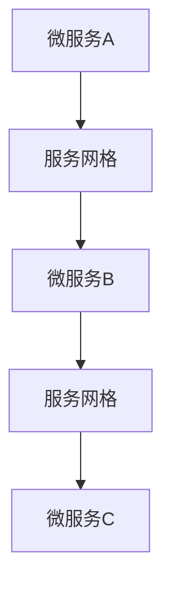

                 

 **关键词**：服务网格、Istio、微服务、分布式系统、服务发现、负载均衡、安全、监控。

**摘要**：随着微服务的广泛应用，服务网格作为一种新兴的分布式系统架构，能够有效管理微服务之间的通信，提高系统的可观测性、可靠性和安全性。本文将深入探讨服务网格的核心概念，特别是Istio作为服务网格的实施工具，其在微服务环境中的应用和优势。

## 1. 背景介绍

### 微服务的发展

随着互联网和云计算的快速发展，传统的单体应用程序逐渐被分解为更小、更灵活的模块——微服务。微服务的理念是将应用程序分解为一组独立的服务，每个服务负责完成一个特定的业务功能。这种方式带来了许多优势，如可扩展性、可维护性、灵活性和容错性。然而，微服务架构也带来了新的挑战，尤其是服务之间的通信管理。

### 服务网格的提出

服务网格（Service Mesh）是为了解决微服务通信问题而提出的架构模式。它提供了一种独立的通信层，负责管理服务之间的通信，从而减轻了服务本身的负担。服务网格的主要目标是提供服务发现、负载均衡、服务熔断、重试、超时、加密、监控等功能。

### Istio的诞生

Istio是一个开源的服务网格实现，它提供了丰富的功能，能够简化微服务的部署、管理和监控。Istio由Google、IBM和Lyft共同开发，其目标是成为服务网格领域的标准。

## 2. 核心概念与联系

### 服务网格的核心概念

服务网格的核心概念包括：

1. **服务发现**：服务网格可以动态地发现和更新服务实例的位置，从而保证服务之间的正确通信。
2. **负载均衡**：服务网格可以根据流量策略将请求分配到不同的服务实例上，提高系统的吞吐量和可用性。
3. **服务熔断**：当服务出现故障时，服务网格可以自动将流量切换到健康的服务实例，防止故障扩散。
4. **重试和超时**：服务网格提供了自动重试和超时的机制，确保请求能够在失败后得到重试。
5. **加密**：服务网格可以使用TLS加密来保护服务之间的通信。
6. **监控**：服务网格提供了丰富的监控和日志功能，帮助开发人员和服务运维团队能够实时了解系统的运行状况。

### 服务网格与微服务架构的联系

服务网格与微服务架构密切相关。微服务架构关注的是如何将应用程序分解为独立的服务，而服务网格则关注如何管理这些服务之间的通信。服务网格为微服务架构提供了以下支持：

1. **简化服务间的通信**：通过抽象化服务之间的通信，服务网格减少了服务开发的复杂度。
2. **提高系统的可观测性**：服务网格提供了丰富的监控和日志功能，使得系统运维更加方便。
3. **增强系统的可靠性**：服务网格提供了自动重试、熔断等功能，提高了系统的容错性和稳定性。
4. **保证通信的安全性**：服务网格可以使用TLS加密来保护服务之间的通信，增强系统的安全性。

### Mermaid 流程图



## 3. 核心算法原理 & 具体操作步骤

### 3.1 算法原理概述

服务网格的核心算法主要包括服务发现、负载均衡和流量管理。以下是这些算法的基本原理：

1. **服务发现**：服务网格通过服务注册中心和DNS服务来实现服务发现。当服务实例启动时，它会将自己的IP地址和端口号注册到服务注册中心，其他服务可以通过DNS查询来获取服务实例的位置。
2. **负载均衡**：服务网格使用轮询、随机、最小连接数等策略来分配请求到不同的服务实例。这样可以保证每个实例的负载均衡，提高系统的吞吐量。
3. **流量管理**：服务网格提供了流量规则和策略，允许开发人员和服务运维团队能够动态地调整流量分配。例如，可以将部分流量切换到新版本的服务实例，进行灰度发布。

### 3.2 算法步骤详解

1. **服务发现**
   - 当服务实例启动时，它将自己的IP地址和端口号注册到服务注册中心。
   - 其他服务实例通过DNS查询服务注册中心来获取服务实例的位置。

2. **负载均衡**
   - 当请求到达服务网格时，服务网格会根据负载均衡策略选择一个服务实例。
   - 请求被转发到选中的服务实例。

3. **流量管理**
   - 开发人员或运维团队可以定义流量规则，指定哪些请求应该被转发到哪个服务实例。
   - 服务网格会根据这些规则和策略来管理流量。

### 3.3 算法优缺点

**优点**：

1. **简化服务开发**：服务网格抽象化了服务之间的通信，减少了服务的开发复杂度。
2. **提高系统的可观测性**：服务网格提供了丰富的监控和日志功能，使得系统运维更加方便。
3. **增强系统的可靠性**：服务网格提供了自动重试、熔断等功能，提高了系统的容错性和稳定性。

**缺点**：

1. **引入额外的复杂性**：服务网格虽然简化了服务间的通信，但同时也引入了新的组件和配置。
2. **性能开销**：服务网格的负载均衡和流量管理功能可能会引入一定的性能开销。

### 3.4 算法应用领域

服务网格主要应用于以下领域：

1. **微服务架构**：服务网格能够简化微服务之间的通信，提高系统的可观测性和可靠性。
2. **分布式系统**：服务网格适用于分布式系统，尤其是跨数据中心的分布式系统。

## 4. 数学模型和公式 & 详细讲解 & 举例说明

### 4.1 数学模型构建

在服务网格中，负载均衡算法通常基于以下数学模型：

$$
\text{SelectServer} = \frac{\text{ServerWeight}}{\sum_{i=1}^{N} \text{ServerWeight}_i}
$$

其中，$N$ 是服务实例的数量，$\text{ServerWeight}_i$ 是第 $i$ 个服务实例的权重。

### 4.2 公式推导过程

负载均衡算法的目标是选择一个服务实例来处理请求，使得所有实例的负载尽量均衡。为了实现这个目标，我们可以使用比例分配法来计算每个服务实例的权重。

### 4.3 案例分析与讲解

假设有 3 个服务实例，权重分别为 1、2 和 3。那么，根据上述公式，选择服务实例的概率如下：

$$
\text{SelectServer1} = \frac{1}{1+2+3} = \frac{1}{6}
$$

$$
\text{SelectServer2} = \frac{2}{1+2+3} = \frac{2}{6}
$$

$$
\text{SelectServer3} = \frac{3}{1+2+3} = \frac{3}{6}
$$

这意味着，选择第 1 个服务实例的概率是 $\frac{1}{6}$，选择第 2 个服务实例的概率是 $\frac{2}{6}$，选择第 3 个服务实例的概率是 $\frac{3}{6}$。

## 5. 项目实践：代码实例和详细解释说明

### 5.1 开发环境搭建

在开始实践之前，我们需要搭建一个基于Istio的服务网格环境。以下是一个简单的步骤：

1. 安装Kubernetes集群。
2. 安装Istio控制平面。
3. 部署示例微服务。

### 5.2 源代码详细实现

以下是使用Istio管理微服务通信的示例代码：

```yaml
# Istio的流量规则示例
apiVersion: networking.istio.io/v1alpha3
kind: VirtualService
metadata:
  name: productpage
spec:
  hosts:
  - productpage.svc.cluster.local
  http:
  - match:
    - uri:
        prefix: /productpage
    route:
    - destination:
        host: productpage
        subset: v1
  - match:
    - uri:
        prefix: /detail
    route:
    - destination:
        host: productpage
        subset: v2

# Istio的服务发现配置
apiVersion: discovery.istio.io/v1alpha1
kind: ServiceEntry
metadata:
  name: productpage-service-entry
spec:
  hosts:
  - productpage.svc.cluster.local
  addresses:
  - 192.168.1.1
  ports:
  - number: 80
  location: GLOBAL
```

### 5.3 代码解读与分析

在这个示例中，我们定义了一个Istio的VirtualService，它规定了如何路由流量到不同的服务实例。通过修改这些规则，我们可以实现灰度发布、A/B测试等高级功能。

### 5.4 运行结果展示

运行上述配置后，我们可以使用kubectl命令行工具来验证服务网格的工作情况。例如，我们可以使用以下命令来检查VirtualService的状态：

```shell
kubectl get virtualservices
```

输出结果将显示我们定义的VirtualService。

## 6. 实际应用场景

### 6.1 在金融行业的应用

在金融行业，服务网格被广泛应用于交易系统、风险管理系统等关键业务系统中。它提供了高效、安全的通信层，确保系统之间的数据传输可靠且高效。

### 6.2 在电子商务的应用

在电子商务领域，服务网格被用于管理订单处理、库存管理、用户服务等关键功能。它提供了负载均衡和故障转移的功能，确保系统在高并发场景下依然能够稳定运行。

### 6.3 在物联网的应用

在物联网领域，服务网格被用于管理大量设备的通信。它提供了设备发现、流量管理和安全通信等功能，确保物联网系统能够高效、安全地运行。

### 6.4 未来应用展望

随着分布式系统的广泛应用，服务网格将成为企业级应用架构的核心组件。未来的服务网格将更加智能化，能够自动调整流量策略、进行自我修复，并提供更丰富的监控和日志功能。

## 7. 工具和资源推荐

### 7.1 学习资源推荐

- 《服务网格：设计与实现》
- 《微服务设计》
- Kubernetes官方文档

### 7.2 开发工具推荐

- Istio官方文档
- Kubectl命令行工具

### 7.3 相关论文推荐

- "Service Mesh: A Modern Approach to Service Composition"
- "The Principles of Service Mesh Architecture"

## 8. 总结：未来发展趋势与挑战

### 8.1 研究成果总结

服务网格作为一种新兴的架构模式，已经在微服务和分布式系统中得到了广泛应用。它为微服务架构提供了高效、安全的通信层，显著提高了系统的可观测性、可靠性和安全性。

### 8.2 未来发展趋势

未来的服务网格将更加智能化、自动化。它将集成人工智能技术，实现自我优化、自我修复等功能。同时，服务网格将与其他新技术（如区块链、边缘计算等）深度融合，为更复杂的分布式系统提供支持。

### 8.3 面临的挑战

尽管服务网格具有许多优势，但它在实践中也面临着一些挑战。首先，服务网格引入了额外的复杂性，增加了系统的运维难度。其次，服务网格的性能开销可能会影响系统的吞吐量。最后，服务网格的安全性仍然是一个重要的问题，需要不断改进和加强。

### 8.4 研究展望

随着分布式系统的不断演进，服务网格将在未来扮演越来越重要的角色。未来的研究应重点关注如何简化服务网格的部署和管理、如何提高其性能和安全性，以及如何将其与其他新技术相结合，为更复杂的分布式系统提供支持。

## 9. 附录：常见问题与解答

### Q: 如何选择合适的负载均衡策略？

A: 选择合适的负载均衡策略需要考虑系统的具体需求。常见的策略包括轮询、随机、最小连接数等。轮询策略简单易用，但可能导致部分服务实例负载不均。随机策略能够提供更好的负载均衡效果，但可能不如最小连接数策略稳定。最小连接数策略根据当前连接数来分配请求，能够提供更稳定的负载均衡效果。

### Q: 服务网格是否会降低系统的性能？

A: 服务网格确实可能会引入一定的性能开销，特别是在处理大量请求时。然而，这种开销通常是可接受的。通过优化服务网格的配置和使用高效的服务网格实现（如Istio），可以在保证系统性能的同时，充分利用服务网格的优势。

### Q: 服务网格如何保证通信的安全性？

A: 服务网格通常使用TLS加密来保护服务之间的通信。通过配置适当的证书和密钥，服务网格可以确保服务之间的通信是加密且安全的。此外，服务网格还提供了丰富的安全策略，如访问控制、网络隔离等，进一步保障系统的安全性。

---

**作者：禅与计算机程序设计艺术 / Zen and the Art of Computer Programming**

