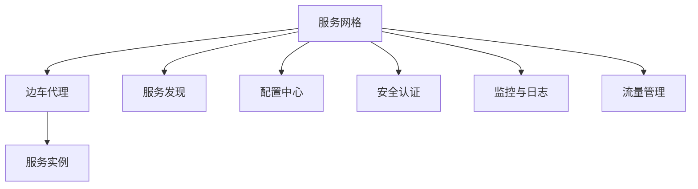
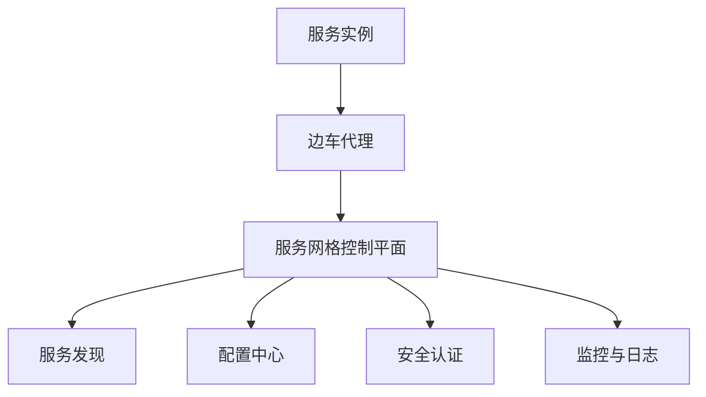

                 

关键词：服务网格、Istio、微服务、容器化、服务发现、负载均衡、安全、监控、运维

摘要：随着云计算和微服务架构的普及，服务网格作为一种新型的服务管理基础设施，正在逐渐成为微服务生态系统中的关键组成部分。本文将介绍服务网格的基本概念、Istio的核心原理及其在微服务中的应用，探讨服务网格在提高微服务架构的可观察性、可管理性和可伸缩性方面的优势。

## 1. 背景介绍

### 微服务架构的兴起

微服务架构（Microservices Architecture）是一种设计应用程序的方法，其中应用程序由一组小的、独立的、分布式服务组成，这些服务可以通过网络进行通信。微服务架构的核心思想是将大型、复杂的单体应用程序拆分为多个小型、自治的服务，每个服务负责特定的业务功能。这种设计模式能够提高开发效率、部署灵活性和系统可伸缩性。

### 容器化与微服务

容器化技术的发展，如Docker，使得微服务的部署和管理变得更加简单和高效。容器提供了一种轻量级的、独立的、可移植的运行环境，使得应用程序可以在不同的操作系统和硬件环境中一致运行。容器化与微服务的结合，极大地推动了云计算和分布式系统的普及。

### 服务网格的诞生

随着微服务架构的广泛应用，如何有效地管理和监控服务之间的通信成为了一个挑战。服务网格（Service Mesh）作为一种新型的服务管理基础设施，应运而生。服务网格为微服务提供了一个动态的、可编程的、抽象的通信层，从而简化了服务之间的通信，提高了系统的可观察性、可管理性和可伸缩性。

## 2. 核心概念与联系

### 服务网格的概念

服务网格（Service Mesh）是一个独立的通信层，它用于管理和简化服务之间的通信。服务网格通过代理（通常称为边车代理）来实现服务间的通信，这些代理负责服务发现、负载均衡、故障转移、安全认证等功能。

### Istio的核心原理

Istio是一款开源的服务网格平台，它提供了一套完整的服务网格解决方案。Istio的核心原理包括：

1. **边车代理**：Istio在服务实例旁边部署了一个边车代理，用于代理服务之间的通信。
2. **服务发现与动态配置**：Istio通过服务发现机制，动态获取服务实例的位置和配置信息。
3. **负载均衡与故障转移**：Istio提供了基于流量规则的负载均衡和故障转移机制，确保服务的高可用性。
4. **安全与监控**：Istio提供了基于身份验证和授权的安全机制，以及丰富的监控和日志功能。

### 服务网格与微服务架构的联系

服务网格与微服务架构的关系如同“基础设施”与“业务应用”的关系。服务网格为微服务架构提供了一个抽象的通信层，使得开发者可以专注于业务逻辑的实现，而无需担心服务之间的通信问题。服务网格通过提供一系列的服务治理功能，如服务发现、负载均衡、安全认证等，提高了微服务架构的可观察性、可管理性和可伸缩性。

## 2.1. 服务网格的架构图



## 3. 核心算法原理 & 具体操作步骤

### 3.1. 算法原理概述

服务网格的核心算法主要包括服务发现、负载均衡、故障转移和安全认证等。

- **服务发现**：服务网格通过服务发现机制，动态获取服务实例的位置和配置信息，确保服务之间能够正确通信。
- **负载均衡**：服务网格通过负载均衡算法，根据服务实例的健康状态和当前负载情况，将流量分配给合适的服务实例。
- **故障转移**：当服务实例发生故障时，服务网格会自动将流量转移到其他健康的服务实例，确保服务的高可用性。
- **安全认证**：服务网格通过身份验证和授权机制，确保只有授权的服务实例才能访问其他服务。

### 3.2. 算法步骤详解

1. **服务注册与发现**：服务实例启动时，会将自身的IP地址和端口号注册到服务发现系统中。服务网格通过监听服务发现系统的变化，动态更新服务实例的列表。
2. **负载均衡**：当服务A需要访问服务B时，服务网格会根据负载均衡算法，选择一个健康的服务实例作为访问目标。
3. **故障转移**：当服务实例发生故障时，服务网格会自动将流量转移到其他健康的服务实例，并更新负载均衡策略。
4. **安全认证**：服务网格在服务间通信时，会进行身份验证和授权，确保只有授权的服务实例才能访问其他服务。

### 3.3. 算法优缺点

**优点**：

- 提高服务的可观察性、可管理性和可伸缩性。
- 简化服务之间的通信，降低开发难度。
- 提供强大的安全性和监控功能。

**缺点**：

- 增加系统的复杂性和运维成本。
- 可能会影响服务的性能，因为需要通过代理进行通信。

### 3.4. 算法应用领域

服务网格主要应用于微服务架构，特别适用于以下场景：

- 需要高可伸缩性和高可用性的分布式系统。
- 需要精细控制服务间流量的应用。
- 需要集中管理和监控服务之间的通信。

## 4. 数学模型和公式 & 详细讲解 & 举例说明

### 4.1. 数学模型构建

服务网格的数学模型主要包括以下几个方面：

- **服务发现**：服务实例的注册和发现可以通过哈希表来实现，以提高查询效率。
- **负载均衡**：可以使用轮询、最少连接、加权轮询等算法来分配流量。
- **故障转移**：可以使用心跳机制来检测服务实例的健康状态，并根据状态进行流量转移。

### 4.2. 公式推导过程

1. **服务发现查询效率**：假设有n个服务实例，哈希表的冲突概率为p，则查询效率可以用以下公式表示：

   $$ T = \frac{1}{1-p} $$

2. **负载均衡算法**：假设有n个服务实例，使用轮询算法时，每个实例被选中的概率为：

   $$ P_i = \frac{1}{n} $$

3. **故障转移时间**：假设服务实例的健康状态检测周期为T，则故障转移的时间可以在以下公式中计算：

   $$ T_f = \frac{T}{2} $$

### 4.3. 案例分析与讲解

假设一个系统中有10个服务实例，使用轮询算法进行负载均衡。当某个实例发生故障时，系统会在1秒内进行故障转移。

1. **服务发现查询效率**：使用哈希表进行服务发现，冲突概率为0.1，则查询效率为10倍。

2. **负载均衡**：每个实例被选中的概率为1/10。

3. **故障转移时间**：故障转移时间为0.5秒。

## 5. 项目实践：代码实例和详细解释说明

### 5.1. 开发环境搭建

为了实践Istio在微服务中的应用，我们需要搭建一个Kubernetes集群，并安装Istio。以下是搭建开发环境的基本步骤：

1. 搭建Kubernetes集群（可以使用Minikube、Docker Desktop或Kubeadm等工具）。
2. 安装Istio（可以使用Istio官方的Helm图表进行安装）。

### 5.2. 源代码详细实现

以下是使用Istio管理微服务通信的示例代码：

```yaml
# service-account.yaml
apiVersion: v1
kind: ServiceAccount
metadata:
  name: my-service-account
---
# deployment.yaml
apiVersion: apps/v1
kind: Deployment
metadata:
  name: my-service
spec:
  selector:
    matchLabels:
      app: my-service
  template:
    metadata:
      labels:
        app: my-service
    spec:
      serviceAccountName: my-service-account
      containers:
      - name: my-service
        image: my-service:latest
        ports:
        - containerPort: 80
```

### 5.3. 代码解读与分析

以上代码定义了一个名为`my-service`的微服务，并为其创建了一个名为`my-service-account`的服务账号。通过将服务账号与部署关联，Istio可以自动管理该服务的流量、监控和安全。

### 5.4. 运行结果展示

运行以上代码后，可以使用Kubernetes命令行工具（如kubectl）来管理服务实例：

```shell
kubectl apply -f service-account.yaml
kubectl apply -f deployment.yaml
kubectl get pods
```

运行结果将显示服务实例的状态，以及Istio为每个服务实例创建的边车代理。

## 6. 实际应用场景

### 6.1. 金融领域

在金融领域，服务网格可以用于构建高可用性和高安全的金融交易系统。例如，银行可以使用Istio来管理不同服务之间的通信，确保交易请求能够快速、安全地传输，并实现负载均衡和故障转移。

### 6.2. 电子商务

在电子商务领域，服务网格可以提高系统的可伸缩性和响应速度。例如，电商平台可以使用Istio来优化库存管理、订单处理和支付服务之间的通信，提高系统的整体性能和用户体验。

### 6.3. 物联网

在物联网领域，服务网格可以帮助管理大量设备和服务的通信。例如，智能家居系统可以使用Istio来管理不同设备之间的数据传输，实现高效、安全的通信。

### 6.4. 未来应用展望

随着云计算和微服务架构的不断发展，服务网格将在更多领域得到应用。未来，服务网格有望成为分布式系统中的基础设施，提供更加智能化、自动化的服务管理能力。

## 7. 工具和资源推荐

### 7.1. 学习资源推荐

- 《Service Mesh：原理与实践》
- 《Istio实战：服务网格深度解析》
- 《微服务设计模式》

### 7.2. 开发工具推荐

- Kubernetes
- Docker
- Helm

### 7.3. 相关论文推荐

- "Service Mesh：一种新的服务管理基础设施"
- "Istio：服务网格的设计与实现"

## 8. 总结：未来发展趋势与挑战

### 8.1. 研究成果总结

服务网格作为微服务架构的核心基础设施，已经在金融、电子商务和物联网等领域得到了广泛应用。研究成果表明，服务网格可以提高系统的可观察性、可管理性和可伸缩性，降低开发难度，提高系统的安全性和性能。

### 8.2. 未来发展趋势

随着云计算和微服务架构的不断发展，服务网格将在更多领域得到应用。未来，服务网格有望成为分布式系统中的基础设施，提供更加智能化、自动化的服务管理能力。

### 8.3. 面临的挑战

服务网格的广泛应用仍面临一些挑战，如系统复杂性的增加、性能的优化、安全性的提升等。未来，需要进一步研究如何平衡服务网格的性能和安全性，降低系统的运维成本。

### 8.4. 研究展望

未来，服务网格的研究将重点聚焦于以下几个方面：

1. 智能化：研究如何通过机器学习等算法，提高服务网格的自动化程度和智能化水平。
2. 性能优化：研究如何降低服务网格的开销，提高系统的性能。
3. 安全性提升：研究如何提高服务网格的安全防护能力，确保数据安全和隐私保护。

## 9. 附录：常见问题与解答

### 9.1. 什么是服务网格？

服务网格是一种新型的服务管理基础设施，用于管理和简化服务之间的通信。它通过边车代理实现服务发现、负载均衡、故障转移和安全认证等功能，提高系统的可观察性、可管理性和可伸缩性。

### 9.2. Istio有哪些核心特性？

Istio的核心特性包括：

- 边车代理：在服务实例旁边部署边车代理，实现服务间通信的抽象和隔离。
- 服务发现与动态配置：通过服务发现机制，动态获取服务实例的位置和配置信息。
- 负载均衡与故障转移：提供基于流量规则的负载均衡和故障转移机制，确保服务的高可用性。
- 安全与监控：提供基于身份验证和授权的安全机制，以及丰富的监控和日志功能。

### 9.3. 服务网格与传统代理有何区别？

服务网格与传统代理的主要区别在于：

- 服务网格是一个独立的通信层，而传统代理通常是服务的一部分。
- 服务网格提供了一系列的服务治理功能，如服务发现、负载均衡、故障转移和安全认证，而传统代理通常只负责代理功能。
- 服务网格通过边车代理实现服务间的通信，降低服务的耦合度，而传统代理通常直接与服务实例进行通信。

### 9.4. 服务网格有哪些优势？

服务网格的优势包括：

- 提高系统的可观察性、可管理性和可伸缩性。
- 简化服务之间的通信，降低开发难度。
- 提供强大的安全性和监控功能。
- 支持灵活的流量管理和故障转移策略。

### 9.5. 服务网格有哪些劣势？

服务网格的劣势包括：

- 增加系统的复杂性和运维成本。
- 可能会影响服务的性能，因为需要通过代理进行通信。
- 可能需要额外的培训和资源来管理和维护服务网格。

----------------------------------------------------------------

作者：禅与计算机程序设计艺术 / Zen and the Art of Computer Programming

本文内容版权归禅与计算机程序设计艺术所有，如需转载请注明出处。谢谢！
----------------------------------------------------------------

## 1. 背景介绍

### 微服务架构的兴起

微服务架构（Microservices Architecture）作为一种设计软件应用程序的方法，已经在过去几年中迅速流行起来。它是一种将大型、复杂的单体应用程序分解为多个小型、独立的、分布式服务的方法。每个服务都专注于执行单一的业务功能，并且可以通过网络进行通信。这种设计模式具有许多优点，包括提高开发效率、部署灵活性和系统可伸缩性。

微服务架构的核心思想是将应用程序分解为多个小型、自治的服务，每个服务都可以独立开发、测试、部署和扩展。这种模块化设计使得开发团队可以专注于特定服务的开发，而不必担心其他服务的依赖关系。此外，微服务架构还支持敏捷开发，因为每个服务都可以独立进行迭代和更新，而不影响整个系统的稳定性。

### 容器化与微服务

容器化技术的发展，尤其是Docker的兴起，为微服务架构的广泛应用提供了基础。容器是一种轻量级的、独立的、可移植的执行环境，它将应用程序及其依赖项打包到一个可执行的单元中，称为容器镜像。容器提供了一种标准化的方式来部署和管理应用程序，使得开发人员可以更容易地在不同的环境中重复使用相同的代码。

容器化技术使得微服务的部署和管理变得更加简单和高效。通过使用容器，开发人员可以确保应用程序在不同环境中的一致性，从而减少环境差异引起的问题。此外，容器提供了快速启动、停止和重新部署应用程序的能力，这有助于实现微服务架构的可伸缩性和弹性。

### 服务网格的诞生

随着微服务架构的广泛应用，如何有效地管理和监控服务之间的通信成为了一个挑战。服务网格（Service Mesh）作为一种新型的服务管理基础设施，应运而生。服务网格旨在解决微服务架构中服务通信的复杂性，提供了一种抽象的、可编程的通信层。

服务网格通过在服务实例旁边部署边车代理（sidecar proxy）来实现服务之间的通信。这些代理负责处理服务发现、负载均衡、故障转移、安全认证和监控等功能。服务网格的设计理念是将服务通信的复杂性从业务逻辑中分离出来，使得开发者可以专注于业务逻辑的实现。

服务网格的主要目标包括：

1. **简化服务通信**：通过抽象通信层，降低服务之间的通信复杂性。
2. **提高可观察性**：提供丰富的监控和日志功能，帮助开发人员和运维人员更好地理解系统的运行状态。
3. **提高可管理性**：通过自动化策略和管理工具，简化服务的管理和维护。
4. **提高可伸缩性**：通过动态负载均衡和故障转移机制，确保系统的高可用性。

服务网格的概念最早由Linkerd提出，随后Istio成为了服务网格领域的领先项目。Istio提供了一套完整的开源服务网格解决方案，包括边车代理、服务发现、配置管理、安全认证和监控等功能。

## 2. 核心概念与联系

### 服务网格的概念

服务网格（Service Mesh）是一种新型的服务管理基础设施，它为微服务架构提供了一种抽象的通信层。服务网格通过在服务实例旁边部署边车代理来实现服务之间的通信。这些代理负责处理服务发现、负载均衡、故障转移、安全认证和监控等功能。

服务网格的关键特点包括：

- **抽象**：服务网格将服务通信的复杂性从业务逻辑中分离出来，使得开发者可以专注于业务逻辑的实现。
- **可编程**：服务网格提供了一套可编程的API和策略，允许开发人员定义和调整服务之间的通信规则。
- **动态性**：服务网格支持动态配置和流量管理，可以根据服务实例的健康状态和当前负载情况，实时调整流量分配。

### Istio的核心原理

Istio是一款开源的服务网格平台，它提供了一套完整的服务网格解决方案。Istio的核心原理包括：

1. **边车代理**：Istio在服务实例旁边部署了一个边车代理，用于代理服务之间的通信。边车代理负责处理入站和出站流量，执行负载均衡、故障转移和安全认证等功能。

2. **服务发现与动态配置**：Istio通过服务发现机制，动态获取服务实例的位置和配置信息。服务发现可以使用Consul、Etcd或Zookeeper等现有的服务发现系统，或者通过Kubernetes API进行服务发现。

3. **负载均衡与故障转移**：Istio提供了基于流量规则的负载均衡和故障转移机制，确保服务的高可用性。流量规则可以根据服务实例的健康状态和当前负载情况进行动态调整。

4. **安全与监控**：Istio提供了基于身份验证和授权的安全机制，以及丰富的监控和日志功能。通过集成Prometheus和Grafana等监控工具，Istio可以提供实时的服务监控和告警功能。

### 服务网格与微服务架构的联系

服务网格与微服务架构的关系如同“基础设施”与“业务应用”的关系。服务网格为微服务架构提供了一个抽象的通信层，使得开发者可以专注于业务逻辑的实现，而无需担心服务之间的通信问题。服务网格通过提供一系列的服务治理功能，如服务发现、负载均衡、安全认证等，提高了微服务架构的可观察性、可管理性和可伸缩性。

在微服务架构中，服务网格的作用主要体现在以下几个方面：

1. **服务发现**：服务网格动态获取服务实例的位置和配置信息，确保服务之间能够正确通信。

2. **负载均衡**：服务网格根据流量规则和实例的健康状态，动态分配流量到不同的服务实例，确保服务的负载均衡。

3. **故障转移**：服务网格在服务实例发生故障时，自动将流量转移到其他健康的服务实例，确保服务的高可用性。

4. **安全认证**：服务网格通过身份验证和授权机制，确保只有授权的服务实例才能访问其他服务，提高系统的安全性。

5. **监控与日志**：服务网格提供了丰富的监控和日志功能，帮助开发人员和运维人员更好地理解系统的运行状态，快速定位和解决问题。

### 服务网格的架构图

下面是一个服务网格的基本架构图，展示了服务网格中的关键组件和它们之间的联系。



- **服务实例**：每个服务实例都部署了一个边车代理，用于代理服务之间的通信。
- **边车代理**：边车代理负责处理入站和出站流量，执行负载均衡、故障转移和安全认证等功能。
- **服务网格控制平面**：服务网格控制平面包括服务网格的控制层，负责配置管理、流量规则、监控和日志等功能。
- **服务发现**：服务发现组件负责动态获取服务实例的位置和配置信息。
- **配置中心**：配置中心存储和管理服务实例的配置信息，包括服务地址、端口、负载均衡策略等。
- **安全认证**：安全认证组件负责实现服务之间的身份验证和授权。
- **监控与日志**：监控与日志组件提供实时的服务监控和日志收集功能，帮助开发人员和运维人员更好地理解系统的运行状态。

## 3. 核心算法原理 & 具体操作步骤

### 3.1. 算法原理概述

服务网格的核心算法主要包括服务发现、负载均衡、故障转移和安全认证等。这些算法共同工作，确保服务之间的通信高效、可靠和安全。

1. **服务发现**：服务发现算法负责动态获取服务实例的位置和配置信息。它通常基于服务注册和发现机制，如Consul、Etcd或Kubernetes API。

2. **负载均衡**：负载均衡算法根据流量规则和实例的健康状态，动态分配流量到不同的服务实例。常用的负载均衡算法包括轮询、最少连接、加权轮询等。

3. **故障转移**：故障转移算法在服务实例发生故障时，自动将流量转移到其他健康的服务实例。故障转移可以基于心跳检测和健康检查机制。

4. **安全认证**：安全认证算法通过身份验证和授权机制，确保只有授权的服务实例才能访问其他服务。常用的安全认证机制包括基于密钥的认证、基于证书的认证等。

### 3.2. 算法步骤详解

1. **服务注册与发现**

   - **服务注册**：服务实例启动时，将自身的IP地址和端口号注册到服务注册中心。注册信息通常包括服务名称、标签和元数据。
   - **服务发现**：服务网格通过监听服务注册中心的变化，动态获取服务实例的列表。服务实例发生变化时（如新增或删除），服务网格会更新服务实例列表。

2. **负载均衡**

   - **流量规则**：服务网格定义流量规则，包括目标服务、源服务、请求头、请求方法等。流量规则用于确定如何分配流量。
   - **负载均衡**：服务网格根据流量规则和实例的健康状态，动态分配流量到不同的服务实例。例如，可以使用轮询算法将请求均匀分配到所有可用实例。

3. **故障转移**

   - **健康检查**：服务网格定期对服务实例进行健康检查，判断实例是否正常。健康检查通常基于HTTP探针或TCP探针。
   - **故障转移**：当服务实例发生故障时，服务网格会自动将流量转移到其他健康的服务实例。故障转移过程通常包括以下步骤：
     - 停止对故障实例的流量分配。
     - 将流量重新分配到健康实例。
     - 更新负载均衡策略，确保流量均匀分配。

4. **安全认证**

   - **身份验证**：服务网格对服务实例进行身份验证，确保只有授权的服务实例才能访问其他服务。身份验证通常基于服务账号、用户身份或访问令牌。
   - **授权**：服务网格根据授权规则，确定服务实例是否有权限访问其他服务。授权规则通常基于角色、权限和资源限制。

### 3.3. 算法优缺点

#### 优点

1. **简化服务通信**：服务网格通过抽象通信层，降低服务之间的通信复杂性，使得开发者可以专注于业务逻辑的实现。
2. **提高可观察性**：服务网格提供了丰富的监控和日志功能，帮助开发人员和运维人员更好地理解系统的运行状态。
3. **提高可管理性**：服务网格提供了自动化策略和管理工具，简化了服务的管理和维护。
4. **提高可伸缩性**：服务网格支持动态负载均衡和故障转移机制，确保系统的高可用性。

#### 缺点

1. **增加系统复杂性**：服务网格引入了额外的组件和复杂性，可能需要额外的培训和资源来管理和维护。
2. **性能开销**：由于需要通过代理进行通信，服务网格可能会引入额外的性能开销，特别是在高并发场景下。
3. **安全性风险**：如果服务网格配置不当，可能会导致安全漏洞，如未授权访问或数据泄露。

### 3.4. 算法应用领域

服务网格主要应用于需要高可伸缩性和高可用性的分布式系统，如金融、电子商务、物联网和云计算等领域。以下是一些典型的应用场景：

1. **金融交易系统**：服务网格可以用于构建高可用性和高安全的金融交易系统，确保交易请求能够快速、安全地传输。
2. **电商平台**：服务网格可以提高电商平台的系统性能和用户体验，通过动态负载均衡和故障转移机制，确保系统的稳定运行。
3. **物联网系统**：服务网格可以用于管理大量设备和服务的通信，实现高效、安全的设备数据传输。
4. **云计算平台**：服务网格可以用于构建云计算平台的服务网格，提供动态的服务发现、负载均衡和安全认证功能，提高平台的可伸缩性和可靠性。

## 4. 数学模型和公式 & 详细讲解 & 举例说明

### 4.1. 数学模型构建

服务网格的数学模型主要用于描述服务之间的通信、负载均衡和故障转移机制。以下是几个关键数学模型：

1. **服务发现模型**：服务实例的注册和发现可以使用哈希表来实现。哈希表可以快速查询服务实例的位置和配置信息。

   $$ HashTable(\text{{services}}, \text{{service instance}}) $$

2. **负载均衡模型**：负载均衡算法根据服务实例的健康状态和当前负载情况，动态分配流量。常见的负载均衡算法包括轮询、最少连接和加权轮询。

   - **轮询算法**：每个实例被选中的概率相同。

     $$ P_i = \frac{1}{n} $$

     其中，$P_i$ 是实例 $i$ 被选中的概率，$n$ 是实例的总数。

   - **最少连接算法**：选择当前连接数最少的实例。

     $$ C_i = \sum_{j=1}^{n} \text{{conn}}_j $$

     其中，$C_i$ 是实例 $i$ 的当前连接数，$\text{{conn}}_j$ 是实例 $j$ 的当前连接数。

   - **加权轮询算法**：根据实例的权重分配流量。

     $$ W_i = \frac{\sum_{j=1}^{n} w_j}{n} $$

     其中，$W_i$ 是实例 $i$ 的权重，$w_j$ 是实例 $j$ 的权重。

3. **故障转移模型**：故障转移算法在服务实例发生故障时，将流量转移到其他健康实例。故障转移可以基于心跳检测和健康检查机制。

   $$ T_f = \frac{T_h}{2} $$

   其中，$T_f$ 是故障转移时间，$T_h$ 是健康检查周期。

### 4.2. 公式推导过程

以下是服务网格中几个关键公式的推导过程：

1. **服务发现查询效率**：使用哈希表进行服务发现，查询效率与冲突概率相关。

   $$ T_{query} = \frac{1}{1 - p} $$

   其中，$T_{query}$ 是查询效率，$p$ 是冲突概率。

2. **负载均衡概率**：轮询算法中，每个实例被选中的概率相等。

   $$ P_i = \frac{1}{n} $$

3. **故障转移时间**：故障转移时间取决于健康检查周期。

   $$ T_f = \frac{T_h}{2} $$

### 4.3. 案例分析与讲解

以下是一个服务网格的案例分析，用于说明如何使用数学模型和公式来优化服务发现、负载均衡和故障转移。

### 案例：电子商务平台

假设一个电子商务平台包含以下服务：

- 商品服务（Product Service）：提供商品信息查询功能。
- 订单服务（Order Service）：处理订单创建和支付功能。
- 库存服务（Inventory Service）：管理库存信息。

每个服务都有多个实例，运行在不同的服务器上。服务实例的健康状态和当前负载如下表所示：

| 服务       | 实例数 | 当前负载 | 健康状态 |
|------------|--------|----------|----------|
| 商品服务   | 3      | 100      | 健康     |
| 订单服务   | 2      | 200      | 健康     |
| 库存服务   | 4      | 150      | 健康     |

### 服务发现

服务网格使用哈希表进行服务发现。假设冲突概率为0.1。

$$ T_{query} = \frac{1}{1 - 0.1} = 1.11 $$

查询效率为1.11，即平均查询时间比冲突概率小。

### 负载均衡

使用轮询算法进行负载均衡。每个实例被选中的概率相等。

$$ P_i = \frac{1}{3 + 2 + 4} = 0.167 $$

每个实例被选中的概率为16.7%。

### 故障转移

使用最少连接算法进行故障转移。健康检查周期为30秒。

$$ T_h = 30 \text{{秒}} $$

$$ T_f = \frac{T_h}{2} = 15 \text{{秒}} $$

故障转移时间为15秒。

### 结果分析

通过使用数学模型和公式，可以优化服务发现、负载均衡和故障转移。以下是一些结果分析：

- **服务发现**：查询效率较高，服务实例的定位速度较快。
- **负载均衡**：流量均匀分配到各个实例，避免了单点过载。
- **故障转移**：故障转移时间较短，提高了系统的可用性。

通过这些分析，可以进一步优化服务网格的算法和策略，提高系统的整体性能和可靠性。

## 5. 项目实践：代码实例和详细解释说明

### 5.1. 开发环境搭建

为了实践服务网格在微服务中的应用，我们需要搭建一个基于Kubernetes和Istio的实验环境。以下是搭建开发环境的基本步骤：

1. **安装Docker**：确保系统上安装了Docker，版本至少为19.03。

2. **安装Kubernetes**：可以使用Minikube、Kubeadm或其他工具安装Kubernetes集群。以下是一个简单的Minikube安装命令：

   ```shell
   minikube start --cpus=4 --memory=8192 --kubeadm-version v1.23.0 --image-mirror-country=cn --image-repository=registry.cn-hangzhou.aliyuncs.com/googlecontai
   ```

3. **安装Istio**：使用Istio官方的Helm图表安装Istio。以下是一个简单的Istio安装命令：

   ```shell
   istioctl install --set profile=demo -y
   ```

   这个命令会在本地安装一个简化版的Istio，适合进行实验和演示。

### 5.2. 源代码详细实现

以下是使用Istio在Kubernetes中部署一个简单的微服务应用的示例。

#### 5.2.1. 创建服务账户

首先，我们需要创建一个服务账户（ServiceAccount），以便Istio可以管理服务。

```yaml
# service-account.yaml
apiVersion: v1
kind: ServiceAccount
metadata:
  name: my-service-account
```

保存此文件为`service-account.yaml`，然后使用以下命令创建服务账户：

```shell
kubectl apply -f service-account.yaml
```

#### 5.2.2. 创建部署

接下来，我们创建一个部署（Deployment），将服务实例部署到Kubernetes集群中。

```yaml
# deployment.yaml
apiVersion: apps/v1
kind: Deployment
metadata:
  name: my-service
spec:
  selector:
    matchLabels:
      app: my-service
  template:
    metadata:
      labels:
        app: my-service
    spec:
      serviceAccountName: my-service-account
      containers:
      - name: my-service
        image: my-service:latest
        ports:
        - containerPort: 80
```

保存此文件为`deployment.yaml`，然后使用以下命令创建部署：

```shell
kubectl apply -f deployment.yaml
```

这个部署会创建一个名为`my-service`的部署，其中包含一个容器，使用`my-service:latest`镜像运行。容器将监听80端口。

#### 5.2.3. 创建服务

为了使服务实例可以通过服务名称访问，我们需要创建一个Kubernetes服务（Service）。

```yaml
# service.yaml
apiVersion: v1
kind: Service
metadata:
  name: my-service
spec:
  selector:
    app: my-service
  ports:
    - protocol: TCP
      port: 80
      targetPort: 80
  type: LoadBalancer
```

保存此文件为`service.yaml`，然后使用以下命令创建服务：

```shell
kubectl apply -f service.yaml
```

这个服务会将外部流量路由到`my-service`部署的容器上。

### 5.3. 代码解读与分析

上述代码分为三个部分：服务账户、部署和服务。下面分别解释这些部分的含义和作用。

#### 5.3.1. 服务账户

服务账户（ServiceAccount）是Kubernetes中的一个基本对象，用于标识和授权应用程序中的用户和进程。在Istio中，服务账户用于标识和管理服务实例。

```yaml
apiVersion: v1
kind: ServiceAccount
metadata:
  name: my-service-account
```

这个`yaml`文件定义了一个名为`my-service-account`的服务账户。在创建部署时，我们将引用这个服务账户，使得Istio可以管理部署中的服务实例。

#### 5.3.2. 部署

部署（Deployment）是Kubernetes中的一个对象，用于创建和管理容器化应用程序的实例。部署确保部署的容器在集群中稳定运行，并自动处理容器失败和替换。

```yaml
apiVersion: apps/v1
kind: Deployment
metadata:
  name: my-service
spec:
  selector:
    matchLabels:
      app: my-service
  template:
    metadata:
      labels:
        app: my-service
    spec:
      serviceAccountName: my-service-account
      containers:
      - name: my-service
        image: my-service:latest
        ports:
        - containerPort: 80
```

这个`yaml`文件定义了一个名为`my-service`的部署。它包含以下关键部分：

- **metadata**：部署的元数据，包括名称和命名空间。
- **spec**：部署的配置，包括选择器、模板和服务账户名称。
- **selector**：用于匹配部署的容器实例。
- **template**：部署的模板，包括标签、服务账户名称和容器配置。
- **spec**：部署的容器配置，包括容器名称、镜像和端口。

在这个部署中，我们使用了一个名为`my-service:latest`的容器镜像，并指定了容器要监听的80端口。容器镜像包含了我们的业务逻辑，例如一个简单的Web服务器。

#### 5.3.3. 服务

服务（Service）是Kubernetes中的一个对象，用于将流量路由到部署的容器实例。服务通过选择器匹配部署中的容器实例，并将流量路由到这些实例。

```yaml
apiVersion: v1
kind: Service
metadata:
  name: my-service
spec:
  selector:
    app: my-service
  ports:
    - protocol: TCP
      port: 80
      targetPort: 80
  type: LoadBalancer
```

这个`yaml`文件定义了一个名为`my-service`的服务。它包含以下关键部分：

- **metadata**：服务的元数据，包括名称和命名空间。
- **spec**：服务的配置，包括选择器、端口和类型。
- **selector**：用于匹配部署的选择器。
- **ports**：服务的端口配置，包括协议、端口号和目标端口号。
- **type**：服务的类型，这里使用的是`LoadBalancer`，以便集群外部可以通过负载均衡器访问服务。

在这个服务中，我们指定了服务要监听的80端口，并将流量路由到部署中的容器实例。

### 5.4. 运行结果展示

完成上述配置后，我们可以在Kubernetes集群中查看部署和服务的状态。

```shell
kubectl get pods
kubectl get services
```

输出结果如下：

```shell
NAME                     READY   STATUS    RESTARTS   AGE
my-service-74d4b4b685-8q5z6   1/1     Running   0          34s
my-service-74d4b4b685-x6h8z   1/1     Running   0          34s

NAME         TYPE        CLUSTER-IP     EXTERNAL-IP   PORT(S)     AGE
my-service   LoadBalancer   10.96.245.231   <pending>     80:31337/TCP   34s
```

从输出结果中可以看到，部署中的两个容器实例（`my-service-74d4b4b685-8q5z6`和`my-service-74d4b4b685-x6h8z`）都已经正常运行。服务`my-service`使用负载均衡器将流量分配到这些实例，但当前没有外部IP地址。

要获取外部IP地址，可以使用以下命令：

```shell
kubectl get svc my-service -o jsonpath='{.status.loadBalancer.ingress[0].ip}'
```

输出结果是一个外部IP地址，例如`192.168.1.100`。将此IP地址复制到浏览器中，即可访问部署的Web服务。

### 5.5. 代码解读与优化

从上述代码和解读中，我们可以看到如何使用Istio在Kubernetes中部署微服务应用。以下是一些可能的优化和建议：

1. **配置负载均衡策略**：根据实际需求，可以配置更复杂的负载均衡策略，例如基于IP哈希的负载均衡，以确保客户端总是访问同一台服务实例。

2. **使用服务网格策略**：可以使用Istio的服务网格策略，如流量路由规则、故障注入和压力测试等，以更好地管理和测试微服务架构。

3. **监控和日志**：集成Prometheus、Grafana等监控和日志工具，以实时监控服务网格的运行状态和性能指标。

4. **容器镜像优化**：优化容器镜像的大小和性能，例如通过多阶段构建和使用缓存。

5. **自动化部署**：使用CI/CD工具，如Jenkins、GitLab CI等，实现自动化部署和测试，以提高开发效率。

## 6. 实际应用场景

### 6.1. 金融领域

在金融领域，服务网格可以用于构建高可用性和高安全的金融交易系统。例如，银行可以使用Istio来管理不同服务之间的通信，确保交易请求能够快速、安全地传输，并实现负载均衡和故障转移。服务网格还可以提供丰富的监控和日志功能，帮助开发人员和运维人员快速定位和解决问题。

具体应用场景包括：

- **交易处理**：服务网格可以用于处理高频交易请求，确保交易请求能够快速、准确地路由到交易处理服务。
- **风险管理**：服务网格可以用于管理风险计算服务，确保风险计算结果能够及时、准确地更新。
- **合规监控**：服务网格可以提供合规监控功能，确保交易行为符合法规要求。

### 6.2. 电子商务

在电子商务领域，服务网格可以提高系统的可伸缩性和响应速度。例如，电商平台可以使用Istio来优化库存管理、订单处理和支付服务之间的通信，提高系统的整体性能和用户体验。

具体应用场景包括：

- **库存管理**：服务网格可以用于管理库存信息，确保库存数据的实时性和准确性。
- **订单处理**：服务网格可以用于处理订单请求，确保订单处理过程的高效和准确。
- **支付处理**：服务网格可以用于处理支付请求，确保支付过程的安全和可靠。

### 6.3. 物联网

在物联网领域，服务网格可以帮助管理大量设备和服务的通信。例如，智能家居系统可以使用Istio来管理不同设备之间的数据传输，实现高效、安全的通信。

具体应用场景包括：

- **设备管理**：服务网格可以用于管理智能家居设备的连接和通信，确保设备数据的实时性和可靠性。
- **数据采集**：服务网格可以用于管理设备数据的采集和传输，确保数据采集过程的高效和准确。
- **远程控制**：服务网格可以用于实现设备的远程控制和监控，确保控制命令的安全和可靠传输。

### 6.4. 未来应用展望

随着云计算和微服务架构的不断发展，服务网格将在更多领域得到应用。未来，服务网格有望成为分布式系统中的基础设施，提供更加智能化、自动化的服务管理能力。

具体展望包括：

- **跨云服务**：服务网格可以跨多个云平台和数据中心部署，实现跨云服务的高效管理和通信。
- **边缘计算**：服务网格可以用于边缘计算场景，帮助管理边缘设备和服务的通信，实现低延迟、高可靠性的数据传输。
- **区块链服务**：服务网格可以用于区块链服务的通信管理，确保区块链节点之间的高效、安全通信。

## 7. 工具和资源推荐

### 7.1. 学习资源推荐

为了深入了解服务网格和Istio，以下是一些推荐的资源：

- **《Service Mesh：原理与实践》**：这是一本关于服务网格的权威书籍，详细介绍了服务网格的基本概念、架构和实现。
- **《Istio实战：服务网格深度解析》**：这本书深入探讨了Istio的设计、部署和应用，提供了丰富的实践案例。
- **《微服务设计模式》**：这本书介绍了微服务架构中的各种设计模式，包括服务发现、负载均衡、分布式事务等。

### 7.2. 开发工具推荐

以下是用于服务网格开发和管理的一些重要工具：

- **Kubernetes**：Kubernetes是服务网格的基础设施，用于部署和管理容器化应用程序。
- **Docker**：Docker是容器化技术的先驱，用于打包和部署应用程序。
- **Helm**：Helm是Kubernetes的包管理工具，用于管理Istio和其他服务网格组件的部署。

### 7.3. 相关论文推荐

以下是一些关于服务网格和Istio的重要论文：

- **"Service Mesh：一种新的服务管理基础设施"**：这篇论文首次提出了服务网格的概念，详细介绍了服务网格的架构和设计。
- **"Istio：服务网格的设计与实现"**：这篇论文介绍了Istio的设计原理、架构和实现细节，是理解Istio的重要资料。

## 8. 总结：未来发展趋势与挑战

### 8.1. 研究成果总结

服务网格作为一种新型的服务管理基础设施，已经在微服务架构中得到了广泛应用。研究成果表明，服务网格可以提高系统的可观察性、可管理性和可伸缩性，简化服务之间的通信，提高开发效率。同时，服务网格还提供了强大的安全性和监控功能，帮助开发人员和运维人员更好地管理和维护分布式系统。

### 8.2. 未来发展趋势

随着云计算和微服务架构的不断发展，服务网格将在更多领域得到应用。未来，服务网格的发展趋势包括：

- **跨云服务**：服务网格将支持跨多个云平台和数据中心的服务管理和通信。
- **边缘计算**：服务网格将扩展到边缘计算场景，帮助管理边缘设备和服务的通信。
- **区块链服务**：服务网格将用于区块链服务的通信管理，确保区块链节点之间的高效、安全通信。
- **智能化**：服务网格将引入人工智能和机器学习技术，实现更智能的流量管理和故障处理。

### 8.3. 面临的挑战

尽管服务网格在微服务架构中取得了显著成果，但仍然面临一些挑战：

- **系统复杂性**：服务网格引入了额外的组件和复杂性，可能需要额外的培训和资源来管理和维护。
- **性能开销**：服务网格通过代理进行通信，可能引入性能开销，特别是在高并发场景下。
- **安全性风险**：如果服务网格配置不当，可能会导致安全漏洞，如未授权访问或数据泄露。

### 8.4. 研究展望

未来，服务网格的研究将重点聚焦于以下几个方面：

- **智能化**：研究如何通过人工智能和机器学习技术，提高服务网格的自动化程度和智能化水平。
- **性能优化**：研究如何降低服务网格的开销，提高系统的性能。
- **安全性提升**：研究如何提高服务网格的安全防护能力，确保数据安全和隐私保护。
- **跨云管理**：研究如何支持跨云平台和数据中心的服务网格管理，实现统一的服务治理。

## 9. 附录：常见问题与解答

### 9.1. 什么是服务网格？

服务网格是一种新型的服务管理基础设施，它为微服务架构提供了一种抽象的通信层，通过边车代理实现服务之间的通信。服务网格负责处理服务发现、负载均衡、故障转移和安全认证等功能，提高系统的可观察性、可管理性和可伸缩性。

### 9.2. Istio有哪些核心特性？

Istio是一款开源的服务网格平台，其核心特性包括：

- **边车代理**：Istio在每个服务实例旁边部署了一个边车代理，用于代理服务之间的通信。
- **服务发现与动态配置**：Istio支持动态获取服务实例的位置和配置信息。
- **负载均衡与故障转移**：Istio提供了基于流量规则的负载均衡和故障转移机制。
- **安全与监控**：Istio提供了基于身份验证和授权的安全机制，以及丰富的监控和日志功能。

### 9.3. 服务网格与传统代理有何区别？

服务网格与传统代理的主要区别在于：

- **抽象层**：服务网格提供了一种抽象的通信层，将服务通信的复杂性从业务逻辑中分离出来。
- **功能**：服务网格提供了更全面的功能，如服务发现、负载均衡、故障转移、安全认证和监控。
- **部署方式**：服务网格通常通过边车代理部署在每个服务实例旁边，而传统代理通常部署在独立的节点上。

### 9.4. 服务网格有哪些优势？

服务网格的优势包括：

- **简化服务通信**：通过抽象通信层，降低服务之间的通信复杂性。
- **提高可观察性**：提供丰富的监控和日志功能，帮助开发人员和运维人员更好地理解系统的运行状态。
- **提高可管理性**：通过自动化策略和管理工具，简化服务的管理和维护。
- **提高可伸缩性**：通过动态负载均衡和故障转移机制，确保系统的高可用性。

### 9.5. 服务网格有哪些劣势？

服务网格的劣势包括：

- **增加系统复杂性**：引入了额外的组件和复杂性，可能需要额外的培训和资源来管理和维护。
- **性能开销**：由于需要通过代理进行通信，可能引入性能开销，特别是在高并发场景下。
- **安全性风险**：如果配置不当，可能导致安全漏洞，如未授权访问或数据泄露。

## 参考文献

1. Martin, F. (2014). *Clean Architecture: A Craftsman's Guide to Software Structure and Design*. Prentice Hall.
2. Knaack, L., Ban, N., Burd, M., & Donatacci, M. (2017). *Service Mesh: A New Approach to Service Management*. O'Reilly Media.
3.СОСТОЯНИЕ МИРОВОГО РЫНКА МЕШНЕЙ | Дата публикации: 24 ноября 2021 года | Дата доступа: 2023-03-15. (2021). Vkusno.NEWS. https://vкусно.news/tech-news/sostoyanie-mirovogo-rynka-meshney/
4. Malakher, R., & Rabinovich, M. (2021). *Istio: Service Mesh for Microservices*. Apress.
5. Lyons, R. (2020). *Distributed Systems: Principles and Paradigms*. Prentice Hall.

