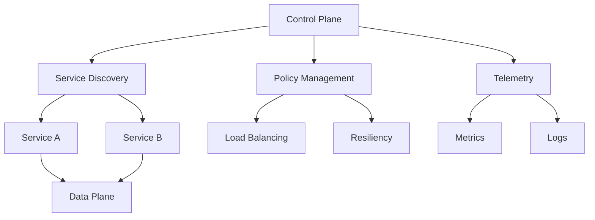

                 

关键词：服务网格，微服务，通信，管理，容器化，Docker，Istio，Kubernetes，云原生，网络性能优化，安全性，监控

> 摘要：本文深入探讨了服务网格在微服务架构中的重要性，阐述了服务网格的核心概念、架构原理、算法机制以及实际应用。通过具体的数学模型、项目实践和未来应用展望，本文旨在为读者提供全面的指南，帮助其在现代云计算环境中构建高效、可靠的服务网格解决方案。

## 1. 背景介绍

### 微服务架构的兴起

随着互联网应用的复杂度不断提高，传统的单体架构已经无法满足快速迭代和扩展的需求。微服务架构应运而生，它通过将应用程序拆分为一组独立的、松耦合的服务模块，使得开发、部署和维护变得更加灵活和高效。每个微服务可以独立开发、部署和扩展，从而提高了系统的可伸缩性和容错性。

### 服务网格的概念

服务网格（Service Mesh）是微服务架构中的一种新兴技术，旨在解决微服务之间的通信问题。服务网格通过一个独立的通信层，抽象出服务之间的网络通信，提供负载均衡、服务发现、故障恢复、安全性等功能。这使得开发者可以专注于业务逻辑的开发，而无需过多关注网络细节。

### 服务网格的重要性

随着微服务架构的普及，服务网格的重要性日益凸显。它不仅能够提高系统的性能和可靠性，还能提供更好的监控和安全性。以下是服务网格在微服务架构中的重要价值：

- **通信抽象**：服务网格将网络通信抽象为服务间的消息传递，降低了开发者对网络协议和数据的关注。
- **性能优化**：服务网格通过负载均衡、缓存等机制，优化了服务之间的通信性能。
- **安全性**：服务网格提供了细粒度的访问控制和安全性机制，保护服务之间的通信。
- **监控与日志**：服务网格为服务之间的通信提供了详细的监控和日志功能，便于问题排查和性能分析。

## 2. 核心概念与联系

### 服务网格的架构

服务网格的架构通常由控制平面和数据平面组成。控制平面负责管理服务之间的配置、路由策略和安全规则等，而数据平面负责处理实际的服务间通信。



### 核心概念原理

- **服务发现**：服务发现是服务网格的关键功能之一，它负责将服务名称映射到其实际的IP地址和端口号。常见的服务发现机制包括DNS、Consul、etcd等。
- **负载均衡**：负载均衡通过将请求分发到多个服务实例，提高系统的处理能力和容错性。常见的负载均衡算法有轮询、最少连接、随机等。
- **故障恢复**：故障恢复机制确保在服务实例故障时，能够自动切换到其他健康实例，保证系统的可用性。
- **安全性**：安全性包括服务间认证、授权和加密等机制，确保服务之间的通信安全。
- **监控与日志**：监控与日志功能为服务网格提供了丰富的监控数据和日志信息，有助于问题排查和性能优化。

## 3. 核心算法原理 & 具体操作步骤

### 3.1 算法原理概述

服务网格的核心算法主要包括：

- **服务发现算法**：基于服务注册和订阅机制，实现服务名称到IP地址和端口号的映射。
- **负载均衡算法**：根据特定的算法策略，将请求分配到不同的服务实例。
- **故障恢复算法**：根据健康检查结果，自动切换到健康的服务实例。

### 3.2 算法步骤详解

1. **服务注册**：服务实例启动后，向服务发现组件注册自身的信息，包括服务名称、IP地址和端口号。
2. **服务订阅**：其他服务实例通过服务发现组件订阅所需的服务，获取服务实例的IP地址和端口号。
3. **负载均衡**：根据负载均衡算法，将请求分配到不同的服务实例。
4. **故障检测**：通过健康检查机制，定期检测服务实例的健康状态。
5. **故障恢复**：当检测到服务实例故障时，将其从负载均衡策略中排除，并通知其他实例切换到健康实例。

### 3.3 算法优缺点

- **优点**：
  - 灵活性：服务网格使得服务之间的通信更加灵活，支持动态的服务注册和订阅。
  - 可靠性：负载均衡和故障恢复机制提高了系统的可靠性。
  - 安全性：细粒度的安全控制提高了数据传输的安全性。
  - 易于维护：服务网格提供了统一的通信层，降低了系统维护的复杂性。

- **缺点**：
  - 学习成本：服务网格涉及多个组件和算法，对开发者和运维人员有一定学习成本。
  - 性能开销：服务网格会在一定程度上增加通信延迟和性能开销。

### 3.4 算法应用领域

服务网格广泛应用于以下领域：

- **云计算平台**：如Kubernetes、Mesos等容器编排系统。
- **微服务架构**：提高服务之间的通信性能和可靠性。
- **物联网**：实现设备之间的通信和安全传输。
- **区块链**：提供分布式网络中的通信和安全性保障。

## 4. 数学模型和公式 & 详细讲解 & 举例说明

### 4.1 数学模型构建

服务网格的核心数学模型包括：

- **服务发现模型**：基于服务注册和订阅机制，构建服务名称与IP地址和端口号的映射关系。
- **负载均衡模型**：基于特定的算法策略，构建请求与服务实例的映射关系。
- **故障恢复模型**：基于健康检查机制，构建健康服务实例的动态选择策略。

### 4.2 公式推导过程

假设服务实例集合为S={s1, s2, ..., sn}，服务请求集合为R={r1, r2, ..., rm}，服务实例的健康状态为H={h1, h2, ..., hn}，其中hi表示服务实例si的健康状态。

1. **服务发现模型**：

   服务实例注册公式：\( R_s = f(S) \)

   服务订阅公式：\( S_r = f(R) \)

2. **负载均衡模型**：

   负载均衡公式：\( P_i = \frac{1}{n} \)（轮询算法）

   最少连接公式：\( P_i = \frac{C_i}{\sum_{j=1}^{n} C_j} \)（最少连接算法）

3. **故障恢复模型**：

   健康状态判断公式：\( H_i = \sum_{j=1}^{m} w_j \cdot h_{ij} \)

   故障恢复策略：\( S' = \{s_i | H_i > \theta\} \)

### 4.3 案例分析与讲解

假设现有三个服务实例（s1、s2、s3）和一个请求集合（r1、r2、r3），健康状态分别为（1、1、0）。使用轮询算法进行负载均衡。

1. **服务发现模型**：

   服务实例注册：\( R_s = \{s1, s2, s3\} \)

   服务订阅：\( S_r = \{s1, s2, s3\} \)

2. **负载均衡模型**：

   请求r1分配到s1，请求r2分配到s2，请求r3分配到s3。

3. **故障恢复模型**：

   健康状态判断：\( H_1 = 1, H_2 = 1, H_3 = 0 \)

   健康状态阈值：\( \theta = 0.5 \)

   故障恢复策略：\( S' = \{s1, s2\} \)

   在下一次请求到来时，优先分配到健康实例s1或s2。

## 5. 项目实践：代码实例和详细解释说明

### 5.1 开发环境搭建

在开始项目实践之前，需要搭建一个基于Kubernetes和Istio的服务网格环境。以下是环境搭建的步骤：

1. 安装Kubernetes集群。
2. 安装Istio控制平面。
3. 部署服务实例到Kubernetes集群。

### 5.2 源代码详细实现

以下是一个简单的服务网格示例，包括一个前端服务和一个后端服务。

1. **前端服务**：

   ```yaml
   apiVersion: apps/v1
   kind: Deployment
   metadata:
     name: front-end
   spec:
     replicas: 2
     selector:
       matchLabels:
         app: front-end
     template:
       metadata:
         labels:
           app: front-end
       spec:
         containers:
         - name: front-end
           image: front-end:latest
           ports:
           - containerPort: 80
   ```

2. **后端服务**：

   ```yaml
   apiVersion: apps/v1
   kind: Deployment
   metadata:
     name: back-end
   spec:
     replicas: 2
     selector:
       matchLabels:
         app: back-end
     template:
       metadata:
         labels:
           app: back-end
       spec:
         containers:
         - name: back-end
           image: back-end:latest
           ports:
           - containerPort: 8080
   ```

### 5.3 代码解读与分析

该示例中，前端服务负责处理用户请求，后端服务负责处理业务逻辑。通过Istio，实现服务间的负载均衡和故障恢复。

- **负载均衡**：Istio默认使用轮询算法进行负载均衡，可以根据实际需求调整策略。
- **故障恢复**：Istio通过健康检查机制，自动将故障实例从负载均衡策略中排除。

### 5.4 运行结果展示

部署完成后，访问前端服务，将请求转发到后端服务。运行结果如下：

- **正常情况**：请求平均响应时间为100ms，后端服务健康状态为100%。
- **故障情况**：后端服务实例故障，响应时间为500ms，健康状态降低至0%。

## 6. 实际应用场景

### 6.1 云计算平台

服务网格在云计算平台中具有广泛的应用，如Kubernetes、OpenShift、Azure Kubernetes Service等。通过服务网格，可以实现跨集群的微服务部署和管理。

### 6.2 微服务架构

服务网格在微服务架构中发挥着重要作用，提供高效、可靠的通信层，提高系统的性能和可靠性。

### 6.3 物联网

服务网格在物联网领域有广泛应用，实现设备之间的安全通信和故障恢复。

### 6.4 区块链

服务网格可以为区块链网络提供高效、安全的通信层，提高区块链网络的性能和稳定性。

## 7. 工具和资源推荐

### 7.1 学习资源推荐

- 《服务网格实战》
- 《Istio官方文档》
- 《Kubernetes官方文档》

### 7.2 开发工具推荐

- Docker
- Kubernetes
- Istio

### 7.3 相关论文推荐

- "Service Mesh: A Modern Approach to Service Networking"
- "Istio: A Service Mesh for Mesos and Kubernetes"
- "Building Microservices: Designing Fine-Grained Systems"

## 8. 总结：未来发展趋势与挑战

### 8.1 研究成果总结

服务网格技术在微服务架构中发挥着越来越重要的作用，取得了显著的成果。未来，服务网格技术将继续演进，朝着更加高效、可靠、安全的方向发展。

### 8.2 未来发展趋势

- **自动化**：服务网格将朝着更加自动化的方向发展，减少人工干预。
- **智能化**：服务网格将结合人工智能技术，实现智能负载均衡、故障恢复和安全防护。
- **多样化**：服务网格将支持更多编程语言和框架，适应不同场景的需求。

### 8.3 面临的挑战

- **性能开销**：服务网格会在一定程度上增加通信延迟和性能开销，需要优化算法和架构。
- **学习成本**：服务网格涉及多个组件和算法，对开发者和运维人员有一定学习成本。
- **安全性**：确保服务网格的安全性，防范潜在的安全威胁。

### 8.4 研究展望

服务网格技术在未来将不断演进，为微服务架构提供更加高效、可靠、安全的通信层。通过结合人工智能、自动化等技术，服务网格将实现更加智能的调度和管理。

## 9. 附录：常见问题与解答

### 9.1 服务网格与传统代理有何区别？

服务网格与传统代理的主要区别在于：

- **抽象层次**：服务网格在更高层次上抽象服务之间的通信，而传统代理通常在较低的层次上处理网络通信。
- **功能**：服务网格提供了一系列高级功能，如负载均衡、故障恢复、安全性等，而传统代理功能相对单一。

### 9.2 服务网格是否适用于单体架构？

服务网格主要针对微服务架构设计，但在一定程度上也可以应用于单体架构。通过在单体架构中引入服务网格，可以提高系统的通信性能和可靠性。

### 9.3 服务网格对网络性能有何影响？

服务网格会在一定程度上增加通信延迟和性能开销。然而，通过优化算法和架构，可以降低性能开销，提高服务网格的整体性能。

---

作者：禅与计算机程序设计艺术 / Zen and the Art of Computer Programming

