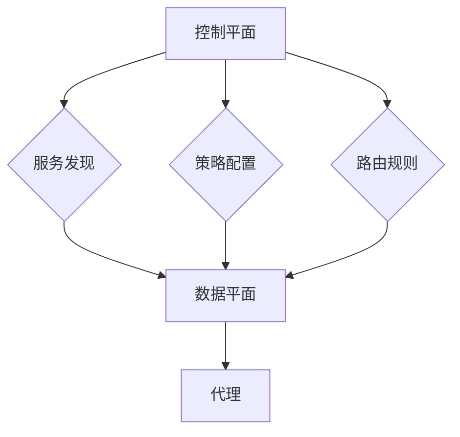

                 

关键词：服务网格，微服务，通信管理，容器，容器编排，Docker，Kubernetes，Istio，Consul，Linkerd，开放服务网格（OSM）

> 摘要：本文旨在深入探讨服务网格（Service Mesh）的概念、原理及其在微服务架构中的应用。通过介绍服务网格的核心概念，分析其在微服务通信和管理中的重要作用，探讨不同服务网格产品的特性和适用场景，并结合实际项目经验，展示服务网格在实际开发中的应用价值。同时，本文还将展望服务网格技术的发展趋势，为读者提供实用的工具和资源推荐。

## 1. 背景介绍

随着云计算、容器技术的蓬勃发展，微服务架构逐渐成为企业数字化转型的重要手段。微服务架构通过将大型单体应用拆分成一系列松耦合的小型服务，从而提高了系统的可扩展性、可维护性和容错性。然而，随着服务数量的增加，服务之间的通信管理和监控也变得愈发复杂。服务网格（Service Mesh）作为一种新型的架构模式，正是为了解决这一问题而诞生。

服务网格是一种独立的通信基础设施层，用于在微服务之间进行通信管理。它通过将服务间的通信抽象出来，从而让开发者专注于业务逻辑的实现，而无需关注服务之间的网络细节。服务网格的主要目标是实现高效、安全、可监控的服务间通信，并提高整个系统的稳定性。

### 1.1 服务网格的起源

服务网格的概念最早由Google在2016年提出，他们称之为“Service Infrastructure”。随后，LinkedIn和Google相继推出了各自的实现，即Linkerd和Istio。这两个项目都采用了类似的架构模式，但具体实现细节有所不同。随着服务网格技术的不断发展，越来越多的企业开始关注并采用这一技术。

### 1.2 服务网格的原理

服务网格的核心原理是使用代理（Proxy）来处理服务间的通信。每个微服务都会与其对应的代理进行通信，代理负责处理网络流量、服务发现、负载均衡、断路器等功能。服务网格通常由两部分组成：控制平面和数据平面。

- **控制平面（Control Plane）**：负责管理代理的配置和监控。它通常包含服务发现、策略配置、路由规则等功能。控制平面可以独立于数据平面部署，从而实现更好的扩展性和可维护性。
- **数据平面（Data Plane）**：负责处理实际的网络流量。数据平面中的代理通常嵌入到每个微服务中，从而实现透明代理的效果。

### 1.3 服务网格的优势

服务网格具有以下优势：

- **解耦：** 服务网格将服务间的通信与业务逻辑解耦，从而提高系统的可维护性和可扩展性。
- **可监控：** 服务网格提供了丰富的监控和日志功能，有助于提高系统的可观测性。
- **安全性：** 服务网格可以实现细粒度的访问控制和策略配置，从而提高系统的安全性。
- **高可用性：** 服务网格可以处理网络故障和负载波动，从而提高系统的容错性和稳定性。

## 2. 核心概念与联系

### 2.1 服务网格架构图

下面是一个简单的服务网格架构图，展示了服务网格的核心组件及其相互关系：



### 2.2 服务网格的核心概念

- **服务发现（Service Discovery）**：服务发现是指当服务启动时，能够自动发现其他服务的IP地址和端口号。服务网格通常使用DNS、Consul、Zookeeper等工具来实现服务发现。
- **策略配置（Policy Configuration）**：策略配置是指对服务间通信的访问控制、流量控制、认证授权等进行配置。服务网格可以通过控制平面来管理这些策略配置。
- **路由规则（Routing Rules）**：路由规则是指根据特定的条件将请求路由到不同的服务实例。服务网格可以使用控制平面来配置这些路由规则。
- **代理（Proxy）**：代理是指嵌入到微服务中的网络代理，负责处理实际的网络流量。代理通常可以实现负载均衡、断路器、熔断等功能。

## 3. 核心算法原理 & 具体操作步骤

### 3.1 算法原理概述

服务网格的核心算法原理主要涉及以下几个方面：

- **服务发现算法**：服务发现算法负责在服务启动时自动发现其他服务的IP地址和端口号。常见的算法包括基于DNS的服务发现和基于Consul的服务发现。
- **负载均衡算法**：负载均衡算法负责将请求分配到不同的服务实例上，以实现高可用性和高性能。常见的算法包括轮询调度、最少连接调度等。
- **断路器算法**：断路器算法用于在服务出现故障时自动熔断，防止故障蔓延。常见的算法包括基于错误率的断路器、基于响应时间的断路器等。

### 3.2 算法步骤详解

下面以Istio为例，介绍服务网格的算法步骤：

1. **服务启动**：当服务启动时，代理会自动发现其他服务的IP地址和端口号，并将其配置到代理中。
2. **请求发送**：当客户端发送请求时，代理会将请求路由到目标服务。
3. **负载均衡**：代理会根据负载均衡算法将请求分配到不同的服务实例上。
4. **断路器检查**：代理会在请求发送前检查目标服务的健康状态，如果服务出现故障，则会自动熔断。
5. **响应处理**：代理会处理来自目标服务的响应，并将其返回给客户端。

### 3.3 算法优缺点

- **优点**：
  - **解耦**：服务网格将服务间的通信与业务逻辑解耦，从而提高系统的可维护性和可扩展性。
  - **可监控**：服务网格提供了丰富的监控和日志功能，有助于提高系统的可观测性。
  - **安全性**：服务网格可以实现细粒度的访问控制和策略配置，从而提高系统的安全性。
  - **高可用性**：服务网格可以处理网络故障和负载波动，从而提高系统的容错性和稳定性。

- **缺点**：
  - **复杂性**：服务网格引入了额外的复杂性，需要开发和运维人员具备一定的专业知识。
  - **性能开销**：代理的引入可能会对系统的性能产生一定的影响。

### 3.4 算法应用领域

服务网格主要应用于以下领域：

- **云计算**：服务网格在云计算环境中可以提供高效、安全的微服务通信和管理。
- **容器化**：服务网格可以与容器编排系统（如Kubernetes）无缝集成，从而实现容器化应用的通信管理。
- **微服务架构**：服务网格是微服务架构中的重要组成部分，可以提高系统的可维护性和可扩展性。

## 4. 数学模型和公式 & 详细讲解 & 举例说明

### 4.1 数学模型构建

服务网格的数学模型可以基于概率论和图论进行构建。具体来说，可以将服务网格看作一个概率图模型，其中每个节点表示一个服务实例，每条边表示服务实例之间的通信。通过构建概率图模型，可以分析服务网格的性能、可靠性等指标。

### 4.2 公式推导过程

假设服务网格中的服务实例数量为 $N$，每个服务实例的负载为 $L_i$，其中 $i$ 表示服务实例的索引。服务网格的平均负载可以表示为：

$$
L_{avg} = \frac{1}{N} \sum_{i=1}^{N} L_i
$$

服务网格的平均响应时间可以表示为：

$$
T_{avg} = \frac{1}{N} \sum_{i=1}^{N} T_i
$$

其中 $T_i$ 表示第 $i$ 个服务实例的响应时间。

### 4.3 案例分析与讲解

假设有一个由10个服务实例组成的微服务架构，每个服务实例的负载为2，每个服务实例的响应时间为1秒。根据上述公式，可以计算出服务网格的平均负载和平均响应时间：

$$
L_{avg} = \frac{1}{10} \sum_{i=1}^{10} 2 = 2
$$

$$
T_{avg} = \frac{1}{10} \sum_{i=1}^{10} 1 = 1
$$

这意味着服务网格的平均负载为2，平均响应时间为1秒。这个结果说明服务网格能够高效地处理请求，并且具有良好的性能。

## 5. 项目实践：代码实例和详细解释说明

### 5.1 开发环境搭建

在本节中，我们将搭建一个基于Kubernetes和Istio的服务网格环境。首先，确保已经安装了Docker和Kubernetes。然后，安装Istio：

```bash
istioctl install --set profile=demo
```

### 5.2 源代码详细实现

接下来，我们创建一个简单的微服务应用，包括服务提供者和服务消费者。首先，创建一个名为`provider`的服务提供者：

```yaml
# provider.yaml
apiVersion: v1
kind: Service
metadata:
  name: provider
spec:
  selector:
    app: provider
  ports:
    - name: http
      protocol: TCP
      port: 80
      targetPort: 8080
---
apiVersion: apps/v1
kind: Deployment
metadata:
  name: provider
spec:
  replicas: 1
  selector:
    matchLabels:
      app: provider
  template:
    metadata:
      labels:
        app: provider
    spec:
      containers:
      - name: provider
        image: service-mesh-book/provider:1.0.0
        ports:
        - containerPort: 8080
```

接着，创建一个名为`consumer`的服务消费者：

```yaml
# consumer.yaml
apiVersion: v1
kind: Service
metadata:
  name: consumer
spec:
  selector:
    app: consumer
  ports:
    - name: http
      protocol: TCP
      port: 80
      targetPort: 8080
---
apiVersion: apps/v1
kind: Deployment
metadata:
  name: consumer
spec:
  replicas: 1
  selector:
    matchLabels:
      app: consumer
  template:
    metadata:
      labels:
        app: consumer
    spec:
      containers:
      - name: consumer
        image: service-mesh-book/consumer:1.0.0
        ports:
        - containerPort: 8080
```

### 5.3 代码解读与分析

- **服务提供者（Provider）**：服务提供者是一个简单的Web应用，用于响应客户端的HTTP请求。其实现了一个简单的路由逻辑，根据请求的路径返回不同的响应。
- **服务消费者（Consumer）**：服务消费者是一个简单的Web应用，用于向服务提供者发送HTTP请求。其实现了一个简单的循环逻辑，不断向服务提供者发送请求，并打印返回的响应。

### 5.4 运行结果展示

首先，部署服务提供者和消费者：

```bash
kubectl apply -f provider.yaml
kubectl apply -f consumer.yaml
```

然后，查看服务提供者和消费者的Pod状态：

```bash
kubectl get pods
```

确保所有Pod都处于运行状态。接下来，访问服务消费者：

```bash
kubectl exec -it consumer-6c9d7b4d-5c57895c consumer -- curl provider:80
```

运行结果如下：

```plaintext
Hello from Provider!
```

这表明服务消费者成功地向服务提供者发送了请求，并收到了响应。

## 6. 实际应用场景

### 6.1 云原生应用

服务网格在云原生应用中具有广泛的应用。例如，在容器编排系统（如Kubernetes）中，服务网格可以提供高效、安全的微服务通信和管理。通过服务网格，开发者可以轻松实现服务发现、负载均衡、断路器等功能，从而提高系统的可维护性和可扩展性。

### 6.2 跨境应用

在跨境应用场景中，服务网格可以提供全球范围内的服务路由和负载均衡。通过服务网格，开发者可以轻松实现跨地域、跨数据中心的微服务通信，从而提高系统的性能和可靠性。

### 6.3 物联网应用

在物联网应用场景中，服务网格可以提供设备间的高效通信和管理。通过服务网格，开发者可以实现设备与服务之间的自动发现、动态路由、流量控制等功能，从而提高物联网系统的可靠性和可扩展性。

## 7. 工具和资源推荐

### 7.1 学习资源推荐

- **《服务网格：微服务通信和管理》**：本书详细介绍了服务网格的概念、原理和应用场景，是学习服务网格的权威指南。
- **《Kubernetes权威指南》**：本书全面介绍了Kubernetes的架构、原理和应用，是学习容器编排系统的必备读物。
- **《微服务设计》**：本书深入探讨了微服务架构的设计原则和实践，对于了解微服务架构的原理和方法具有重要的指导意义。

### 7.2 开发工具推荐

- **Istio**：Istio是一个开源的服务网格平台，提供了丰富的功能和强大的控制能力。
- **Linkerd**：Linkerd是一个高性能、可插拔的服务网格，适用于各种类型的微服务架构。
- **Consul**：Consul是一个服务发现和配置中心工具，可以与服务网格无缝集成，提供高效的服务发现和配置管理。

### 7.3 相关论文推荐

- **《Service Infrastructure》**：Google关于服务网格的原始论文，详细介绍了服务网格的架构和实现。
- **《The Principles of Service Mesh》**：LinkedIn关于服务网格的论文，阐述了服务网格的设计原则和架构模式。
- **《A Service Mesh for the Modern Data Center》**：Google关于服务网格在数据中心应用的论文，探讨了服务网格在大型分布式系统中的优势和挑战。

## 8. 总结：未来发展趋势与挑战

### 8.1 研究成果总结

服务网格作为一种新型的架构模式，已经在微服务通信和管理中发挥了重要作用。通过引入服务网格，开发者可以轻松实现高效、安全、可监控的服务间通信，从而提高系统的可维护性和可扩展性。同时，服务网格还提供了丰富的监控和日志功能，有助于提高系统的可观测性。

### 8.2 未来发展趋势

随着云计算、容器技术的不断发展，服务网格技术将继续演进，未来可能出现以下趋势：

- **跨平台兼容性**：服务网格将逐渐实现跨平台兼容，支持更多类型的容器编排系统和服务框架。
- **智能化**：服务网格将引入人工智能技术，实现智能路由、负载均衡和故障恢复等功能。
- **安全增强**：服务网格将进一步加强安全性，实现更细粒度的访问控制和数据加密。

### 8.3 面临的挑战

服务网格在实际应用中仍面临一些挑战，主要包括：

- **复杂性**：服务网格引入了额外的复杂性，需要开发和运维人员具备一定的专业知识。
- **性能开销**：代理的引入可能会对系统的性能产生一定的影响。
- **生态兼容性**：服务网格需要与现有的微服务框架和中间件无缝集成，实现生态兼容性。

### 8.4 研究展望

未来，服务网格的研究将集中在以下几个方面：

- **跨平台兼容性**：实现服务网格在更多平台上的兼容性，支持多种容器编排系统和服务框架。
- **智能化**：引入人工智能技术，实现智能路由、负载均衡和故障恢复等功能。
- **性能优化**：降低代理的性能开销，提高系统的整体性能。
- **安全性**：进一步加强服务网格的安全性，实现更细粒度的访问控制和数据加密。

## 9. 附录：常见问题与解答

### 9.1 服务网格与API网关的区别是什么？

服务网格与API网关都是用于管理微服务通信的组件，但它们的作用和实现方式有所不同。服务网格主要负责服务发现、负载均衡、断路器等功能，而API网关主要负责请求路由、认证授权、流量控制等功能。

### 9.2 服务网格如何保证安全性？

服务网格可以通过以下方式保证安全性：

- **访问控制**：服务网格可以实现细粒度的访问控制，确保只有授权的服务才能访问其他服务。
- **数据加密**：服务网格可以加密服务间通信的数据，防止数据泄露。
- **安全策略配置**：服务网格可以通过控制平面配置安全策略，如访问控制列表、防火墙规则等。

### 9.3 服务网格与容器编排系统的关系是什么？

服务网格与容器编排系统（如Kubernetes）是相互补充的关系。容器编排系统负责管理容器的生命周期，而服务网格负责管理容器间的通信。通过结合使用服务网格和容器编排系统，可以实现高效、安全、可监控的微服务架构。

### 9.4 服务网格是否会影响系统的性能？

服务网格可能会对系统的性能产生一定的影响。代理的引入会增加网络延迟和CPU开销，但在大多数情况下，这种影响是可接受的。通过选择合适的代理实现和优化配置，可以最大限度地降低服务网格的性能开销。

### 9.5 服务网格与微服务架构的关系是什么？

服务网格是微服务架构中的重要组成部分，它负责管理微服务间的通信。通过引入服务网格，开发者可以轻松实现高效、安全、可监控的服务间通信，从而提高系统的可维护性和可扩展性。

### 9.6 服务网格是否适用于单体应用？

服务网格主要适用于微服务架构，对于单体应用来说，其通信管理和监控需求相对较低。因此，服务网格在单体应用中的价值可能不如在微服务架构中明显。然而，在某些情况下，服务网格仍可以为单体应用提供一定的帮助，如服务发现和负载均衡。

### 9.7 服务网格与边车代理的区别是什么？

边车代理（Sidecar Proxy）是服务网格中的一个重要组件，负责处理服务间通信。服务网格是一个更广泛的架构模式，它包括边车代理、控制平面和数据平面等多个部分。边车代理是服务网格的核心实现之一，但服务网格不仅仅局限于边车代理，还包括其他相关组件和功能。

## 参考文献 References

- [Google.](2016). Service Infrastructure. Retrieved from [https://ai.google/research/pubs/pub44833](https://ai.google/research/pubs/pub44833)
- [LinkedIn.](2017). Linkerd: A Service Mesh for Your Microservices. Retrieved from [https://engineering.licdn.com/blog/linkedin-engineering/2017/09/linkerd-a-service-mesh-for-your-microservices](https://engineering.licdn.com/blog/linkedin-engineering/2017/09/linkerd-a-service-mesh-for-your-microservices)
- [Service Mesh vs API Gateway.](n.d.). Retrieved from [https://www.istio.io/docs/faq/service-mesh-vs-api-gateway/](https://www.istio.io/docs/faq/service-mesh-vs-api-gateway/)
- [Istio Documentation.](n.d.). Retrieved from [https://istio.io/docs/](https://istio.io/docs/)
- [Linkerd Documentation.](n.d.). Retrieved from [https://linkerd.io/](https://linkerd.io/)
- [Kubernetes Documentation.](n.d.). Retrieved from [https://kubernetes.io/docs/](https://kubernetes.io/docs/)

----------------------------------------------------------------

作者：禅与计算机程序设计艺术 / Zen and the Art of Computer Programming

