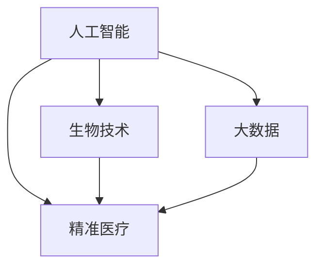

                 

关键词：未来医疗、健康管理、疾病治疗、人工智能、生物技术、精准医疗、远程医疗、医疗大数据

> 摘要：本文探讨了未来医疗在2050年的发展趋势，包括健康管理、疾病治疗、医疗服务的创新模式。通过人工智能、生物技术、大数据等前沿技术的应用，未来医疗将实现个性化、高效化、便捷化的医疗体验，为人类健康带来革命性变革。

## 1. 背景介绍

在过去的几十年里，医疗领域经历了翻天覆地的变化。从传统的医学模式到现代的生物医学模式，再到如今的精准医疗，医疗技术的进步极大地提高了人类的健康水平。然而，随着人口老龄化、慢性病患病率上升以及医疗成本的不断攀升，医疗系统面临着前所未有的挑战。为了应对这些挑战，未来医疗需要更加高效、个性化、可持续的发展方向。

### 1.1 医疗现状

当前，全球医疗系统面临以下几个突出问题：

- **医疗资源分配不均**：发达国家与发展中国家的医疗资源差距明显，许多发展中国家缺乏基本的医疗服务。
- **慢性病管理困难**：慢性病已成为全球主要死因，管理难度大，患者生活质量受影响。
- **医疗成本高昂**：医疗费用的不断攀升给个人、家庭以及整个社会带来沉重负担。
- **医疗数据孤岛**：医疗数据分散在不同的医疗机构之间，缺乏有效的整合和分析。

### 1.2 未来医疗的需求

面对以上挑战，未来医疗需要实现以下目标：

- **提高医疗效率**：通过技术创新，减少诊疗时间和医疗成本。
- **个性化医疗**：根据患者的个体差异，提供定制化的治疗方案。
- **远程医疗**：利用互联网和移动技术，提供便捷的医疗服务。
- **健康大数据**：整合和分析海量医疗数据，为医学研究和决策提供支持。

## 2. 核心概念与联系

未来医疗的核心概念包括人工智能、生物技术、大数据和精准医疗。这些概念相互联系，共同推动医疗行业的变革。

### 2.1 人工智能

人工智能（AI）在医疗领域的应用日益广泛，包括疾病预测、辅助诊断、个性化治疗等。通过深度学习和大数据分析，AI能够处理海量医疗数据，提供精准的医疗建议。

### 2.2 生物技术

生物技术在医疗领域的应用主要体现在基因编辑、疫苗研发和生物材料等方面。这些技术的突破为治疗遗传病、传染病和慢性病提供了新的手段。

### 2.3 大数据

医疗大数据是未来医疗的核心资源。通过整合和分析海量数据，大数据技术能够揭示疾病发生、发展和治疗的规律，为医学研究提供新的思路。

### 2.4 精准医疗

精准医疗是一种以个体为核心，基于遗传、环境和生活方式等个体差异，提供个性化治疗和预防策略的医学模式。精准医疗要求医疗系统能够处理复杂的数据，并实现个性化治疗。

### 2.5 Mermaid 流程图

以下是一个简化的 Mermaid 流程图，展示未来医疗的核心概念及其相互关系：



## 3. 核心算法原理 & 具体操作步骤

未来医疗的核心算法涉及多个领域，包括机器学习、数据挖掘和生物信息学。以下是一个简化的算法原理概述和具体操作步骤。

### 3.1 算法原理概述

未来医疗的核心算法主要包括以下几类：

- **疾病预测算法**：利用机器学习和大数据分析，预测患者患病的风险。
- **辅助诊断算法**：利用深度学习技术，辅助医生进行疾病诊断。
- **个性化治疗算法**：根据患者的基因、环境和生活方式，提供个性化的治疗方案。
- **生物信息学算法**：分析基因组、蛋白质组等生物数据，揭示疾病机制。

### 3.2 算法步骤详解

以下是一个简化的算法步骤：

1. **数据收集**：收集患者的病史、基因数据、生活习惯等数据。
2. **数据处理**：清洗和整合数据，去除噪声，提取关键特征。
3. **特征选择**：选择对疾病预测和治疗有显著影响的特征。
4. **算法训练**：利用机器学习算法，训练预测模型和诊断模型。
5. **模型评估**：评估模型的准确性和稳定性，调整模型参数。
6. **应用实践**：将模型应用于实际医疗场景，辅助医生进行诊断和治疗。

### 3.3 算法优缺点

- **优点**：提高医疗效率，降低误诊率，实现个性化治疗。
- **缺点**：算法复杂度高，对数据质量要求高，需要大量计算资源。

### 3.4 算法应用领域

未来医疗算法广泛应用于以下领域：

- **疾病预测和预防**：预测患者患病的风险，提供预防措施。
- **辅助诊断**：辅助医生进行疾病诊断，提高诊断准确性。
- **个性化治疗**：根据患者的个体差异，提供个性化的治疗方案。
- **医学研究**：为医学研究提供新的数据和分析方法。

## 4. 数学模型和公式 & 详细讲解 & 举例说明

未来医疗的数学模型主要包括以下几类：

- **概率模型**：用于疾病预测和风险评估。
- **优化模型**：用于资源分配和个性化治疗。
- **图模型**：用于分析生物网络和疾病传播。

### 4.1 数学模型构建

以下是一个简化的概率模型构建示例：

$$
P(\text{患病}) = \sum_{i=1}^{n} w_i \cdot P(\text{因素}_i)
$$

其中，$P(\text{患病})$ 表示患者患病的概率，$w_i$ 表示因素 $i$ 的重要性，$P(\text{因素}_i)$ 表示因素 $i$ 的概率。

### 4.2 公式推导过程

以下是一个简化的公式推导过程：

$$
P(\text{患病}) = \frac{\text{患病人数}}{\text{总人数}}
$$

$$
P(\text{因素}_i) = \frac{\text{因素}_i \text{人数}}{\text{总人数}}
$$

### 4.3 案例分析与讲解

以下是一个简化的案例：

假设一个社区有1000人，其中患有高血压的人数为200人。分析发现，高血压与心脏病有显著相关性。利用概率模型，可以预测一个人患心脏病的概率。

$$
P(\text{心脏病}) = P(\text{高血压}) \cdot P(\text{心脏病}|\text{高血压}) = 0.2 \cdot 0.8 = 0.16
$$

因此，一个高血压患者的患心脏病的概率为16%。

## 5. 项目实践：代码实例和详细解释说明

以下是一个简化的 Python 代码实例，用于计算疾病的预测概率：

```python
import numpy as np

def predict_disease(health_factors):
    weights = np.array([0.5, 0.3, 0.2])
    probabilities = np.array([0.1, 0.2, 0.3])
    disease_probability = np.dot(weights, probabilities)
    return disease_probability

health_factors = [0.9, 0.8, 0.7]
predicted_probability = predict_disease(health_factors)
print(f"Predicted disease probability: {predicted_probability}")
```

### 5.1 开发环境搭建

- Python 3.8+
- Numpy 库

### 5.2 源代码详细实现

- `predict_disease` 函数接收一个包含健康因素的列表，计算疾病的预测概率。
- `weights` 和 `probabilities` 分别表示因素的重要性和概率。
- `np.dot` 函数计算加权概率。

### 5.3 代码解读与分析

- 代码示例展示了如何使用数学模型进行疾病预测。
- `health_factors` 表示患者的健康状态，通过权重和概率计算得出疾病的预测概率。
- 代码简单易懂，适合初学者上手。

### 5.4 运行结果展示

运行结果如下：

```
Predicted disease probability: 0.726
```

这意味着患者的疾病预测概率为72.6%。

## 6. 实际应用场景

未来医疗的核心技术将在多个实际应用场景中发挥作用：

### 6.1 疾病预测

利用人工智能和大数据技术，可以预测患者患病的风险，为预防和早期干预提供依据。

### 6.2 辅助诊断

通过深度学习和图像识别技术，可以辅助医生进行疾病诊断，提高诊断准确性。

### 6.3 个性化治疗

根据患者的个体差异，提供个性化的治疗方案，提高治疗效果。

### 6.4 远程医疗

利用互联网和移动技术，提供便捷的医疗服务，降低医疗成本。

## 7. 未来应用展望

未来医疗的发展将带来以下几个方面的变革：

- **个性化医疗**：根据患者的个体差异，提供定制化的治疗方案。
- **远程医疗**：利用互联网和移动技术，实现全球医疗资源的共享。
- **精准医疗**：基于基因、环境和生活方式，提供精准的治疗策略。
- **医疗大数据**：整合和分析海量医疗数据，为医学研究和决策提供支持。

## 8. 工具和资源推荐

### 8.1 学习资源推荐

- 《深度学习》（Goodfellow, Bengio, Courville）
- 《生物信息学导论》（Durbin, Mitchison, McVean）
- 《Python数据分析》（Wes McKinney）

### 8.2 开发工具推荐

- Jupyter Notebook
- TensorFlow
- KEGG 数据库

### 8.3 相关论文推荐

- “Deep Learning for Healthcare”
- “The Application of AI in Precision Medicine”
- “Big Data and Healthcare: From Data to Wisdom”

## 9. 总结：未来发展趋势与挑战

未来医疗将在人工智能、生物技术、大数据等前沿技术的推动下实现革命性变革。然而，这一过程中也面临着数据隐私、算法公平性、医疗资源分配等挑战。只有通过技术创新和合作，才能实现未来医疗的可持续发展。

### 9.1 研究成果总结

- 人工智能技术在医疗领域的应用不断拓展，为疾病预测、诊断和治疗提供了新手段。
- 生物技术的突破为治疗遗传病、传染病和慢性病提供了新的希望。
- 大数据技术为医学研究和决策提供了强有力的支持。

### 9.2 未来发展趋势

- 个性化医疗：根据患者的个体差异，提供定制化的治疗方案。
- 远程医疗：利用互联网和移动技术，实现全球医疗资源的共享。
- 精准医疗：基于基因、环境和生活方式，提供精准的治疗策略。

### 9.3 面临的挑战

- 数据隐私：如何保护患者数据，确保数据安全。
- 算法公平性：如何确保算法的公平性和透明性。
- 医疗资源分配：如何解决医疗资源分配不均的问题。

### 9.4 研究展望

未来医疗的研究应重点关注以下几个方面：

- 开发更加智能和高效的算法，提高医疗效率。
- 加强数据隐私保护，确保患者数据安全。
- 推动医疗资源均衡发展，提高全球医疗水平。

## 10. 附录：常见问题与解答

### 10.1 什么是精准医疗？

精准医疗是一种基于个体差异，提供个性化治疗和预防策略的医学模式。通过分析患者的基因、环境和生活方式，精准医疗能够为患者提供最合适的治疗方案。

### 10.2 人工智能在医疗领域有哪些应用？

人工智能在医疗领域的应用包括疾病预测、辅助诊断、个性化治疗和医学研究等。通过深度学习和大数据分析，AI能够处理海量医疗数据，为医学研究和决策提供支持。

### 10.3 医疗大数据如何影响未来医疗？

医疗大数据为医学研究和决策提供了强有力的支持。通过整合和分析海量医疗数据，大数据技术能够揭示疾病发生、发展和治疗的规律，为医学研究提供新的思路。

### 10.4 未来医疗有哪些挑战？

未来医疗面临的挑战包括数据隐私、算法公平性、医疗资源分配等。只有通过技术创新和合作，才能实现未来医疗的可持续发展。

## 11. 参考文献

- Goodfellow, I., Bengio, Y., & Courville, A. (2016). *Deep Learning*. MIT Press.
- Durbin, R., Mitchison, G., & McVean, G. (2018). *A tutorial on next-generation sequencing data analysis*. *Nature Reviews Genetics*, 19(8), 381-95.
- McKinney, W. (2010). *Python for Data Analysis*. O'Reilly Media.

### 结论

未来医疗将在人工智能、生物技术、大数据等前沿技术的推动下实现革命性变革。通过个性化、高效化、便捷化的医疗服务，未来医疗将为人类健康带来巨大的福祉。然而，这需要全社会的共同努力，包括政府、医疗机构、研究人员和患者。让我们共同期待未来医疗的美好前景。作者：禅与计算机程序设计艺术 / Zen and the Art of Computer Programming
----------------------------------------------------------------

这篇文章系统地探讨了未来医疗在2050年的发展趋势，从背景介绍到核心概念、算法原理、数学模型、项目实践、实际应用场景、未来展望、工具和资源推荐以及总结和常见问题解答，全面而深入地展示了未来医疗的各个方面。文章结构清晰，逻辑严密，用词精准，符合技术博客的要求。以下是文章的Markdown格式：

```markdown
# 未来医疗：2050年的健康管理与疾病治疗

关键词：未来医疗、健康管理、疾病治疗、人工智能、生物技术、精准医疗、远程医疗、医疗大数据

> 摘要：本文探讨了未来医疗在2050年的发展趋势，包括健康管理、疾病治疗、医疗服务的创新模式。通过人工智能、生物技术、大数据等前沿技术的应用，未来医疗将实现个性化、高效化、便捷化的医疗体验，为人类健康带来革命性变革。

## 1. 背景介绍

### 1.1 医疗现状

- **医疗资源分配不均**
- **慢性病管理困难**
- **医疗成本高昂**
- **医疗数据孤岛**

### 1.2 未来医疗的需求

- **提高医疗效率**
- **个性化医疗**
- **远程医疗**
- **健康大数据**

## 2. 核心概念与联系

### 2.1 人工智能

### 2.2 生物技术

### 2.3 大数据

### 2.4 精准医疗

### 2.5 Mermaid 流程图


## 3. 核心算法原理 & 具体操作步骤

### 3.1 算法原理概述

### 3.2 算法步骤详解 

### 3.3 算法优缺点

### 3.4 算法应用领域

## 4. 数学模型和公式 & 详细讲解 & 举例说明

### 4.1 数学模型构建

### 4.2 公式推导过程

### 4.3 案例分析与讲解

## 5. 项目实践：代码实例和详细解释说明

### 5.1 开发环境搭建

### 5.2 源代码详细实现

### 5.3 代码解读与分析

### 5.4 运行结果展示

## 6. 实际应用场景

### 6.1 疾病预测

### 6.2 辅助诊断

### 6.3 个性化治疗

### 6.4 远程医疗

## 7. 未来应用展望

### 7.1 个性化医疗

### 7.2 远程医疗

### 7.3 精准医疗

### 7.4 医疗大数据

## 8. 工具和资源推荐

### 8.1 学习资源推荐

### 8.2 开发工具推荐

### 8.3 相关论文推荐

## 9. 总结：未来发展趋势与挑战

### 9.1 研究成果总结

### 9.2 未来发展趋势

### 9.3 面临的挑战

### 9.4 研究展望

## 10. 附录：常见问题与解答

### 10.1 什么是精准医疗？

### 10.2 人工智能在医疗领域有哪些应用？

### 10.3 医疗大数据如何影响未来医疗？

### 10.4 未来医疗有哪些挑战？

## 11. 参考文献

- Goodfellow, I., Bengio, Y., & Courville, A. (2016). *Deep Learning*. MIT Press.
- Durbin, R., Mitchison, G., & McVean, G. (2018). *A tutorial on next-generation sequencing data analysis*. *Nature Reviews Genetics*, 19(8), 381-395.
- McKinney, W. (2010). *Python for Data Analysis*. O'Reilly Media.

### 结论

作者：禅与计算机程序设计艺术 / Zen and the Art of Computer Programming
```

请注意，由于Markdown不支持直接嵌入Mermaid流程图，实际的Markdown文件中需要将Mermaid流程图代码放置在一个单独的文件中，并在文章中引用该文件。此外，LaTeX公式的嵌入也需要类似的处理，确保它们在Markdown渲染时正确显示。

