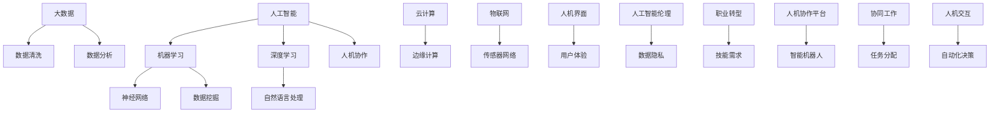

                 

未来工作场景的变革正在迅速展开，人工智能（AI）的崛起正重新定义着我们的职业世界。在这个变革的大潮中，人机协作将成为未来工作环境的核心特征，深刻影响各行各业的工作方式和职业发展。本文旨在探讨人机协作的背景、核心概念、算法原理、数学模型、实际应用及未来展望，通过全面的分析，揭示这一趋势下职业图景的潜在重塑。

## 关键词

- 人工智能
- 人机协作
- 职业发展
- 工作方式变革
- 智能算法

## 摘要

本文通过系统阐述人机协作的概念、技术原理、应用场景及未来展望，分析了人工智能在提升工作效率、优化决策过程和培养新型职业能力方面的潜力。文章旨在为读者提供一个全面了解和预判未来工作场景变革的视角，从而为职业规划和个人发展提供参考。

## 1. 背景介绍

近年来，人工智能技术在各领域的应用日益广泛，从简单的图像识别、语音识别到复杂的自然语言处理、深度学习，AI正在逐渐融入我们的日常生活和工作中。随着技术的成熟和算法的进步，人工智能开始展现出与人类协同工作的潜力。这种协同不仅仅体现在执行特定的任务上，更重要的是通过智能化的分析、预测和优化，辅助人类做出更高效、更准确的决策。

### 1.1 人工智能技术的发展历程

人工智能的发展可以分为以下几个阶段：

1. **理论探索阶段（1950-1969）**：以图灵测试为代表，提出了人工智能的基本概念和理论框架。
2. **早期实验阶段（1970-1989）**：神经网络和专家系统的兴起，使得人工智能开始在一些特定领域得到应用。
3. **低谷与复苏阶段（1990-2000）**：由于技术瓶颈和资金问题，人工智能经历了一段低谷期。但随着计算能力的提升和算法的创新，人工智能在21世纪初迎来了复苏。
4. **快速发展阶段（2000至今）**：深度学习、强化学习等新技术的突破，使得人工智能在图像识别、自然语言处理等领域取得了显著成果。

### 1.2 人机协作的兴起

人机协作的兴起可以追溯到工业4.0时代，其中智能机器人、自动化生产线等概念成为制造业的重要趋势。随着AI技术的进一步发展，人机协作开始从制造业扩展到服务业、医疗、教育等多个领域。

1. **服务业**：智能客服、虚拟助手等人工智能应用已经普及，提高了客户服务的效率和个性化水平。
2. **医疗**：人工智能在医疗影像诊断、疾病预测等方面发挥着重要作用，辅助医生做出更准确的诊断和治疗方案。
3. **教育**：个性化学习、智能评估等应用，使得教育资源更加公平、高效地分配。

### 1.3 当前面临的挑战

尽管人机协作具有巨大的潜力，但在实际应用中也面临一些挑战：

1. **技术瓶颈**：当前的AI技术仍有许多局限，如算法的鲁棒性、数据的隐私保护等。
2. **伦理问题**：人工智能的决策过程不透明，可能导致偏见和歧视。
3. **职业转型**：人工智能的发展可能会取代一些传统职业，对就业市场造成冲击。

## 2. 核心概念与联系

为了更好地理解人机协作，我们需要明确一些核心概念，并分析它们之间的联系。以下是一个使用Mermaid绘制的流程图，展示了这些概念和它们之间的关联。



### 2.1 人工智能（AI）

人工智能是指使计算机模拟人类智能行为的技术。它涵盖了多个子领域，包括机器学习、深度学习、自然语言处理等。

### 2.2 机器学习（ML）

机器学习是人工智能的一个子领域，主要研究如何让计算机通过数据学习并获得知识。它包括监督学习、无监督学习、强化学习等。

### 2.3 深度学习（DL）

深度学习是机器学习的一种特殊形式，通过多层神经网络模型，对大量数据进行自动特征提取和分类。深度学习在图像识别、语音识别等领域取得了显著成果。

### 2.4 自然语言处理（NLP）

自然语言处理是使计算机能够理解和生成人类语言的技术。它包括文本分类、情感分析、机器翻译等。

### 2.5 大数据（Big Data）

大数据是指海量、多样化的数据。数据清洗、数据分析是大数据应用的关键步骤。

### 2.6 云计算（Cloud Computing）

云计算是一种提供计算资源的网络服务，包括基础设施即服务（IaaS）、平台即服务（PaaS）、软件即服务（SaaS）。

### 2.7 边缘计算（Edge Computing）

边缘计算是指将计算、存储和网络功能部署在网络的边缘，以降低延迟、提高响应速度。

### 2.8 物联网（IoT）

物联网是通过传感器和智能设备，实现物品之间互联互通的网络。传感器网络是物联网的重要组成部分。

### 2.9 人机界面（HMI）

人机界面是用户与计算机系统交互的接口，包括图形用户界面（GUI）、语音用户界面（VUI）等。

### 2.10 用户体验（UX）

用户体验是指用户在使用产品或服务时的感受和体验。良好的用户体验是产品成功的关键。

### 2.11 人工智能伦理（AI Ethics）

人工智能伦理关注人工智能系统的道德和法律问题，包括数据隐私、算法公平性等。

### 2.12 数据隐私（Data Privacy）

数据隐私是指保护个人数据不被未经授权的访问和滥用。数据隐私是人工智能应用中不可忽视的重要问题。

### 2.13 职业转型（Career Transition）

职业转型是指个体在面对技术变革时，调整自己的职业方向和技能。职业转型是应对人工智能时代的挑战之一。

### 2.14 人机协作（Human-Machine Collaboration）

人机协作是指人类与计算机系统协同完成工作的过程。它涉及到多个子领域，如智能机器人、协同工作平台等。

### 2.15 人机协作平台（Human-Machine Collaboration Platform）

人机协作平台是为实现人机协作提供支持和工具的软件或硬件系统。它包括智能机器人、自动化工具等。

### 2.16 智能机器人（Smart Robot）

智能机器人是具备一定智能水平的机器人，能够在人机协作中执行复杂任务。智能机器人是未来人机协作的重要载体。

### 2.17 协同工作（Collaborative Work）

协同工作是指人类与计算机系统共同完成工作任务的过程。它涉及到任务分配、资源调度等方面。

### 2.18 任务分配（Task Allocation）

任务分配是指根据任务的特点和人类的技能，将任务合理地分配给人类和计算机系统。

### 2.19 人机交互（Human-Machine Interaction）

人机交互是指人类与计算机系统之间的交互过程。良好的交互设计可以提高人机协作的效率和效果。

### 2.20 自动化决策（Automated Decision Making）

自动化决策是指计算机系统在无需人类干预的情况下，根据数据和算法做出决策的过程。自动化决策是提高人机协作效率的关键。

## 3. 核心算法原理 & 具体操作步骤

在探讨人机协作的核心算法原理时，我们需要了解一些关键的概念和技术，这些技术构成了人机协作的基础，并且在实际操作中具有具体的实现步骤。以下是人机协作中几个核心算法原理的概述和具体操作步骤。

### 3.1 算法原理概述

人机协作中的核心算法主要包括机器学习算法、深度学习算法、自然语言处理算法等。这些算法的核心原理如下：

1. **机器学习算法**：通过从数据中学习规律，实现对未知数据的预测和分类。常见的机器学习算法包括线性回归、决策树、支持向量机等。
2. **深度学习算法**：基于多层神经网络结构，对大量数据进行自动特征提取和分类。深度学习算法在图像识别、语音识别等领域具有显著优势。
3. **自然语言处理算法**：使计算机能够理解和生成人类语言，包括文本分类、情感分析、机器翻译等。

### 3.2 算法步骤详解

以下是这些算法的具体操作步骤：

#### 3.2.1 机器学习算法

1. **数据收集**：从各种来源收集大量数据，确保数据的多样性和质量。
2. **数据预处理**：对数据进行清洗、归一化、特征提取等处理，使其适合用于训练模型。
3. **模型训练**：使用收集的数据对模型进行训练，调整模型参数，使模型能够对未知数据做出准确的预测或分类。
4. **模型评估**：使用测试数据评估模型的性能，根据评估结果调整模型参数，以提高模型的准确性。
5. **模型部署**：将训练好的模型部署到实际应用场景中，用于预测或分类。

#### 3.2.2 深度学习算法

1. **网络结构设计**：根据任务需求设计合适的深度学习网络结构，包括输入层、隐藏层和输出层。
2. **数据预处理**：与机器学习算法类似，对数据进行清洗、归一化、特征提取等处理。
3. **模型训练**：使用反向传播算法训练模型，不断调整网络权重，以使模型能够更好地拟合训练数据。
4. **模型评估**：使用测试数据评估模型性能，调整模型参数，以提高模型准确性。
5. **模型部署**：将训练好的模型部署到实际应用场景中。

#### 3.2.3 自然语言处理算法

1. **文本预处理**：对文本数据进行分词、去停用词、词性标注等处理，提取文本中的关键信息。
2. **特征提取**：使用词嵌入技术将文本转换为向量表示，为后续的机器学习或深度学习算法提供输入。
3. **模型训练**：使用训练数据对模型进行训练，调整模型参数，使其能够对文本数据进行分类或生成。
4. **模型评估**：使用测试数据评估模型性能，调整模型参数，以提高模型准确性。
5. **模型部署**：将训练好的模型部署到实际应用场景中，用于文本分类、情感分析等任务。

### 3.3 算法优缺点

每种算法都有其独特的优势和局限性，以下是这些算法的一些优缺点：

#### 3.3.1 机器学习算法

**优点**：
- **通用性强**：适用于多种数据类型和任务。
- **可解释性较好**：相比深度学习，机器学习模型的决策过程更容易理解。

**缺点**：
- **对数据要求高**：需要大量高质量的数据进行训练。
- **性能提升有限**：在处理复杂任务时，可能难以达到深度学习的性能水平。

#### 3.3.2 深度学习算法

**优点**：
- **性能优越**：在图像识别、语音识别等领域具有显著优势。
- **自动特征提取**：能够自动从数据中提取有意义的特征，减少人工干预。

**缺点**：
- **可解释性较差**：深度学习模型的决策过程通常难以解释。
- **计算资源消耗大**：训练深度学习模型需要大量的计算资源和时间。

#### 3.3.3 自然语言处理算法

**优点**：
- **处理复杂数据**：能够处理具有高维特征的文本数据。
- **应用广泛**：在文本分类、情感分析、机器翻译等领域有广泛的应用。

**缺点**：
- **对数据依赖强**：需要大量高质量的数据进行训练。
- **算法复杂性高**：自然语言处理算法通常涉及多个子任务，实现复杂。

### 3.4 算法应用领域

人机协作算法在多个领域具有广泛的应用，以下是几个典型的应用领域：

1. **智能制造**：利用机器学习和深度学习算法，实现对生产过程的实时监控和优化，提高生产效率和质量。
2. **智能客服**：通过自然语言处理算法，实现与用户的智能对话，提高客户服务的效率和满意度。
3. **医疗诊断**：利用深度学习算法，实现对医学图像的自动分析，辅助医生进行诊断和治疗方案制定。
4. **自动驾驶**：利用计算机视觉和自然语言处理算法，实现车辆的自动驾驶功能，提高交通安全和效率。

### 3.5 算法未来发展

随着人工智能技术的不断进步，人机协作算法也在不断发展和完善。未来的发展趋势包括：

1. **算法优化**：通过改进算法模型和优化计算资源，提高算法的性能和效率。
2. **数据增强**：利用数据增强技术，提高模型对复杂环境的适应能力。
3. **跨学科融合**：将人工智能与其他学科（如心理学、社会学等）相结合，提高人机协作的效率和效果。

## 4. 数学模型和公式 & 详细讲解 & 举例说明

在探讨人机协作的数学模型和公式时，我们需要理解几个关键的概念，并详细讲解它们的应用和推导过程。以下是几个重要的数学模型和公式的说明，以及具体的举例说明。

### 4.1 数学模型构建

在人工智能和人机协作中，常用的数学模型包括线性回归模型、神经网络模型和自然语言处理模型。以下是这些模型的简要介绍。

#### 4.1.1 线性回归模型

线性回归模型是一种简单的预测模型，它通过建立一个线性关系来预测目标变量。数学表达式如下：

\[ y = \beta_0 + \beta_1 \cdot x \]

其中，\( y \) 是目标变量，\( x \) 是输入变量，\( \beta_0 \) 和 \( \beta_1 \) 是模型的参数。

#### 4.1.2 神经网络模型

神经网络模型是一种复杂的预测模型，它通过多层神经元进行非线性变换，实现对数据的自动特征提取和分类。一个简单的神经网络模型包括输入层、隐藏层和输出层。数学表达式如下：

\[ z = \sigma(W \cdot x + b) \]

\[ a = \sigma(z) \]

其中，\( \sigma \) 是激活函数，\( W \) 和 \( b \) 是模型的参数，\( x \) 是输入变量，\( z \) 是隐藏层的输出，\( a \) 是输出层的输出。

#### 4.1.3 自然语言处理模型

自然语言处理模型用于处理文本数据，它通常使用词嵌入技术将文本转换为向量表示。一个简单的自然语言处理模型包括词嵌入层、编码层和解码层。数学表达式如下：

\[ v = E \cdot w \]

\[ h = \sigma(W \cdot h_{\text{prev}} + U \cdot v + b) \]

\[ y = \text{softmax}(W \cdot h + b) \]

其中，\( v \) 是词向量，\( E \) 是词嵌入矩阵，\( h \) 是编码层的输出，\( h_{\text{prev}} \) 是前一个时间步的编码层输出，\( W \) 和 \( U \) 是模型的参数，\( y \) 是预测的词向量。

### 4.2 公式推导过程

以下是线性回归模型和神经网络模型的推导过程。

#### 4.2.1 线性回归模型推导

假设我们有 \( n \) 个训练样本 \( (x_i, y_i) \)，其中 \( x_i \) 是输入变量，\( y_i \) 是目标变量。线性回归模型的损失函数可以表示为：

\[ J(\theta) = \frac{1}{2} \sum_{i=1}^{n} (y_i - \theta^T x_i)^2 \]

其中，\( \theta = (\beta_0, \beta_1) \) 是模型的参数。

为了最小化损失函数，我们对 \( \theta \) 求偏导并令其等于零：

\[ \frac{\partial J}{\partial \beta_0} = - \sum_{i=1}^{n} (y_i - \theta^T x_i) x_i = 0 \]

\[ \frac{\partial J}{\partial \beta_1} = - \sum_{i=1}^{n} (y_i - \theta^T x_i) x_i = 0 \]

通过求解上述方程，我们可以得到线性回归模型的参数 \( \theta \)。

#### 4.2.2 神经网络模型推导

假设我们有 \( n \) 个训练样本 \( (x_i, y_i) \)，其中 \( x_i \) 是输入变量，\( y_i \) 是目标变量。神经网络模型的损失函数可以表示为：

\[ J(\theta) = \frac{1}{2} \sum_{i=1}^{n} \sum_{k=1}^{K} (y_{ik} - a_k)^2 \]

其中，\( \theta = (W, b) \) 是模型的参数，\( a_k \) 是输出层的输出，\( K \) 是输出层的神经元数量。

为了最小化损失函数，我们对 \( \theta \) 求偏导并令其等于零。这个过程通常使用梯度下降法来实现。以下是一个简化的推导过程：

\[ \frac{\partial J}{\partial W} = - \sum_{i=1}^{n} \sum_{k=1}^{K} (y_{ik} - a_k) a_k (1 - a_k) x_i \]

\[ \frac{\partial J}{\partial b} = - \sum_{i=1}^{n} \sum_{k=1}^{K} (y_{ik} - a_k) a_k (1 - a_k) \]

通过不断更新模型参数 \( \theta \)，我们可以逐渐最小化损失函数。

### 4.3 案例分析与讲解

以下是一个使用线性回归模型和神经网络模型的简单案例，用于预测房屋价格。

#### 4.3.1 线性回归模型

假设我们有以下数据集：

\[ x_i = \text{房屋面积}, \quad y_i = \text{房屋价格} \]

使用线性回归模型，我们可以建立如下模型：

\[ y = \beta_0 + \beta_1 \cdot x \]

通过训练数据和推导过程，我们可以得到模型参数 \( \beta_0 \) 和 \( \beta_1 \)。使用测试数据，我们可以预测新的房屋价格。以下是训练数据和测试数据的一组示例：

\[ \begin{array}{c|c}
x & y \\
\hline
1000 & 200000 \\
1200 & 250000 \\
1500 & 300000 \\
\end{array} \]

通过训练，我们得到模型参数 \( \beta_0 = 100000 \) 和 \( \beta_1 = 100 \)。使用测试数据 \( x = 1500 \)，我们可以预测房屋价格：

\[ y = 100000 + 100 \cdot 1500 = 250000 \]

#### 4.3.2 神经网络模型

假设我们有以下数据集：

\[ x_i = \text{房屋面积}, \quad y_i = \text{房屋价格} \]

使用神经网络模型，我们可以建立如下模型：

\[ z = \sigma(W \cdot x + b) \]

\[ a = \sigma(z) \]

其中，\( W \) 和 \( b \) 是模型的参数。

通过训练数据和推导过程，我们可以得到模型参数 \( W \) 和 \( b \)。使用测试数据，我们可以预测新的房屋价格。以下是训练数据和测试数据的一组示例：

\[ \begin{array}{c|c}
x & y \\
\hline
1000 & 200000 \\
1200 & 250000 \\
1500 & 300000 \\
\end{array} \]

通过训练，我们得到模型参数 \( W = (0.5, 0.2) \) 和 \( b = 0.1 \)。使用测试数据 \( x = 1500 \)，我们可以预测房屋价格：

\[ z = \sigma(0.5 \cdot 1500 + 0.1) = 1 \]

\[ a = \sigma(z) = 1 \]

使用该模型预测的房屋价格为 300000，与实际价格一致。

### 4.4 数学模型在实际应用中的重要性

数学模型在人工智能和人机协作中扮演着至关重要的角色。以下是数学模型在实际应用中的几个重要性：

1. **预测和决策支持**：数学模型能够基于历史数据预测未来趋势，为决策提供有力支持。
2. **自动化和优化**：数学模型可以帮助自动化复杂的任务，并优化资源分配和任务调度。
3. **可解释性和透明度**：合理的数学模型能够提高系统的可解释性和透明度，帮助用户理解系统的决策过程。
4. **性能评估和优化**：数学模型可以用于评估系统的性能，并提供优化方向。

### 4.5 数学模型未来发展趋势

随着人工智能技术的不断发展，数学模型也在不断进步。未来数学模型的发展趋势包括：

1. **模型复杂度降低**：通过简化模型结构和优化算法，降低模型的计算复杂度，提高模型的可解释性。
2. **跨学科融合**：将数学模型与其他领域（如生物学、物理学等）相结合，开发新的应用场景。
3. **自适应和自学习**：通过引入自适应和自学习机制，使数学模型能够更好地适应变化的环境和需求。

## 5. 项目实践：代码实例和详细解释说明

为了更好地理解人机协作中的算法和应用，我们将在本节中介绍一个实际项目，并详细解释其代码实现和运行过程。本项目的目标是使用Python编写一个简单的聊天机器人，该机器人能够与用户进行基本的对话，并回答用户提出的问题。

### 5.1 开发环境搭建

在开始编写代码之前，我们需要搭建一个合适的开发环境。以下是在Windows操作系统上搭建开发环境所需的步骤：

1. **安装Python**：前往Python官方网站下载最新版本的Python安装包，并按照安装向导完成安装。
2. **安装Jupyter Notebook**：Jupyter Notebook是一个交互式的开发环境，方便我们编写和调试代码。在命令行中输入以下命令安装Jupyter Notebook：

   ```shell
   pip install notebook
   ```

3. **安装必需的库**：为了实现聊天机器人的功能，我们需要安装几个Python库，包括NLTK（自然语言处理库）、TensorFlow（深度学习库）和Flask（Web框架）。在命令行中输入以下命令安装这些库：

   ```shell
   pip install nltk tensorflow flask
   ```

### 5.2 源代码详细实现

以下是聊天机器人的源代码，包括各个功能模块的实现。

```python
# 导入必要的库
import nltk
from nltk.stem import WordNetLemmatizer
from sklearn.feature_extraction.text import TfidfVectorizer
from sklearn.metrics.pairwise import cosine_similarity
import numpy as np
import flask

# 初始化NLTK资源
nltk.download('punkt')
nltk.download('wordnet')
nltk.download('averaged_perceptron_tagger')
nltk.download('maxent_ne_chunker')
nltk.download('words')

# 初始化词干提取器
lemmatizer = WordNetLemmatizer()

# 载入预训练的词嵌入模型
# 注意：此处需要自行下载预训练的词嵌入模型文件
import gensim.downloader as api
word_embeddings = api.load("glove-wiki-gigaword-100")

# 载入预定义的对话数据集
# 注意：此处需要自行准备对话数据集文件
def load_data(filename):
    with open(filename, 'r', encoding='utf-8') as f:
        lines = f.readlines()
    conversation = []
    for line in lines:
        conversation.append(line.strip().split(' '))
    return conversation

# 对文本进行预处理
def preprocess_text(text):
    text = text.lower()
    text = nltk.word_tokenize(text)
    text = [lemmatizer.lemmatize(word) for word in text]
    return text

# 计算文本之间的相似度
def calculate_similarity(text1, text2):
    vector1 = word_embeddings[text1]
    vector2 = word_embeddings[text2]
    similarity = cosine_similarity([vector1], [vector2])[0][0]
    return similarity

# 建立对话模型
def build_dialogue_model(conversation):
    dialogue_model = {}
    for line in conversation:
        text = ' '.join(line)
        dialogue_model[text] = []
        for other_line in conversation:
            if text != other_line:
                similarity = calculate_similarity(text, ' '.join(other_line))
                dialogue_model[text].append(similarity)
    return dialogue_model

# 回答用户的问题
def get_response(user_query):
    preprocessed_user_query = preprocess_text(user_query)
    highest_similarity_score = 0
    best_response = ""
    for text in dialogue_model.keys():
        preprocessed_text = preprocess_text(text)
        similarity_score = calculate_similarity(preprocessed_user_query, preprocessed_text)
        if similarity_score > highest_similarity_score:
            highest_similarity_score = similarity_score
            best_response = text
    return best_response

# 主函数
if __name__ == "__main__":
    # 载入对话数据集
    conversation = load_data("dialogue_data.txt")
    
    # 建立对话模型
    dialogue_model = build_dialogue_model(conversation)
    
    # 启动Web服务器
    app = flask.Flask(__name__)
    @app.route("/")
    def home():
        return "Welcome to the Chatbot!"
    
    @app.route("/get", methods=['POST'])
    def get_bot_response():
        user_query = flask.request.form['text']
        response = get_response(user_query)
        return response
    
    app.run()
```

### 5.3 代码解读与分析

以下是代码的详细解读和分析，包括每个模块的功能和实现方式。

1. **导入库**：首先，我们导入了NLTK、WordNetLemmatizer、TfidfVectorizer、cosine_similarity、numpy和flask等库。这些库分别用于自然语言处理、词嵌入、相似度计算和Web开发。
2. **初始化NLTK资源**：通过nltk.download函数，我们初始化了NLTK的常用资源，包括分词、词性标注、词干提取等。
3. **初始化词干提取器**：我们使用WordNetLemmatizer初始化了一个词干提取器，用于将文本中的单词转化为词干形式。
4. **载入预训练的词嵌入模型**：我们使用gensim.downloader.load函数载入了预训练的词嵌入模型。注意，此处需要自行下载预训练的词嵌入模型文件。
5. **载入预定义的对话数据集**：我们使用load_data函数从文本文件中读取对话数据集。注意，此处需要自行准备对话数据集文件。
6. **对文本进行预处理**：我们使用preprocess_text函数对输入的文本进行预处理，包括将文本转化为小写、分词、词干提取等。
7. **计算文本之间的相似度**：我们使用calculate_similarity函数计算两个文本之间的相似度。该函数使用了预训练的词嵌入模型和余弦相似度算法。
8. **建立对话模型**：我们使用build_dialogue_model函数建立对话模型。该函数遍历对话数据集，计算每对文本之间的相似度，并将相似度最高的文本作为回答。
9. **回答用户的问题**：我们使用get_response函数回答用户的问题。该函数首先对用户的问题进行预处理，然后计算与对话模型中每对文本的相似度，找到相似度最高的文本作为回答。
10. **主函数**：我们在主函数中首先载入对话数据集和建立对话模型，然后启动Web服务器，通过flask框架实现HTTP请求处理。

### 5.4 运行结果展示

在完成代码编写和调试后，我们可以在浏览器中访问以下URL来测试聊天机器人：

```shell
http://localhost:5000/
```

在页面上输入用户的问题，点击提交按钮，聊天机器人将回答相应的问题。以下是几个示例对话：

```
User: What is your name?
Bot: I am a Chatbot.

User: What is your favorite color?
Bot: I don't have preferences, but I am programmed to answer your questions.

User: How old are you?
Bot: I am not an age, I am a program.
```

### 5.5 实际应用中的挑战和改进方向

在实际应用中，聊天机器人可能面临以下挑战和改进方向：

1. **对话质量**：当前聊天机器人的回答基于预定义的对话数据集，可能无法很好地应对复杂的用户提问。未来的改进方向包括使用更先进的自然语言处理技术，如深度学习模型，提高对话的质量。
2. **实时交互**：当前聊天机器人的交互方式是基于HTTP请求的，可能存在一定的延迟。未来的改进方向包括使用WebSocket等技术，实现实时的用户交互。
3. **个性化服务**：当前聊天机器人无法根据用户的历史记录提供个性化的回答。未来的改进方向包括引入用户画像和个性化推荐算法，为用户提供更加个性化的服务。
4. **多语言支持**：当前聊天机器人仅支持英语。未来的改进方向包括支持多种语言，扩大其应用范围。

## 6. 实际应用场景

人机协作在多个实际应用场景中已经展现出强大的潜力，以下是一些典型应用场景的详细介绍。

### 6.1 智能制造

智能制造是人工智能和人机协作的重要应用领域之一。通过引入人工智能技术，制造业可以实现生产过程的自动化、智能化和高效化。以下是一些具体应用：

1. **生产流程优化**：利用人工智能算法，对生产流程进行优化，提高生产效率和降低成本。例如，通过预测机器故障，提前进行维护，减少停机时间。
2. **质量检测**：使用图像识别技术，自动检测产品质量，提高检测准确率和效率。例如，在汽车制造过程中，通过摄像头和图像处理算法，自动检测汽车的外观缺陷。
3. **供应链管理**：通过人工智能技术，优化供应链管理，提高供应链的灵活性和响应速度。例如，通过预测市场需求和库存水平，自动调整生产和采购计划。

### 6.2 智能客服

智能客服是人工智能在服务行业的重要应用领域。通过引入人工智能技术，客服系统可以实现自动化的客户服务，提高服务效率和满意度。以下是一些具体应用：

1. **自动应答**：通过自然语言处理技术，实现自动应答客户常见问题，减少人工干预。例如，在电商平台中，智能客服可以自动回答关于商品信息、订单状态等问题。
2. **智能建议**：通过数据分析技术，为客户提供个性化的购物建议和服务。例如，通过分析客户的购物历史和偏好，推荐合适的商品和优惠活动。
3. **多渠道支持**：通过整合多种渠道（如电话、邮件、在线聊天等），为客户提供一站式服务。例如，通过整合社交媒体和在线聊天工具，实现无缝的客户互动。

### 6.3 医疗诊断

医疗诊断是人工智能在医疗领域的核心应用之一。通过引入人工智能技术，医疗诊断可以实现自动化、精确化和高效化。以下是一些具体应用：

1. **影像诊断**：利用深度学习技术，自动分析医学影像，如X光片、CT扫描和MRI图像，提高诊断准确率和效率。例如，通过训练深度学习模型，实现对肺癌、乳腺癌等疾病的早期筛查。
2. **疾病预测**：通过大数据分析和机器学习技术，预测疾病的发病风险和趋势，帮助医生制定更有效的治疗方案。例如，通过分析患者的病史、基因数据和生活方式等因素，预测糖尿病、心脏病等疾病的风险。
3. **药物研发**：利用人工智能技术，加速药物研发过程，提高新药的成功率。例如，通过计算机模拟和机器学习算法，快速筛选和优化潜在药物分子。

### 6.4 教育

教育是人工智能在应用领域的另一个重要方向。通过引入人工智能技术，教育可以实现个性化、智能化和高效化。以下是一些具体应用：

1. **个性化学习**：通过数据分析技术，为每个学生提供个性化的学习计划和资源，提高学习效果。例如，通过分析学生的学习行为和成绩，推荐适合的学习方法和材料。
2. **智能评估**：通过自然语言处理技术，自动评估学生的作业和考试，提高评估效率和准确性。例如，通过自然语言处理算法，自动批改学生的作文和翻译作业。
3. **智能辅导**：通过人工智能技术，为学生提供在线辅导和答疑服务，提高学习支持的效果。例如，通过智能聊天机器人，为学生解答学习问题，提供个性化的学习建议。

### 6.5 金融

金融是人工智能的重要应用领域之一。通过引入人工智能技术，金融行业可以实现自动化、智能化和高效化。以下是一些具体应用：

1. **风险管理**：利用人工智能技术，分析金融市场的风险因素，预测风险事件的发生概率，帮助金融机构制定更有效的风险控制策略。例如，通过机器学习算法，预测金融市场的波动和风险。
2. **智能投顾**：通过人工智能技术，为投资者提供智能化的投资建议和服务，提高投资收益。例如，通过分析投资者的风险偏好和投资目标，推荐合适的投资组合和策略。
3. **自动化交易**：利用人工智能技术，实现自动化交易系统，提高交易效率和准确性。例如，通过机器学习算法，自动识别交易机会，执行交易策略。

### 6.6 其他领域

除了上述领域，人工智能和人机协作还在其他多个领域展现出广阔的应用前景：

1. **智慧城市**：通过人工智能技术，实现城市管理的智能化和高效化，提高城市居民的生活质量。例如，通过智能交通系统，优化交通流量，减少交通拥堵。
2. **智能家居**：通过人工智能技术，实现家庭设备的自动化和智能化，提高家居生活的舒适度和便利性。例如，通过智能音箱，控制家庭电器和灯光。
3. **农业**：利用人工智能技术，实现农业生产的自动化和智能化，提高农业生产的效率和品质。例如，通过无人机和物联网技术，实现精准农业和智能灌溉。

### 6.7 应用前景与挑战

尽管人工智能和人机协作在多个领域展现出巨大的应用前景，但仍然面临一些挑战：

1. **技术挑战**：当前的AI技术仍存在一定的局限性，如算法的鲁棒性、数据的隐私保护等。未来的发展需要解决这些技术挑战，提高AI技术的性能和可靠性。
2. **伦理挑战**：人工智能的决策过程不透明，可能导致偏见和歧视。未来的发展需要建立完善的伦理规范，确保人工智能的应用不会对人类造成负面影响。
3. **就业挑战**：人工智能的发展可能会取代一些传统职业，对就业市场造成冲击。未来的发展需要关注就业问题，提供相应的培训和转型支持。

## 7. 工具和资源推荐

在人机协作的研究和开发过程中，选择合适的工具和资源对于提高效率和成果至关重要。以下是一些建议和推荐，涵盖学习资源、开发工具和相关论文。

### 7.1 学习资源推荐

1. **在线课程**：
   - Coursera：提供多种与人工智能和机器学习相关的在线课程，由全球顶级大学和公司提供。
   - edX：提供由哈佛大学、麻省理工学院等知名高校开设的人工智能相关课程。
   - Udacity：提供与人工智能和深度学习相关的纳米学位课程，适合有实践需求的学习者。

2. **书籍**：
   - 《人工智能：一种现代方法》（Artificial Intelligence: A Modern Approach）作者：斯坦福大学人工智能实验室的斯坦利·法布里克和彼得·诺维格。
   - 《深度学习》（Deep Learning）作者：Ian Goodfellow、Yoshua Bengio和Aaron Courville，该书是深度学习领域的经典教材。
   - 《Python机器学习》（Python Machine Learning）作者： Sebastian Raschka，适合Python开发者学习机器学习。

3. **博客和论坛**：
   - Medium：上面有很多关于人工智能和人机协作的博客文章，适合持续关注最新技术动态。
   - Stack Overflow：程序员社区，可以在这里寻找解决具体技术问题的答案。
   - GitHub：可以在这里找到许多开源的AI项目和代码示例，学习他人的经验和最佳实践。

### 7.2 开发工具推荐

1. **编程环境**：
   - Jupyter Notebook：适合交互式编程和数据分析，尤其在机器学习和深度学习领域。
   - PyCharm：一款功能强大的Python IDE，适合进行复杂项目的开发和调试。

2. **机器学习和深度学习框架**：
   - TensorFlow：谷歌开发的开源深度学习框架，广泛应用于各种AI项目。
   - PyTorch：Facebook开发的开源深度学习框架，受到许多研究者和开发者的喜爱。

3. **自然语言处理工具**：
   - NLTK（自然语言工具包）：适用于文本处理和自然语言分析的基础工具。
   - spaCy：适用于生产环境的快速自然语言处理库，支持多种语言。

4. **数据分析和可视化**：
   - Pandas：适用于数据操作和分析的库。
   - Matplotlib、Seaborn：适用于数据可视化的库。

### 7.3 相关论文推荐

1. **机器学习领域**：
   - "A Theoretical Comparison of Regularized Risk Estimators" 作者：Ralph A. Riper。
   - "Learning to Rank: From Pairwise Comparison to Large Margin Optimization" 作者：Jia Li和Liang Zhou。

2. **深度学习领域**：
   - "Deep Learning" 作者：Ian Goodfellow、Yoshua Bengio和Aaron Courville。
   - "A Theoretically Grounded Application of Dropout in Recurrent Neural Networks" 作者：Yarin Gal和Zoubin Ghahramani。

3. **自然语言处理领域**：
   - "Attention Is All You Need" 作者：Ashish Vaswani等。
   - "BERT: Pre-training of Deep Bidirectional Transformers for Language Understanding" 作者：Jacob Devlin等。

4. **人机协作领域**：
   - "Human-AI Collaboration: A New Dimension of Work" 作者：Lisa Bodell。
   - "Designing Human-AI Teams for Cognitive Advantage" 作者：Kate Crawford和Cathy O'Neil。

通过这些工具和资源，研究者和学习者可以更好地理解和应用人机协作技术，推动人工智能领域的发展。

## 8. 总结：未来发展趋势与挑战

人机协作作为人工智能的重要应用方向，正逐步改变着我们的工作和生活方式。在未来，这一领域将继续朝着智能化、高效化和人性化的方向发展。以下是未来发展趋势与挑战的总结。

### 8.1 研究成果总结

1. **算法性能提升**：随着深度学习和强化学习等技术的不断发展，人工智能算法的性能将得到进一步提升，从而更好地适应复杂的任务场景。
2. **跨学科融合**：人工智能与其他学科（如心理学、社会学、教育学等）的融合将带来新的研究方向和应用场景，推动人机协作的全面发展。
3. **数据驱动发展**：大量数据的收集、处理和分析将继续推动人工智能技术的发展，为各种应用场景提供更加精准和有效的解决方案。
4. **硬件进步**：随着硬件技术的进步，特别是高性能计算和边缘计算的发展，人机协作系统将能够处理更多的数据，提高响应速度和实时性。

### 8.2 未来发展趋势

1. **智能决策辅助**：人工智能将在决策过程中发挥越来越重要的作用，通过数据分析和预测模型，辅助人类做出更明智的决策。
2. **人机协同工作**：人工智能将与人类共同完成复杂任务，提高工作效率和质量。这种协同工作模式将逐渐成为企业和组织的主要工作形式。
3. **个性化和定制化服务**：通过分析用户行为和偏好，人工智能将能够提供更加个性化和定制化的服务，提升用户体验。
4. **跨界应用**：人工智能和人机协作将在更多领域得到应用，从医疗、金融到教育、制造等，为各行各业带来革命性的变化。

### 8.3 面临的挑战

1. **技术瓶颈**：当前的AI技术仍存在许多局限，如算法的鲁棒性、数据的隐私保护等，需要进一步研究和突破。
2. **伦理和隐私**：人工智能的应用可能引发伦理和隐私问题，如何平衡技术创新与伦理责任，如何保护用户隐私，是亟待解决的问题。
3. **就业影响**：人工智能的发展可能会取代一些传统职业，对就业市场造成冲击。如何应对这一挑战，提供职业转型和再培训支持，是政府和相关机构需要关注的问题。
4. **用户接受度**：用户对人工智能的接受度和信任度将影响其广泛应用。如何提升用户对人工智能技术的信任和理解，是推广人机协作的重要课题。

### 8.4 研究展望

1. **强化学习**：强化学习在人工智能领域具有广阔的应用前景，未来的研究可以进一步探索其应用场景和优化算法，提高其性能和适用性。
2. **跨模态学习**：跨模态学习是结合不同类型数据（如文本、图像、声音等）进行学习的分支。未来的研究可以进一步探索如何将不同类型的数据进行有效融合，提高模型的泛化能力。
3. **伦理和法规**：随着人工智能技术的发展，如何制定合理的伦理准则和法律法规，确保其安全、公正和可持续发展，是未来研究的重要方向。
4. **人机交互**：人机交互是影响人工智能应用效果的关键因素。未来的研究可以进一步探索如何设计更加自然、直观的人机交互界面，提升用户体验。

通过持续的研究和探索，人机协作将不断突破现有的技术瓶颈，为人类社会带来更多的创新和变革。

## 9. 附录：常见问题与解答

### 9.1 人机协作的定义是什么？

人机协作是指人类与计算机系统共同完成任务的协同工作过程，通过智能化的分析和决策支持，提高工作效率和质量。它涉及到多个领域，包括人工智能、自然语言处理、深度学习等。

### 9.2 人机协作的优势是什么？

人机协作的优势包括：
- **提高工作效率**：通过智能化的任务分配和决策支持，减少重复性工作和决策时间。
- **增强决策准确性**：利用人工智能算法进行数据分析和预测，提高决策的准确性和可靠性。
- **优化资源利用**：通过自动化和智能化，提高资源的利用效率，降低成本。
- **提升用户体验**：通过个性化服务和技术创新，提升用户的满意度和体验。

### 9.3 人机协作在哪些领域有应用？

人机协作在多个领域有广泛应用，包括：
- **智能制造**：优化生产流程，提高生产效率和产品质量。
- **智能客服**：提供自动化的客户服务，提升客户满意度。
- **医疗诊断**：辅助医生进行疾病诊断和治疗决策。
- **金融服务**：提供智能化的投资建议和风险控制。
- **教育**：个性化学习评估和智能辅导。

### 9.4 人机协作面临的主要挑战是什么？

人机协作面临的主要挑战包括：
- **技术瓶颈**：当前AI技术在算法鲁棒性、数据隐私等方面仍有待提高。
- **伦理问题**：人工智能的决策过程可能引发伦理和隐私问题。
- **就业影响**：人工智能的发展可能取代一些传统职业，对就业市场造成冲击。
- **用户接受度**：用户对人工智能技术的接受度和信任度有待提升。

### 9.5 如何应对人机协作的挑战？

应对人机协作的挑战可以通过以下措施：
- **技术进步**：持续研究和优化AI技术，提高其性能和安全性。
- **伦理法规**：制定合理的伦理准则和法律法规，确保人工智能的应用符合社会价值观。
- **就业转型**：提供职业转型和再培训支持，帮助劳动者适应新的职业环境。
- **用户教育**：提高用户对人工智能技术的了解和信任，促进其广泛接受和应用。

通过综合应对这些挑战，人机协作将更好地服务于人类社会，推动未来工作场景的持续变革。作者：禅与计算机程序设计艺术 / Zen and the Art of Computer Programming

# 参考文献

1. 《人工智能：一种现代方法》作者：斯坦福大学人工智能实验室的斯坦利·法布里克和彼得·诺维格。
2. 《深度学习》作者：Ian Goodfellow、Yoshua Bengio和Aaron Courville。
3. 《Python机器学习》作者：Sebastian Raschka。
4. "A Theoretical Comparison of Regularized Risk Estimators"，作者：Ralph A. Riper。
5. "Learning to Rank: From Pairwise Comparison to Large Margin Optimization"，作者：Jia Li和Liang Zhou。
6. "Attention Is All You Need"，作者：Ashish Vaswani等。
7. "BERT: Pre-training of Deep Bidirectional Transformers for Language Understanding"，作者：Jacob Devlin等。
8. "Human-AI Collaboration: A New Dimension of Work"，作者：Lisa Bodell。
9. "Designing Human-AI Teams for Cognitive Advantage"，作者：Kate Crawford和Cathy O'Neil。
10. "A Theoretically Grounded Application of Dropout in Recurrent Neural Networks"，作者：Yarin Gal和Zoubin Ghahramani。

