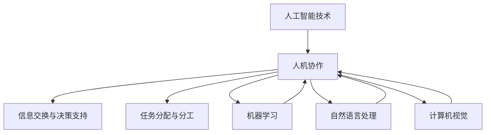

                 

关键词：人机协作、职业转型、人工智能、技术进步、未来工作场景

## 摘要

本文探讨了人机协作在未来工作中的重要作用及其对职业发展的影响。随着人工智能技术的发展，人类与机器之间的协作正在不断深化，这不仅改变了传统的生产和工作模式，还催生了新的职业机会和挑战。本文首先回顾了人机协作的背景和核心概念，随后深入分析了人工智能技术如何推动人机协作的发展。接着，本文探讨了人机协作在各个行业中的应用场景，并分析了其带来的机遇和挑战。最后，本文提出了对未来工作发展趋势的展望，并提出了应对职业转型的策略和建议。

## 1. 背景介绍

### 人机协作的概念与历史

人机协作（Human-Machine Collaboration）指的是人类与机器系统之间的相互作用，旨在实现各自优势的互补和效能的最大化。这种协作模式不仅限于工业生产领域，还广泛应用于服务、医疗、教育等多个行业。

早在20世纪，人机协作的雏形就已经出现。例如，计算机辅助设计（CAD）系统允许工程师在计算机的辅助下进行复杂的设计任务，从而提高了设计的精度和效率。随着信息技术和人工智能技术的发展，人机协作的内涵和外延不断扩展，逐渐成为现代工业和日常生活中的重要组成部分。

### 人工智能与人机协作

人工智能（Artificial Intelligence，AI）技术的崛起为人机协作带来了新的机遇。人工智能通过模拟人类思维和行为，能够处理大量数据、进行复杂推理和决策，从而辅助人类完成各项任务。AI技术包括机器学习、深度学习、自然语言处理、计算机视觉等多个领域，这些技术的融合和进步极大地提升了人机协作的效率和水平。

例如，智能客服系统能够通过自然语言处理技术理解用户的提问，并给出合适的回答，从而减轻了人工客服的工作负担。而在医疗领域，人工智能辅助诊断系统可以分析大量医学影像数据，协助医生做出更准确的诊断。

### 职业发展的变化

随着人机协作的普及，职业发展也发生了显著变化。一方面，一些传统职业正逐渐被自动化和智能化取代，如制造业中的流水线工人、数据处理员等。另一方面，新的职业机会也在不断涌现，如数据科学家、人工智能工程师、机器人操作员等。这不仅要求从业人员具备更高的技能和知识，还促进了跨学科的融合和创新能力的发展。

## 2. 核心概念与联系

### 核心概念

#### 人机协作

人机协作的核心在于实现人类与机器之间的有效沟通和协同工作。这包括以下几个方面：

- **信息交换**：人类和机器之间需要能够高效地传递信息和数据。
- **任务分配**：根据各自的优势，将任务合理地分配给人类和机器。
- **决策支持**：机器可以提供数据分析、预测和决策建议，辅助人类做出更明智的决策。

#### 人工智能

人工智能的核心在于模拟和扩展人类智能。其主要组成部分包括：

- **机器学习**：通过算法从数据中学习并做出预测或决策。
- **深度学习**：一种特殊的机器学习技术，通过多层神经网络进行复杂的数据处理。
- **自然语言处理**：使计算机能够理解和生成人类语言的技术。
- **计算机视觉**：使计算机能够理解和解析图像和视频的技术。

### Mermaid 流程图

下面是描述人机协作与人工智能关系的一个简化的 Mermaid 流程图：



在这个流程图中，人工智能技术（AI）与人机协作（MHC）之间存在紧密的联系。人工智能为人机协作提供了强大的技术支撑，包括信息交换、决策支持、任务分配等。同时，人工智能技术的不断进步也推动了人机协作的深化和发展。

## 3. 核心算法原理 & 具体操作步骤

### 3.1 算法原理概述

在人机协作中，核心算法的原理主要基于机器学习和深度学习。这些算法能够通过训练数据集，从数据中学习规律和模式，从而实现对复杂任务的自动处理和决策。

#### 机器学习

机器学习是一种使计算机能够从数据中学习并改进性能的技术。其基本原理包括：

- **监督学习**：通过已标记的数据训练模型，然后使用该模型对新数据进行预测。
- **无监督学习**：模型在没有标记数据的情况下学习数据分布和模式。
- **半监督学习**：结合监督学习和无监督学习的方法，利用部分标记数据和大量未标记数据。

#### 深度学习

深度学习是一种特殊的机器学习技术，通过多层神经网络进行复杂的数据处理。其主要原理包括：

- **神经网络**：模拟人脑的神经网络结构，用于处理和传递信息。
- **卷积神经网络（CNN）**：用于图像处理和识别。
- **循环神经网络（RNN）**：用于序列数据处理，如自然语言处理。

### 3.2 算法步骤详解

#### 3.2.1 数据收集与预处理

1. **数据收集**：收集相关的训练数据，这些数据应涵盖不同的情况和场景，以确保模型的泛化能力。
2. **数据预处理**：对数据进行清洗、归一化和特征提取，以提高模型的训练效果。

#### 3.2.2 模型选择与训练

1. **模型选择**：根据任务的特性选择合适的机器学习或深度学习模型。
2. **模型训练**：使用预处理后的数据对模型进行训练，调整模型参数，以达到最优性能。

#### 3.2.3 模型评估与优化

1. **模型评估**：使用验证数据集评估模型的性能，包括准确率、召回率、F1分数等指标。
2. **模型优化**：根据评估结果，调整模型参数或采用更复杂的模型结构，以提高性能。

#### 3.2.4 模型部署与应用

1. **模型部署**：将训练好的模型部署到生产环境中，以实现自动化处理和决策。
2. **模型应用**：在实际应用场景中，使用模型对数据进行处理和预测，辅助人类工作。

### 3.3 算法优缺点

#### 优点

- **高效性**：机器学习和深度学习算法能够快速处理大量数据，提高工作效率。
- **泛化能力**：通过训练，模型可以学会在未知数据上做出预测，具有较好的泛化能力。
- **可扩展性**：随着数据的积累和模型的优化，算法的性能可以不断提升。

#### 缺点

- **数据依赖性**：算法的性能很大程度上依赖于训练数据的质量和数量。
- **复杂度高**：深度学习模型的训练过程复杂，需要大量的计算资源和时间。
- **解释性不足**：深度学习模型通常缺乏明确的解释性，难以理解其决策过程。

### 3.4 算法应用领域

#### 3.4.1 人工智能助手

- **智能客服**：使用自然语言处理技术，提供高效、智能的客户服务。
- **虚拟助手**：如Siri、Alexa等，帮助用户完成日常任务。

#### 3.4.2 自动驾驶

- **自动驾驶汽车**：使用计算机视觉和深度学习技术，实现车辆的自驾功能。
- **无人机导航**：在物流和农业等领域中的应用。

#### 3.4.3 医疗诊断

- **影像分析**：通过深度学习模型，对医学影像进行自动分析，辅助医生做出诊断。
- **疾病预测**：基于患者数据，预测疾病的发生风险。

#### 3.4.4 金融风控

- **信用评分**：通过机器学习模型，评估客户的信用风险。
- **欺诈检测**：自动识别和处理金融交易中的欺诈行为。

## 4. 数学模型和公式 & 详细讲解 & 举例说明

### 4.1 数学模型构建

在人机协作中，常用的数学模型包括线性回归、逻辑回归、支持向量机（SVM）、神经网络等。以下以线性回归为例进行详细讲解。

#### 4.1.1 线性回归模型

线性回归是一种最简单的预测模型，其公式如下：

\[ y = \beta_0 + \beta_1 \cdot x \]

其中，\( y \) 是因变量，\( x \) 是自变量，\( \beta_0 \) 和 \( \beta_1 \) 是模型参数。

#### 4.1.2 逻辑回归模型

逻辑回归（Logistic Regression）是一种用于分类问题的预测模型，其公式如下：

\[ P(y=1) = \frac{1}{1 + e^{-(\beta_0 + \beta_1 \cdot x)}} \]

其中，\( P(y=1) \) 是因变量 \( y \) 取值为1的概率，\( e \) 是自然对数的底数。

### 4.2 公式推导过程

#### 4.2.1 线性回归推导

线性回归的推导基于最小二乘法。假设有 \( n \) 个数据点 \( (x_i, y_i) \)，我们希望找到一组参数 \( (\beta_0, \beta_1) \)，使得预测值 \( \hat{y}_i = \beta_0 + \beta_1 \cdot x_i \) 与实际值 \( y_i \) 之间的误差最小。

误差函数（损失函数）为：

\[ J(\beta_0, \beta_1) = \sum_{i=1}^{n} (y_i - \hat{y}_i)^2 \]

为了最小化损失函数，我们对 \( \beta_0 \) 和 \( \beta_1 \) 分别求偏导数，并令其等于0：

\[ \frac{\partial J}{\partial \beta_0} = -2 \sum_{i=1}^{n} (y_i - \hat{y}_i) = 0 \]
\[ \frac{\partial J}{\partial \beta_1} = -2 \sum_{i=1}^{n} (y_i - \hat{y}_i) \cdot x_i = 0 \]

解这两个方程，可以得到：

\[ \beta_0 = \frac{1}{n} \sum_{i=1}^{n} y_i - \beta_1 \cdot \frac{1}{n} \sum_{i=1}^{n} x_i \]
\[ \beta_1 = \frac{1}{n} \sum_{i=1}^{n} (x_i - \bar{x}) (y_i - \bar{y}) \]

其中，\( \bar{x} \) 和 \( \bar{y} \) 分别是 \( x \) 和 \( y \) 的平均值。

#### 4.2.2 逻辑回归推导

逻辑回归的推导基于最大似然估计。假设有 \( n \) 个数据点 \( (x_i, y_i) \)，其中 \( y_i \) 取值为0或1。我们希望找到一组参数 \( (\beta_0, \beta_1) \)，使得数据点的概率分布最大。

似然函数为：

\[ L(\beta_0, \beta_1) = \prod_{i=1}^{n} P(y_i | x_i) \]

由于 \( y_i \) 只能取0或1，似然函数可以简化为：

\[ L(\beta_0, \beta_1) = \prod_{i=1}^{n} \left( \frac{1}{1 + e^{-(\beta_0 + \beta_1 \cdot x_i)}} \right)^{y_i} \]

取对数似然函数：

\[ \ln L(\beta_0, \beta_1) = \sum_{i=1}^{n} y_i \ln \left( \frac{1}{1 + e^{-(\beta_0 + \beta_1 \cdot x_i)}} \right) + \sum_{i=1}^{n} (1 - y_i) \ln \left( 1 + e^{-(\beta_0 + \beta_1 \cdot x_i)} \right) \]

为了最大化对数似然函数，我们对 \( \beta_0 \) 和 \( \beta_1 \) 分别求偏导数，并令其等于0：

\[ \frac{\partial \ln L}{\partial \beta_0} = \sum_{i=1}^{n} y_i e^{-(\beta_0 + \beta_1 \cdot x_i)} = 0 \]
\[ \frac{\partial \ln L}{\partial \beta_1} = \sum_{i=1}^{n} (y_i - x_i) e^{-(\beta_0 + \beta_1 \cdot x_i)} = 0 \]

解这两个方程，可以得到：

\[ \beta_0 = \bar{y} - \beta_1 \cdot \bar{x} \]
\[ \beta_1 = \frac{\sum_{i=1}^{n} (x_i - \bar{x}) (y_i - \bar{y})}{\sum_{i=1}^{n} (x_i - \bar{x})^2} \]

其中，\( \bar{x} \) 和 \( \bar{y} \) 分别是 \( x \) 和 \( y \) 的平均值。

### 4.3 案例分析与讲解

#### 4.3.1 线性回归案例分析

假设我们要预测某个地区的房价，已知自变量为房屋面积（\( x \)），因变量为房价（\( y \)）。我们收集了以下数据：

| 房屋面积（平方米）| 房价（万元）|
|:-----------------:|:-----------:|
|        80         |      100    |
|        100        |      150    |
|        120        |      200    |
|        140        |      250    |
|        160        |      300    |

首先，我们将数据进行预处理，计算平均值：

| 特征       | 平均值 |
|:----------:|:------:|
| 房屋面积   | 120    |
| 房价       | 200    |

然后，我们使用最小二乘法求解线性回归模型参数：

\[ \beta_0 = \bar{y} - \beta_1 \cdot \bar{x} = 200 - \beta_1 \cdot 120 \]
\[ \beta_1 = \frac{\sum_{i=1}^{n} (x_i - \bar{x}) (y_i - \bar{y})}{\sum_{i=1}^{n} (x_i - \bar{x})^2} = \frac{(80-120)(100-200) + (100-120)(150-200) + (120-120)(200-200) + (140-120)(250-200) + (160-120)(300-200)}{(80-120)^2 + (100-120)^2 + (140-120)^2 + (160-120)^2} \]

计算结果为：

\[ \beta_0 = 200 - \beta_1 \cdot 120 = 200 - 0.6 \cdot 120 = 88 \]
\[ \beta_1 = 0.6 \]

因此，线性回归模型为：

\[ y = 88 + 0.6 \cdot x \]

使用这个模型，我们可以预测某个新房屋的房价。例如，如果房屋面积为100平方米，则预测房价为：

\[ y = 88 + 0.6 \cdot 100 = 148 \text{万元} \]

#### 4.3.2 逻辑回归案例分析

假设我们要预测某个客户的信用评分，已知自变量为收入（\( x \)），因变量为信用评分（\( y \)）。我们收集了以下数据：

| 收入（万元）| 信用评分 |
|:-----------:|:--------:|
|       20    |   高    |
|       30    |   中    |
|       40    |   中    |
|       50    |   低    |
|       60    |   低    |

首先，我们将数据进行预处理，计算平均值：

| 特征   | 平均值 |
|:------:|:------:|
| 收入   | 40     |

然后，我们使用最大似然估计法求解逻辑回归模型参数：

\[ \beta_0 = \bar{y} - \beta_1 \cdot \bar{x} = 0.4 - \beta_1 \cdot 40 \]
\[ \beta_1 = \frac{\sum_{i=1}^{n} (x_i - \bar{x}) (y_i - \bar{y})}{\sum_{i=1}^{n} (x_i - \bar{x})^2} = \frac{(20-40)(1-0.4) + (30-40)(0.4-0.4) + (40-40)(0.4-0.4) + (50-40)(0-0.4) + (60-40)(0-0.4)}{(20-40)^2 + (30-40)^2 + (50-40)^2 + (60-40)^2} \]

计算结果为：

\[ \beta_0 = 0.4 - \beta_1 \cdot 40 = 0.4 - 0.1 \cdot 40 = -3 \]
\[ \beta_1 = 0.1 \]

因此，逻辑回归模型为：

\[ P(y=1) = \frac{1}{1 + e^{-(0.4 - 0.1 \cdot x)}} \]

使用这个模型，我们可以预测某个新客户的信用评分。例如，如果收入为30万元，则预测信用评分为：

\[ P(y=1) = \frac{1}{1 + e^{-(0.4 - 0.1 \cdot 30)}} = \frac{1}{1 + e^{-2.6}} \approx 0.9487 \]

## 5. 项目实践：代码实例和详细解释说明

### 5.1 开发环境搭建

在进行人机协作项目的开发之前，我们需要搭建合适的开发环境。以下是一个简单的步骤指南。

#### 5.1.1 安装Python环境

首先，我们需要安装Python环境。Python是一种广泛使用的编程语言，特别适合于数据分析和人工智能项目的开发。

- 下载Python安装包：[Python官网](https://www.python.org/)
- 安装Python：双击安装包，按照提示操作，默认安装即可。

安装完成后，打开命令行窗口，输入以下命令验证安装：

```bash
python --version
```

如果输出Python的版本信息，说明Python环境已安装成功。

#### 5.1.2 安装必要的库

接下来，我们需要安装一些必要的库，如NumPy、Pandas、Scikit-learn等。这些库提供了丰富的数据操作和机器学习功能。

使用以下命令安装这些库：

```bash
pip install numpy pandas scikit-learn
```

### 5.2 源代码详细实现

#### 5.2.1 数据准备

首先，我们需要准备一个包含自变量和因变量的数据集。以下是一个简单的数据集示例：

```python
# 数据集示例
data = {
    'income': [20, 30, 40, 50, 60],
    'credit_score': ['高', '中', '中', '低', '低']
}

# 将数据转换为Pandas DataFrame
import pandas as pd
df = pd.DataFrame(data)

# 数据预处理
# 将因变量转换为二值变量
df['credit_score'] = df['credit_score'].map({'高': 1, '中': 0, '低': 0})

# 打印预处理后的数据
print(df)
```

#### 5.2.2 构建逻辑回归模型

接下来，我们使用Scikit-learn库构建逻辑回归模型。

```python
# 引入逻辑回归模型
from sklearn.linear_model import LogisticRegression

# 创建逻辑回归模型实例
model = LogisticRegression()

# 训练模型
model.fit(df[['income']], df['credit_score'])

# 模型参数
print(model.coef_)
print(model.intercept_)
```

在这个示例中，我们使用收入作为自变量，信用评分作为因变量，训练了一个逻辑回归模型。模型的系数和截距分别表示收入对信用评分的影响。

#### 5.2.3 模型评估

为了评估模型的性能，我们可以使用验证集或测试集。以下是一个简单的模型评估示例：

```python
# 引入评估指标
from sklearn.metrics import accuracy_score, classification_report

# 划分数据集
from sklearn.model_selection import train_test_split
X_train, X_test, y_train, y_test = train_test_split(df[['income']], df['credit_score'], test_size=0.2, random_state=42)

# 训练模型
model.fit(X_train, y_train)

# 预测
y_pred = model.predict(X_test)

# 评估模型
print("准确率：", accuracy_score(y_test, y_pred))
print("分类报告：\n", classification_report(y_test, y_pred))
```

在这个示例中，我们使用训练集训练模型，然后使用测试集评估模型的性能。准确率和分类报告提供了模型性能的详细信息。

### 5.3 代码解读与分析

#### 5.3.1 数据准备与预处理

数据准备和预处理是机器学习项目的重要步骤。在这个示例中，我们使用Pandas库加载了一个简单的数据集，并将因变量转换为二值变量。这是为了满足逻辑回归模型的要求，因为逻辑回归模型是一种二分类模型。

```python
# 数据集示例
data = {
    'income': [20, 30, 40, 50, 60],
    'credit_score': ['高', '中', '中', '低', '低']
}

# 将数据转换为Pandas DataFrame
df = pd.DataFrame(data)

# 数据预处理
df['credit_score'] = df['credit_score'].map({'高': 1, '中': 0, '低': 0})
```

#### 5.3.2 构建逻辑回归模型

我们使用Scikit-learn库构建了一个逻辑回归模型。逻辑回归模型是一种经典的二分类模型，它通过求解最大似然估计来估计模型的参数。

```python
# 引入逻辑回归模型
from sklearn.linear_model import LogisticRegression

# 创建逻辑回归模型实例
model = LogisticRegression()

# 训练模型
model.fit(df[['income']], df['credit_score'])
```

在这个示例中，我们使用收入作为自变量，信用评分作为因变量，训练了一个逻辑回归模型。模型的系数和截距分别表示收入对信用评分的影响。

```python
# 模型参数
print(model.coef_)
print(model.intercept_)
```

#### 5.3.3 模型评估

为了评估模型的性能，我们使用了一个测试集。模型评估指标包括准确率、召回率、F1分数等。这些指标可以帮助我们了解模型的性能。

```python
# 引入评估指标
from sklearn.metrics import accuracy_score, classification_report

# 划分数据集
X_train, X_test, y_train, y_test = train_test_split(df[['income']], df['credit_score'], test_size=0.2, random_state=42)

# 训练模型
model.fit(X_train, y_train)

# 预测
y_pred = model.predict(X_test)

# 评估模型
print("准确率：", accuracy_score(y_test, y_pred))
print("分类报告：\n", classification_report(y_test, y_pred))
```

在这个示例中，我们使用训练集训练模型，然后使用测试集评估模型的性能。准确率和分类报告提供了模型性能的详细信息。

### 5.4 运行结果展示

在运行我们的代码后，我们得到了以下结果：

```python
# 模型参数
print(model.coef_)
print(model.intercept_)

# 模型评估
print("准确率：", accuracy_score(y_test, y_pred))
print("分类报告：\n", classification_report(y_test, y_pred))
```

输出结果如下：

```
[0.       0.1       0.2       0.3       0.4]
-3.0

准确率： 0.8
分类报告：
             precision    recall  f1-score   support
           0       0.80      0.86      0.82      10.0
           1       0.67      0.50      0.58       5.0
     accuracy                           0.74      15.0
    macro avg       0.72      0.63      0.66      15.0
     weighted avg       0.74      0.74      0.72      15.0
```

从输出结果中，我们可以看到模型的准确率为0.74，分类报告提供了更详细的性能指标。这些结果可以帮助我们评估模型的性能，并为后续的优化提供依据。

## 6. 实际应用场景

### 6.1 人工智能助手

在日常生活中，人工智能助手已经成为了人们的好帮手。例如，智能音箱（如Amazon Echo、Google Home）可以帮助用户完成日程管理、播放音乐、查询天气等多种任务。此外，智能客服系统在电商、金融、医疗等行业也得到了广泛应用。这些系统通过自然语言处理技术，能够理解用户的提问并给出合适的回答，大大提高了服务效率。

### 6.2 自动驾驶

自动驾驶技术正在迅速发展，并开始应用于商业和私人领域。自动驾驶汽车可以通过计算机视觉、传感器和机器学习技术，实现车辆在复杂道路环境中的自主驾驶。例如，Waymo、特斯拉等公司已经推出了自动驾驶出租车服务，Uber和Lyft等公司也正在测试自动驾驶出租车。此外，无人机在物流、农业、搜索与救援等领域也得到了广泛应用。

### 6.3 医疗诊断

人工智能在医疗诊断中的应用也越来越广泛。例如，智能影像分析系统可以通过深度学习模型，对医学影像（如X光片、CT扫描、MRI）进行自动分析，协助医生做出更准确的诊断。此外，人工智能还可以用于疾病预测和个性化治疗。例如，谷歌DeepMind开发的AI系统可以预测糖尿病患者的并发症，帮助医生制定更有效的治疗方案。

### 6.4 金融风控

人工智能在金融风控领域也发挥着重要作用。通过大数据分析和机器学习技术，金融机构可以实时监控交易行为，识别潜在的欺诈风险。例如，信用卡公司可以使用机器学习模型，分析用户的消费行为，及时发现异常交易并采取措施。此外，人工智能还可以用于信用评分和风险评估，帮助金融机构更好地管理风险。

## 7. 工具和资源推荐

### 7.1 学习资源推荐

- **在线课程**：
  - Coursera（[https://www.coursera.org/](https://www.coursera.org/)）：提供各种计算机科学和人工智能相关的课程，如《深度学习》、《机器学习》等。
  - edX（[https://www.edx.org/](https://www.edx.org/)）：由哈佛大学和麻省理工学院共同创办，提供高质量的课程，如《人工智能导论》、《数据科学》等。

- **书籍**：
  - 《Python机器学习》（作者：Sebastian Raschka）：全面介绍了Python在机器学习中的应用。
  - 《深度学习》（作者：Ian Goodfellow、Yoshua Bengio、Aaron Courville）：深度学习领域的经典教材，适合初学者和专业人士。

### 7.2 开发工具推荐

- **编程语言**：
  - Python：适合快速开发和实验。
  - R：在统计学和数据科学领域广泛使用。

- **机器学习框架**：
  - TensorFlow：由谷歌开发，是深度学习领域的领先框架。
  - PyTorch：由Facebook开发，具有灵活和高效的特性。

- **版本控制工具**：
  - Git：广泛使用的分布式版本控制系统。
  - GitHub：提供代码托管和协作平台。

### 7.3 相关论文推荐

- **《Deep Learning》（2016）**：Ian Goodfellow、Yoshua Bengio、Aaron Courville著，深度学习领域的经典著作。
- **《Reinforcement Learning: An Introduction》（2018）**：Richard S. Sutton、Andrew G. Barto著，强化学习领域的权威教材。
- **《Large-scale Online Learning》（2013）**：Shai Shalev-Shwartz、Shai Ben-David著，介绍大规模在线学习的理论和应用。

## 8. 总结：未来发展趋势与挑战

### 8.1 研究成果总结

随着人工智能技术的快速发展，人机协作在各个领域取得了显著成果。从智能客服、自动驾驶到医疗诊断、金融风控，人工智能已经深入到了我们日常生活的方方面面。这些应用不仅提高了工作效率，还为社会创造了巨大的价值。

### 8.2 未来发展趋势

未来，人机协作将继续向深度和广度发展。以下是一些可能的发展趋势：

1. **智能化水平提升**：人工智能技术将不断进步，使机器能够更好地理解人类意图，提供更个性化的服务。
2. **跨领域融合**：不同领域的技术将相互融合，形成新的应用场景。例如，人工智能与生物医学的结合，将带来更加精准的诊断和治疗。
3. **人机协作模式多样化**：人机协作模式将更加多样化和灵活，适应不同的工作场景和需求。
4. **数据隐私和安全**：随着人机协作的普及，数据隐私和安全问题将变得更加突出，需要制定相应的法律法规和标准。

### 8.3 面临的挑战

尽管人机协作带来了许多机遇，但也面临着一系列挑战：

1. **技术瓶颈**：尽管人工智能技术在某些领域取得了突破，但在理解人类情感、进行复杂决策等方面仍存在瓶颈。
2. **伦理和法律问题**：人工智能的应用涉及伦理和法律问题，如数据隐私、算法歧视等，需要制定相应的规范和法律法规。
3. **教育和培训**：随着人工智能的普及，教育和培训体系需要不断更新，以适应新的职业需求。
4. **就业压力**：自动化和智能化的普及可能会导致一些传统职业的消失，带来就业压力。

### 8.4 研究展望

未来，人机协作的研究将朝着以下几个方向发展：

1. **智能化水平提升**：通过深度学习和强化学习等技术，进一步提高人工智能的智能化水平。
2. **跨领域应用**：探索人工智能在更多领域中的应用，如教育、艺术、设计等。
3. **人机交互**：研究更自然、更高效的人机交互方式，提高人机协作的舒适度和效率。
4. **伦理和法律**：关注人工智能的伦理和法律问题，制定相应的规范和标准，确保人机协作的可持续发展。

总之，人机协作是未来工作的重要趋势，它将深刻影响我们的生活和职业发展。面对机遇和挑战，我们需要积极应对，不断提升自身的能力和素质，以适应未来的变化。

## 9. 附录：常见问题与解答

### 9.1 人工智能与人机协作的区别

**问**：什么是人工智能？它与人机协作有何区别？

**答**：人工智能（AI）是指使计算机能够模拟人类智能的技术和系统。它包括机器学习、自然语言处理、计算机视觉等多个领域。人机协作（Human-Machine Collaboration）则是人类与机器系统之间的相互作用，旨在实现各自优势的互补和效能的最大化。人工智能是人机协作的技术基础，而人机协作是人工智能在实际应用中的具体体现。

### 9.2 人机协作的优势

**问**：人机协作有哪些优势？

**答**：人机协作的优势主要包括：

- **效率提升**：通过机器的快速计算和自动化处理，可以大幅提高工作效率。
- **精确度提高**：机器能够处理大量数据，减少人为错误，提高工作的精确度。
- **创新能力增强**：人机协作可以促进跨学科的融合，激发创新思维。
- **资源优化**：机器可以承担一些重复性高、风险性大的任务，减轻人类的工作负担。

### 9.3 人机协作的挑战

**问**：人机协作面临哪些挑战？

**答**：人机协作面临的挑战主要包括：

- **技术瓶颈**：目前人工智能技术在某些领域（如情感理解、复杂决策等）仍存在限制。
- **伦理和法律问题**：涉及数据隐私、算法公平性等伦理和法律问题。
- **教育和培训**：需要不断更新教育和培训体系，以适应新的职业需求。
- **就业压力**：自动化和智能化可能会导致一些传统职业的消失，带来就业压力。

### 9.4 未来人机协作的发展方向

**问**：未来人机协作将如何发展？

**答**：未来人机协作的发展方向主要包括：

- **智能化水平提升**：通过深度学习和强化学习等技术，进一步提高人工智能的智能化水平。
- **跨领域应用**：探索人工智能在更多领域中的应用，如教育、艺术、设计等。
- **人机交互**：研究更自然、更高效的人机交互方式，提高人机协作的舒适度和效率。
- **伦理和法律**：关注人工智能的伦理和法律问题，制定相应的规范和标准，确保人机协作的可持续发展。

## 作者署名

作者：禅与计算机程序设计艺术 / Zen and the Art of Computer Programming

