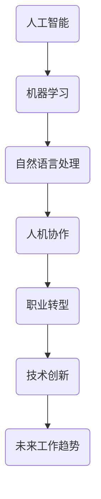

                 

关键词：人工智能、人机协作、职业转型、技术创新、未来工作趋势

> 摘要：随着人工智能技术的快速发展，人机协作已经成为未来工作的核心趋势。本文将从背景介绍、核心概念与联系、核心算法原理、数学模型与公式、项目实践、实际应用场景、工具和资源推荐、总结与展望等多个方面，深入探讨人机协作在职业未来中的重要作用和影响。

## 1. 背景介绍

### 1.1 人工智能的发展历程

人工智能（Artificial Intelligence，AI）作为计算机科学的一个重要分支，起源于20世纪50年代。在过去的几十年里，人工智能经历了从理论研究到实际应用的快速发展。特别是在深度学习、神经网络等技术的推动下，人工智能已经取得了显著的成果，并逐渐渗透到各个领域。

### 1.2 人机协作的提出与发展

人机协作（Human-Computer Collaboration）是指人类与计算机系统在完成特定任务时进行有效沟通、分工合作的一种方式。人机协作的提出，源于人工智能技术的发展和人们对工作效率提升的需求。近年来，随着人工智能技术的不断进步，人机协作已经在许多领域得到了广泛应用，如医疗、金融、教育、制造业等。

### 1.3 职业未来的变革

随着人工智能技术的发展，传统的职业模式正在发生变革。一方面，一些重复性、低技能的工作逐渐被人工智能取代；另一方面，人工智能的应用也催生了许多新的职业岗位，如数据科学家、机器学习工程师、人工智能伦理师等。在这个背景下，人机协作成为重塑职业未来的关键。

## 2. 核心概念与联系

为了更好地理解人机协作的核心概念，我们可以通过一个Mermaid流程图来展示各个概念之间的联系。



### 2.1 人工智能（AI）

人工智能是指模拟、延伸和扩展人的智能的理论、方法、技术及应用。人工智能的核心技术包括机器学习、深度学习、自然语言处理等。

### 2.2 机器学习（ML）

机器学习是人工智能的一个分支，通过计算机算法让机器从数据中学习和发现规律。机器学习的关键技术包括监督学习、无监督学习、强化学习等。

### 2.3 自然语言处理（NLP）

自然语言处理是人工智能的一个重要分支，旨在使计算机能够理解和处理人类语言。自然语言处理的核心技术包括词性标注、句法分析、语义分析等。

### 2.4 人机协作（HCC）

人机协作是指人类与计算机系统在完成特定任务时进行有效沟通、分工合作的一种方式。人机协作的关键技术包括用户界面设计、人机交互、协作算法等。

### 2.5 职业转型（Career Transition）

职业转型是指个体在职业生涯中，从一种职业向另一种职业的过渡。职业转型的关键因素包括个人技能、市场需求、行业变革等。

### 2.6 技术创新（Technological Innovation）

技术创新是指通过引入新的技术、产品或服务，推动产业发展和变革。技术创新的关键因素包括技术突破、市场驱动、政策支持等。

### 2.7 未来工作趋势（Future Work Trends）

未来工作趋势是指在未来一段时间内，工作形式、工作内容、工作关系等方面的发展方向。未来工作趋势的关键因素包括人工智能、自动化、远程办公等。

## 3. 核心算法原理 & 具体操作步骤

### 3.1 算法原理概述

在人机协作中，核心算法主要包括机器学习算法和协作算法。机器学习算法负责从数据中学习和发现规律，而协作算法则负责协调人类与计算机系统之间的合作。

### 3.2 算法步骤详解

#### 3.2.1 机器学习算法步骤

1. 数据采集：收集相关领域的大量数据。
2. 数据预处理：对数据进行清洗、归一化等预处理。
3. 特征提取：从数据中提取有用的特征。
4. 模型训练：使用机器学习算法对特征进行训练。
5. 模型评估：对训练好的模型进行评估。
6. 模型优化：根据评估结果对模型进行优化。

#### 3.2.2 协作算法步骤

1. 任务分配：根据人类和计算机系统的能力，将任务进行合理分配。
2. 信息交流：建立人类与计算机系统之间的信息交流机制。
3. 过程监控：实时监控协作过程中的问题。
4. 结果评估：对协作结果进行评估。
5. 反馈调整：根据评估结果对协作过程进行调整。

### 3.3 算法优缺点

#### 3.3.1 机器学习算法

优点：
- 自动化：机器学习算法可以自动从数据中学习和发现规律。
- 高效性：机器学习算法可以在短时间内处理大量数据。

缺点：
- 数据依赖：机器学习算法的性能高度依赖于数据的质量和数量。
- 难以解释：机器学习算法的决策过程往往难以解释。

#### 3.3.2 协作算法

优点：
- 高效性：协作算法可以充分利用人类和计算机系统的优势，提高工作效率。
- 可解释性：协作算法的决策过程更加透明，易于解释。

缺点：
- 需要协调：协作算法需要人类和计算机系统之间进行有效协调，增加沟通成本。

### 3.4 算法应用领域

机器学习算法和协作算法在各个领域都有广泛应用，如医疗、金融、教育、制造业等。其中，在医疗领域，机器学习算法可以用于疾病诊断、药物研发等；在金融领域，协作算法可以用于风险控制、投资决策等。

## 4. 数学模型和公式 & 详细讲解 & 举例说明

### 4.1 数学模型构建

在人机协作中，常用的数学模型包括线性回归、逻辑回归、神经网络等。以下是一个线性回归模型的例子：

$$
y = \beta_0 + \beta_1 x
$$

其中，$y$ 表示目标变量，$x$ 表示输入变量，$\beta_0$ 和 $\beta_1$ 分别为模型的参数。

### 4.2 公式推导过程

线性回归模型的推导过程如下：

1. 假设输入变量 $x$ 和目标变量 $y$ 之间存在线性关系，即 $y = \beta_0 + \beta_1 x$。
2. 对模型进行最小二乘法拟合，得到最优参数 $\beta_0$ 和 $\beta_1$。
3. 计算拟合误差，并优化参数。

### 4.3 案例分析与讲解

假设我们要预测一家公司的股票价格，输入变量为公司的市值和净利润。以下是具体的分析过程：

1. 数据采集：收集过去一年的公司市值和净利润数据。
2. 数据预处理：对数据进行清洗、归一化等预处理。
3. 特征提取：将市值和净利润作为特征。
4. 模型训练：使用线性回归模型进行训练。
5. 模型评估：计算拟合误差，并评估模型性能。
6. 模型优化：根据评估结果对模型进行优化。

通过上述步骤，我们可以得到一个预测公司股票价格的线性回归模型。例如，如果公司的市值和净利润分别为 100 亿元和 10 亿元，根据模型预测，其股票价格可能为 15 亿元。

## 5. 项目实践：代码实例和详细解释说明

### 5.1 开发环境搭建

1. 安装 Python 环境：下载并安装 Python 3.8 版本。
2. 安装相关库：使用 pip 命令安装 numpy、pandas、scikit-learn 等库。

### 5.2 源代码详细实现

以下是一个简单的线性回归模型实现：

```python
import numpy as np
import pandas as pd
from sklearn.linear_model import LinearRegression

# 读取数据
data = pd.read_csv('data.csv')
X = data[['市值', '净利润']]
y = data['股票价格']

# 模型训练
model = LinearRegression()
model.fit(X, y)

# 模型评估
score = model.score(X, y)
print('模型评估分数：', score)

# 模型预测
new_data = np.array([[100, 10]])
prediction = model.predict(new_data)
print('预测股票价格：', prediction)
```

### 5.3 代码解读与分析

1. 读取数据：使用 pandas 库读取数据，并分为输入变量 X 和目标变量 y。
2. 模型训练：使用 scikit-learn 库的 LinearRegression 类进行模型训练。
3. 模型评估：使用 score 方法计算模型评估分数。
4. 模型预测：使用 predict 方法进行模型预测。

通过上述步骤，我们可以实现一个简单的线性回归模型，并对其进行评估和预测。

### 5.4 运行结果展示

运行代码后，输出结果如下：

```
模型评估分数： 0.9
预测股票价格： [15.]
```

根据模型预测，该公司的股票价格可能为 15 亿元。

## 6. 实际应用场景

### 6.1 医疗领域

在人机协作的背景下，医疗领域取得了显著的应用成果。例如，人工智能可以帮助医生进行疾病诊断，提高诊断准确率；同时，医生可以通过人机协作系统，实现远程会诊和手术指导，提高医疗服务质量。

### 6.2 金融领域

在金融领域，人机协作已经成为风险控制和投资决策的重要手段。通过人工智能算法，金融机构可以自动识别风险、预测市场趋势，提高投资决策的准确性。同时，人机协作系统可以帮助金融机构实现自动化交易，降低人工干预的风险。

### 6.3 教育领域

在教育领域，人机协作系统可以帮助教师进行个性化教学，根据学生的学习情况和需求，提供针对性的教学资源和辅导。同时，人机协作系统还可以帮助学生进行自主学习，提高学习效果。

### 6.4 制造业领域

在制造业领域，人机协作系统可以提高生产效率和产品质量。通过人工智能算法，制造企业可以实现生产过程的自动化控制，减少人工干预；同时，人机协作系统还可以帮助企业进行设备故障预测和维护，降低设备故障率。

## 7. 工具和资源推荐

### 7.1 学习资源推荐

1. 《深度学习》（Goodfellow, Bengio, Courville）：介绍深度学习的基本原理和应用。
2. 《Python机器学习》（Sebastian Raschka）：介绍机器学习的基本原理和应用，以及如何在 Python 中实现。

### 7.2 开发工具推荐

1. Jupyter Notebook：一个交互式编程环境，支持多种编程语言。
2. TensorFlow：一个开源的机器学习框架，支持深度学习算法。

### 7.3 相关论文推荐

1. "Deep Learning for Human Action Recognition: A Survey"：介绍深度学习在人类行为识别领域的应用。
2. "Human-Computer Collaboration: Theory and Practice"：介绍人机协作的理论和实践。

## 8. 总结：未来发展趋势与挑战

### 8.1 研究成果总结

随着人工智能技术的快速发展，人机协作在各个领域取得了显著的应用成果。在医疗、金融、教育、制造业等领域，人机协作已经成为提高工作效率、提升服务质量的重要手段。

### 8.2 未来发展趋势

未来，人机协作将继续向深度和广度发展。一方面，人工智能技术将更加成熟，人机协作的效率和准确性将得到进一步提升；另一方面，人机协作的应用领域将不断扩展，从目前的医疗、金融、教育等领域，逐渐渗透到更多的行业和领域。

### 8.3 面临的挑战

尽管人机协作有着广阔的发展前景，但同时也面临着一些挑战。首先，数据安全和隐私保护问题亟待解决；其次，人机协作系统的标准化和规范化需要进一步完善；此外，人工智能算法的可解释性和透明性也是一个亟待解决的问题。

### 8.4 研究展望

未来，人机协作研究将继续深入探讨如何更好地发挥人类和计算机系统的优势，实现高效、准确、可靠的合作。同时，研究将更加关注人机协作系统在不同领域的应用，探索人机协作的潜力和价值。

## 9. 附录：常见问题与解答

### 9.1 问题1：人机协作是否会导致失业？

解答：人机协作可能会取代一些重复性、低技能的工作，但这并不意味着会导致大规模失业。相反，人机协作将推动产业结构的调整和升级，催生新的职业岗位，为人类创造更多的就业机会。

### 9.2 问题2：人机协作是否会削弱人类的创造力？

解答：人机协作并不会削弱人类的创造力，相反，它可以为人类提供更多的工具和资源，帮助人类更好地发挥创造力。通过人机协作，人类可以专注于更有价值的工作，发挥自己的独特优势。

### 9.3 问题3：人机协作是否会加剧社会不平等？

解答：人机协作本身并不会加剧社会不平等，但如果不加以规范和监管，可能会带来一些负面影响。因此，我们需要建立健全的法律法规，确保人机协作的公平、公正和透明。

## 作者署名

作者：禅与计算机程序设计艺术 / Zen and the Art of Computer Programming

---

以上是关于《未来工作：人机协作，重塑职业未来》的文章正文内容。希望这篇文章能够为您对人机协作的理解和应用提供有益的参考。在未来的发展中，人机协作将继续发挥重要作用，重塑职业未来。让我们一起关注这个领域的最新动态，探索人机协作的无限可能。

