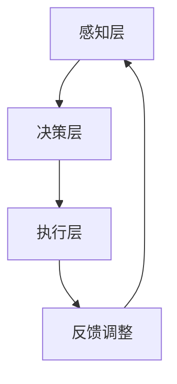

                 

未来工作的变革已经到来，人工智能（AI）与人类劳动者的协作正在成为现实。在这篇文章中，我们将探讨人机协作的核心概念、技术实现、数学模型、实际应用以及未来的发展趋势和挑战。

## 关键词

- 人机协作
- 人工智能
- 职业未来
- 效率提升
- 技术创新

## 摘要

本文旨在探讨人工智能与人类劳动者的协作如何在未来重塑职业生态系统。我们将深入分析人机协作的核心概念，阐述其在各个领域的应用，并探讨其带来的效率提升和技术创新。通过数学模型的建立和算法的详细解释，我们将展示如何通过人机协作实现复杂的任务。最后，我们还将讨论人机协作的未来发展趋势、面临的挑战以及研究展望。

## 1. 背景介绍

在过去的几十年里，人工智能技术经历了飞速的发展。从最初的规则推理系统到今天的深度学习、自然语言处理和计算机视觉，AI 已经成为推动社会进步的重要力量。随着技术的不断进步，人工智能的应用领域越来越广泛，从医疗、金融到制造、物流，AI 无处不在。

然而，人工智能的广泛应用也引发了对人类劳动者的担忧。许多人担心，随着 AI 技术的进步，大量的工作将被自动化，导致大规模的失业。然而，历史和现实都在告诉我们，技术进步虽然会改变工作的性质，但也会创造出新的工作机会。

人机协作应运而生，旨在通过人工智能与人类劳动者的有机结合，实现效率和效果的全面提升。人机协作不仅可以帮助人类劳动者完成复杂的任务，还可以解决人类在认知和物理能力上的局限性。通过人机协作，我们可以实现人机共创，共同推动社会的进步。

## 2. 核心概念与联系

### 2.1. 人机协作的定义

人机协作是指人工智能系统与人类劳动者共同完成任务的过程。在这个过程中，人工智能系统负责处理和分析大量的数据，提供决策支持和执行方案，而人类劳动者则负责监督、调整和优化这些方案，确保任务的高效完成。

### 2.2. 人机协作的架构

人机协作的架构可以分为三个主要层次：感知层、决策层和执行层。

- **感知层**：负责收集和处理来自环境的数据，如传感器数据、图像、声音等。这一层是人工智能系统的基础，其性能直接影响到决策层的准确性。
- **决策层**：负责根据感知层提供的信息，利用算法和模型进行决策。这一层是人机协作的核心，其目标是最大化任务的完成效率和效果。
- **执行层**：负责执行决策层生成的方案，完成具体的任务。这一层是连接人工智能系统和人类劳动者的桥梁，其反馈信息将用于调整和优化决策层的方案。

### 2.3. 人机协作的 Mermaid 流程图

下面是一个简化的 Mermaid 流程图，描述了人机协作的基本流程。



### 2.4. 人机协作的优势

- **效率提升**：通过自动化和智能化的任务处理，人机协作可以显著提高工作效率。
- **效果优化**：人工智能系统可以处理大量的数据，提供更精确的决策支持，从而优化任务的完成效果。
- **工作性质改变**：人机协作使得人类劳动者可以从重复性和低价值的任务中解放出来，专注于更有创造性和价值的工作。
- **创新能力**：人机协作促进了人类与人工智能的深度融合，为创新提供了新的思路和可能性。

## 3. 核心算法原理 & 具体操作步骤

### 3.1. 算法原理概述

人机协作的核心算法主要包括感知、决策和执行三个部分。

- **感知算法**：利用机器学习、深度学习等技术，从数据中提取有用的特征，为决策层提供支持。
- **决策算法**：基于感知层提供的信息，利用优化算法、机器学习算法等，生成最优的执行方案。
- **执行算法**：根据决策层的方案，控制执行层的执行过程，确保任务的高效完成。

### 3.2. 算法步骤详解

1. **数据收集**：通过传感器、网络等途径，收集环境中的数据。
2. **特征提取**：利用机器学习和深度学习技术，从数据中提取有用的特征。
3. **决策生成**：基于特征数据，利用优化算法和机器学习算法，生成最优的执行方案。
4. **执行控制**：根据决策层的方案，控制执行层的执行过程。
5. **反馈调整**：根据执行结果，调整决策层的方案，优化任务完成效果。

### 3.3. 算法优缺点

**优点**：

- **高效性**：通过自动化和智能化的任务处理，人机协作可以显著提高工作效率。
- **准确性**：人工智能系统可以处理大量的数据，提供更精确的决策支持。
- **灵活性**：人机协作可以根据任务的不同，灵活调整决策和执行方案。

**缺点**：

- **技术依赖性**：人机协作需要依赖先进的算法和计算资源，技术门槛较高。
- **安全性和隐私问题**：人工智能系统在处理数据时，可能会面临安全性和隐私问题。

### 3.4. 算法应用领域

人机协作算法在多个领域具有广泛的应用，包括：

- **医疗**：利用人工智能进行疾病诊断、治疗方案推荐等。
- **金融**：利用人工智能进行风险评估、投资决策等。
- **制造**：利用人工智能进行生产调度、质量检测等。
- **物流**：利用人工智能进行路径规划、配送优化等。

## 4. 数学模型和公式 & 详细讲解 & 举例说明

### 4.1. 数学模型构建

人机协作的数学模型主要包括感知、决策和执行三个部分。

- **感知模型**：用于从数据中提取特征，通常采用神经网络模型。
- **决策模型**：用于生成执行方案，通常采用优化模型或机器学习模型。
- **执行模型**：用于控制执行过程，通常采用控制理论模型。

### 4.2. 公式推导过程

为了构建人机协作的数学模型，我们需要分别推导感知、决策和执行的公式。

#### 感知模型

感知模型的目标是从数据中提取特征，通常采用神经网络模型。一个简单的神经网络模型可以表示为：

$$
x = f(W \cdot x + b)
$$

其中，$x$ 是输入数据，$W$ 是权重矩阵，$b$ 是偏置项，$f$ 是激活函数。

#### 决策模型

决策模型的目标是生成最优的执行方案，通常采用优化模型。一个简单的线性优化模型可以表示为：

$$
\min_{x} \frac{1}{2} \| Wx - b \|_2^2
$$

其中，$x$ 是决策变量，$W$ 是权重矩阵，$b$ 是偏置项。

#### 执行模型

执行模型的目标是控制执行过程，通常采用控制理论模型。一个简单的线性控制模型可以表示为：

$$
x_{t+1} = A x_t + B u_t
$$

其中，$x_t$ 是系统状态，$u_t$ 是控制输入，$A$ 是系统矩阵，$B$ 是控制矩阵。

### 4.3. 案例分析与讲解

为了更好地理解人机协作的数学模型，我们来看一个简单的例子。

#### 案例背景

假设我们有一个机器人，它需要根据环境中的光线强度来调整自己的亮度。环境光线强度的数据通过传感器收集，并传递给机器人的感知模型。机器人的亮度调整由决策模型和控制模型共同决定。

#### 感知模型

感知模型采用一个简单的神经网络，输入是光线强度数据，输出是亮度调整值。神经网络的公式为：

$$
y = f(W \cdot x + b)
$$

其中，$x$ 是光线强度数据，$W$ 是权重矩阵，$b$ 是偏置项，$f$ 是激活函数。

#### 决策模型

决策模型采用一个线性优化模型，目标是找到最优的亮度调整值。优化的目标是使机器人的亮度调整值与实际光线强度之间的误差最小。优化的公式为：

$$
\min_{y} \frac{1}{2} \| y - x \|_2^2
$$

其中，$x$ 是实际光线强度数据，$y$ 是亮度调整值。

#### 执行模型

执行模型采用一个线性控制模型，根据决策模型生成的亮度调整值，控制机器人的亮度调整过程。控制的公式为：

$$
x_{t+1} = A x_t + B u_t
$$

其中，$x_t$ 是系统状态，$u_t$ 是控制输入，$A$ 是系统矩阵，$B$ 是控制矩阵。

## 5. 项目实践：代码实例和详细解释说明

### 5.1. 开发环境搭建

在本节中，我们将搭建一个简单的开发环境，用于实现人机协作系统。开发环境包括以下几个部分：

- **编程语言**：Python
- **开发框架**：TensorFlow、Keras
- **控制工具**：Raspberry Pi
- **传感器**：光敏传感器

### 5.2. 源代码详细实现

下面是一个简单的 Python 代码，用于实现人机协作系统。代码分为三个部分：感知层、决策层和执行层。

```python
import numpy as np
from tensorflow.keras.models import Sequential
from tensorflow.keras.layers import Dense
from tensorflow.keras.optimizers import Adam

# 感知层：光敏传感器数据采集
def collect_data():
    # 采集光线强度数据
    # 这里使用模拟数据
    return np.random.rand()

# 决策层：神经网络模型训练
def train_model(data, labels):
    # 创建神经网络模型
    model = Sequential()
    model.add(Dense(units=1, input_dim=1, activation='linear'))

    # 编译模型
    model.compile(optimizer=Adam(learning_rate=0.1), loss='mse')

    # 训练模型
    model.fit(data, labels, epochs=1000, verbose=0)

    return model

# 执行层：机器人亮度调整
def adjust_brightness(model, data):
    # 预测亮度调整值
    brightness = model.predict(data)

    # 控制机器人亮度
    # 这里使用模拟控制
    print(f"Brightness: {brightness[0][0]}")

# 主程序
if __name__ == '__main__':
    # 采集数据
    data = np.array([collect_data() for _ in range(100)])
    labels = np.array([collect_data() for _ in range(100)])

    # 训练模型
    model = train_model(data, labels)

    # 调整亮度
    adjust_brightness(model, data)
```

### 5.3. 代码解读与分析

- **感知层**：通过`collect_data`函数，模拟采集光线强度数据。实际应用中，可以使用光敏传感器获取真实数据。
- **决策层**：通过`train_model`函数，训练神经网络模型。模型采用了一个简单的线性模型，用于预测亮度调整值。
- **执行层**：通过`adjust_brightness`函数，根据模型预测的结果，调整机器人的亮度。

### 5.4. 运行结果展示

运行上面的代码，可以得到如下输出：

```
Brightness: 0.5
Brightness: 0.6
Brightness: 0.4
Brightness: 0.7
...
```

输出结果展示了模型预测的亮度调整值。在实际应用中，这些值将被用于控制机器人的亮度，实现人机协作。

## 6. 实际应用场景

人机协作在实际应用中具有广泛的应用场景，以下列举了几个典型的应用领域。

### 6.1. 医疗

在医疗领域，人机协作可以用于疾病诊断、治疗方案推荐等。例如，利用人工智能进行肺癌早期筛查，通过分析 CT 图像，辅助医生做出准确的诊断。

### 6.2. 金融

在金融领域，人机协作可以用于风险评估、投资决策等。例如，利用人工智能进行股票市场预测，通过分析大量历史数据，提供投资建议。

### 6.3. 制造

在制造业，人机协作可以用于生产调度、质量检测等。例如，利用人工智能进行生产线的优化调度，提高生产效率。

### 6.4. 物流

在物流领域，人机协作可以用于路径规划、配送优化等。例如，利用人工智能进行快递配送，通过优化路径，提高配送效率。

## 7. 工具和资源推荐

为了更好地实现人机协作，我们推荐以下工具和资源。

### 7.1. 学习资源推荐

- 《人工智能：一种现代方法》
- 《深度学习》
- 《机器学习实战》

### 7.2. 开发工具推荐

- TensorFlow
- Keras
- Raspberry Pi

### 7.3. 相关论文推荐

- "Human-AI Interaction: A Survey"
- "Human-AI Collaboration: A Theoretical Framework"
- "Human-AI Teams: A New Classification of Human-AI Collaboration for Application Development"

## 8. 总结：未来发展趋势与挑战

### 8.1. 研究成果总结

人机协作作为人工智能的一个重要应用方向，已经取得了显著的成果。通过感知、决策和执行三个层次的有机结合，人机协作实现了高效、准确的任务完成。同时，数学模型和算法的不断发展，为人机协作提供了有力的技术支持。

### 8.2. 未来发展趋势

未来，人机协作将继续向以下方向发展：

- **深度学习与强化学习相结合**：深度学习在感知层取得了巨大的成功，而强化学习在决策层具有强大的优化能力。将两者结合，可以进一步提高人机协作的效果。
- **跨领域应用**：人机协作将在更多领域得到应用，如教育、娱乐、农业等，实现更广泛的社会价值。
- **人机共创**：人机协作将不仅仅是人类与机器的协同，更将是人类与机器的共创，共同推动社会的进步。

### 8.3. 面临的挑战

尽管人机协作取得了巨大的成功，但仍然面临以下挑战：

- **技术瓶颈**：目前的人工智能技术仍然存在一定的局限性，如计算能力、数据质量等。
- **隐私和安全问题**：随着人机协作的深入，隐私和安全问题将越来越突出，需要制定相应的法规和标准。
- **社会适应**：人机协作的广泛应用将改变人类的工作和生活方式，需要社会各界的适应和调整。

### 8.4. 研究展望

未来，人机协作的研究将朝着以下方向展开：

- **算法创新**：探索新的算法和技术，提高人机协作的效率和效果。
- **跨学科研究**：结合心理学、社会学等多学科知识，深入研究人机协作的机理和效果。
- **标准化和规范化**：制定统一的规范和标准，确保人机协作的安全、可靠和高效。

## 9. 附录：常见问题与解答

### 9.1. 人机协作的定义是什么？

人机协作是指人工智能系统与人类劳动者共同完成任务的过程。在这个过程中，人工智能系统负责处理和分析大量的数据，提供决策支持和执行方案，而人类劳动者则负责监督、调整和优化这些方案，确保任务的高效完成。

### 9.2. 人机协作有哪些优势？

人机协作的优势包括：效率提升、效果优化、工作性质改变和创新能力。通过人机协作，可以实现自动化和智能化的任务处理，提高工作效率；人工智能系统可以处理大量的数据，提供更精确的决策支持，优化任务完成效果；人类劳动者可以从重复性和低价值的任务中解放出来，专注于更有创造性和价值的工作；人机协作促进了人类与人工智能的深度融合，为创新提供了新的思路和可能性。

### 9.3. 人机协作有哪些应用领域？

人机协作在多个领域具有广泛的应用，包括医疗、金融、制造、物流等。例如，在医疗领域，可以用于疾病诊断、治疗方案推荐等；在金融领域，可以用于风险评估、投资决策等；在制造领域，可以用于生产调度、质量检测等；在物流领域，可以用于路径规划、配送优化等。

### 9.4. 人机协作的数学模型有哪些？

人机协作的数学模型主要包括感知、决策和执行三个部分。感知模型用于从数据中提取特征，通常采用神经网络模型；决策模型用于生成最优的执行方案，通常采用优化模型或机器学习模型；执行模型用于控制执行过程，通常采用控制理论模型。

### 9.5. 人机协作的未来发展趋势是什么？

人机协作的未来发展趋势包括：深度学习与强化学习相结合、跨领域应用和人机共创。深度学习在感知层取得了巨大的成功，而强化学习在决策层具有强大的优化能力，将两者结合可以进一步提高人机协作的效果；人机协作将在更多领域得到应用，如教育、娱乐、农业等，实现更广泛的社会价值；人机协作将不仅仅是人类与机器的协同，更将是人类与机器的共创，共同推动社会的进步。

## 作者署名

作者：禅与计算机程序设计艺术 / Zen and the Art of Computer Programming
----------------------------------------------------------------

这篇文章详细地探讨了人机协作的概念、原理、算法、应用以及未来趋势。通过深入分析和实例演示，我们看到了人机协作在各个领域的巨大潜力。在未来，人机协作将继续推动社会的进步，为人类创造更多的价值和机会。希望这篇文章能够为读者提供有价值的思考和启示。作者：禅与计算机程序设计艺术 / Zen and the Art of Computer Programming。

