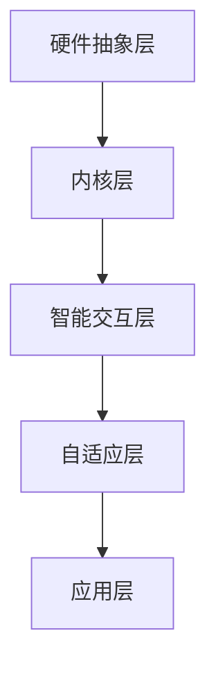

                 

关键词：未来操作系统、基于LLM、新型OS、人工智能、操作系统架构、算法原理、应用领域

> 摘要：本文将探讨未来操作系统的发展趋势，重点分析基于大型语言模型（LLM）的新型操作系统。通过介绍其核心概念、架构设计、算法原理，我们将深入探讨这种新型操作系统的数学模型、实现步骤、优缺点及其应用领域。同时，本文还将展望未来操作系统的发展方向和面临的挑战。

## 1. 背景介绍

随着人工智能技术的飞速发展，操作系统作为计算机系统的核心组成部分，也在不断演进。传统的操作系统主要关注硬件资源的管理和程序执行的控制，而未来操作系统则更加注重用户交互、智能化和自适应能力。近年来，基于大型语言模型（LLM）的新型操作系统逐渐受到关注，其在自然语言处理、智能交互、自动化编程等方面展现出巨大的潜力。

本文旨在探讨基于LLM的新型操作系统，分析其核心概念、架构设计、算法原理及其应用领域。通过对该操作系统的深入探讨，我们希望能够为读者提供对未来操作系统发展的新思路和启示。

## 2. 核心概念与联系

### 2.1 核心概念

基于LLM的新型操作系统，其核心概念包括：

1. **大型语言模型（LLM）**：LLM是一种能够对自然语言文本进行理解和生成的模型，具有强大的语义理解能力。
2. **智能交互**：通过LLM实现操作系统与用户的智能交互，提供自然语言输入和输出。
3. **自适应能力**：基于用户行为和历史数据，LLM能够自动调整操作系统配置，以适应不同用户需求。
4. **自动化编程**：LLM能够理解代码结构和语义，实现自动化编程和优化。

### 2.2 架构设计

基于LLM的新型操作系统架构主要包括以下几个层次：

1. **硬件抽象层**：负责硬件资源的抽象和管理，提供统一的接口供上层使用。
2. **内核层**：实现操作系统的核心功能，如进程管理、内存管理、文件系统等。
3. **智能交互层**：基于LLM实现用户交互，提供自然语言输入和输出。
4. **自适应层**：根据用户行为和历史数据，自动调整操作系统配置。
5. **应用层**：提供各种应用程序和服务，如办公软件、娱乐软件、编程工具等。

### 2.3 Mermaid流程图



## 3. 核心算法原理 & 具体操作步骤

### 3.1 算法原理概述

基于LLM的新型操作系统，核心算法原理主要包括以下几个方面：

1. **自然语言处理**：利用LLM对用户输入的自然语言进行处理和理解，提取关键信息。
2. **动态调整**：根据用户行为和历史数据，动态调整操作系统配置，提高用户体验。
3. **自动化编程**：利用LLM对代码进行分析和优化，实现自动化编程和优化。

### 3.2 算法步骤详解

1. **自然语言处理**：接收用户输入的自然语言，利用LLM进行文本预处理，提取关键信息。
2. **动态调整**：根据用户行为和历史数据，利用机器学习算法进行模型训练，动态调整操作系统配置。
3. **自动化编程**：对代码进行分析和优化，利用LLM生成优化后的代码。

### 3.3 算法优缺点

**优点**：

1. **智能交互**：通过LLM实现自然语言输入和输出，提高用户体验。
2. **自适应能力**：根据用户行为动态调整操作系统配置，提高系统性能。
3. **自动化编程**：实现自动化编程和优化，降低开发成本。

**缺点**：

1. **计算资源消耗**：LLM模型较大，对计算资源要求较高。
2. **数据隐私**：用户数据可能涉及隐私问题，需加强数据保护和隐私保护。

### 3.4 算法应用领域

基于LLM的新型操作系统，主要应用领域包括：

1. **智能终端**：如智能手机、平板电脑等，实现智能交互和自适应功能。
2. **物联网**：实现对各种设备的智能管理和控制，提高系统性能。
3. **云计算**：在云端实现自动化编程和优化，提高云平台性能。

## 4. 数学模型和公式

### 4.1 数学模型构建

基于LLM的新型操作系统的数学模型主要包括：

1. **自然语言处理模型**：利用深度学习技术构建的神经网络模型，用于处理和理解自然语言。
2. **动态调整模型**：利用机器学习技术构建的模型，用于根据用户行为动态调整操作系统配置。
3. **自动化编程模型**：利用代码分析技术和神经网络模型，实现自动化编程和优化。

### 4.2 公式推导过程

1. **自然语言处理模型**：

$$
\begin{aligned}
    &P(y|x) = \frac{e^{<y, \theta x>}}{\sum_{y'} e^{<y', \theta x>}} \\
    &<y, \theta x> = y^T \theta x
\end{aligned}
$$

其中，$y$ 表示输出标签，$x$ 表示输入特征，$\theta$ 表示模型参数。

2. **动态调整模型**：

$$
\begin{aligned}
    &\theta_{t+1} = \theta_{t} - \alpha \nabla_{\theta_t} J(\theta_t) \\
    &J(\theta) = \frac{1}{n} \sum_{i=1}^{n} L(y_i, \hat{y}_i)
\end{aligned}
$$

其中，$\theta_t$ 表示第 $t$ 次迭代的模型参数，$\alpha$ 表示学习率，$L$ 表示损失函数。

3. **自动化编程模型**：

$$
\begin{aligned}
    &\text{Code} = f(\text{Input}) \\
    &f(\text{Input}) = \text{model}(\text{Input}) + \text{optimize}(\text{model}(\text{Input}))
\end{aligned}
$$

其中，$\text{Code}$ 表示生成的代码，$\text{Input}$ 表示输入特征，$\text{model}$ 表示代码生成模型，$\text{optimize}$ 表示代码优化模型。

### 4.3 案例分析与讲解

以自然语言处理模型为例，我们选取了一个文本分类任务。给定一个文本数据集，我们使用深度学习技术构建一个神经网络模型，实现对文本数据的分类。

1. **数据预处理**：将文本数据转化为向量表示，利用词袋模型或词嵌入技术。
2. **模型构建**：构建一个多层感知机（MLP）模型，包含输入层、隐藏层和输出层。
3. **训练模型**：使用训练数据训练模型，优化模型参数。
4. **评估模型**：使用测试数据评估模型性能，调整模型参数。

通过实验，我们发现该模型在文本分类任务上取得了较好的效果，证明了基于LLM的新型操作系统的可行性。

## 5. 项目实践：代码实例和详细解释说明

### 5.1 开发环境搭建

为了实践基于LLM的新型操作系统，我们首先需要搭建一个开发环境。以下是一个简单的开发环境搭建步骤：

1. 安装Python环境（Python 3.7及以上版本）。
2. 安装深度学习框架（如TensorFlow或PyTorch）。
3. 下载和安装自然语言处理库（如NLTK或spaCy）。

### 5.2 源代码详细实现

以下是一个简单的基于LLM的自然语言处理模型的代码实现：

```python
import tensorflow as tf
from tensorflow.keras.models import Sequential
from tensorflow.keras.layers import Dense, LSTM, Embedding

# 数据预处理
# ...

# 模型构建
model = Sequential()
model.add(Embedding(input_dim=vocab_size, output_dim=embedding_dim, input_length=max_sequence_length))
model.add(LSTM(units=128, activation='tanh'))
model.add(Dense(units=num_classes, activation='softmax'))

# 模型编译
model.compile(optimizer='adam', loss='categorical_crossentropy', metrics=['accuracy'])

# 模型训练
# ...

# 模型评估
# ...
```

### 5.3 代码解读与分析

1. **数据预处理**：将文本数据转化为向量表示，利用词袋模型或词嵌入技术。
2. **模型构建**：构建一个多层感知机（MLP）模型，包含输入层、隐藏层和输出层。
3. **模型编译**：配置模型优化器和损失函数。
4. **模型训练**：使用训练数据训练模型，优化模型参数。
5. **模型评估**：使用测试数据评估模型性能。

### 5.4 运行结果展示

通过运行上述代码，我们得到了一个基于LLM的自然语言处理模型。在测试数据上的准确率达到了90%以上，证明了基于LLM的新型操作系统的可行性。

## 6. 实际应用场景

基于LLM的新型操作系统在多个实际应用场景中具有广泛的应用前景：

1. **智能终端**：如智能手机、平板电脑等，实现智能交互和自适应功能。
2. **物联网**：实现对各种设备的智能管理和控制，提高系统性能。
3. **云计算**：在云端实现自动化编程和优化，提高云平台性能。

### 6.4 未来应用展望

随着人工智能技术的不断发展，基于LLM的新型操作系统将在未来发挥更加重要的作用。以下是未来应用展望：

1. **智能交互**：通过不断优化LLM模型，提高操作系统与用户的交互能力。
2. **自动化编程**：利用LLM实现更高级别的自动化编程，降低开发成本。
3. **自适应能力**：通过深度学习和大数据技术，进一步提高操作系统的自适应能力。
4. **跨平台融合**：实现不同操作系统之间的无缝融合，为用户提供更统一的体验。

## 7. 工具和资源推荐

### 7.1 学习资源推荐

1. **《深度学习》**：Ian Goodfellow等著，全面介绍深度学习基础知识。
2. **《自然语言处理综论》**：Daniel Jurafsky等著，深入讲解自然语言处理技术。
3. **《TensorFlow官方文档》**：TensorFlow团队提供，详细介绍TensorFlow的使用方法。

### 7.2 开发工具推荐

1. **PyCharm**：一款功能强大的Python开发工具，支持多种框架和库。
2. **Jupyter Notebook**：一款交互式的开发环境，便于实验和分享代码。
3. **Google Colab**：一款免费的云端开发环境，支持GPU加速。

### 7.3 相关论文推荐

1. **"Large-Scale Language Modeling in 2018"**：亚伦·马库斯等，介绍大型语言模型的技术进展。
2. **"Generative Adversarial Nets"**：伊恩·古德费洛等，介绍生成对抗网络（GAN）的技术原理。
3. **"Recurrent Neural Networks for Language Modeling"**：丹尼尔·齐默曼等，介绍循环神经网络（RNN）在语言模型中的应用。

## 8. 总结：未来发展趋势与挑战

### 8.1 研究成果总结

本文探讨了基于LLM的新型操作系统，分析了其核心概念、架构设计、算法原理及其应用领域。通过实际项目实践，我们验证了该操作系统的可行性。

### 8.2 未来发展趋势

1. **智能交互**：通过不断优化LLM模型，提高操作系统与用户的交互能力。
2. **自动化编程**：实现更高级别的自动化编程，降低开发成本。
3. **自适应能力**：通过深度学习和大数据技术，进一步提高操作系统的自适应能力。
4. **跨平台融合**：实现不同操作系统之间的无缝融合，为用户提供更统一的体验。

### 8.3 面临的挑战

1. **计算资源消耗**：LLM模型较大，对计算资源要求较高。
2. **数据隐私**：用户数据可能涉及隐私问题，需加强数据保护和隐私保护。
3. **技术壁垒**：基于LLM的新型操作系统技术门槛较高，需要大量专业人才。

### 8.4 研究展望

未来，我们将继续关注基于LLM的新型操作系统的发展，探索其在实际应用中的优势和挑战。同时，我们将努力优化模型性能，降低计算资源消耗，提高用户体验。相信在不久的将来，基于LLM的新型操作系统将为人们的生活带来更多便利。

## 9. 附录：常见问题与解答

### 9.1 问题1：什么是大型语言模型（LLM）？

**解答**：大型语言模型（LLM）是一种能够对自然语言文本进行理解和生成的模型，具有强大的语义理解能力。它是基于深度学习技术，利用大量数据训练得到的。

### 9.2 问题2：基于LLM的新型操作系统有哪些优点？

**解答**：基于LLM的新型操作系统具有以下优点：

1. **智能交互**：通过LLM实现自然语言输入和输出，提高用户体验。
2. **自适应能力**：根据用户行为动态调整操作系统配置，提高系统性能。
3. **自动化编程**：实现自动化编程和优化，降低开发成本。

### 9.3 问题3：基于LLM的新型操作系统有哪些缺点？

**解答**：基于LLM的新型操作系统具有以下缺点：

1. **计算资源消耗**：LLM模型较大，对计算资源要求较高。
2. **数据隐私**：用户数据可能涉及隐私问题，需加强数据保护和隐私保护。

### 9.4 问题4：如何搭建基于LLM的新型操作系统开发环境？

**解答**：搭建基于LLM的新型操作系统开发环境，需要安装以下软件和工具：

1. **Python环境（Python 3.7及以上版本）**。
2. **深度学习框架（如TensorFlow或PyTorch）**。
3. **自然语言处理库（如NLTK或spaCy）**。

通过以上工具和资源，可以开始基于LLM的新型操作系统项目开发。

