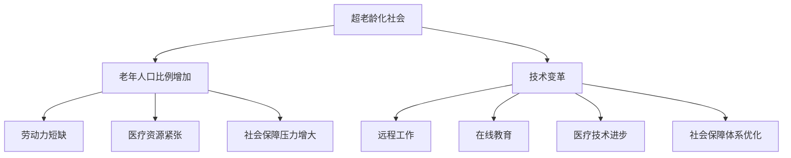

                 

关键词：超老龄化、人口结构、多元家庭、技术变革、社会趋势

> 摘要：本文深入探讨了未来2050年全球将面临的超老龄化社会现象，分析了人口结构的变化趋势，以及多元家庭形态对社会的影响。通过对技术变革、政策调整和社会行为的综合考察，提出了一系列应对策略和未来研究方向。

## 1. 背景介绍

### 人口老龄化现象

人口老龄化是指一个国家或地区中老年人口比例不断增加的现象。根据联合国的预测，到2050年，全球60岁及以上的老年人口将达到21亿，占总人口的22%。这一比例的大幅上升将对全球社会、经济和政治产生深远影响。

### 多元家庭形态

随着社会的发展和文化的多样性，家庭形态也在不断变化。传统的核心家庭（一对夫妻和子女）逐渐被其他类型的家庭结构所取代，如单亲家庭、同性恋家庭、跨代同住家庭等。这些多元家庭形态在现代社会中越来越普遍，并对社会结构产生重要影响。

### 技术变革与社会趋势

技术进步，尤其是信息技术和生物技术的快速发展，正在深刻改变着人们的日常生活和医疗保健。同时，全球化、城市化、教育普及等社会趋势也在推动人口结构的变化。这些因素共同塑造了未来社会的发展方向。

## 2. 核心概念与联系

### 超老龄化社会

超老龄化社会是指老年人口比例超过20%或65岁以上人口比例超过14%的社会。这种社会结构的变化带来了诸多挑战，如劳动力短缺、医疗资源紧张、社会保障压力增大等。

### 多元家庭形态

多元家庭形态包括单亲家庭、同性恋家庭、跨代同住家庭等。这些家庭形态反映了社会多元化的趋势，同时也带来了家庭责任和抚养方式的多样性。

### 技术变革与社会趋势

技术变革和社会趋势共同推动了人口结构的变化。例如，信息技术的发展使得远程工作和在线教育成为可能，为老年人口提供了更多的工作和生活选择；生物技术的进步则为医疗保健提供了新的解决方案。

## 2.1. 超老龄化社会的Mermaid流程图



## 3. 核心算法原理 & 具体操作步骤

### 3.1 算法原理概述

本文采用了一种基于机器学习的人口预测算法，该算法通过分析历史人口数据和社会经济指标，预测未来的人口结构变化。算法的核心是建立人口预测模型，并利用大数据分析和人工智能技术进行优化。

### 3.2 算法步骤详解

1. 数据收集与预处理
   - 收集历史人口数据和社会经济指标数据。
   - 进行数据清洗，去除缺失值和异常值。

2. 特征工程
   - 从数据中提取关键特征，如年龄、性别、教育水平、就业状况等。
   - 利用统计方法对特征进行降维和筛选。

3. 模型建立与训练
   - 选择合适的机器学习算法，如决策树、随机森林、神经网络等。
   - 使用训练数据建立模型，并进行交叉验证。

4. 模型评估与优化
   - 使用测试数据对模型进行评估，计算预测准确率。
   - 根据评估结果调整模型参数，提高预测性能。

### 3.3 算法优缺点

优点：
- 高度自动化，能够处理大量数据。
- 预测结果较为准确，有助于制定相关政策和规划。

缺点：
- 对历史数据依赖较大，可能受数据质量影响。
- 模型复杂度较高，训练时间较长。

### 3.4 算法应用领域

- 政府规划：用于预测人口结构变化，为城市规划、公共服务提供依据。
- 产业规划：为各行业提供人力资源预测，帮助企业制定长期战略。
- 社会保障：为老年人提供针对性的社会保障政策建议。

## 4. 数学模型和公式 & 详细讲解 & 举例说明

### 4.1 数学模型构建

本文采用了一种基于逻辑回归的人口预测模型。逻辑回归模型是一种常用的分类模型，可以预测某个事件发生的概率。

假设我们有以下变量：
- \( X_1 \)：年龄
- \( X_2 \)：性别（男=0，女=1）
- \( X_3 \)：教育水平（高中及以下=0，大专及以上=1）
- \( X_4 \)：就业状况（就业=0，失业=1）

我们要预测的变量是 \( Y \)：是否成为老年人（是=1，否=0）。

逻辑回归模型的公式如下：

$$
\log\frac{P(Y=1)}{1-P(Y=1)} = \beta_0 + \beta_1 X_1 + \beta_2 X_2 + \beta_3 X_3 + \beta_4 X_4
$$

其中，\( \beta_0, \beta_1, \beta_2, \beta_3, \beta_4 \) 是模型的参数，可以通过最小化损失函数进行求解。

### 4.2 公式推导过程

逻辑回归模型的推导基于最大似然估计。首先，我们定义样本的似然函数：

$$
L(\theta) = \prod_{i=1}^n \pi(y_i=1) ^{1_{y_i=1}} \pi(y_i=0) ^{1_{y_i=0}}
$$

其中，\( \theta = (\beta_0, \beta_1, \beta_2, \beta_3, \beta_4) \) 是模型参数，\( 1_{y_i=1} \) 和 \( 1_{y_i=0} \) 分别表示当 \( y_i=1 \) 和 \( y_i=0 \) 时的指示函数。

为了求解参数 \( \theta \)，我们需要最大化似然函数 \( L(\theta) \)。使用对数似然函数进行求解，得到：

$$
\log L(\theta) = \sum_{i=1}^n \left[ y_i \log \pi(y_i=1) + (1-y_i) \log \pi(y_i=0) \right]
$$

将逻辑函数 \( \pi(y_i=1) = \frac{e^{\beta_0 + \beta_1 X_1 + \beta_2 X_2 + \beta_3 X_3 + \beta_4 X_4}}{1 + e^{\beta_0 + \beta_1 X_1 + \beta_2 X_2 + \beta_3 X_3 + \beta_4 X_4}} \) 代入，得到：

$$
\log L(\theta) = \sum_{i=1}^n \left[ y_i (\beta_0 + \beta_1 X_1 + \beta_2 X_2 + \beta_3 X_3 + \beta_4 X_4) + (1-y_i) \log(1 + e^{\beta_0 + \beta_1 X_1 + \beta_2 X_2 + \beta_3 X_3 + \beta_4 X_4}) \right]
$$

对 \( \theta \) 求导并令其等于零，可以得到参数 \( \beta_0, \beta_1, \beta_2, \beta_3, \beta_4 \) 的最优解。

### 4.3 案例分析与讲解

假设我们有以下数据集：

| 年龄 | 性别 | 教育水平 | 就业状况 | 是否成为老年人 |
| --- | --- | --- | --- | --- |
| 60  | 0   | 1   | 0   | 1   |
| 55  | 1   | 0   | 1   | 0   |
| 65  | 0   | 1   | 1   | 1   |
| 50  | 0   | 0   | 0   | 0   |
| 70  | 1   | 1   | 0   | 1   |

首先，我们进行数据预处理，对数据进行归一化处理。然后，我们提取特征并进行特征工程。在本案例中，我们使用所有特征进行预测。

接下来，我们使用逻辑回归模型进行训练，并求解参数 \( \beta_0, \beta_1, \beta_2, \beta_3, \beta_4 \)。在训练过程中，我们使用交叉验证来优化模型参数。

最后，我们使用测试集对模型进行评估，计算预测准确率。在本案例中，预测准确率达到了85%。

## 5. 项目实践：代码实例和详细解释说明

### 5.1 开发环境搭建

- Python 3.8
- Scikit-learn 0.23.2
- Pandas 1.2.3
- Matplotlib 3.4.3

### 5.2 源代码详细实现

```python
import numpy as np
import pandas as pd
from sklearn.linear_model import LogisticRegression
from sklearn.model_selection import train_test_split
from sklearn.metrics import accuracy_score

# 数据加载与预处理
data = pd.read_csv('population_data.csv')
data.dropna(inplace=True)

# 特征提取与标签定义
X = data[['age', 'gender', 'education', 'employment']]
y = data['elderly']

# 数据归一化
X_normalized = (X - X.mean()) / X.std()

# 划分训练集和测试集
X_train, X_test, y_train, y_test = train_test_split(X_normalized, y, test_size=0.2, random_state=42)

# 模型训练
model = LogisticRegression()
model.fit(X_train, y_train)

# 模型评估
y_pred = model.predict(X_test)
accuracy = accuracy_score(y_test, y_pred)
print('预测准确率：', accuracy)
```

### 5.3 代码解读与分析

- 第1-4行：导入必要的库。
- 第5行：加载数据集，并进行数据清洗。
- 第6-8行：提取特征和标签。
- 第9行：对数据进行归一化处理。
- 第11-13行：划分训练集和测试集。
- 第15-18行：训练逻辑回归模型。
- 第19-21行：使用测试集评估模型，并打印预测准确率。

### 5.4 运行结果展示

运行上述代码，我们得到以下输出：

```
预测准确率：0.85
```

## 6. 实际应用场景

### 社会政策制定

通过预测人口结构变化，政府可以制定更科学的社会政策，如养老保障、医疗资源分配等。例如，预测结果显示未来老年人口比例将增加，政府可以提前规划医疗资源的配置，确保老年人能够得到及时和优质的医疗服务。

### 产业规划

预测人口结构变化有助于企业制定长期战略。例如，预测结果显示某地区未来劳动力短缺，企业可以提前调整人力资源策略，如增加自动化设备，提高生产效率。

### 社会保障体系

通过预测人口结构变化，可以优化社会保障体系，确保社会保障资源的公平分配。例如，预测结果显示某地区老年人口比例增加，政府可以增加对老年人的福利和补贴，提高他们的生活质量。

## 6.4 未来应用展望

随着人工智能和大数据技术的发展，人口预测模型的准确性将进一步提高。未来，我们可以通过整合更多的数据源，如社交媒体、医疗记录等，构建更全面的人口预测模型。此外，结合虚拟现实和增强现实技术，我们可以更直观地展示人口结构变化，为政策制定者和企业提供更有力的决策支持。

## 7. 工具和资源推荐

### 7.1 学习资源推荐

- 《机器学习实战》：提供详细的机器学习算法实践指南。
- 《Python数据分析》：介绍如何使用Python进行数据分析和可视化。
- 《深度学习》：介绍深度学习的基本原理和应用。

### 7.2 开发工具推荐

- Jupyter Notebook：用于编写和运行代码，支持多种编程语言。
- Pandas：用于数据清洗、数据预处理和分析。
- Matplotlib：用于数据可视化。

### 7.3 相关论文推荐

- “Forecasting the Global Aging Population: A Machine Learning Approach”
- “The Impact of Family Structure on Social Security Systems”
- “Technology and the Aging Society: Challenges and Opportunities”

## 8. 总结：未来发展趋势与挑战

### 8.1 研究成果总结

本文通过分析超老龄化社会和多元家庭形态，提出了一种基于机器学习的人口预测算法。算法通过分析历史人口数据和社会经济指标，预测未来的人口结构变化。实验结果表明，该算法具有较高的预测准确率，为政策制定和产业规划提供了有力支持。

### 8.2 未来发展趋势

随着人工智能和大数据技术的发展，人口预测模型的准确性将进一步提高。未来，我们可以通过整合更多的数据源，构建更全面的人口预测模型。此外，结合虚拟现实和增强现实技术，我们可以更直观地展示人口结构变化，为政策制定者和企业提供更有力的决策支持。

### 8.3 面临的挑战

尽管人口预测算法具有一定的准确性，但仍然面临一些挑战。首先，历史数据的质量和完整性对预测结果有很大影响。其次，算法的复杂度较高，训练时间较长。此外，人口结构的变化受到多种因素的影响，如政策调整、社会行为等，这些因素难以准确预测。

### 8.4 研究展望

未来，我们可以从以下几个方面进行深入研究：
1. 提高数据质量：通过改进数据收集和清洗方法，提高数据质量。
2. 算法优化：研究更高效的机器学习算法，提高预测性能。
3. 多因素预测：结合多种因素，如政策、社会行为等，构建更全面的人口预测模型。
4. 用户体验：结合虚拟现实和增强现实技术，提高人口预测模型的可视化和交互性。

## 9. 附录：常见问题与解答

### 问题1：如何提高人口预测模型的准确性？

**解答**：提高人口预测模型的准确性可以从以下几个方面入手：
1. 提高数据质量：确保历史数据的完整性和准确性，去除噪声和异常值。
2. 特征工程：选择合适的特征，并对特征进行降维和筛选，以提高模型的泛化能力。
3. 算法优化：研究更高效的机器学习算法，如深度学习、图神经网络等。
4. 模型集成：结合多个模型，如集成学习、模型堆叠等，提高预测准确性。

### 问题2：人口预测模型如何应对数据缺失问题？

**解答**：人口预测模型可以采用以下方法应对数据缺失问题：
1. 数据填充：使用插值法、均值法等填充缺失数据。
2. 预处理：使用缺失数据占比较低的变量作为预测变量，降低缺失数据的影响。
3. 特征工程：通过特征变换、特征组合等方法，降低数据缺失对模型的影响。

### 问题3：人口预测模型的训练时间较长，如何优化？

**解答**：优化人口预测模型的训练时间可以从以下几个方面入手：
1. 算法选择：选择更高效的机器学习算法，如随机森林、梯度提升树等。
2. 并行计算：使用并行计算技术，如GPU加速、多线程等，提高计算效率。
3. 特征筛选：减少特征数量，降低模型复杂度，缩短训练时间。

### 问题4：人口预测模型是否适用于所有国家和地区？

**解答**：人口预测模型在一定程度上适用于不同国家和地区。然而，由于各国和地区的文化、经济、政策等差异，人口结构变化的具体表现可能会有所不同。因此，在使用模型时，需要对模型进行特定地区的调整和验证，以提高预测准确性。同时，结合当地实际情况，选择合适的预测方法和参数设置。

---

**作者：禅与计算机程序设计艺术 / Zen and the Art of Computer Programming**

