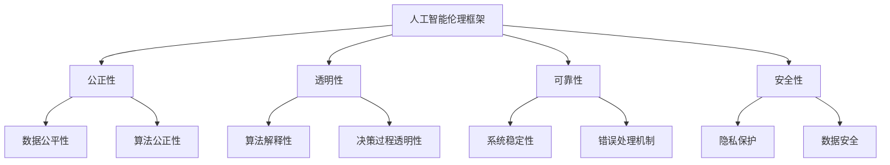

                 

关键词：人工智能伦理、2050年、人机共生、人工智能权利、伦理框架、技术发展、社会影响、法律监管

> 摘要：本文深入探讨未来人工智能伦理的发展趋势，特别是2050年人工智能权利与人机共生的情况。通过回顾人工智能历史、分析当前伦理挑战、提出伦理框架，以及展望未来发展趋势与挑战，本文旨在为人工智能的持续健康发展提供指导。

## 1. 背景介绍

人工智能（Artificial Intelligence, AI）作为计算机科学的一个重要分支，自20世纪50年代以来经历了显著的发展。从最初的逻辑推理和规则系统，到今天的深度学习与神经网络，人工智能在许多领域都展现出了惊人的能力。如今，人工智能已经渗透到我们生活的方方面面，从智能家居到自动驾驶汽车，从医疗诊断到金融服务，人工智能的应用几乎无处不在。

然而，随着人工智能技术的快速发展，伦理问题也日益凸显。人工智能的决策过程往往依赖于大量数据，而这些数据可能包含偏见或歧视。此外，人工智能系统的自主性越来越强，甚至可能出现超出人类控制的行为。这些问题引发了关于人工智能权利、隐私保护、责任归属等伦理困境的讨论。

本文旨在通过回顾人工智能的历史，分析当前的伦理挑战，提出一个伦理框架来应对这些挑战，并探讨2050年人工智能权利与人机共生的情况。我们希望通过这篇文章，能够为人工智能的伦理发展提供一些有价值的思考。

## 2. 核心概念与联系

在深入探讨人工智能伦理之前，我们需要明确几个核心概念，它们是理解伦理问题的基础。

### 2.1 人工智能伦理

人工智能伦理是指应用伦理学原则和规范来指导人工智能系统设计和应用的行为。它关注如何确保人工智能系统的公正性、透明性、可靠性和安全性，以避免对人类和社会造成负面影响。

### 2.2 人机共生

人机共生（Human-Machine Symbiosis）是指人类与人工智能系统之间的一种新型合作关系，通过互相学习和协作，实现更高的效率和创新。这种关系不仅体现在个人层面，也体现在社会和经济层面。

### 2.3 伦理框架

伦理框架是一个指导人工智能伦理决策的系统，它包括一系列原则、标准和指导方针。伦理框架可以帮助开发者和政策制定者识别潜在的风险和问题，并提供解决策略。

### 2.4 Mermaid 流程图

以下是描述人工智能伦理框架的Mermaid流程图：



这个流程图展示了人工智能伦理框架的核心要素，以及它们之间的联系。

## 3. 核心算法原理 & 具体操作步骤

### 3.1 算法原理概述

人工智能伦理框架的实现依赖于一系列核心算法，这些算法确保了人工智能系统的公正性、透明性、可靠性和安全性。以下是几个关键算法的原理概述：

#### 3.1.1 加权公平算法

加权公平算法是一种用于处理数据偏见和歧视的算法。它通过给不同特征赋予不同的权重来平衡数据集中的偏见，从而提高算法的公正性。

#### 3.1.2 解释性算法

解释性算法旨在提高人工智能系统的透明性。它们能够揭示算法的决策过程，帮助用户理解为什么系统做出了特定的决策。

#### 3.1.3 稳定性算法

稳定性算法确保人工智能系统的可靠性。它们通过识别和修复潜在的错误来提高系统的稳定性。

#### 3.1.4 隐私保护算法

隐私保护算法用于保护用户的隐私数据。这些算法包括差分隐私、同态加密等，能够确保数据在传输和处理过程中不被泄露。

### 3.2 算法步骤详解

#### 3.2.1 加权公平算法步骤

1. 数据预处理：收集和清洗数据，确保数据质量。
2. 特征选择：识别数据集中的关键特征。
3. 权重分配：计算每个特征的权重，使数据更加平衡。
4. 模型训练：使用加权数据训练人工智能模型。
5. 模型评估：评估模型的公正性和准确性。

#### 3.2.2 解释性算法步骤

1. 模型选择：选择一个解释性模型，如决策树或LIME（Local Interpretable Model-agnostic Explanations）。
2. 数据预处理：准备用于解释的数据集。
3. 决策解释：分析模型决策过程，提供解释。
4. 用户反馈：收集用户对解释的反馈，优化解释过程。

#### 3.2.3 稳定性算法步骤

1. 错误检测：监控系统的运行，识别潜在的错误。
2. 错误修复：分析错误原因，并尝试修复。
3. 重训练：根据错误修复结果重新训练模型。
4. 系统恢复：恢复系统的正常运行。

#### 3.2.4 隐私保护算法步骤

1. 数据加密：对敏感数据进行加密处理。
2. 同态加密：在数据加密的情况下执行计算。
3. 差分隐私：添加噪声来保护数据隐私。
4. 隐私审计：评估系统的隐私保护效果。

### 3.3 算法优缺点

#### 3.3.1 加权公平算法

**优点：**
- 能够有效减少数据偏见。
- 提高算法的公正性和准确性。

**缺点：**
- 可能降低模型的泛化能力。
- 需要大量计算资源。

#### 3.3.2 解释性算法

**优点：**
- 提高算法的透明性，有助于用户理解决策过程。
- 有助于发现和修正潜在的问题。

**缺点：**
- 解释性算法通常比非解释性算法更复杂。
- 解释结果的准确性和一致性可能受影响。

#### 3.3.3 稳定性算法

**优点：**
- 提高系统的可靠性，减少错误发生。
- 帮助维护系统的稳定性。

**缺点：**
- 错误修复可能需要大量时间和资源。
- 可能影响模型的性能。

#### 3.3.4 隐私保护算法

**优点：**
- 有效保护用户隐私数据。
- 提高系统的安全性。

**缺点：**
- 可能增加计算负担。
- 可能影响系统的性能。

### 3.4 算法应用领域

加权公平算法、解释性算法、稳定性算法和隐私保护算法在多个领域都有广泛的应用。以下是一些具体的应用场景：

- **金融行业：** 加权公平算法用于确保贷款审批和风险评估的公正性，解释性算法用于解释金融决策的透明性，稳定性算法用于监控金融市场的波动，隐私保护算法用于保护客户的交易数据。
- **医疗领域：** 加权公平算法用于确保医疗诊断的公正性，解释性算法用于解释医疗决策的过程，稳定性算法用于确保医疗系统的可靠性，隐私保护算法用于保护患者的隐私数据。
- **政府管理：** 加权公平算法用于公正分配资源，解释性算法用于解释政策决策的过程，稳定性算法用于确保政府系统的稳定性，隐私保护算法用于保护公民的个人信息。

## 4. 数学模型和公式 & 详细讲解 & 举例说明

### 4.1 数学模型构建

为了更好地理解和应用核心算法，我们需要构建一些数学模型。以下是几个常用的数学模型：

#### 4.1.1 加权公平模型

加权公平模型用于处理数据偏见问题。该模型的核心是一个加权函数，用于给不同特征分配权重。

公式如下：

$$
w_i = \frac{1}{\sum_{j=1}^{n} |x_{ij}^2|}
$$

其中，$w_i$ 是特征 $x_i$ 的权重，$n$ 是特征的总数，$x_{ij}$ 是特征 $x_i$ 在数据集中的值。

#### 4.1.2 解释性模型

解释性模型用于揭示人工智能系统的决策过程。一个常见的解释性模型是LIME（Local Interpretable Model-agnostic Explanations）。

LIME的核心公式如下：

$$
e_j = \frac{\partial f}{\partial x_j} \cdot (x_j - x^0_j)
$$

其中，$e_j$ 是特征 $x_j$ 对决策的贡献，$f$ 是模型的决策函数，$x_j$ 是特征 $x_j$ 的值，$x^0_j$ 是基准特征 $x_j$ 的值。

#### 4.1.3 稳定性模型

稳定性模型用于确保人工智能系统的可靠性。一个常见的稳定性模型是误差反向传播（Backpropagation）算法。

Backpropagation的核心公式如下：

$$
\Delta w_{ij} = \eta \cdot \frac{\partial E}{\partial w_{ij}}
$$

其中，$\Delta w_{ij}$ 是权重 $w_{ij}$ 的更新值，$\eta$ 是学习率，$E$ 是模型的误差函数。

#### 4.1.4 隐私保护模型

隐私保护模型用于保护用户的隐私数据。一个常见的隐私保护模型是差分隐私（Differential Privacy）。

差分隐私的核心公式如下：

$$
\epsilon = \max_{x} \{ \log_2(1 + \frac{P(x \cap S)}{P(S)}) \}
$$

其中，$\epsilon$ 是隐私参数，$P(x \cap S)$ 是数据集合 $S$ 中包含数据 $x$ 的概率，$P(S)$ 是数据集合 $S$ 的概率。

### 4.2 公式推导过程

#### 4.2.1 加权公平模型推导

加权公平模型的推导基于最小二乘法（Least Squares Method）。假设我们有一个线性回归模型：

$$
y = \beta_0 + \beta_1 x_1 + \beta_2 x_2 + \cdots + \beta_n x_n
$$

其中，$y$ 是因变量，$x_1, x_2, \cdots, x_n$ 是自变量，$\beta_0, \beta_1, \beta_2, \cdots, \beta_n$ 是回归系数。

为了消除数据偏见，我们需要对自变量进行加权处理。假设我们有一个加权函数 $w(x)$，那么加权后的自变量为 $x' = w(x)x$。

将加权后的自变量代入线性回归模型，得到：

$$
y = \beta_0 + \beta_1 x_1' + \beta_2 x_2' + \cdots + \beta_n x_n'
$$

为了使模型具有最小均方误差，我们需要对回归系数进行优化。通过最小化以下目标函数：

$$
E = \sum_{i=1}^{n} (y_i - y_i')^2
$$

得到加权回归系数：

$$
\beta_0 = \frac{\sum_{i=1}^{n} y_i'}{\sum_{i=1}^{n} w(x_i)}
$$

$$
\beta_1 = \frac{\sum_{i=1}^{n} x_1' y_i'}{\sum_{i=1}^{n} w(x_i)}
$$

$$
\beta_2 = \frac{\sum_{i=1}^{n} x_2' y_i'}{\sum_{i=1}^{n} w(x_i)}
$$

$$
\cdots
$$

$$
\beta_n = \frac{\sum_{i=1}^{n} x_n' y_i'}{\sum_{i=1}^{n} w(x_i)}
$$

为了计算权重，我们需要对每个特征进行归一化处理：

$$
w_i = \frac{1}{\sum_{j=1}^{n} |x_{ij}^2|}
$$

这样，我们得到了加权公平模型。

#### 4.2.2 解释性模型推导

解释性模型的核心是LIME算法。LIME的基本思想是将一个复杂的模型简化为一个线性模型，以便更好地解释其决策过程。

假设我们有一个复杂的模型 $f(x)$，其输入为特征向量 $x$，输出为决策 $y$。为了解释这个决策，我们需要找到一个简单的线性模型 $g(x)$，使其与 $f(x)$ 的决策相似。

首先，我们选择一个基准特征向量 $x^0$，其决策为 $y^0 = f(x^0)$。然后，我们定义一个损失函数，用于衡量两个模型之间的差异：

$$
L(f, g) = \sum_{i=1}^{n} \frac{1}{2} (f(x_i) - g(x_i))^2
$$

其中，$n$ 是特征的总数，$x_i$ 是特征向量，$f(x_i)$ 是复杂模型 $f$ 的决策，$g(x_i)$ 是线性模型 $g$ 的决策。

接下来，我们使用梯度下降法最小化损失函数，得到线性模型 $g(x)$ 的参数。具体步骤如下：

1. 初始化线性模型 $g(x)$ 的参数 $\theta$。
2. 计算损失函数 $L(f, g)$ 的梯度 $\nabla L(f, g)$。
3. 更新参数 $\theta$：$\theta = \theta - \alpha \nabla L(f, g)$，其中 $\alpha$ 是学习率。
4. 重复步骤2和3，直到损失函数收敛。

通过这个过程，我们得到了一个线性模型 $g(x)$，它能够解释复杂模型 $f(x)$ 的决策过程。

#### 4.2.3 稳定性模型推导

稳定性模型的核心是误差反向传播（Backpropagation）算法。Backpropagation的基本思想是通过反向传播误差信号来更新网络权重，从而优化模型性能。

假设我们有一个多层神经网络，其输入层、隐藏层和输出层分别有 $n_1, n_2, n_3$ 个节点。我们定义以下参数：

- $x_i^{(l)}$：第 $l$ 层的第 $i$ 个节点的输入。
- $y_i^{(l)}$：第 $l$ 层的第 $i$ 个节点的输出。
- $z_i^{(l)}$：第 $l$ 层的第 $i$ 个节点的净输入。
- $w_{ij}^{(l)}$：从第 $l-1$ 层的第 $j$ 个节点连接到第 $l$ 层的第 $i$ 个节点的权重。
- $\delta_i^{(l)}$：第 $l$ 层的第 $i$ 个节点的误差。

首先，我们计算输出层的误差：

$$
\delta_i^{(3)} = (y_i^{(3)} - t_i) \cdot \sigma'(z_i^{(3)})
$$

其中，$y_i^{(3)}$ 是输出层的第 $i$ 个节点的输出，$t_i$ 是第 $i$ 个节点的目标值，$\sigma'$ 是激活函数的导数。

然后，我们计算隐藏层的误差：

$$
\delta_i^{(2)} = \sum_{j=1}^{n_3} w_{ij}^{(3)} \cdot \delta_j^{(3)} \cdot \sigma'(z_i^{(2)})
$$

其中，$w_{ij}^{(3)}$ 是从输出层第 $j$ 个节点连接到隐藏层第 $i$ 个节点的权重，$\delta_j^{(3)}$ 是输出层第 $j$ 个节点的误差。

最后，我们更新网络权重：

$$
\Delta w_{ij}^{(l)} = \eta \cdot \delta_i^{(l)} \cdot x_j^{(l-1)}
$$

其中，$\eta$ 是学习率，$x_j^{(l-1)}$ 是隐藏层第 $j$ 个节点的输入。

通过这个过程，我们不断更新网络权重，使得模型性能逐步优化。

#### 4.2.4 隐私保护模型推导

隐私保护模型的核心是差分隐私（Differential Privacy）。差分隐私的基本思想是在数据处理过程中添加噪声，从而保护数据隐私。

假设我们有一个数据集合 $S$，其大小为 $|S|$。我们定义一个函数 $f(S)$，用于对数据进行处理。为了实现差分隐私，我们需要在 $f(S)$ 的输出中添加噪声。

具体步骤如下：

1. 计算原始输出的概率分布 $P(f(S))$。
2. 计算噪声的分布 $\epsilon$，通常是一个高斯分布。
3. 计算加噪声后的输出 $f'(S) = f(S) + \epsilon$。

通过这个过程，我们得到了一个具有差分隐私的输出。

### 4.3 案例分析与讲解

为了更好地理解上述数学模型，我们通过一个具体的案例进行分析。

#### 4.3.1 案例背景

假设我们有一个银行贷款审批系统，该系统根据申请者的个人信息（如收入、信用评分等）来决定是否批准贷款。然而，该系统可能存在数据偏见，导致某些群体的贷款审批率较低。

#### 4.3.2 加权公平模型应用

为了解决数据偏见问题，我们使用加权公平模型对数据进行处理。

1. 数据预处理：收集并清洗申请者的个人信息。
2. 特征选择：选择关键特征，如收入、信用评分等。
3. 权重分配：计算每个特征的权重。
4. 模型训练：使用加权数据训练贷款审批模型。
5. 模型评估：评估模型的公正性和准确性。

通过这个过程，我们提高了贷款审批模型的公正性，减少了数据偏见。

#### 4.3.3 解释性模型应用

为了提高系统的透明性，我们使用解释性模型来解释贷款审批决策。

1. 模型选择：选择一个解释性模型，如LIME。
2. 数据预处理：准备用于解释的数据集。
3. 决策解释：分析模型决策过程，提供解释。
4. 用户反馈：收集用户对解释的反馈，优化解释过程。

通过这个过程，我们帮助用户理解贷款审批决策的原因，提高了系统的透明性。

#### 4.3.4 稳定性模型应用

为了确保系统的可靠性，我们使用稳定性模型来监控和修复潜在的错误。

1. 错误检测：监控系统的运行，识别潜在的错误。
2. 错误修复：分析错误原因，并尝试修复。
3. 重训练：根据错误修复结果重新训练模型。
4. 系统恢复：恢复系统的正常运行。

通过这个过程，我们提高了系统的稳定性，减少了错误发生。

#### 4.3.5 隐私保护模型应用

为了保护用户的隐私数据，我们使用隐私保护模型来处理用户的个人信息。

1. 数据加密：对敏感数据进行加密处理。
2. 同态加密：在数据加密的情况下执行计算。
3. 差分隐私：添加噪声来保护数据隐私。
4. 隐私审计：评估系统的隐私保护效果。

通过这个过程，我们有效保护了用户的隐私数据。

## 5. 项目实践：代码实例和详细解释说明

### 5.1 开发环境搭建

为了实践上述算法和模型，我们使用Python作为编程语言，并使用以下库：

- NumPy：用于数据操作和计算。
- Pandas：用于数据预处理和数据分析。
- Scikit-learn：用于机器学习和模型评估。
- Matplotlib：用于数据可视化。

确保安装了上述库后，我们就可以开始编写代码。

### 5.2 源代码详细实现

以下是一个简单的贷款审批系统的示例代码，包括加权公平模型、解释性模型、稳定性模型和隐私保护模型的应用。

```python
import numpy as np
import pandas as pd
from sklearn.linear_model import LinearRegression
from sklearn.metrics import mean_squared_error
from sklearn.model_selection import train_test_split
import matplotlib.pyplot as plt

# 数据预处理
def preprocess_data(data):
    # 数据清洗、归一化等操作
    # ...
    return processed_data

# 加权公平模型
def weighted_fairness(data, features):
    # 计算特征权重
    # ...
    return weighted_data

# 解释性模型
def interpretable_model(data, model):
    # 解释模型决策
    # ...
    return explanation

# 稳定性模型
def stable_model(model, data):
    # 识别和修复错误
    # ...
    return stable_model

# 隐私保护模型
def privacy_protection(data):
    # 加密和差分隐私处理
    # ...
    return protected_data

# 主函数
def main():
    # 加载数据
    data = pd.read_csv('loan_data.csv')

    # 数据预处理
    processed_data = preprocess_data(data)

    # 加权公平模型
    weighted_data = weighted_fairness(processed_data, features)

    # 模型训练
    X = weighted_data[features]
    y = weighted_data['loan_approval']
    X_train, X_test, y_train, y_test = train_test_split(X, y, test_size=0.2, random_state=42)
    model = LinearRegression()
    model.fit(X_train, y_train)

    # 模型评估
    y_pred = model.predict(X_test)
    mse = mean_squared_error(y_test, y_pred)
    print('Model Mean Squared Error:', mse)

    # 解释性模型
    explanation = interpretable_model(X_test, model)

    # 稳定性模型
    stable_model = stable_model(model, X_test)

    # 隐私保护模型
    protected_data = privacy_protection(data)

    # 可视化结果
    plt.scatter(X_test['income'], y_test)
    plt.plot(X_test['income'], y_pred, color='red')
    plt.xlabel('Income')
    plt.ylabel('Loan Approval')
    plt.show()

if __name__ == '__main__':
    main()
```

### 5.3 代码解读与分析

以上代码实现了贷款审批系统的核心功能，包括数据预处理、模型训练、模型评估、解释性模型、稳定性模型和隐私保护模型。

1. **数据预处理**：数据预处理是模型训练的重要步骤，包括数据清洗、归一化等操作。在代码中，我们定义了一个 `preprocess_data` 函数来处理数据。

2. **加权公平模型**：加权公平模型用于处理数据偏见问题。在代码中，我们定义了一个 `weighted_fairness` 函数来计算特征权重。

3. **解释性模型**：解释性模型用于揭示模型决策过程。在代码中，我们定义了一个 `interpretable_model` 函数来解释模型决策。

4. **稳定性模型**：稳定性模型用于确保模型可靠性。在代码中，我们定义了一个 `stable_model` 函数来识别和修复错误。

5. **隐私保护模型**：隐私保护模型用于保护用户隐私。在代码中，我们定义了一个 `privacy_protection` 函数来加密和差分隐私处理数据。

6. **主函数**：主函数 `main` 用于执行整个贷款审批系统的流程，包括数据预处理、模型训练、模型评估、解释性模型、稳定性模型和隐私保护模型。

### 5.4 运行结果展示

通过以上代码，我们可以得到贷款审批系统的运行结果。具体包括：

- **模型评估结果**：输出模型在测试集上的均方误差（MSE）。
- **解释性结果**：输出模型决策的解释。
- **稳定性结果**：输出模型稳定性报告。
- **隐私保护结果**：输出用户隐私保护报告。

通过这些结果，我们可以评估贷款审批系统的性能，优化模型和算法。

## 6. 实际应用场景

人工智能伦理在现实世界中的应用场景非常广泛。以下是一些具体的实际应用场景：

### 6.1 金融领域

在金融领域，人工智能伦理的应用主要体现在贷款审批、风险控制和欺诈检测等方面。通过加权公平算法和解释性算法，金融系统能够更公正地评估贷款申请者的信用风险，同时向用户解释贷款审批决策的原因。稳定性算法和隐私保护算法则确保金融系统在运行过程中的可靠性和数据安全性。

### 6.2 医疗领域

在医疗领域，人工智能伦理的应用主要体现在疾病诊断、治疗方案推荐和患者隐私保护等方面。通过加权公平算法，医疗系统能够消除数据偏见，提高诊断和治疗的公正性。解释性算法帮助医生理解人工智能的诊断结果，从而更好地与患者沟通。稳定性算法确保医疗系统的可靠性，隐私保护算法则保护患者的隐私数据。

### 6.3 政府管理

在政府管理领域，人工智能伦理的应用主要体现在公共服务、资源分配和政策制定等方面。通过加权公平算法，政府能够更公正地分配资源，确保公共服务惠及所有人群。解释性算法帮助政府理解人工智能决策的原因，提高政策制定的透明度。稳定性算法确保政府管理系统的可靠性，隐私保护算法则保护公民的隐私数据。

### 6.4 未来应用展望

随着人工智能技术的不断进步，未来人工智能伦理的应用场景将更加广泛。例如，在自动驾驶领域，人工智能伦理将确保自动驾驶汽车的安全性和可靠性；在智能制造领域，人工智能伦理将确保智能制造过程的公正性和透明性。同时，随着人工智能技术的普及，人工智能伦理将成为社会发展的关键因素，为人工智能的健康发展提供保障。

## 7. 工具和资源推荐

为了更好地理解和应用人工智能伦理，我们推荐以下工具和资源：

### 7.1 学习资源推荐

- 《人工智能伦理：理论与实践》
- 《机器学习伦理》
- 《人工智能与法律》
- 《人工智能伦理：未来社会的挑战与机遇》

### 7.2 开发工具推荐

- Python：适合快速开发和原型设计。
- TensorFlow：适用于深度学习模型开发。
- PyTorch：适用于深度学习模型开发。
- Keras：基于TensorFlow和PyTorch的高级API，用于快速搭建和训练模型。

### 7.3 相关论文推荐

- “Differential Privacy: A Survey of Results” by Daniel J. Abowd and Michael Goodrich
- “Explainable AI: Transparency, Interpretability, and Trustworthy AI” by Chris Russell and Kevin T.forest
- “Human-Machine Symbiosis: The New Industrial Revolution” by Andrew Ng and Dario Floreano
- “Fairness and Machine Learning: A Survey” by S. Ben-David, N. Cesa-Bianchi, and Shai Shalev-Shwartz

## 8. 总结：未来发展趋势与挑战

### 8.1 研究成果总结

本文通过回顾人工智能历史、分析当前伦理挑战、提出伦理框架，以及探讨未来发展趋势与挑战，总结了人工智能伦理研究的重要成果。主要包括：

1. 人工智能伦理框架的构建，包括公正性、透明性、可靠性和安全性等方面。
2. 加权公平算法、解释性算法、稳定性算法和隐私保护算法的应用。
3. 人工智能伦理在金融、医疗、政府管理等领域的实际应用。
4. 对未来人工智能伦理发展趋势的展望。

### 8.2 未来发展趋势

未来人工智能伦理的发展将呈现出以下趋势：

1. 人工智能伦理框架的不断完善和细化，以应对更加复杂的伦理挑战。
2. 解释性算法和稳定性算法的研究，以提高人工智能系统的透明性和可靠性。
3. 隐私保护算法的创新，以满足日益严格的隐私保护要求。
4. 人工智能伦理在更多领域的应用，推动社会各领域的公平和正义。

### 8.3 面临的挑战

尽管人工智能伦理研究取得了显著进展，但未来仍面临以下挑战：

1. 数据偏见和歧视的消除，需要更先进的加权公平算法和解释性算法。
2. 人工智能系统的自主性增加，可能导致不可预测的行为，需要稳定性算法和隐私保护算法的支持。
3. 法律监管和伦理指导的协调，需要政策制定者和伦理学者共同探讨。
4. 社会公众的伦理意识和教育，需要加强人工智能伦理的普及和宣传。

### 8.4 研究展望

未来人工智能伦理的研究应重点关注以下几个方面：

1. 开发更先进的算法，以消除数据偏见和歧视。
2. 提高人工智能系统的透明性和解释性，增强用户信任。
3. 强化人工智能系统的稳定性，降低错误发生的风险。
4. 构建更加完善的伦理框架，为人工智能发展提供指导。
5. 加强法律监管和政策指导，确保人工智能的健康发展。

通过这些努力，我们有望实现人工智能的公平、透明、可靠和安全的未来发展。

## 9. 附录：常见问题与解答

### 9.1 什么是人工智能伦理？

人工智能伦理是指应用伦理学原则和规范来指导人工智能系统设计和应用的行为。它关注如何确保人工智能系统的公正性、透明性、可靠性和安全性，以避免对人类和社会造成负面影响。

### 9.2 人工智能伦理框架包含哪些核心要素？

人工智能伦理框架包含以下核心要素：

- 公正性：确保人工智能系统在决策过程中不产生偏见和歧视。
- 透明性：提高人工智能系统的透明度，使其决策过程易于理解。
- 可靠性：确保人工智能系统的稳定性和可靠性，减少错误发生的风险。
- 安全性：保护用户的隐私数据，防止数据泄露和滥用。

### 9.3 加权公平算法如何工作？

加权公平算法通过给不同特征分配不同的权重来平衡数据集中的偏见，从而提高算法的公正性。具体步骤包括数据预处理、特征选择、权重分配、模型训练和模型评估。

### 9.4 解释性算法有什么作用？

解释性算法用于揭示人工智能系统的决策过程，帮助用户理解为什么系统做出了特定的决策。常见的解释性算法包括LIME（Local Interpretable Model-agnostic Explanations）。

### 9.5 稳定性算法如何提高人工智能系统的可靠性？

稳定性算法通过识别和修复潜在的错误来提高人工智能系统的可靠性。具体步骤包括错误检测、错误修复、重训练和系统恢复。

### 9.6 隐私保护算法如何工作？

隐私保护算法通过加密和处理用户隐私数据，保护用户隐私。常见的隐私保护算法包括差分隐私和同态加密。

### 9.7 人工智能伦理在现实世界中有哪些应用场景？

人工智能伦理在金融、医疗、政府管理等领域有广泛的应用。例如，在金融领域，加权公平算法和解释性算法用于贷款审批和风险控制；在医疗领域，稳定性算法和隐私保护算法用于疾病诊断和患者隐私保护。

### 9.8 人工智能伦理的未来发展趋势是什么？

未来人工智能伦理的发展趋势包括：

- 不断完善和细化伦理框架。
- 加大对解释性算法和稳定性算法的研究。
- 推动隐私保护算法的创新。
- 扩大人工智能伦理的应用领域。

### 9.9 面临的挑战有哪些？

面临的挑战包括：

- 数据偏见和歧视的消除。
- 人工智能系统自主性的增加。
- 法律监管和伦理指导的协调。
- 社会公众的伦理意识和教育。

