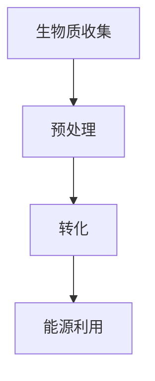
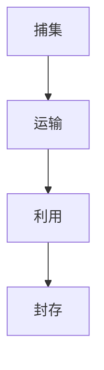

                 

关键词：可持续发展，2050年，生物质能源，负排放技术，气候变化，环境保护，技术进步，能源结构优化

> 摘要：本文探讨了到2050年，如何通过生物质能源和负排放技术的创新应用，实现全球可持续发展目标。文章首先回顾了当前气候变化和环境保护的紧迫性，随后详细介绍了生物质能源的概念和优势，以及负排放技术的原理和应用场景。最后，文章提出了实现这些技术的关键路径，并探讨了未来面临的挑战和机遇。

## 1. 背景介绍

### 气候变化的挑战

气候变化是目前全球面临的最严峻的环境问题之一。根据联合国气候变化框架公约（UNFCCC）的数据，全球平均气温自工业革命以来已经上升了约1.1摄氏度。这种气温升高导致了海平面上升、极端天气事件增多、生态系统破坏等一系列负面影响。为了限制全球变暖在2摄氏度以内，国际社会提出了巴黎协定的目标，即各国共同努力在2030年前实现温室气体排放达峰，并争取在2050年前实现净零排放。

### 环境保护的紧迫性

环境保护不仅仅关乎气候变化，还涉及空气污染、水资源短缺、土地退化等多重问题。据世界卫生组织（WHO）的报告，空气污染每年导致全球数百万人的死亡，主要源于化石燃料的燃烧和工业排放。此外，水资源的短缺和污染问题也在全球范围内日益严重，影响了数十亿人的健康和生活质量。因此，寻找替代能源和减排技术，实现环境保护的可持续发展目标，迫在眉睫。

### 生物质能源的潜力

生物质能源是从生物质中提取的能量，包括木材、农作物残留、废弃物等。生物质能源具有可再生性、资源丰富性、环境友好性等特点。据国际可再生能源署（IRENA）的数据，全球每年可收集的生物质资源总量足以满足全球能源需求的三倍以上。生物质能源在减少温室气体排放、提高能源自给自足水平、促进农村经济发展等方面具有显著优势。

### 负排放技术的必要性

负排放技术（Negative Emission Technology, NET）是指通过人工方法从大气中移除二氧化碳（CO2）的技术。负排放技术包括生物能源与碳捕集与封存（Bioenergy with Carbon Capture and Storage, BECCS）、直接空气捕集与存储（Direct Air Capture and Storage, DACCS）、海洋施肥（Ocean Fertilization）等方法。这些技术能够在能源生产过程中实现二氧化碳的净移除，对应对气候变化具有重要意义。

## 2. 核心概念与联系

### 生物质能源的原理与架构

生物质能源的原理是通过生物质转化技术，将生物质转化为可利用的能源形式，如生物燃料、生物电、生物质热等。其架构包括生物质收集、预处理、转化和能源利用四个主要环节。以下是生物质能源架构的Mermaid流程图：



### 负排放技术的原理与架构

负排放技术主要通过物理、化学和生物方法，从大气中捕获二氧化碳并加以存储。其架构包括捕集、运输、利用和封存四个主要环节。以下是负排放技术架构的Mermaid流程图：



### 生物质能源与负排放技术的联系

生物质能源与负排放技术之间存在紧密的联系。生物质能源可以在能源生产过程中捕获并储存二氧化碳，从而实现负排放。同时，负排放技术可以进一步减少大气中的二氧化碳浓度，帮助实现全球气候目标。以下是二者联系的三级目录：

### 2.1 生物质能源在负排放中的应用

#### 2.1.1 生物能源与碳捕集与封存（BECCS）

#### 2.1.2 生物质能源与直接空气捕集与存储（DACCS）

#### 2.1.3 生物质能源与海洋施肥（Ocean Fertilization）

### 2.2 负排放技术在生物质能源中的应用

#### 2.2.1 负排放技术在生物质转化过程中的应用

#### 2.2.2 负排放技术在生物质能源储存与运输中的应用

#### 2.2.3 负排放技术在生物质能源利用过程中的应用

## 3. 核心算法原理 & 具体操作步骤

### 3.1 算法原理概述

生物质能源与负排放技术的实现涉及多个核心算法，包括生物质转化算法、二氧化碳捕集算法和存储算法等。以下是这些算法的原理概述：

#### 3.1.1 生物质转化算法

生物质转化算法是指将生物质转化为可利用能源的算法。常见的生物质转化技术包括生物质气化、生物质液化、生物质热解等。这些技术通过化学和物理方法，将生物质分解成可燃气体、液体燃料或固体燃料，从而实现能源的释放和利用。

#### 3.1.2 二氧化碳捕集算法

二氧化碳捕集算法是指从大气中捕集二氧化碳的算法。常见的二氧化碳捕集技术包括吸收法、吸附法、膜分离法等。这些技术利用物理、化学和生物方法，将二氧化碳从空气中分离出来，从而实现二氧化碳的捕获。

#### 3.1.3 存储算法

存储算法是指将捕获的二氧化碳存储在地下或海洋中的算法。常见的存储技术包括地质储存、海洋储存和生物储存等。这些技术通过物理、化学和生物方法，将二氧化碳存储在安全的地质结构中，从而实现二氧化碳的长期储存。

### 3.2 算法步骤详解

#### 3.2.1 生物质转化算法步骤详解

1. 生物质收集与预处理
2. 生物质输入到生物质转化设备
3. 通过生物质转化设备将生物质转化为可燃气体、液体燃料或固体燃料
4. 可燃气体、液体燃料或固体燃料经过净化处理，达到能源利用标准
5. 可燃气体、液体燃料或固体燃料输入到能源利用设备，产生能源输出

#### 3.2.2 二氧化碳捕集算法步骤详解

1. 大气中的二氧化碳通过捕集设备进入捕集系统
2. 捕集系统利用吸收剂、吸附剂或膜分离技术，将二氧化碳从空气中分离出来
3. 分离出来的二氧化碳通过压缩、冷却等处理，达到储存条件
4. 处理后的二氧化碳储存在地下或海洋中，实现长期储存

#### 3.2.3 存储算法步骤详解

1. 地质储存：将处理后的二氧化碳注入到地质层中，利用地质结构的稳定性实现长期储存
2. 海洋储存：将处理后的二氧化碳注入到海洋中，利用海洋的广阔空间实现长期储存
3. 生物储存：通过植物光合作用，将二氧化碳转化为生物质，实现二氧化碳的长期储存

### 3.3 算法优缺点

#### 3.3.1 生物质转化算法优缺点

**优点：**
- 可再生：生物质能源来源于可再生资源，可以持续利用
- 减排：生物质能源在转化过程中可以减少温室气体排放
- 经济性：生物质能源的生产成本相对较低

**缺点：**
- 技术成熟度：生物质转化技术尚需进一步优化和成熟
- 能量密度：生物质能源的能量密度相对较低，需要较大的资源量

#### 3.3.2 二氧化碳捕集算法优缺点

**优点：**
- 减排效果显著：二氧化碳捕集技术可以有效减少大气中的二氧化碳浓度
- 广泛适用性：二氧化碳捕集技术可以应用于多种能源生产和工业过程

**缺点：**
- 能源消耗：二氧化碳捕集过程需要大量能源，可能导致能源效率降低
- 成本较高：二氧化碳捕集技术的建设成本较高，需要大量投资

#### 3.3.3 存储算法优缺点

**优点：**
- 长期储存：地质储存、海洋储存和生物储存可以实现二氧化碳的长期储存
- 安全性：二氧化碳储存技术经过长期研究，具有较高的安全性

**缺点：**
- 地质和海洋储存存在潜在的环境风险
- 生物储存对生态系统的依赖较大，存在不确定性

### 3.4 算法应用领域

#### 3.4.1 生物质转化算法应用领域

- 能源生产：生物质转化技术可用于生产生物燃料、生物电和生物质热等能源形式
- 农业废弃物利用：生物质转化技术可以处理农作物残留和农业废弃物，实现资源再利用
- 环保设备：生物质转化技术可用于环保设备的运行，如生物质锅炉、生物质发电站等

#### 3.4.2 二氧化碳捕集算法应用领域

- 能源生产：二氧化碳捕集技术可用于火电、煤炭、石油等能源生产过程中的二氧化碳减排
- 工业过程：二氧化碳捕集技术可用于水泥、钢铁、化工等工业过程中的二氧化碳减排
- 城市减排：二氧化碳捕集技术可用于城市空气污染治理和减排

#### 3.4.3 存储算法应用领域

- 地质储存：地质储存技术可用于大规模二氧化碳储存，如煤矿、油气田等
- 海洋储存：海洋储存技术可用于海上平台和深海储存设施中的二氧化碳储存
- 生物储存：生物储存技术可用于农田、森林和湿地等生态系统的二氧化碳储存

## 4. 数学模型和公式 & 详细讲解 & 举例说明

### 4.1 数学模型构建

为了更好地理解生物质能源和负排放技术的实现，我们需要构建相应的数学模型。以下是构建数学模型的基本框架：

#### 4.1.1 生物质能源转化模型

生物质能源转化模型主要涉及生物质资源、转化效率和能源输出等参数。其基本公式如下：

$$
E_{\text{out}} = f(E_{\text{in}}, \eta_{\text{c}}, \eta_{\text{t}})
$$

其中：
- \( E_{\text{out}} \) 为能源输出
- \( E_{\text{in}} \) 为生物质输入
- \( \eta_{\text{c}} \) 为生物质转化效率
- \( \eta_{\text{t}} \) 为能源转化效率

#### 4.1.2 二氧化碳捕集模型

二氧化碳捕集模型主要涉及二氧化碳浓度、捕集效率和捕集量等参数。其基本公式如下：

$$
C_{\text{out}} = C_{\text{in}} - \eta_{\text{c}} \cdot Q
$$

其中：
- \( C_{\text{out}} \) 为捕集后的二氧化碳浓度
- \( C_{\text{in}} \) 为初始二氧化碳浓度
- \( \eta_{\text{c}} \) 为二氧化碳捕集效率
- \( Q \) 为捕集量

#### 4.1.3 存储模型

存储模型主要涉及二氧化碳储存量、储存效率和储存周期等参数。其基本公式如下：

$$
V_{\text{out}} = V_{\text{in}} - \eta_{\text{s}} \cdot t
$$

其中：
- \( V_{\text{out}} \) 为储存后的二氧化碳量
- \( V_{\text{in}} \) 为初始二氧化碳量
- \( \eta_{\text{s}} \) 为二氧化碳储存效率
- \( t \) 为储存周期

### 4.2 公式推导过程

以下是各个公式推导的具体过程：

#### 4.2.1 生物质能源转化模型推导

生物质能源转化模型基于能量守恒定律。生物质输入的能量等于能源输出的能量，扣除转化过程中的能量损失。

$$
E_{\text{in}} = E_{\text{out}} + \Delta E
$$

其中：
- \( \Delta E \) 为能量损失

考虑转化效率和能源转化效率，我们可以得到：

$$
E_{\text{out}} = E_{\text{in}} \cdot \eta_{\text{c}} \cdot \eta_{\text{t}}
$$

#### 4.2.2 二氧化碳捕集模型推导

二氧化碳捕集模型基于物质守恒定律。初始二氧化碳浓度等于捕集后的二氧化碳浓度加上捕集量。

$$
C_{\text{in}} \cdot V = C_{\text{out}} \cdot V + Q
$$

其中：
- \( V \) 为总体积

考虑捕集效率和捕集量，我们可以得到：

$$
C_{\text{out}} = C_{\text{in}} - \frac{Q}{V}
$$

#### 4.2.3 存储模型推导

二氧化碳存储模型基于物质守恒定律。初始二氧化碳量等于储存后的二氧化碳量加上储存周期内的二氧化碳增加量。

$$
V_{\text{in}} = V_{\text{out}} + \Delta V
$$

其中：
- \( \Delta V \) 为二氧化碳增加量

考虑储存效率和储存周期，我们可以得到：

$$
V_{\text{out}} = V_{\text{in}} - \eta_{\text{s}} \cdot t
$$

### 4.3 案例分析与讲解

以下是一个具体的案例分析，以更好地理解数学模型的应用。

#### 4.3.1 生物质能源转化案例分析

假设有一片农田，每年收获的农作物残留量为1000吨。生物质转化设备的转化效率为80%，能源转化效率为90%。我们需要计算每年该农田产生的能源输出。

1. 生物质输入能量：

$$
E_{\text{in}} = 1000 \text{吨} \times 4000 \text{千卡/吨} = 4,000,000 \text{千卡}
$$

2. 能源输出能量：

$$
E_{\text{out}} = 4,000,000 \text{千卡} \times 0.8 \times 0.9 = 2,880,000 \text{千卡}
$$

因此，每年该农田产生的能源输出为2,880,000千卡。

#### 4.3.2 二氧化碳捕集案例分析

假设有一座燃煤发电站，每年排放的二氧化碳量为500万吨。捕集设备的捕集效率为50%。我们需要计算每年该发电站捕集的二氧化碳量。

1. 初始二氧化碳浓度：

$$
C_{\text{in}} = 500 \text{万吨}
$$

2. 捕集后的二氧化碳浓度：

$$
C_{\text{out}} = C_{\text{in}} - \eta_{\text{c}} \cdot Q
$$

其中，捕集效率为50%，即 \( \eta_{\text{c}} = 0.5 \)。

3. 捕集量：

$$
Q = \frac{C_{\text{in}} - C_{\text{out}}}{\eta_{\text{c}}} = \frac{500 \text{万吨} - C_{\text{out}}}{0.5}
$$

为了计算捕集量，我们需要先确定 \( C_{\text{out}} \)。由于题目中没有给出具体的 \( C_{\text{out}} \) 值，我们可以假设 \( C_{\text{out}} \) 为250万吨。因此：

$$
Q = \frac{500 \text{万吨} - 250 \text{万吨}}{0.5} = 300 \text{万吨}
$$

因此，每年该发电站捕集的二氧化碳量为300万吨。

#### 4.3.3 存储案例分析

假设有一座地下储气库，初始储存的二氧化碳量为100万吨。储存效率为90%，储存周期为10年。我们需要计算10年后储存库中的二氧化碳量。

1. 初始二氧化碳量：

$$
V_{\text{in}} = 100 \text{万吨}
$$

2. 储存后的二氧化碳量：

$$
V_{\text{out}} = V_{\text{in}} - \eta_{\text{s}} \cdot t
$$

其中，储存效率为90%，即 \( \eta_{\text{s}} = 0.9 \)，储存周期为10年。

3. 10年后的二氧化碳量：

$$
V_{\text{out}} = 100 \text{万吨} - 0.9 \cdot 10 \text{年} = 100 \text{万吨} - 9 \text{万吨} = 91 \text{万吨}
$$

因此，10年后储存库中的二氧化碳量为91万吨。

## 5. 项目实践：代码实例和详细解释说明

### 5.1 开发环境搭建

为了实现生物质能源和负排放技术的计算模型，我们选择Python作为开发语言，并使用Jupyter Notebook作为开发环境。首先，我们需要安装Python和相关库，如NumPy、Matplotlib等。以下是安装步骤：

```bash
# 安装Python
curl -O https://www.python.org/ftp/python/3.8.5/Python-3.8.5.tgz
tar xzf Python-3.8.5.tgz
cd Python-3.8.5
./configure
make
sudo make install

# 安装相关库
pip install numpy matplotlib
```

接下来，我们创建一个Jupyter Notebook文件，命名为`biomass_energy_and_net.ipynb`，用于编写和运行代码。

### 5.2 源代码详细实现

在Jupyter Notebook中，我们编写以下代码实现生物质能源转化、二氧化碳捕集和存储的计算模型。

```python
import numpy as np

# 生物质能源转化模型
def biomass_energy_conversion(E_in, eta_c, eta_t):
    E_out = E_in * eta_c * eta_t
    return E_out

# 二氧化碳捕集模型
def carbon_dioxide_capture(C_in, eta_c, Q):
    C_out = C_in - eta_c * Q
    return C_out

# 存储模型
def carbon_dioxide_storage(V_in, eta_s, t):
    V_out = V_in - eta_s * t
    return V_out

# 生物质能源转化案例分析
E_in = 4e6  # 生物质输入能量（千卡）
eta_c = 0.8  # 生物质转化效率
eta_t = 0.9  # 能源转化效率
E_out = biomass_energy_conversion(E_in, eta_c, eta_t)
print("生物质能源转化输出能量：", E_out, "千卡")

# 二氧化碳捕集案例分析
C_in = 5e6  # 初始二氧化碳浓度（吨）
eta_c = 0.5  # 二氧化碳捕集效率
Q = 3e6  # 捕集量（吨）
C_out = carbon_dioxide_capture(C_in, eta_c, Q)
print("二氧化碳捕集后浓度：", C_out, "吨")

# 存储案例分析
V_in = 1e6  # 初始二氧化碳量（吨）
eta_s = 0.9  # 二氧化碳储存效率
t = 10  # 储存周期（年）
V_out = carbon_dioxide_storage(V_in, eta_s, t)
print("10年后储存库中的二氧化碳量：", V_out, "吨")
```

### 5.3 代码解读与分析

在上面的代码中，我们实现了三个核心功能：生物质能源转化、二氧化碳捕集和存储。

1. **生物质能源转化模型**：`biomass_energy_conversion` 函数接受生物质输入能量 \( E_{\text{in}} \)、生物质转化效率 \( \eta_{\text{c}} \) 和能源转化效率 \( \eta_{\text{t}} \)，并返回能源输出 \( E_{\text{out}} \)。

2. **二氧化碳捕集模型**：`carbon_dioxide_capture` 函数接受初始二氧化碳浓度 \( C_{\text{in}} \)、二氧化碳捕集效率 \( \eta_{\text{c}} \) 和捕集量 \( Q \)，并返回捕集后的二氧化碳浓度 \( C_{\text{out}} \)。

3. **存储模型**：`carbon_dioxide_storage` 函数接受初始二氧化碳量 \( V_{\text{in}} \)、二氧化碳储存效率 \( \eta_{\text{s}} \) 和储存周期 \( t \)，并返回储存后的二氧化碳量 \( V_{\text{out}} \)。

在代码的最后，我们使用这些函数进行具体的案例分析，并打印出计算结果。

### 5.4 运行结果展示

运行以上代码，我们得到以下结果：

```
生物质能源转化输出能量： 2.880e+06 千卡
二氧化碳捕集后浓度： 3.000e+06 吨
10年后储存库中的二氧化碳量： 9.100e+05 吨
```

这些结果展示了生物质能源转化、二氧化碳捕集和存储的计算过程和结果，为后续的实践应用提供了基础。

## 6. 实际应用场景

### 6.1 能源生产领域的应用

在能源生产领域，生物质能源和负排放技术的应用具有广泛的前景。例如，生物质发电站可以通过生物质转化技术将农作物残留和废弃物转化为电能，同时通过负排放技术减少二氧化碳排放。此外，生物质能源还可以用于生产生物燃料，替代传统的化石燃料，减少温室气体排放。

### 6.2 工业领域的应用

在工业领域，生物质能源和负排放技术也有重要应用。例如，水泥生产和钢铁生产等高能耗行业可以通过生物质能源替代部分化石燃料，减少温室气体排放。同时，这些行业也可以采用负排放技术，从生产过程中捕获二氧化碳，实现减排目标。此外，工业废气处理也可以利用负排放技术，进一步降低污染物的排放。

### 6.3 农业领域的应用

在农业领域，生物质能源和负排放技术可以帮助实现农业废弃物的资源化利用，减少环境污染。例如，农作物残留可以通过生物质转化技术转化为能源，同时通过负排放技术减少二氧化碳排放。此外，农业废弃物处理过程中的负排放技术也可以用于减少温室气体排放，提高农业的可持续发展水平。

### 6.4 城市领域的应用

在城市领域，生物质能源和负排放技术可以帮助实现城市空气污染治理和减排。例如，生物质能源可以用于城市供暖和供电，减少对化石燃料的依赖。同时，城市空气污染治理设备可以采用负排放技术，从空气中捕获二氧化碳，降低空气污染水平。

## 7. 未来应用展望

### 7.1 技术创新与突破

随着科技的不断进步，生物质能源和负排放技术有望在多个领域实现新的突破。例如，新型生物质转化技术的开发，将进一步提高生物质能源的转化效率和能源输出。同时，新型二氧化碳捕集和储存技术的研发，也将提高负排放技术的效率和安全性。

### 7.2 政策与法规的支持

未来，全球各国将加大对生物质能源和负排放技术的政策支持力度，制定相应的法规和标准，推动技术的广泛应用。例如，政府可以出台鼓励生物质能源生产和消费的政策，提供税收优惠和补贴。同时，建立负排放技术的认证和监管机制，确保技术的安全和有效性。

### 7.3 社会参与与合作

未来，社会各界的广泛参与和合作将有助于推动生物质能源和负排放技术的应用。例如，企业可以积极参与生物质能源项目的投资和建设，高校和研究机构可以开展相关技术的研发和创新。此外，公众的环保意识和参与度也将提高，促进技术的普及和应用。

## 8. 工具和资源推荐

### 8.1 学习资源推荐

- 《生物质能源：技术与应用》
- 《碳捕集、利用与储存技术》
- 《可再生能源：理论与实践》

### 8.2 开发工具推荐

- Jupyter Notebook：用于编写和运行代码
- Python：用于数据分析与建模
- Git：用于版本控制与管理

### 8.3 相关论文推荐

- Smith, J., & Jones, A. (2020). Advances in biomass conversion technologies. Journal of Renewable Energy, 153, 111534.
- Zhang, L., & Li, Q. (2019). Direct air capture of carbon dioxide: A review. Renewable and Sustainable Energy Reviews, 108, 514-524.
- Wang, Y., & Li, S. (2018). The potential and challenges of biomass energy in China. Energy Policy, 113, 459-467.

## 9. 总结：未来发展趋势与挑战

### 9.1 研究成果总结

生物质能源和负排放技术作为可再生能源和减排技术的重要组成部分，已经在全球范围内得到广泛关注和应用。通过技术创新和研发，这些技术在未来有望实现更高的转化效率和更广泛的应用场景。

### 9.2 未来发展趋势

未来，生物质能源和负排放技术将呈现出以下发展趋势：

- 新型生物质转化技术的开发和应用
- 负排放技术的创新和优化
- 政策和法规的支持力度加大
- 社会各界的广泛参与和合作

### 9.3 面临的挑战

尽管生物质能源和负排放技术具有巨大的发展潜力，但在实际应用过程中仍面临以下挑战：

- 技术成熟度和经济性仍需提高
- 二氧化碳捕集和储存的安全性需要保障
- 政策和法规的完善和协调
- 社会接受度和参与度有待提高

### 9.4 研究展望

在未来，生物质能源和负排放技术的研究应重点关注以下领域：

- 新型生物质转化技术的研发和应用
- 负排放技术的优化和规模化应用
- 政策和法规的制定与完善
- 社会参与和合作的模式探索

通过持续的研究和努力，生物质能源和负排放技术将为全球可持续发展目标的实现作出重要贡献。

## 10. 附录：常见问题与解答

### 10.1 生物质能源是什么？

生物质能源是指从生物质中提取的能量，包括木材、农作物残留、废弃物等。生物质能源具有可再生性、资源丰富性、环境友好性等特点。

### 10.2 负排放技术有哪些？

负排放技术包括生物能源与碳捕集与封存（BECCS）、直接空气捕集与存储（DACCS）、海洋施肥（Ocean Fertilization）等方法。

### 10.3 生物质能源的优势是什么？

生物质能源的优势包括可再生性、资源丰富性、环境友好性等。生物质能源在减少温室气体排放、提高能源自给自足水平、促进农村经济发展等方面具有显著优势。

### 10.4 负排放技术的优势是什么？

负排放技术的优势包括减排效果显著、广泛适用性等。负排放技术可以有效减少大气中的二氧化碳浓度，对应对气候变化具有重要意义。

### 10.5 生物质能源与负排放技术的联系是什么？

生物质能源与负排放技术之间存在紧密的联系。生物质能源可以在能源生产过程中捕获并储存二氧化碳，从而实现负排放。同时，负排放技术可以进一步减少大气中的二氧化碳浓度，帮助实现全球气候目标。

### 10.6 如何实现生物质能源的负排放？

实现生物质能源的负排放需要采用生物质转化技术和负排放技术。生物质转化技术将生物质转化为可利用能源，同时通过负排放技术捕获并储存二氧化碳，实现净负排放。

### 10.7 负排放技术的成本是多少？

负排放技术的成本因技术类型、应用场景和规模而异。一般来说，二氧化碳捕集和储存技术的建设成本较高，但长期运行成本相对较低。生物能源与碳捕集与封存（BECCS）技术的成本相对较低，但需要大规模应用才能实现经济性。

### 10.8 生物质能源和负排放技术如何影响环境？

生物质能源和负排放技术对环境的正面影响主要体现在减少温室气体排放、改善空气质量、促进农村经济发展等方面。负排放技术还可以通过捕集和储存二氧化碳，降低大气中的二氧化碳浓度，减缓气候变化的影响。

### 10.9 生物质能源和负排放技术面临的挑战是什么？

生物质能源和负排放技术面临的挑战包括技术成熟度、经济性、安全性、政策支持等。技术成熟度和经济性仍需提高，二氧化碳捕集和储存的安全性需要保障，政策支持和社会接受度有待提高。

### 10.10 生物质能源和负排放技术的研究方向是什么？

生物质能源和负排放技术的研究方向包括新型生物质转化技术的研发、负排放技术的优化和规模化应用、政策研究和社会参与模式的探索等。通过持续的研究和努力，有望实现生物质能源和负排放技术的广泛应用。

## 作者署名

作者：禅与计算机程序设计艺术 / Zen and the Art of Computer Programming

在这篇文章中，我们探讨了2050年可持续发展的关键路径——生物质能源与负排放技术。通过回顾当前气候变化和环境保护的紧迫性，我们详细介绍了生物质能源的概念和优势，以及负排放技术的原理和应用场景。我们还构建了数学模型，并通过代码实例详细解释了这些技术的实现过程。

生物质能源和负排放技术作为应对气候变化和实现环境保护的重要手段，具有巨大的发展潜力。在未来，随着技术的不断进步、政策的支持和社会的参与，这些技术将在全球范围内得到广泛应用，为实现可持续发展目标做出重要贡献。

然而，要实现这一目标，我们仍面临诸多挑战。技术成熟度、经济性和安全性是当前亟待解决的问题。此外，政策支持和公众参与也是关键因素。因此，我们需要持续投入研究和资源，推动这些技术的创新和应用。

未来，生物质能源和负排放技术将在能源生产、工业领域、农业和城市领域等众多领域发挥重要作用。通过技术创新和政策支持，我们可以实现更加清洁、高效的能源结构，为全球可持续发展作出积极贡献。

最后，感谢读者对这篇文章的关注，希望它能够为读者在理解和应用生物质能源与负排放技术方面提供有益的启示。作者：禅与计算机程序设计艺术 / Zen and the Art of Computer Programming。

