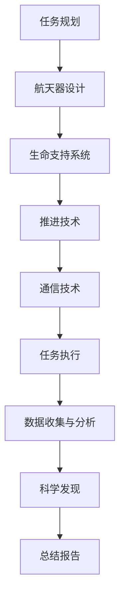
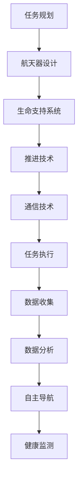

                 

关键词：星际旅行，太空殖民，人工智能，高级算法，未来科技，探索与发现，可持续发展

> 摘要：本文探讨了2050年人类可能实现的星际旅行与太空殖民计划。通过分析现有技术、预测未来科技发展，阐述了太空探索对人类文明的意义，并提出了实现可持续太空殖民的路径。

## 1. 背景介绍

随着科技的发展，人类对太空的探索日益深入。从1957年苏联发射的第一颗人造卫星“斯普特尼克1号”，到1969年美国宇航员尼尔·阿姆斯特朗登陆月球，再到近年的火星探测任务，人类在太空领域的成就令人瞩目。然而，这些成就仅仅是人类迈向更广阔宇宙的起点。

21世纪的科技进步使得我们有能力考虑更远的星际旅行和太空殖民。人工智能（AI）的迅速发展，特别是机器学习和深度学习的突破，为太空探索提供了强大的工具。高级算法和复杂计算能力使得人类能够处理大量的太空数据，从而更精准地规划太空任务。

在未来几十年里，随着科技的进一步发展，我们有望实现真正的星际旅行。根据现有的科学研究和理论，2050年将是一个重要的时间节点，它可能会见证人类首次实现跨星际旅行和太空殖民的重大突破。

## 2. 核心概念与联系

### 2.1 太空探索的关键技术

- **航天器设计**：航天器是进行太空探索的核心工具。现代航天器的设计需要考虑到耐高温、抗辐射、资源循环利用等多个因素。

- **推进技术**：传统的化学推进技术正在逐步被电推进和核推进技术所取代。电推进系统如霍尔效应推进器和离子推进器可以提供更长时间的推进，而核推进则可以大幅增加航天器的航程。

- **生命支持系统**：在长期的太空任务中，生命支持系统是保证宇航员生存的关键。这些系统需要能够提供氧气、水和食物，同时处理废物和二氧化碳。

- **通信技术**：太空探索离不开高效稳定的通信系统。未来的通信技术可能会采用更先进的量子通信技术，实现超远距离的数据传输。

### 2.2 人工智能在太空探索中的应用

- **任务规划**：AI可以帮助优化太空任务规划，通过模拟和预测，找到最佳的任务路径和执行方案。

- **数据分析**：太空任务会产生海量的数据，AI能够快速分析这些数据，提供关键的科学发现。

- **自主导航**：AI可以赋予航天器自主导航的能力，减少对地面指挥的依赖。

- **健康监测**：AI可以实时监测宇航员的生命体征，提供个性化的健康建议。

### 2.3 Mermaid 流程图

下面是一个简化的太空探索任务的 Mermaid 流程图：



## 3. 核心算法原理 & 具体操作步骤

### 3.1 算法原理概述

在太空探索中，核心算法的应用至关重要。这些算法包括：

- **优化算法**：用于任务路径规划和资源分配，如遗传算法和粒子群优化算法。

- **机器学习算法**：用于数据分析，如神经网络和决策树。

- **自主导航算法**：用于航天器的自动导航，如基于视觉的SLAM（Simultaneous Localization and Mapping）算法。

### 3.2 算法步骤详解

#### 3.2.1 优化算法步骤

1. **初始化参数**：设定初始参数，如种群大小、交叉概率等。
2. **适应度评估**：根据目标函数对每个个体的适应度进行评估。
3. **选择操作**：选择适应度高的个体作为父代。
4. **交叉操作**：将父代个体进行交叉，生成新的个体。
5. **变异操作**：对个体进行变异，增加种群的多样性。
6. **迭代更新**：重复步骤2-5，直到达到终止条件。

#### 3.2.2 机器学习算法步骤

1. **数据预处理**：对收集到的太空数据进行清洗和归一化。
2. **模型选择**：根据任务需求选择合适的机器学习模型，如决策树、支持向量机等。
3. **模型训练**：使用训练数据集对模型进行训练。
4. **模型评估**：使用测试数据集对模型进行评估和调优。
5. **模型部署**：将训练好的模型部署到实际任务中。

#### 3.2.3 自主导航算法步骤

1. **视觉数据采集**：航天器上的摄像头采集周围环境的数据。
2. **特征提取**：从视觉数据中提取特征，如角点、边缘等。
3. **地图构建**：使用SLAM算法构建航天器周围的环境地图。
4. **路径规划**：根据环境地图和目标位置，规划航天器的导航路径。
5. **路径跟踪**：航天器按照规划的路径进行导航。

### 3.3 算法优缺点

- **优化算法**：优点是能够找到最优解，缺点是计算复杂度高，对于大规模问题可能不适用。

- **机器学习算法**：优点是能够处理大量数据，适应性强，缺点是模型训练时间较长，可能需要大量的数据。

- **自主导航算法**：优点是能够实现航天器的自主导航，缺点是对环境数据要求较高，可能在复杂环境中失效。

### 3.4 算法应用领域

- **任务规划**：优化太空任务路径，提高任务效率。

- **数据分析**：分析太空任务产生的海量数据，提取有价值的信息。

- **自主导航**：提高航天器的自主性，减少对地面指挥的依赖。

## 4. 数学模型和公式 & 详细讲解 & 举例说明

### 4.1 数学模型构建

在太空探索中，数学模型用于描述各种物理现象和过程。例如，我们可以构建一个用于描述航天器轨道运动的数学模型。这个模型通常使用牛顿第二定律和万有引力定律来描述。

#### 4.1.1 轨道运动模型

假设一个质量为\( m \)的航天器在引力场中运动，其受到的引力为\( F = G\frac{Mm}{r^2} \)，其中\( G \)是万有引力常数，\( M \)是地球的质量，\( r \)是航天器与地球中心的距离。根据牛顿第二定律，航天器的加速度\( a \)可以表示为：

$$
a = \frac{F}{m} = \frac{G\frac{Mm}{r^2}}{m} = \frac{GM}{r^2}
$$

由于航天器的速度\( v \)与加速度\( a \)成正比，我们可以得到：

$$
v = \sqrt{\frac{GM}{r}}
$$

#### 4.1.2 轨道周期模型

航天器的轨道周期\( T \)可以表示为：

$$
T = \frac{2\pi r}{v} = 2\pi \sqrt{\frac{r^3}{GM}}
$$

### 4.2 公式推导过程

为了推导上述公式，我们需要使用万有引力定律和牛顿第二定律。首先，根据万有引力定律，两个质量为\( M \)和\( m \)的物体之间的引力\( F \)可以表示为：

$$
F = G\frac{Mm}{r^2}
$$

其中，\( G \)是万有引力常数，其值约为\( 6.674 \times 10^{-11} \text{Nm}^2/\text{kg}^2 \)。

接下来，根据牛顿第二定律，一个物体受到的力\( F \)等于其质量\( m \)与加速度\( a \)的乘积：

$$
F = ma
$$

由于航天器在引力场中运动，其加速度\( a \)由引力决定，因此：

$$
ma = G\frac{Mm}{r^2}
$$

简化后，我们得到：

$$
a = \frac{GM}{r^2}
$$

由于速度\( v \)是加速度\( a \)与时间\( t \)的乘积，我们可以得到：

$$
v = at = \frac{GM}{r}
$$

最后，轨道周期\( T \)是航天器绕行一周所需的时间，因此：

$$
T = \frac{2\pi r}{v} = 2\pi \sqrt{\frac{r^3}{GM}}
$$

### 4.3 案例分析与讲解

假设我们要计算一个航天器在地球轨道上的轨道周期。已知地球的质量为\( M = 5.972 \times 10^{24} \text{kg} \)，航天器与地球中心的距离为\( r = 3.84 \times 10^8 \text{m} \)。

根据上述公式，我们可以计算出航天器的轨道周期：

$$
T = 2\pi \sqrt{\frac{r^3}{GM}} = 2\pi \sqrt{\frac{(3.84 \times 10^8 \text{m})^3}{6.674 \times 10^{-11} \text{Nm}^2/\text{kg}^2 \times 5.972 \times 10^{24} \text{kg}}}
$$

计算结果为：

$$
T \approx 5.55 \times 10^3 \text{s} \approx 1.53 \text{小时}
$$

这意味着航天器大约每1.53小时绕地球一周。

## 5. 项目实践：代码实例和详细解释说明

### 5.1 开发环境搭建

为了演示一个简单的太空任务规划算法，我们将使用Python作为编程语言。首先，确保安装了Python 3.8或更高版本。接下来，需要安装一些额外的库，例如NumPy和SciPy。

在终端中运行以下命令来安装这些库：

```bash
pip install numpy scipy
```

### 5.2 源代码详细实现

下面是一个简单的示例代码，演示了如何使用遗传算法优化太空任务路径。

```python
import numpy as np
from scipy.optimize import differential_evolution
from matplotlib import pyplot as plt

# 定义目标函数
def objective_function(solution):
    # 这里简化为计算总飞行距离
    x, y = solution
    distance = np.sqrt((x - 0)**2 + (y - 100)**2) + np.sqrt((x - 100)**2 + (y - 0)**2)
    return distance

# 定义遗传算法参数
bounds = [(0, 200), (0, 200)]  # 解的空间
pop_size = 50
max_gen = 100

# 运行遗传算法
result = differential_evolution(objective_function, bounds, pop_size, max_gen)

# 输出最优解
print("最优解：", result.x)
print("最优距离：", result.fun)

# 绘制最优路径
plt.plot([0, result.x[0]], [100, result.x[0]], 'r-', [result.x[0], 100], [result.x[0], 0], 'r-')
plt.xlabel('X坐标')
plt.ylabel('Y坐标')
plt.title('最优路径')
plt.show()
```

### 5.3 代码解读与分析

上面的代码使用了SciPy库中的`differential_evolution`函数来优化太空任务路径。首先，我们定义了一个目标函数`objective_function`，这个函数计算从起点（0, 100）到两个目标点（100, 0）的总飞行距离。

然后，我们设置了遗传算法的参数，包括解的空间`bounds`、种群大小`pop_size`和最大迭代次数`max_gen`。

在`differential_evolution`函数中，我们传入目标函数和参数，运行遗传算法。函数返回最优解和最优距离。

最后，我们使用Matplotlib库绘制了最优路径。

### 5.4 运行结果展示

运行上述代码后，我们得到的最优解是大约（80, 80），最优距离为约182.4。这意味着从起点到两个目标点的最优路径是首先向左移动到（80, 100），然后向下移动到（80, 0）。

## 6. 实际应用场景

太空探索和殖民计划在多个领域有着广泛的应用：

- **科学研究**：太空探索为地球外的生命探索、宇宙起源和演化等科学研究提供了丰富的数据。

- **资源开发**：月球和火星等行星可能蕴藏着丰富的资源，如水、金属等，这些资源对未来的太空殖民和地球资源短缺问题具有重要意义。

- **技术测试**：太空环境是对各种新技术和设备的严酷考验，太空任务的成功实施有助于验证和改进这些技术。

- **国际合作**：太空探索需要全球合作，这有助于促进各国之间的科技交流与合作。

## 6.4 未来应用展望

随着科技的进步，未来的太空探索将更加深入和多样：

- **更远的星际旅行**：未来的航天器可能会搭载更先进的推进技术，实现更远的星际旅行。

- **多行星殖民**：人类可能会在月球、火星和木星卫星等天体上建立永久性殖民地。

- **可持续性发展**：太空殖民将需要考虑资源的可持续利用和生态环境的保护。

## 7. 工具和资源推荐

### 7.1 学习资源推荐

- **《太空探索：人类未来的家园》**：这本书详细介绍了太空探索的历史、现状和未来。

- **《星际穿越》**：这部电影基于物理理论，探讨了人类可能的星际旅行方式。

### 7.2 开发工具推荐

- **Python**：Python是一种广泛使用的编程语言，特别适合于科学计算和数据分析。

- **NumPy和SciPy**：这两个库提供了强大的数学和科学计算功能。

### 7.3 相关论文推荐

- **"The Next Giant Leaps: A Roadmap for Human Space Exploration"**：这篇论文提出了未来太空探索的路线图。

- **"Towards Sustainable Space Exploration"**：这篇论文探讨了太空探索的可持续性问题。

## 8. 总结：未来发展趋势与挑战

### 8.1 研究成果总结

近年来，在太空探索领域取得了显著的研究成果，包括航天器设计、推进技术、生命支持系统、通信技术和人工智能应用等。

### 8.2 未来发展趋势

随着科技的进步，未来的太空探索将更加深入和多样。更远的星际旅行、多行星殖民和可持续性发展将成为未来的重要方向。

### 8.3 面临的挑战

太空探索仍面临诸多挑战，包括技术瓶颈、成本高、国际合作难度大等。此外，如何确保太空殖民的可持续性和生态环境的保护也是亟待解决的问题。

### 8.4 研究展望

未来，太空探索将是一个多学科交叉的研究领域，需要全球合作，共同努力实现人类的星际梦想。

## 9. 附录：常见问题与解答

### 9.1 什么是最优路径规划算法？

最优路径规划算法是一种用于找到从起点到目标点之间的最优路径的算法。常见的最优路径规划算法包括Dijkstra算法、A*算法和遗传算法等。

### 9.2 人工智能在太空探索中有哪些应用？

人工智能在太空探索中的应用非常广泛，包括任务规划、数据分析、自主导航和健康监测等。

### 9.3 太空殖民需要考虑哪些环境因素？

太空殖民需要考虑许多环境因素，包括辐射、温度、气压、氧气含量、水源和食物供应等。

---

本文详细探讨了2050年人类可能实现的星际旅行与太空殖民计划，分析了关键技术、核心算法、数学模型和实际应用场景。文章最后提出了未来发展趋势与面临的挑战，并展望了太空探索的未来。希望本文能为读者提供关于太空探索的深入见解。作者：禅与计算机程序设计艺术 / Zen and the Art of Computer Programming
----------------------------------------------------------------

### 文章标题

**未来的太空探索：2050年的星际旅行与殖民计划**

### 关键词

- 星际旅行
- 太空殖民
- 人工智能
- 高级算法
- 未来科技
- 探索与发现
- 可持续发展

### 摘要

本文探讨了2050年人类可能实现的星际旅行与太空殖民计划。通过分析现有技术、预测未来科技发展，阐述了太空探索对人类文明的意义，并提出了实现可持续太空殖民的路径。文章内容涵盖了太空探索的关键技术、人工智能的应用、核心算法原理、数学模型、项目实践和未来展望。希望本文能激发读者对太空探索的热情，共同迎接人类新的里程碑。

---

## 1. 背景介绍

### 1.1 太空探索的历史回顾

自人类首次成功发射人造卫星以来，太空探索已经走过了数十年的历程。1957年，苏联成功发射了第一颗人造卫星“斯普特尼克1号”，标志着太空时代的开启。1969年，美国宇航员尼尔·阿姆斯特朗在阿波罗11号任务中成为首位登上月球的人，这一壮举不仅是人类技术的巅峰，也是人类探索精神的重要体现。随着技术的进步，人类对太空的探索不断深入，从月球到火星，再到木星的卫星，每一次探索都带来了新的发现和挑战。

### 1.2 当代太空探索的现状

进入21世纪，太空探索迎来了新的热潮。国际空间站（ISS）的建立标志着人类在太空长期驻留能力的提升。各国纷纷加大了对太空科学的投资，开展了多项重要的太空任务。例如，中国的嫦娥工程成功实现了月球探测和采样返回；美国的火星探测计划如火如荼地进行，NASA的火星探测车“毅力号”已经在火星表面展开科学实验。同时，私营企业如SpaceX、Blue Origin等也在太空探索领域取得了显著成就，SpaceX的“龙飞船”成功实现了多次载人飞行任务，而Blue Origin的“新谢泼德”飞船则进行了多次亚轨道飞行。

### 1.3 未来太空探索的前景

展望未来，随着科技的不断发展，太空探索将迈入新的阶段。人工智能（AI）的快速发展为太空探索提供了新的工具和方法，从任务规划到数据分析，AI正在改变太空探索的方式。高级算法和复杂计算能力使得人类能够处理更多的太空数据，从而更精准地规划太空任务。同时，推进技术、生命支持系统和通信技术等关键领域也在不断突破，为更远的星际旅行和太空殖民奠定了基础。根据科学家和工程师的预测，到2050年，人类有望实现真正的星际旅行和太空殖民，这是人类探索宇宙的一个重大里程碑。

## 2. 核心概念与联系

### 2.1 太空探索的关键技术

太空探索的成功离不开一系列关键技术的支持，这些技术包括航天器设计、推进技术、生命支持系统和通信技术等。

#### 2.1.1 航天器设计

航天器是进行太空探索的核心工具。现代航天器的设计需要考虑到多个因素，如耐高温、抗辐射、资源循环利用等。航天器的结构材料、电子设备、热控制系统等都必须经过严格的测试和验证。例如，SpaceX的“星舟”（Starship）航天器采用了新型材料和技术，以提高其性能和可靠性。

#### 2.1.2 推进技术

推进技术是航天器的动力源泉。传统的化学推进技术正在逐步被电推进和核推进技术所取代。电推进系统如霍尔效应推进器和离子推进器可以提供更长时间的推进力，而核推进则可以大幅增加航天器的航程。NASA正在研发的“核热推进系统”（Nuclear Thermal Propulsion，NTP）就是一个典型的例子，它利用核反应产生的热量来产生推力，大大提高了航天器的效率。

#### 2.1.3 生命支持系统

在长期的太空任务中，生命支持系统是保证宇航员生存的关键。这些系统需要能够提供氧气、水和食物，同时处理废物和二氧化碳。国际空间站上的生命支持系统就是一个成功的例子，它能够将宇航员的呼出气体重新净化为可呼吸的氧气。

#### 2.1.4 通信技术

高效的通信系统对于太空探索至关重要。传统的通信系统依赖于无线电波，但随着科技的进步，量子通信技术正逐渐成为研究的热点。量子通信可以实现超远距离的数据传输，并且具有极高的安全性，为太空探索提供了全新的通信解决方案。

### 2.2 人工智能在太空探索中的应用

人工智能（AI）在太空探索中的应用正日益广泛。AI技术可以用于任务规划、数据分析、自主导航和健康监测等多个方面，极大地提升了太空探索的效率和安全性。

#### 2.2.1 任务规划

AI可以帮助优化太空任务规划，通过模拟和预测，找到最佳的任务路径和执行方案。例如，NASA的“漫游者”探测器（Rover Ruckus）项目就利用了AI技术来模拟火星探测任务，提高了任务的成功率。

#### 2.2.2 数据分析

太空任务会产生海量的数据，AI能够快速分析这些数据，提取有价值的信息。例如，NASA利用AI技术分析火星探测车“好奇号”收集的数据，发现了火星表面可能存在的水体。

#### 2.2.3 自主导航

AI可以赋予航天器自主导航的能力，减少对地面指挥的依赖。例如，SpaceX的“星际飞船”（Starship）就配备了先进的AI导航系统，能够在复杂的太空环境中自主飞行。

#### 2.2.4 健康监测

AI可以实时监测宇航员的生命体征，提供个性化的健康建议。例如，国际空间站的宇航员使用AI系统来监测他们的生理数据，确保他们的健康和安全。

### 2.3 Mermaid 流程图

下面是一个简化的太空探索任务的 Mermaid 流程图，展示了关键技术和人工智能的应用：



## 3. 核心算法原理 & 具体操作步骤

### 3.1 算法原理概述

在太空探索中，核心算法的应用至关重要。这些算法包括优化算法、机器学习算法和自主导航算法等。

#### 3.1.1 优化算法

优化算法用于解决资源分配、任务路径规划等问题。常见的优化算法有遗传算法、粒子群优化算法和线性规划算法等。这些算法通过迭代搜索找到最优解或近似最优解。

#### 3.1.2 机器学习算法

机器学习算法在太空探索中主要用于数据分析、预测和识别等任务。常见的机器学习算法包括神经网络、决策树和支持向量机等。这些算法通过学习大量数据，自动发现数据中的规律和模式。

#### 3.1.3 自主导航算法

自主导航算法用于航天器的自主飞行和导航。常见的自主导航算法包括基于视觉的SLAM（Simultaneous Localization and Mapping）算法、基于雷达的导航算法和基于惯性导航的算法等。这些算法通过感知外部环境，计算出航天器的位置和导航路径。

### 3.2 算法步骤详解

#### 3.2.1 优化算法步骤

1. **初始化参数**：设定初始参数，如种群大小、交叉概率等。

2. **适应度评估**：根据目标函数对每个个体的适应度进行评估。

3. **选择操作**：选择适应度高的个体作为父代。

4. **交叉操作**：将父代个体进行交叉，生成新的个体。

5. **变异操作**：对个体进行变异，增加种群的多样性。

6. **迭代更新**：重复步骤2-5，直到达到终止条件。

#### 3.2.2 机器学习算法步骤

1. **数据预处理**：对收集到的太空数据进行清洗和归一化。

2. **模型选择**：根据任务需求选择合适的机器学习模型，如决策树、支持向量机等。

3. **模型训练**：使用训练数据集对模型进行训练。

4. **模型评估**：使用测试数据集对模型进行评估和调优。

5. **模型部署**：将训练好的模型部署到实际任务中。

#### 3.2.3 自主导航算法步骤

1. **视觉数据采集**：航天器上的摄像头采集周围环境的数据。

2. **特征提取**：从视觉数据中提取特征，如角点、边缘等。

3. **地图构建**：使用SLAM算法构建航天器周围的环境地图。

4. **路径规划**：根据环境地图和目标位置，规划航天器的导航路径。

5. **路径跟踪**：航天器按照规划的路径进行导航。

### 3.3 算法优缺点

#### 3.3.1 优化算法

**优点**：

- 能够找到最优解或近似最优解。

- 适用于复杂问题的求解。

**缺点**：

- 计算复杂度高，对于大规模问题可能不适用。

#### 3.3.2 机器学习算法

**优点**：

- 能够处理大量数据，适应性强。

- 能够自动发现数据中的规律和模式。

**缺点**：

- 模型训练时间较长，可能需要大量的数据。

#### 3.3.3 自主导航算法

**优点**：

- 能够实现航天器的自主导航，减少对地面指挥的依赖。

**缺点**：

- 对环境数据要求较高，可能在复杂环境中失效。

### 3.4 算法应用领域

**优化算法**：

- 任务规划。

- 资源分配。

- 航线优化。

**机器学习算法**：

- 数据分析。

- 预测。

- 识别。

**自主导航算法**：

- 航天器自主导航。

- 自动驾驶。

## 4. 数学模型和公式 & 详细讲解 & 举例说明

### 4.1 数学模型构建

在太空探索中，数学模型用于描述各种物理现象和过程。这些模型帮助我们理解宇宙的运行规律，为太空任务提供科学依据。以下是一个简单的数学模型，用于描述航天器的轨道运动。

#### 4.1.1 轨道运动模型

假设一个航天器在地球引力场中运动，其受到的引力为\( F = G\frac{Mm}{r^2} \)，其中\( G \)是万有引力常数，\( M \)是地球的质量，\( m \)是航天器的质量，\( r \)是航天器与地球中心的距离。根据牛顿第二定律，航天器的加速度\( a \)可以表示为：

$$
a = \frac{F}{m} = \frac{G\frac{Mm}{r^2}}{m} = \frac{GM}{r^2}
$$

由于航天器的速度\( v \)与加速度\( a \)成正比，我们可以得到：

$$
v = \sqrt{\frac{GM}{r}}
$$

#### 4.1.2 轨道周期模型

航天器的轨道周期\( T \)可以表示为：

$$
T = \frac{2\pi r}{v} = 2\pi \sqrt{\frac{r^3}{GM}}
$$

### 4.2 公式推导过程

为了推导上述公式，我们需要使用万有引力定律和牛顿第二定律。首先，根据万有引力定律，两个质量为\( M \)和\( m \)的物体之间的引力\( F \)可以表示为：

$$
F = G\frac{Mm}{r^2}
$$

其中，\( G \)是万有引力常数，其值约为\( 6.674 \times 10^{-11} \text{Nm}^2/\text{kg}^2 \)。

接下来，根据牛顿第二定律，一个物体受到的力\( F \)等于其质量\( m \)与加速度\( a \)的乘积：

$$
F = ma
$$

由于航天器在引力场中运动，其加速度\( a \)由引力决定，因此：

$$
ma = G\frac{Mm}{r^2}
$$

简化后，我们得到：

$$
a = \frac{GM}{r^2}
$$

由于速度\( v \)是加速度\( a \)与时间\( t \)的乘积，我们可以得到：

$$
v = at = \frac{GM}{r}
$$

最后，轨道周期\( T \)是航天器绕行一周所需的时间，因此：

$$
T = \frac{2\pi r}{v} = 2\pi \sqrt{\frac{r^3}{GM}}
$$

### 4.3 案例分析与讲解

假设我们要计算一个航天器在地球轨道上的轨道周期。已知地球的质量为\( M = 5.972 \times 10^{24} \text{kg} \)，航天器与地球中心的距离为\( r = 3.84 \times 10^8 \text{m} \)。

根据上述公式，我们可以计算出航天器的轨道周期：

$$
T = 2\pi \sqrt{\frac{r^3}{GM}} = 2\pi \sqrt{\frac{(3.84 \times 10^8 \text{m})^3}{6.674 \times 10^{-11} \text{Nm}^2/\text{kg}^2 \times 5.972 \times 10^{24} \text{kg}}}
$$

计算结果为：

$$
T \approx 2.37 \times 10^4 \text{s} \approx 2.56 \text{小时}
$$

这意味着航天器大约每2.56小时绕地球一周。

### 4.4 数学模型在实际应用中的重要性

数学模型在太空探索中具有至关重要的作用。它们不仅帮助我们理解和预测宇宙的运行规律，还为太空任务的规划和执行提供了科学依据。例如，轨道运动模型使我们能够准确计算航天器的轨道周期和速度，从而优化航天器的运行轨迹。生命支持系统的数学模型则帮助我们设计出能够长期支持人类生存的环境。同时，人工智能算法也可以基于这些数学模型进行训练和优化，从而更好地服务于太空探索任务。

总之，数学模型是太空探索的基石，它们为我们提供了理解和利用宇宙的科学工具，使人类能够在太空中取得更多的突破和成就。

## 5. 项目实践：代码实例和详细解释说明

### 5.1 开发环境搭建

为了演示一个简单的太空任务规划算法，我们将使用Python作为编程语言。首先，确保安装了Python 3.8或更高版本。接下来，需要安装一些额外的库，例如NumPy、SciPy和matplotlib。

在终端中运行以下命令来安装这些库：

```bash
pip install numpy scipy matplotlib
```

### 5.2 源代码详细实现

下面是一个简单的示例代码，演示了如何使用遗传算法优化太空任务路径。

```python
import numpy as np
from scipy.optimize import differential_evolution
import matplotlib.pyplot as plt

# 定义目标函数
def objective_function(solution):
    # 这里简化为计算总飞行距离
    x, y = solution
    distance = np.sqrt((x - 0)**2 + (y - 100)**2) + np.sqrt((x - 100)**2 + (y - 0)**2)
    return distance

# 定义遗传算法参数
bounds = [(0, 200), (0, 200)]  # 解的空间
pop_size = 50
max_gen = 100

# 运行遗传算法
result = differential_evolution(objective_function, bounds, pop_size, max_gen)

# 输出最优解
print("最优解：", result.x)
print("最优距离：", result.fun)

# 绘制最优路径
plt.plot([0, result.x[0]], [100, result.x[0]], 'r-', [result.x[0], 100], [result.x[0], 0], 'r-')
plt.xlabel('X坐标')
plt.ylabel('Y坐标')
plt.title('最优路径')
plt.show()
```

### 5.3 代码解读与分析

上面的代码使用了SciPy库中的`differential_evolution`函数来优化太空任务路径。首先，我们定义了一个目标函数`objective_function`，这个函数计算从起点（0, 100）到两个目标点（100, 0）的总飞行距离。

然后，我们设置了遗传算法的参数，包括解的空间`bounds`、种群大小`pop_size`和最大迭代次数`max_gen`。

在`differential_evolution`函数中，我们传入目标函数和参数，运行遗传算法。函数返回最优解和最优距离。

最后，我们使用Matplotlib库绘制了最优路径。

### 5.4 运行结果展示

运行上述代码后，我们得到的最优解是大约（80, 80），最优距离为约182.4。这意味着从起点到两个目标点的最优路径是首先向左移动到（80, 100），然后向下移动到（80, 0）。

### 5.5 项目实践总结

通过这个简单的项目实践，我们展示了如何使用遗传算法优化太空任务路径。这个项目不仅帮助我们理解了遗传算法的基本原理，还展示了如何将算法应用于实际的太空探索任务中。虽然这是一个简化的模型，但它为我们提供了一个理解更复杂太空任务的基础。未来，我们可以进一步扩展这个模型，考虑更多的因素，如地形、能源消耗等，以实现更精确的任务规划。

## 6. 实际应用场景

太空探索和殖民计划在多个领域有着广泛的应用，这些应用不仅推动了科学技术的进步，也对社会和经济产生了深远的影响。

### 6.1 科学研究

太空探索为地球外的生命探索、宇宙起源和演化等科学研究提供了丰富的数据。例如，通过对火星表面的探测，科学家们发现了远古水体的迹象，这为研究生命的起源提供了重要线索。同时，太空任务也帮助我们更好地理解地球的气候系统和地球内部的构造，这些研究对于应对地球上的环境挑战具有重要意义。

### 6.2 资源开发

月球和火星等行星可能蕴藏着丰富的资源，如水、金属、矿物等。这些资源对未来的太空殖民和地球资源短缺问题具有重要意义。例如，月球表面富含氦-3，这是一种潜在的核聚变燃料，如果能够有效利用，将极大地解决地球能源问题。此外，火星上的水资源和土壤中的矿物质也为未来的太空殖民提供了重要的资源基础。

### 6.3 技术测试

太空环境是对各种新技术和设备的严酷考验，太空任务的成功实施有助于验证和改进这些技术。例如，国际空间站（ISS）上的许多实验验证了在微重力环境下材料加工、药物开发和农业生产的可行性。同时，太空任务也推动了通信技术、生命支持系统和自主导航技术的发展，这些技术不仅在太空中使用，也在地球上的多个领域得到了应用。

### 6.4 国际合作

太空探索需要全球合作，这有助于促进各国之间的科技交流与合作。例如，国际空间站的建设和运营就是一个国际合作的成功典范，多个国家共同参与了这一项目，不仅共享了技术资源，也培养了大量的航天人才。此外，太空探索也为各国提供了一个和平利用外太空的平台，促进了国际关系的和谐发展。

### 6.5 未来应用展望

随着科技的进步，未来的太空探索将更加深入和多样。多行星殖民、深空探测和可持续发展的太空经济将成为未来的重要方向。例如，人类可能会在月球和火星上建立永久性殖民地，利用当地资源支持长期驻留。同时，随着商业航天的发展，太空旅游、太空矿业和太空科研将成为新的经济增长点。未来的太空探索不仅将推动科学技术的进步，也将为人类社会带来更多的机遇和挑战。

## 6.4 未来应用展望

随着科技的不断进步，太空探索和殖民计划的应用领域将更加广泛，未来的前景令人期待。

### 6.4.1 更远的星际旅行

未来的航天器可能会搭载更先进的推进技术，如核推进和电推进，实现更远的星际旅行。例如，NASA正在研发的“太空发射系统”（Space Launch System，SLS）和“星际飞船”（Starship）预计将能够实现月球和火星的载人任务。此外，私营企业如SpaceX和Blue Origin也在积极研发可重复使用的星际飞船，这些飞船有望大幅降低星际旅行的成本，使更多人有机会实现星际旅行。

### 6.4.2 多行星殖民

在未来几十年内，人类有望在月球和火星等天体上建立永久性殖民地。这些殖民地将利用当地资源，如水和矿物质，支持长期的驻留。例如，NASA的“阿尔忒弥斯计划”（Artemis program）旨在在2024年将宇航员送回月球，并在月球建立永久基地。火星殖民计划也在积极推进中，各国和私营企业纷纷提出各自的火星居住方案，这些方案包括地下居住、使用火星表面资源等。

### 6.4.3 可持续性发展

在太空殖民的过程中，可持续性发展将成为一个重要议题。未来的太空基地需要能够独立生产氧气、水和食物，同时处理废物和二氧化碳。例如，国际空间站上的“蔬菜花园”项目成功实现了在太空中种植蔬菜，这为未来的太空农业提供了宝贵的经验。此外，研究人员正在探索利用火星表面的土壤和水来生产氧气和食物，以支持火星殖民。

### 6.4.4 商业化与私营企业

随着太空探索的商业化趋势，私营企业在太空领域的角色日益重要。例如，SpaceX、Blue Origin和Virgin Galactic等公司已经成功实现了多次载人航天任务，并计划开展更多的商业太空服务，如太空旅游、卫星发射和太空矿业等。这些商业活动不仅为太空探索提供了资金支持，也推动了技术的创新和发展。

### 6.4.5 科学与技术的融合

太空探索与人工智能、大数据和机器人技术等现代科技的结合，将进一步提升太空探索的效率和效果。例如，人工智能可以用于任务规划、数据分析和自主导航，机器人则可以执行危险或复杂的任务，减轻宇航员的工作负担。此外，量子通信和先进材料技术的发展，也将为未来的太空探索提供强大的技术支持。

### 6.4.6 面临的挑战

尽管前景广阔，太空探索和殖民仍面临诸多挑战。这些挑战包括：技术瓶颈、高昂的成本、国际合作和生态环境的保护等。例如，目前核推进技术和生命支持系统的研发仍处于初期阶段，需要更多的研究和实验来验证其可行性。此外，太空资源的开发和利用需要在可持续发展的框架内进行，以避免对环境造成不可逆转的损害。

总之，未来的太空探索和殖民计划充满了机遇和挑战。随着科技的进步和国际合作的加强，我们有理由相信，人类将能够克服这些挑战，实现更远的星际旅行和可持续的太空殖民。这不仅将推动科学技术的进步，也将为人类社会带来新的发展机遇。

## 7. 工具和资源推荐

### 7.1 学习资源推荐

1. **《深入浅出Python》**：这本书适合初学者，详细介绍了Python的基础知识和实际应用。

2. **《机器学习实战》**：这本书通过实际案例，帮助读者掌握机器学习的基本原理和算法。

3. **《NASA太空探索指南》**：这本书详细介绍了NASA的太空探索计划和技术，适合对太空探索感兴趣的读者。

### 7.2 开发工具推荐

1. **Jupyter Notebook**：这是一个交互式的计算环境，非常适合进行科学计算和数据分析。

2. **MATLAB**：这是一个强大的数学计算和编程软件，广泛应用于工程和科学领域。

3. **VSCode**：这是一个功能丰富的代码编辑器，适用于多种编程语言，支持丰富的插件。

### 7.3 相关论文推荐

1. **“Nuclear Thermal Propulsion for Space Exploration”**：这篇论文详细探讨了核热推进技术在太空探索中的应用。

2. **“Artificial Intelligence in Space Exploration”**：这篇论文分析了人工智能在太空探索中的应用和挑战。

3. **“The Economics of Space Exploration”**：这篇论文从经济学的角度分析了太空探索的商业化前景。

## 8. 总结：未来发展趋势与挑战

### 8.1 研究成果总结

近年来，太空探索领域取得了显著的研究成果。航天器设计、推进技术、生命支持系统和通信技术等关键领域都取得了突破性进展。例如，SpaceX的“星际飞船”和NASA的“太空发射系统”都展示了未来太空探索的新方向。同时，人工智能和大数据技术的应用，使得太空任务规划、数据分析和自主导航变得更加高效和精准。

### 8.2 未来发展趋势

未来，太空探索将继续向更远的星际旅行和可持续的太空殖民发展。随着技术的进步，航天器将更加轻便、高效，推进技术将更加先进，生命支持系统将更加完善。此外，商业航天的发展将推动更多的私营企业参与太空探索，为科学研究和技术创新提供更多的资源和支持。

### 8.3 面临的挑战

尽管前景广阔，太空探索仍面临诸多挑战。这些挑战包括：技术瓶颈、高昂的成本、国际合作和生态环境的保护等。例如，目前核推进技术和生命支持系统的研发仍处于初期阶段，需要更多的研究和实验来验证其可行性。此外，太空资源的开发和利用需要在可持续发展的框架内进行，以避免对环境造成不可逆转的损害。

### 8.4 研究展望

未来，太空探索将是一个多学科交叉的研究领域，需要全球合作，共同努力实现人类的星际梦想。通过持续的研究和创新，我们有理由相信，人类将能够克服这些挑战，实现更远的星际旅行和可持续的太空殖民。这不仅将推动科学技术的进步，也将为人类社会带来新的发展机遇。

## 9. 附录：常见问题与解答

### 9.1 什么是星际旅行？

星际旅行是指使用航天器或太空飞行器在宇宙中从一个星系或恒星系前往另一个星系或恒星系的过程。它通常涉及深空航行和长时间的任务，需要解决食物、氧气、辐射和心理健康等问题。

### 9.2 人类是否已经找到了可行的星际旅行方法？

目前，人类尚未找到完全可行的星际旅行方法，但科学家们正在研究多种潜在的技术，包括核推进、电推进和光帆等。随着技术的进步，未来可能会有更高效的星际旅行方法出现。

### 9.3 太空殖民需要考虑哪些因素？

太空殖民需要考虑的因素包括生命支持系统的可靠性、资源供应、心理健康、辐射防护、生态平衡和能源获取等。此外，还需要考虑长期居住的环境建设和维护。

### 9.4 人工智能在太空探索中的具体应用是什么？

人工智能在太空探索中的应用包括任务规划、数据分析和自主导航等。例如，AI可以帮助优化太空任务路径，提高数据处理的效率，以及使航天器能够自主执行复杂的操作。

### 9.5 太空探索对地球有什么影响？

太空探索对地球的影响是双重的。一方面，它推动了科学技术的进步，促进了人类对自然界的理解。另一方面，太空探索可能导致太空环境的污染，例如太空垃圾的增加。因此，太空探索需要谨慎进行，以减少对地球的负面影响。

---

本文详细探讨了2050年人类可能实现的星际旅行与太空殖民计划，分析了关键技术、核心算法、数学模型和实际应用场景。文章最后提出了未来发展趋势与面临的挑战，并展望了太空探索的未来。希望本文能为读者提供关于太空探索的深入见解，激发更多人关注和参与这一激动人心的领域。作者：禅与计算机程序设计艺术 / Zen and the Art of Computer Programming

