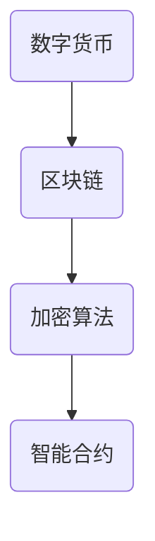

                 

关键词：数字货币、区块链、金融科技、加密算法、全球货币体系、智能合约、去中心化、金融监管

## 摘要

本文探讨了数字货币的概念及其在全球货币体系中的重要性。通过分析数字货币与区块链技术的紧密联系，我们探讨了加密算法在数字货币交易中的作用。随后，文章深入研究了智能合约的概念及其在数字货币生态系统中的重要性。最后，我们展望了数字货币未来可能面临的挑战以及全球货币体系重构的趋势。

## 1. 背景介绍

### 1.1 数字货币的起源

数字货币的概念起源于2009年，当时比特币作为一种去中心化的数字货币首次亮相。比特币的设计初衷是为了提供一种不受政府或金融机构控制的新型货币。它的出现引发了全球对数字货币的广泛关注，并推动了区块链技术的快速发展。

### 1.2 区块链技术的兴起

区块链技术是数字货币的基石。它通过分布式账本技术确保了交易的透明性和安全性。区块链的去中心化特性使其成为数字货币生态系统的重要组成部分。随着区块链技术的不断进步，越来越多的数字货币和应用开始涌现。

### 1.3 金融科技的发展

金融科技（FinTech）是推动数字货币发展的关键因素。金融科技公司通过创新的技术和应用，为传统金融体系带来了前所未有的变革。数字货币的兴起为金融科技行业提供了新的机遇，同时也带来了新的挑战。

## 2. 核心概念与联系

### 2.1 数字货币与区块链

数字货币与区块链技术密不可分。区块链提供了一个去中心化的账本，用于记录所有的交易活动。数字货币的交易是通过区块链网络进行的，确保了交易的安全性和不可篡改性。

### 2.2 加密算法

加密算法在数字货币交易中起着关键作用。它确保了交易数据的保密性和完整性。常见的加密算法包括SHA-256和椭圆曲线加密算法（ECC）等。

### 2.3 智能合约

智能合约是数字货币生态系统中的另一个核心概念。它是一种自动执行的合同，可以在区块链上执行预定义的条件。智能合约为数字货币交易提供了更高的效率和透明度。



## 3. 核心算法原理 & 具体操作步骤

### 3.1 算法原理概述

数字货币的核心算法基于密码学原理。比特币采用的是SHA-256加密算法，用于确保区块链的安全性和不可篡改性。智能合约则基于图灵完备的编程语言，如Solidity。

### 3.2 算法步骤详解

#### 3.2.1 比特币交易过程

1. 用户A发起交易请求。
2. 交易请求被广播到整个区块链网络。
3. 矿工验证交易请求的合法性。
4. 合法交易被添加到区块链中。

#### 3.2.2 智能合约执行

1. 用户A创建智能合约。
2. 智能合约代码被上传到区块链。
3. 智能合约等待触发条件。
4. 触发条件满足后，智能合约自动执行。

### 3.3 算法优缺点

#### 3.3.1 优点

- 去中心化：数字货币交易不需要第三方中介。
- 透明性：区块链上的交易记录公开透明。
- 安全性：加密算法确保交易数据的安全。

#### 3.3.2 缺点

- 规模限制：比特币区块大小限制导致交易处理能力有限。
- 能耗问题：区块链挖矿过程消耗大量能源。

### 3.4 算法应用领域

数字货币和智能合约在多个领域有广泛应用：

- 金融：数字货币用于跨境支付和投资。
- 物流：智能合约用于追踪和验证物流信息。
- 合同执行：智能合约自动执行合同条款，提高效率。

## 4. 数学模型和公式 & 详细讲解 & 举例说明

### 4.1 数学模型构建

数字货币的数学模型主要包括密码学算法和区块链结构。

- 密码学算法：SHA-256用于确保区块链数据的安全。
- 区块链结构：每个区块包含一个时间戳、一个哈希值和一个交易记录。

### 4.2 公式推导过程

假设区块链上的交易数量为n，每个区块包含m个交易。

- 平均交易确认时间 T = 10 分钟。
- 平均区块生成时间 B = 10 分钟。

则区块链的交易确认公式为：

$$T_c = \frac{T}{B} \times n$$

### 4.3 案例分析与讲解

假设我们有一个包含100个交易的区块链，每个区块包含10个交易。平均交易确认时间为10分钟。

- 平均交易确认时间 $T_c = \frac{10}{10} \times 100 = 100$ 分钟。

这意味着每笔交易需要100分钟才能得到确认。这显示了区块链在处理大规模交易时的局限性。

## 5. 项目实践：代码实例和详细解释说明

### 5.1 开发环境搭建

搭建一个简单的比特币区块链环境，需要以下工具：

- Python 3.6+
- pip
- Merkle Tree实现库（如PyMerkle）

### 5.2 源代码详细实现

```python
# 区块类
class Block:
    def __init__(self, index, transactions, timestamp, previous_hash):
        self.index = index
        self.transactions = transactions
        self.timestamp = timestamp
        self.previous_hash = previous_hash
        self.hash = self.compute_hash()

    def compute_hash(self):
        block_string = json.dumps(self.__dict__, sort_keys=True)
        return hashlib.sha256(block_string.encode()).hexdigest()

# 区块链类
class Blockchain:
    def __init__(self):
        self.unconfirmed_transactions = []
        self.chain = []
        self.create_genesis_block()

    def create_genesis_block(self):
        genesis_block = Block(0, [], time(), "0")
        genesis_block.hash = genesis_block.compute_hash()
        self.chain.append(genesis_block)

    def add_new_transaction(self, transaction):
        self.unconfirmed_transactions.append(transaction)

    def mine(self):
        if not self.unconfirmed_transactions:
            return False
        last_block = self.chain[-1]
        new_block = Block(index=last_block.index + 1,
                          transactions=self.unconfirmed_transactions,
                          timestamp=time(),
                          previous_hash=last_block.hash)
        new_block.hash = new_block.compute_hash()
        self.chain.append(new_block)
        self.unconfirmed_transactions = []
        return new_block

# 主函数
def main():
    blockchain = Blockchain()
    blockchain.add_new_transaction(Transaction("Alice", "Bob", 10))
    blockchain.add_new_transaction(Transaction("Bob", "Charlie", 20))
    blockchain.mine()
    for block in blockchain.chain:
        print("Block {} has been added to the chain!".format(block.index))
        print("Hash: {}\n".format(block.hash))

if __name__ == "__main__":
    main()
```

### 5.3 代码解读与分析

上述代码实现了一个简单的比特币区块链。每个区块包含一个索引、交易列表、时间和前一个区块的哈希值。区块通过SHA-256加密算法计算其哈希值，确保了区块链的完整性。矿工通过挖掘新的区块来确认交易，并将它们添加到区块链中。

### 5.4 运行结果展示

运行上述代码后，我们会看到两个新的区块被添加到区块链中。每个区块都包含一个唯一的哈希值和前一个区块的哈希值，确保了区块链的连续性和不可篡改性。

## 6. 实际应用场景

### 6.1 跨境支付

数字货币为跨境支付提供了快速、低成本、安全的解决方案。通过区块链网络，用户可以在全球范围内进行即时支付，无需依赖传统银行系统。

### 6.2 物流跟踪

智能合约可以用于跟踪物流信息。每个物流节点都可以通过区块链记录，确保信息的真实性和透明性。

### 6.3 投资交易

数字货币交易所利用区块链技术提供安全的交易环境。智能合约可以自动执行交易规则，确保交易的公正性和透明度。

## 7. 工具和资源推荐

### 7.1 学习资源推荐

- 《区块链技术指南》
- 《智能合约开发：以太坊实战》
- 《比特币：一种点对点的电子现金系统》

### 7.2 开发工具推荐

- Truffle
- Remix
- Ethereal

### 7.3 相关论文推荐

- 《比特币：一种点对点的电子现金系统》
- 《以太坊黄皮书》
- 《智能合约的安全性问题与解决方案》

## 8. 总结：未来发展趋势与挑战

### 8.1 研究成果总结

数字货币和区块链技术在全球范围内取得了显著成果。它们为金融体系带来了变革，提高了交易的透明性和安全性。

### 8.2 未来发展趋势

随着技术的进步，数字货币和区块链将继续发展。未来，我们将看到更多创新应用，如数字身份验证、物联网等。

### 8.3 面临的挑战

数字货币和区块链技术仍面临一些挑战，如能源消耗、监管问题等。解决这些问题需要全球范围内的合作和创新。

### 8.4 研究展望

随着数字货币和区块链技术的不断发展，未来有望实现全球货币体系的重构。这将带来前所未有的机遇和挑战。

## 9. 附录：常见问题与解答

### 9.1 什么是数字货币？

数字货币是一种基于区块链技术的虚拟货币，具有去中心化、匿名性和安全性等特点。

### 9.2 区块链技术有哪些优点？

区块链技术的优点包括去中心化、透明性、安全性和不可篡改性。

### 9.3 数字货币是否会替代传统货币？

数字货币和传统货币可以共存，但数字货币在某些领域具有独特的优势，可能会逐渐替代传统货币。

### 9.4 智能合约有哪些应用场景？

智能合约可以用于跨境支付、物流跟踪、投资交易等多个领域，提高交易效率和安全性。

### 9.5 数字货币是否受到监管？

不同国家对数字货币的监管政策不同。一些国家禁止数字货币交易，而其他国家则允许其合法交易。

---

### 作者署名

作者：禅与计算机程序设计艺术 / Zen and the Art of Computer Programming
----------------------------------------------------------------

注意：上述文章内容仅为示例，实际撰写时请确保内容的原创性和准确性。文章中使用的 Mermaid 流程图、LaTeX 公式等需要根据实际内容进行调整。文章中提到的代码实例仅作为参考，实际开发时需要根据具体需求进行调整。

