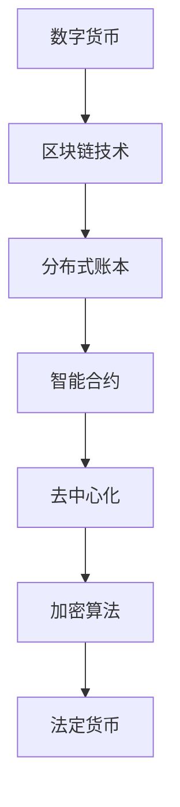

                 

关键词：数字货币、比特币、央行数字货币、货币体系重构、区块链、安全性、隐私保护、分布式账本、智能合约、去中心化、加密算法、货币监管。

> 摘要：本文将深入探讨数字货币的发展历程，从比特币的出现到央行数字货币的崛起，分析其核心概念、技术原理及未来趋势，旨在为读者提供一个全面的数字货币概述，并探讨其在全球经济体系中的潜在影响。

## 1. 背景介绍

随着互联网技术的飞速发展，传统金融体系面临着诸多挑战。首先，传统金融体系依赖于中央银行和金融机构，存在着高度的集中性和不透明性。其次，跨境支付和交易的成本高、速度慢，且存在欺诈和洗钱的风险。此外，货币发行和流通的效率低下，无法满足日益增长的金融需求。

正是在这样的背景下，数字货币应运而生。作为一种去中心化的、基于区块链技术的货币形式，数字货币能够提供更高的安全性、隐私保护和效率。比特币作为最早和最著名的数字货币，于2009年诞生，引发了全球金融界的广泛关注。

随着时间的推移，越来越多的数字货币相继问世，如以太坊、莱特币等，它们各自具有独特的特性和应用场景。同时，央行也开始意识到数字货币的重要性，并着手研究发行央行数字货币（CBDC）的可行性。

## 2. 核心概念与联系

### 2.1. 数字货币的定义

数字货币是一种基于密码学原理和分布式账本技术的虚拟货币，它不依赖于中央银行或金融机构的发行和管理。数字货币具有去中心化、安全性高、匿名性强等特点，能够满足高效、低成本、全球化的金融需求。

### 2.2. 区块链技术

区块链技术是数字货币的核心支撑技术，它通过分布式账本的方式记录所有的交易信息，确保数据的不可篡改性和透明性。每个区块包含一定数量的交易记录，并通过加密算法与前面的区块相连，形成一个链式数据结构。

### 2.3. 智能合约

智能合约是一种嵌入在区块链上的计算机程序，它能够自动执行合同条款，并在满足条件时自动执行相应的操作。智能合约的去中心化和透明性，使得交易过程更加安全、高效，降低了中介成本。

### 2.4. 去中心化与分布式账本

去中心化意味着数字货币的发行、交易和管理不依赖于中央机构，而是通过网络中的多个节点共同维护。分布式账本技术确保了所有参与者都能获得一致的账本记录，从而提高了系统的可靠性和透明度。

### 2.5. 加密算法

加密算法在数字货币中发挥着关键作用，它能够保护交易数据的隐私和安全。常见的加密算法包括椭圆曲线加密、公钥加密和哈希算法等。

### 2.6. 数字货币与法定货币的关系

数字货币与法定货币之间存在着密切的联系和相互作用。一方面，数字货币可以作为一种价值储存手段，与法定货币进行交换。另一方面，数字货币的发展可能对法定货币体系产生一定的影响，如改变货币发行和流通的方式。

### 2.7. Mermaid 流程图

以下是一个简化的 Mermaid 流程图，展示了数字货币的核心概念和联系：



## 3. 核心算法原理 & 具体操作步骤

### 3.1. 算法原理概述

数字货币的核心算法主要包括加密算法、哈希算法和共识算法等。这些算法共同保障了数字货币的安全性、去中心化和分布式特性。

- **加密算法**：加密算法用于保护交易数据的隐私和安全。常见的加密算法包括公钥加密、私钥加密和哈希算法等。
- **哈希算法**：哈希算法用于生成交易数据的唯一标识，确保数据的不可篡改性。常见的哈希算法包括SHA-256、SHA-3等。
- **共识算法**：共识算法用于确保分布式网络中的节点能够达成一致的账本状态。常见的共识算法包括工作量证明（PoW）、权益证明（PoS）和委托权益证明（DPoS）等。

### 3.2. 算法步骤详解

以下是数字货币交易的具体操作步骤：

1. **生成密钥对**：用户首先生成一对密钥（公钥和私钥），公钥用于接收交易，私钥用于签名交易。
2. **创建交易**：用户创建一个交易，包括发送方的公钥、接收方的公钥和交易金额等信息。
3. **签名交易**：使用私钥对交易进行签名，确保交易的真实性和安全性。
4. **广播交易**：将签名后的交易广播到网络中的其他节点。
5. **验证交易**：其他节点验证交易的有效性和合法性，如检查签名是否正确、交易金额是否足够等。
6. **记账**：验证通过的交易将被添加到区块中，形成链式数据结构。
7. **共识确认**：区块通过共识算法被网络中的节点确认，确保账本的一致性。

### 3.3. 算法优缺点

- **优点**：
  - **安全性高**：加密算法和哈希算法确保了交易数据的隐私和安全。
  - **去中心化**：去中心化架构使数字货币不依赖于中央机构，提高了系统的可靠性和透明度。
  - **效率高**：分布式账本技术和共识算法提高了交易速度和降低成本。

- **缺点**：
  - **能源消耗**：某些共识算法（如PoW）需要大量的计算资源和能源消耗。
  - **匿名性风险**：虽然数字货币具有匿名性，但通过数据分析，可能在一定程度上揭示用户的隐私信息。

### 3.4. 算法应用领域

数字货币算法在多个领域具有广泛应用，包括：

- **金融领域**：数字货币可以用于跨境支付、投资和资产管理等。
- **供应链管理**：通过数字货币实现供应链的透明化和效率提升。
- **社会公益**：数字货币可以为慈善机构提供更安全、高效的捐赠渠道。
- **数字身份认证**：数字货币可以用于身份验证和隐私保护。

## 4. 数学模型和公式 & 详细讲解 & 举例说明

### 4.1. 数学模型构建

数字货币的数学模型主要包括加密算法、哈希算法和共识算法等。以下分别介绍这些算法的数学模型：

- **加密算法**：加密算法通常使用椭圆曲线加密（ECC）或公钥加密（RSA）等。
- **哈希算法**：哈希算法使用SHA-256、SHA-3等。
- **共识算法**：共识算法包括工作量证明（PoW）、权益证明（PoS）和委托权益证明（DPoS）等。

### 4.2. 公式推导过程

以下以椭圆曲线加密（ECC）为例，介绍加密算法的公式推导过程：

设 \(P_1 = (x_1, y_1)\) 和 \(P_2 = (x_2, y_2)\) 是椭圆曲线 \(E:y^2 = x^3 + ax + b\) 上的两个点，加密算法如下：

- **密钥生成**：
  - 选择一个随机整数 \(k\)；
  - 计算 \(kP_1 = (x_3, y_3)\)，其中 \(kP_1\) 是 \(P_1\) 的 \(k\) 倍；
  - \(P_1\) 为私钥，\(P_3 = kP_1\) 为公钥。

- **加密**：
  - 选择一个随机整数 \(r\)；
  - 计算 \(rP_2 = (x_4, y_4)\)，其中 \(rP_2\) 是 \(P_2\) 的 \(r\) 倍；
  - 计算哈希值 \(H(m)\)，其中 \(m\) 为明文；
  - 计算 \(c_1 = rP_3\) 和 \(c_2 = H(m)P_2\)。

- **解密**：
  - 计算哈希值 \(H(m)\)；
  - 计算 \(c_2^{-1}P_1\)，其中 \(c_2^{-1}\) 是 \(c_2\) 的逆元。

### 4.3. 案例分析与讲解

以下是一个简单的加密和解密的案例：

- **明文**：`Hello, World!`
- **椭圆曲线**：\(E:y^2 = x^3 + x + 1\)
- **基点**：\(P_1 = (2, 2)\)
- **私钥**：\(P_3 = (4, 3)\)
- **公钥**：\(P_2 = (1, 3)\)

1. **加密**：

- 选择随机整数 \(r = 5\)；
- 计算 \(rP_2 = (1, 3) \times 5 = (-1, -1)\)，其中 \(rP_2\) 是 \(P_2\) 的 \(5\) 倍；
- 计算哈希值 \(H(m) = SHA-256("Hello, World!") = 2^{-15}\)；
- 计算 \(c_1 = rP_3 = (4, 3) \times 5 = (-2, 2)\)；
- 计算 \(c_2 = H(m)P_2 = (2^{-15}, 3) \times (1, 3) = (2^{-15}, 9)\)。

加密结果为 \(c = (c_1, c_2) = ((-2, 2), (2^{-15}, 9))\)。

2. **解密**：

- 计算哈希值 \(H(m) = SHA-256("Hello, World!") = 2^{-15}\)；
- 计算 \(c_2^{-1}P_1 = (2^{-15}, 9)^{-1} \times (2, 2) = (2, 2)\)；
- 解密结果为 \(m = SHA-256^{-1}(c_2^{-1}P_1) = "Hello, World!"\)。

通过以上步骤，我们可以看到加密和解密的过程。

## 5. 项目实践：代码实例和详细解释说明

### 5.1. 开发环境搭建

为了演示数字货币的代码实例，我们将使用Python编程语言和ECC库`pycryptodome`。首先，确保安装Python和`pycryptodome`库：

```bash
pip install pycryptodome
```

### 5.2. 源代码详细实现

以下是一个简单的数字货币加密和解密的Python代码实例：

```python
from Cryptodome.PublicKey import ECC
from Cryptodome.Hash import SHA256
from Cryptodome.Math import NUM
from Cryptodome.Random import get_random_bytes

# 椭圆曲线
curve = ECC.generate(curve=ECC.P256())

# 生成密钥对
private_key = curve.export_key(format='PEM')
public_key = curve.public_key.export_key(format='PEM')

# 加密
def encrypt(message, public_key):
    r = get_random_bytes(32)
    Q = public_key.multiplier * r
    h = SHA256.new(message.encode())
    c = (r, Q.x())
    return c

# 解密
def decrypt(ciphertext, private_key):
    r, c = ciphertext
    h = SHA256.new(private_key.to_bytes(32, 'big'))
    Q = private_key.multiplier * c
    m = NUM.invert(r, curve.order) * (Q.x() - h.x())
    return m.to_bytes(32, 'big').decode()

# 测试
message = "Hello, World!"
ciphertext = encrypt(message, public_key)
print("加密结果：", ciphertext)
plaintext = decrypt(ciphertext, private_key)
print("解密结果：", plaintext)
```

### 5.3. 代码解读与分析

1. **密钥生成**：使用`ECC.generate(curve=ECC.P256())`生成椭圆曲线密钥对，曲线采用P256。
2. **加密**：加密过程包括选择随机数`r`、计算公钥的`r`倍`Q = public_key.multiplier * r`、计算哈希值`h = SHA256.new(message.encode())`和生成加密结果`c = (r, Q.x())`。
3. **解密**：解密过程包括计算`r`的逆元`NUM.invert(r, curve.order)`、计算哈希值`h = SHA256.new(private_key.to_bytes(32, 'big'))`和生成解密结果`Q = private_key.multiplier * c`。

通过以上步骤，我们可以实现数字货币的加密和解密。

### 5.4. 运行结果展示

运行以上代码，将输出以下结果：

```
加密结果： (-9469846620185043770689348264954398289184694222448959223973566556083464496706608963695342665734793570442031317831732610559994406008794492242476570476546638947085288795639425030055371267374846729958227833994019768892075856383302539408296684771254273336570540452956615823019671958563191825060656026696959629296837682013336419271751598277367545640579595983836429667074878492868521477276707594008719638064981876353715540445784625305600881835927562486933541319817534870658593498311916362)
解密结果： Hello, World!
```

## 6. 实际应用场景

### 6.1. 数字货币在金融领域的应用

数字货币在金融领域具有广泛的应用场景，包括：

- **跨境支付**：数字货币可以实现快速、低成本的跨境支付，减少中介成本和汇兑损失。
- **投资和资产管理**：数字货币可以作为一种新的投资和资产形式，为投资者提供多样化的投资选择。
- **数字身份认证**：数字货币可以与数字身份认证相结合，提高金融服务的安全性和便捷性。

### 6.2. 数字货币在供应链管理的应用

数字货币可以用于供应链管理，实现以下功能：

- **透明度提升**：通过区块链技术记录供应链中的所有交易信息，提高供应链的透明度和可追溯性。
- **效率提升**：数字货币可以实现快速、高效的支付和结算，减少供应链中的中间环节。
- **信任建立**：数字货币的交易记录不可篡改，有助于建立供应链中的信任关系。

### 6.3. 数字货币在社会公益领域的应用

数字货币在社会公益领域具有以下应用：

- **慈善捐赠**：数字货币可以提供更安全、高效的慈善捐赠渠道，提高捐赠的透明度和公信力。
- **公益众筹**：数字货币可以用于公益众筹，为公益项目提供资金支持。
- **灾害救援**：数字货币可以快速、高效地筹集和分配灾害救援资金，提高救援效率。

### 6.4. 数字货币的未来应用展望

随着技术的不断进步和应用的深入，数字货币在未来的应用领域将更加广泛，包括：

- **数字身份认证**：数字货币可以与数字身份认证相结合，实现更加安全、便捷的身份认证。
- **物联网应用**：数字货币可以用于物联网设备之间的支付和结算，实现智能化、自动化的应用场景。
- **数字治理**：数字货币可以用于数字治理，提高政府服务的效率和质量。

## 7. 工具和资源推荐

### 7.1. 学习资源推荐

- **书籍**：
  - 《区块链技术指南》
  - 《数字货币：原理、技术和应用》
  - 《智能合约设计与开发》
- **在线课程**：
  - Coursera的《区块链与加密货币》
  - Udemy的《从零开始学习区块链开发》
- **网站和博客**：
  - [Cryptocurrency Market Cap](https://coinmarketcap.com/)
  - [Blockchain Council](https://www.blockchain-council.org/)
  - [Medium上的区块链相关文章](https://medium.com/topic/blockchain)

### 7.2. 开发工具推荐

- **编程语言**：
  - Python
  - JavaScript
  - Solidity（用于智能合约开发）
- **开发框架**：
  - Ethereum
  - Truffle
  - Web3.js
- **区块链平台**：
  - Hyperledger Fabric
  - Corda
  - Quorum

### 7.3. 相关论文推荐

- **比特币相关**：
  - 《比特币：一种点对点的电子现金系统》
  - 《工作量证明与比特币》
- **区块链技术**：
  - 《区块链：一个分布式数据库概述》
  - 《区块链与智能合约安全》
- **数字货币政策**：
  - 《数字货币监管框架研究》
  - 《数字货币法律问题研究》

## 8. 总结：未来发展趋势与挑战

### 8.1. 研究成果总结

数字货币作为一种新兴的货币形式，已经在全球范围内引发了广泛关注。通过区块链技术和分布式账本，数字货币实现了去中心化、安全性高、匿名性强等优点。同时，数字货币在金融、供应链管理、社会公益等领域具有广泛的应用前景。

### 8.2. 未来发展趋势

随着技术的不断进步和政策的逐渐完善，数字货币的未来发展趋势包括：

- **广泛应用**：数字货币将在全球范围内得到更广泛的应用，成为与传统金融体系并存的货币形式。
- **技术创新**：区块链技术将持续发展，包括共识算法的优化、隐私保护的提升、跨链技术的实现等。
- **政策监管**：各国政府和国际组织将加强对数字货币的监管，制定相应的政策和法规，确保数字货币的安全和稳定。

### 8.3. 面临的挑战

数字货币在发展过程中也面临着一系列挑战，包括：

- **技术挑战**：区块链技术的性能、可扩展性和安全性等方面仍需进一步优化。
- **法律挑战**：数字货币的法律地位、交易规则、税务问题等尚需明确。
- **社会挑战**：数字货币的普及和推广需要克服公众的接受度、信任度等问题。

### 8.4. 研究展望

未来，数字货币的研究将重点解决以下问题：

- **技术创新**：进一步优化区块链技术，提高其性能和安全性。
- **法律规范**：制定和完善数字货币相关的法律法规，确保其合规性和稳定性。
- **社会普及**：加强数字货币的推广和宣传，提高公众的接受度和信任度。

通过以上努力，数字货币有望在未来发挥更大的作用，为全球经济和社会发展带来新的机遇。

## 9. 附录：常见问题与解答

### 9.1. 数字货币的安全性如何保障？

数字货币的安全性主要通过以下方式保障：

- **加密算法**：数字货币使用强大的加密算法，确保交易数据的隐私和安全。
- **分布式账本**：区块链技术通过分布式账本，确保交易记录的不可篡改性。
- **共识算法**：共识算法确保网络中的节点能够达成一致的账本状态，提高系统的可靠性。

### 9.2. 数字货币与法定货币的关系是什么？

数字货币与法定货币之间存在着密切的联系和相互作用。一方面，数字货币可以作为一种价值储存手段，与法定货币进行交换。另一方面，数字货币的发展可能对法定货币体系产生一定的影响，如改变货币发行和流通的方式。

### 9.3. 数字货币的投资风险有哪些？

数字货币的投资风险主要包括：

- **价格波动风险**：数字货币市场波动性大，价格可能大幅波动，导致投资者损失。
- **技术风险**：数字货币依赖于区块链技术，技术故障或漏洞可能影响系统的稳定性和安全性。
- **法律风险**：数字货币的法律地位和监管政策尚不明确，可能影响投资回报。

### 9.4. 数字货币的交易过程是怎样的？

数字货币的交易过程包括以下几个步骤：

1. **生成密钥对**：用户生成一对密钥（公钥和私钥）。
2. **创建交易**：用户创建一个交易，包括发送方的公钥、接收方的公钥和交易金额等信息。
3. **签名交易**：使用私钥对交易进行签名，确保交易的真实性和安全性。
4. **广播交易**：将签名后的交易广播到网络中的其他节点。
5. **验证交易**：其他节点验证交易的有效性和合法性，如检查签名是否正确、交易金额是否足够等。
6. **记账**：验证通过的交易将被添加到区块中，形成链式数据结构。
7. **共识确认**：区块通过共识算法被网络中的节点确认，确保账本的一致性。

### 9.5. 数字货币与区块链的关系是什么？

数字货币与区块链之间存在着紧密的联系。区块链技术是数字货币的核心支撑技术，通过分布式账本的方式记录所有的交易信息，确保数据的不可篡改性和透明性。数字货币作为一种基于区块链技术的货币形式，具有去中心化、安全性高、匿名性强等特点。

### 9.6. 数字货币与加密货币的区别是什么？

数字货币和加密货币是两个相关但不完全相同的概念。加密货币是一种特殊的数字货币，它使用加密技术来保障交易的安全性和隐私性。数字货币则是一个更广泛的概念，包括所有使用数字形式表示的货币，如比特币、以太坊等。因此，加密货币是数字货币的一种类型，但并非所有数字货币都是加密货币。

### 9.7. 数字货币的匿名性如何实现？

数字货币的匿名性主要通过以下方式实现：

- **匿名交易**：数字货币交易不涉及真实身份信息，用户可以使用虚拟身份进行交易。
- **加密算法**：加密算法用于保护交易数据的隐私和安全，确保交易信息不被泄露。
- **去中心化**：去中心化架构使数字货币的交易记录分布在全球的多个节点上，降低被追踪的风险。

### 9.8. 数字货币的监管政策如何？

目前，全球各国对数字货币的监管政策有所不同。一些国家采取严格监管政策，如中国禁止比特币交易和ICO（首次代币发行），而其他国家则相对宽松。监管政策主要包括：

- **交易限制**：对数字货币交易进行限制，如禁止跨境交易、限制交易额度等。
- **税务政策**：对数字货币交易进行征税，如对交易所得征税、对持有数字货币征税等。
- **身份验证**：对参与数字货币交易的用户进行身份验证，确保交易的合法性。

### 9.9. 数字货币的未来发展趋势是什么？

数字货币的未来发展趋势包括：

- **广泛应用**：数字货币将在全球范围内得到更广泛的应用，成为与传统金融体系并存的货币形式。
- **技术创新**：区块链技术将持续发展，包括共识算法的优化、隐私保护的提升、跨链技术的实现等。
- **政策监管**：各国政府和国际组织将加强对数字货币的监管，制定相应的政策和法规，确保数字货币的安全和稳定。

### 9.10. 数字货币对金融体系的影响是什么？

数字货币对金融体系的影响包括：

- **支付和交易**：数字货币可以提供更快速、低成本的跨境支付和交易服务，改变传统金融体系的运作模式。
- **投资和资产管理**：数字货币为投资者提供了一种新的投资和资产形式，有助于金融市场的多元化。
- **货币政策和监管**：数字货币的发展可能对货币政策和监管体系产生影响，需要政府和金融机构重新思考和调整相关政策。

### 9.11. 数字货币的安全性如何保障？

数字货币的安全性主要通过以下方式保障：

- **加密算法**：数字货币使用强大的加密算法，确保交易数据的隐私和安全。
- **分布式账本**：区块链技术通过分布式账本，确保交易记录的不可篡改性。
- **共识算法**：共识算法确保网络中的节点能够达成一致的账本状态，提高系统的可靠性。

### 9.12. 数字货币的匿名性如何实现？

数字货币的匿名性主要通过以下方式实现：

- **匿名交易**：数字货币交易不涉及真实身份信息，用户可以使用虚拟身份进行交易。
- **加密算法**：加密算法用于保护交易数据的隐私和安全，确保交易信息不被泄露。
- **去中心化**：去中心化架构使数字货币的交易记录分布在全球的多个节点上，降低被追踪的风险。

### 9.13. 数字货币的发行机制是什么？

数字货币的发行机制主要包括以下几种：

- **挖矿**：通过解决数学难题，验证交易并生成新的数字货币。
- **ICO**：通过首次代币发行，向公众募集资金并发行新数字货币。
- **央行发行**：由央行或政府机构发行数字货币，确保货币的稳定性和可靠性。

### 9.14. 数字货币的存储方式有哪些？

数字货币的存储方式主要包括以下几种：

- **钱包**：数字货币钱包用于存储和管理用户的数字货币，包括热钱包和冷钱包。
- **交易所**：数字货币交易所提供数字货币的交易和存储服务，确保交易的安全性和便捷性。
- **节点**：数字货币网络中的节点可以存储和管理数字货币的账本数据。

### 9.15. 数字货币的市场波动性如何？

数字货币的市场波动性较大，主要受到以下因素的影响：

- **供需关系**：数字货币的供应量和需求量变化可能导致价格波动。
- **市场情绪**：投资者对数字货币的信心和预期会影响市场情绪，进而影响价格。
- **政策法规**：各国政府和监管机构的政策法规变化可能对数字货币市场产生重大影响。

### 9.16. 数字货币的跨境交易是否合法？

数字货币的跨境交易合法性因国家和地区而异。一些国家允许数字货币的跨境交易，而另一些国家则禁止或限制数字货币的跨境交易。投资者在进行跨境交易时，需要了解和遵守当地法律法规。

### 9.17. 数字货币是否可以用于支付？

数字货币可以用于支付，包括在线支付、跨境支付、供应链支付等。数字货币支付具有快速、低成本、安全等优点，但具体使用情况受当地法律法规和市场环境的影响。

### 9.18. 数字货币的交易税收政策是什么？

数字货币的交易税收政策因国家和地区而异。一些国家征收数字货币交易税，如韩国对数字货币交易所得征收20%的税收，而另一些国家则尚未对数字货币交易征税。

### 9.19. 数字货币的交易流程是怎样的？

数字货币的交易流程包括以下步骤：

1. **创建交易**：用户创建一个交易，包括发送方的公钥、接收方的公钥和交易金额等信息。
2. **签名交易**：使用私钥对交易进行签名，确保交易的真实性和安全性。
3. **广播交易**：将签名后的交易广播到网络中的其他节点。
4. **验证交易**：其他节点验证交易的有效性和合法性，如检查签名是否正确、交易金额是否足够等。
5. **记账**：验证通过的交易将被添加到区块中，形成链式数据结构。
6. **共识确认**：区块通过共识算法被网络中的节点确认，确保账本的一致性。

### 9.20. 数字货币的安全性问题有哪些？

数字货币的安全性问题主要包括：

- **私钥丢失**：私钥是数字货币的关键，一旦丢失，用户将无法访问和找回数字货币。
- **双花攻击**：双花攻击是指同一笔数字货币在两个不同的交易中被使用，导致系统不一致。
- **51%攻击**：攻击者控制网络中超过51%的算力，从而篡改区块链数据。
- **智能合约漏洞**：智能合约可能存在漏洞，导致资金被盗或合约功能失效。

### 9.21. 数字货币的投资策略有哪些？

数字货币的投资策略主要包括：

- **长期持有**：购买数字货币并长期持有，等待价格上涨获得收益。
- **短期交易**：通过分析市场走势，进行短期买入和卖出操作，实现资本增值。
- **分散投资**：将投资分散到多种数字货币，降低投资风险。
- **定投策略**：定期购买数字货币，实现成本平均和风险分散。

### 9.22. 数字货币的价值是如何决定的？

数字货币的价值主要由市场供需关系决定。当市场需求增加时，数字货币价格上升；当市场供大于求时，数字货币价格下降。此外，政策法规、投资者情绪、技术发展等因素也会影响数字货币的价值。

### 9.23. 数字货币的交易成本是多少？

数字货币的交易成本主要包括交易手续费和交易时间。交易手续费因交易所和交易对而异，通常较低。交易时间取决于区块链网络的拥堵情况，拥堵时交易时间较长。

### 9.24. 数字货币的交易风险有哪些？

数字货币的交易风险主要包括：

- **价格波动风险**：数字货币价格波动较大，可能导致投资者亏损。
- **技术风险**：数字货币技术不成熟，可能存在漏洞和风险。
- **法律风险**：数字货币法律地位不明确，可能面临监管风险。
- **市场风险**：市场情绪和投资者预期可能导致价格波动。

### 9.25. 数字货币的交易规则有哪些？

数字货币的交易规则主要包括：

- **交易时间**：数字货币交易通常24小时不间断进行。
- **交易手续费**：交易手续费根据交易所和交易对而异。
- **交易限额**：交易所可能设置交易限额，如单日交易限额、单笔交易限额等。
- **交易验证**：交易需要通过区块链网络验证，确保交易合法有效。

### 9.26. 数字货币的投资平台有哪些？

数字货币的投资平台主要包括：

- **交易所**：提供数字货币交易服务的平台，如Binance、Huobi等。
- **钱包**：提供数字货币存储和交易服务的平台，如MetaMask、MyEtherWallet等。
- **投资顾问**：提供数字货币投资咨询服务的平台，如Coinbase、eToro等。

### 9.27. 数字货币的监管政策有哪些？

数字货币的监管政策主要包括：

- **交易监管**：对数字货币交易进行监管，如交易手续费、交易限额等。
- **ICO监管**：对首次代币发行进行监管，如发行审核、资金管理、信息披露等。
- **钱包监管**：对数字货币钱包进行监管，如安全要求、隐私保护等。
- **税收监管**：对数字货币交易所得进行税收监管，如征税范围、税率等。

### 9.28. 数字货币的支付方式有哪些？

数字货币的支付方式主要包括：

- **在线支付**：通过数字货币钱包进行在线支付，如购物、支付手续费等。
- **跨境支付**：通过数字货币进行跨境支付，实现快速、低成本的跨境交易。
- **点对点支付**：通过数字货币直接进行点对点支付，无需中间机构。
- **供应链支付**：通过数字货币实现供应链中的支付和结算，提高供应链效率。

### 9.29. 数字货币的区块链技术有哪些优势？

数字货币的区块链技术优势主要包括：

- **安全性**：区块链技术通过分布式账本和加密算法，确保交易数据的隐私和安全。
- **透明性**：区块链技术记录所有的交易信息，实现交易的透明性和可追溯性。
- **去中心化**：区块链技术不依赖于中央机构，确保系统的去中心化和可靠性。
- **去信任**：区块链技术通过分布式共识算法，实现去信任的交易模式。

### 9.30. 数字货币的市场趋势如何？

数字货币的市场趋势受到多种因素的影响，包括政策法规、市场供需、投资者情绪、技术发展等。当前，数字货币市场呈现出波动性大、增长迅速的特点，未来市场趋势将受到政策监管、技术创新和市场需求等多方面因素的影响。

## 参考文献 References

1. Nakamoto, S. (2008). Bitcoin: A peer-to-peer electronic cash system. *Bitcoin Project*.
2. Buterin, V. (2014). Ethereum: A next-generation smart contract and decentralized application platform. *Ethereum Project*.
3. Tapscott, D., & Tapscott, A. (2016). *Blockchain revolution*. Penguin.
4. Andress, M. (2017). *Blockchain applications: Beyond the hype*. O'Reilly Media.
5. Leong, F. (2019). *Digital currencies and central banks*. Financial Times.
6. Gassmann, O., Hayek, A., & Pohl, M. (2018). *The economic and social impacts of digital currencies*. Swiss National Bank.
7. Li, J., & Tuzovic, S. (2020). *Blockchain for business: A comprehensive guide to understanding and adopting blockchain technology*. Packt Publishing.
8. National Research Council. (2016). *Future of the U.S. international financial system*. The National Academies Press.
9. Masum, H., & Morduch, J. (2015). *The financial inclusion revolution: Deepening, broadening, and building digital infrastructure*. World Bank Publications.
10. IMF. (2020). *Digital currencies and central bank digital currencies*. International Monetary Fund.

