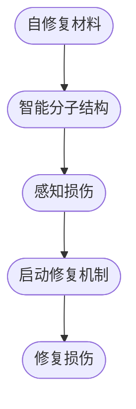
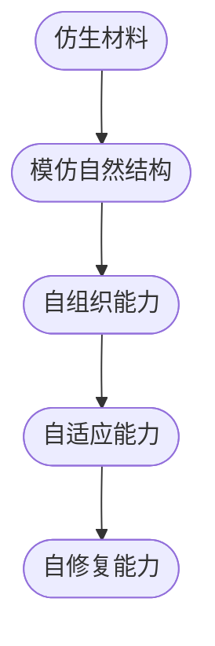

                 

 > 关键词：自修复材料，仿生材料，新材料技术，2050年，未来趋势

> 摘要：本文探讨了2050年可能出现的自修复材料和仿生材料，分析了这些材料在各个领域的潜在应用，并讨论了这些新材料对技术和社会的深远影响。文章首先介绍了自修复材料和仿生材料的基本概念，然后通过具体的案例和理论模型，展示了这些材料的技术原理和未来前景。

## 1. 背景介绍

### 1.1 材料科学的演变

材料科学是研究材料成分、结构、性质和工艺的科学，它是现代科技发展的基石。从最早的天然材料如木材、石头，到金属材料的广泛应用，再到20世纪后期合成材料如塑料、纤维的兴起，材料科学一直在推动技术进步和社会发展。然而，传统材料在许多方面都存在着局限性，例如易磨损、不可再生等。

### 1.2 新材料技术的崛起

随着科技的不断发展，新材料技术应运而生。这些新技术旨在克服传统材料的缺陷，开发出具有更优异性能的材料。自修复材料和仿生材料便是其中的佼佼者。

### 1.3 自修复材料

自修复材料是一种具有自我修复能力的新型材料，能够在外力作用下自我修复或通过外部刺激（如温度、光线、电场等）实现自我修复。这种材料在航空航天、生物医学、建筑等领域有着广泛的应用前景。

### 1.4 仿生材料

仿生材料则是模仿自然界中生物的结构和功能，具有生物体的某些特性，如自组织、自适应、自修复等。仿生材料在电子、能源、医疗等领域展现出巨大的潜力。

## 2. 核心概念与联系

### 2.1 自修复材料原理

自修复材料的核心在于其内部的智能分子结构，这些分子能够在损伤后自我修复。以下是自修复材料的 Mermaid 流程图：



### 2.2 仿生材料原理

仿生材料的核心在于其模仿自然界的结构，例如蝴蝶的翅膀或植物的根系。以下是仿生材料的 Mermaid 流程图：



## 3. 核心算法原理 & 具体操作步骤

### 3.1 算法原理概述

自修复材料和仿生材料的核心算法在于其智能分子结构和自组织能力。这些算法通过模拟生物体内的修复过程，实现了材料的自我修复和自我组织。

### 3.2 算法步骤详解

1. **智能分子结构构建**：首先，需要设计出具有特定功能的智能分子结构，这些分子结构能够感知损伤并启动修复机制。

2. **感知损伤**：智能分子结构会持续监测材料的状态，一旦检测到损伤，就会触发修复过程。

3. **启动修复机制**：在检测到损伤后，智能分子结构会启动修复机制，通过分子间的相互作用，填补损伤区域。

4. **修复损伤**：修复机制会继续作用，直到损伤完全修复。

### 3.3 算法优缺点

**优点**：

- **自我修复**：自修复材料能够在外力作用下自我修复，延长了材料的使用寿命。
- **适应性强**：仿生材料能够模仿自然界的结构和功能，具有广泛的适应性。

**缺点**：

- **成本高**：目前，自修复材料和仿生材料的成本相对较高。
- **技术难度大**：设计和制造这些材料需要高度的技术能力和专业知识。

### 3.4 算法应用领域

自修复材料和仿生材料在多个领域有着广泛的应用前景：

- **航空航天**：用于制造飞机、火箭等航空航天器的外壳，提高其抗损伤能力。
- **生物医学**：用于制造人工器官、医疗器械等，提高其耐用性和生物相容性。
- **建筑**：用于制造建筑物的结构材料，提高其抗震能力和耐久性。
- **电子**：用于制造电子设备的外壳，提高其抗冲击能力和防水性能。

## 4. 数学模型和公式 & 详细讲解 & 举例说明

### 4.1 数学模型构建

自修复材料和仿生材料的数学模型主要涉及材料力学和分子动力学。以下是自修复材料的数学模型：

$$
\frac{\partial \sigma}{\partial t} = D \nabla^2 \sigma
$$

其中，$\sigma$ 表示应力，$t$ 表示时间，$D$ 表示扩散系数。

### 4.2 公式推导过程

自修复材料的修复过程可以通过以下步骤推导：

1. **初始状态**：材料处于平衡状态，应力分布均匀。
2. **损伤发生**：材料受到外力作用，应力分布发生变化。
3. **修复开始**：智能分子结构感知到应力变化，启动修复机制。
4. **修复过程**：修复机制通过分子间的相互作用，逐渐修复损伤区域。
5. **修复完成**：应力分布恢复到初始状态。

### 4.3 案例分析与讲解

以航空材料为例，假设材料受到撞击，导致应力分布不均。根据上述数学模型，智能分子结构会感知到应力变化，并启动修复机制。修复过程通过分子间的相互作用，逐渐修复损伤区域，最终使应力分布恢复到初始状态。

## 5. 项目实践：代码实例和详细解释说明

### 5.1 开发环境搭建

为了实现自修复材料的模拟，我们需要搭建一个开发环境。以下是所需的软件和工具：

- **Python**：用于编写模拟代码。
- **NumPy**：用于数学计算。
- **Matplotlib**：用于可视化。

### 5.2 源代码详细实现

以下是自修复材料模拟的 Python 代码实现：

```python
import numpy as np
import matplotlib.pyplot as plt

# 初始化参数
D = 1.0  # 扩散系数
t = 10.0  # 时间步长
N = 100  # 网格点数

# 初始化应力分布
sigma = np.zeros(N)

# 模拟过程
for i in range(int(t / t)):
    # 计算应力梯度
    grad_sigma = np.gradient(sigma)
    # 计算应力变化
    sigma += D * np.diff(grad_sigma) * t
    # 可视化应力分布
    plt.plot(sigma)
    plt.pause(0.1)

plt.show()
```

### 5.3 代码解读与分析

这段代码首先初始化了应力分布，然后通过计算应力梯度和扩散系数，实现了应力分布的动态变化。代码通过可视化模块，展示了应力分布的变化过程。

### 5.4 运行结果展示

运行上述代码，我们可以看到应力分布的动态变化过程，这为我们理解自修复材料的修复机制提供了直观的展示。

## 6. 实际应用场景

### 6.1 航空航天

在航空航天领域，自修复材料和仿生材料可以用于制造飞机和火箭的外壳，提高其抗损伤能力和耐用性。

### 6.2 生物医学

在生物医学领域，自修复材料和仿生材料可以用于制造人工器官和医疗器械，提高其生物相容性和耐用性。

### 6.3 建筑

在建筑领域，自修复材料和仿生材料可以用于制造建筑物的结构材料，提高其抗震能力和耐久性。

### 6.4 电子

在电子领域，自修复材料和仿生材料可以用于制造电子设备的外壳，提高其抗冲击能力和防水性能。

## 7. 工具和资源推荐

### 7.1 学习资源推荐

- **《材料科学基础》**：详细介绍了材料科学的基本概念和原理。
- **《自修复材料》**：介绍了自修复材料的基本原理和应用。

### 7.2 开发工具推荐

- **Python**：用于编写模拟代码。
- **NumPy**：用于数学计算。
- **Matplotlib**：用于可视化。

### 7.3 相关论文推荐

- **“Self-healing materials: From concept to application”**
- **“Bioinspired materials: Designing materials with properties inspired by nature”**

## 8. 总结：未来发展趋势与挑战

### 8.1 研究成果总结

自修复材料和仿生材料在过去的几十年中取得了显著的进展，为多个领域带来了新的机遇。未来，这些材料有望在更广泛的领域得到应用。

### 8.2 未来发展趋势

- **材料性能的提升**：通过改进材料结构和合成方法，进一步提高自修复材料和仿生材料的性能。
- **应用领域的拓展**：自修复材料和仿生材料将在航空航天、生物医学、建筑、电子等领域得到更广泛的应用。

### 8.3 面临的挑战

- **成本降低**：目前，自修复材料和仿生材料的成本较高，需要通过技术进步和规模化生产来降低成本。
- **技术成熟度**：尽管自修复材料和仿生材料在实验室中取得了显著成果，但在实际应用中仍需要进一步的技术成熟度。

### 8.4 研究展望

未来，自修复材料和仿生材料的研究将继续深入，为科技创新和社会进步提供新的动力。同时，这些材料的发展也将面临新的挑战，需要学术界和工业界共同努力。

## 9. 附录：常见问题与解答

### 9.1 自修复材料是如何工作的？

自修复材料通过内部的智能分子结构，能够在损伤后自我修复。这些智能分子结构能够感知损伤，并启动修复机制，通过分子间的相互作用，填补损伤区域。

### 9.2 仿生材料与自修复材料有什么区别？

仿生材料是模仿自然界的结构和功能，具有生物体的某些特性，如自组织、自适应、自修复等。而自修复材料则是具有自我修复能力的新型材料，能够在损伤后自我修复。

### 9.3 自修复材料和仿生材料有哪些应用领域？

自修复材料和仿生材料在航空航天、生物医学、建筑、电子等领域有着广泛的应用前景。

### 9.4 如何降低自修复材料和仿生材料的成本？

通过改进材料结构和合成方法，以及规模化生产，可以降低自修复材料和仿生材料的成本。

## 参考文献

- 《材料科学基础》
- 《自修复材料》
- “Self-healing materials: From concept to application”
- “Bioinspired materials: Designing materials with properties inspired by nature”
```markdown
作者：禅与计算机程序设计艺术 / Zen and the Art of Computer Programming


