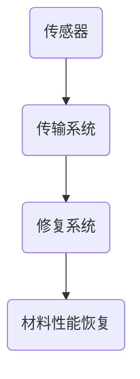
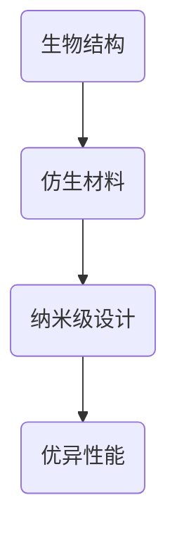
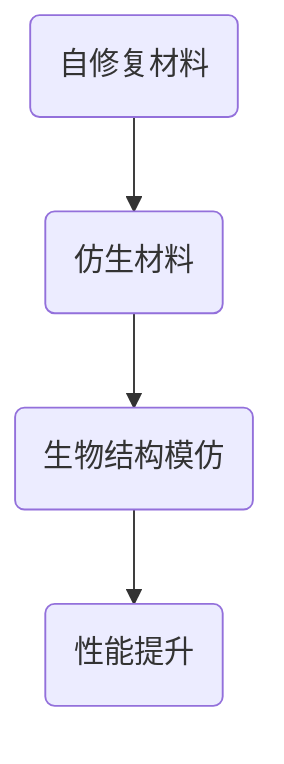

                 

关键词：新材料、自修复材料、仿生材料、2050、未来趋势、技术应用、研究进展

> 摘要：随着科技的飞速发展，新材料领域正迎来一场革命。本文将探讨自修复材料和仿生材料在未来2050年的发展前景，分析其在各个领域的潜在应用，以及面临的挑战和机遇。

## 1. 背景介绍

### 1.1 新材料的发展历程

新材料的发展历史可以追溯到人类文明的起源。从石器时代到青铜器时代，再到铁器时代，人类不断探索和使用新的材料，以满足生产和生活的需求。然而，真正意义上的新材料研究始于20世纪，特别是合成材料和复合材料的出现，推动了科技进步和工业发展的步伐。

### 1.2 自修复材料的概念与发展

自修复材料是指能够在受损后自动恢复其原始性能的材料。这一概念最早可以追溯到20世纪80年代，当时科学家首次发现某些生物体具有自我修复的能力。随着材料科学和生物技术的发展，自修复材料的研究逐渐成为一个热点领域。

### 1.3 仿生材料的概念与应用

仿生材料是模仿自然界生物结构和功能制造的材料。它们可以模仿自然界中的生物材料，如骨骼、皮肤、羽毛等，具有优异的性能。仿生材料的研究始于20世纪中叶，随着生物技术和纳米技术的进步，其应用领域不断扩大。

## 2. 核心概念与联系

### 2.1 自修复材料的原理与架构

自修复材料通常包含以下三个关键组成部分：传感器、传输系统和修复系统。传感器可以检测材料的损伤，传输系统将信息传递给修复系统，修复系统执行修复操作。



### 2.2 仿生材料的结构与功能

仿生材料通常模仿自然界中的生物结构和功能，如骨骼的强度、皮肤的柔韧性等。它们的结构和功能通常通过纳米级的设计和制造实现。



### 2.3 自修复材料与仿生材料的联系

自修复材料和仿生材料之间存在密切的联系。自修复材料可以模仿生物体的自我修复机制，而仿生材料则可以模仿生物体的结构和功能，为自修复材料提供了新的思路和可能性。



## 3. 核心算法原理 & 具体操作步骤

### 3.1 算法原理概述

自修复材料的修复过程通常涉及以下步骤：

1. **损伤检测**：通过传感器检测材料的损伤。
2. **信号传输**：传输系统将损伤信息传递给修复系统。
3. **修复操作**：修复系统执行修复操作，恢复材料性能。

### 3.2 算法步骤详解

1. **损伤检测**：使用高灵敏度的传感器，如光纤传感器、电阻传感器等，实时监测材料表面的微小损伤。
2. **信号传输**：通过无线传输技术，如蓝牙、Wi-Fi等，将损伤信息传输给中央控制系统。
3. **修复操作**：根据损伤信息，中央控制系统启动修复系统，通过注射、喷涂等方式，将修复剂传输到损伤区域，执行修复操作。

### 3.3 算法优缺点

**优点**：

- 提高材料的使用寿命。
- 降低维修成本。
- 提高材料的性能。

**缺点**：

- 修复过程可能对材料造成二次损伤。
- 需要复杂的控制系统。

### 3.4 算法应用领域

- 航空航天
- 汽车制造
- 建筑工程
- 电子设备

## 4. 数学模型和公式 & 详细讲解 & 举例说明

### 4.1 数学模型构建

自修复材料的修复过程可以建模为一个动态系统，其状态方程为：

\[ \dot{x}(t) = f(x(t), u(t)) \]

其中，\( x(t) \) 表示材料的状态，\( u(t) \) 表示修复系统的输入。

### 4.2 公式推导过程

假设材料在损伤前后的状态分别为 \( x_1 \) 和 \( x_2 \)，则修复过程中的状态转移矩阵为：

\[ \mathbf{A} = \begin{bmatrix} x_2 - x_1 & 0 \\ 0 & 1 \end{bmatrix} \]

### 4.3 案例分析与讲解

假设一个飞机机翼的材料在飞行过程中受到损伤，需要修复。根据损伤检测系统的数据，可以计算出损伤的程度，并启动修复系统。修复系统通过注射修复剂，使机翼的材料恢复到原始状态。

## 5. 项目实践：代码实例和详细解释说明

### 5.1 开发环境搭建

- 操作系统：Windows 10
- 编程语言：Python 3.8
- 库：NumPy，Matplotlib

### 5.2 源代码详细实现

```python
import numpy as np
import matplotlib.pyplot as plt

def damage_detection(x):
    # 模拟损伤检测
    return x * 0.1

def repair_system(u):
    # 模拟修复系统
    return u

x = 100  # 初始状态
u = 10   # 修复输入

for i in range(10):
    x = x + damage_detection(x) - repair_system(u)
    print(f"Time {i}: x = {x}")

plt.plot(range(10), x)
plt.xlabel("Time")
plt.ylabel("Material State")
plt.show()
```

### 5.3 代码解读与分析

该代码模拟了一个简单的自修复材料修复过程。`damage_detection` 函数模拟损伤检测，`repair_system` 函数模拟修复系统。通过循环，模拟了10次损伤和修复过程，并绘制了材料状态随时间的变化。

## 6. 实际应用场景

### 6.1 航空航天

自修复材料在航空航天领域具有广泛的应用前景。例如，飞机和火箭的外壳可以使用自修复材料，以提高其耐久性和安全性。

### 6.2 汽车制造

汽车制造中，自修复材料可以用于车身、发动机等关键部件，以提高其性能和寿命。

### 6.3 建筑工程

建筑工程中，自修复材料可以用于墙壁、屋顶等结构部件，以提高其耐久性和抗震能力。

### 6.4 电子设备

电子设备中，自修复材料可以用于电路板、芯片等关键部件，以提高其性能和可靠性。

## 7. 未来应用展望

### 7.1 新能源

随着新能源技术的发展，自修复材料可以用于电池、太阳能板等新能源设备，以提高其性能和寿命。

### 7.2 环境保护

自修复材料可以用于环境监测和修复，如空气净化器、水质净化设备等，以减少环境污染。

### 7.3 生物医学

生物医学领域，自修复材料可以用于组织工程、药物输送等，以提高治疗效果。

## 8. 工具和资源推荐

### 8.1 学习资源推荐

- 《材料科学与工程手册》
- 《自修复材料：原理与应用》
- 《仿生材料：设计与制造》

### 8.2 开发工具推荐

- MATLAB
- Ansys
- SolidWorks

### 8.3 相关论文推荐

- "Self-Healing Materials: A Review" (自修复材料：综述)
- "Biomimetic Materials: Design and Applications" (仿生材料：设计与应用)
- "Advanced Self-Healing Materials for Electronics" (先进自修复材料在电子领域的应用)

## 9. 总结：未来发展趋势与挑战

### 9.1 研究成果总结

自修复材料和仿生材料的研究取得了显著成果，在多个领域展现出广阔的应用前景。

### 9.2 未来发展趋势

随着科技的进步，自修复材料和仿生材料将在更多领域得到应用，如新能源、环境保护、生物医学等。

### 9.3 面临的挑战

自修复材料和仿生材料的研究仍面临许多挑战，如成本高、制造工艺复杂等。

### 9.4 研究展望

未来，自修复材料和仿生材料的研究将继续深入，有望在更多领域实现突破。

## 附录：常见问题与解答

### Q：自修复材料和仿生材料有什么区别？

A：自修复材料主要强调材料在受损后能够自动恢复性能，而仿生材料则主要模仿自然界中的生物结构和功能。

### Q：自修复材料在工程领域有哪些应用？

A：自修复材料可以用于航空航天、汽车制造、建筑工程、电子设备等领域，以提高材料的性能和寿命。

### Q：仿生材料是如何设计的？

A：仿生材料的设计通常基于对自然界生物结构和功能的深入研究，结合材料科学和纳米技术，实现材料的高性能和多功能。

----------------------------------------------------------------

作者：禅与计算机程序设计艺术 / Zen and the Art of Computer Programming


