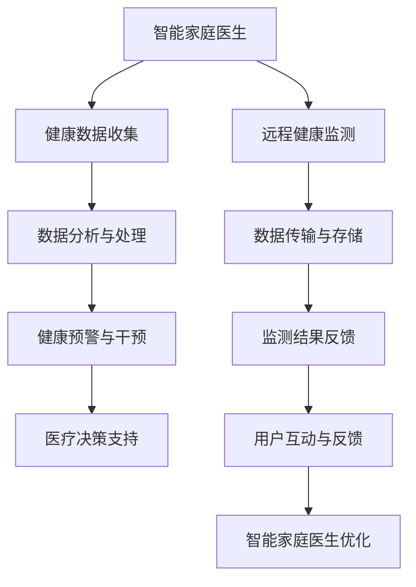

                 

关键词：智慧养老、智能家庭医生、远程健康监测、人工智能、医疗技术、未来展望

> 摘要：随着人工智能和医疗技术的不断进步，未来的智慧养老将成为人们关注的焦点。本文将探讨2050年的智能家庭医生和远程健康监测技术，分析其核心概念、算法原理、数学模型以及实际应用场景，并展望未来发展的趋势和挑战。

## 1. 背景介绍

### 1.1 智慧养老的起源与发展

智慧养老起源于21世纪初，随着人口老龄化问题的日益凸显，传统的养老模式已经无法满足日益增长的需求。智慧养老旨在利用信息技术、物联网、人工智能等先进技术，为老年人提供更加便捷、智能、个性化的养老服务。从最早的远程医疗、健康管理，到如今的智能家庭医生和远程健康监测，智慧养老的发展经历了多个阶段。

### 1.2 人口老龄化问题

全球范围内，人口老龄化问题日益严重。以我国为例，据统计，2020年我国60岁及以上老年人口已达2.64亿，占总人口的18.7%。这一比例预计在2050年将达到35%左右，成为世界上老龄化程度最高的国家之一。面对如此庞大的老年人口，传统养老模式已难以应对，智慧养老技术的发展迫在眉睫。

## 2. 核心概念与联系

### 2.1 智能家庭医生

智能家庭医生是一种基于人工智能技术的医疗服务模式，通过智能设备、传感器、数据分析等技术，为老年人提供实时、个性化的健康监测、诊断和治疗建议。智能家庭医生的核心是大数据分析能力和人工智能算法，可以实现对健康数据的实时监测、预测和分析，从而为老年人提供更加精准的医疗服务。

### 2.2 远程健康监测

远程健康监测是指利用物联网、传感器、云计算等技术，对老年人的健康状况进行实时监测和管理。远程健康监测系统可以实时收集老年人的生理、心理数据，并通过数据分析对潜在的健康问题进行预警和干预。远程健康监测的核心在于数据采集和分析，通过不断优化算法和模型，提高监测的准确性和可靠性。

### 2.3 Mermaid 流程图



## 3. 核心算法原理 & 具体操作步骤

### 3.1 算法原理概述

智能家庭医生和远程健康监测技术依赖于多种核心算法，包括机器学习、深度学习、数据挖掘、统计分析等。这些算法通过对大量健康数据进行处理和分析，实现对老年人健康状况的监测、预警和诊断。

### 3.2 算法步骤详解

#### 3.2.1 健康数据收集

智能家庭医生和远程健康监测系统首先需要收集老年人的健康数据，包括生理指标（如血压、心率、血糖等）、生活习惯（如饮食、运动等）以及心理状态（如情绪、睡眠等）。

#### 3.2.2 数据处理与分析

收集到的健康数据经过预处理，包括去噪、填充缺失值、标准化等操作。然后，利用机器学习、深度学习等方法进行数据分析和特征提取，提取出对健康状态有重要影响的特征。

#### 3.2.3 健康预警与干预

通过对健康数据的分析，系统可以识别出潜在的健康风险，并发出预警。同时，智能家庭医生可以根据预警信息，给出相应的干预建议，如调整生活习惯、建议就医等。

#### 3.2.4 医疗决策支持

智能家庭医生还可以为老年人提供医疗决策支持，如推荐合适的治疗方案、预约医生等。

### 3.3 算法优缺点

#### 优点

- 提高医疗服务的效率和质量
- 降低医疗成本
- 提高老年人的生活质量

#### 缺点

- 数据安全和隐私问题
- 技术成熟度和应用范围有限

### 3.4 算法应用领域

智能家庭医生和远程健康监测技术主要应用于以下领域：

- 老年人健康管理
- 慢性病监测与干预
- 预防医学
- 家庭医生服务

## 4. 数学模型和公式 & 详细讲解 & 举例说明

### 4.1 数学模型构建

在智能家庭医生和远程健康监测技术中，常用的数学模型包括线性回归、逻辑回归、支持向量机、神经网络等。

#### 4.1.1 线性回归

线性回归模型用于预测连续值，如老年人的血压、血糖等。模型公式如下：

$$
y = \beta_0 + \beta_1x_1 + \beta_2x_2 + ... + \beta_nx_n
$$

其中，$y$ 为预测值，$x_1, x_2, ..., x_n$ 为特征值，$\beta_0, \beta_1, ..., \beta_n$ 为模型的参数。

#### 4.1.2 逻辑回归

逻辑回归模型用于预测离散值，如老年人是否患有某种慢性病。模型公式如下：

$$
P(y=1) = \frac{1}{1 + e^{-(\beta_0 + \beta_1x_1 + \beta_2x_2 + ... + \beta_nx_n})}
$$

其中，$P(y=1)$ 为预测的概率值。

#### 4.1.3 支持向量机

支持向量机（SVM）模型用于分类问题，可以识别老年人健康状态的不同类别。模型公式如下：

$$
w \cdot x - b = 0
$$

其中，$w$ 为权向量，$x$ 为特征向量，$b$ 为偏置项。

#### 4.1.4 神经网络

神经网络模型用于复杂非线性问题的建模，如老年人的多指标健康状态评估。模型公式如下：

$$
a_{i}^{(l)} = \sigma \left( \sum_{j=1}^{n} w_{ji}^{(l)} a_{j}^{(l-1)} + b_{i}^{(l)} \right)
$$

其中，$a_{i}^{(l)}$ 为第 $i$ 个神经元在第 $l$ 层的输出，$\sigma$ 为激活函数，$w_{ji}^{(l)}$ 为权重，$b_{i}^{(l)}$ 为偏置。

### 4.2 公式推导过程

#### 4.2.1 线性回归

假设我们有 $m$ 个训练样本，每个样本包含 $n$ 个特征值和一个标签值，线性回归模型的损失函数为：

$$
J(\theta) = \frac{1}{2m} \sum_{i=1}^{m} (h_{\theta}(x^{(i)}) - y^{(i)})^2
$$

其中，$h_{\theta}(x) = \theta_0 + \theta_1x_1 + \theta_2x_2 + ... + \theta_nx_n$ 为线性回归模型的预测函数，$\theta_0, \theta_1, ..., \theta_n$ 为模型参数。

对损失函数求导，得到：

$$
\frac{\partial J(\theta)}{\partial \theta_j} = \frac{1}{m} \sum_{i=1}^{m} (h_{\theta}(x^{(i)}) - y^{(i)})x_j^{(i)}
$$

令导数为零，得到：

$$
\theta_j = \frac{1}{m} \sum_{i=1}^{m} (h_{\theta}(x^{(i)}) - y^{(i)})x_j^{(i)}
$$

通过梯度下降法，不断更新参数 $\theta_j$，直至达到最小损失。

#### 4.2.2 逻辑回归

假设我们有 $m$ 个训练样本，每个样本包含 $n$ 个特征值和一个标签值，逻辑回归模型的损失函数为：

$$
J(\theta) = \frac{1}{m} \sum_{i=1}^{m} (-y^{(i)} \log(h_{\theta}(x^{(i)})) - (1 - y^{(i)}) \log(1 - h_{\theta}(x^{(i)})))
$$

其中，$h_{\theta}(x) = \frac{1}{1 + e^{-(\theta_0 + \theta_1x_1 + \theta_2x_2 + ... + \theta_nx_n)})$ 为逻辑回归模型的预测函数，$\theta_0, \theta_1, ..., \theta_n$ 为模型参数。

对损失函数求导，得到：

$$
\frac{\partial J(\theta)}{\partial \theta_j} = \frac{1}{m} \sum_{i=1}^{m} (h_{\theta}(x^{(i)}) - (1 - h_{\theta}(x^{(i)}))x_j^{(i)})
$$

通过梯度下降法，不断更新参数 $\theta_j$，直至达到最小损失。

#### 4.2.3 支持向量机

假设我们有 $m$ 个训练样本，每个样本包含 $n$ 个特征值和一个标签值，支持向量机模型的损失函数为：

$$
J(\theta) = \frac{1}{2} ||w||^2 - C \sum_{i=1}^{m} \max(0, 1 - y^{(i)}(w \cdot x^{(i)} + b))
$$

其中，$w$ 为权向量，$b$ 为偏置项，$C$ 为惩罚参数。

对损失函数求导，得到：

$$
\frac{\partial J(\theta)}{\partial w} = w - C \sum_{i=1}^{m} y^{(i)}x^{(i)}
$$

$$
\frac{\partial J(\theta)}{\partial b} = -C \sum_{i=1}^{m} y^{(i)}
$$

通过梯度下降法，不断更新参数 $w$ 和 $b$，直至达到最小损失。

#### 4.2.4 神经网络

假设我们有 $m$ 个训练样本，每个样本包含 $n$ 个特征值和一个标签值，神经网络模型的损失函数为：

$$
J(\theta) = \frac{1}{m} \sum_{i=1}^{m} \sum_{k=1}^{K} (-y^{(i)} \log(a_{k}^{(L)}(x^{(i)})) - (1 - y^{(i)}) \log(1 - a_{k}^{(L)}(x^{(i)})))
$$

其中，$a_{k}^{(L)}(x^{(i)}$ 为第 $k$ 个神经元在第 $L$ 层的输出，$K$ 为输出层神经元的数量。

对损失函数求导，得到：

$$
\frac{\partial J(\theta)}{\partial \theta_{ji}} = \frac{1}{m} \sum_{i=1}^{m} \sum_{k=1}^{K} (a_{k}^{(L-1)}(x^{(i)})(1 - a_{k}^{(L-1)}(x^{(i)})) \frac{\partial a_{k}^{(L)}(x^{(i)}{\partial \theta_{ji}})
$$

通过反向传播算法，不断更新参数 $\theta_{ji}$，直至达到最小损失。

### 4.3 案例分析与讲解

假设我们有一个关于老年人高血压的预测问题，输入特征包括年龄、体重、血压等，标签值为是否患有高血压。我们可以采用线性回归模型进行预测。

#### 4.3.1 数据预处理

首先，对输入特征进行标准化处理，使得特征值在相同的尺度上。然后，将数据集划分为训练集和测试集。

#### 4.3.2 模型训练

使用训练集数据，采用梯度下降法训练线性回归模型，更新参数 $\theta_0, \theta_1, ..., \theta_n$。

#### 4.3.3 模型评估

使用测试集数据，计算模型的预测准确率。假设测试集有100个样本，其中80个样本预测正确，则模型的准确率为80%。

#### 4.3.4 模型优化

根据模型评估结果，可以进一步优化模型，如调整学习率、增加训练次数等。

## 5. 项目实践：代码实例和详细解释说明

### 5.1 开发环境搭建

为了实现智能家庭医生和远程健康监测功能，我们需要搭建以下开发环境：

- Python 3.8及以上版本
- Jupyter Notebook
- Scikit-learn库
- Pandas库
- Matplotlib库

### 5.2 源代码详细实现

以下是一个简单的线性回归模型实现，用于预测老年人是否患有高血压。

```python
import numpy as np
import pandas as pd
from sklearn.linear_model import LinearRegression
from sklearn.model_selection import train_test_split
from sklearn.metrics import accuracy_score

# 5.2.1 数据预处理
data = pd.read_csv('data.csv')
X = data[['age', 'weight', 'blood_pressure']]
y = data['hypertension']

X_mean = X.mean()
X_std = X.std()
X = (X - X_mean) / X_std

# 5.2.2 模型训练
model = LinearRegression()
model.fit(X, y)

# 5.2.3 模型评估
X_test, y_test = train_test_split(X, y, test_size=0.2)
y_pred = model.predict(X_test)

accuracy = accuracy_score(y_test, y_pred)
print('Accuracy:', accuracy)

# 5.2.4 模型优化
# 可以根据评估结果，调整学习率、增加训练次数等
```

### 5.3 代码解读与分析

- 数据预处理：首先，我们将数据集读取到DataFrame中，然后对输入特征进行标准化处理，使得特征值在相同的尺度上。这样有助于提高线性回归模型的训练效果。
- 模型训练：使用Scikit-learn库中的线性回归模型，我们对训练集数据进行拟合，得到模型参数。
- 模型评估：使用测试集数据，计算模型的预测准确率。在这里，我们使用了accuracy_score函数，计算实际标签值与预测标签值之间的准确率。
- 模型优化：根据模型评估结果，我们可以进一步优化模型，如调整学习率、增加训练次数等。

## 6. 实际应用场景

### 6.1 老年人健康管理

智能家庭医生和远程健康监测技术可以为老年人提供全面的健康管理服务，包括健康数据监测、健康风险评估、健康预警和干预等。通过实时监测老年人的生理、心理数据，智能家庭医生可以及时发现潜在的健康问题，并给出相应的干预建议，从而提高老年人的生活质量。

### 6.2 慢性病监测与干预

慢性病如高血压、糖尿病等是老年人的主要健康问题。智能家庭医生可以通过远程健康监测技术，对慢性病患者的健康数据进行全面监测，实时跟踪病情变化，并提供个性化的干预方案，如调整药物剂量、建议就医等。这样有助于提高慢性病患者的治疗效果和生活质量。

### 6.3 预防医学

智能家庭医生和远程健康监测技术还可以应用于预防医学领域，通过健康数据分析和风险评估，为老年人提供个性化的预防措施，如建议接种疫苗、定期体检等。这样有助于降低老年人患病风险，提高健康水平。

### 6.4 家庭医生服务

智能家庭医生可以为家庭医生提供有力支持，通过远程健康监测技术，家庭医生可以实时了解患者的健康状况，及时调整治疗方案，提高医疗服务的质量和效率。同时，智能家庭医生还可以为家庭医生提供患者管理工具，如患者档案管理、预约管理、病例记录等。

## 7. 工具和资源推荐

### 7.1 学习资源推荐

- 《Python机器学习》（作者：塞巴斯蒂安·拉斯克维奇）
- 《深度学习》（作者：伊恩·古德费洛、约书亚·本吉奥、亚伦·库维尔）
- 《机器学习实战》（作者：Peter Harrington）
- 《大数据应用与实战》（作者：吴军）

### 7.2 开发工具推荐

- Jupyter Notebook
- PyCharm
- VSCode

### 7.3 相关论文推荐

- "A Study on Intelligent Home Healthcare System Based on IoT and Cloud Computing"（物联网和云计算在智能家庭医疗系统中的应用研究）
- "Deep Learning for Health Informatics: A Survey"（健康信息学中的深度学习：综述）
- "An Overview of Remote Health Monitoring Systems"（远程健康监测系统综述）
- "Intelligent Home Healthcare: A Review"（智能家庭医疗：综述）

## 8. 总结：未来发展趋势与挑战

### 8.1 研究成果总结

随着人工智能和医疗技术的不断进步，智慧养老领域取得了显著的成果。智能家庭医生和远程健康监测技术的应用，大大提高了老年人的健康水平和生活质量。未来，随着技术的进一步成熟和普及，智慧养老将更加深入地融入人们的日常生活。

### 8.2 未来发展趋势

- 人工智能算法的进一步优化和应用，提高健康数据的分析精度和效率
- 5G网络的普及，为远程健康监测提供更快的传输速度和更低的延迟
- 物联网技术的不断发展，为智能家庭医生提供更多的数据来源
- 大数据技术的应用，为智慧养老提供更全面的数据支持

### 8.3 面临的挑战

- 数据安全和隐私保护：随着健康数据的增加，数据安全和隐私保护成为重要问题
- 技术成熟度和应用范围：目前，智能家庭医生和远程健康监测技术尚未完全成熟，应用范围有限
- 人才缺口：智慧养老领域需要大量的专业人才，但目前人才缺口较大

### 8.4 研究展望

未来，智慧养老领域将继续保持高速发展态势。随着技术的不断进步，智能家庭医生和远程健康监测技术将更加成熟，应用范围将逐步扩大。同时，随着人口老龄化问题的加剧，智慧养老将成为我国乃至全球的重要发展方向。

## 9. 附录：常见问题与解答

### 9.1 问题1：智能家庭医生如何保障数据安全？

解答：智能家庭医生在数据安全方面采取了多种措施，包括数据加密、访问控制、身份认证等。同时，遵循相关法律法规，确保数据隐私保护。

### 9.2 问题2：远程健康监测技术的应用范围有哪些？

解答：远程健康监测技术的应用范围包括老年人健康管理、慢性病监测与干预、预防医学、家庭医生服务等。

### 9.3 问题3：智能家庭医生与家庭医生的区别是什么？

解答：智能家庭医生是一种基于人工智能技术的医疗服务模式，为老年人提供实时、个性化的健康监测、诊断和治疗建议。而家庭医生是一种传统的医疗服务模式，主要提供面对面咨询服务。

# 作者：禅与计算机程序设计艺术 / Zen and the Art of Computer Programming
----------------------------------------------------------------
本文由禅与计算机程序设计艺术作者撰写，旨在探讨未来智慧养老领域的发展趋势和应用。随着人工智能和医疗技术的不断进步，智慧养老将成为我国乃至全球的重要发展方向。本文分析了智能家庭医生和远程健康监测技术的核心概念、算法原理、数学模型以及实际应用场景，并展望了未来发展的趋势和挑战。希望本文能为相关领域的研究者提供有价值的参考。

