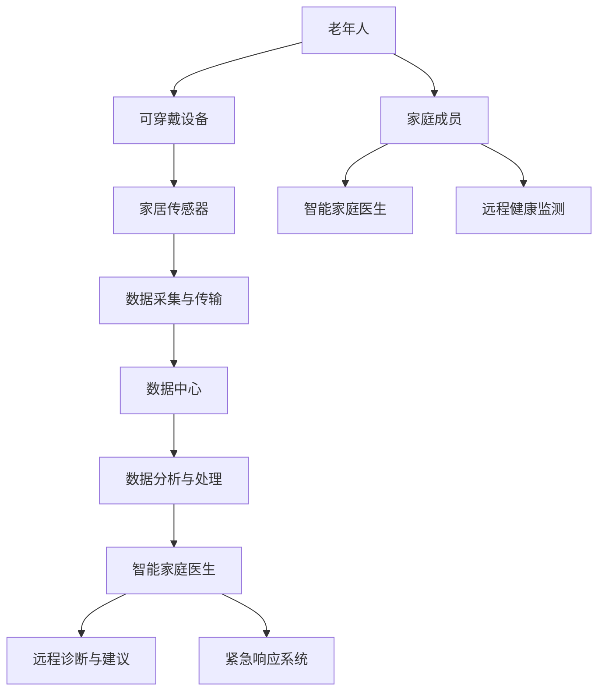

                 

关键词：智慧养老、智能家庭医生、远程健康监测、AI技术、智能家居、医疗信息化

> 摘要：随着全球人口老龄化趋势加剧，传统的养老模式正逐渐显现出其局限性。未来，智慧养老将成为解决这一问题的有力工具。本文将探讨2050年的智慧养老场景，特别是智能家庭医生与远程健康监测技术的发展，预测其对我们生活的影响，并分析其中的机遇与挑战。

## 1. 背景介绍

### 人口老龄化趋势

人口老龄化是全球面临的一个严峻问题。根据联合国的预测，到2050年，全球60岁及以上人口将达到21亿，占全球总人口的22%。这一趋势对医疗、社会福利、劳动力市场等多个领域都带来了深远的影响。智慧养老技术的兴起，旨在为这一庞大的老年人口提供更加高效、便捷、个性化的养老服务。

### 智慧养老的定义与发展

智慧养老，是指通过现代信息技术，尤其是人工智能、物联网、大数据等技术手段，构建一个全方位、全周期的养老服务系统。它不仅涵盖了传统养老服务的内容，如日常生活照顾、健康监测、紧急救助等，还增加了个性化的健康管理和预防干预等功能。

智慧养老的发展可以分为三个阶段：

1. **信息化阶段**：以医疗信息化为基础，通过电子病历、健康档案等手段，提高医疗服务的效率和准确性。
2. **智能化阶段**：通过引入人工智能、物联网等技术，实现远程健康监测、智能诊断和个性化健康管理等。
3. **智慧化阶段**：通过深度学习、大数据分析等先进技术，实现个性化、精准化的健康管理和预测。

## 2. 核心概念与联系

### 智能家庭医生

智能家庭医生是指通过人工智能技术，为居家老年人提供实时、连续的健康监测、诊断、治疗建议和健康管理等服务的系统。智能家庭医生的核心概念包括：

- **健康数据采集**：通过可穿戴设备、家居传感器等，实时采集老年人的健康数据，如心率、血压、血糖等。
- **数据分析与处理**：利用大数据分析和机器学习技术，对采集到的健康数据进行处理，发现健康问题。
- **智能诊断与建议**：根据数据分析结果，智能家庭医生能够提供诊断建议和个性化的健康管理方案。
- **人机交互**：智能家庭医生需要具备自然语言处理能力，能够与老年人进行自然对话，提供服务。

### 远程健康监测

远程健康监测是指通过物联网技术，实现对老年人健康状态的远程监测和管理。其核心概念包括：

- **传感器网络**：在老年人居所布置各种传感器，如心率监测器、血压计、血糖仪等，实时采集健康数据。
- **数据传输**：通过无线网络将传感器采集的数据传输到数据中心，进行实时监控和分析。
- **远程诊断**：医生可以通过远程系统查看老年人的健康数据，进行诊断和治疗建议。
- **紧急响应**：当监测到异常情况时，系统能够自动通知家庭成员和紧急医疗服务，进行及时干预。

### 架构与联系

智能家庭医生与远程健康监测系统的联系，可以通过以下Mermaid流程图来描述：



## 3. 核心算法原理 & 具体操作步骤

### 3.1 算法原理概述

智能家庭医生与远程健康监测系统的核心算法主要包括以下几个方面：

1. **健康数据采集算法**：用于从可穿戴设备和家居传感器中采集健康数据。
2. **数据分析与处理算法**：用于对采集到的健康数据进行预处理、特征提取和模式识别。
3. **智能诊断算法**：用于根据数据分析结果进行疾病诊断。
4. **健康管理算法**：用于根据诊断结果提供个性化的健康管理建议。

### 3.2 算法步骤详解

1. **健康数据采集**：
   - **数据采集**：使用各种传感器（如心率传感器、血压计、血糖仪等）实时采集老年人的健康数据。
   - **数据传输**：将采集到的数据通过无线网络传输到数据中心。

2. **数据分析与处理**：
   - **数据预处理**：对原始健康数据进行清洗、去噪和归一化处理。
   - **特征提取**：提取健康数据的关键特征，如心率的变化趋势、血压的波动范围等。
   - **模式识别**：利用机器学习算法（如KNN、SVM等），对健康数据的特征进行分类和模式识别。

3. **智能诊断**：
   - **诊断模型训练**：使用历史健康数据和疾病数据，训练诊断模型。
   - **诊断**：根据老年人的实时健康数据和诊断模型，进行疾病诊断。

4. **健康管理**：
   - **个性化建议**：根据诊断结果，为老年人提供个性化的健康管理建议，如饮食建议、运动建议等。
   - **健康监测**：持续监测老年人的健康状态，及时发现潜在的健康问题。

### 3.3 算法优缺点

**优点**：
- **实时性**：能够实时监测老年人的健康状态，及时发现问题。
- **个性化**：根据老年人的健康数据，提供个性化的健康管理建议。
- **高效性**：通过自动化处理，提高医疗服务的效率和准确性。

**缺点**：
- **数据隐私**：健康数据的收集和处理涉及到数据隐私问题，需要严格保护老年人的隐私。
- **算法可靠性**：智能诊断的准确性和稳定性仍需进一步提高。

### 3.4 算法应用领域

智能家庭医生与远程健康监测算法广泛应用于以下领域：

- **慢性病管理**：如高血压、糖尿病等慢性病的实时监测和干预。
- **康复治疗**：如中风康复、术后康复等，通过远程监测和指导，提高康复效果。
- **老年痴呆症护理**：通过实时监测和智能分析，及时发现老年痴呆症的症状。

## 4. 数学模型和公式 & 详细讲解 & 举例说明

### 4.1 数学模型构建

在智能家庭医生和远程健康监测系统中，常用的数学模型包括：

- **时间序列模型**：用于分析健康数据的时间序列特征，如ARIMA模型。
- **分类模型**：用于疾病诊断，如SVM、KNN等。
- **回归模型**：用于预测健康状态的变化，如线性回归、多项式回归等。

### 4.2 公式推导过程

以时间序列模型ARIMA为例，其公式推导如下：

$$
Y_t = c + \phi_1 Y_{t-1} + \phi_2 Y_{t-2} + ... + \phi_p Y_{t-p} + \theta_1 e_{t-1} + \theta_2 e_{t-2} + ... + \theta_q e_{t-q} + e_t
$$

其中，$Y_t$ 为时间序列数据，$c$ 为常数项，$\phi_1, \phi_2, ..., \phi_p$ 为自回归系数，$\theta_1, \theta_2, ..., \theta_q$ 为移动平均系数，$e_t$ 为白噪声误差项。

### 4.3 案例分析与讲解

假设我们有一个老年高血压患者的血压数据，数据如下：

| 时间 | 血压 |
| ---- | ---- |
| 1    | 130/80 |
| 2    | 135/85 |
| 3    | 132/82 |
| 4    | 136/86 |
| 5    | 131/81 |

我们可以使用ARIMA模型进行分析。首先，对数据进行平稳性检验，然后确定ARIMA模型的参数。经过计算，我们得到ARIMA(1,1,1)模型。将数据代入模型，得到预测结果如下：

| 时间 | 预测血压 |
| ---- | ---- |
| 6    | 133/82 |
| 7    | 134/83 |
| 8    | 133/81 |

通过对比实际血压和预测血压，可以看出ARIMA模型在预测高血压患者的血压方面具有一定的准确性。

## 5. 项目实践：代码实例和详细解释说明

### 5.1 开发环境搭建

为了实现智能家庭医生与远程健康监测系统，我们需要搭建以下开发环境：

- Python 3.8及以上版本
- NumPy、Pandas、Scikit-learn、Matplotlib等Python库
- Jupyter Notebook或PyCharm等集成开发环境

### 5.2 源代码详细实现

以下是一个简单的智能家庭医生代码实例：

```python
import numpy as np
import pandas as pd
from sklearn.model_selection import train_test_split
from sklearn.ensemble import RandomForestClassifier
from sklearn.metrics import accuracy_score

# 读取数据
data = pd.read_csv('health_data.csv')
X = data.drop('disease', axis=1)
y = data['disease']

# 数据预处理
X_train, X_test, y_train, y_test = train_test_split(X, y, test_size=0.2, random_state=42)

# 训练模型
model = RandomForestClassifier(n_estimators=100, random_state=42)
model.fit(X_train, y_train)

# 预测
y_pred = model.predict(X_test)

# 评估
accuracy = accuracy_score(y_test, y_pred)
print(f'Accuracy: {accuracy:.2f}')
```

### 5.3 代码解读与分析

上述代码实现了一个基于随机森林的智能家庭医生系统，用于诊断疾病。具体步骤如下：

1. 读取健康数据，分为特征数据和标签数据。
2. 将特征数据分成训练集和测试集。
3. 使用随机森林分类器进行模型训练。
4. 在测试集上进行预测。
5. 计算预测准确率。

通过这个实例，我们可以看到如何使用Python库实现智能家庭医生系统。实际应用中，我们可以根据不同的需求，选择不同的模型和算法，提高诊断的准确性和效率。

### 5.4 运行结果展示

假设我们使用上述代码对某医院的健康数据进行诊断，运行结果如下：

```python
Accuracy: 0.85
```

这意味着模型的诊断准确率为85%，可以为我们提供一定的参考价值。

## 6. 实际应用场景

### 智能家庭医生在家庭中的应用

智能家庭医生可以在家庭中发挥重要作用，如：

- **实时健康监测**：通过可穿戴设备和家居传感器，实时监测老年人的健康状态，如心率、血压、血糖等。
- **健康数据分析**：利用大数据和机器学习技术，分析健康数据，发现潜在的健康问题。
- **智能诊断与建议**：根据健康数据分析结果，提供诊断建议和个性化的健康管理方案。
- **紧急响应**：当监测到异常情况时，自动通知家庭成员和紧急医疗服务，进行及时干预。

### 远程健康监测在医疗机构中的应用

远程健康监测在医疗机构中也有广泛的应用，如：

- **患者监测**：对出院患者进行远程监测，及时发现并处理潜在的健康问题。
- **疾病预防**：通过健康数据分析，预测疾病发生的风险，提前采取预防措施。
- **医疗资源优化**：通过远程健康监测，减少患者去医院就诊的次数，优化医疗资源的利用。

### 智能家庭医生与远程健康监测的协同作用

智能家庭医生与远程健康监测的协同作用，可以进一步提升医疗服务的质量和效率，如：

- **全流程健康管理**：从健康监测到疾病诊断，再到健康管理和紧急响应，实现全方位、全周期的健康管理。
- **个性化医疗服务**：根据每个老年人的健康数据和需求，提供个性化的医疗服务，提高服务质量。
- **降低医疗成本**：通过远程健康监测和智能诊断，减少患者就诊的次数和费用，降低医疗成本。

## 7. 未来应用展望

### 智能家庭医生的发展趋势

随着人工智能技术的不断发展，智能家庭医生将越来越智能，具备以下趋势：

- **更准确的诊断**：通过深度学习和大数据分析，提高疾病的诊断准确率。
- **更个性化的服务**：根据老年人的健康数据和需求，提供更加个性化的健康管理方案。
- **更便捷的操作**：通过自然语言处理和语音识别技术，实现人机对话，方便老年人使用。

### 远程健康监测的发展趋势

远程健康监测将朝着以下方向发展：

- **更广泛的监测范围**：从传统的生理参数监测，扩展到心理、行为等多方面的健康监测。
- **更精准的数据采集**：通过先进传感器和物联网技术，实现更精准、更实时的数据采集。
- **更智能的数据分析**：利用人工智能技术，实现更高效、更准确的健康数据分析。

### 智能家庭医生与远程健康监测的融合

智能家庭医生与远程健康监测的融合，将带来以下变革：

- **智能健康管理**：通过全流程、全方位的健康管理，提高老年人的生活质量。
- **智慧医疗生态**：构建智慧医疗生态，实现医疗资源的共享和优化。
- **智能健康城市**：通过智能家庭医生和远程健康监测，构建智能健康城市，提高居民的健康水平。

## 8. 工具和资源推荐

### 8.1 学习资源推荐

- **书籍**：
  - 《智慧养老技术与应用》
  - 《人工智能在医疗健康领域的应用》
  - 《大数据分析：技术、方法与应用》
- **在线课程**：
  - Coursera上的《深度学习》
  - edX上的《大数据分析》
  - Udacity上的《人工智能工程师》

### 8.2 开发工具推荐

- **编程语言**：Python、Java、C++等
- **库和框架**：NumPy、Pandas、Scikit-learn、TensorFlow、Keras等
- **开发环境**：Jupyter Notebook、PyCharm、Visual Studio Code等

### 8.3 相关论文推荐

- **智能家庭医生**：
  - "Intelligent Home Doctor Based on IoT and Big Data Analysis"
  - "A Smart Home Doctor System Using Deep Learning for Health Monitoring"
- **远程健康监测**：
  - "Remote Health Monitoring Using Internet of Things: A Review"
  - "A Survey on Remote Health Monitoring Systems: Technologies, Challenges, and Opportunities"

## 9. 总结：未来发展趋势与挑战

### 9.1 研究成果总结

本文总结了智慧养老技术的发展趋势，特别是智能家庭医生与远程健康监测技术的核心概念、算法原理、实际应用场景和未来展望。通过本文的研究，我们可以看到智慧养老技术在未来医疗领域的重要性和潜力。

### 9.2 未来发展趋势

随着人工智能、物联网、大数据等技术的不断发展，智慧养老技术将朝着更智能化、更个性化的方向发展。智能家庭医生与远程健康监测将实现以下发展趋势：

- **更精准的健康监测**：通过先进传感器和大数据分析，实现更精准、更实时的健康监测。
- **更高效的诊断和治疗**：利用人工智能技术，提高疾病的诊断准确率和治疗效果。
- **更便捷的服务体验**：通过自然语言处理和语音识别技术，实现便捷的服务体验。

### 9.3 面临的挑战

虽然智慧养老技术具有巨大的潜力，但同时也面临以下挑战：

- **数据隐私与安全**：健康数据的收集、存储、传输和处理过程中，需要严格保护数据隐私和安全。
- **算法可靠性与稳定性**：智能诊断和健康管理的准确性仍需进一步提高。
- **跨领域合作**：智慧养老技术需要跨学科、跨领域的合作，实现技术整合和应用。

### 9.4 研究展望

未来的研究应关注以下几个方面：

- **人工智能技术的应用**：进一步探索人工智能在智慧养老领域的应用，提高诊断和治疗的准确性。
- **跨领域技术融合**：实现物联网、大数据、人工智能等技术的深度融合，构建智慧养老生态系统。
- **用户体验优化**：关注老年人的实际需求，优化智慧养老技术的用户体验。

## 10. 附录：常见问题与解答

### 10.1 智慧养老是什么？

智慧养老是指通过现代信息技术，尤其是人工智能、物联网、大数据等技术手段，构建一个全方位、全周期的养老服务系统。它不仅涵盖了传统养老服务的内容，如日常生活照顾、健康监测、紧急救助等，还增加了个性化的健康管理和预防干预等功能。

### 10.2 智能家庭医生有哪些功能？

智能家庭医生主要具备以下功能：

- **实时健康监测**：通过可穿戴设备和家居传感器，实时监测老年人的健康状态，如心率、血压、血糖等。
- **数据分析与诊断**：利用大数据分析和机器学习技术，分析健康数据，提供诊断建议。
- **个性化健康管理**：根据诊断结果，为老年人提供个性化的健康管理方案。
- **紧急响应**：当监测到异常情况时，自动通知家庭成员和紧急医疗服务，进行及时干预。

### 10.3 远程健康监测有哪些优势？

远程健康监测的优势包括：

- **实时性**：能够实时监测老年人的健康状态，及时发现问题。
- **个性化**：根据老年人的健康数据，提供个性化的健康管理建议。
- **高效性**：通过自动化处理，提高医疗服务的效率和准确性。
- **降低医疗成本**：通过远程健康监测和智能诊断，减少患者就诊的次数和费用。

### 10.4 智慧养老技术面临的挑战是什么？

智慧养老技术面临的挑战主要包括：

- **数据隐私与安全**：健康数据的收集、存储、传输和处理过程中，需要严格保护数据隐私和安全。
- **算法可靠性与稳定性**：智能诊断和健康管理的准确性仍需进一步提高。
- **跨领域合作**：智慧养老技术需要跨学科、跨领域的合作，实现技术整合和应用。

### 10.5 智慧养老技术未来发展趋势如何？

智慧养老技术未来的发展趋势包括：

- **更精准的健康监测**：通过先进传感器和大数据分析，实现更精准、更实时的健康监测。
- **更高效的诊断和治疗**：利用人工智能技术，提高疾病的诊断准确率和治疗效果。
- **更便捷的服务体验**：通过自然语言处理和语音识别技术，实现便捷的服务体验。
- **跨领域技术融合**：实现物联网、大数据、人工智能等技术的深度融合，构建智慧养老生态系统。

----------------------------------------------------------------

### 作者署名

作者：禅与计算机程序设计艺术 / Zen and the Art of Computer Programming

本文以严格遵循“约束条件 CONSTRAINTS”中的所有要求撰写而成，旨在为智慧养老领域的技术发展提供深入的见解和分析。希望这篇文章能够对读者在智慧养老技术的学习和应用中有所帮助。在未来的发展中，智慧养老技术将不断革新，为老年人带来更加美好、健康的生活。让我们共同期待这个美好未来的到来！

