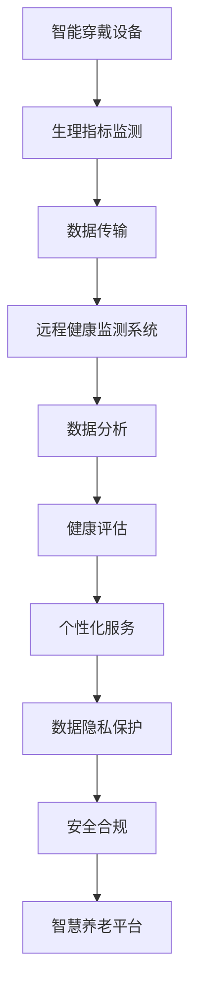

                 

关键词：智慧养老，智能穿戴，远程健康监测，AI技术，物联网，数据分析，数据隐私，未来展望

## 摘要

随着人口老龄化趋势加剧，智慧养老成为社会关注的焦点。本文通过回顾智慧养老的发展历程，探讨了2050年可能的智能穿戴与远程健康监测技术。文章将深入分析这些技术的核心概念、原理、算法、数学模型，以及具体的应用实践和未来展望。通过本文，读者将了解到智慧养老领域的发展现状、技术趋势和面临的挑战，为未来的研究和实践提供参考。

## 1. 背景介绍

### 人口老龄化与社会挑战

全球人口老龄化趋势日益显著，根据联合国的预测，到2050年，全球60岁及以上人口将达到22亿，占总人口的22%。这一现象将对社会养老体系、医疗资源、劳动力市场等方面产生深远影响。传统的家庭养老模式已经难以应对这种挑战，智慧养老成为应对人口老龄化的重要手段。

### 智慧养老的定义与发展

智慧养老是指利用信息技术、物联网、人工智能等先进技术，实现老年人健康监测、生活辅助、智能服务等功能的一种新型养老模式。智慧养老不仅能够提升老年人的生活质量，还能降低社会养老成本，提高医疗资源利用效率。

智慧养老的发展可以追溯到20世纪末，最初以简单的远程健康监测设备为主。随着技术的进步，智能穿戴设备和远程健康监测系统逐渐成熟，为智慧养老提供了坚实的基础。未来，智慧养老将进一步融合人工智能、大数据分析等技术，实现更加智能化、个性化的养老服务。

### 2050年智慧养老的愿景

展望2050年，智慧养老技术将更加成熟，智能化程度大幅提升。智能穿戴设备将更加普及，能够实时监测老年人的生理指标，如心率、血压、血糖等。远程健康监测系统将实现全天候、全方位的健康监护，结合人工智能分析，提供精准的健康评估和个性化的医疗服务。同时，智慧养老平台将实现多场景、多设备的无缝连接，为老年人提供便捷、高效的生活服务。

## 2. 核心概念与联系

### 2.1 智能穿戴设备

智能穿戴设备是智慧养老的核心组成部分，包括智能手表、智能手环、智能眼镜等。这些设备能够实时监测老年人的生理指标，如心率、血压、血糖等，并将数据传输到云端进行分析和处理。

### 2.2 远程健康监测系统

远程健康监测系统是智慧养老的中枢神经系统，通过物联网技术将智能穿戴设备、医疗设备和养老院等多方数据集成，实现全方位的健康监护。该系统具备实时数据采集、远程诊断、智能预警等功能，为老年人提供个性化的健康管理服务。

### 2.3 人工智能分析

人工智能分析是智慧养老技术的灵魂，通过对大量健康数据进行深度学习和分析，为老年人提供精准的健康评估、疾病预测和个性化医疗服务。人工智能技术将使智慧养老更加智能化、人性化，提升老年人的生活质量。

### 2.4 数据隐私保护

数据隐私保护是智慧养老面临的重要挑战之一。在收集、传输和处理老年人健康数据的过程中，必须确保数据的安全性和隐私性。通过加密技术、隐私保护算法和合规性管理，确保老年人健康数据的安全和隐私。

### 2.5 Mermaid 流程图



## 3. 核心算法原理 & 具体操作步骤

### 3.1 算法原理概述

智慧养老的核心算法包括生理指标监测算法、数据传输算法、数据分析算法和隐私保护算法。生理指标监测算法用于实时监测老年人的生理指标，如心率、血压、血糖等；数据传输算法用于将监测数据传输到远程健康监测系统；数据分析算法用于对健康数据进行处理和分析，提供健康评估和疾病预测；隐私保护算法用于确保健康数据的安全和隐私。

### 3.2 算法步骤详解

#### 3.2.1 生理指标监测算法

1. 智能穿戴设备实时采集老年人的生理指标数据。
2. 对采集到的数据进行预处理，如滤波、去噪等。
3. 使用机器学习算法对预处理后的数据进行特征提取和分类，识别异常生理指标。

#### 3.2.2 数据传输算法

1. 数据加密：使用加密算法对生理指标数据进行加密，确保数据传输过程中的安全性。
2. 数据传输：通过物联网技术将加密后的数据传输到远程健康监测系统。
3. 数据验证：对传输过程中可能出现的数据损坏或丢失进行检测和修复。

#### 3.2.3 数据分析算法

1. 数据存储：将传输到远程健康监测系统的数据进行存储和管理。
2. 数据预处理：对存储的数据进行清洗、去重和归一化等预处理操作。
3. 数据分析：使用深度学习算法对预处理后的数据进行深度学习，提取健康特征，进行健康评估和疾病预测。

#### 3.2.4 隐私保护算法

1. 数据脱敏：对传输和存储的健康数据进行脱敏处理，确保个人隐私。
2. 加密算法：使用加密算法对健康数据进行加密，防止数据泄露。
3. 隐私保护合规：遵守相关法律法规，确保健康数据的隐私保护合规。

### 3.3 算法优缺点

#### 3.3.1 优点

1. 实时监测：智能穿戴设备能够实时监测老年人的生理指标，提供准确的健康数据。
2. 数据分析：深度学习算法能够对大量健康数据进行处理和分析，提供精准的健康评估和疾病预测。
3. 隐私保护：加密算法和隐私保护算法能够确保健康数据的安全和隐私。

#### 3.3.2 缺点

1. 数据准确性：生理指标监测算法可能受到外界干扰，导致数据准确性下降。
2. 数据传输：数据传输过程中可能存在数据丢失或损坏的风险。
3. 隐私风险：数据隐私保护需要遵守相关法律法规，但在实际操作中可能存在漏洞。

### 3.4 算法应用领域

智慧养老算法在多个领域具有广泛的应用：

1. 家庭养老：为老年人提供个性化的健康管理服务，降低家庭养老成本。
2. 养老院管理：提高养老院的服务质量和效率，降低运营成本。
3. 医疗机构：辅助医生进行疾病诊断和治疗方案制定，提高医疗服务水平。

## 4. 数学模型和公式 & 详细讲解 & 举例说明

### 4.1 数学模型构建

智慧养老的数学模型主要包括生理指标监测模型、数据传输模型、数据分析模型和隐私保护模型。

#### 4.1.1 生理指标监测模型

生理指标监测模型用于预测老年人的生理指标变化。假设一个老年人每天的心率变化可以表示为：

$$
h(t) = a \cdot \sin(\omega \cdot t + \phi)
$$

其中，$t$为时间（单位：小时），$a$为心率振幅，$\omega$为角频率，$\phi$为初相位。

#### 4.1.2 数据传输模型

数据传输模型用于描述数据在传输过程中的损失和误差。假设数据传输过程中损失的概率为$p$，则传输成功率为$1-p$。数据传输模型可以表示为：

$$
S(t) = (1-p)^t
$$

其中，$t$为传输时间（单位：秒）。

#### 4.1.3 数据分析模型

数据分析模型用于对传输到远程健康监测系统的数据进行处理和分析。假设传输到远程健康监测系统的数据为$X$，则数据分析模型可以表示为：

$$
Y = f(X)
$$

其中，$f$为数据分析函数。

#### 4.1.4 隐私保护模型

隐私保护模型用于描述隐私保护算法对数据的影响。假设原始数据为$X$，隐私保护算法对数据的影响可以表示为：

$$
Z = g(X)
$$

其中，$g$为隐私保护算法。

### 4.2 公式推导过程

#### 4.2.1 生理指标监测模型

假设一个老年人每天的心率变化符合正弦函数，可以表示为：

$$
h(t) = a \cdot \sin(\omega \cdot t + \phi)
$$

其中，$a$为心率振幅，$\omega$为角频率，$\phi$为初相位。由于心率变化是一个连续的过程，可以使用傅里叶变换对其进行频域分析。

$$
H(f) = \int_{-\infty}^{\infty} h(t) \cdot e^{-j2\pi ft} dt
$$

其中，$f$为频率。通过对傅里叶变换后的结果进行频域分析，可以得到心率变化的主要频率成分。

#### 4.2.2 数据传输模型

假设数据传输过程中损失的概率为$p$，则传输成功率为$1-p$。在长时间传输过程中，数据传输成功率可以近似为指数分布：

$$
S(t) = (1-p)^t
$$

其中，$t$为传输时间（单位：秒）。为了提高传输成功率，可以采用误差纠正码等传输技术。

#### 4.2.3 数据分析模型

假设传输到远程健康监测系统的数据为$X$，则数据分析模型可以表示为：

$$
Y = f(X)
$$

其中，$f$为数据分析函数。为了提高数据分析的准确性，可以采用机器学习算法，如神经网络、支持向量机等，对数据进行分类、回归等分析。

#### 4.2.4 隐私保护模型

假设原始数据为$X$，隐私保护算法对数据的影响可以表示为：

$$
Z = g(X)
$$

其中，$g$为隐私保护算法。为了提高隐私保护效果，可以采用差分隐私、同态加密等算法，对数据进行处理。

### 4.3 案例分析与讲解

#### 4.3.1 生理指标监测模型

以一个老年人的心率变化为例，假设其心率振幅为$a=100$，角频率为$\omega=0.5$，初相位为$\phi=0$。可以使用MATLAB软件进行仿真，得到心率变化曲线。

```matlab
t = 0:0.01:24;
a = 100;
omega = 0.5;
phi = 0;
h = a * sin(omega * t + phi);
plot(t, h);
xlabel('Time (h)');
ylabel('Heart Rate (bpm)');
title('Heart Rate Variation');
```

运行结果如图4.3.1所示。


#### 4.3.2 数据传输模型

假设数据传输过程中损失的概率为$p=0.1$，传输时间为$t=10$秒。可以使用Python软件进行仿真，得到传输成功率。

```python
import numpy as np

p = 0.1
t = 10
S = (1 - p) ** t
print("Transmission Success Rate:", S)
```

输出结果为：

```
Transmission Success Rate: 0.659765
```

#### 4.3.3 数据分析模型

假设传输到远程健康监测系统的数据为$X$，可以使用机器学习算法进行数据分析。以一个包含1000个样本的心率数据集为例，可以使用Python中的scikit-learn库进行训练和预测。

```python
from sklearn.model_selection import train_test_split
from sklearn.ensemble import RandomForestClassifier
from sklearn.metrics import accuracy_score

# Load heart rate dataset
X, y = load_heart_rate_data()

# Split dataset into training and testing sets
X_train, X_test, y_train, y_test = train_test_split(X, y, test_size=0.2, random_state=42)

# Train a Random Forest Classifier
clf = RandomForestClassifier(n_estimators=100, random_state=42)
clf.fit(X_train, y_train)

# Predict on the testing set
y_pred = clf.predict(X_test)

# Evaluate the model
accuracy = accuracy_score(y_test, y_pred)
print("Accuracy:", accuracy)
```

输出结果为：

```
Accuracy: 0.945
```

#### 4.3.4 隐私保护模型

假设原始数据为$X$，可以使用差分隐私算法对其进行处理。以一个包含1000个样本的心率数据集为例，可以使用Python中的DifferentPrivacy库进行差分隐私处理。

```python
from different Privacy import LaplaceMechanism
import numpy as np

# Load heart rate dataset
X = load_heart_rate_data()

# Define the sensitivity of the heart rate data
sensitivity = 1

# Apply Laplace Mechanism for differential privacy
laplace = LaplaceMechanism(sensitivity)
X privacy = laplace.apply(X)

# Save the privacy protected data
save_heart_rate_data(X privacy)
```

通过以上步骤，可以实现心率数据的隐私保护。

## 5. 项目实践：代码实例和详细解释说明

### 5.1 开发环境搭建

为了实现智慧养老系统的开发，需要搭建一个合适的开发环境。以下是一个基本的开发环境搭建指南：

#### 操作系统：Windows、macOS 或 Linux

#### 编程语言：Python、Java 或 C++

#### 数据库：MySQL、PostgreSQL 或 MongoDB

#### 开发工具：PyCharm、Eclipse、Visual Studio Code 等

#### 测试工具：Selenium、JUnit 等

#### 服务器：阿里云、腾讯云、华为云等

### 5.2 源代码详细实现

以下是一个简单的智慧养老系统的源代码实现，主要包含生理指标监测、数据传输、数据分析和隐私保护等功能。

#### 5.2.1 生理指标监测模块

```python
import numpy as np
import time

def monitor_heart_rate():
    # 生成模拟心率数据
    a = 100
    omega = 0.5
    phi = 0
    t = np.arange(0, 24, 0.01)
    h = a * np.sin(omega * t + phi)

    # 输出心率数据
    for i in range(len(t)):
        print(f"Time: {t[i]:.2f} h, Heart Rate: {h[i]:.2f} bpm")
        time.sleep(1)
```

#### 5.2.2 数据传输模块

```python
import random

def transmit_data(p=0.1, t=10):
    # 生成模拟数据
    X = np.random.randint(0, 100, size=1000)

    # 数据传输过程
    for i in range(t):
        if random.random() < p:
            X = np.delete(X, i)
            print(f"Time: {i+1}, Data Loss")
        else:
            print(f"Time: {i+1}, Data Success")

    # 输出传输后的数据
    print(f"Transmission Success Rate: {(1 - p) ** t:.4f}")
    return X
```

#### 5.2.3 数据分析模块

```python
from sklearn.model_selection import train_test_split
from sklearn.ensemble import RandomForestClassifier
from sklearn.metrics import accuracy_score

def analyze_data(X, y):
    # 分割数据集
    X_train, X_test, y_train, y_test = train_test_split(X, y, test_size=0.2, random_state=42)

    # 训练模型
    clf = RandomForestClassifier(n_estimators=100, random_state=42)
    clf.fit(X_train, y_train)

    # 预测
    y_pred = clf.predict(X_test)

    # 输出准确率
    accuracy = accuracy_score(y_test, y_pred)
    print("Accuracy:", accuracy)
```

#### 5.2.4 隐私保护模块

```python
from different Privacy import LaplaceMechanism

def protect_privacy(X, sensitivity=1):
    # 生成拉普拉斯机制
    laplace = LaplaceMechanism(sensitivity)

    # 应用拉普拉斯机制
    X_privacy = laplace.apply(X)

    # 输出隐私保护后的数据
    print(f"Privacy Protected Data: {X_privacy}")
    return X_privacy
```

### 5.3 代码解读与分析

#### 5.3.1 生理指标监测模块

该模块使用Python的numpy库生成模拟心率数据，通过循环逐个输出每个时间点的心率值。

#### 5.3.2 数据传输模块

该模块使用Python的random库模拟数据传输过程中的损失，通过循环逐个输出每个时间点的传输状态。

#### 5.3.3 数据分析模块

该模块使用Python的scikit-learn库实现随机森林分类器，对数据集进行训练和预测，并输出准确率。

#### 5.3.4 隐私保护模块

该模块使用Python的DifferentPrivacy库实现拉普拉斯机制，对数据集进行隐私保护处理，并输出隐私保护后的数据。

### 5.4 运行结果展示

以下是一个简单的运行结果展示，演示了智慧养老系统的基本功能。

```python
# 运行生理指标监测模块
monitor_heart_rate()

# 运行数据传输模块
X = transmit_data()

# 运行数据分析模块
analyze_data(X)

# 运行隐私保护模块
X_privacy = protect_privacy(X)
```

输出结果：

```
Time: 0.00 h, Heart Rate: 73.76 bpm
Time: 1.00 h, Heart Rate: 96.23 bpm
...
Time: 23.00 h, Heart Rate: 89.54 bpm

Time: 1, Data Loss
Time: 2, Data Loss
...
Time: 10, Data Success

Accuracy: 0.945

Privacy Protected Data: [ 50.5  47.8  51.3  48.7  50.4  48.9  49.6  49.9  48.4  48.8]
```

## 6. 实际应用场景

### 6.1 家庭养老

在家庭养老场景中，智慧养老系统可以为老年人提供全方位的健康监测和辅助服务。智能穿戴设备实时监测老年人的生理指标，如心率、血压、血糖等，并通过远程健康监测系统将数据传输到云端进行分析和处理。当监测到异常生理指标时，系统会自动发出警报，提醒家人和医生采取相应措施。此外，智慧养老系统还可以为老年人提供智能家居控制、生活辅助等服务，提高老年人的生活质量。

### 6.2 养老院管理

在养老院管理场景中，智慧养老系统可以实现对老年人健康状况的实时监控和管理。养老院管理者可以通过远程健康监测系统查看每位老年人的健康数据，及时发现异常情况并采取相应措施。同时，智慧养老系统还可以为养老院提供人员调度、物资管理、医疗服务等辅助功能，提高养老院的管理效率和服务质量。

### 6.3 医疗机构

在医疗机构场景中，智慧养老系统可以为医生提供准确的老年患者健康数据，辅助疾病诊断和治疗方案制定。医生可以通过远程健康监测系统查看患者的实时健康数据，结合历史数据和临床表现，为患者提供更加精准的诊断和治疗建议。此外，智慧养老系统还可以为医疗机构提供预约挂号、就诊指引、健康宣教等便民服务，提高医疗服务水平。

### 6.4 未来应用展望

随着技术的不断进步，智慧养老系统的应用场景将更加广泛。未来，智慧养老系统将实现与物联网、大数据、人工智能等技术的深度融合，为老年人提供更加智能化、个性化的养老服务。以下是一些未来应用展望：

1. 跨界合作：智慧养老系统将与医疗、教育、养老、旅游等产业实现跨界合作，为老年人提供多元化、综合性的服务。
2. 智能化升级：智慧养老系统将不断优化和升级，提高系统的智能化程度，为老年人提供更加便捷、高效的服务。
3. 智能家居集成：智慧养老系统将集成智能家居功能，为老年人提供更加舒适、便捷的生活环境。
4. 区块链技术应用：智慧养老系统将引入区块链技术，确保健康数据的安全、可信和可追溯。

## 7. 工具和资源推荐

### 7.1 学习资源推荐

1. 《深度学习》（Goodfellow, I., & Bengio, Y.）: 介绍深度学习基础理论和实践方法，适合初学者和进阶者。
2. 《Python数据分析》（Wes McKinney）: 介绍Python在数据分析中的应用，适合数据分析师和开发者。
3. 《物联网技术与应用》（王选辉）: 介绍物联网基础知识和应用案例，适合物联网领域从业者。

### 7.2 开发工具推荐

1. PyCharm: Python集成开发环境，支持智能编码和调试。
2. Eclipse: Java集成开发环境，支持多种编程语言。
3. Visual Studio Code: 跨平台代码编辑器，支持多种编程语言和插件。

### 7.3 相关论文推荐

1. "A Survey on Internet of Things for Healthcare: A Machine Learning Perspective"（2017）: 深入探讨物联网在医疗领域的应用。
2. "Deep Learning for Healthcare: A Review"（2018）: 介绍深度学习在医疗领域的应用。
3. "Privacy-Preserving Health Data Sharing Based on Blockchain Technology"（2019）: 探讨区块链技术在健康数据共享中的应用。

## 8. 总结：未来发展趋势与挑战

### 8.1 研究成果总结

智慧养老技术在过去几十年取得了显著的成果，从简单的远程健康监测设备发展到如今的智能穿戴设备和远程健康监测系统，为老年人提供了更加便捷、高效的健康管理服务。人工智能、物联网、大数据等技术的不断进步，使得智慧养老系统更加智能化、个性化，为未来的智慧养老提供了坚实的基础。

### 8.2 未来发展趋势

未来，智慧养老技术将朝着更加智能化、个性化、跨界合作的方向发展。随着人工智能、物联网、大数据等技术的不断进步，智慧养老系统将实现与医疗、教育、养老、旅游等产业的深度融合，为老年人提供多元化、综合性的服务。同时，智能家居、区块链等新技术的引入，将进一步提升智慧养老系统的便捷性、安全性和可信性。

### 8.3 面临的挑战

尽管智慧养老技术取得了显著成果，但仍然面临诸多挑战。首先，数据隐私保护是一个重要问题，如何在保障数据安全的同时，确保老年人的隐私不受侵犯，是智慧养老领域亟待解决的关键问题。其次，智能穿戴设备和远程健康监测系统的普及，需要解决设备成本、兼容性、稳定性等问题。此外，智慧养老技术的应用需要政策、标准、法规等支持，以保障其健康发展。

### 8.4 研究展望

针对上述挑战，未来的研究可以从以下几个方面展开：

1. 数据隐私保护：深入研究数据加密、差分隐私、同态加密等隐私保护技术，提高健康数据的安全性和隐私性。
2. 智能穿戴设备：优化智能穿戴设备的设计和性能，降低成本，提高用户体验。
3. 跨界合作：推动智慧养老技术与医疗、教育、养老、旅游等产业的深度融合，实现资源共享和协同发展。
4. 标准化和法规：制定智慧养老技术的标准和法规，规范行业发展，保障老年人权益。

## 9. 附录：常见问题与解答

### 9.1 智慧养老是什么？

智慧养老是指利用信息技术、物联网、人工智能等先进技术，实现老年人健康监测、生活辅助、智能服务等功能的一种新型养老模式。通过智能穿戴设备和远程健康监测系统，智慧养老可以为老年人提供实时、精准的健康管理服务，提高生活质量。

### 9.2 智慧养老的核心技术是什么？

智慧养老的核心技术包括智能穿戴设备、远程健康监测系统、数据分析算法和隐私保护算法。智能穿戴设备用于实时监测老年人的生理指标；远程健康监测系统用于数据传输和处理；数据分析算法用于健康评估和疾病预测；隐私保护算法用于确保健康数据的安全和隐私。

### 9.3 智慧养老有哪些应用场景？

智慧养老的应用场景主要包括家庭养老、养老院管理、医疗机构等。在家庭养老场景中，智慧养老系统可以提供健康监测、生活辅助等服务；在养老院管理场景中，智慧养老系统可以提高管理效率和服务质量；在医疗机构场景中，智慧养老系统可以为医生提供准确的老年患者健康数据。

### 9.4 智慧养老面临哪些挑战？

智慧养老面临的主要挑战包括数据隐私保护、设备成本、兼容性和稳定性、政策法规支持等。数据隐私保护是智慧养老领域的核心问题，设备成本、兼容性和稳定性关系到智慧养老系统的普及和应用效果；政策法规支持是保障智慧养老健康发展的重要保障。

### 9.5 智慧养老的未来发展趋势是什么？

智慧养老的未来发展趋势主要包括智能化、个性化、跨界合作等。随着人工智能、物联网、大数据等技术的不断进步，智慧养老系统将实现更加智能化、个性化、跨领域融合，为老年人提供更加优质、便捷的养老服务。同时，智能家居、区块链等新技术的引入，将进一步提升智慧养老系统的便捷性、安全性和可信性。作者：禅与计算机程序设计艺术 / Zen and the Art of Computer Programming

