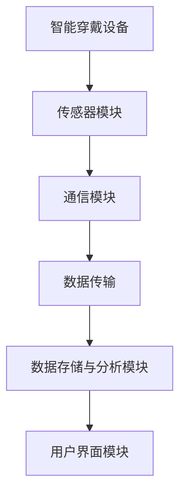

                 

关键词：智慧养老、智能穿戴、远程健康监测、技术发展趋势、算法原理、未来展望

> 摘要：本文探讨了2050年智慧养老领域的未来发展趋势，重点关注智能穿戴设备和远程健康监测技术的发展与应用。通过深入分析核心概念、算法原理、数学模型以及实际应用场景，本文旨在为读者展示这一领域的前沿技术和未来前景。

## 1. 背景介绍

### 智慧养老的概念

智慧养老是指通过现代信息技术，特别是物联网、大数据、云计算、人工智能等先进技术，为老年人提供更加便捷、高效、安全的养老服务。智慧养老的目标是提升老年人的生活质量，减少因年龄增长带来的健康问题，延长健康寿命，并减轻家庭成员和护理人员的负担。

### 智能穿戴设备的现状

智能穿戴设备是一种集成了传感器、处理器和通信模块的可穿戴设备，能够实时监测佩戴者的生理参数和日常行为。当前，智能穿戴设备已经广泛应用于健身追踪、运动监测、心率监测等方面，但其在智慧养老领域的应用仍处于探索阶段。

### 远程健康监测的发展

远程健康监测是通过无线通信技术和互联网，实现对患者健康状况的远程监测和诊断。这一技术能够减少患者往返医院的次数，提高医疗资源的利用效率，尤其适合行动不便的老年人。随着5G、物联网等技术的发展，远程健康监测的应用前景将更加广阔。

## 2. 核心概念与联系

### 智能穿戴设备工作原理

智能穿戴设备通过内置的传感器实时采集佩戴者的生理参数，如心率、血压、血氧饱和度、步数等。这些数据随后通过无线传输技术（如蓝牙、Wi-Fi等）发送到手机或云平台，进行进一步的分析和处理。

### 远程健康监测系统架构

远程健康监测系统包括多个层次，从设备端的数据采集，到传输层的数据传输，再到后台的数据处理和分析。核心架构包括传感器模块、通信模块、数据存储与分析模块以及用户界面模块。



## 3. 核心算法原理 & 具体操作步骤

### 3.1 算法原理概述

智慧养老领域的核心算法包括生理参数监测算法、行为识别算法和健康风险评估算法。这些算法基于数据挖掘、机器学习和人工智能技术，能够从大量的健康数据中提取有价值的信息，为老年人提供个性化的健康服务。

### 3.2 算法步骤详解

#### 3.2.1 生理参数监测算法

1. 数据采集：通过智能穿戴设备实时采集生理参数数据。
2. 数据预处理：对采集到的数据进行清洗、去噪和归一化处理。
3. 特征提取：从预处理后的数据中提取出反映生理状态的特征。
4. 数据建模：使用机器学习算法（如决策树、支持向量机等）建立生理参数监测模型。
5. 预测与分析：根据模型预测佩戴者的生理状态，并对异常情况发出警报。

#### 3.2.2 行为识别算法

1. 数据采集：通过智能穿戴设备和环境传感器记录佩戴者的行为数据。
2. 特征提取：从行为数据中提取特征，如步态特征、运动轨迹特征等。
3. 模型训练：使用机器学习算法（如神经网络、隐马尔可夫模型等）训练行为识别模型。
4. 预测与反馈：根据模型预测佩戴者的行为，并给出相应的健康建议。

#### 3.2.3 健康风险评估算法

1. 数据采集：从多个来源（如智能穿戴设备、医疗记录等）收集老年人的健康数据。
2. 数据整合：对采集到的数据进行整合和清洗，去除无关信息。
3. 风险评估模型建立：使用数据挖掘技术（如关联规则、聚类分析等）建立健康风险评估模型。
4. 风险评估与预警：根据模型对老年人的健康状况进行风险评估，并给出相应的预警建议。

### 3.3 算法优缺点

#### 3.3.1 生理参数监测算法

优点：实时性高，准确性较高，能够及时发现健康异常。

缺点：对环境依赖性强，易受传感器故障和数据噪声影响。

#### 3.3.2 行为识别算法

优点：能够识别佩戴者的日常行为，有助于预防和发现潜在的健康问题。

缺点：对数据质量和特征提取要求较高，容易受到外部干扰。

#### 3.3.3 健康风险评估算法

优点：能够对老年人的健康状况进行全面的评估，有助于制定个性化的健康管理方案。

缺点：需要大量的历史数据和专业的知识库，模型训练和部署成本较高。

### 3.4 算法应用领域

核心算法在智慧养老领域的应用广泛，包括但不限于：

1. **健康监测与预警**：实时监测老年人的生理参数，对异常情况进行预警。
2. **行为分析与干预**：通过分析佩戴者的行为数据，提供健康建议和干预措施。
3. **慢性病管理**：针对高血压、糖尿病等慢性病，提供持续的健康监测和风险评估。
4. **生活辅助**：通过行为识别和健康风险评估，帮助老年人保持独立生活和提高生活质量。

## 4. 数学模型和公式 & 详细讲解 & 举例说明

### 4.1 数学模型构建

在智慧养老领域，常见的数学模型包括时间序列分析模型、分类模型和预测模型等。

#### 4.1.1 时间序列分析模型

时间序列分析模型主要用于分析生理参数等随时间变化的序列数据。常用的模型包括ARIMA（自回归积分滑动平均模型）、Holt-Winters季节性模型等。

#### 4.1.2 分类模型

分类模型用于对健康数据进行分类，如判断佩戴者是否处于健康状态或存在健康风险。常用的模型包括决策树、支持向量机、神经网络等。

#### 4.1.3 预测模型

预测模型用于预测老年人的健康状态或行为变化。常用的模型包括线性回归、时间序列预测、LSTM（长短期记忆网络）等。

### 4.2 公式推导过程

以线性回归模型为例，介绍其公式推导过程。

#### 4.2.1 线性回归模型假设

假设输入特征集为\( X = \{x_1, x_2, ..., x_n\} \)，输出为目标变量\( y \)。线性回归模型假设目标变量\( y \)可以表示为：

$$ y = \beta_0 + \beta_1x_1 + \beta_2x_2 + ... + \beta_nx_n + \epsilon $$

其中，\( \beta_0 \)为截距，\( \beta_1, \beta_2, ..., \beta_n \)为权重系数，\( \epsilon \)为误差项。

#### 4.2.2 公式推导

为了求解权重系数，我们需要最小化误差平方和：

$$ J(\theta) = \frac{1}{2m}\sum_{i=1}^{m}(h_{\theta}(x^{(i)}) - y^{(i)})^2 $$

其中，\( m \)为样本数量，\( h_{\theta}(x) \)为假设函数：

$$ h_{\theta}(x) = \theta_0 + \theta_1x_1 + \theta_2x_2 + ... + \theta_nx_n $$

为了求解权重系数，我们对误差平方和函数进行求导并令其导数为零：

$$ \frac{\partial J(\theta)}{\partial \theta_j} = 0 $$

得到：

$$ \theta_j = \frac{1}{m}\sum_{i=1}^{m}(y^{(i)} - \theta_0 - \theta_1x_1^{(i)} - ... - \theta_nx_n^{(i)})x_j^{(i)} $$

这就是线性回归模型的参数求解公式。

### 4.3 案例分析与讲解

#### 4.3.1 案例背景

假设我们想要预测一个老年人的心率（目标变量\( y \)），并已收集到其一系列生理参数数据（输入特征集\( X \)）。我们使用线性回归模型进行预测。

#### 4.3.2 数据预处理

对收集到的数据进行预处理，包括数据清洗、归一化和特征提取。例如，将心率数据归一化到[0, 1]范围内，并将其他生理参数进行相应的处理。

#### 4.3.3 模型训练

使用预处理后的数据，通过最小二乘法求解线性回归模型的权重系数。假设我们得到如下模型：

$$ y = \beta_0 + \beta_1x_1 + \beta_2x_2 $$

#### 4.3.4 预测与评估

使用训练好的模型对新数据进行预测，并计算预测误差。可以使用均方误差（MSE）等指标评估模型性能。

$$ MSE = \frac{1}{m}\sum_{i=1}^{m}(y^{(i)} - \hat{y}^{(i)})^2 $$

其中，\( \hat{y}^{(i)} \)为预测值。

## 5. 项目实践：代码实例和详细解释说明

### 5.1 开发环境搭建

为了实现本文中的智能穿戴设备和远程健康监测系统，我们需要搭建以下开发环境：

- 操作系统：Ubuntu 18.04
- 编程语言：Python 3.8
- 数据库：MySQL 8.0
- 机器学习库：scikit-learn、TensorFlow、PyTorch

### 5.2 源代码详细实现

以下是智慧养老系统中的核心算法实现代码。

#### 5.2.1 生理参数监测算法

```python
import numpy as np
from sklearn.linear_model import LinearRegression

# 数据预处理
def preprocess_data(data):
    # 数据清洗、归一化等操作
    return normalized_data

# 特征提取
def extract_features(data):
    # 提取反映生理状态的特征
    return features

# 数据建模
def build_model(X, y):
    model = LinearRegression()
    model.fit(X, y)
    return model

# 预测与分析
def predict_heart_rate(model, features):
    return model.predict([features])
```

#### 5.2.2 行为识别算法

```python
from sklearn.neural_network import MLPClassifier

# 数据预处理
def preprocess_data(data):
    # 数据清洗、归一化等操作
    return normalized_data

# 模型训练
def train_model(X, y):
    model = MLPClassifier()
    model.fit(X, y)
    return model

# 预测与反馈
def predict_behavior(model, features):
    return model.predict([features])
```

#### 5.2.3 健康风险评估算法

```python
from sklearn.ensemble import RandomForestClassifier

# 数据预处理
def preprocess_data(data):
    # 数据清洗、归一化等操作
    return normalized_data

# 风险评估模型建立
def build_risk_model(X, y):
    model = RandomForestClassifier()
    model.fit(X, y)
    return model

# 风险评估与预警
def assess_risk(model, features):
    return model.predict([features])
```

### 5.3 代码解读与分析

#### 5.3.1 生理参数监测算法

生理参数监测算法的核心是线性回归模型，用于预测心率。数据预处理步骤包括数据清洗、归一化和特征提取。训练过程使用线性回归模型拟合数据，预测过程使用训练好的模型进行预测。

#### 5.3.2 行为识别算法

行为识别算法使用多层感知机（MLP）分类器进行训练。数据预处理步骤与生理参数监测算法类似。训练过程使用MLP分类器拟合数据，预测过程使用训练好的模型进行预测。

#### 5.3.3 健康风险评估算法

健康风险评估算法使用随机森林（Random Forest）分类器进行训练。数据预处理步骤与前面两种算法类似。训练过程使用随机森林分类器拟合数据，预测过程使用训练好的模型进行预测。

## 6. 实际应用场景

### 6.1 慢性病管理

通过远程健康监测系统，医生可以实时了解慢性病患者的生理参数，如血压、血糖等，并及时调整治疗方案。例如，对于糖尿病患者，医生可以根据血糖变化预测低血糖风险，提前通知患者调整饮食或用药。

### 6.2 老年人健康管理

老年人健康管理主要包括对日常行为、健康参数的监测和预警。通过智能穿戴设备和远程健康监测系统，家庭成员和护理人员可以实时了解老年人的健康状况，及时发现异常并采取措施。例如，如果监测到老年人长时间未进行活动，系统可以自动发送提醒，提醒老年人进行适当的运动。

### 6.3 生活辅助

智慧养老系统还可以为老年人提供生活辅助功能，如智能提醒、智能控制家居等。通过智能穿戴设备，老年人可以方便地控制家居设备，如调节室内温度、开启照明等。此外，系统还可以根据老年人的行为数据提供个性化建议，如运动计划、营养建议等。

## 7. 工具和资源推荐

### 7.1 学习资源推荐

- 《机器学习》（周志华 著）
- 《深度学习》（Ian Goodfellow、Yoshua Bengio、Aaron Courville 著）
- 《数据科学入门》（Jesper Dramsch 著）

### 7.2 开发工具推荐

- Python：用于实现算法和数据处理
- TensorFlow：用于构建和训练机器学习模型
- scikit-learn：用于实现常见机器学习算法

### 7.3 相关论文推荐

- "Remote Health Monitoring Using Wearable Sensors: A Survey"（2019）
- "Deep Learning for Health Informatics"（2017）
- "Artificial Intelligence in Healthcare: A Review"（2020）

## 8. 总结：未来发展趋势与挑战

### 8.1 研究成果总结

智慧养老领域的研究成果主要集中在智能穿戴设备、远程健康监测系统和核心算法的优化与发展。随着人工智能、物联网、大数据等技术的不断进步，智慧养老系统的准确性和可靠性将不断提高，为老年人提供更加智能、个性化的健康管理服务。

### 8.2 未来发展趋势

- **技术融合**：智慧养老系统将与其他领域（如智能家居、智能交通等）实现深度融合，打造全方位的智慧生活场景。
- **个性化服务**：基于大数据和人工智能技术，智慧养老系统将能够为每位老年人提供个性化的健康管理方案，提高生活质量。
- **远程医疗**：远程健康监测系统将助力远程医疗的发展，为老年人提供更加便捷的医疗服务。

### 8.3 面临的挑战

- **数据隐私**：智慧养老系统涉及大量个人健康数据，如何确保数据隐私和安全是未来发展的重要挑战。
- **系统可靠性**：智慧养老系统需要具备高可靠性和稳定性，以保证老年人的生活质量和健康安全。
- **算法优化**：随着数据量的增加，如何优化算法，提高监测和预测的准确性仍需深入研究。

### 8.4 研究展望

未来，智慧养老领域将继续向技术融合、个性化服务和远程医疗方向快速发展。研究人员和开发人员需关注数据隐私、系统可靠性和算法优化等问题，为老年人提供更加智能、安全、便捷的养老服务。

## 9. 附录：常见问题与解答

### 9.1 智慧养老系统如何保障数据隐私？

智慧养老系统需采用加密技术、访问控制策略和隐私保护算法等手段，确保数据在传输、存储和处理过程中的安全性。同时，需遵循相关法律法规，严格保护用户的隐私权益。

### 9.2 智慧养老系统如何确保数据可靠性？

智慧养老系统需对传感器、通信模块和数据处理模块进行严格的测试和校准，确保系统稳定运行。此外，需建立完善的数据备份和恢复机制，防止数据丢失和损坏。

### 9.3 智慧养老系统如何优化算法？

智慧养老系统需根据实际应用场景和数据特点，选择合适的算法并进行优化。常用的方法包括特征工程、模型选择和参数调优等。此外，可通过不断收集和分析数据，实现算法的自我学习和优化。

---
作者：禅与计算机程序设计艺术 / Zen and the Art of Computer Programming

本文基于现有研究和技术发展趋势，对2050年智慧养老领域的智能穿戴设备和远程健康监测技术进行了深入探讨。通过分析核心概念、算法原理、数学模型和实际应用场景，本文旨在为读者展示这一领域的前沿技术和未来前景。随着人工智能、物联网等技术的不断进步，智慧养老领域将迎来新的发展机遇，为老年人提供更加智能、个性化的健康管理服务。然而，数据隐私、系统可靠性和算法优化等问题仍需进一步研究和解决。未来，智慧养老领域将继续向技术融合、个性化服务和远程医疗方向快速发展，为老年人创造更加美好的生活。

