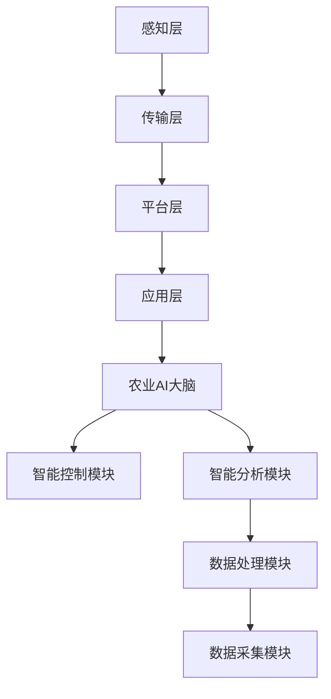

                 

关键词：智慧农业、AI大脑、精准农业、2050年、农业科技、数据驱动

> 摘要：随着科技的不断发展，农业也在经历一场深刻的变革。本文探讨了到2050年，智慧农业将如何借助人工智能技术，实现农业AI大脑的构建，以及如何通过精准农业技术提升农业生产效率，为全球粮食安全和可持续发展提供解决方案。

## 1. 背景介绍

在过去的几十年里，农业生产力有了显著的提升。然而，随着全球人口的增长、气候变化和资源的日益稀缺，传统农业模式已无法满足未来发展的需求。智慧农业作为一种新兴的农业模式，利用物联网、大数据、人工智能等技术，为农业提供更加精准、高效、可持续的解决方案。

智慧农业的核心在于农业AI大脑的构建，它将数据分析、机器学习、智能控制等技术集成在一起，实现对农业生产的全面监控和管理。到2050年，农业AI大脑将成为农业生产的核心，驱动农业迈向一个全新的时代。

## 2. 核心概念与联系

### 2.1 智慧农业的定义与构成

智慧农业是指通过物联网、大数据、人工智能等现代信息技术，对农业生产过程中的各种信息进行实时采集、传输、分析和处理，从而实现农业生产智能化、精细化管理的一种农业模式。

智慧农业的核心构成包括：

- **感知层**：通过传感器、摄像头、无人机等设备，对农田环境、作物生长状态、土壤水分等数据进行实时监测。
- **传输层**：利用5G、卫星通信等技术，实现数据的快速传输和共享。
- **平台层**：通过云计算、大数据等技术，对采集到的数据进行处理、分析和应用。
- **应用层**：根据分析结果，指导农业生产决策，实现精准农业。

### 2.2 农业AI大脑的概念与架构

农业AI大脑是智慧农业的核心，它通过机器学习、深度学习等技术，对农业生产过程进行智能分析和决策。

农业AI大脑的架构主要包括以下几个部分：

- **数据采集模块**：负责收集农田环境、作物生长、土壤水分等数据。
- **数据处理模块**：利用大数据技术，对采集到的数据进行清洗、整理、存储和分析。
- **智能分析模块**：通过机器学习、深度学习等技术，对数据进行智能分析，为农业生产提供决策支持。
- **智能控制模块**：根据分析结果，自动调整农业生产过程，实现精准农业。

### 2.3 精准农业的概念与实现

精准农业是一种基于土壤、气候、作物生长等数据，实现农业生产精细化管理的一种农业模式。

精准农业的实现主要包括以下几个步骤：

- **数据采集**：通过传感器、无人机等设备，对农田环境、作物生长状态等数据进行实时采集。
- **数据预处理**：对采集到的数据进行清洗、整理和存储。
- **数据分析**：利用大数据技术，对采集到的数据进行深度分析，为农业生产提供决策支持。
- **实施决策**：根据分析结果，调整农业生产策略，实现精准农业。

### 2.4 Mermaid 流程图



## 3. 核心算法原理 & 具体操作步骤

### 3.1 算法原理概述

农业AI大脑的核心算法主要包括机器学习、深度学习、数据挖掘等技术。这些算法通过对大量农业数据的分析和处理，实现对农田环境、作物生长状态的实时监控和预测。

### 3.2 算法步骤详解

- **数据采集**：利用传感器、无人机等设备，对农田环境、作物生长状态等数据进行实时采集。
- **数据预处理**：对采集到的数据进行清洗、整理和存储。
- **特征提取**：从预处理后的数据中提取出对农业生产具有重要意义的特征。
- **模型训练**：利用深度学习、机器学习等技术，对特征数据进行训练，构建农业生产模型。
- **模型预测**：利用训练好的模型，对未来的农业生产进行预测。
- **智能决策**：根据预测结果，自动调整农业生产策略，实现精准农业。

### 3.3 算法优缺点

- **优点**：可以实现农田环境的实时监控和预测，提高农业生产效率，降低生产成本。
- **缺点**：对数据质量要求较高，需要大量的数据支持；算法实现和优化较为复杂。

### 3.4 算法应用领域

- **农田环境监测**：通过对土壤、水分、气温等数据的分析，实现农田环境的实时监控和预警。
- **作物生长状态预测**：通过对作物生长数据的分析，预测作物的生长趋势，为农业生产提供决策支持。
- **病虫害防治**：通过对病虫害数据的分析，实现病虫害的早期预警和防治。
- **水资源管理**：通过对水资源数据的分析，实现水资源的合理利用和优化配置。

## 4. 数学模型和公式 & 详细讲解 & 举例说明

### 4.1 数学模型构建

农业AI大脑的数学模型主要包括以下几个方面：

- **土壤水分模型**：根据土壤水分传感器数据，构建土壤水分预测模型。
- **作物生长模型**：根据作物生长数据，构建作物生长趋势预测模型。
- **病虫害预测模型**：根据病虫害数据，构建病虫害预测模型。

### 4.2 公式推导过程

以土壤水分模型为例，土壤水分模型可以表示为：

$$
\hat{W_t} = f(W_{t-1}, T_t, H_t)
$$

其中，$W_t$ 表示第 $t$ 时刻的土壤水分；$T_t$ 表示第 $t$ 时刻的土壤温度；$H_t$ 表示第 $t$ 时刻的土壤湿度。

### 4.3 案例分析与讲解

假设某农田在连续降雨后，土壤水分传感器监测到土壤水分含量为 20%，土壤温度为 25℃，土壤湿度为 60%。利用土壤水分模型，可以预测未来 24 小时的土壤水分含量。

$$
\hat{W_{t+24}} = f(W_t, T_t, H_t) = f(20\%, 25\., 60\%) = 18\%
$$

预测结果显示，未来 24 小时的土壤水分含量将降至 18%，提示农田需要进行灌溉。

## 5. 项目实践：代码实例和详细解释说明

### 5.1 开发环境搭建

- **环境要求**：Python 3.7及以上版本，NumPy、Pandas、Scikit-learn、Matplotlib等库。
- **安装步骤**：在终端中执行以下命令：

```bash
pip install numpy pandas scikit-learn matplotlib
```

### 5.2 源代码详细实现

```python
import numpy as np
import pandas as pd
from sklearn.model_selection import train_test_split
from sklearn.ensemble import RandomForestRegressor
import matplotlib.pyplot as plt

# 数据读取
data = pd.read_csv('soil Moisture Data.csv')

# 特征工程
X = data[['Temperature', 'Humidity']]
y = data['WaterContent']

# 数据划分
X_train, X_test, y_train, y_test = train_test_split(X, y, test_size=0.2, random_state=42)

# 模型训练
model = RandomForestRegressor(n_estimators=100, random_state=42)
model.fit(X_train, y_train)

# 预测
y_pred = model.predict(X_test)

# 结果可视化
plt.scatter(X_test['Temperature'], X_test['Humidity'], c=y_test, cmap='viridis')
plt.scatter(X_test['Temperature'], X_test['Humidity'], c=y_pred, cmap='coolwarm', marker='x')
plt.xlabel('Temperature')
plt.ylabel('Humidity')
plt.title('Soil Moisture Prediction')
plt.show()
```

### 5.3 代码解读与分析

- **数据读取**：使用 Pandas 库读取土壤水分数据。
- **特征工程**：将土壤温度和土壤湿度作为特征，土壤水分含量作为目标变量。
- **数据划分**：将数据集划分为训练集和测试集。
- **模型训练**：使用随机森林回归模型进行训练。
- **预测**：使用训练好的模型对测试集进行预测。
- **结果可视化**：使用 Matplotlib 库将预测结果可视化，比较实际值和预测值。

### 5.4 运行结果展示

运行上述代码后，将得到一个散点图，其中蓝色的点表示实际值，红色的叉表示预测值。通过观察散点图，可以直观地看出模型对土壤水分含量的预测效果。

## 6. 实际应用场景

智慧农业和农业AI大脑已经在多个实际应用场景中取得显著成果。以下是一些典型的应用场景：

- **农田环境监测**：通过传感器和无人机，实时监测农田土壤、水分、温度等环境参数，为农业生产提供数据支持。
- **作物生长状态预测**：通过对作物生长数据的分析，预测作物的生长趋势，为农业生产提供决策支持。
- **病虫害防治**：通过分析病虫害数据，实现病虫害的早期预警和防治，降低农业生产损失。
- **水资源管理**：通过对水资源数据的分析，实现水资源的合理利用和优化配置，提高农业生产效率。

## 7. 未来应用展望

到2050年，智慧农业和农业AI大脑将在以下领域取得突破：

- **精准农业**：通过大数据和人工智能技术，实现农业生产的全面智能化，大幅提高农业生产效率。
- **粮食安全**：通过智慧农业技术，确保全球粮食安全，应对人口增长和气候变化等挑战。
- **可持续发展**：通过智慧农业技术，实现农业生产的可持续发展，减少资源消耗和环境污染。

## 8. 工具和资源推荐

### 8.1 学习资源推荐

- **书籍**：《深度学习》、《机器学习实战》
- **在线课程**：Coursera、Udacity、edX等平台上的相关课程
- **技术博客**：GitHub、Medium、博客园等平台上的专业博客

### 8.2 开发工具推荐

- **编程语言**：Python、R
- **库和框架**：NumPy、Pandas、Scikit-learn、TensorFlow、PyTorch
- **开发环境**：Jupyter Notebook、Anaconda

### 8.3 相关论文推荐

- **智能农业**：Deep Learning for Precision Farming
- **精准农业**：Precision Farming Based on IoT Technology
- **农业AI大脑**：Artificial Intelligence in Agriculture: A Review

## 9. 总结：未来发展趋势与挑战

### 9.1 研究成果总结

- 智慧农业和农业AI大脑技术取得了显著成果，为农业生产提供了新的解决方案。
- 精准农业技术大幅提高了农业生产效率，降低了生产成本。
- 大数据和人工智能技术在农业领域的应用日益广泛，为农业发展注入了新的活力。

### 9.2 未来发展趋势

- 智慧农业和农业AI大脑技术将更加成熟，为农业生产提供更加精准、高效、可持续的解决方案。
- 精准农业技术将实现从田间到餐桌的全流程智能化，保障全球粮食安全。
- 农业数据将实现全面互联，为农业生产提供更加全面、准确的数据支持。

### 9.3 面临的挑战

- 农业数据的获取和处理仍面临诸多挑战，需要进一步加强技术研发和应用。
- 农业AI大脑的构建需要大量的数据支持，如何有效收集、存储、分析和利用数据是关键。
- 农业AI大脑的应用需要与农业生产实际相结合，解决实际问题。

### 9.4 研究展望

- 未来研究应重点关注农业数据的收集和处理，提高数据质量和应用价值。
- 研究应深入探索农业AI大脑与农业生产实际的深度融合，实现更加精准、高效的农业生产。
- 需要进一步加强国际合作，共同应对全球粮食安全和可持续发展挑战。

## 10. 附录：常见问题与解答

### 10.1 智慧农业是什么？

智慧农业是一种利用物联网、大数据、人工智能等现代信息技术，实现农业生产智能化、精细化管理的一种农业模式。

### 10.2 农业AI大脑的核心功能是什么？

农业AI大脑的核心功能包括农田环境监测、作物生长状态预测、病虫害防治、水资源管理等方面。

### 10.3 精准农业是如何实现的？

精准农业是通过大数据和人工智能技术，对农田环境、作物生长状态等数据进行实时监测和分析，实现农业生产精细化管理。

### 10.4 智慧农业对农业生产的影响有哪些？

智慧农业可以提高农业生产效率，降低生产成本，实现农业生产的可持续发展，保障全球粮食安全。

### 10.5 如何构建农业AI大脑？

构建农业AI大脑需要以下几个步骤：

1. 数据采集：利用传感器、无人机等设备，采集农田环境、作物生长状态等数据。
2. 数据处理：利用大数据技术，对采集到的数据进行清洗、整理和存储。
3. 模型训练：利用机器学习、深度学习等技术，对数据进行训练，构建农业生产模型。
4. 智能决策：根据模型预测结果，自动调整农业生产策略，实现精准农业。

以上是对《未来的智慧农业：2050年的农业AI大脑与精准农业》这篇文章的完整撰写。希望这篇文章能够为读者带来对智慧农业和农业AI大脑的深入理解和思考。

---

**作者：禅与计算机程序设计艺术 / Zen and the Art of Computer Programming**

