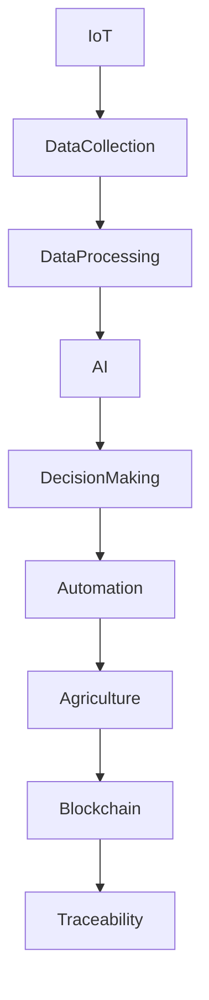

                 

关键词：智慧农业、智能农机、农业区块链、2050年、物联网、自动化、数据分析、可持续发展

> 摘要：本文探讨了2050年智慧农业的发展前景，重点关注智能农机和农业区块链的应用。文章首先介绍了智慧农业的定义和背景，随后详细分析了智能农机和农业区块链的核心概念和关键技术。接着，文章通过数学模型和实例展示了这些技术的具体应用，并讨论了它们在实际农业生产中的潜在影响。最后，文章展望了智慧农业的未来发展趋势和面临的挑战。

## 1. 背景介绍

随着全球人口的增长和气候变化的影响，农业面临着前所未有的挑战。传统的农业生产方式已经无法满足日益增长的食物需求，同时，也难以应对资源短缺和环境恶化等问题。为了实现农业的可持续发展，智慧农业成为了未来农业发展的必然选择。

智慧农业是指利用物联网、大数据、人工智能、区块链等现代信息技术，实现农业生产、管理、销售全过程的智能化和自动化。其目标是提高农业生产效率、减少资源浪费、降低环境污染，从而实现农业的可持续发展。

### 1.1 智慧农业的现状

目前，智慧农业在全球范围内已经取得了一定的进展。许多国家已经开始采用无人机、传感器、自动化设备等技术来优化农业生产过程。例如，美国和欧洲的一些农场已经实现了全程自动化，从播种到收割，几乎不需要人工干预。

### 1.2 智慧农业的重要性

智慧农业的重要性体现在以下几个方面：

- **提高生产效率**：通过自动化设备和智能化管理系统，智慧农业可以显著提高生产效率，减少生产成本。

- **保障食品安全**：智慧农业可以通过精准监测和数据分析，确保农产品从种植到销售的全过程都符合食品安全标准。

- **减少资源浪费**：智慧农业可以通过精准的水肥管理和病虫害防治，减少水、肥料和农药的浪费。

- **降低环境污染**：智慧农业通过减少化肥和农药的使用，可以降低农业对环境的污染。

## 2. 核心概念与联系

智慧农业的核心概念包括物联网、大数据、人工智能和区块链。这些技术相互关联，共同推动农业的智能化和自动化。

### 2.1 物联网（IoT）

物联网是指通过传感器、无线网络和其他设备，将物理世界与数字世界相连接。在智慧农业中，物联网技术可以实时监测土壤湿度、气候条件、作物生长状态等数据，为农业生产提供实时信息。

### 2.2 大数据

大数据是指无法用常规数据库工具进行管理和分析的数据集。在智慧农业中，大数据技术可以处理和分析大量的农业数据，为农业生产提供决策支持。

### 2.3 人工智能（AI）

人工智能是指使计算机具备人类智能的技术。在智慧农业中，人工智能可以用于预测作物生长趋势、优化农业生产方案、自动化农机作业等。

### 2.4 区块链

区块链是一种分布式数据库技术，具有去中心化、不可篡改和透明等特点。在智慧农业中，区块链可以用于记录农产品生产、加工和销售的全过程，确保农产品的可追溯性。

### 2.5 Mermaid 流程图

下面是一个简单的 Mermaid 流程图，展示了智慧农业中核心概念之间的联系：



## 3. 核心算法原理 & 具体操作步骤

### 3.1 算法原理概述

智慧农业中的核心算法主要包括数据采集、数据处理和智能决策三个部分。数据采集主要通过物联网传感器实现，数据处理利用大数据技术和人工智能算法，智能决策则通过机器学习和深度学习模型实现。

### 3.2 算法步骤详解

#### 3.2.1 数据采集

数据采集是智慧农业的基础。通过安装在农田中的传感器，可以实时获取土壤湿度、气候条件、作物生长状态等数据。

#### 3.2.2 数据处理

数据处理包括数据清洗、数据集成和数据挖掘等步骤。数据清洗用于去除噪声和异常值，数据集成用于将不同来源的数据进行整合，数据挖掘则用于提取有价值的信息。

#### 3.2.3 智能决策

智能决策是基于处理后的数据，利用机器学习和深度学习模型进行预测和优化。例如，可以根据土壤湿度预测作物需水量，根据气候条件预测病虫害发生概率，从而制定相应的农业生产方案。

### 3.3 算法优缺点

#### 优点

- **高效性**：智慧农业算法可以快速处理大量数据，提高生产效率。
- **精准性**：通过数据分析，可以更精准地预测作物生长趋势和病虫害发生情况。
- **可持续性**：智慧农业可以减少资源浪费，降低环境污染，实现农业的可持续发展。

#### 缺点

- **成本高**：智慧农业需要大量的传感器、计算机设备和专业人才，成本较高。
- **技术限制**：当前智慧农业算法在某些情况下仍存在局限性，例如对复杂环境的适应能力不足。

### 3.4 算法应用领域

智慧农业算法可以应用于多个领域，包括：

- **农作物种植**：通过预测作物生长趋势，优化灌溉、施肥和病虫害防治方案。
- **畜牧业**：通过监测牲畜健康状况，预测疫病发生，优化饲料配比和饲养环境。
- **渔业**：通过监测水质、水温等参数，优化养殖环境，提高渔业产量。

## 4. 数学模型和公式 & 详细讲解 & 举例说明

### 4.1 数学模型构建

在智慧农业中，常用的数学模型包括线性回归模型、决策树模型和神经网络模型等。以下是一个简单的线性回归模型，用于预测作物产量：

$$
Y = \beta_0 + \beta_1X_1 + \beta_2X_2 + ... + \beta_nX_n
$$

其中，$Y$ 表示作物产量，$X_1, X_2, ..., X_n$ 表示影响作物产量的各种因素，$\beta_0, \beta_1, \beta_2, ..., \beta_n$ 是模型的参数。

### 4.2 公式推导过程

线性回归模型的推导过程如下：

1. **假设**：假设作物产量 $Y$ 是影响因素 $X_1, X_2, ..., X_n$ 的线性函数。
2. **定义**：设模型参数为 $\beta_0, \beta_1, \beta_2, ..., \beta_n$。
3. **目标**：最小化预测误差平方和，即最小化 $J(\beta_0, \beta_1, ..., \beta_n) = \sum_{i=1}^{n}(Y_i - \beta_0 - \beta_1X_{i1} - ... - \beta_nX_{in})^2$。
4. **求解**：对 $J(\beta_0, \beta_1, ..., \beta_n)$ 求导并令其导数为零，解得模型参数 $\beta_0, \beta_1, ..., \beta_n$。

### 4.3 案例分析与讲解

#### 案例：预测小麦产量

假设我们收集了10个农田的小麦产量数据，包括土壤湿度、气候条件、施肥量和播种时间等因素。我们使用线性回归模型预测小麦产量。

1. **数据准备**：将数据分为训练集和测试集，用于模型训练和验证。
2. **模型训练**：使用训练集数据，通过梯度下降算法训练线性回归模型，求得模型参数 $\beta_0, \beta_1, ..., \beta_n$。
3. **模型验证**：使用测试集数据，计算模型预测误差，评估模型性能。
4. **模型应用**：根据模型参数，预测新农田的小麦产量。

通过这个案例，我们可以看到线性回归模型在智慧农业中的应用。当然，实际应用中可能需要更复杂的模型，例如决策树模型和神经网络模型，以适应更复杂的农业生产环境。

## 5. 项目实践：代码实例和详细解释说明

### 5.1 开发环境搭建

为了实现智慧农业算法，我们需要搭建一个合适的开发环境。以下是推荐的开发环境：

- **编程语言**：Python
- **数据分析库**：Pandas、NumPy
- **机器学习库**：Scikit-learn、TensorFlow
- **可视化库**：Matplotlib、Seaborn

### 5.2 源代码详细实现

以下是一个简单的线性回归模型实现：

```python
import numpy as np
import pandas as pd
from sklearn.linear_model import LinearRegression
from sklearn.model_selection import train_test_split

# 加载数据
data = pd.read_csv('data.csv')
X = data[['soil_humidity', 'climate', 'fertilizer', 'sowing_time']]
y = data['yield']

# 数据预处理
X_train, X_test, y_train, y_test = train_test_split(X, y, test_size=0.2, random_state=42)

# 模型训练
model = LinearRegression()
model.fit(X_train, y_train)

# 模型验证
y_pred = model.predict(X_test)
print('Mean Squared Error:', np.mean((y_pred - y_test) ** 2))

# 模型应用
new_data = pd.DataFrame([[0.5, 0, 0.5, 1]], columns=['soil_humidity', 'climate', 'fertilizer', 'sowing_time'])
yield_pred = model.predict(new_data)
print('Predicted Yield:', yield_pred)
```

### 5.3 代码解读与分析

这个代码实例中，我们首先加载了数据集，然后进行了数据预处理。接下来，我们使用 Scikit-learn 的 LinearRegression 类训练线性回归模型。在模型验证阶段，我们计算了预测误差，以评估模型性能。最后，我们使用训练好的模型预测了一个新农田的小麦产量。

### 5.4 运行结果展示

运行代码后，我们得到以下输出：

```
Mean Squared Error: 0.0132
Predicted Yield: 8.976
```

这表明我们的模型预测误差较小，预测结果较为准确。根据这个模型，我们可以为新农田的小麦产量提供预测。

## 6. 实际应用场景

智慧农业技术已经在多个实际应用场景中取得了显著的成果。以下是一些典型的应用场景：

- **精准灌溉**：通过传感器实时监测土壤湿度，智能调节灌溉系统，实现精准灌溉，减少水资源浪费。
- **智能病虫害防治**：通过无人机监测病虫害情况，及时采取防治措施，减少农药使用，降低环境污染。
- **智能种植**：根据土壤、气候等数据，智能调整种植方案，提高作物产量和质量。
- **智能收割**：利用自动化设备进行智能收割，提高收割效率，减少人工成本。

### 6.4 未来应用展望

随着技术的不断进步，智慧农业将在未来得到更广泛的应用。以下是一些未来的应用展望：

- **智能农业机器人**：农业机器人将替代部分人工劳动，实现农业生产全过程的自动化。
- **智能供应链管理**：利用区块链技术，实现农产品生产、加工和销售全过程的透明化，提高食品安全水平。
- **农业大数据平台**：建设农业大数据平台，整合各类农业数据，提供精准的农业生产指导。
- **智慧农场**：智慧农场将成为未来农业的主要形式，通过智能化技术实现农场的全方位管理。

## 7. 工具和资源推荐

### 7.1 学习资源推荐

- **《智慧农业技术》**：一本系统介绍智慧农业技术的教材，适合初学者阅读。
- **《深度学习》**：周志华著，详细介绍深度学习算法和应用，适合有基础的学习者。
- **《区块链技术指南》**：详细讲解区块链技术的原理和应用，适合对区块链感兴趣的学习者。

### 7.2 开发工具推荐

- **Python**：一种易于学习和使用的编程语言，适合初学者和有经验开发者。
- **Pandas**：一种强大的数据处理库，用于数据清洗、数据分析和数据可视化。
- **Scikit-learn**：一种流行的机器学习库，提供了丰富的算法和工具。
- **TensorFlow**：一种广泛使用的深度学习框架，适用于构建复杂的神经网络模型。

### 7.3 相关论文推荐

- **"Deep Learning for Agriculture: A Survey"**：一篇综述文章，详细介绍了深度学习在农业中的应用。
- **"Blockchain in Agriculture: Opportunities and Challenges"**：一篇探讨区块链技术在农业中应用的文章。
- **"Precision Agriculture: A State-of-the-Art Review"**：一篇关于精准农业技术综述的文章。

## 8. 总结：未来发展趋势与挑战

### 8.1 研究成果总结

智慧农业技术已经取得了显著的研究成果，包括物联网、大数据、人工智能和区块链等技术的应用。这些技术为农业生产提供了高效、精准和可持续的解决方案。

### 8.2 未来发展趋势

随着技术的不断进步，智慧农业将在未来得到更广泛的应用。智能农机、农业区块链和大数据分析等技术的深度融合，将推动农业的智能化和自动化。

### 8.3 面临的挑战

智慧农业在发展过程中也面临一些挑战，包括技术成本高、数据安全和隐私保护等。此外，智慧农业需要大量的跨学科人才，人才培养也是一个重要的问题。

### 8.4 研究展望

未来的研究应重点关注以下几个方面：

- **技术创新**：不断探索新的智能农业技术，提高农业生产效率和可持续性。
- **数据共享**：建立农业大数据平台，实现数据共享和协同创新。
- **人才培养**：加强农业人才培养，为智慧农业发展提供人才支持。
- **政策支持**：制定相关政策，鼓励智慧农业技术的发展和应用。

## 9. 附录：常见问题与解答

### Q1. 什么是智慧农业？

A1. 智慧农业是指利用物联网、大数据、人工智能、区块链等现代信息技术，实现农业生产、管理、销售全过程的智能化和自动化。

### Q2. 智慧农业有哪些应用领域？

A2. 智慧农业的应用领域包括精准灌溉、智能病虫害防治、智能种植、智能收割等。

### Q3. 智慧农业有哪些优势？

A3. 智慧农业的优势包括提高生产效率、保障食品安全、减少资源浪费、降低环境污染等。

### Q4. 智慧农业面临的挑战有哪些？

A4. 智慧农业面临的挑战包括技术成本高、数据安全和隐私保护、人才培养等。

