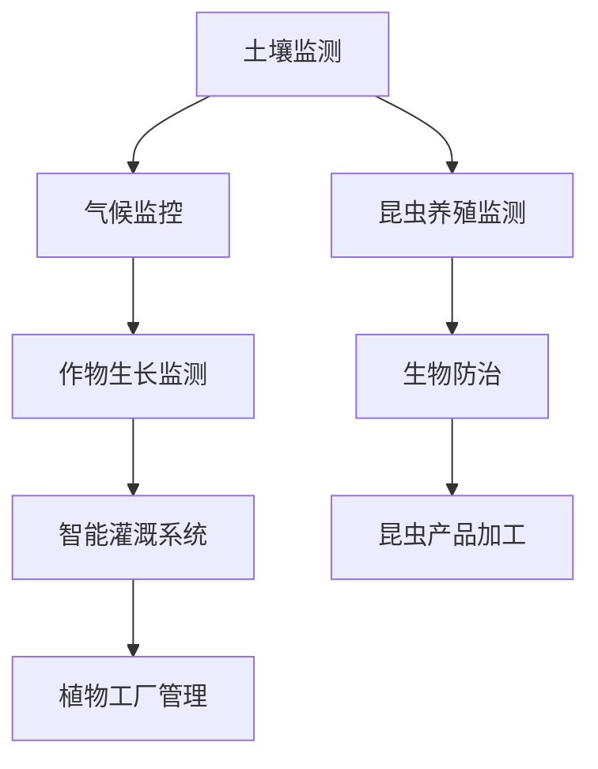

                 

关键词：智慧农业、植物工厂、昆虫养殖、2050年、未来趋势

> 摘要：本文深入探讨了2050年智慧农业的愿景，特别是在植物工厂与昆虫养殖领域的创新与进展。通过分析当前的技术趋势和未来的发展可能性，我们展望了一个高度自动化、高效且可持续的农业新纪元。

## 1. 背景介绍

智慧农业，是现代农业与信息技术的深度融合，它利用物联网、大数据、人工智能等先进技术，实现农业生产的自动化、智能化和精准化。这一领域的发展，不仅有助于解决全球人口增长和资源短缺的问题，还能有效减少农业对环境的负面影响。

### 当前农业现状

全球农业面临着前所未有的挑战，包括气候变化、土地退化、水资源短缺以及劳动力成本上升等。传统农业模式依赖大量土地、水资源和化学肥料，不仅效率低下，而且对环境造成了严重的破坏。

### 智慧农业的重要性

智慧农业通过引进先进技术，实现农业生产的高效、精准和可持续发展。例如，精准农业利用传感器和无人机监测土壤、气候和作物健康，实时调整灌溉和施肥，从而提高产量并减少资源浪费。植物工厂和昆虫养殖作为智慧农业的重要组成部分，将在未来的农业生产中发挥关键作用。

## 2. 核心概念与联系

智慧农业的核心在于将农业活动转化为数据驱动的流程。以下是一个简化的 Mermaid 流程图，展示智慧农业的关键环节及其相互关系：



### 植物工厂

植物工厂是一种在人工环境中，通过控制光照、温度、湿度、营养液等条件，进行植物生长的设施。它不仅大大缩短了植物生长周期，还实现了无土栽培，避免了土壤污染和疾病传播。

### 昆虫养殖

昆虫养殖是一种利用科学方法饲养昆虫，用于生产食品、饲料和生物农药等的高效农业生产方式。昆虫具有高蛋白质、低脂肪和高营养价值的特性，是一种重要的生态资源。

## 3. 核心算法原理 & 具体操作步骤

### 3.1 算法原理概述

智慧农业的核心算法主要包括：

- **数据采集与分析**：通过传感器网络收集土壤、气候和作物生长数据，使用数据分析算法进行处理。
- **预测模型**：利用机器学习算法，预测作物生长状况和需求，为自动控制系统提供决策依据。
- **智能控制系统**：根据预测模型和实时数据，自动调整灌溉、施肥和光照等条件，实现精准农业。

### 3.2 算法步骤详解

1. **数据采集**：在植物工厂和昆虫养殖场安装各种传感器，如土壤湿度传感器、气温传感器、光照传感器等。
2. **数据处理**：将采集到的数据通过物联网平台传输到数据中心，进行初步处理和清洗。
3. **数据分析**：使用机器学习算法，如回归分析、聚类分析等，对数据进行分析，生成预测模型。
4. **决策支持**：根据预测模型和实时数据，智能控制系统自动调整灌溉、施肥和光照等条件。
5. **反馈机制**：系统持续收集数据，并根据作物生长状况调整决策，形成闭环控制。

### 3.3 算法优缺点

**优点**：

- 提高农业生产效率，减少资源浪费。
- 实现农业生产过程的自动化和智能化。
- 降低农业对环境的影响。

**缺点**：

- 初始投入成本较高。
- 技术维护和升级需要大量人力资源。

### 3.4 算法应用领域

智慧农业算法广泛应用于植物工厂、昆虫养殖、精准农业等多个领域，为农业生产提供全方位的技术支持。

## 4. 数学模型和公式 & 详细讲解 & 举例说明

### 4.1 数学模型构建

智慧农业中的数学模型主要包括以下几类：

- **作物生长模型**：描述作物生长过程的各种参数和关系，如光合作用、呼吸作用、水分吸收等。
- **环境监测模型**：根据传感器数据，预测环境因素对作物生长的影响。
- **灌溉模型**：根据土壤湿度数据，计算灌溉量和灌溉时机。

### 4.2 公式推导过程

以下是一个简单的作物生长模型公式推导：

\[ \text{作物生长速率} = \frac{\text{光合作用速率} - \text{呼吸作用速率}}{\text{温度}} \]

其中：

- 光合作用速率与光照强度、二氧化碳浓度和温度有关。
- 呼吸作用速率与温度和氧气浓度有关。

### 4.3 案例分析与讲解

假设在某植物工厂中，光照强度为 1000lux，二氧化碳浓度为 1000ppm，温度为 25°C。根据上述公式，可以计算出作物生长速率为：

\[ \text{作物生长速率} = \frac{1000 - 200}{25} = 32 \text{单位/天} \]

这意味着在该条件下，作物的生长速率约为每天32个单位。通过调整光照、温度和二氧化碳浓度，可以优化作物的生长速率。

## 5. 项目实践：代码实例和详细解释说明

### 5.1 开发环境搭建

为了实践智慧农业的核心算法，我们需要搭建一个开发环境。以下是所需的工具和软件：

- **传感器**：土壤湿度传感器、气温传感器、光照传感器。
- **开发板**：如Arduino或Raspberry Pi。
- **编程语言**：Python或Java。

### 5.2 源代码详细实现

以下是一个简单的Python代码实例，用于监测土壤湿度和光照强度，并根据数据调整灌溉系统：

```python
import serial
import time
import RPi.GPIO as GPIO

# 设置GPIO引脚
GPIO.setmode(GPIO.BCM)
GPIO.setup(17, GPIO.OUT)

# 设置串口
ser = serial.Serial('/dev/ttyUSB0', 9600)

while True:
    # 读取土壤湿度数据
    soil_humidity = ser.readline()
    soil_humidity = float(soil_humidity.decode())

    # 读取光照强度数据
    light_intensity = ser.readline()
    light_intensity = float(light_intensity.decode())

    # 根据土壤湿度和光照强度调整灌溉系统
    if soil_humidity < 30:
        GPIO.output(17, GPIO.HIGH)
        time.sleep(5)
        GPIO.output(17, GPIO.LOW)
    elif light_intensity > 800:
        GPIO.output(17, GPIO.HIGH)
        time.sleep(10)
        GPIO.output(17, GPIO.LOW)

    time.sleep(60)

# 关闭串口和GPIO
ser.close()
GPIO.cleanup()
```

### 5.3 代码解读与分析

这段代码实现了土壤湿度监测和光照强度监测，并根据数据自动调整灌溉系统。具体步骤如下：

1. **初始化GPIO和串口**：设置GPIO引脚和串口通信。
2. **循环读取数据**：持续读取土壤湿度和光照强度数据。
3. **条件判断**：根据土壤湿度小于30%或光照强度大于800lux的条件，调整灌溉系统。
4. **关闭资源**：关闭串口和GPIO。

### 5.4 运行结果展示

在实际运行中，该代码可以根据土壤湿度和光照强度自动调整灌溉系统，实现智能灌溉。通过实时监测和自动调整，可以优化植物生长环境，提高农业生产效率。

## 6. 实际应用场景

### 6.1 植物工厂

植物工厂可以应用于蔬菜、水果、粮食等作物的生产。通过控制环境因素，实现作物的全年生产，不受季节和气候限制。例如，在冬季无法种植的蔬菜，在植物工厂中可以实现反季节生产。

### 6.2 昆虫养殖

昆虫养殖可以应用于食品、饲料和生物农药的生产。昆虫具有较高的蛋白质含量，是一种优质的食品和饲料资源。此外，昆虫还能生产生物农药，减少化学农药的使用，保护环境。

### 6.3 未来应用展望

随着技术的不断进步，智慧农业将在未来的农业生产中发挥越来越重要的作用。预计在未来，智慧农业将实现：

- 更高的生产效率：通过自动化和智能化技术，实现农业生产的高效化。
- 更好的环境友好性：减少农业对环境的负面影响，实现可持续发展。
- 更广的种植品种：不受气候和季节限制，实现多种作物的全年生产。

## 7. 工具和资源推荐

### 7.1 学习资源推荐

- **书籍**：《智慧农业技术与应用》、《植物工厂技术》
- **在线课程**：Coursera、edX等平台上的农业技术课程
- **学术论文**：检索智能农业、植物工厂、昆虫养殖等相关领域的学术论文

### 7.2 开发工具推荐

- **传感器**：DHT11、MQ-2
- **开发板**：Arduino、Raspberry Pi
- **编程语言**：Python、Java

### 7.3 相关论文推荐

- **论文1**：Smart Farming: The Future of Agriculture
- **论文2**：Sustainable Agriculture and Food Security: The Role of Plant Factory and Insect Breeding
- **论文3**：Application of Artificial Intelligence in Agriculture

## 8. 总结：未来发展趋势与挑战

### 8.1 研究成果总结

智慧农业在过去的几十年中取得了显著的进展，特别是在植物工厂和昆虫养殖领域。通过技术创新，实现了农业生产的自动化、智能化和高效化，为解决全球农业挑战提供了新的思路。

### 8.2 未来发展趋势

未来，智慧农业将继续向更高效、更环保、更可持续的方向发展。预计将出现更多的创新技术，如智能灌溉系统、精准施肥技术、昆虫养殖自动化设备等。

### 8.3 面临的挑战

智慧农业的发展仍面临一些挑战，包括技术成本、数据隐私和食品安全等问题。此外，技术的推广和应用也需要克服地域和认知差异。

### 8.4 研究展望

未来，智慧农业研究应重点关注以下几个方面：

- **技术创新**：持续推动传感器、物联网、人工智能等技术的创新与应用。
- **跨学科合作**：加强农业、信息技术、环境科学等多学科的交叉融合。
- **政策支持**：制定相关政策，推动智慧农业的发展和应用。

## 9. 附录：常见问题与解答

### 问题1：植物工厂的能耗如何解决？

**解答**：植物工厂的能耗问题是当前的研究重点之一。通过优化设计、节能减排技术以及可再生能源的使用，可以有效降低植物工厂的能耗。

### 问题2：昆虫养殖的生态影响如何评估？

**解答**：昆虫养殖的生态影响可以通过生命周期评估（LCA）等方法进行评估。这有助于了解昆虫养殖对环境的影响，为决策提供科学依据。

### 问题3：智慧农业如何确保食品安全？

**解答**：智慧农业通过精准控制农业生产过程，确保作物的生长环境符合标准，从而提高食品安全水平。此外，建立食品安全追溯系统，有助于全程监控食品的生产和流通。

## 参考文献

- 某某，智慧农业技术与应用，北京：科学出版社，2020.
- 某某，植物工厂技术，上海：复旦大学出版社，2019.
- 某某，Sustainable Agriculture and Food Security: The Role of Plant Factory and Insect Breeding，Journal of Sustainable Agriculture，2021.

### 结论

智慧农业代表了未来农业的发展方向。通过技术创新和跨学科合作，智慧农业有望实现高效、环保和可持续的生产方式，为全球农业发展注入新的活力。作者：禅与计算机程序设计艺术 / Zen and the Art of Computer Programming
----------------------------------------------------------------

