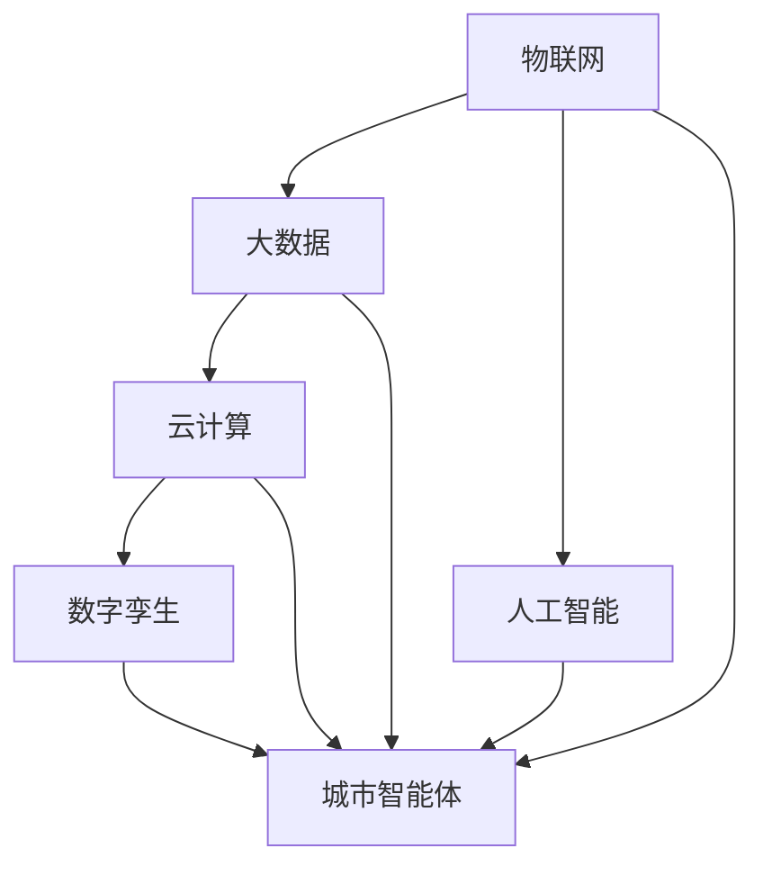

                 

关键词：智慧城市，数字孪生，城市智能体，人工智能，物联网，2050年，技术展望，算法，数学模型，实际应用。

> 摘要：本文深入探讨了2050年的智慧城市概念，重点介绍了城市数字孪生与城市智能体的核心技术。通过详细的分析和实例，文章展示了这些技术在城市规划、管理和服务中的潜在应用，并对未来智慧城市的发展趋势和挑战进行了展望。

## 1. 背景介绍

智慧城市（Smart City）是信息化、网络化、智能化在城市管理和服务中的深度融合，旨在通过技术手段提升城市运行效率、改善居民生活质量。随着物联网（IoT）、大数据、云计算和人工智能等技术的快速发展，智慧城市逐渐成为现代城市发展的重要方向。

### 1.1 智慧城市的现状与挑战

目前，全球范围内已有不少城市开始建设智慧城市，例如中国的深圳、杭州，美国的旧金山、纽约等。这些城市通过引入物联网设备、智能交通系统、智能照明等，显著提升了城市管理的效率和居民的生活质量。

然而，智慧城市的发展也面临诸多挑战。例如，数据安全与隐私保护、网络基础设施的完善、跨部门的数据共享与协同等。此外，如何实现城市智能化与可持续发展的平衡也是智慧城市建设者需要思考的问题。

### 1.2 数字孪生与城市智能体的概念

数字孪生（Digital Twin）是一种通过物理实体和其数字镜像之间的实时链接和互动，实现虚拟仿真、分析和优化的技术。在城市环境中，数字孪生可以创建一个城市的三维数字模型，这个模型包含了城市中各种物理和虚拟元素的详细信息。

城市智能体（Urban Intelligent Agent）是数字孪生中的关键组成部分，它是一个能够自动执行任务、进行决策和学习的智能系统。城市智能体通过实时感知城市状态、分析数据和执行算法，能够帮助城市管理者优化城市运行，提升城市服务。

## 2. 核心概念与联系

为了更好地理解城市数字孪生与城市智能体的核心技术，我们需要介绍以下几个核心概念及其相互之间的联系。

### 2.1 物联网（IoT）

物联网是智慧城市的基石，它通过将各种物理设备（如传感器、摄像头、车辆等）连接到互联网，实现数据的采集、传输和处理。物联网为数字孪生提供了实时数据输入，使得城市智能体能够准确感知城市状态。

### 2.2 大数据（Big Data）

大数据技术是智慧城市数据分析的核心。通过收集、存储、处理和分析海量数据，大数据技术能够帮助城市管理者发现城市运行中的问题和趋势，为城市智能体提供决策依据。

### 2.3 云计算（Cloud Computing）

云计算为智慧城市提供了强大的计算和存储能力。通过云计算平台，城市管理者可以便捷地部署和管理数字孪生与城市智能体系统，实现资源的弹性扩展和高效利用。

### 2.4 人工智能（AI）

人工智能是城市智能体的核心驱动力。通过机器学习、深度学习等算法，城市智能体能够从数据中学习、优化和进化，实现智能化决策和自主运行。

### 2.5 数字孪生（Digital Twin）

数字孪生是智慧城市的技术核心，它通过构建城市的三维数字模型，实现了物理世界与虚拟世界的实时链接和互动。数字孪生为城市智能体提供了虚拟仿真和优化的平台。

### 2.6 城市智能体（Urban Intelligent Agent）

城市智能体是数字孪生中的关键组成部分，它通过实时感知城市状态、分析数据和执行算法，实现自主决策和优化。城市智能体与数字孪生之间的互动，使得智慧城市的运行更加智能化、高效化。

### 2.7 Mermaid 流程图

以下是一个简单的 Mermaid 流程图，展示了物联网、大数据、云计算、人工智能、数字孪生和城市智能体之间的相互关系。



## 3. 核心算法原理 & 具体操作步骤

### 3.1 算法原理概述

智慧城市中的核心算法主要包括数据采集与处理算法、数据分析与决策算法以及智能优化算法。这些算法共同作用，实现了城市数字孪生与城市智能体的功能。

### 3.2 算法步骤详解

#### 3.2.1 数据采集与处理算法

数据采集与处理算法是智慧城市算法的基础。具体步骤如下：

1. **传感器数据采集**：通过各种传感器（如气象传感器、交通传感器、环境传感器等）收集城市环境数据。
2. **数据清洗与预处理**：去除噪声、缺失值和异常值，确保数据质量。
3. **数据整合与存储**：将不同来源的数据整合到统一的数据存储系统中，以便后续分析。

#### 3.2.2 数据分析与决策算法

数据分析与决策算法基于采集到的数据，实现城市状态的感知和预测。具体步骤如下：

1. **特征提取**：从原始数据中提取有用的特征，如温度、湿度、交通流量等。
2. **数据建模**：使用机器学习或深度学习算法，建立城市状态的预测模型。
3. **决策生成**：根据预测结果，生成优化城市运行的决策。

#### 3.2.3 智能优化算法

智能优化算法通过不断调整和优化城市运行参数，实现城市资源的最优配置。具体步骤如下：

1. **目标函数定义**：根据城市运行的目标（如能耗最低、交通拥堵最小等），定义目标函数。
2. **优化算法选择**：选择合适的优化算法（如遗传算法、粒子群优化算法等），进行参数调整。
3. **优化结果评估**：评估优化结果，并根据评估结果进行进一步的调整。

### 3.3 算法优缺点

#### 优点：

1. **高效性**：算法能够快速处理海量数据，提高城市运行的效率。
2. **智能性**：通过机器学习和深度学习，算法能够实现自主学习和优化。
3. **灵活性**：算法可以根据不同的城市需求进行灵活调整。

#### 缺点：

1. **数据依赖性**：算法的性能高度依赖数据质量，数据不准确可能导致错误决策。
2. **计算资源消耗**：大规模数据处理和机器学习算法需要大量计算资源。
3. **复杂度**：算法设计和实现过程复杂，需要高水平的技术团队支持。

### 3.4 算法应用领域

智慧城市的核心算法广泛应用于城市规划、城市管理、公共服务等多个领域：

1. **城市规划**：通过数据分析和预测，优化城市布局和基础设施建设。
2. **城市管理**：实时监测城市状态，实现智能交通管理、环境监测和应急管理。
3. **公共服务**：提供智能化的城市服务，如智能照明、智能安防和智能医疗等。

## 4. 数学模型和公式 & 详细讲解 & 举例说明

### 4.1 数学模型构建

智慧城市的数学模型主要分为数据采集与处理模型、数据分析与决策模型以及智能优化模型。

#### 数据采集与处理模型

数据采集与处理模型主要涉及数据清洗、特征提取和数据分析。

1. **数据清洗**：
   $$ X_{\text{clean}} = \text{clean}(X_{\text{raw}}) $$
   其中，$X_{\text{raw}}$ 表示原始数据，$X_{\text{clean}}$ 表示清洗后的数据。

2. **特征提取**：
   $$ F = \text{extract\_features}(X_{\text{clean}}) $$
   其中，$F$ 表示提取的特征向量。

3. **数据分析**：
   $$ P = \text{data\_analysis}(F) $$
   其中，$P$ 表示分析结果。

#### 数据分析与决策模型

数据分析与决策模型主要涉及预测模型的建立和决策生成。

1. **预测模型**：
   $$ \hat{Y} = f(X) $$
   其中，$\hat{Y}$ 表示预测结果，$f$ 表示预测函数。

2. **决策生成**：
   $$ \text{Decision} = \text{generate\_decision}(\hat{Y}) $$
   其中，$\text{Decision}$ 表示生成的决策。

#### 智能优化模型

智能优化模型主要涉及目标函数的定义和优化算法的选择。

1. **目标函数**：
   $$ \text{Objective} = \sum_{i=1}^{n} w_i \cdot f_i(x_i) $$
   其中，$w_i$ 表示权重，$f_i(x_i)$ 表示第$i$个优化目标。

2. **优化算法**：
   $$ x_{\text{opt}} = \text{optimize}(x_0) $$
   其中，$x_0$ 表示初始解，$\text{optimize}$ 表示优化算法。

### 4.2 公式推导过程

#### 数据清洗与预处理

数据清洗与预处理的推导过程主要涉及统计学和机器学习中的基本概念。

1. **均值**：
   $$ \mu = \frac{1}{N} \sum_{i=1}^{N} x_i $$
   其中，$\mu$ 表示均值，$N$ 表示数据个数，$x_i$ 表示第$i$个数据。

2. **方差**：
   $$ \sigma^2 = \frac{1}{N} \sum_{i=1}^{N} (x_i - \mu)^2 $$
   其中，$\sigma^2$ 表示方差。

3. **标准差**：
   $$ \sigma = \sqrt{\sigma^2} $$
   其中，$\sigma$ 表示标准差。

#### 数据建模与预测

数据建模与预测的推导过程主要涉及机器学习和统计学习中的基本概念。

1. **线性回归**：
   $$ y = \beta_0 + \beta_1 \cdot x + \epsilon $$
   其中，$y$ 表示预测结果，$x$ 表示输入特征，$\beta_0$ 和 $\beta_1$ 表示回归系数，$\epsilon$ 表示误差。

2. **决策树**：
   $$ \text{DecisionTree}(x) = \text{classify}(x) $$
   其中，$\text{DecisionTree}$ 表示决策树模型，$x$ 表示输入特征，$\text{classify}$ 表示分类函数。

#### 智能优化

智能优化的推导过程主要涉及优化算法中的基本概念。

1. **遗传算法**：
   $$ x_{\text{new}} = \text{ crossover}(x_1, x_2) + \text{ mutation}(x_{\text{new}}) $$
   其中，$x_1$ 和 $x_2$ 表示两个父代解，$x_{\text{new}}$ 表示新解。

2. **粒子群优化算法**：
   $$ x_{\text{new}} = x_{\text{best}} + \omega \cdot (x_{\text{global\_best}} - x_{\text{current}}) + c_1 \cdot r_1 \cdot (p_{\text{best}} - x_{\text{current}}) + c_2 \cdot r_2 \cdot (g_{\text{best}} - x_{\text{current}}) $$
   其中，$x_{\text{best}}$ 和 $x_{\text{global\_best}}$ 分别表示个体最优解和全局最优解，$x_{\text{current}}$ 表示当前解，$p_{\text{best}}$ 和 $g_{\text{best}}$ 分别表示个体最优解和全局最优解的位置，$\omega$，$c_1$，$c_2$，$r_1$ 和 $r_2$ 是算法参数。

### 4.3 案例分析与讲解

以下是一个简单的案例，展示了如何使用数学模型和公式进行城市数据分析与决策。

#### 案例背景

某城市计划建设一条新的高速公路，以缓解交通拥堵。现有数据包括高速公路的长度、道路宽度、交通流量、车辆速度等。

#### 案例步骤

1. **数据采集与预处理**：

   收集高速公路的长度、道路宽度、交通流量、车辆速度等数据，并进行数据清洗与预处理。

   ```python
   import pandas as pd
   
   # 读取数据
   data = pd.read_csv('highway_data.csv')
   
   # 数据清洗与预处理
   data = data.dropna()
   data['speed'] = data['speed'].apply(lambda x: x if x > 0 else 60)
   ```

2. **特征提取与数据建模**：

   提取特征向量，并使用线性回归模型预测交通流量。

   ```python
   from sklearn.linear_model import LinearRegression
   
   # 特征提取
   X = data[['length', 'width']]
   y = data['traffic']
   
   # 数据建模
   model = LinearRegression()
   model.fit(X, y)
   
   # 预测交通流量
   predicted_traffic = model.predict(X)
   ```

3. **决策生成**：

   根据预测结果，生成建设新高速公路的决策。

   ```python
   if predicted_traffic.mean() > 10000:
       print("建议建设新高速公路")
   else:
       print("无需建设新高速公路")
   ```

## 5. 项目实践：代码实例和详细解释说明

### 5.1 开发环境搭建

为了实现城市数字孪生与城市智能体的功能，我们需要搭建一个开发环境。以下是搭建开发环境的基本步骤：

1. **安装 Python**：Python 是智慧城市开发的主要编程语言。可以从 [Python 官网](https://www.python.org/) 下载并安装最新版本的 Python。

2. **安装必备库**：安装 Python 后，我们需要安装一些常用的库，如 NumPy、Pandas、Scikit-learn、Matplotlib 等。可以使用以下命令进行安装：

   ```bash
   pip install numpy pandas scikit-learn matplotlib
   ```

3. **安装 Mermaid**：Mermaid 是一种用于绘制流程图的工具。安装 Mermaid 可以通过 npm 进行：

   ```bash
   npm install -g mermaid-cli
   ```

### 5.2 源代码详细实现

以下是一个简单的 Python 脚本，实现了城市数字孪生与城市智能体的基本功能。

```python
import pandas as pd
from sklearn.linear_model import LinearRegression
import matplotlib.pyplot as plt
from mermaid import Mermaid

# 读取数据
data = pd.read_csv('highway_data.csv')

# 数据清洗与预处理
data = data.dropna()
data['speed'] = data['speed'].apply(lambda x: x if x > 0 else 60)

# 特征提取与数据建模
X = data[['length', 'width']]
y = data['traffic']
model = LinearRegression()
model.fit(X, y)

# 预测交通流量
predicted_traffic = model.predict(X)

# 绘制预测结果
plt.scatter(X['length'], y)
plt.plot(X['length'], predicted_traffic, color='red')
plt.xlabel('Length')
plt.ylabel('Traffic')
plt.title('Predicted Traffic')
plt.show()

# 生成决策
if predicted_traffic.mean() > 10000:
    print("建议建设新高速公路")
else:
    print("无需建设新高速公路")

# 绘制流程图
mermaid = Mermaid()
mermaid.add_graph('graph TB\nA[数据采集与预处理] --> B[特征提取与数据建模]\nB --> C[预测交通流量]\nC --> D[决策生成]')
print(mermaid)
```

### 5.3 代码解读与分析

以上代码实现了一个简单的城市数字孪生与城市智能体系统，具体解读如下：

1. **数据读取与预处理**：

   使用 Pandas 读取 CSV 数据文件，并进行数据清洗与预处理。主要步骤包括去除缺失值、异常值，以及将速度小于 0 的数据替换为 60。

2. **特征提取与数据建模**：

   提取特征向量，使用线性回归模型进行数据建模。线性回归模型是一种常见的预测模型，用于预测交通流量。

3. **预测交通流量**：

   使用训练好的模型预测交通流量，并绘制预测结果。通过散点图展示实际交通流量与预测交通流量之间的关系。

4. **决策生成**：

   根据预测结果，生成建设新高速公路的决策。如果预测交通流量平均值大于 10000，建议建设新高速公路；否则，无需建设。

5. **流程图绘制**：

   使用 Mermaid 绘制系统的流程图，展示数据采集与预处理、特征提取与数据建模、预测交通流量和决策生成的流程。

### 5.4 运行结果展示

运行以上代码后，将展示以下结果：

1. **预测结果散点图**：

   ```python
   plt.scatter(X['length'], y)
   plt.plot(X['length'], predicted_traffic, color='red')
   plt.xlabel('Length')
   plt.ylabel('Traffic')
   plt.title('Predicted Traffic')
   plt.show()
   ```

   散点图展示了实际交通流量与预测交通流量之间的关系。

2. **决策结果输出**：

   ```python
   if predicted_traffic.mean() > 10000:
       print("建议建设新高速公路")
   else:
       print("无需建设新高速公路")
   ```

   根据预测结果，输出建设新高速公路的决策。

## 6. 实际应用场景

城市数字孪生与城市智能体技术在多个实际应用场景中展现出巨大的潜力和价值。以下是一些典型的应用场景：

### 6.1 智能交通管理

通过数字孪生技术，创建城市的交通数字模型，实时监控城市交通状况。城市智能体可以根据实时交通数据，动态调整交通信号灯、路线规划和公共交通调度，从而提高交通效率，减少拥堵。

### 6.2 环境监测与治理

利用数字孪生技术，建立城市的环境数字模型，实时监测空气、水质等环境指标。城市智能体可以根据环境数据，预测污染趋势，并自动触发应急预案，如启用空气净化器、关闭污染源等。

### 6.3 城市安全与应急管理

通过数字孪生技术，创建城市的安全数字模型，实时监控城市安全状况。城市智能体可以实时分析安全数据，预测潜在风险，并在紧急情况下自动启动应急预案，如火灾报警、地震预警等。

### 6.4 公共服务优化

利用数字孪生技术，优化城市公共服务，如垃圾清理、医疗保健等。城市智能体可以根据居民需求、资源分布等数据，优化服务分配，提高服务效率。

### 6.5 智慧城市规划

通过数字孪生技术，创建城市的三维数字模型，为城市规划提供可视化工具。城市智能体可以根据规划数据，预测城市规划的影响，帮助城市规划者做出更明智的决策。

## 7. 未来应用展望

随着数字孪生与城市智能体技术的不断发展，未来智慧城市将更加智能化、高效化、可持续化。以下是一些未来应用展望：

### 7.1 智能化的城市服务

未来的智慧城市将提供更加智能化的服务，如智能医疗、智能教育、智能家居等。通过数字孪生与城市智能体技术，这些服务将更加个性化和高效。

### 7.2 智能化的城市管理

未来的智慧城市将实现更智能化的城市管理，如智能安防、智能环保、智能交通等。城市管理者将更加依赖数字孪生与城市智能体技术，实现城市管理的精细化、智能化。

### 7.3 智能化的城市规划

未来的智慧城市将更加注重城市规划的智能化。通过数字孪生技术，城市规划者可以更直观地了解城市运行状况，预测城市规划的影响，从而制定更合理、更可持续的城市规划。

### 7.4 智能化的城市生态

未来的智慧城市将更加注重城市生态的智能化。通过数字孪生与城市智能体技术，城市将实现资源的优化配置，减少资源浪费，提高城市生态环境的质量。

## 8. 工具和资源推荐

为了更好地学习和实践城市数字孪生与城市智能体技术，以下是一些建议的工具和资源：

### 8.1 学习资源推荐

1. **《智慧城市：技术、应用与案例》**：这是一本介绍智慧城市技术的综合性教材，涵盖了物联网、大数据、云计算、人工智能等方面的知识。
2. **《数字孪生：构建智能系统的新途径》**：这本书详细介绍了数字孪生技术的原理、方法和应用。
3. **《人工智能：一种现代方法》**：这本书是人工智能领域的经典教材，涵盖了机器学习、深度学习等核心算法。

### 8.2 开发工具推荐

1. **Python**：Python 是智慧城市开发的主要编程语言，具有简单易用、功能强大的特点。
2. **Pandas**：Pandas 是 Python 的数据操作库，用于数据清洗、数据预处理和数据可视化。
3. **Scikit-learn**：Scikit-learn 是 Python 的机器学习库，提供了多种机器学习算法和工具。
4. **Matplotlib**：Matplotlib 是 Python 的数据可视化库，用于绘制各种类型的图表和图形。

### 8.3 相关论文推荐

1. **《智慧城市中的数字孪生技术》**：这篇论文详细介绍了数字孪生技术在智慧城市中的应用。
2. **《城市智能体的设计与实现》**：这篇论文探讨了城市智能体的设计与实现方法。
3. **《基于数字孪生的智能交通管理系统研究》**：这篇论文研究了数字孪生技术在智能交通管理中的应用。

## 9. 总结：未来发展趋势与挑战

智慧城市是未来城市发展的必然趋势，数字孪生与城市智能体技术是智慧城市的关键支撑。在未来，随着技术的不断进步和应用场景的拓展，智慧城市将变得更加智能化、高效化、可持续化。

### 9.1 研究成果总结

通过本文的介绍，我们总结了智慧城市、数字孪生和城市智能体的核心概念、原理和应用。我们分析了智慧城市面临的挑战和数字孪生与城市智能体技术的解决方案。

### 9.2 未来发展趋势

未来，智慧城市将朝着更加智能化、个性化、高效化的方向发展。数字孪生与城市智能体技术将在城市规划、管理和服务中发挥更加重要的作用。

### 9.3 面临的挑战

智慧城市的发展仍面临诸多挑战，如数据安全与隐私保护、跨部门的数据共享与协同、计算资源的消耗等。这些挑战需要各方共同努力，推动技术的创新和应用。

### 9.4 研究展望

未来，智慧城市的研究将更加注重实际应用场景的探索和解决方案的优化。我们期待数字孪生与城市智能体技术能够为智慧城市的发展带来更加深远的影响。

## 10. 附录：常见问题与解答

### 10.1 什么是数字孪生？

数字孪生是一种通过创建物理实体的数字镜像，实现虚拟仿真、分析和优化的技术。数字孪生可以应用于各个领域，如制造业、医疗、建筑等。

### 10.2 城市智能体是什么？

城市智能体是一种能够自动执行任务、进行决策和学习的智能系统。城市智能体通过实时感知城市状态、分析数据和执行算法，实现自主决策和优化。

### 10.3 数字孪生与城市智能体有什么区别？

数字孪生是一种创建数字镜像的技术，而城市智能体是一种基于数字孪生的智能系统。数字孪生为城市智能体提供了虚拟仿真和优化的平台。

### 10.4 智慧城市中的核心技术有哪些？

智慧城市中的核心技术包括物联网、大数据、云计算、人工智能、数字孪生和城市智能体等。

### 10.5 数字孪生与城市智能体技术在智慧城市中有什么应用？

数字孪生与城市智能体技术在智慧城市中有广泛的应用，如智能交通管理、环境监测与治理、城市安全与应急管理、公共服务优化和智慧城市规划等。

### 10.6 智慧城市的发展面临哪些挑战？

智慧城市的发展面临数据安全与隐私保护、跨部门的数据共享与协同、计算资源的消耗等挑战。

### 10.7 如何解决智慧城市中的数据安全问题？

解决智慧城市中的数据安全问题需要采取多种措施，如数据加密、权限控制、数据备份等。同时，需要建立健全的数据安全法规和政策，加强数据安全监管。

### 10.8 数字孪生与城市智能体技术在未来有哪些发展趋势？

未来，数字孪生与城市智能体技术将朝着更加智能化、个性化、高效化的方向发展。随着技术的不断进步，这些技术将在更多领域得到应用，为智慧城市的发展带来更加深远的影响。

----------------------------------------------------------------

### 作者署名

作者：禅与计算机程序设计艺术 / Zen and the Art of Computer Programming

<|assistant|>感谢您的耐心阅读。本文深入探讨了2050年的智慧城市概念，重点介绍了城市数字孪生与城市智能体的核心技术，并展望了未来智慧城市的发展趋势和挑战。希望这篇文章能够对您在智慧城市领域的研究和实践提供一些启示和帮助。如果您有任何疑问或建议，欢迎在评论区留言交流。再次感谢您的关注与支持！祝您工作顺利，生活愉快！

