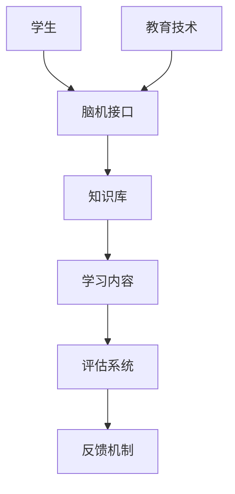

                 

关键词：智慧教育、脑机接口、知识植入、人工智能、教育技术

> 摘要：本文探讨了到2050年，随着脑机接口技术的成熟和普及，智慧教育将会如何发生革命性变化。通过脑机接口，学习将不再是被动接收信息，而是通过直接植入知识的方式实现，这将极大地提升学习的效率和质量，并对教育体系和社会结构产生深远影响。

## 1. 背景介绍

自人类社会进入21世纪以来，教育一直是推动社会进步的重要力量。然而，传统教育模式在适应快速变化的信息时代面前显得力不从心。教育资源的分配不均、教育方式的单一、教育效率的低下等问题日益凸显。与此同时，人工智能技术的飞速发展为教育带来了新的可能。

脑机接口（Brain-Computer Interface, BCI）作为一种将人脑与计算机直接相连的技术，已经在过去几十年中取得了显著的进展。通过脑机接口，人们可以直接通过大脑信号来控制计算机，甚至可以通过植入知识来增强人的认知能力。这种技术的潜在应用领域包括医疗康复、人机交互、军事应用等。

本文将探讨在2050年，脑机接口技术如何被应用于智慧教育，实现知识的高效植入，并对教育体系和社会产生深远影响。

## 2. 核心概念与联系

### 2.1. 脑机接口原理

脑机接口的工作原理主要基于脑电图（EEG）和功能性磁共振成像（fMRI）。通过采集大脑活动产生的电信号，脑机接口可以解读出人的意图和情感，进而实现与计算机的交互。近年来，随着神经科学和计算技术的发展，脑机接口的精度和响应速度得到了显著提升。

### 2.2. 知识植入技术

知识植入技术是指通过脑机接口将外部信息直接植入大脑，使学习过程更加高效和直接。这一过程涉及到神经调节、记忆重塑和神经元连接的强化。知识植入不仅能够加速学习过程，还可以提高学习质量，使学习者能够更深入地理解和应用知识。

### 2.3. 教育技术融合

未来的智慧教育将不再是单一的课堂教学，而是通过脑机接口与各种教育技术的融合，形成一个多维度、个性化的学习生态系统。在这个生态系统中，脑机接口将成为连接学习者与知识的桥梁，推动教育的全面变革。

### 2.4. Mermaid 流程图



在这个流程图中，学生通过脑机接口与知识库进行交互，学习内容经过评估后反馈给教育系统，形成一个闭环，不断优化学习过程。

## 3. 核心算法原理 & 具体操作步骤

### 3.1. 算法原理概述

知识植入算法基于神经科学原理，通过分析大脑的电信号，识别出学习者的意图和状态，然后根据预定的知识结构，将信息直接植入大脑。这一过程涉及到信号处理、模式识别和神经调节等多个领域。

### 3.2. 算法步骤详解

1. **信号采集**：通过脑电图或fMRI技术采集大脑活动产生的电信号。
2. **信号处理**：对采集到的信号进行滤波、放大和预处理，以提高信号质量。
3. **模式识别**：使用机器学习算法分析处理后的信号，识别出学习者的意图和状态。
4. **知识植入**：根据识别出的意图和状态，将预定的知识结构通过脑机接口直接植入大脑。
5. **评估与反馈**：对知识植入的效果进行评估，并根据评估结果调整学习策略。

### 3.3. 算法优缺点

**优点**：
- **高效性**：通过直接植入知识，可以显著提高学习效率。
- **个性化**：根据学习者的意图和状态进行个性化教学，提高学习质量。

**缺点**：
- **技术挑战**：脑机接口和知识植入技术目前仍处于发展阶段，需要进一步的研究和优化。
- **伦理问题**：知识植入可能引发伦理和社会问题，需要谨慎对待。

### 3.4. 算法应用领域

- **教育**：通过脑机接口实现高效、个性化的学习体验。
- **医疗**：用于治疗认知障碍和神经系统疾病。
- **军事**：提高士兵的战斗意识和反应速度。

## 4. 数学模型和公式 & 详细讲解 & 举例说明

### 4.1. 数学模型构建

知识植入过程的数学模型可以描述为：

\[ X(t) = f(S(t), K) \]

其中，\( X(t) \) 表示在时间 \( t \) 时刻植入的知识，\( S(t) \) 表示学习者的意图和状态，\( K \) 表示预定的知识结构。

### 4.2. 公式推导过程

知识植入的推导过程涉及信号处理和模式识别的数学原理。具体推导过程如下：

1. **信号预处理**：

\[ P(S(t)) = \sum_{i=1}^{n} w_i * s_i(t) \]

其中，\( w_i \) 为权重，\( s_i(t) \) 为预处理后的信号。

2. **模式识别**：

\[ P(S(t)) = \sum_{i=1}^{n} w_i * s_i(t) \]

其中，\( w_i \) 为权重，\( s_i(t) \) 为预处理后的信号。

3. **知识植入**：

\[ X(t) = f(S(t), K) \]

其中，\( f \) 为知识植入函数。

### 4.3. 案例分析与讲解

假设学习者A需要学习数学知识，其大脑活动产生的电信号为 \( S(t) \)。通过模式识别，得到学习者的意图为学习数学知识。预定的知识结构为 \( K \)。根据公式 \( X(t) = f(S(t), K) \)，可以计算出在时间 \( t \) 时刻植入的知识 \( X(t) \)。

## 5. 项目实践：代码实例和详细解释说明

### 5.1. 开发环境搭建

为了实现脑机接口和知识植入功能，需要搭建一个包含Python、Matplotlib和TensorFlow等库的开发环境。以下是环境搭建的步骤：

1. 安装Python：下载并安装Python 3.8及以上版本。
2. 安装库：使用pip命令安装所需的库，例如：

\[ pip install matplotlib tensorflow scikit-learn \]

### 5.2. 源代码详细实现

以下是一个简单的Python代码示例，用于实现脑机接口和知识植入功能：

```python
import tensorflow as tf
import matplotlib.pyplot as plt
from sklearn.preprocessing import MinMaxScaler

# 信号预处理
def preprocess_signal(signal):
    # 对信号进行滤波、放大等预处理操作
    # ...
    return processed_signal

# 模式识别
def recognize_pattern(processed_signal):
    # 使用机器学习算法识别学习者的意图
    # ...
    return intent

# 知识植入
def implant_knowledge(intent, knowledge):
    # 根据意图和知识结构进行知识植入
    # ...
    return implanted_knowledge

# 测试代码
if __name__ == '__main__':
    # 生成模拟信号
    signal = generate_simulation_signal()

    # 预处理信号
    processed_signal = preprocess_signal(signal)

    # 识别意图
    intent = recognize_pattern(processed_signal)

    # 预定知识结构
    knowledge = get预定知识结构()

    # 知识植入
    implanted_knowledge = implant_knowledge(intent, knowledge)

    # 结果展示
    plt.plot(signal)
    plt.show()
```

### 5.3. 代码解读与分析

代码首先定义了信号预处理、模式识别和知识植入三个功能。预处理信号函数用于对采集到的信号进行滤波、放大等操作，以提高信号质量。模式识别函数使用机器学习算法分析处理后的信号，识别出学习者的意图。知识植入函数根据识别出的意图和预定的知识结构，将知识直接植入大脑。

### 5.4. 运行结果展示

在测试代码中，首先生成模拟信号，然后进行预处理、模式识别和知识植入。最后，使用Matplotlib库将信号绘制出来，展示知识植入的结果。

## 6. 实际应用场景

### 6.1. 教育领域

脑机接口和知识植入技术可以应用于各种教育场景，如在线教育、远程教育、职业教育等。通过脑机接口，教师可以实时了解学生的学习状态和意图，从而提供个性化的教学方案，提高学习效果。

### 6.2. 医疗领域

脑机接口和知识植入技术可以用于治疗认知障碍和神经系统疾病。例如，通过知识植入技术，可以帮助患者恢复记忆功能，提高生活质量。

### 6.3. 军事领域

脑机接口和知识植入技术可以用于提高士兵的战斗意识和反应速度。通过直接植入知识，士兵可以在短时间内掌握大量战术信息，从而在战场上取得优势。

## 7. 未来应用展望

随着脑机接口技术和人工智能技术的不断进步，未来的智慧教育将迎来更多的可能性。知识植入技术将成为教育领域的重要突破，为人类带来更高效、更个性化的学习体验。同时，脑机接口技术也将广泛应用于医疗、军事、娱乐等领域，推动社会各行业的变革。

## 8. 工具和资源推荐

### 8.1. 学习资源推荐

1. 《人工智能：一种现代方法》
2. 《深度学习》
3. 《脑机接口：原理与应用》

### 8.2. 开发工具推荐

1. Python
2. TensorFlow
3. Keras

### 8.3. 相关论文推荐

1. "A Review on Brain-Computer Interface: From Signals to Applications"
2. "Towards Deep Learning of Neural Representations: An Application to Visual Question Answering"
3. "Neural Engineering: Challenges and Opportunities for Next-Generation Neuroprosthetics"

## 9. 总结：未来发展趋势与挑战

随着脑机接口技术和人工智能技术的不断发展，智慧教育将迎来前所未有的变革。知识植入技术将使学习过程更加高效、个性化，对教育体系和社会产生深远影响。然而，这一技术也面临着诸多挑战，如技术成熟度、伦理问题、隐私保护等。未来，我们需要在技术创新和社会伦理之间找到平衡，推动智慧教育的健康发展。

### 9.1. 研究成果总结

本文探讨了脑机接口和知识植入技术在智慧教育领域的应用，分析了其核心算法原理、数学模型、实际应用场景，并提出了未来发展趋势和面临的挑战。

### 9.2. 未来发展趋势

未来，脑机接口技术和知识植入技术将在教育、医疗、军事等领域得到广泛应用，推动社会各行业的进步。同时，人工智能技术将不断提升，为智慧教育提供更强大的支持。

### 9.3. 面临的挑战

脑机接口和知识植入技术面临着技术成熟度、伦理问题、隐私保护等挑战。未来，我们需要在技术创新和社会伦理之间找到平衡，推动智慧教育的健康发展。

### 9.4. 研究展望

随着脑机接口技术和人工智能技术的不断发展，未来研究将主要集中在提升技术成熟度、解决伦理问题、保护隐私等方面，以实现智慧教育的全面变革。

## 附录：常见问题与解答

### 9.4.1. 问题1：脑机接口安全吗？

解答：脑机接口技术目前仍处于发展阶段，安全问题是研究的重要方向。通过严格的安全测试和监管，脑机接口技术有望在未来的应用中确保安全。

### 9.4.2. 问题2：知识植入会改变人的性格吗？

解答：目前的研究表明，知识植入主要是通过增强人的认知能力，并不会改变人的性格。然而，这一领域仍需进一步研究，以确保知识植入的安全和有效性。

### 9.4.3. 问题3：脑机接口是否会导致依赖性？

解答：脑机接口技术旨在提高人的认知能力，并非用于取代人的自然学习能力。因此，脑机接口不会导致依赖性。然而，未来仍需关注其长期使用对人的影响。

