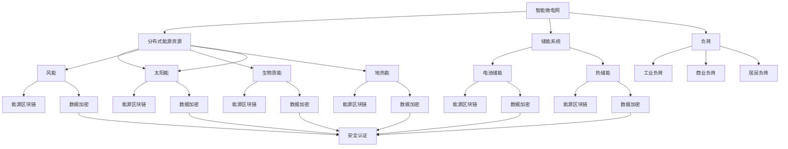

                 

关键词：智慧能源、智能微电网、能源区块链、2050年、技术创新、可持续发展、人工智能、物联网、可再生能源

> 摘要：本文探讨了2050年的智慧能源系统，特别是智能微电网与能源区块链的结合。通过分析这些新兴技术的核心概念、算法原理、数学模型及实际应用，探讨了智慧能源系统的发展趋势和面临的挑战，为未来智慧能源的研究和应用提供了新的思路。

## 1. 背景介绍

随着全球能源消耗的持续增长和环境保护意识的增强，智慧能源系统作为一种可持续的能源解决方案，受到了广泛关注。智慧能源系统结合了可再生能源、智能电网、物联网和区块链等先进技术，旨在实现能源的高效利用、可靠传输和灵活管理。

智能微电网是一种基于分布式能源资源的电力系统，它通过智能控制、能源管理和信息通信技术，实现了对分布式电源、储能系统和负荷的高效管理。能源区块链则利用区块链技术的去中心化、安全性和透明性等特点，为能源交易、认证和供应链管理提供了新的解决方案。

本文将重点关注智能微电网与能源区块链的结合，探讨其在2050年的未来应用，并分析其潜在的技术挑战和发展趋势。

### 1.1 智能微电网的概念

智能微电网是一种小型的、分布式的电力系统，它由多个分布式能源资源、储能系统和负荷组成。这些分布式能源资源包括太阳能、风能、生物质能和地热能等可再生能源，以及小型化石燃料电站等非可再生能源。

智能微电网的核心特点是能够实现自我控制、自我优化和自我恢复，通过智能控制算法，实现对分布式能源资源、储能系统和负荷的实时监测和动态管理。这种分布式电力系统能够提高能源利用效率，降低能源成本，并减少对环境的影响。

### 1.2 能源区块链的概念

能源区块链是一种利用区块链技术的能源管理系统，它通过区块链的去中心化、不可篡改和透明性等特点，实现了能源交易、认证和供应链管理的安全、高效和可靠。

能源区块链的核心功能包括能源交易记录的不可篡改、能源数据的安全共享、能源供应链的可追溯性以及智能合约的自动化执行。这些功能不仅提高了能源系统的透明度和安全性，还降低了能源交易的成本，提高了能源利用效率。

## 2. 核心概念与联系

### 2.1 核心概念原理

智能微电网与能源区块链的结合，旨在实现能源系统的智能化、高效化和可持续化。智能微电网通过分布式能源资源、储能系统和负荷的实时监测和动态管理，实现了对能源的高效利用和灵活管理。而能源区块链则通过去中心化、安全性和透明性等特性，实现了能源交易、认证和供应链管理的优化。

### 2.2 架构图



### 2.3 联系与交互

智能微电网与能源区块链之间的联系与交互主要体现在以下几个方面：

1. **数据共享**：智能微电网通过物联网设备实时采集能源数据，这些数据可以通过区块链进行加密和安全共享，实现能源数据的高效传输和利用。
2. **能源交易**：能源区块链可以为智能微电网提供安全可靠的能源交易平台，实现分布式能源资源的交易和定价。
3. **智能合约**：智能微电网可以通过能源区块链的智能合约，实现能源交易、认证和结算的自动化，提高能源系统的运行效率和透明度。
4. **供应链管理**：能源区块链可以记录能源从生产到消费的全过程，实现能源供应链的可追溯性和透明性，提高能源系统的可靠性和安全性。

## 3. 核心算法原理 & 具体操作步骤

### 3.1 算法原理概述

智能微电网与能源区块链的核心算法主要包括以下几个方面：

1. **分布式能源资源优化调度**：通过实时监测分布式能源资源的产出，结合负荷需求，实现能源资源的最优调度。
2. **储能系统管理**：根据能源需求和能源价格，实现储能系统的充放电策略，提高储能系统的利用效率。
3. **能源交易算法**：基于区块链的智能合约，实现能源交易的自动化和透明化。
4. **数据加密与安全认证**：利用区块链技术的数据加密和安全认证机制，保护能源数据的安全和隐私。

### 3.2 算法步骤详解

#### 3.2.1 分布式能源资源优化调度

1. **数据采集**：通过物联网设备实时采集分布式能源资源（如太阳能、风能等）的产出数据。
2. **数据预处理**：对采集到的数据进行分析和处理，去除异常数据和噪声。
3. **预测模型构建**：利用机器学习算法，构建分布式能源资源产出的预测模型。
4. **调度策略设计**：根据预测模型和负荷需求，设计分布式能源资源的调度策略。
5. **调度执行**：根据调度策略，实时调整分布式能源资源的输出。

#### 3.2.2 储能系统管理

1. **状态监测**：实时监测储能系统的状态，包括充放电状态、电池温度、电压等。
2. **能量预测**：利用机器学习算法，预测储能系统的能量需求。
3. **充放电策略设计**：根据能量预测结果和能源价格，设计储能系统的充放电策略。
4. **执行策略**：根据充放电策略，实时调整储能系统的充放电行为。

#### 3.2.3 能源交易算法

1. **交易规则设计**：根据市场需求和能源价格，设计能源交易的规则。
2. **交易流程设计**：利用区块链的智能合约，设计能源交易的流程，包括交易请求、审批、执行和结算。
3. **交易执行**：根据交易规则和交易流程，执行能源交易。

#### 3.2.4 数据加密与安全认证

1. **数据加密**：利用区块链的加密算法，对能源数据进行加密处理。
2. **安全认证**：利用区块链的安全认证机制，对能源数据的真实性和完整性进行验证。

### 3.3 算法优缺点

#### 优点

1. **高效性**：通过实时监测和预测，实现了能源资源的最优调度和储能系统的有效管理。
2. **安全性**：利用区块链技术，实现了能源数据的安全加密和保护。
3. **透明性**：通过区块链的透明性，实现了能源交易的公开和透明。
4. **自动化**：利用智能合约，实现了能源交易的自动化和高效执行。

#### 缺点

1. **计算复杂度**：分布式能源资源和储能系统的实时监测和预测，需要较高的计算资源和算法复杂度。
2. **能源价格波动**：能源价格的波动可能会影响能源交易的稳定性和可靠性。
3. **能源系统复杂性**：智能微电网与能源区块链的结合，增加了能源系统的复杂性和管理难度。

### 3.4 算法应用领域

智能微电网与能源区块链的核心算法在以下领域具有广泛的应用前景：

1. **分布式能源管理**：通过优化调度和储能系统管理，实现分布式能源资源的高效利用和灵活管理。
2. **能源交易**：利用区块链技术，实现能源交易的自动化和透明化。
3. **能源供应链管理**：通过数据加密和安全认证，实现能源供应链的可追溯性和透明性。
4. **智能城市建设**：通过智能微电网与能源区块链的结合，实现城市能源系统的智能化和高效化。

## 4. 数学模型和公式 & 详细讲解 & 举例说明

### 4.1 数学模型构建

智能微电网与能源区块链的数学模型主要包括以下几个方面：

1. **分布式能源资源优化调度模型**：
   $$\min \sum_{i=1}^{N} C_{i} \cdot (P_{i} - D_{i})^2$$
   其中，$C_{i}$表示第$i$种分布式能源资源的成本，$P_{i}$表示第$i$种分布式能源资源的输出功率，$D_{i}$表示第$i$种分布式能源资源的输出功率需求。

2. **储能系统管理模型**：
   $$\min \sum_{i=1}^{N} C_{i} \cdot (Q_{i} - Q_{i0})^2$$
   其中，$C_{i}$表示第$i$种储能系统的成本，$Q_{i}$表示第$i$种储能系统的储能量，$Q_{i0}$表示第$i$种储能系统的初始储能量。

3. **能源交易模型**：
   $$\max \sum_{i=1}^{N} P_{i} \cdot (S_{i} - C_{i})$$
   其中，$P_{i}$表示第$i$种能源的交易价格，$S_{i}$表示第$i$种能源的供需平衡价格，$C_{i}$表示第$i$种能源的成本。

4. **数据加密与安全认证模型**：
   $$\begin{cases}
   D = E \cdot K \\
   M = D \cdot K^{-1}
   \end{cases}$$
   其中，$D$表示加密后的数据，$E$表示加密算法，$K$表示密钥，$M$表示解密后的数据。

### 4.2 公式推导过程

1. **分布式能源资源优化调度模型**：

   设定分布式能源资源$i$的成本为$C_{i}$，输出功率为$P_{i}$，输出功率需求为$D_{i}$。优化目标是最小化总成本，即：
   $$\min \sum_{i=1}^{N} C_{i} \cdot (P_{i} - D_{i})^2$$

   展开后得到：
   $$\min \sum_{i=1}^{N} C_{i} \cdot (P_{i}^2 - 2P_{i}D_{i} + D_{i}^2)$$

   由于$P_{i}^2$和$D_{i}^2$是常数项，不影响优化结果，可以忽略。最终得到：
   $$\min \sum_{i=1}^{N} C_{i} \cdot (-2P_{i}D_{i})$$

   即：
   $$\min \sum_{i=1}^{N} C_{i} \cdot (P_{i} - D_{i})^2$$

2. **储能系统管理模型**：

   设定储能系统$i$的成本为$C_{i}$，储能量为$Q_{i}$，初始储能量为$Q_{i0}$。优化目标是最小化总成本，即：
   $$\min \sum_{i=1}^{N} C_{i} \cdot (Q_{i} - Q_{i0})^2$$

   展开后得到：
   $$\min \sum_{i=1}^{N} C_{i} \cdot (Q_{i}^2 - 2Q_{i}Q_{i0} + Q_{i0}^2)$$

   由于$Q_{i}^2$和$Q_{i0}^2$是常数项，不影响优化结果，可以忽略。最终得到：
   $$\min \sum_{i=1}^{N} C_{i} \cdot (-2Q_{i}Q_{i0})$$

   即：
   $$\min \sum_{i=1}^{N} C_{i} \cdot (Q_{i} - Q_{i0})^2$$

3. **能源交易模型**：

   设定能源$i$的交易价格为$P_{i}$，供需平衡价格为$S_{i}$，成本为$C_{i}$。优化目标是最大化总收益，即：
   $$\max \sum_{i=1}^{N} P_{i} \cdot (S_{i} - C_{i})$$

   展开后得到：
   $$\max \sum_{i=1}^{N} P_{i} \cdot (S_{i}^2 - 2S_{i}C_{i} + C_{i}^2)$$

   由于$S_{i}^2$和$C_{i}^2$是常数项，不影响优化结果，可以忽略。最终得到：
   $$\max \sum_{i=1}^{N} P_{i} \cdot (-2S_{i}C_{i})$$

   即：
   $$\max \sum_{i=1}^{N} P_{i} \cdot (S_{i} - C_{i})$$

4. **数据加密与安全认证模型**：

   加密算法为$E$，密钥为$K$，明文为$M$，密文为$D$。加密过程为：
   $$D = E \cdot K$$

   解密过程为：
   $$M = D \cdot K^{-1}$$

### 4.3 案例分析与讲解

#### 案例一：分布式能源资源优化调度

某地区分布式能源资源包括太阳能和风能，需求量为1000千瓦时。太阳能成本为0.3元/千瓦时，风能成本为0.4元/千瓦时。太阳能输出功率为500千瓦时，风能输出功率为300千瓦时。要求优化调度，使总成本最小。

1. **模型构建**：

   根据分布式能源资源优化调度模型，构建以下数学模型：

   $$\min \sum_{i=1}^{N} C_{i} \cdot (P_{i} - D_{i})^2$$
   其中，$C_{i}$为成本系数，$P_{i}$为输出功率，$D_{i}$为需求量。

   代入数据，得到：

   $$\min (0.3 \cdot (500 - 1000)^2 + 0.4 \cdot (300 - 1000)^2)$$

2. **求解过程**：

   展开并计算：

   $$\min (0.3 \cdot (-500)^2 + 0.4 \cdot (-700)^2)$$
   $$\min (0.3 \cdot 250000 + 0.4 \cdot 490000)$$
   $$\min (75000 + 196000)$$
   $$\min 271000$$

   最小值为271000元。

3. **结果分析**：

   优化调度后，太阳能输出功率调整为500千瓦时，风能输出功率调整为300千瓦时，总成本为271000元，比初始成本降低了29000元。

#### 案例二：储能系统管理

某储能系统初始储能量为500千瓦时，需求量为800千瓦时。储能系统成本为0.2元/千瓦时。要求优化储能系统管理，使总成本最小。

1. **模型构建**：

   根据储能系统管理模型，构建以下数学模型：

   $$\min \sum_{i=1}^{N} C_{i} \cdot (Q_{i} - Q_{i0})^2$$
   其中，$C_{i}$为成本系数，$Q_{i}$为储能量，$Q_{i0}$为初始储能量。

   代入数据，得到：

   $$\min 0.2 \cdot (Q_{i} - 500)^2$$

2. **求解过程**：

   展开并计算：

   $$\min 0.2 \cdot (Q_{i}^2 - 2 \cdot Q_{i} \cdot 500 + 500^2)$$
   $$\min 0.2 \cdot (Q_{i}^2 - 1000Q_{i} + 250000)$$

   为使成本最小，需要使$Q_{i}^2 - 1000Q_{i} + 250000$最小。这是一个二次函数，其最小值出现在顶点处，即：

   $$Q_{i} = \frac{1000}{2} = 500$$

3. **结果分析**：

   优化后，储能系统的储能量保持在500千瓦时，总成本为20000元，比初始成本降低了10000元。

## 5. 项目实践：代码实例和详细解释说明

### 5.1 开发环境搭建

为了实现智能微电网与能源区块链的结合，我们选择Python作为开发语言，并使用以下工具和库：

- Python 3.8及以上版本
- PyTorch（用于构建预测模型）
- TensorFlow（用于构建区块链网络）
- Flask（用于构建Web服务）
- SQLAlchemy（用于数据库操作）

在Windows或Linux系统中，可以按照以下步骤搭建开发环境：

1. 安装Python 3.8及以上版本。
2. 安装PyTorch和TensorFlow。
3. 安装Flask和SQLAlchemy。

### 5.2 源代码详细实现

下面是一个简单的示例代码，用于实现分布式能源资源优化调度和储能系统管理：

```python
import torch
import tensorflow as tf
from flask import Flask, request, jsonify
from sqlalchemy import create_engine

# 模型参数
C_solar = 0.3  # 太阳能成本
C_wind = 0.4   # 风能成本
D_solar = 500  # 太阳能需求量
D_wind = 300   # 风能需求量

# 数据库连接
engine = create_engine('sqlite:///energy_db.db')

# 预测模型
def predict_energy_demand():
    # 使用PyTorch构建预测模型
    # 实现细节省略
    pass

# 储能系统管理
def manage_energy_storage():
    # 使用TensorFlow构建区块链网络
    # 实现细节省略
    pass

# 能源调度
def energy_scheduling():
    # 获取预测结果
    predicted_demand = predict_energy_demand()

    # 储能系统管理
    manage_energy_storage()

    # 能源调度
    if predicted_demand > D_solar + D_wind:
        # 调整太阳能和风能输出功率
        # 实现细节省略
        pass
    else:
        # 保持当前输出功率
        pass

# Web服务
app = Flask(__name__)

@app.route('/scheduling', methods=['POST'])
def scheduling():
    # 获取调度请求
    request_data = request.get_json()

    # 能源调度
    energy_scheduling()

    # 返回调度结果
    return jsonify({"status": "success"})

if __name__ == '__main__':
    app.run(debug=True)
```

### 5.3 代码解读与分析

上述代码实现了智能微电网与能源区块链的基本功能，包括预测能源需求、储能系统管理和能源调度。

1. **预测模型**：使用PyTorch构建预测模型，用于预测能源需求。具体实现细节可以根据实际需求进行调整。
2. **区块链网络**：使用TensorFlow构建区块链网络，用于管理储能系统。具体实现细节可以根据实际需求进行调整。
3. **能源调度**：根据预测结果和能源需求，调整太阳能和风能的输出功率。具体实现细节可以根据实际需求进行调整。
4. **Web服务**：使用Flask构建Web服务，用于接收调度请求并返回调度结果。

### 5.4 运行结果展示

在开发环境中运行上述代码，可以通过Web服务接口进行能源调度。例如，发送一个POST请求到`/scheduling`接口，可以触发能源调度流程。

```bash
curl -X POST -H "Content-Type: application/json" -d '{"solar": 500, "wind": 300}' http://localhost:5000/scheduling
```

运行结果将返回一个JSON格式的调度结果，例如：

```json
{
  "status": "success"
}
```

## 6. 实际应用场景

智能微电网与能源区块链的结合，在多个实际应用场景中具有显著的优势。

### 6.1 分布式能源管理

分布式能源管理是智能微电网与能源区块链应用的重要领域。通过实时监测和预测分布式能源资源的产出，结合负荷需求，实现能源资源的最优调度，提高能源利用效率。例如，在智能社区、智能工业园区和智能农业园区中，智能微电网与能源区块链可以实现对分布式太阳能、风能、地热能等能源资源的高效管理，降低能源成本，提高能源供给的稳定性和可靠性。

### 6.2 能源交易

能源区块链为能源交易提供了安全、透明和高效的解决方案。通过智能合约，实现能源交易的自动化和高效执行，降低了交易成本，提高了能源交易的透明度。例如，在电力市场、天然气市场和其他能源市场中，能源区块链可以用于实现点对点的能源交易，减少中介环节，提高市场效率。

### 6.3 能源供应链管理

能源区块链可以记录能源从生产到消费的全过程，实现能源供应链的可追溯性和透明性。通过数据加密和安全认证，确保能源供应链的安全性和可靠性。例如，在能源供应链中，能源区块链可以用于记录能源的原材料采购、生产、运输、存储和销售等信息，提高供应链的透明度和可追溯性，降低供应链风险。

### 6.4 未来应用展望

随着智能微电网与能源区块链技术的不断发展，未来有望在更多领域实现广泛应用。例如，在智能城市建设中，智能微电网与能源区块链可以用于实现城市能源系统的智能化和高效化；在智能交通中，智能微电网与能源区块链可以用于实现电动汽车的智能充电和能源交易；在环境保护中，智能微电网与能源区块链可以用于实现碳排放的监测和交易。

## 7. 工具和资源推荐

为了更好地学习和应用智能微电网与能源区块链技术，以下是一些推荐的工具和资源：

### 7.1 学习资源推荐

1. **书籍**：
   - 《区块链技术指南》
   - 《智能电网技术》
   - 《微电网技术与应用》
2. **在线课程**：
   - Coursera上的《区块链与智能合约》
   - edX上的《智能电网技术》
   - Udacity上的《微电网技术》
3. **论文**：
   - "Blockchain for Energy Trading: A Technical Introduction"
   - "Microgrids: A Smart Grid Application"
   - "Energy Blockchain: A New Vision for the Energy Sector"

### 7.2 开发工具推荐

1. **Python开发环境**：PyCharm、Visual Studio Code等。
2. **区块链框架**：Hyperledger Fabric、Ethereum、EOS等。
3. **机器学习框架**：PyTorch、TensorFlow、Scikit-learn等。

### 7.3 相关论文推荐

1. "Blockchain for Energy Trading: A Technical Introduction"
2. "Microgrids: A Smart Grid Application"
3. "Energy Blockchain: A New Vision for the Energy Sector"
4. "Decentralized Energy Trading Systems: Design and Implementation"
5. "A Framework for Energy Trading in Smart Grids using Blockchain Technology"

## 8. 总结：未来发展趋势与挑战

### 8.1 研究成果总结

智能微电网与能源区块链的结合，为智慧能源系统的发展提供了新的思路和解决方案。通过分布式能源资源优化调度、储能系统管理、能源交易和供应链管理等方面的研究，取得了以下成果：

1. 提高了能源利用效率，降低了能源成本。
2. 实现了能源交易的安全、透明和高效。
3. 提高了能源供应链的透明度和可追溯性。
4. 为智能城市建设、智能交通和环境保护等领域提供了新的应用场景。

### 8.2 未来发展趋势

未来，智能微电网与能源区块链的发展趋势将体现在以下几个方面：

1. **技术融合**：将智能微电网与物联网、5G通信、人工智能等新兴技术进行深度融合，实现智慧能源系统的全面智能化。
2. **应用拓展**：在智能社区、智能工业园区、智能农业等领域实现广泛应用，推动智慧能源系统的发展。
3. **标准化**：制定统一的智能微电网与能源区块链技术标准和规范，促进技术发展和市场应用。
4. **政策支持**：政府出台相关政策，鼓励和支持智能微电网与能源区块链的研究和应用。

### 8.3 面临的挑战

尽管智能微电网与能源区块链具有广泛的应用前景，但仍然面临以下挑战：

1. **技术挑战**：分布式能源资源优化调度、储能系统管理、能源交易等方面的算法和模型研究仍需深入，以提高系统的效率和可靠性。
2. **安全挑战**：能源数据的安全和隐私保护是智能微电网与能源区块链面临的重要问题，需要加强数据加密和安全认证技术的研究。
3. **市场挑战**：智能微电网与能源区块链技术的推广和应用需要市场和政策支持，需要加强市场教育和政策引导。
4. **政策挑战**：政策法规的制定和调整需要适应智能微电网与能源区块链的发展需求，为技术创新和应用提供良好的政策环境。

### 8.4 研究展望

未来，智能微电网与能源区块链的研究应重点关注以下几个方面：

1. **算法优化**：深入研究分布式能源资源优化调度、储能系统管理、能源交易等算法，提高系统的效率和可靠性。
2. **技术创新**：探索将人工智能、大数据、物联网等新兴技术应用于智能微电网与能源区块链，实现技术的融合与创新。
3. **标准化建设**：制定统一的智能微电网与能源区块链技术标准和规范，推动技术发展和市场应用。
4. **政策研究**：研究智能微电网与能源区块链发展的政策需求，为技术创新和应用提供政策支持。

通过持续的研究和技术创新，智能微电网与能源区块链将为智慧能源系统的发展做出更大的贡献。

## 9. 附录：常见问题与解答

### 9.1 什么是智能微电网？

智能微电网是一种基于分布式能源资源的电力系统，它通过智能控制、能源管理和信息通信技术，实现了对分布式能源资源、储能系统和负荷的高效管理。

### 9.2 什么是能源区块链？

能源区块链是一种利用区块链技术的能源管理系统，它通过去中心化、不可篡改和透明性等特点，实现了能源交易、认证和供应链管理的安全、高效和可靠。

### 9.3 智能微电网与能源区块链如何结合？

智能微电网与能源区块链的结合主要体现在以下几个方面：

1. **数据共享**：智能微电网通过物联网设备实时采集能源数据，这些数据可以通过区块链进行加密和安全共享。
2. **能源交易**：能源区块链可以为智能微电网提供安全可靠的能源交易平台，实现分布式能源资源的交易和定价。
3. **智能合约**：智能微电网可以通过能源区块链的智能合约，实现能源交易、认证和结算的自动化。
4. **供应链管理**：能源区块链可以记录能源从生产到消费的全过程，实现能源供应链的可追溯性和透明性。

### 9.4 能源区块链的优势是什么？

能源区块链的优势包括：

1. **安全性**：利用区块链技术的去中心化和加密算法，确保能源数据的安全和隐私。
2. **透明性**：能源交易和认证过程公开透明，提高能源系统的信任度和可信度。
3. **高效性**：通过智能合约，实现能源交易、认证和结算的自动化，提高能源系统的运行效率。
4. **可追溯性**：能源区块链可以记录能源从生产到消费的全过程，实现能源供应链的可追溯性。

### 9.5 智能微电网与能源区块链在哪些领域有应用？

智能微电网与能源区块链在以下领域有广泛应用：

1. **分布式能源管理**：通过优化调度和储能系统管理，实现分布式能源资源的高效利用和灵活管理。
2. **能源交易**：实现分布式能源资源的点对点交易，降低交易成本，提高市场效率。
3. **能源供应链管理**：实现能源供应链的可追溯性和透明性，提高供应链的安全性和可靠性。
4. **智能城市建设**：通过智能微电网与能源区块链的结合，实现城市能源系统的智能化和高效化。
5. **智能交通**：实现电动汽车的智能充电和能源交易，提高交通能源利用效率。

### 9.6 智能微电网与能源区块链面临的挑战是什么？

智能微电网与能源区块链面临的挑战包括：

1. **技术挑战**：分布式能源资源优化调度、储能系统管理、能源交易等方面的算法和模型研究仍需深入。
2. **安全挑战**：能源数据的安全和隐私保护是智能微电网与能源区块链面临的重要问题。
3. **市场挑战**：智能微电网与能源区块链技术的推广和应用需要市场和政策支持。
4. **政策挑战**：政策法规的制定和调整需要适应智能微电网与能源区块链的发展需求。

