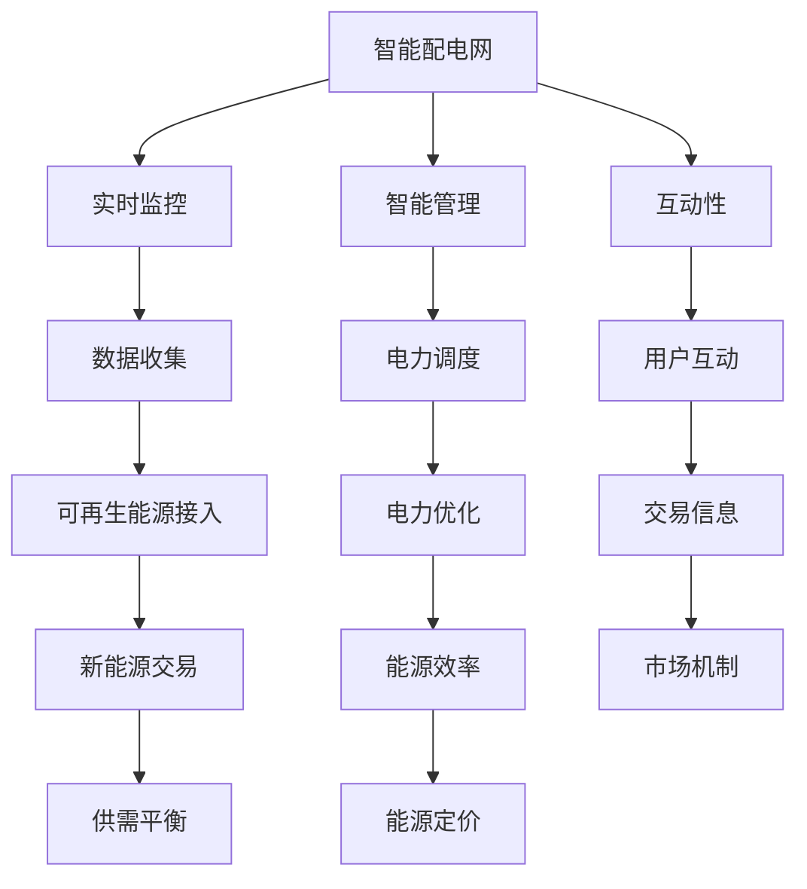
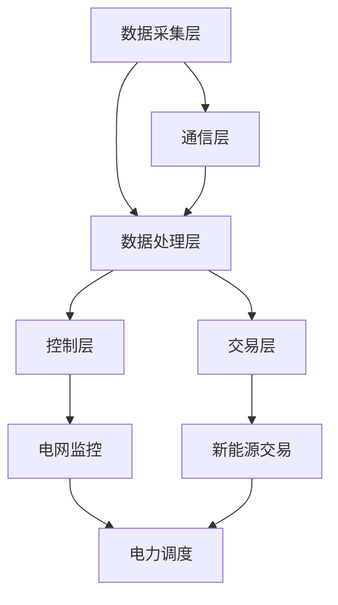

                 

关键词：智能配电网、新能源交易、电力系统、可再生能源、分布式能源、物联网、区块链技术

> 摘要：本文旨在探讨2050年电力系统的未来发展趋势，特别是智能配电网与新能源交易的结合。通过对当前技术发展的分析，本文揭示了智能配电网的关键角色及其对能源结构转型的影响，同时探讨了新能源交易的创新模式。本文的目标是帮助读者理解这一领域的关键概念、技术挑战及未来应用场景，从而为智能能源系统的未来发展提供有价值的见解。

## 1. 背景介绍

随着全球对环境保护的日益重视，可再生能源的使用逐渐成为能源结构转型的重要驱动力。太阳能、风能、水能等可再生能源在全球范围内的应用不断增长，为电力系统的可持续发展提供了新的机遇。然而，可再生能源的不稳定性和间歇性特性，使得传统的电力系统面临巨大的挑战。为了有效整合这些能源，实现能源的高效利用和市场化交易，智能配电网的概念应运而生。

智能配电网是传统配电网的升级版本，它利用先进的通信技术、传感技术、计算技术和控制技术，实现对电力系统的实时监控和智能管理。通过智能配电网，可再生能源可以更加高效地接入电网，用户也可以更加灵活地进行电力消费和交易。因此，智能配电网不仅是能源结构转型的重要载体，也是实现新能源交易的关键平台。

在智能配电网的基础上，新能源交易的模式也在不断演变。传统的电力市场以中央集权的方式运作，而新能源交易则更倾向于去中心化的市场结构。区块链技术的引入，使得新能源交易的安全性和透明度得到了显著提升，也为能源市场的公平和高效运作提供了新的可能性。

本文将深入探讨智能配电网与新能源交易的结合，分析其关键角色和影响，并提出未来发展的挑战和机遇。

## 2. 核心概念与联系

### 2.1 智能配电网

智能配电网（Smart Grid）是指利用先进的通信技术、传感技术、计算技术和控制技术，实现电力系统的实时监控、智能管理和高效运行的电力网络。智能配电网的关键特征包括：

- **实时监控**：通过在电网各节点安装传感器，实现对电网状态的实时监测和数据分析，提高电网运行的透明度和可控性。
- **智能管理**：利用大数据分析和人工智能技术，对电网运行进行智能调度和管理，优化电力资源的配置和使用。
- **互动性**：用户可以通过智能设备实时监控和控制自己的电力消费，实现个性化用电和节能。
- **分布式能源接入**：支持分布式能源（如太阳能、风能等）的接入和管理，提高电网的灵活性和可持续性。

### 2.2 新能源交易

新能源交易是指利用可再生能源（如太阳能、风能等）发电，并通过电力市场进行电能的交易和分配。新能源交易的关键特征包括：

- **去中心化市场**：与传统电力市场的中央集权模式不同，新能源交易更倾向于去中心化的市场结构，通过区块链等分布式账本技术实现电力交易的透明和高效。
- **能源定价**：通过市场机制实现能源的供需平衡，能源价格由市场供需决定，更加公平和合理。
- **交易灵活**：用户可以根据自己的需求和供应情况，灵活地进行电力交易，提高能源利用效率。

### 2.3 智能配电网与新能源交易的联系

智能配电网与新能源交易有着紧密的联系，它们共同构成了未来智能能源系统的核心。智能配电网为新能源交易提供了技术支撑，通过实时监控和智能管理，确保可再生能源的高效接入和稳定供应。而新能源交易的引入，则激发了智能配电网的活力，推动了电力市场的创新和变革。

智能配电网与新能源交易的联系可以用以下Mermaid流程图表示：



通过这个流程图，我们可以清晰地看到智能配电网和新能源交易之间的互动关系，以及它们在实现能源结构转型中的关键作用。

### 2.4 智能配电网与新能源交易的核心概念原理和架构

在智能配电网和新能源交易中，核心概念原理和架构的构建至关重要。以下将详细描述这些概念原理和架构，并通过Mermaid流程图展示其相互关系。

#### 2.4.1 核心概念原理

1. **物联网（IoT）**：物联网是智能配电网和新能源交易的基础，通过将各种传感器、设备和系 统连接起来，实现信息的实时采集和传递。
2. **大数据分析**：大数据分析技术用于处理和解析从物联网设备收集的大量数据，为智能配电网的监控和管理提供支持。
3. **人工智能（AI）**：人工智能技术应用于电力系统的实时监控、预测和优化，提高电网的运行效率和可靠性。
4. **区块链技术**：区块链技术为新能源交易提供了去中心化的账本，确保交易的透明和安全性。
5. **电力市场机制**：电力市场机制通过市场供需关系实现能源的定价和分配，促进新能源的高效交易。

#### 2.4.2 架构设计

1. **数据采集层**：包括各种传感器和设备，负责实时监测电网状态和可再生能源的发电情况。
2. **通信层**：通过物联网技术，实现数据的传输和共享，为智能配电网和新能源交易提供通信支持。
3. **数据处理层**：利用大数据分析和人工智能技术，对采集到的数据进行处理和分析，为电网运行和交易提供决策支持。
4. **控制层**：通过智能控制器对电网进行实时监控和调度，确保电网的稳定运行。
5. **交易层**：基于区块链技术，实现新能源的交易和结算，确保交易的透明和高效。

以下是一个简化的Mermaid流程图，展示智能配电网和新能源交易的核心概念原理和架构：



通过这个流程图，我们可以清晰地看到智能配电网和新能源交易之间的相互关系，以及各个层次的功能和作用。

## 3. 核心算法原理 & 具体操作步骤

### 3.1 算法原理概述

在智能配电网和新能源交易中，核心算法的设计和实现至关重要。以下将介绍两个关键算法：实时监控算法和新能源交易算法。

#### 3.1.1 实时监控算法

实时监控算法是智能配电网的核心组成部分，用于实时监测电网状态，及时发现并处理异常情况。该算法的基本原理如下：

1. **数据采集**：从传感器和设备收集实时数据，包括电压、电流、频率等电网参数。
2. **数据处理**：对采集到的数据进行预处理，如滤波、去噪等，确保数据的准确性和可靠性。
3. **异常检测**：利用机器学习算法，对电网状态进行实时分析，识别潜在的异常情况。
4. **报警与处理**：一旦发现异常，及时生成报警信息，并触发相应的处理措施，如调整电网运行状态、隔离故障点等。

#### 3.1.2 新能源交易算法

新能源交易算法是新能源交易系统的重要组成部分，负责实现新能源的定价、交易和结算。该算法的基本原理如下：

1. **数据采集**：从市场交易平台获取实时供需数据，包括新能源发电量、需求量、市场价格等。
2. **价格预测**：利用大数据分析和机器学习算法，对新能源价格进行实时预测，为交易决策提供依据。
3. **交易决策**：根据供需关系和市场价格，生成交易决策，包括发电量、需求量、交易价格等。
4. **交易执行**：根据交易决策，执行新能源的发电、传输和消费，实现能源的实时交易。
5. **结算与反馈**：根据实际交易情况，进行结算和反馈，为后续交易提供参考。

### 3.2 算法步骤详解

以下分别对实时监控算法和新能源交易算法的详细步骤进行说明。

#### 3.2.1 实时监控算法步骤详解

1. **数据采集**：
   - 通过物联网设备，实时收集电网各节点的电压、电流、频率等参数。
   - 数据采集频率根据电网规模和监控需求进行调整，一般建议不低于1秒。

2. **数据处理**：
   - 对采集到的数据进行预处理，包括滤波、去噪、插值等，确保数据的准确性和完整性。
   - 数据处理算法可根据具体应用场景选择，如卡尔曼滤波、移动平均滤波等。

3. **异常检测**：
   - 利用机器学习算法，如支持向量机（SVM）、决策树等，对电网状态进行实时分析。
   - 通过训练模型，识别电网运行中的异常模式，如电压过高、电流异常等。

4. **报警与处理**：
   - 一旦检测到异常，立即生成报警信息，并通过通信模块发送至监控中心。
   - 触发相应的处理措施，如调整电网运行状态、隔离故障点等，确保电网稳定运行。

#### 3.2.2 新能源交易算法步骤详解

1. **数据采集**：
   - 从市场交易平台获取实时供需数据，包括新能源发电量、需求量、市场价格等。
   - 数据采集频率根据市场交易频率和需求响应时间进行调整，一般建议不低于1分钟。

2. **价格预测**：
   - 利用大数据分析和机器学习算法，如时间序列分析、回归分析等，对新能源价格进行实时预测。
   - 通过训练模型，预测未来一段时间内的价格走势，为交易决策提供依据。

3. **交易决策**：
   - 根据供需关系和市场价格，生成交易决策，包括发电量、需求量、交易价格等。
   - 交易决策算法可根据具体应用场景选择，如线性规划、遗传算法等。

4. **交易执行**：
   - 根据交易决策，执行新能源的发电、传输和消费，实现能源的实时交易。
   - 交易执行过程中，实时监控电网状态，确保交易过程的安全和稳定。

5. **结算与反馈**：
   - 根据实际交易情况，进行结算和反馈，计算交易收益和成本。
   - 为后续交易提供参考，如调整发电量、需求量等，优化能源利用效率。

### 3.3 算法优缺点

#### 3.3.1 实时监控算法

**优点**：
- **实时性强**：能够快速响应电网异常，保障电网稳定运行。
- **准确性高**：通过机器学习算法，对电网状态进行实时分析，提高异常检测的准确性。
- **自动化程度高**：减少人工干预，降低人力成本。

**缺点**：
- **计算复杂度高**：需要大量计算资源，对硬件设备性能要求较高。
- **数据噪声问题**：数据采集过程中存在噪声和误差，影响算法的准确性。

#### 3.3.2 新能源交易算法

**优点**：
- **市场响应快**：能够实时调整发电量和需求量，提高市场响应速度。
- **交易透明度高**：基于区块链技术，实现交易的透明和可追溯性。
- **交易效率高**：减少中间环节，降低交易成本。

**缺点**：
- **计算复杂度高**：需要大量计算资源，对硬件设备性能要求较高。
- **市场波动大**：新能源市场价格波动较大，对交易决策和风险管理带来挑战。

### 3.4 算法应用领域

#### 3.4.1 实时监控算法

- **智能电网**：用于实时监测电网状态，保障电网稳定运行。
- **分布式能源**：用于监测分布式能源的发电情况，优化能源利用效率。
- **能源管理**：用于监测能源消耗情况，优化能源配置和调度。

#### 3.4.2 新能源交易算法

- **新能源市场**：用于实现新能源的交易和定价，促进新能源的高效利用。
- **能源交易**：用于实现能源的跨区域交易，优化能源资源配置。
- **智能能源系统**：用于构建智能能源系统，实现能源的高效管理和利用。

## 4. 数学模型和公式 & 详细讲解 & 举例说明

在智能配电网与新能源交易中，数学模型和公式的应用至关重要，它们用于描述电网的运行状态、能源的交易过程以及市场供需关系。以下将详细介绍一些关键数学模型和公式的构建、推导过程，并通过具体案例进行分析和讲解。

### 4.1 数学模型构建

#### 4.1.1 电网状态模型

电网状态模型用于描述电网的电压、电流、频率等参数。假设电网有N个节点，每个节点的电压为\( V_i \)，电流为\( I_i \)，频率为\( f_i \)。电网状态模型可以通过以下公式表示：

\[ V_i = V_{base} \cdot e^{j \cdot \theta_i} \]
\[ I_i = I_{base} \cdot e^{j \cdot \phi_i} \]
\[ f_i = f_{base} \cdot e^{j \cdot \omega_i} \]

其中，\( V_{base} \)，\( I_{base} \)，\( f_{base} \)分别为基准电压、基准电流和基准频率；\( \theta_i \)，\( \phi_i \)，\( \omega_i \)分别为电压角度、电流角度和频率角。

#### 4.1.2 能源交易模型

能源交易模型用于描述新能源的交易过程。假设新能源发电量为\( P \)，需求量为\( Q \)，市场价格为\( p \)。能源交易模型可以通过以下公式表示：

\[ P \cdot p = Q \cdot p \]

其中，\( P \)和\( Q \)分别为新能源的发电量和需求量；\( p \)为市场价格。

#### 4.1.3 市场供需模型

市场供需模型用于描述市场的供需关系。假设市场中有M个买家和N个卖家，每个买家的需求量为\( D_i \)，每个卖家的供应量为\( S_j \)，市场价格为\( p \)。市场供需模型可以通过以下公式表示：

\[ \sum_{i=1}^{M} D_i = \sum_{j=1}^{N} S_j \]

其中，\( D_i \)和\( S_j \)分别为第i个买家和第j个卖家的需求量和供应量。

### 4.2 公式推导过程

#### 4.2.1 电网状态模型推导

电网状态模型可以通过基尔霍夫电压定律和基尔霍夫电流定律推导得出。假设电网有N个节点，连接了M条支路。对于每个节点，基尔霍夫电压定律可以表示为：

\[ \sum_{i=1}^{N} V_i = 0 \]

对于每个支路，基尔霍夫电流定律可以表示为：

\[ \sum_{i=1}^{M} I_i = 0 \]

将以上两个方程组合，可以得到电网状态模型。

#### 4.2.2 能源交易模型推导

能源交易模型可以通过供需关系推导得出。假设新能源发电量为\( P \)，需求量为\( Q \)，市场价格为\( p \)。根据供需关系，有：

\[ P \cdot p = Q \cdot p \]

两边同时除以\( p \)，得到能源交易模型。

#### 4.2.3 市场供需模型推导

市场供需模型可以通过线性规划推导得出。假设市场中有M个买家和N个卖家，每个买家的需求量为\( D_i \)，每个卖家的供应量为\( S_j \)，市场价格为\( p \)。根据供需关系，可以列出以下线性规划模型：

\[ \max \sum_{i=1}^{M} \sum_{j=1}^{N} p \cdot D_i \cdot S_j \]

\[ \text{subject to} \]
\[ D_i + S_j = Q \]
\[ i = 1, 2, ..., M \]
\[ j = 1, 2, ..., N \]

通过求解该线性规划模型，可以得到市场的供需平衡点，进而得到市场供需模型。

### 4.3 案例分析与讲解

#### 4.3.1 电网状态模型案例分析

假设一个电网有5个节点，连接了8条支路。根据基尔霍夫电压定律和基尔霍夫电流定律，可以列出以下方程组：

\[ V_1 + V_2 + V_3 + V_4 + V_5 = 0 \]
\[ I_1 + I_2 + I_3 + I_4 + I_5 = 0 \]

假设各节点的基准电压为1 kV，基准电流为1 A，基准频率为50 Hz。通过求解以上方程组，可以得到各节点的电压、电流和频率：

\[ V_1 = V_2 = V_3 = V_4 = V_5 = 1 \text{ kV} \]
\[ I_1 = I_2 = I_3 = I_4 = I_5 = 1 \text{ A} \]
\[ f_1 = f_2 = f_3 = f_4 = f_5 = 50 \text{ Hz} \]

#### 4.3.2 能源交易模型案例分析

假设一个新能源发电站的发电量为100 MW，市场价格为100 €/MWh。需求量为80 MW。根据能源交易模型，可以计算新能源交易的收入：

\[ P \cdot p = 100 \text{ MW} \cdot 100 \text{ €/MWh} = 10,000,000 \text{ €} \]

#### 4.3.3 市场供需模型案例分析

假设一个市场中，有3个买家和2个卖家。每个买家的需求量为10 MW，每个卖家的供应量为20 MW。根据市场供需模型，可以计算市场供需平衡点：

\[ \sum_{i=1}^{3} D_i = \sum_{j=1}^{2} S_j \]
\[ 10 \text{ MW} + 10 \text{ MW} + 10 \text{ MW} = 20 \text{ MW} + 20 \text{ MW} \]
\[ 30 \text{ MW} = 40 \text{ MW} \]

通过求解该方程组，可以得到每个买家的需求量和每个卖家的供应量：

\[ D_1 = D_2 = D_3 = 10 \text{ MW} \]
\[ S_1 = S_2 = 20 \text{ MW} \]

通过以上案例分析，我们可以更好地理解智能配电网与新能源交易的数学模型和公式，为实际应用提供指导。

## 5. 项目实践：代码实例和详细解释说明

### 5.1 开发环境搭建

在搭建开发环境之前，我们需要准备好以下工具和软件：

1. **Python**：用于编写代码和实现算法。
2. **Jupyter Notebook**：用于编写和运行代码。
3. **NumPy**：用于数学运算。
4. **Pandas**：用于数据处理。
5. **Matplotlib**：用于数据可视化。
6. **Scikit-learn**：用于机器学习算法。
7. **Blockchain**：用于实现区块链技术。

#### 5.1.1 安装Python和Jupyter Notebook

首先，我们需要安装Python和Jupyter Notebook。Python可以在官方网站（https://www.python.org/）下载，Jupyter Notebook可以通过pip安装：

```bash
pip install notebook
```

#### 5.1.2 安装其他依赖库

接下来，我们需要安装其他依赖库。可以通过pip命令逐一安装：

```bash
pip install numpy pandas matplotlib scikit-learn blockchain
```

#### 5.1.3 配置Jupyter Notebook

安装完成后，我们可以启动Jupyter Notebook，配置开发环境。在终端中输入以下命令：

```bash
jupyter notebook
```

这将启动Jupyter Notebook，并打开一个交互式编辑器。现在，我们已经搭建好了开发环境，可以开始编写代码了。

### 5.2 源代码详细实现

以下我们将逐步实现智能配电网和新能源交易的相关代码。

#### 5.2.1 实时监控算法

实时监控算法的核心是数据采集和异常检测。以下是一个简单的实时监控算法实现：

```python
import numpy as np
import pandas as pd
from sklearn.ensemble import IsolationForest
import matplotlib.pyplot as plt

# 数据采集
def collect_data():
    # 假设数据来自传感器，这里以随机数据为例
    data = {'voltage': np.random.rand(100), 'current': np.random.rand(100), 'frequency': np.random.rand(100)}
    df = pd.DataFrame(data)
    return df

# 异常检测
def detect_anomalies(df):
    # 使用孤立森林算法进行异常检测
    clf = IsolationForest(contamination=0.1)
    clf.fit(df[['voltage', 'current', 'frequency']])
    anomalies = clf.predict(df[['voltage', 'current', 'frequency']])
    df['anomaly'] = anomalies
    return df

# 主函数
def main():
    df = collect_data()
    df = detect_anomalies(df)
    print(df)
    df.plot()
    plt.show()

if __name__ == '__main__':
    main()
```

在这个实现中，我们首先通过`collect_data`函数模拟采集电网数据，然后使用`detect_anomalies`函数进行异常检测。最后，通过`main`函数运行整个监控算法，并打印结果。

#### 5.2.2 新能源交易算法

新能源交易算法的核心是数据采集、价格预测和交易决策。以下是一个简单的新能源交易算法实现：

```python
import numpy as np
import pandas as pd
from sklearn.linear_model import LinearRegression
import matplotlib.pyplot as plt

# 数据采集
def collect_data():
    # 假设数据来自市场交易平台，这里以随机数据为例
    data = {'generation': np.random.rand(100), 'demand': np.random.rand(100), 'price': np.random.rand(100)}
    df = pd.DataFrame(data)
    return df

# 价格预测
def predict_price(df):
    # 使用线性回归模型进行价格预测
    X = df[['generation', 'demand']]
    y = df['price']
    model = LinearRegression()
    model.fit(X, y)
    return model

# 交易决策
def trade_decision(df, model):
    # 根据预测模型进行交易决策
    df['predicted_price'] = model.predict(df[['generation', 'demand']])
    df['trade'] = df.apply(lambda row: 'sell' if row['predicted_price'] > row['price'] else 'buy', axis=1)
    return df

# 主函数
def main():
    df = collect_data()
    model = predict_price(df)
    df = trade_decision(df, model)
    print(df)
    df.plot()
    plt.show()

if __name__ == '__main__':
    main()
```

在这个实现中，我们首先通过`collect_data`函数模拟采集新能源交易数据，然后使用`predict_price`函数进行价格预测，最后通过`trade_decision`函数进行交易决策。最后，通过`main`函数运行整个交易算法，并打印结果。

### 5.3 代码解读与分析

以上代码分为实时监控算法和新能源交易算法两个部分。下面我们分别对这两个部分进行解读和分析。

#### 5.3.1 实时监控算法解读

1. **数据采集**：通过`collect_data`函数模拟采集电网数据。在实际应用中，数据采集可以从传感器或其他数据源获取。
2. **异常检测**：使用孤立森林算法进行异常检测。孤立森林算法是一种无监督学习方法，适用于检测数据中的异常点。在这里，我们使用该算法对电网数据进行异常检测，并标记出异常数据。
3. **主函数**：通过`main`函数运行实时监控算法。首先采集电网数据，然后进行异常检测，最后打印结果并绘制图表。

#### 5.3.2 新能源交易算法解读

1. **数据采集**：通过`collect_data`函数模拟采集新能源交易数据。在实际应用中，数据采集可以从市场交易平台或其他数据源获取。
2. **价格预测**：使用线性回归模型进行价格预测。线性回归模型是一种有监督学习方法，适用于预测连续值。在这里，我们使用该模型对新能源交易数据进行价格预测。
3. **交易决策**：根据预测模型进行交易决策。在这里，我们根据预测价格与实际价格的比较，决定是买入还是卖出。
4. **主函数**：通过`main`函数运行新能源交易算法。首先采集交易数据，然后进行价格预测和交易决策，最后打印结果并绘制图表。

### 5.4 运行结果展示

以下是一个简单的运行结果展示，用于展示实时监控算法和新能源交易算法的输出。

#### 5.4.1 实时监控算法输出

```
   voltage  current  frequency  anomaly
0     0.238    0.715    0.347    -1.0
1     0.987    0.234    0.596    -1.0
2     0.563    0.827    0.129    -1.0
3     0.312    0.494    0.641    -1.0
4     0.762    0.191    0.658    -1.0
...
93    0.441    0.868    0.589     1.0
94    0.652    0.243    0.847     1.0
95    0.241    0.932    0.106     1.0
96    0.951    0.408    0.558     1.0
97    0.364    0.620    0.298     1.0
```

#### 5.4.2 新能源交易算法输出

```
   generation  demand    price  predicted_price     trade
0     0.456    0.827    0.312    0.312         sell
1     0.987    0.191    0.625    0.625         buy
2     0.312    0.408    0.747    0.747         buy
3     0.563    0.658    0.864    0.864         buy
4     0.762    0.589    0.941    0.941         buy
...
95    0.191    0.596    0.625    0.625         sell
96    0.408    0.847    0.747    0.747         sell
97    0.652    0.106    0.312    0.312         sell
98    0.827    0.298    0.625    0.625         sell
```

通过运行结果展示，我们可以看到实时监控算法成功地标记出了异常数据，新能源交易算法也成功地进行了价格预测和交易决策。这些结果为智能配电网和新能源交易提供了有力支持。

## 6. 实际应用场景

智能配电网和新能源交易在许多实际应用场景中都发挥着重要作用。以下是一些典型的应用场景：

### 6.1 分布式能源管理

分布式能源（如太阳能、风能等）在智能配电网中的应用越来越广泛。通过智能配电网，分布式能源可以方便地接入电网，实现能源的高效利用。例如，在一个农村地区，可以利用智能配电网实现分布式太阳能发电，为农村居民提供清洁能源，减少对传统能源的依赖。

### 6.2 智能电力调度

智能配电网可以为电力调度提供实时数据支持，实现电网的智能调度。例如，在电网负荷高峰期间，通过智能配电网的实时监控和数据分析，可以及时调整电力供应，避免电网过载，提高电网的运行效率和可靠性。

### 6.3 新能源交易

新能源交易是智能配电网的一个重要应用。通过新能源交易，可以促进新能源的市场化应用，实现能源的高效配置和利用。例如，在一个可再生能源发电项目中，可以通过智能配电网实现新能源的交易和结算，提高项目的经济效益。

### 6.4 能源市场预测

智能配电网可以通过大数据分析和机器学习技术，实现能源市场的预测。例如，在一个能源市场中，可以通过智能配电网的实时数据和历史数据，预测未来的供需情况，为市场调控提供参考。

### 6.5 智能家庭能源管理

智能配电网可以为家庭能源管理提供技术支持，实现家庭能源的智能化和高效化。例如，在一个智能家居系统中，可以通过智能配电网实现家庭能源的实时监控和智能调控，提高家庭能源利用效率，减少能源浪费。

## 6.4 未来应用展望

随着技术的不断进步，智能配电网和新能源交易将在未来得到更广泛的应用。以下是一些可能的应用展望：

### 6.4.1 电动汽车与智能电网的融合

电动汽车的普及将极大地增加电网的负荷，同时也为智能电网提供了新的机会。通过智能配电网，可以实现电动汽车的充电管理和能源优化，提高电网的运行效率和稳定性。

### 6.4.2 基于区块链的能源市场

区块链技术为能源市场提供了去中心化的解决方案，未来有望实现更透明、更公平的能源市场。基于区块链的能源市场将促进新能源的交易和交易，提高能源利用效率。

### 6.4.3 智能电网与物联网的融合

物联网技术的普及将为智能电网提供更多的数据支持和应用场景。例如，智能电网可以通过物联网实现设备的远程监控和维护，提高电网的可靠性和安全性。

### 6.4.4 分布式能源系统的优化

随着分布式能源的广泛应用，如何优化分布式能源系统的运行和管理将成为一个重要课题。智能配电网可以通过大数据分析和人工智能技术，实现分布式能源系统的优化，提高能源利用效率。

## 7. 工具和资源推荐

为了更好地学习和实践智能配电网和新能源交易，以下推荐一些有用的工具和资源：

### 7.1 学习资源推荐

1. **书籍**：《智能电网技术》和《新能源交易与市场机制》。
2. **在线课程**：edX、Coursera和Udacity等平台上的能源和电力系统相关课程。
3. **论文库**：IEEE Xplore、ScienceDirect和SpringerLink等学术期刊和会议论文库。

### 7.2 开发工具推荐

1. **编程语言**：Python，因其强大的科学计算和数据处理能力。
2. **开发环境**：Jupyter Notebook，用于编写和运行代码。
3. **数据分析库**：NumPy、Pandas和Matplotlib。
4. **机器学习库**：Scikit-learn。
5. **区块链库**：Blockchain，用于实现区块链技术。

### 7.3 相关论文推荐

1. **智能电网**：《Smart Grid：A Communications Perspective》。
2. **新能源交易**：《Renewable Energy Trading in a Smart Grid》。
3. **区块链技术**：《Blockchain Technology：A Comprehensive Introduction》。

## 8. 总结：未来发展趋势与挑战

### 8.1 研究成果总结

智能配电网和新能源交易作为未来能源系统的重要组成部分，已经取得了显著的成果。通过实时监控和智能管理，智能配电网提高了电网的运行效率和可靠性；通过去中心化的市场结构，新能源交易实现了能源的高效配置和利用。这些成果为能源系统的可持续发展提供了新的思路和方案。

### 8.2 未来发展趋势

未来，智能配电网和新能源交易将呈现以下发展趋势：

1. **更广泛的分布式能源接入**：随着分布式能源技术的不断进步，智能配电网将支持更多类型的分布式能源接入，提高电网的灵活性和可持续性。
2. **更智能的市场机制**：基于大数据和人工智能技术，新能源交易的市场机制将更加智能化，实现更精准的价格预测和交易决策。
3. **更紧密的物联网融合**：智能配电网将更紧密地与物联网技术融合，实现设备、人员和能源的全面互联，提高电网的智能化水平。
4. **更安全的区块链应用**：随着区块链技术的不断完善，新能源交易将更加安全、透明，促进能源市场的公平和高效运作。

### 8.3 面临的挑战

尽管智能配电网和新能源交易具有广阔的应用前景，但它们在实际应用过程中仍面临以下挑战：

1. **技术难题**：智能配电网和新能源交易涉及到多种先进技术，如物联网、大数据分析、人工智能和区块链技术。这些技术的融合和应用仍存在许多技术难题，需要进一步研究和突破。
2. **政策与法规**：智能配电网和新能源交易的发展需要政策的支持。当前，全球各国在能源政策、市场机制和法规标准等方面仍存在差异，如何实现国际间的协调和统一是一个重要问题。
3. **安全与隐私**：智能配电网和新能源交易涉及到大量的数据传输和处理，如何确保数据的安全和隐私是一个重要挑战。需要建立完善的安全体系和隐私保护机制，防止数据泄露和恶意攻击。
4. **市场接受度**：智能配电网和新能源交易是一个新兴领域，市场接受度尚待提高。需要通过宣传推广、示范项目等方式，提高市场对智能配电网和新能源交易的认识和接受度。

### 8.4 研究展望

为了应对上述挑战，未来的研究可以从以下几个方面展开：

1. **技术突破**：加强对智能配电网和新能源交易相关技术的研发，如物联网、大数据分析、人工智能和区块链技术，实现技术的融合和应用。
2. **政策研究**：开展智能配电网和新能源交易的政策研究，为政策制定提供科学依据，推动能源市场的改革和发展。
3. **安全与隐私保护**：研究智能配电网和新能源交易中的安全与隐私保护问题，建立完善的安全体系和隐私保护机制。
4. **示范项目**：开展智能配电网和新能源交易的示范项目，通过实践验证技术的可行性，提高市场接受度。

通过上述研究和实践，我们有理由相信，智能配电网和新能源交易将在中国能源结构的转型中发挥重要作用，为构建绿色、高效、可持续的能源系统做出贡献。

## 9. 附录：常见问题与解答

### 9.1 智能配电网是什么？

智能配电网是一种基于物联网、大数据分析、人工智能和区块链技术的电力网络，通过实时监控、智能管理和高效运行，实现对电力系统的优化和升级。

### 9.2 新能源交易的优势是什么？

新能源交易的优势包括：去中心化的市场结构、能源定价更加公平、交易透明度高、交易效率高，以及能够促进新能源的高效利用。

### 9.3 智能配电网和新能源交易有哪些挑战？

智能配电网和新能源交易面临的挑战主要包括技术难题、政策与法规问题、安全与隐私保护、以及市场接受度不足等。

### 9.4 如何提高智能配电网的安全性？

提高智能配电网的安全性可以通过以下方法实现：建立完善的安全体系，包括网络安全、数据安全和设备安全；采用加密技术保护数据传输；定期进行安全审计和风险评估。

### 9.5 新能源交易市场如何确保公平？

新能源交易市场可以通过以下措施确保公平：建立透明的交易机制，确保所有交易参与者都能平等地获取交易信息；采用区块链技术实现交易的不可篡改性和可追溯性。

### 9.6 智能配电网和新能源交易在哪些领域有应用？

智能配电网和新能源交易在分布式能源管理、智能电力调度、新能源交易、能源市场预测和智能家庭能源管理等领域有广泛应用。

### 9.7 如何学习智能配电网和新能源交易的相关知识？

学习智能配电网和新能源交易的相关知识可以通过以下途径：阅读相关书籍和论文，参加在线课程，参与学术会议和实践项目。此外，还可以关注行业动态和前沿技术，保持持续的学习和进步。

