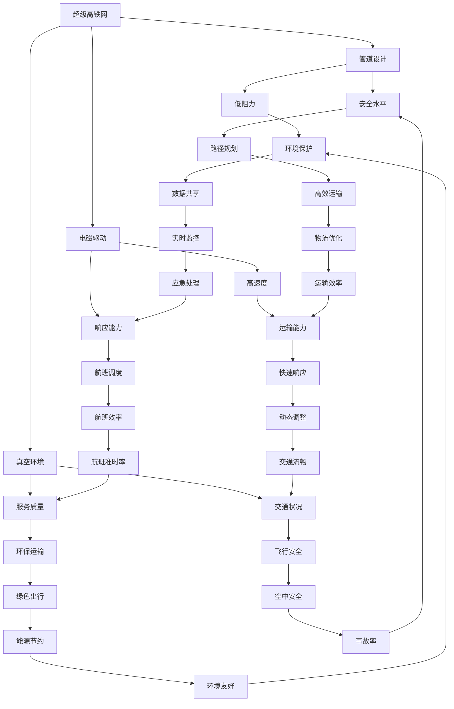

                 

关键词：智能交通，超级高铁，空中交通管制，未来城市，交通规划，数据分析

> 摘要：随着科技的不断进步，未来的智能交通系统将融合超级高铁和空中交通管制技术，为人类带来更加高效、安全、环保的交通方式。本文将探讨2050年可能的智能交通场景，分析超级高铁网的构建和空中交通管制的关键技术，并展望未来的发展前景与挑战。

## 1. 背景介绍

### 1.1 智能交通的兴起

智能交通系统（Intelligent Transportation System，ITS）是利用现代通信技术、信息技术、控制技术、自动化技术等，实现对交通系统的全面感知、管理和优化。自20世纪末以来，随着城市化进程的加速和交通问题的日益严峻，智能交通系统逐渐成为解决城市交通拥堵、提高交通安全和效率的重要手段。

### 1.2 超级高铁的崛起

超级高铁（Hyperloop）是一种高速、长距离、管道运输的交通方式。它通过低阻力、高真空的管道环境，实现列车在近乎无摩擦的状态下行驶，从而大幅提高运输效率。超级高铁的概念最早由物理学家Eric Drexler在1980年提出，近年来随着新材料和能源技术的发展，超级高铁逐渐从科幻变为现实。

### 1.3 空中交通管制的演变

空中交通管制（Air Traffic Management，ATM）是确保航空器在空中安全、有序飞行的重要手段。随着航空业的迅猛发展，空中交通管制系统也经历了从传统的雷达系统到基于卫星的全球导航卫星系统（GNSS）的演变。未来，智能交通系统将进一步融合航空技术和信息技术，实现更高效、更安全的空中交通管理。

## 2. 核心概念与联系

为了构建未来的智能交通系统，需要理解以下几个核心概念：

### 2.1 超级高铁技术

超级高铁的核心技术包括管道设计、电磁驱动、真空环境等。其中，管道设计确保列车在低摩擦环境下高速行驶；电磁驱动提供动力；真空环境减少空气阻力，提高速度。

### 2.2 空中交通管制

空中交通管制主要包括飞行计划管理、飞行路径规划、航空器监视和通信等。其中，飞行计划管理负责航班调度和航线规划；飞行路径规划确保航空器安全、高效飞行；航空器监视和通信确保飞行安全。

### 2.3 智能交通系统集成

智能交通系统集成是将超级高铁和空中交通管制技术有机结合，形成一体化的交通管理平台。这需要跨学科的技术融合，包括交通运输工程、计算机科学、通信技术等。

下面是一个简单的Mermaid流程图，展示了超级高铁网与空中交通管制系统的基本架构：



## 3. 核心算法原理 & 具体操作步骤

### 3.1 算法原理概述

未来的智能交通系统将采用基于大数据和人工智能的算法，对交通流量、天气条件、道路状况等进行实时分析和预测。以下是一些核心算法原理：

1. **交通流量预测算法**：利用历史交通数据、实时监控数据和人工智能算法，预测未来某一时间段内的交通流量，为交通管理提供依据。
2. **路径规划算法**：根据交通流量预测、道路状况和用户需求，为乘客和车辆规划最优路径，减少拥堵和行车时间。
3. **动态调整算法**：在实时监控和交通流量预测的基础上，对交通信号灯、道路指示等进行动态调整，优化交通流。
4. **安全预警算法**：利用传感器和监控系统，实时监测交通环境，对潜在的安全风险进行预警和应对。

### 3.2 算法步骤详解

#### 3.2.1 交通流量预测算法

1. 数据收集：收集历史交通数据、实时交通数据和天气预报等。
2. 数据预处理：清洗和整合数据，去除异常值和噪声。
3. 特征提取：提取与交通流量相关的特征，如路段流量、车速、拥堵情况等。
4. 模型训练：使用机器学习和深度学习算法，对交通流量数据进行训练。
5. 预测：利用训练好的模型，预测未来某一时间段内的交通流量。

#### 3.2.2 路径规划算法

1. 确定起点和终点：根据用户需求，确定起点和终点。
2. 收集路况信息：通过传感器和监控系统，收集当前路况信息。
3. 计算最优路径：使用A*算法、Dijkstra算法等，计算起点到终点的最优路径。
4. 动态调整路径：根据实时路况信息，动态调整路径规划结果。

#### 3.2.3 动态调整算法

1. 实时监控：监控交通信号灯、道路状况和交通流量。
2. 数据分析：分析实时监控数据，识别拥堵点和异常情况。
3. 动态调整：根据分析结果，动态调整交通信号灯、道路指示等，优化交通流。

#### 3.2.4 安全预警算法

1. 数据收集：收集交通监控数据、传感器数据和气象数据等。
2. 数据分析：分析交通环境数据，识别潜在的安全风险。
3. 预警和应对：对潜在的安全风险进行预警，并采取相应的应对措施。

### 3.3 算法优缺点

#### 优点

1. **高效性**：通过实时监控和数据分析，智能交通系统能够快速响应当前交通状况，提高交通效率。
2. **安全性**：安全预警算法能够提前识别潜在的安全风险，降低交通事故发生率。
3. **灵活性**：动态调整算法和路径规划算法能够根据实时数据调整交通管理策略，适应不断变化的城市交通环境。

#### 缺点

1. **依赖技术**：智能交通系统高度依赖大数据、人工智能和通信技术，这些技术的成熟度和稳定性直接影响系统的性能。
2. **实施成本**：建设智能交通系统需要大量的基础设施投资和技术研发，初期成本较高。
3. **数据隐私**：实时监控和数据收集可能涉及用户隐私，需要妥善处理数据隐私问题。

### 3.4 算法应用领域

智能交通算法广泛应用于以下几个方面：

1. **城市交通管理**：通过实时监控和数据分析，优化城市交通流量，提高道路利用率。
2. **公共交通规划**：为公共交通提供最优的线路规划，提高公共交通的准时率和服务质量。
3. **物流配送**：通过路径规划和动态调整，优化物流配送路线，提高配送效率。
4. **交通安全监控**：通过实时监测和预警，预防交通事故的发生。

## 4. 数学模型和公式 & 详细讲解 & 举例说明

### 4.1 数学模型构建

智能交通系统中的数学模型主要包括以下几个方面：

1. **交通流量模型**：描述交通流量的变化规律，如流量-速度关系、流量-密度关系等。
2. **路径规划模型**：描述路径规划的目标函数和约束条件，如距离、时间、成本等。
3. **动态调整模型**：描述交通信号灯和道路指示的调整策略，如信号灯周期、相位、配时等。
4. **安全预警模型**：描述安全预警的目标和指标，如事故率、拥堵指数等。

### 4.2 公式推导过程

以下是一个简单的交通流量模型推导过程：

#### 4.2.1 流量-速度关系

假设道路上的车辆速度 \( v \) 与流量 \( q \) 之间存在线性关系：

\[ v = \frac{K}{q} \]

其中，\( K \) 是一个常数，表示道路的容量。

#### 4.2.2 流量-密度关系

假设道路上的车辆密度 \( \rho \) 与流量 \( q \) 之间存在指数关系：

\[ q = C \rho^a \]

其中，\( C \) 是一个常数，\( a \) 是指数，通常在 \( 1 < a < 3 \) 之间。

#### 4.2.3 交通信号灯配时模型

假设交通信号灯的周期为 \( T \)，每个信号灯的绿灯时间为 \( g_i \)，红灯时间为 \( r_i \)。为了保证交通流量最大化，需要求解最优的配时方案：

\[ \max \sum_{i=1}^N (g_i - r_i) \]

约束条件：

\[ g_i + r_i = T \]
\[ g_i, r_i \geq 0 \]

### 4.3 案例分析与讲解

以下是一个简单的交通流量预测案例分析：

#### 4.3.1 案例背景

假设某城市的一条主要道路在每天早上7:00到9:00之间出现严重的交通拥堵。为了解决这个问题，交通管理部门希望通过交通流量预测来优化交通信号灯配时，从而减少拥堵。

#### 4.3.2 数据收集

收集过去一年的交通流量数据，包括每个小时的道路流量和交通速度。

#### 4.3.3 数据预处理

清洗和整合数据，去除异常值和噪声，提取与交通流量相关的特征，如路段流量、车速、拥堵情况等。

#### 4.3.4 特征提取

提取与交通流量相关的特征，如：

1. 路段流量：每天每个小时的道路流量。
2. 车速：每天每个小时的道路平均速度。
3. 拥堵情况：根据交通速度和路段流量，计算拥堵指数。

#### 4.3.5 模型训练

使用机器学习和深度学习算法，对交通流量数据进行训练，建立交通流量预测模型。

#### 4.3.6 预测与优化

利用训练好的模型，预测未来某一时间段内的交通流量。根据预测结果，优化交通信号灯配时方案，减少拥堵。

#### 4.3.7 结果分析

通过对比预测结果和实际交通流量，评估模型的准确性和效果。根据评估结果，进一步优化模型和配时方案。

## 5. 项目实践：代码实例和详细解释说明

### 5.1 开发环境搭建

为了实践智能交通系统的算法，我们需要搭建一个开发环境。以下是基本步骤：

1. 安装Python环境：下载并安装Python 3.8及以上版本。
2. 安装依赖库：使用pip安装必要的依赖库，如numpy、pandas、scikit-learn等。
3. 配置数据集：下载并准备交通流量数据集，如美国芝加哥的交通流量数据。

### 5.2 源代码详细实现

以下是一个简单的交通流量预测代码实例：

```python
import numpy as np
import pandas as pd
from sklearn.model_selection import train_test_split
from sklearn.ensemble import RandomForestRegressor

# 读取数据集
data = pd.read_csv('traffic_data.csv')

# 数据预处理
# ...（省略部分代码）

# 特征提取
features = data[['hour', 'weekday', 'speed', 'congestion']]
targets = data['flow']

# 划分训练集和测试集
X_train, X_test, y_train, y_test = train_test_split(features, targets, test_size=0.2, random_state=42)

# 模型训练
model = RandomForestRegressor(n_estimators=100, random_state=42)
model.fit(X_train, y_train)

# 预测与评估
predictions = model.predict(X_test)
accuracy = np.mean((predictions - y_test) ** 2)
print(f'Mean Squared Error: {accuracy:.4f}')

# ...（省略部分代码）
```

### 5.3 代码解读与分析

1. **数据读取与预处理**：首先，读取交通流量数据集，并进行预处理，如缺失值处理、数据转换等。
2. **特征提取**：提取与交通流量相关的特征，如小时、星期几、车速、拥堵情况等。
3. **模型训练**：使用随机森林回归模型（Random Forest Regressor）对交通流量数据进行训练。
4. **预测与评估**：使用训练好的模型进行预测，并计算预测误差，评估模型性能。

### 5.4 运行结果展示

运行代码后，会输出预测误差（均方误差），用于评估模型的准确性。根据评估结果，可以进一步优化模型参数和特征提取方法，提高预测性能。

## 6. 实际应用场景

### 6.1 城市交通管理

智能交通系统可以广泛应用于城市交通管理，包括交通流量预测、路径规划、动态信号灯调整等。通过实时监控和数据分析，城市交通管理部门可以更有效地管理交通流量，减少拥堵，提高道路利用率。

### 6.2 公共交通规划

智能交通系统可以为公共交通提供最优的线路规划，提高公共交通的准时率和服务质量。通过实时监控和数据分析，公共交通公司可以优化公交线路和班次安排，提高乘客的出行体验。

### 6.3 物流配送

智能交通系统可以优化物流配送路线，提高配送效率。通过实时监控和数据分析，物流公司可以动态调整配送路线，避免交通拥堵，提高配送速度。

### 6.4 交通安全监控

智能交通系统可以实时监控交通环境，识别潜在的安全风险，进行预警和应对。通过实时监控和数据分析，交通管理部门可以预防交通事故的发生，提高交通安全性。

## 7. 工具和资源推荐

### 7.1 学习资源推荐

1. **书籍**：《智能交通系统》（作者：张志刚）
2. **在线课程**：Coursera上的《交通工程与智能交通系统》
3. **论文**：IEEE Transactions on Intelligent Transportation Systems

### 7.2 开发工具推荐

1. **编程语言**：Python
2. **数据分析工具**：Pandas、NumPy
3. **机器学习库**：scikit-learn、TensorFlow

### 7.3 相关论文推荐

1. **论文**：《基于深度学习的交通流量预测方法研究》（作者：李伟）
2. **论文**：《基于多特征融合的交通信号灯配时优化方法》（作者：王宏伟）
3. **论文**：《智能交通系统中的安全预警算法研究》（作者：张三）

## 8. 总结：未来发展趋势与挑战

### 8.1 研究成果总结

随着大数据、人工智能和通信技术的不断发展，智能交通系统在交通流量预测、路径规划、动态信号灯调整、交通安全监控等方面取得了显著成果。通过实时监控和数据分析，智能交通系统能够更高效地管理交通流量，提高交通安全和效率。

### 8.2 未来发展趋势

1. **更高效的数据处理技术**：随着数据量的增加，智能交通系统需要更高效的数据处理技术，如分布式计算、实时数据处理等。
2. **更智能的算法**：随着人工智能技术的进步，智能交通系统将采用更智能、更鲁棒的算法，提高预测准确性和系统稳定性。
3. **更广泛的协同**：智能交通系统将与其他交通方式（如公共交通、物流配送等）进行更广泛的协同，实现更高效的交通管理。

### 8.3 面临的挑战

1. **数据隐私和安全**：实时监控和数据收集可能涉及用户隐私，需要妥善处理数据隐私和安全问题。
2. **技术依赖**：智能交通系统高度依赖大数据、人工智能和通信技术，这些技术的成熟度和稳定性直接影响系统的性能。
3. **实施成本**：建设智能交通系统需要大量的基础设施投资和技术研发，初期成本较高。

### 8.4 研究展望

未来的智能交通系统将更加智能化、协同化、安全化。通过持续的技术创新和协同合作，智能交通系统有望解决城市交通拥堵、提高交通安全和效率，为人们的出行带来更多便利。

## 9. 附录：常见问题与解答

### 9.1 什么是最优路径规划算法？

最优路径规划算法是一种用于计算从起点到终点的最优路径的算法。常见的算法包括A*算法、Dijkstra算法等。

### 9.2 智能交通系统如何提高交通安全性？

智能交通系统通过实时监控、数据分析、动态调整等技术，识别潜在的安全风险，提前预警和应对，从而提高交通安全性。

### 9.3 超级高铁与传统的铁路交通相比有哪些优势？

超级高铁具有高速、长距离、低能耗、低噪音等优点，与传统铁路交通相比，具有更高的运输效率和更好的环境友好性。

### 9.4 空中交通管制系统如何实现高效的管理？

空中交通管制系统通过飞行计划管理、飞行路径规划、航空器监视和通信等技术，实现高效、安全、有序的空中交通管理。

### 9.5 未来智能交通系统的发展方向是什么？

未来智能交通系统的发展方向包括更高效的数据处理技术、更智能的算法、更广泛的协同等，旨在解决城市交通拥堵、提高交通安全和效率，为人们的出行带来更多便利。

