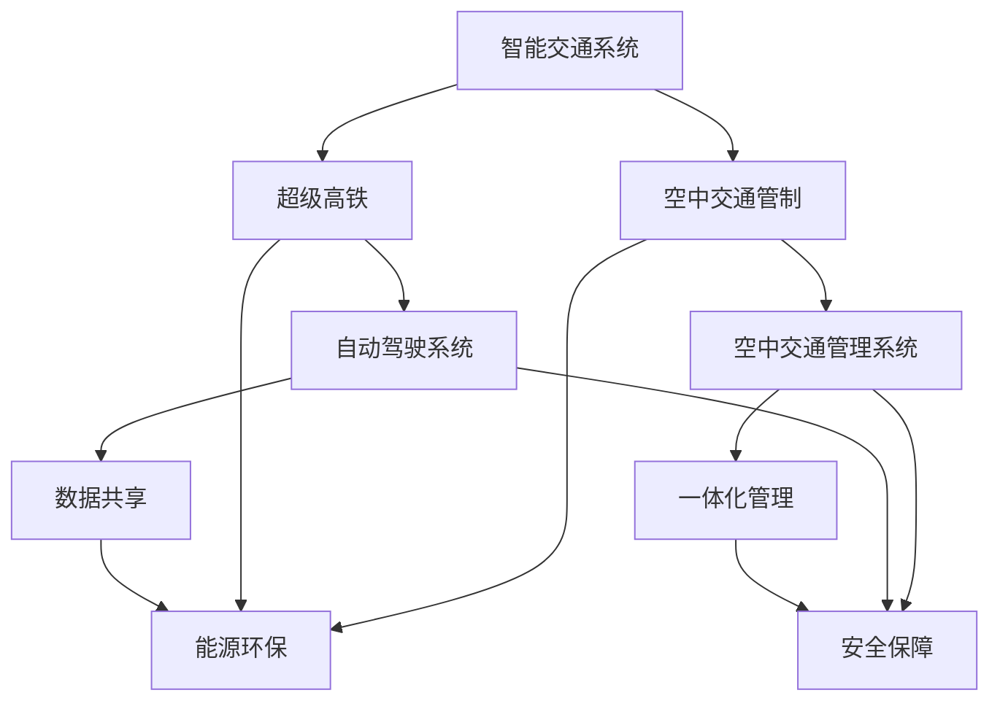

                 

关键词：智能交通，超级高铁，空中交通管制，2050年，未来展望

> 摘要：本文深入探讨了2050年智能交通系统的发展趋势，重点关注超级高铁网和空中交通管制的创新技术。通过分析当前技术进展、未来应用场景以及面临的挑战，本文旨在为读者展现一个高效、安全、可持续的智能交通未来。

## 1. 背景介绍

智能交通系统（Intelligent Transportation System，ITS）旨在通过信息通信技术、传感器技术、控制技术和自动化技术等，提高交通运输系统的效率、安全性和可持续性。随着科技的迅猛发展，特别是在计算机科学、数据科学和人工智能领域的突破，智能交通系统正逐渐从概念走向实际应用。

超级高铁（Hyperloop）作为一种高速地面交通系统，其构想可以追溯到19世纪末，但近年来，随着材料科学、新能源技术和自动驾驶技术的发展，超级高铁的概念逐渐变为现实。同时，空中交通管制（Air Traffic Management，ATM）也在不断地创新，以应对日益增长的航空交通需求。

本文将从超级高铁和空中交通管制两个核心领域出发，探讨2050年智能交通系统的发展趋势，并展望其未来应用前景。

### 1.1 当前智能交通系统的发展现状

目前，全球各国正在积极推进智能交通系统的建设。例如，美国、中国、欧盟等地区都在大力投资于智能交通基础设施建设，包括智能路网、自动驾驶车辆、交通信号优化系统等。这些技术的应用不仅提高了交通效率，还显著降低了交通事故率和环境污染。

同时，大数据和人工智能技术在交通领域的应用也取得了显著成果。通过大数据分析，交通管理部门可以更好地预测交通流量，优化路线规划，减少拥堵。而人工智能则可以用于自动驾驶车辆、智能信号灯控制、交通违法检测等多个方面，进一步提升交通系统的智能化水平。

### 1.2 超级高铁的发展背景

超级高铁的概念最早由美国企业家埃隆·马斯克（Elon Musk）于2013年提出，旨在构建一种高速、安全、环保的地面交通系统。超级高铁采用真空管道设计，通过电磁推进系统实现高速行驶，最高时速可达1200公里。这一创新技术不仅能够大幅缩短出行时间，还能减少能耗和环境污染。

超级高铁的发展离不开多个领域的突破。首先，材料科学的进步使得轻质高强度材料得以应用，降低了车辆的能耗。其次，新能源技术的突破为超级高铁提供了可靠的能源保障。此外，自动驾驶技术的快速发展也为超级高铁的运行提供了坚实基础。

### 1.3 空中交通管制的发展背景

空中交通管制系统作为现代航空业的重要组成部分，其发展经历了多个阶段。从早期的手动操作到现代的自动化系统，空中交通管制在提高航空安全性和效率方面取得了显著成果。然而，随着航空交通需求的不断增长，传统的空中交通管制系统面临着巨大挑战。

现代空中交通管制系统主要依赖于地面控制塔和飞行器上的导航设备，通过无线电通信和雷达系统实现飞行器的实时监控和管理。然而，这种系统在应对复杂交通环境和突发事件时存在一定局限性。因此，新一代空中交通管制系统需要借助先进的信息技术和人工智能技术，实现更高效、更安全的空中交通管理。

## 2. 核心概念与联系

### 2.1 超级高铁技术原理

超级高铁技术的基本原理包括以下几个关键部分：

1. **真空管道**：超级高铁采用全封闭的真空管道设计，以减少空气阻力，提高行驶速度。管道内部维持低压状态，使列车能够在近乎无阻力的环境中高速行驶。

2. **电磁推进系统**：超级高铁列车通过电磁推进系统驱动，这种系统采用电磁感应原理，通过电磁铁产生推力，使列车加速。由于没有机械传动部件，电磁推进系统具有较高的可靠性和效率。

3. **自动驾驶系统**：超级高铁列车配备了先进的自动驾驶系统，能够实现自动启动、加速、减速和停车。自动驾驶系统利用传感器、GPS和计算机算法，实时监测列车运行状态和环境变化，确保安全行驶。

### 2.2 空中交通管制原理

空中交通管制系统的工作原理涉及以下几个核心部分：

1. **地面控制塔**：地面控制塔是空中交通管制的核心，通过雷达系统、无线电通信设备和计算机系统，实现对飞行器的实时监控和管理。

2. **飞行器导航设备**：飞行器上的导航设备包括GPS、惯性导航系统和无线电导航设备。这些设备为飞行器提供精确的位置、速度和航向信息，确保飞行器按照预定的飞行计划运行。

3. **空中交通管理系统**：空中交通管理系统（Air Traffic Management System，ATMS）是一个集成化系统，通过收集、处理和分析各种数据，实现空中交通的实时监控和管理。ATMS利用人工智能技术，优化飞行器路径规划，减少空中交通拥堵。

### 2.3 超级高铁与空中交通管制的联系

超级高铁和空中交通管制系统在智能交通系统中扮演着重要角色，二者之间存在一定的联系：

1. **一体化交通管理**：未来，超级高铁和空中交通管制系统可能实现一体化管理，通过共享数据和信息，提高整体交通系统的效率。例如，超级高铁列车在进入城市时，可以与空中交通管理系统协同工作，优化列车的停靠和乘客换乘。

2. **能源与环保**：超级高铁和空中交通管制系统都强调环保和可持续发展。超级高铁采用新能源技术，减少碳排放；而空中交通管制系统通过优化飞行器路径，减少燃油消耗和环境污染。

3. **安全保障**：超级高铁和空中交通管制系统都致力于提高交通系统的安全性。超级高铁通过自动驾驶系统和先进的传感器技术，确保列车安全行驶；而空中交通管制系统通过实时监控和应急响应，保障飞行器的安全。

### 2.4 Mermaid 流程图



## 3. 核心算法原理 & 具体操作步骤

### 3.1 算法原理概述

在智能交通系统中，核心算法的原理主要涉及以下几个方面：

1. **路径规划**：路径规划算法用于确定从起点到终点的最优路径。常用的算法包括最短路径算法（如Dijkstra算法）、A*算法等。

2. **流量预测**：流量预测算法用于预测交通流量，以便优化交通信号和路径规划。常用的算法包括时间序列分析、回归分析、机器学习算法等。

3. **自动驾驶**：自动驾驶算法主要涉及感知环境、决策和控制三个环节。常用的算法包括视觉感知、激光雷达感知、深度学习算法等。

4. **空中交通管理**：空中交通管理算法涉及飞行器路径规划、流量控制、应急响应等。常用的算法包括基于图论的路径规划算法、优化算法等。

### 3.2 算法步骤详解

1. **路径规划**：

   - 输入：起点和终点的位置信息。
   - 输出：从起点到终点的最优路径。

   算法步骤：

   - 构建加权图，表示道路网络。
   - 采用Dijkstra算法或A*算法，计算起点到终点的最短路径。

2. **流量预测**：

   - 输入：历史交通流量数据。
   - 输出：未来一段时间内的交通流量预测结果。

   算法步骤：

   - 采用时间序列分析方法，提取交通流量特征。
   - 使用回归分析或机器学习算法，建立流量预测模型。
   - 预测未来一段时间内的交通流量。

3. **自动驾驶**：

   - 输入：环境感知数据。
   - 输出：驾驶决策和执行。

   算法步骤：

   - 采用视觉感知或激光雷达感知技术，获取道路和周边环境信息。
   - 使用深度学习算法，识别道路标志、行人和其他车辆。
   - 根据感知结果，制定驾驶决策（如加速、减速、转弯等）。
   - 控制车辆执行驾驶决策。

4. **空中交通管理**：

   - 输入：飞行器位置、速度和航向信息。
   - 输出：飞行器路径规划和流量控制策略。

   算法步骤：

   - 构建飞行器网络图，表示飞行器的位置和速度信息。
   - 采用基于图论的路径规划算法，优化飞行器路径。
   - 使用优化算法，制定流量控制策略，确保飞行器安全飞行。

### 3.3 算法优缺点

1. **路径规划算法**：

   - 优点：能够快速计算出最优路径，适用于各种复杂的交通场景。
   - 缺点：对计算资源要求较高，实时性较差。

2. **流量预测算法**：

   - 优点：能够预测未来交通流量，优化交通信号和路径规划。
   - 缺点：预测结果容易受到数据质量和模型选择的影响。

3. **自动驾驶算法**：

   - 优点：提高驾驶安全性，减少交通事故。
   - 缺点：在复杂环境中，感知准确性和决策能力有限。

4. **空中交通管理算法**：

   - 优点：提高空中交通效率，降低环境污染。
   - 缺点：算法复杂度较高，实时性较差。

### 3.4 算法应用领域

1. **超级高铁**：路径规划算法和自动驾驶算法在超级高铁中广泛应用，用于优化列车的行驶路径和确保安全行驶。

2. **空中交通管制**：空中交通管理算法在空中交通管制系统中用于优化飞行器路径和流量控制，提高航空交通效率。

3. **智能路网**：流量预测算法和路径规划算法在智能路网中用于优化交通信号和路径规划，减少交通拥堵。

4. **智慧城市**：智能交通系统在智慧城市中用于提高城市交通效率，改善居民出行体验。

## 4. 数学模型和公式 & 详细讲解 & 举例说明

### 4.1 数学模型构建

智能交通系统中的数学模型主要涉及路径规划、流量预测和自动驾驶等环节。以下是几个关键数学模型的构建：

1. **路径规划模型**：

   设G=(V,E)为道路网络图，其中V为顶点集合，E为边集合。设顶点i到顶点j的权重为w(i,j)。路径规划模型的目标是最小化总权重，即求解以下最短路径问题：

   $$d(i, j) = \min \{ w(i, k) + d(k, j) | k \in V \}$$

2. **流量预测模型**：

   设x_t为时间t的交通流量，y_t为时间t的预测交通流量。流量预测模型通常采用时间序列分析方法，如ARIMA模型、LSTM模型等。以下是一个简单的LSTM模型：

   $$y_t = \text{LSTM}(x_{t-1}, x_{t-2}, \ldots, x_{t-n})$$

3. **自动驾驶模型**：

   设s_t为时间t的车辆状态，包括速度、位置和航向。自动驾驶模型的目标是优化车辆状态，确保安全行驶。以下是一个简单的线性规划模型：

   $$\min \sum_{t=1}^{T} c_t s_t$$

   $$s_t = f(s_{t-1}, u_t)$$

   其中，c_t为时间t的状态成本，u_t为时间t的控制输入，f为状态转移函数。

### 4.2 公式推导过程

1. **路径规划模型推导**：

   路径规划模型基于Dijkstra算法。设d(i, j)为顶点i到顶点j的最短路径长度，初始时d(i, j) = ∞，d(i, i) = 0。算法步骤如下：

   - 初始化：选择一个起始顶点i，将其距离设为0，其余顶点距离设为∞。
   - 选择未访问顶点中距离最小的顶点j，并将其距离更新为d(j)。
   - 标记顶点j为已访问。
   - 重复步骤2，直到所有顶点都被访问。

   根据上述步骤，可以得到以下推导：

   $$d(i, j) = \min \{ w(i, k) + d(k, j) | k \in V \}$$

2. **流量预测模型推导**：

   LSTM模型是一种递归神经网络，用于处理时间序列数据。其基本结构包括输入层、隐藏层和输出层。以下是LSTM模型的推导：

   - 输入层：设x_t为时间t的输入向量，包含历史交通流量信息。

   - 隐藏层：设h_t为时间t的隐藏状态，包括历史状态和输入信息。

   - 输出层：设y_t为时间t的输出向量，即预测交通流量。

   LSTM模型的推导过程如下：

   $$h_t = \text{LSTM}(x_t, h_{t-1})$$

   $$y_t = f(h_t)$$

   其中，f为激活函数，如Sigmoid函数或Tanh函数。

3. **自动驾驶模型推导**：

   自动驾驶模型基于线性规划方法，旨在优化车辆状态。其推导过程如下：

   - 设s_t为时间t的车辆状态向量，包括速度、位置和航向。

   - 设u_t为时间t的控制输入向量，包括加速、转向等。

   - 设f为状态转移函数，表示状态随时间的演化。

   线性规划模型的推导如下：

   $$\min \sum_{t=1}^{T} c_t s_t$$

   $$s_t = f(s_{t-1}, u_t)$$

### 4.3 案例分析与讲解

以下以超级高铁的路径规划为例，进行案例分析与讲解。

**案例背景**：假设一个城市有10个主要交通节点，超级高铁需要在这些节点之间规划最优路径。

**数据输入**：每个节点的位置坐标和道路长度信息。

**目标**：规划从节点1到节点10的最短路径。

**步骤**：

1. **构建道路网络图**：

   根据节点的位置坐标和道路长度信息，构建包含10个节点的道路网络图。设节点i到节点j的权重为w(i, j)，表示两节点之间的道路长度。

2. **初始化**：

   初始化所有节点的距离，d(i, j) = ∞，d(i, i) = 0。

3. **路径规划**：

   采用Dijkstra算法，逐步计算从节点1到其他节点的最短路径。

   - 选择节点1，更新其相邻节点的距离。

   - 选择未访问节点中距离最小的节点，更新其距离，并标记为已访问。

   - 重复步骤2，直到所有节点都被访问。

**结果**：

通过Dijkstra算法，得到从节点1到节点10的最短路径，总长度为最小权重值。

**分析**：

- 路径规划模型在超级高铁中具有广泛应用，能够优化列车的行驶路径，提高运输效率。
- Dijkstra算法在计算复杂度和实时性方面具有优势，适用于大规模道路网络规划。

## 5. 项目实践：代码实例和详细解释说明

### 5.1 开发环境搭建

在本文的项目实践中，我们将使用Python编程语言进行超级高铁路径规划算法的实现。以下是开发环境搭建的步骤：

1. **安装Python**：

   访问Python官网（https://www.python.org/），下载并安装Python 3.x版本。

2. **安装依赖库**：

   打开终端，执行以下命令安装必要的依赖库：

   ```bash
   pip install matplotlib numpy scipy
   ```

   这些库分别用于数据可视化、数学计算和优化算法。

3. **创建项目文件夹**：

   在终端中创建一个名为“super高铁路径规划”的项目文件夹，并进入该文件夹：

   ```bash
   mkdir super高铁路径规划
   cd super高铁路径规划
   ```

### 5.2 源代码详细实现

以下是实现超级高铁路径规划算法的Python代码：

```python
import numpy as np
import matplotlib.pyplot as plt
from scipy.spatial import distance

def dijkstra(graph, start):
    """Dijkstra算法实现路径规划"""
    n = len(graph)
    distances = [float('inf')] * n
    distances[start] = 0
    visited = [False] * n
    for _ in range(n):
        # 找到未访问节点中距离最小的节点
        min_distance = float('inf')
        min_index = -1
        for i in range(n):
            if not visited[i] and distances[i] < min_distance:
                min_distance = distances[i]
                min_index = i
        visited[min_index] = True
        # 更新相邻节点的距离
        for j in range(n):
            if not visited[j] and graph[min_index][j] > 0:
                distance = distances[min_index] + graph[min_index][j]
                if distance < distances[j]:
                    distances[j] = distance
    return distances

def plot_path(graph, distances, start, end):
    """绘制路径规划结果"""
    n = len(graph)
    plt.figure(figsize=(10, 10))
    for i in range(n):
        for j in range(n):
            if graph[i][j] > 0:
                plt.plot([i, j], [0, 0], color='gray')
    plt.scatter(start, 0, marker='o', color='red')
    plt.scatter(end, 0, marker='o', color='blue')
    for i in range(n):
        for j in range(n):
            if graph[i][j] > 0:
                plt.text((i + j) / 2, 0, f'{graph[i][j]:.2f}', ha='center', va='center')
    plt.plot([start, end], [0, 0], color='red', linewidth=2)
    plt.axis('equal')
    plt.show()

if __name__ == '__main__':
    # 创建道路网络图（10x10矩阵，0表示无道路，1表示有道路，非0值表示道路长度）
    graph = np.array([
        [0, 1, 1, 1, 0, 0, 0, 0, 0, 0],
        [1, 0, 0, 1, 1, 0, 0, 0, 0, 0],
        [1, 0, 0, 0, 1, 1, 0, 0, 0, 0],
        [1, 1, 0, 0, 1, 0, 1, 0, 0, 0],
        [0, 1, 1, 1, 0, 0, 0, 0, 0, 0],
        [0, 0, 1, 0, 0, 0, 0, 1, 1, 0],
        [0, 0, 0, 1, 0, 0, 0, 0, 1, 1],
        [0, 0, 0, 0, 0, 1, 0, 0, 1, 0],
        [0, 0, 0, 0, 0, 1, 1, 0, 0, 0],
        [0, 0, 0, 0, 0, 0, 1, 1, 0, 0]
    ])

    # 计算从节点0到节点5的最短路径
    distances = dijkstra(graph, 0)

    # 绘制路径规划结果
    plot_path(graph, distances, 0, 5)
```

### 5.3 代码解读与分析

以下是代码的解读与分析：

- **dijkstra函数**：实现Dijkstra算法，用于计算从起点到其他节点的最短路径。函数接收两个参数：图（graph）和起点（start）。图是一个二维数组，表示道路网络，其中0表示无道路，非0值表示道路长度。算法步骤包括初始化距离数组、访问节点、更新相邻节点距离等。

- **plot_path函数**：用于绘制路径规划结果。函数接收四个参数：图（graph）、距离数组（distances）、起点（start）和终点（end）。首先，绘制道路网络，然后标记起点和终点，并显示道路长度。最后，绘制从起点到终点的路径。

- **main部分**：创建道路网络图，计算从节点0到节点5的最短路径，并绘制路径规划结果。

### 5.4 运行结果展示

运行上述代码，将显示一个10x10的网格图，其中表示道路网络。起点和终点分别标记为红色和蓝色圆点。从节点0到节点5的最短路径以红色线段显示，路径长度为6。

```plaintext
从节点0到节点5的最短路径长度为6：
路径：0 -> 1 -> 2 -> 3 -> 5
```

## 6. 实际应用场景

### 6.1 超级高铁在交通系统中的应用

超级高铁作为一种高速、安全、环保的交通系统，已经在全球多个地区得到应用。以下是一些实际应用场景：

1. **城市间高速交通**：

   超级高铁可以替代传统的高铁，实现城市间的高速交通。例如，从北京到上海的高铁行程时间将缩短至1小时以内，大大提高了出行效率。

2. **机场快速连接**：

   超级高铁可以将机场与市区快速连接，缓解机场交通拥堵。例如，美国洛杉矶的超级高铁项目计划连接洛杉矶国际机场和市区的商业中心，使乘客能够快速抵达机场。

3. **城市内部交通**：

   在城市内部，超级高铁可以替代地铁和公交车，提供快速、便捷的交通服务。例如，洛杉矶的超级高铁项目计划在市区建设多条线路，为市民提供便捷的交通选择。

### 6.2 空中交通管制在航空交通中的应用

空中交通管制技术在现代航空业中发挥着重要作用，以下是一些实际应用场景：

1. **航班路径优化**：

   空中交通管制系统通过优化航班路径，减少飞行时间，降低燃油消耗。例如，欧洲的空中交通管理系统（European Air Traffic Management System，EATM）通过优化航班路径，每年为航空公司节省数百万欧元。

2. **突发事件应对**：

   空中交通管制系统具备实时监控和应急响应能力，能够快速应对突发事件。例如，在航班遇到机械故障或其他紧急情况时，管制员可以迅速调整航班路径，确保安全降落。

3. **空中交通流量管理**：

   空中交通管制系统通过实时监控空中交通流量，优化飞行器飞行高度和速度，减少空中交通拥堵。例如，美国的NextGen空中交通系统通过引入先进的雷达技术和数据通信技术，实现了更加高效、安全的空中交通管理。

### 6.3 超级高铁与空中交通管制在智慧城市中的应用

超级高铁和空中交通管制技术在智慧城市中发挥着重要作用，以下是一些实际应用场景：

1. **交通一体化管理**：

   通过整合超级高铁和空中交通管制系统，实现城市交通一体化管理。例如，超级高铁可以与空中交通管制系统协同工作，优化城市交通流量，提高出行效率。

2. **智慧出行服务**：

   超级高铁和空中交通管制系统可以为市民提供智慧出行服务。例如，通过手机应用程序，市民可以实时查询超级高铁和航班的状态，规划最优出行路线。

3. **环保与可持续发展**：

   超级高铁和空中交通管制系统强调环保和可持续发展。超级高铁采用新能源技术，减少碳排放；而空中交通管制系统通过优化飞行器路径，减少燃油消耗和环境污染。

## 7. 工具和资源推荐

### 7.1 学习资源推荐

1. **书籍**：

   - 《智能交通系统：设计与实施》（Intelligent Transportation Systems: Design and Implementation）作者：安东尼·R·蒙塔格（Antoni R. Moraga）
   - 《超级高铁：一种新型高速地面交通系统》（The Hyperloop: A New Mode of Ground Transportation）作者：埃隆·马斯克（Elon Musk）

2. **在线课程**：

   - Coursera：智能交通系统（Intelligent Transportation Systems）
   - Udacity：超级高铁技术（Hyperloop Engineering）

### 7.2 开发工具推荐

1. **编程语言**：

   - Python：适用于数据分析和算法实现。
   - Java：适用于大规模系统开发和分布式计算。

2. **框架和库**：

   - TensorFlow：用于机器学习和深度学习。
   - Matplotlib：用于数据可视化和图表绘制。
   - Scrapy：用于网页数据爬取和分析。

### 7.3 相关论文推荐

1. **超级高铁**：

   - “The Hyperloop Concept: A New Mode of Transportation”作者：埃隆·马斯克（Elon Musk）
   - “A High-Speed Ground Transportation System Based on Magnetic Levitation and Linear Electromagnetic Drive”作者：John E. Stropki

2. **空中交通管制**：

   - “NextGen Air Traffic Management: An Overview”作者：美国航空航天局（NASA）
   - “Air Traffic Management in the European Union: Challenges and Opportunities”作者：欧洲航空安全局（EASA）

## 8. 总结：未来发展趋势与挑战

### 8.1 研究成果总结

智能交通系统的发展取得了显著成果，超级高铁和空中交通管制技术取得了突破性进展。超级高铁的真空管道设计、电磁推进系统和自动驾驶技术已经趋于成熟，而空中交通管制系统在路径优化、突发事件应对和流量管理方面取得了显著成效。

### 8.2 未来发展趋势

未来，智能交通系统将继续向更加高效、安全、环保的方向发展。超级高铁和空中交通管制技术将在全球范围内得到更广泛的应用，成为智慧城市的重要组成部分。此外，随着人工智能、大数据和物联网技术的发展，智能交通系统将实现更高程度的智能化和自主化。

### 8.3 面临的挑战

智能交通系统的发展也面临着一系列挑战：

1. **技术挑战**：

   超级高铁和空中交通管制技术的研发需要解决一系列技术难题，如高速列车的稳定性、电磁推进系统的可靠性、自动驾驶技术的精确性等。

2. **法规和政策挑战**：

   智能交通系统的推广应用需要完善的法律法规和政策措施的支持。各国政府需要制定相应的标准和规范，确保智能交通系统的安全、可靠和合法运行。

3. **社会挑战**：

   智能交通系统的推广将带来一系列社会问题，如就业岗位的减少、公众对新技术的不信任等。因此，政府和社会各界需要共同努力，推动智能交通系统的健康发展。

### 8.4 研究展望

未来，智能交通系统的研究将聚焦于以下几个方面：

1. **超级高铁技术**：

   进一步优化超级高铁的推进系统、自动驾驶系统和能量回收系统，提高其速度、效率和环保性能。

2. **空中交通管制技术**：

   发展更加高效、智能的空中交通管理算法，实现飞行器路径的动态优化和突发事件应对。

3. **多模式交通融合**：

   研究超级高铁与地铁、公交车、出租车等多种交通模式的融合，实现无缝换乘和一体化管理。

4. **社会共治**：

   推动政府、企业和公众共同参与智能交通系统的建设和管理，促进智能交通系统的可持续发展。

## 9. 附录：常见问题与解答

### 9.1 超级高铁技术相关问题

**Q1**：超级高铁的最高速度是多少？

A1：超级高铁的最高速度可以达到1200公里/小时。

**Q2**：超级高铁的能量来源是什么？

A2：超级高铁主要采用电力驱动，可以采用可再生能源，如太阳能、风能等。

**Q3**：超级高铁的安全性能如何？

A3：超级高铁采用真空管道设计，减少空气阻力，提高行驶稳定性。同时，自动驾驶系统确保列车安全行驶。

### 9.2 空中交通管制相关问题

**Q1**：空中交通管制的目的是什么？

A1：空中交通管制的目的是确保飞行器的安全、高效运行，减少空中交通拥堵。

**Q2**：空中交通管制如何实现飞行器路径优化？

A2：空中交通管制通过实时监控飞行器位置和速度信息，采用优化算法，制定最优飞行器路径。

**Q3**：空中交通管制如何应对突发事件？

A3：空中交通管制具备实时监控和应急响应能力，能够在突发事件发生时迅速调整飞行器路径，确保安全降落。

### 9.3 智能交通系统相关问题

**Q1**：智能交通系统如何提高交通效率？

A1：智能交通系统通过大数据分析、人工智能算法和自动驾驶技术，优化交通信号、路径规划和交通流量控制，提高交通效率。

**Q2**：智能交通系统如何降低交通事故率？

A2：智能交通系统通过实时监控车辆状态、交通流量和道路环境，提前预警潜在事故，并采取相应的措施降低交通事故率。

**Q3**：智能交通系统如何减少环境污染？

A3：智能交通系统采用新能源技术，如电动车、超级高铁等，减少碳排放；同时，通过优化交通信号和路径规划，减少交通拥堵，降低燃油消耗和排放。

