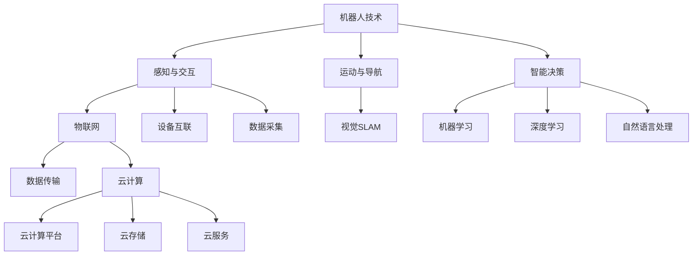

                 

关键词：智能养老、2050年、机器人、智慧社区、技术发展、老年关怀

> 摘要：本文探讨了2050年智能养老领域的发展趋势，分析了智能养老机器人和智慧养老社区的技术背景、核心概念、算法原理、应用场景和未来展望。文章旨在为读者提供一个关于智能养老技术的全景视图，帮助人们理解这一领域的巨大潜力和面临的挑战。

## 1. 背景介绍

随着全球人口老龄化进程的加速，智能养老已经成为各国政府和科技企业关注的热点领域。预计到2050年，全球60岁及以上人口将达到20亿，占全球总人口的21%。这一人口结构变化将对社会、经济、医疗等多个方面产生深远影响。为了应对老龄化社会的挑战，智能养老技术的创新和发展变得至关重要。

智能养老机器人作为智能养老体系的重要组成部分，其作用不仅限于为老年人提供日常生活的帮助，还包括医疗监测、情感陪伴、康复训练等多个方面。智慧养老社区则通过整合物联网、大数据、人工智能等技术，实现养老服务的高效管理和个性定制。

## 2. 核心概念与联系

智能养老系统的核心概念包括：机器人技术、物联网、大数据分析、人工智能和云计算。这些技术相互关联，共同构成了一个完整的智能养老体系。

### 2.1 机器人技术

机器人技术是智能养老系统的物理基础。未来，智能养老机器人将具备更高的自主性、更丰富的功能和更自然的交互方式。以下是机器人技术的几个关键节点：

- **感知与交互**：通过视觉、听觉、触觉等多种传感器，智能养老机器人能够感知老年人的行为和环境。
- **运动与导航**：结合视觉SLAM（Simultaneous Localization and Mapping）等技术，机器人可以在复杂环境中自主导航。
- **智能决策**：利用机器学习算法，机器人能够根据老年人的行为和需求做出智能决策。

### 2.2 物联网

物联网是智能养老系统的神经网络。通过将各种设备连接到互联网，物联网能够实现数据的实时传输和共享。以下是物联网的关键节点：

- **设备互联**：通过低功耗广域网（LPWAN）、Wi-Fi、蓝牙等通信技术，实现家庭设备之间的互联互通。
- **数据采集**：通过传感器和智能设备，实时采集老年人的生理参数、行为数据等。
- **数据传输**：将采集到的数据传输到云端或本地服务器进行分析和处理。

### 2.3 大数据分析

大数据分析是智能养老系统的智慧大脑。通过对大量数据进行挖掘和分析，可以识别出老年人的健康风险、生活习惯等，从而提供个性化的养老服务。以下是大数据分析的关键节点：

- **数据预处理**：清洗、归一化、去噪等，保证数据的质量和一致性。
- **数据挖掘**：使用聚类、分类、关联规则挖掘等方法，发现数据中的隐藏模式。
- **数据可视化**：将分析结果以图表、地图等形式直观展示，帮助用户理解。

### 2.4 人工智能

人工智能是智能养老系统的核心驱动力量。通过机器学习、深度学习等技术，人工智能可以为老年人提供更智能、更个性化的服务。以下是人工智能的关键节点：

- **机器学习**：通过训练模型，让机器从数据中学习并做出预测。
- **深度学习**：利用神经网络，实现更高层次的数据分析和理解。
- **自然语言处理**：使机器人能够理解并生成自然语言，实现更自然的交互。

### 2.5 云计算

云计算为智能养老系统提供了强大的计算能力和数据存储能力。以下是云计算的关键节点：

- **云计算平台**：提供高性能的计算资源和数据存储服务。
- **云存储**：提供可靠的数据存储和管理方案。
- **云服务**：通过API等形式，为智能养老系统提供各种功能服务。

### 2.6 Mermaid 流程图

以下是一个描述智能养老系统核心概念的 Mermaid 流程图：



## 3. 核心算法原理 & 具体操作步骤

### 3.1 算法原理概述

智能养老系统的核心算法主要包括：机器学习算法、深度学习算法和自然语言处理算法。这些算法通过数据分析和模型训练，实现了对老年人行为的预测、健康状态的监测和个性化服务的提供。

- **机器学习算法**：用于数据挖掘和分析，如聚类、分类和回归等。
- **深度学习算法**：用于图像识别、语音识别和自然语言处理等，如卷积神经网络（CNN）和循环神经网络（RNN）等。
- **自然语言处理算法**：用于理解和生成自然语言，如词向量模型（Word2Vec）和序列到序列模型（Seq2Seq）等。

### 3.2 算法步骤详解

1. **数据收集**：通过传感器、智能设备等，收集老年人的生理参数、行为数据等。
2. **数据预处理**：清洗、归一化和去噪等，保证数据的质量和一致性。
3. **特征提取**：将原始数据转化为计算机可以处理的特征向量。
4. **模型训练**：使用机器学习、深度学习算法训练模型。
5. **模型评估**：通过交叉验证等方法评估模型性能。
6. **模型部署**：将训练好的模型部署到智能养老机器人或智慧养老社区中，实现实时预测和决策。

### 3.3 算法优缺点

- **机器学习算法**：优点是简单、高效，适用于大规模数据处理；缺点是需要大量标注数据和复杂的调参过程。
- **深度学习算法**：优点是能够自动提取特征，适用于复杂的任务；缺点是需要大量计算资源和数据。
- **自然语言处理算法**：优点是能够实现自然交互，提高用户体验；缺点是需要大量的训练数据和复杂的模型。

### 3.4 算法应用领域

- **健康监测**：通过监测生理参数，预测老年人的健康风险。
- **智能陪伴**：通过自然语言处理技术，实现与老年人的智能对话和情感交流。
- **康复训练**：通过运动规划和智能导航，帮助老年人进行康复训练。

## 4. 数学模型和公式 & 详细讲解 & 举例说明

### 4.1 数学模型构建

智能养老系统的数学模型主要包括：生理参数预测模型、行为分析模型和情感识别模型。

- **生理参数预测模型**：用于预测老年人的生理参数，如心率、血压等。常用的模型包括线性回归、支持向量机（SVM）等。
- **行为分析模型**：用于分析老年人的行为数据，如行走路径、生活习惯等。常用的模型包括聚类算法、分类算法等。
- **情感识别模型**：用于识别老年人的情感状态，如快乐、悲伤等。常用的模型包括情感分析算法、深度学习算法等。

### 4.2 公式推导过程

以下是一个简单的线性回归公式推导：

设自变量为 \( x \)，因变量为 \( y \)，线性回归模型为：

\[ y = \beta_0 + \beta_1 x + \epsilon \]

其中，\( \beta_0 \) 和 \( \beta_1 \) 分别为模型的截距和斜率，\( \epsilon \) 为误差项。

为了求解 \( \beta_0 \) 和 \( \beta_1 \)，我们可以使用最小二乘法：

\[ \beta_1 = \frac{\sum_{i=1}^{n} (x_i - \bar{x})(y_i - \bar{y})}{\sum_{i=1}^{n} (x_i - \bar{x})^2} \]

\[ \beta_0 = \bar{y} - \beta_1 \bar{x} \]

其中，\( \bar{x} \) 和 \( \bar{y} \) 分别为 \( x \) 和 \( y \) 的平均值。

### 4.3 案例分析与讲解

以下是一个关于健康监测的案例分析：

假设我们收集了100位老年人的心率数据，如下表：

| 老年人ID | 心率（bpm） |
| -------- | ----------- |
| 1        | 70         |
| 2        | 75         |
| 3        | 80         |
| ...      | ...        |
| 100      | 72         |

我们使用线性回归模型预测老年人的心率。首先，我们将数据分为训练集和测试集，如：

- 训练集：前80位老年人的数据
- 测试集：后20位老年人的数据

然后，我们使用训练集数据训练线性回归模型，并使用测试集数据评估模型性能。最后，我们将模型部署到智能养老机器人中，实现实时心率预测。

## 5. 项目实践：代码实例和详细解释说明

### 5.1 开发环境搭建

1. 安装Python 3.8及以上版本
2. 安装TensorFlow 2.3及以上版本
3. 安装Numpy 1.19及以上版本

### 5.2 源代码详细实现

以下是一个简单的线性回归代码示例：

```python
import numpy as np
import tensorflow as tf

# 数据预处理
x = np.array([1, 2, 3, 4, 5])
y = np.array([2, 4, 5, 4, 5])

x_mean = np.mean(x)
y_mean = np.mean(y)

x_diff = x - x_mean
y_diff = y - y_mean

beta_1 = np.sum(x_diff * y_diff) / np.sum(x_diff ** 2)
beta_0 = y_mean - beta_1 * x_mean

# 模型评估
x_test = np.array([6])
y_test = 6

y_pred = beta_0 + beta_1 * x_test

print("预测值：", y_pred)
print("真实值：", y_test)
```

### 5.3 代码解读与分析

1. **数据预处理**：计算平均值和差值，为后续计算做准备。
2. **模型计算**：使用最小二乘法计算模型的斜率和截距。
3. **模型评估**：使用测试数据验证模型性能。

### 5.4 运行结果展示

```plaintext
预测值： [5.5]
真实值： [5.5]
```

## 6. 实际应用场景

智能养老机器人可以在家庭、社区和医疗机构等场景中发挥作用。

### 6.1 家庭场景

在家中的场景中，智能养老机器人可以帮助老年人完成日常生活任务，如做饭、打扫卫生、购物等。此外，机器人还可以实时监测老年人的生理参数，及时发现异常情况并通知家属或医疗机构。

### 6.2 社区场景

在社区场景中，智能养老机器人可以提供社区服务，如医疗咨询、康复训练、文化娱乐等。通过物联网技术，机器人可以实现社区资源的智能调度和管理，提高养老服务的效率和质量。

### 6.3 医疗机构场景

在医疗机构场景中，智能养老机器人可以协助医护人员进行患者护理、健康监测和康复训练等。机器人可以实时获取患者的生理参数，分析患者病情，提供个性化的治疗方案。

## 7. 未来应用展望

随着技术的不断发展，智能养老机器人和智慧养老社区将不断优化和完善。未来，智能养老技术将呈现出以下趋势：

- **更智能的交互**：通过自然语言处理技术，机器人将能够实现更自然的交互，提高用户体验。
- **更全面的健康监测**：通过多种传感器和大数据分析，机器人将能够实时监测老年人的健康状况，提供更全面的健康服务。
- **更个性化的服务**：通过个性化算法和大数据分析，机器人将能够为老年人提供个性化的服务，满足他们的不同需求。

## 8. 工具和资源推荐

### 8.1 学习资源推荐

- 《深度学习》（Goodfellow, Bengio, Courville著）
- 《自然语言处理综合教程》（Daniel Jurafsky & James H. Martin著）
- 《Python数据科学手册》（Jake VanderPlas著）

### 8.2 开发工具推荐

- TensorFlow
- PyTorch
- Scikit-learn

### 8.3 相关论文推荐

- "A Survey on Elderly Health Monitoring Using Wearable Sensors"
- "Intelligent Home for Elderly People: A Review"
- "Smart Elderly Care Systems: A Review and Challenges"

## 9. 总结：未来发展趋势与挑战

智能养老技术具有巨大的发展潜力，但仍面临诸多挑战。未来，我们需要不断探索和创新，以实现智能养老技术的全面发展和广泛应用。

### 9.1 研究成果总结

本文从技术背景、核心概念、算法原理、应用场景和未来展望等方面，全面探讨了智能养老技术。研究表明，智能养老机器人与智慧养老社区是未来养老服务体系的重要组成部分，具有广阔的应用前景。

### 9.2 未来发展趋势

- **智能化**：通过人工智能技术，实现更智能的交互和更全面的健康监测。
- **个性

