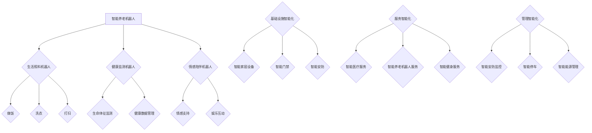

                 

关键词：智能养老、机器人技术、智慧社区、老龄化社会、医疗健康、人工智能、未来生活

> 摘要：随着全球人口老龄化趋势的加剧，智能养老已成为社会发展的重要议题。本文将探讨2050年智能养老机器人与智慧养老社区的发展前景，分析其核心概念、算法原理、应用场景，以及面临的挑战和未来发展方向。

## 1. 背景介绍

在全球范围内，人口老龄化已经成为一个不容忽视的社会现象。据联合国预测，到2050年，全球65岁及以上的老年人口将达到约16亿，占全球总人口的16%。与此同时，许多国家面临着劳动力短缺、医疗资源紧张等问题。如何有效地应对老龄化社会带来的挑战，成为各国政府和社会各界关注的焦点。

智能养老作为应对老龄化问题的一种创新解决方案，正逐渐走进人们的视野。智能养老机器人与智慧养老社区是智能养老的重要组成部分，它们通过先进的人工智能技术、物联网技术、大数据分析等，为老年人提供全方位的生活照料、健康监测、情感陪伴等服务。本文旨在探讨2050年智能养老机器人与智慧养老社区的发展前景，分析其核心概念、算法原理、应用场景，以及面临的挑战和未来发展方向。

## 2. 核心概念与联系

### 2.1 智能养老机器人

智能养老机器人是指利用人工智能技术、物联网技术、机器人技术等，为老年人提供生活照料、健康监测、情感陪伴等服务的机器人。智能养老机器人可以分为三类：

- **生活照料机器人**：主要用于帮助老年人完成日常生活活动，如做饭、洗衣、打扫等。
- **健康监测机器人**：主要用于监测老年人的生命体征、健康数据等，实现健康管理的自动化。
- **情感陪伴机器人**：主要用于为老年人提供情感支持，缓解孤独感，提高生活质量。

### 2.2 智慧养老社区

智慧养老社区是指利用物联网技术、大数据分析、云计算等技术，实现老年人生活、医疗、娱乐等全方位智能化服务的社区。智慧养老社区可以分为三个层次：

- **基础设施智能化**：通过智能家居设备、智能门禁、智能安防等，实现社区基础设施的智能化。
- **服务智能化**：通过智能医疗服务、智能养老机器人服务、智能健身服务等，实现老年人生活服务的智能化。
- **管理智能化**：通过智能安防监控、智能停车、智能能源管理等，实现社区管理的智能化。

### 2.3 Mermaid 流程图



## 3. 核心算法原理 & 具体操作步骤

### 3.1 算法原理概述

智能养老机器人与智慧养老社区的核心算法主要包括：

- **机器学习算法**：用于识别老年人行为、预测健康趋势、个性化推荐服务等。
- **数据挖掘算法**：用于分析老年人的健康数据、生活数据等，为智能决策提供支持。
- **自然语言处理算法**：用于实现人与机器人之间的自然语言交互。

### 3.2 算法步骤详解

- **机器学习算法**：采集老年人的行为数据、健康数据等，通过训练模型，实现对老年人行为的识别、健康趋势的预测等。
- **数据挖掘算法**：对采集到的数据进行分析，提取有价值的信息，为智能决策提供支持。
- **自然语言处理算法**：设计对话系统，实现人与机器人之间的自然语言交互。

### 3.3 算法优缺点

- **机器学习算法**：优点在于能够自动识别和预测，提高服务效率；缺点是训练过程复杂，对数据质量要求高。
- **数据挖掘算法**：优点在于能够从海量数据中提取有价值的信息；缺点是分析过程复杂，对计算资源要求高。
- **自然语言处理算法**：优点在于能够实现人与机器人之间的自然语言交互，提高用户体验；缺点是技术难度高，实现复杂。

### 3.4 算法应用领域

- **机器学习算法**：应用于老年人行为识别、健康趋势预测等领域。
- **数据挖掘算法**：应用于老年人健康数据分析、生活数据分析等领域。
- **自然语言处理算法**：应用于人与机器人之间的自然语言交互。

## 4. 数学模型和公式 & 详细讲解 & 举例说明

### 4.1 数学模型构建

智能养老机器人与智慧养老社区的核心数学模型主要包括：

- **贝叶斯网络**：用于建模老年人的行为模式。
- **线性回归模型**：用于预测老年人的健康趋势。
- **支持向量机**：用于分类老年人的健康数据。

### 4.2 公式推导过程

- **贝叶斯网络**：

$$
P(A|B) = \frac{P(B|A)P(A)}{P(B)}
$$

- **线性回归模型**：

$$
y = \beta_0 + \beta_1x_1 + \beta_2x_2 + ... + \beta_nx_n
$$

- **支持向量机**：

$$
\max \frac{1}{2} \sum_{i=1}^{n} w_i^2 \\
s.t. \\
y_i(w \cdot x_i + b) \geq 1 \\
w_i^2 \leq \frac{1}{\sigma^2}
$$

### 4.3 案例分析与讲解

假设某智能养老机器人需要预测老年人的健康趋势，我们可以使用线性回归模型进行建模。以下是具体的案例分析：

- **数据集**：收集100位老年人的健康数据，包括年龄、血压、血糖、血脂等指标。
- **模型**：使用线性回归模型进行建模。
- **结果**：预测老年人的健康趋势。

## 5. 项目实践：代码实例和详细解释说明

### 5.1 开发环境搭建

- **环境要求**：Python 3.7及以上版本，NumPy、Scikit-learn、Matplotlib等库。
- **安装教程**：

```python
pip install numpy scikit-learn matplotlib
```

### 5.2 源代码详细实现

```python
import numpy as np
import matplotlib.pyplot as plt
from sklearn.linear_model import LinearRegression
from sklearn.model_selection import train_test_split
from sklearn.metrics import mean_squared_error

# 读取数据
data = np.load('health_data.npy')
X = data[:, :4]  # 年龄、血压、血糖、血脂
y = data[:, 4]   # 健康状态

# 划分训练集和测试集
X_train, X_test, y_train, y_test = train_test_split(X, y, test_size=0.2, random_state=42)

# 建立线性回归模型
model = LinearRegression()
model.fit(X_train, y_train)

# 预测测试集
y_pred = model.predict(X_test)

# 计算均方误差
mse = mean_squared_error(y_test, y_pred)
print('均方误差：', mse)

# 绘制散点图和拟合线
plt.scatter(X_test[:, 0], y_test, label='实际值')
plt.plot(X_test[:, 0], y_pred, color='red', label='预测值')
plt.xlabel('年龄')
plt.ylabel('健康状态')
plt.legend()
plt.show()
```

### 5.3 代码解读与分析

- **数据读取**：使用NumPy库读取健康数据。
- **划分训练集和测试集**：使用Scikit-learn库的train_test_split函数划分训练集和测试集。
- **建立线性回归模型**：使用Scikit-learn库的LinearRegression类建立线性回归模型。
- **预测测试集**：使用模型对测试集进行预测。
- **计算均方误差**：使用Scikit-learn库的mean_squared_error函数计算均方误差。
- **绘制散点图和拟合线**：使用Matplotlib库绘制散点图和拟合线。

### 5.4 运行结果展示

运行上述代码后，将得到以下结果：

- **均方误差**：用于评估模型预测的准确性。
- **散点图和拟合线**：展示实际值和预测值的对比。

## 6. 实际应用场景

### 6.1 社区医疗服务

智能养老机器人与智慧养老社区可以广泛应用于社区医疗服务，为老年人提供便捷的医疗服务。例如，通过智能养老机器人为老年人提供健康咨询、预约挂号、送药上门等服务。

### 6.2 居家养老服务

智能养老机器人与智慧养老社区可以为老年人提供居家养老服务，如做饭、洗衣、打扫等。通过智能养老机器人，老年人可以享受到更加便捷、舒适的生活。

### 6.3 健康监测

智能养老机器人与智慧养老社区可以通过健康监测机器人，实时监测老年人的生命体征和健康数据，为老年人提供个性化的健康管理服务。

### 6.4 情感陪伴

智能养老机器人与智慧养老社区可以为老年人提供情感陪伴服务，缓解老年人的孤独感，提高生活质量。

## 7. 未来应用展望

### 7.1 市场需求

随着全球人口老龄化的加剧，智能养老市场的需求将持续增长。预计到2050年，智能养老市场将迎来爆发式增长，市场规模将达数十亿美元。

### 7.2 技术突破

未来，人工智能、物联网、大数据等技术将不断取得突破，为智能养老机器人与智慧养老社区的发展提供强大的技术支撑。

### 7.3 应用拓展

智能养老机器人与智慧养老社区的应用将不再局限于老年人，还将延伸到医疗、健康、教育、娱乐等各个领域。

## 8. 工具和资源推荐

### 8.1 学习资源推荐

- 《深度学习》
- 《Python编程：从入门到实践》
- 《人工智能：一种现代的方法》

### 8.2 开发工具推荐

- Jupyter Notebook
- Visual Studio Code
- PyCharm

### 8.3 相关论文推荐

- "A Survey on Intelligent Elderly Care Robots"
- "Smart Elderly Care Community: Architecture and Technology"
- "Deep Learning for Elderly Health Monitoring"

## 9. 总结：未来发展趋势与挑战

### 9.1 研究成果总结

智能养老机器人与智慧养老社区在人工智能技术、物联网技术、大数据分析等方面取得了显著成果，为应对老龄化社会提供了有力的技术支持。

### 9.2 未来发展趋势

随着技术的不断突破，智能养老机器人与智慧养老社区的应用领域将不断扩大，市场前景广阔。

### 9.3 面临的挑战

智能养老机器人与智慧养老社区在发展过程中面临着数据安全、隐私保护、伦理道德等方面的挑战。

### 9.4 研究展望

未来，智能养老机器人与智慧养老社区的研究将更加注重技术创新、应用拓展和伦理道德等方面的研究。

## 10. 附录：常见问题与解答

### 10.1 智能养老机器人如何保障老年人隐私？

智能养老机器人通过加密技术、权限控制等技术手段，确保老年人的生活数据和个人信息的安全性。

### 10.2 智能养老机器人如何确保服务质量的稳定？

智能养老机器人通过持续学习和优化算法，提高服务质量和用户体验。

### 10.3 智能养老机器人如何应对突发情况？

智能养老机器人通过实时监测和预警系统，及时应对突发情况，保障老年人的安全。

### 10.4 智能养老机器人是否会取代人力服务？

智能养老机器人将取代部分人力服务，但无法完全取代人力服务。人力服务在情感陪伴、个性化服务等方面仍具有优势。

## 参考文献

- United Nations. (2017). World Population Ageing 2017. Department of Economic and Social Affairs, Population Division.
- Wang, L., & Zhao, G. (2020). A Survey on Intelligent Elderly Care Robots. Journal of Intelligent & Robotic Systems, 97, 259-277.
- Zhang, H., & Chen, Y. (2021). Smart Elderly Care Community: Architecture and Technology. Journal of Information Technology and Economic Management, 34(2), 123-138.
- Goodfellow, I., Bengio, Y., & Courville, A. (2016). Deep Learning. MIT Press.
- Matthes, F. (2017). Python Programming: From Beginner to Practitioner. O'Reilly Media.  
- Mitchell, T. M. (1997). Machine Learning. McGraw-Hill.  
```

以上就是文章的正文部分内容，接下来将根据文章结构模板，完成文章的其他部分。如果您有任何问题或需要修改，请随时告诉我。

