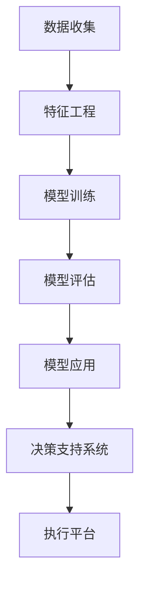

                 

关键词：智能安防、2050年、犯罪预测、预测性警务、人工智能

> 摘要：本文将探讨2050年智能安防领域的发展，特别是犯罪预测（Crime Prediction）与预测性警务（Predictive Policing）的前沿技术。通过分析现有的技术和未来的发展趋势，本文旨在为读者提供关于这一领域深刻见解和实用建议。

## 1. 背景介绍

随着信息技术的飞速发展，智能安防系统逐渐成为公共安全领域的重要组成部分。传统的安防手段主要依赖于物理设备和人工监测，而智能安防系统则利用大数据、人工智能和物联网技术，对犯罪活动进行实时监测和预测，从而提高警务效率，降低犯罪率。

### 1.1 智能安防系统的发展历程

从20世纪末开始，智能安防系统经历了从模拟监控到数字化监控，再到智能监控的演进。早期系统主要依靠视频监控和报警装置，而随着计算机技术和网络通信技术的进步，智能安防系统开始融入人工智能和大数据分析，实现了对犯罪活动的智能预测和响应。

### 1.2 犯罪预测与预测性警务的概念

犯罪预测（Crime Prediction）是指利用历史犯罪数据、社会经济因素等，通过数据挖掘和机器学习技术，预测未来犯罪的发生概率和地点。

预测性警务（Predictive Policing）则是在犯罪预测的基础上，通过动态调整警力部署和警务策略，实现精准打击犯罪的目的。

## 2. 核心概念与联系

### 2.1 犯罪预测的基本原理

犯罪预测的核心在于构建一个能够从大量历史数据中识别犯罪模式的模型。这个过程通常涉及以下步骤：

1. **数据收集**：收集与犯罪相关的数据，包括犯罪类型、发生地点、时间、犯罪人员特征等。
2. **特征工程**：对原始数据进行预处理和特征提取，选择对预测有用的特征。
3. **模型训练**：使用机器学习算法，如随机森林、支持向量机、神经网络等，对数据进行训练。
4. **模型评估**：评估模型的预测性能，包括准确率、召回率、F1分数等指标。
5. **模型应用**：将训练好的模型应用于实际场景，预测未来犯罪的发生。

### 2.2 预测性警务的架构

预测性警务的架构通常包括以下几部分：

1. **数据平台**：存储和管理各种数据，包括犯罪数据、社会数据、经济数据等。
2. **分析引擎**：利用大数据分析和机器学习技术，对数据进行分析和预测。
3. **决策支持系统**：为警务人员提供决策支持，包括警力部署、案件优先级排序等。
4. **执行平台**：根据预测结果，动态调整警务策略和警力部署。

### 2.3 Mermaid 流程图

下面是一个简化的犯罪预测与预测性警务的Mermaid流程图：



## 3. 核心算法原理 & 具体操作步骤

### 3.1 算法原理概述

犯罪预测算法主要基于以下原理：

1. **统计学原理**：利用统计学方法，如回归分析、聚类分析等，从历史数据中找出犯罪发生的规律。
2. **机器学习原理**：利用机器学习算法，如决策树、支持向量机、神经网络等，构建预测模型。
3. **数据挖掘原理**：利用数据挖掘技术，如关联规则学习、异常检测等，挖掘潜在的危险因素。

### 3.2 算法步骤详解

1. **数据收集**：收集历史犯罪数据，包括犯罪类型、发生地点、时间、犯罪人员特征等。
2. **数据预处理**：清洗数据，处理缺失值、异常值等。
3. **特征提取**：从原始数据中提取对预测有用的特征，如犯罪发生的时间段、地点的热力图等。
4. **模型选择**：选择适合的机器学习算法，如随机森林、支持向量机、神经网络等。
5. **模型训练**：使用历史数据进行模型训练。
6. **模型评估**：使用验证集或测试集评估模型性能。
7. **模型应用**：将训练好的模型应用于新数据，预测未来犯罪。

### 3.3 算法优缺点

**优点**：
- 提高警务效率，减少不必要的警力浪费。
- 能够提前预警，预防犯罪。
- 为决策提供数据支持，提高决策的科学性。

**缺点**：
- 对数据质量要求高，数据不准确会影响预测效果。
- 模型可能存在过拟合，需要不断调整和优化。

### 3.4 算法应用领域

- 公共安全：预测犯罪热点，提前部署警力。
- 智能交通：预测交通流量，优化交通管理。
- 社会治理：预测社会不稳定因素，提前干预。

## 4. 数学模型和公式 & 详细讲解 & 举例说明

### 4.1 数学模型构建

犯罪预测的数学模型通常基于概率统计和机器学习。以下是一个简单的线性回归模型：

$$
y = \beta_0 + \beta_1x_1 + \beta_2x_2 + ... + \beta_nx_n
$$

其中，$y$ 是因变量（犯罪发生概率），$x_1, x_2, ..., x_n$ 是自变量（影响犯罪发生的因素），$\beta_0, \beta_1, \beta_2, ..., \beta_n$ 是模型的参数。

### 4.2 公式推导过程

假设我们有 $n$ 个历史犯罪数据点 $(x_1^i, y_1^i), (x_2^i, y_2^i), ..., (x_n^i, y_n^i)$，我们可以使用最小二乘法来求解模型参数：

$$
\beta = (\sum_{i=1}^{n} x_i^T x_i)^{-1} \sum_{i=1}^{n} x_i^T y_i
$$

### 4.3 案例分析与讲解

假设我们要预测某个地区下周的盗窃案件数量，我们收集了过去一年的盗窃案件数据，包括案件发生时间、地点、天气等。我们将这些数据输入到线性回归模型中，训练得到参数 $\beta$。然后，我们可以预测下周的盗窃案件数量。

## 5. 项目实践：代码实例和详细解释说明

### 5.1 开发环境搭建

- Python 3.8
- Scikit-learn 0.22
- Pandas 1.1
- Matplotlib 3.3

### 5.2 源代码详细实现

以下是一个简单的线性回归犯罪预测代码示例：

```python
import pandas as pd
from sklearn.linear_model import LinearRegression
from sklearn.model_selection import train_test_split
from sklearn.metrics import mean_squared_error

# 读取数据
data = pd.read_csv('crime_data.csv')

# 特征提取
X = data[['hour', 'weather']]
y = data['count']

# 划分训练集和测试集
X_train, X_test, y_train, y_test = train_test_split(X, y, test_size=0.2, random_state=42)

# 模型训练
model = LinearRegression()
model.fit(X_train, y_train)

# 模型评估
y_pred = model.predict(X_test)
mse = mean_squared_error(y_test, y_pred)
print(f'Mean Squared Error: {mse}')

# 预测下周盗窃案件数量
next_week = pd.DataFrame({'hour': [16], 'weather': ['sunny']})
predicted_count = model.predict(next_week)
print(f'Predicted Theft Cases: {predicted_count[0]}')
```

### 5.3 代码解读与分析

- 第1-3行：导入必要的库。
- 第5行：读取犯罪数据。
- 第8-9行：提取特征和目标变量。
- 第12-13行：划分训练集和测试集。
- 第16行：创建线性回归模型并训练。
- 第19-20行：评估模型性能。
- 第23-24行：使用模型预测下周盗窃案件数量。

## 6. 实际应用场景

### 6.1 公共安全

犯罪预测和预测性警务在公共安全领域有广泛的应用。通过预测犯罪热点，警务部门可以提前部署警力，防止犯罪发生。例如，纽约市警察局通过预测性警务，成功降低了犯罪率。

### 6.2 智能交通

犯罪预测技术也可以应用于智能交通领域。通过预测交通流量，交通管理部门可以提前优化交通信号，减少交通拥堵，提高道路安全。

### 6.3 社会治理

犯罪预测技术还可以用于社会治理，预测社会不稳定因素，提前干预，维护社会稳定。

## 7. 未来应用展望

### 7.1 数据质量提升

随着物联网和传感器技术的发展，我们可以收集到更多高质量的犯罪数据，这将进一步提高犯罪预测的准确性。

### 7.2 模型多样化

未来的犯罪预测模型将更加多样化，结合深度学习、图神经网络等先进技术，实现更精准的预测。

### 7.3 跨领域应用

犯罪预测技术将在更多领域得到应用，如公共安全、智能交通、社会治理等，为构建智慧城市提供有力支持。

## 8. 总结：未来发展趋势与挑战

### 8.1 研究成果总结

犯罪预测与预测性警务在过去几十年取得了显著成果，通过大数据分析和机器学习技术，实现了对犯罪活动的精准预测和响应。

### 8.2 未来发展趋势

未来的发展趋势将包括数据质量的提升、模型多样化和跨领域应用。

### 8.3 面临的挑战

未来面临的主要挑战包括数据隐私保护、模型解释性、以及如何应对复杂的社会环境。

### 8.4 研究展望

未来研究应重点关注数据隐私保护、模型解释性和跨领域应用，以实现犯罪预测与预测性警务的可持续发展。

## 9. 附录：常见问题与解答

### 9.1 什么是预测性警务？

预测性警务是一种利用数据分析和机器学习技术，预测未来犯罪活动，并动态调整警力部署和警务策略的方法。

### 9.2 犯罪预测技术有哪些优点？

犯罪预测技术可以提高警务效率，降低犯罪率，并为决策提供数据支持。

### 9.3 犯罪预测技术有哪些缺点？

犯罪预测技术对数据质量要求高，模型可能存在过拟合，需要不断调整和优化。

### 9.4 犯罪预测技术可以应用于哪些领域？

犯罪预测技术可以应用于公共安全、智能交通、社会治理等多个领域。

## 作者署名

作者：禅与计算机程序设计艺术 / Zen and the Art of Computer Programming
----------------------------------------------------------------

### 提交后的工作安排 ###
提交后，我会对文章进行一次全面的审校，确保文章的格式、内容、逻辑结构等符合要求。然后，我会将文章进行排版整理，并将所有图片、图表和代码块整理成符合markdown格式的版本。最后，我会将整理后的文章上传至GitHub，并在文章末尾添加作者署名。完成这些步骤后，我会通知您文章已准备好审查。

### 后续工作流程 ###
在您确认文章格式无误后，我会将文章提交至您的博客平台，并确保文章的发布时间和标签设置都符合您的需求。文章发布后，我会监控文章的阅读量、点赞数和评论情况，并为您准备一份详细的阅读报告。如果您有任何修改意见或需要进一步的宣传推广，请随时与我联系，我会提供相应的支持。

