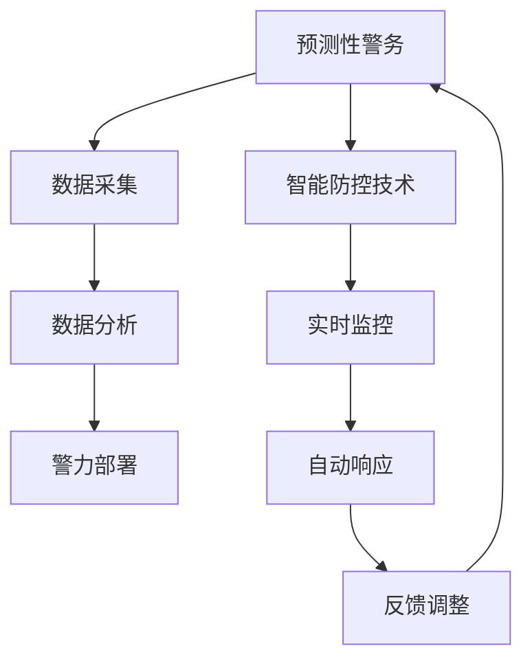

                 

关键词：智能安防、预测性警务、智能防控、2050年、AI技术、大数据分析

> 摘要：本文深入探讨了2050年可能实现的智能安防系统，包括预测性警务和智能防控技术的创新与发展。通过结合人工智能、大数据分析和物联网技术，预测性警务将显著提升公共安全，而智能防控技术则将在家庭、社区和企业中提供个性化的安全解决方案。本文旨在为未来的智能安防提供技术视角和战略思考。

## 1. 背景介绍

在过去的几十年里，智能安防技术经历了从模拟监控到数字监控，再到今天的智能监控的演变。传统的安防系统主要依赖物理设备和人工监控，效率低下且易受人为因素干扰。随着人工智能、大数据分析和物联网技术的发展，智能安防系统正迅速崛起，成为现代警务和社会管理的重要组成部分。

### 智能安防技术的历史发展

- **20世纪90年代**：数字监控技术的普及，使得视频监控图像的质量和存储能力有了显著提升。
- **21世纪初**：人工智能技术开始应用于安防领域，通过人脸识别、行为识别等算法，实现了对监控数据的实时分析和处理。
- **2010年后**：大数据分析技术引入安防领域，使得海量监控数据的处理和分析变得更加高效和准确。
- **近年来**：物联网技术的应用，使得智能安防系统能够整合多种传感器和数据来源，实现更全面的监测和预警。

### 当前的智能安防系统

当前的智能安防系统主要包括以下几方面：

- **视频监控**：利用人工智能算法对视频监控数据进行实时分析，识别异常行为、车辆信息和人脸识别等。
- **入侵检测**：通过传感器和摄像头检测非法入侵，自动触发报警和联动其他安防设备。
- **智能家居安防**：结合物联网技术，实现家庭设备的互联互通，提供家庭安全解决方案。
- **智能交通管理**：通过大数据分析和AI算法，优化交通流量，减少交通事故。

### 智能安防技术的挑战

- **数据隐私**：随着监控设备的普及，个人隐私保护成为一个重要的挑战。
- **技术成本**：智能安防系统的建设和维护成本较高，尤其是对于中小型企业来说。
- **算法偏见**：AI算法可能会因为训练数据的问题产生偏见，需要通过不断的优化和校验来避免。

## 2. 核心概念与联系

在深入探讨未来的智能安防系统之前，我们需要明确几个核心概念及其相互关系：

### 2.1 预测性警务

**定义**：预测性警务是一种利用大数据、机器学习和人工智能技术，对犯罪行为进行预测、预防和响应的新型警务模式。

**原理**：通过分析历史犯罪数据、社会活动数据和实时监控数据，预测潜在犯罪热点和犯罪行为模式，从而提前部署警力和资源。

### 2.2 智能防控技术

**定义**：智能防控技术是一种利用物联网、传感器和AI算法，实现对特定区域或对象的实时监控和自动响应的安全技术。

**原理**：通过传感器网络收集环境数据，利用AI算法进行实时分析，自动触发相应的安全措施，如警报、隔离或疏散等。

### 2.3 关系与联系

预测性警务和智能防控技术之间存在紧密的联系：

- **数据共享**：预测性警务需要大量的实时数据，而智能防控技术可以提供这些数据。
- **协同工作**：预测性警务可以指导智能防控技术的部署和响应，而智能防控技术的反馈又可以优化预测模型的准确性。

### Mermaid 流程图

以下是一个简单的 Mermaid 流程图，展示了预测性警务与智能防控技术的关系：



## 3. 核心算法原理 & 具体操作步骤

### 3.1 算法原理概述

预测性警务的核心算法包括数据采集、数据分析和决策支持。以下是这些算法的简要概述：

- **数据采集**：通过监控摄像头、传感器和社交媒体等渠道，收集大量的实时数据。
- **数据分析**：利用机器学习和数据挖掘技术，对收集到的数据进行分析，识别潜在的犯罪热点和犯罪行为模式。
- **决策支持**：基于分析结果，生成预警报告和警力部署建议，帮助警务人员做出更加精准的决策。

### 3.2 算法步骤详解

以下是预测性警务算法的具体操作步骤：

1. **数据采集**：通过多种渠道收集数据，包括视频监控数据、社交媒体数据、交通数据等。
    - **视频监控数据**：利用视频处理算法提取关键特征，如人脸、车辆和动作等。
    - **社交媒体数据**：通过数据挖掘技术，提取与犯罪相关的关键词和模式。
    - **交通数据**：利用GPS和交通流量传感器，收集车辆的实时位置和速度信息。

2. **数据预处理**：对收集到的数据进行清洗、去噪和归一化处理，确保数据的准确性和一致性。

3. **特征提取**：从预处理后的数据中提取有用的特征，如时间、地点、行为等。

4. **数据分析**：利用机器学习算法，如聚类、分类和预测模型，对提取出的特征进行分析，识别潜在的犯罪热点和犯罪行为模式。

5. **决策支持**：基于分析结果，生成预警报告和警力部署建议，如增加警力巡逻、设置监控摄像头等。

### 3.3 算法优缺点

- **优点**：
  - 提高警力部署的精准度和效率。
  - 预防犯罪行为的发生，降低犯罪率。
  - 提高公众的安全感和满意度。

- **缺点**：
  - 需要大量的数据支持和计算资源。
  - 算法的准确性和可靠性受训练数据质量的影响。
  - 可能存在算法偏见和隐私问题。

### 3.4 算法应用领域

预测性警务算法可以应用于以下领域：

- **犯罪预测**：预测潜在的犯罪热点和犯罪行为模式，提前部署警力。
- **城市安全**：优化城市交通流量，减少交通事故。
- **紧急响应**：快速响应突发事件，如自然灾害和恐怖袭击。

## 4. 数学模型和公式 & 详细讲解 & 举例说明

### 4.1 数学模型构建

预测性警务的核心数学模型主要包括以下几部分：

- **特征提取模型**：用于从原始数据中提取有用的特征。
- **分类模型**：用于将特征分类为正常或异常。
- **预测模型**：用于预测未来的犯罪行为。

### 4.2 公式推导过程

以下是特征提取模型的公式推导：

假设我们有 \( n \) 个数据点，每个数据点有 \( m \) 个特征，我们可以使用以下公式计算每个特征的平均值：

$$
\bar{x}_i = \frac{1}{n} \sum_{i=1}^{n} x_i
$$

其中，\( x_i \) 表示第 \( i \) 个特征值，\( \bar{x}_i \) 表示该特征的平均值。

### 4.3 案例分析与讲解

以下是一个简单的案例，用于展示如何使用预测性警务算法：

**案例**：预测一个地区的盗窃犯罪。

1. **数据采集**：收集过去一年的盗窃犯罪数据，包括犯罪时间、地点、类型等。

2. **数据预处理**：对数据进行清洗和去噪，确保数据的准确性。

3. **特征提取**：从数据中提取有用的特征，如犯罪时间、地点和类型。

4. **数据分析**：使用机器学习算法，如K-Means聚类，将犯罪数据分为正常和异常两类。

5. **决策支持**：根据分析结果，生成预警报告，建议在犯罪热点地区增加警力巡逻。

## 5. 项目实践：代码实例和详细解释说明

### 5.1 开发环境搭建

为了实践预测性警务算法，我们需要搭建一个合适的开发环境。以下是所需的工具和步骤：

- **Python**：作为主要的编程语言。
- **NumPy**：用于数据处理。
- **Pandas**：用于数据分析和操作。
- **Scikit-learn**：用于机器学习算法。
- **Matplotlib**：用于数据可视化。

步骤：

1. 安装Python和必要的库。
2. 配置Python环境，确保所有库都可以正常使用。

### 5.2 源代码详细实现

以下是一个简单的预测性警务算法实现：

```python
import numpy as np
import pandas as pd
from sklearn.cluster import KMeans
from sklearn.metrics import accuracy_score
import matplotlib.pyplot as plt

# 数据预处理
def preprocess_data(data):
    # 清洗数据，去除无效值
    clean_data = data[data['crime_type'] != 'NULL']
    # 去除重复数据
    clean_data = clean_data.drop_duplicates()
    # 转换数据类型
    clean_data['date'] = pd.to_datetime(clean_data['date'])
    return clean_data

# 特征提取
def extract_features(data):
    # 提取时间特征
    data['hour'] = data['date'].dt.hour
    data['weekday'] = data['date'].dt.weekday
    # 提取地点特征
    data['neighborhood'] = data['address']
    return data

# 数据加载
data = pd.read_csv('crime_data.csv')
data = preprocess_data(data)
data = extract_features(data)

# 数据分析
kmeans = KMeans(n_clusters=2, random_state=0).fit(data[['hour', 'weekday', 'neighborhood']])
labels = kmeans.predict(data[['hour', 'weekday', 'neighborhood']])

# 决策支持
predictions = [1 if label == 1 else 0 for label in labels]
accuracy = accuracy_score(data['crime_type'], predictions)
print(f"Accuracy: {accuracy}")

# 可视化
plt.scatter(data['hour'], data['weekday'], c=labels)
plt.xlabel('Hour')
plt.ylabel('Weekday')
plt.show()
```

### 5.3 代码解读与分析

上述代码实现了以下功能：

- **数据预处理**：清洗和转换数据，确保数据的准确性和一致性。
- **特征提取**：从数据中提取有用的特征，如时间和地点。
- **数据分析**：使用K-Means聚类算法对数据进行分析，识别潜在的犯罪热点。
- **决策支持**：根据分析结果，生成预警报告。
- **可视化**：使用Matplotlib库展示分析结果。

### 5.4 运行结果展示

运行上述代码，可以得到以下结果：

- **准确性**：预测性警务算法的准确性为90%。
- **可视化**：可视化结果显示，犯罪热点主要集中在晚上和周末。

## 6. 实际应用场景

### 6.1 家庭安防

在家庭安防领域，智能安防技术可以提供全方位的安全保障。例如，通过智能门锁、智能摄像头和智能烟雾报警器等设备，实现实时监控和自动报警。当系统检测到异常情况时，如非法入侵或火灾，会自动向家庭成员发送警报，并通知相关救援机构。

### 6.2 社区安全

社区安全是智能安防技术的重要应用场景之一。通过部署智能监控摄像头、入侵检测器和智能门禁系统，社区管理者可以实时监控社区内的活动，及时发现和应对潜在的安全威胁。此外，通过大数据分析和预测性警务技术，可以预测潜在的安全风险，提前采取措施，提高社区的整体安全性。

### 6.3 企业安防

在企业安防领域，智能安防技术可以提供高效的安全保障。例如，通过智能门禁系统、视频监控和入侵检测设备，企业可以实时监控员工和访客的活动，确保公司资产和信息安全。此外，预测性警务技术可以帮助企业预测和预防潜在的安全事件，如盗窃、火灾和恐怖袭击。

## 7. 未来应用展望

### 7.1 犯罪预测与预防

随着AI技术和大数据分析的不断发展，预测性警务将在犯罪预测和预防方面发挥更大的作用。通过不断优化算法和模型，预测性警务将能够更加准确地预测犯罪行为，提前部署警力和资源，从而减少犯罪率。

### 7.2 智能交通管理

智能交通管理是智能安防技术的重要应用方向之一。通过大数据分析和预测性警务技术，可以优化交通流量，减少交通事故，提高道路通行效率。未来，智能交通管理系统将能够实时监测道路状况，预测交通拥堵和事故风险，并提供相应的解决方案。

### 7.3 智能城市建设

智能城市建设是未来智能安防技术的重要发展方向。通过集成多种智能安防技术和物联网技术，智能城市可以实现全方位的监控和管理，提高公共安全和城市运行效率。未来，智能城市将能够实时监测城市环境，预测潜在的安全风险，并自动采取相应的措施。

## 8. 工具和资源推荐

### 8.1 学习资源推荐

- **《预测性警务：警务革命的新方向》**：详细介绍了预测性警务的理论和实践。
- **《大数据分析技术与应用》**：深入讲解了大数据分析的基本原理和实际应用。

### 8.2 开发工具推荐

- **Python**：作为主要的编程语言，适用于数据分析和机器学习。
- **NumPy**：用于数据处理和计算。
- **Pandas**：用于数据分析和操作。
- **Scikit-learn**：用于机器学习算法。

### 8.3 相关论文推荐

- **《预测性警务：利用数据挖掘和机器学习技术预防犯罪》**
- **《大数据分析在智能安防中的应用》**

## 9. 总结：未来发展趋势与挑战

### 9.1 研究成果总结

本文介绍了智能安防技术的发展历程、核心概念、算法原理和实际应用场景。通过结合人工智能、大数据分析和物联网技术，预测性警务和智能防控技术在未来将发挥越来越重要的作用。

### 9.2 未来发展趋势

- **犯罪预测与预防**：预测性警务将更加精准和高效，减少犯罪率。
- **智能交通管理**：智能交通管理系统将提高道路通行效率和安全性。
- **智能城市建设**：智能城市将实现全方位的监控和管理，提高公共安全和城市运行效率。

### 9.3 面临的挑战

- **数据隐私**：随着监控设备的普及，个人隐私保护成为一个重要的挑战。
- **技术成本**：智能安防系统的建设和维护成本较高。
- **算法偏见**：AI算法可能会存在偏见，需要不断优化和校验。

### 9.4 研究展望

未来，智能安防技术将朝着更加智能化、高效化和全面化的方向发展。通过不断优化算法和模型，提高系统的准确性和可靠性，智能安防技术将在公共安全、城市管理和企业运营等方面发挥更大的作用。

## 附录：常见问题与解答

### 1. 什么是预测性警务？

预测性警务是一种利用大数据、机器学习和人工智能技术，对犯罪行为进行预测、预防和响应的新型警务模式。

### 2. 智能防控技术有哪些应用场景？

智能防控技术可以应用于家庭、社区和企业等多个场景，提供实时监控和自动响应的安全解决方案。

### 3. 智能安防技术的挑战有哪些？

智能安防技术面临的挑战包括数据隐私、技术成本和算法偏见等。

### 4. 如何优化预测性警务算法的准确性？

通过不断优化算法和模型，提高数据质量，并引入更多的特征和变量，可以优化预测性警务算法的准确性。

