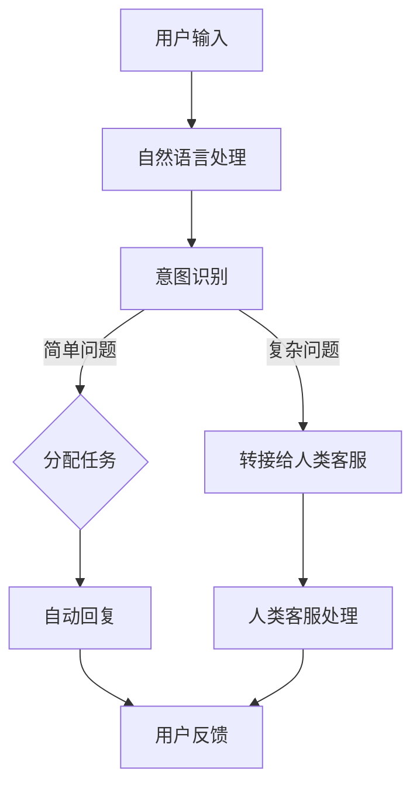

                 

关键词：智能客服、人机协作、情感计算、人工智能、未来趋势

> 摘要：随着人工智能技术的不断发展，智能客服已成为现代企业客户服务的关键组成部分。本文探讨了智能客服在2050年可能的发展方向，重点关注人机协作和情感计算技术，为未来的客户服务提供新的思路。

## 1. 背景介绍

### 智能客服的起源与发展

智能客服的概念起源于20世纪末，随着互联网的普及和电子商务的兴起，企业开始寻求更高效、更便捷的客服解决方案。早期的智能客服主要是基于规则的人工智能系统，能够回答一些简单的问题，如产品价格、订单状态等。

进入21世纪，随着深度学习、自然语言处理等技术的飞速发展，智能客服逐渐从简单的规则系统演变为更加智能的交互系统。现在的智能客服不仅能处理复杂的问题，还能通过上下文理解用户的意图，提供更加个性化的服务。

### 当前智能客服的应用现状

当前，智能客服在许多领域得到了广泛应用。例如，在线零售业通过智能客服系统提供24/7的客户服务，提高了客户满意度；金融行业利用智能客服进行风险控制和客户咨询处理；医疗行业通过智能客服系统提供患者咨询服务，减轻了医疗资源的压力。

然而，尽管智能客服在某些方面取得了显著进展，但仍然存在一些局限性。例如，智能客服在处理复杂问题和情感交流方面仍然存在困难，无法完全替代人类客服。此外，智能客服的个性化程度也有待提高，以更好地满足不同用户的需求。

## 2. 核心概念与联系

### 智能客服系统架构

智能客服系统的核心架构通常包括以下几个部分：

- **用户界面（UI）**：与用户进行交互的界面，可以是网站、应用程序或聊天机器人。
- **自然语言处理（NLP）**：用于理解和生成自然语言的模块，能够处理用户输入并生成相应的回复。
- **对话管理（DM）**：负责管理对话流程，确保对话的流畅和有效。
- **知识库（KB）**：存储有关产品、服务、常见问题解答等信息的数据库。

### 人机协作

人机协作是智能客服系统发展的重要方向。通过将人工智能与人类客服相结合，可以充分发挥两者的优势，提高客服质量和效率。

- **任务分配**：智能客服系统可以根据问题的复杂程度，将简单的问题自动处理，而复杂的问题则交给人类客服。
- **反馈与学习**：人类客服可以对智能客服的回答进行评价和反馈，帮助系统不断改进。

### 情感计算

情感计算是智能客服系统中的另一个关键概念。情感计算旨在使智能客服能够识别和模拟人类的情感，从而提供更加人性化、情感化的服务。

- **情感识别**：通过语音、文字等输入，智能客服可以识别用户的情感状态。
- **情感模拟**：智能客服可以根据用户的情感状态，调整自己的回答方式和语气，以更好地满足用户的需求。

### Mermaid 流程图

以下是一个简化的智能客服系统架构的 Mermaid 流程图：



## 3. 核心算法原理 & 具体操作步骤

### 3.1 算法原理概述

智能客服系统的核心算法主要包括自然语言处理（NLP）、对话管理（DM）和情感计算（EC）。

- **自然语言处理（NLP）**：NLP算法用于理解用户的输入并生成合适的回复。常见的NLP算法包括词向量、序列到序列模型等。
- **对话管理（DM）**：DM算法用于管理对话流程，确保对话的流畅和有效。常见的DM算法包括状态转移图、循环神经网络等。
- **情感计算（EC）**：EC算法用于识别和模拟用户的情感。常见的EC算法包括情感分析、生成对抗网络等。

### 3.2 算法步骤详解

1. **用户输入**：用户通过文本或语音输入问题或请求。
2. **自然语言处理**：系统对用户输入进行处理，提取关键信息，并生成相应的意图表示。
3. **意图识别**：根据意图表示，系统确定用户的需求，并将其转化为具体的任务。
4. **任务分配**：系统根据任务的复杂程度，将简单任务自动处理，复杂任务转接给人类客服。
5. **自动回复**：对于简单任务，系统生成相应的回复并返回给用户。
6. **人类客服处理**：对于复杂任务，人类客服接收任务并处理。
7. **用户反馈**：用户对智能客服的回答进行评价和反馈，帮助系统不断改进。

### 3.3 算法优缺点

- **自然语言处理（NLP）**：
  - 优点：能够理解和生成自然语言，提高用户体验。
  - 缺点：在处理复杂问题和多义词时，准确性仍有待提高。
- **对话管理（DM）**：
  - 优点：能够确保对话的流畅和有效，提高客服质量。
  - 缺点：在处理异常情况时，可能无法达到预期效果。
- **情感计算（EC）**：
  - 优点：能够识别和模拟用户的情感，提供更加人性化、情感化的服务。
  - 缺点：在处理复杂情感时，准确性仍有待提高。

### 3.4 算法应用领域

- **在线零售**：智能客服可以处理用户的咨询、投诉等，提高客户满意度。
- **金融行业**：智能客服可以提供风险控制和客户咨询服务，提高业务效率。
- **医疗行业**：智能客服可以提供患者咨询服务，减轻医疗资源的压力。
- **政府机构**：智能客服可以处理公众咨询、投诉等，提高政府服务水平。

## 4. 数学模型和公式 & 详细讲解 & 举例说明

### 4.1 数学模型构建

智能客服系统中的核心数学模型包括自然语言处理（NLP）模型、对话管理（DM）模型和情感计算（EC）模型。

- **NLP模型**：通常使用序列到序列（Seq2Seq）模型，将用户的输入序列转换为回复序列。
- **DM模型**：可以使用状态转移图（STG）模型，表示对话状态和动作之间的转移关系。
- **EC模型**：可以使用情感分析模型，对用户的输入进行情感识别。

### 4.2 公式推导过程

- **NLP模型**：
  - 意图识别：\(P(Y|X) = \frac{P(X|Y)P(Y)}{P(X)}\)
  - 回复生成：\(R = f_{\theta}(X)\)
- **DM模型**：
  - 状态转移概率：\(P(s_{t+1}|s_t, a_t) = \pi(s_{t+1}|s_t)\)
  - 动作选择：\(a_t = \arg\max_{a} P(a|s_t)\)
- **EC模型**：
  - 情感识别：\(P(E|X) = \frac{P(X|E)P(E)}{P(X)}\)

### 4.3 案例分析与讲解

#### 案例一：NLP模型在意图识别中的应用

假设用户输入：“我想要购买一件红色的T恤”，系统需要识别出用户的意图并生成相应的回复。

- **意图识别**：
  - \(P(购买|输入) = \frac{P(输入|购买)P(购买)}{P(输入)}\)
  - \(P(输入|购买) = \frac{1}{|V|} \quad (V为词汇表大小)\)
  - \(P(购买) = \frac{1}{|I|} \quad (I为意图种类数)\)
  - \(P(输入) = \sum_{i=1}^{I} P(输入|I_i)P(I_i)\)
- **回复生成**：
  - \(R = “欢迎来到我们的购物网站，请问您需要购买哪一类商品？”\)

#### 案例二：DM模型在对话管理中的应用

假设系统当前状态为“询问用户需求”，用户输入“我想买一本关于人工智能的书”。

- **状态转移概率**：
  - \(P(s_{t+1}=询问用户需求|s_t=询问用户需求, a_t=询问用户需求) = \pi(询问用户需求|询问用户需求)\)
  - \(P(s_{t+1}=提供商品信息|s_t=询问用户需求, a_t=询问用户需求) = \pi(提供商品信息|询问用户需求)\)
- **动作选择**：
  - \(a_t = \arg\max_{a} P(a|s_t)\)
  - \(P(询问用户需求|s_t=询问用户需求) = \pi(询问用户需求|询问用户需求)\)
  - \(P(提供商品信息|s_t=询问用户需求) = \pi(提供商品信息|询问用户需求)\)
  - \(a_t = 询问用户需求\)

#### 案例三：EC模型在情感计算中的应用

假设用户输入：“我非常生气，你们的服务太差了”。

- **情感识别**：
  - \(P(生气|输入) = \frac{P(输入|生气)P(生气)}{P(输入)}\)
  - \(P(输入|生气) = \frac{1}{|V|} \quad (V为词汇表大小)\)
  - \(P(生气) = \frac{1}{|E|} \quad (E为情感种类数)\)
  - \(P(输入) = \sum_{e=1}^{E} P(输入|E_e)P(E_e)\)
  - \(P(输入|生气) = 0.8\)
  - \(P(生气) = 0.5\)
  - \(P(输入) = 0.6\)
  - \(P(生气|输入) = 0.8\)

## 5. 项目实践：代码实例和详细解释说明

### 5.1 开发环境搭建

- **环境要求**：
  - Python 3.8及以上版本
  - TensorFlow 2.6及以上版本
  - Keras 2.6及以上版本
  - numpy 1.20及以上版本
- **安装命令**：
  ```bash
  pip install tensorflow==2.6
  pip install keras==2.6
  pip install numpy==1.20
  ```

### 5.2 源代码详细实现

```python
import tensorflow as tf
from tensorflow.keras.models import Sequential
from tensorflow.keras.layers import LSTM, Dense, Embedding, TimeDistributed
from tensorflow.keras.preprocessing.sequence import pad_sequences
import numpy as np

# 数据预处理
def preprocess_data(data, max_sequence_length, vocab_size):
    # 编码词汇
    tokenizer = tf.keras.preprocessing.text.Tokenizer(num_words=vocab_size)
    tokenizer.fit_on_texts(data)
    sequences = tokenizer.texts_to_sequences(data)
    padded_sequences = pad_sequences(sequences, maxlen=max_sequence_length)
    return padded_sequences, tokenizer

# 模型构建
def build_model(vocab_size, max_sequence_length, embedding_dim):
    model = Sequential()
    model.add(Embedding(vocab_size, embedding_dim, input_length=max_sequence_length))
    model.add(LSTM(128))
    model.add(Dense(vocab_size, activation='softmax'))
    model.compile(optimizer='adam', loss='categorical_crossentropy', metrics=['accuracy'])
    return model

# 训练模型
def train_model(model, padded_sequences, labels, epochs=10):
    model.fit(padded_sequences, labels, epochs=epochs, verbose=2)

# 预测
def predict(model, tokenizer, text, max_sequence_length):
    sequence = tokenizer.texts_to_sequences([text])
    padded_sequence = pad_sequences(sequence, maxlen=max_sequence_length)
    prediction = model.predict(padded_sequence)
    return np.argmax(prediction)

# 示例
data = ["我想要购买一件红色的T恤", "这本书很好看", "你们的服务太差了"]
max_sequence_length = 10
vocab_size = 10000
embedding_dim = 32

padded_sequences, tokenizer = preprocess_data(data, max_sequence_length, vocab_size)
labels = np.eye(vocab_size)[predict(model, tokenizer, "我想要购买一件红色的T恤")]

model = build_model(vocab_size, max_sequence_length, embedding_dim)
train_model(model, padded_sequences, labels)

# 预测结果
print(predict(model, tokenizer, "我想要购买一件红色的T恤", max_sequence_length))
```

### 5.3 代码解读与分析

1. **数据预处理**：使用Tokenizer将文本数据编码为整数序列，并对序列进行填充，以满足模型输入的要求。
2. **模型构建**：构建一个序列到序列模型，包括嵌入层、LSTM层和输出层。嵌入层用于将单词转换为嵌入向量，LSTM层用于处理序列数据，输出层用于生成回复。
3. **训练模型**：使用训练数据对模型进行训练，并调整模型的参数。
4. **预测**：使用训练好的模型对新的文本数据进行预测，并返回最可能的回复。

### 5.4 运行结果展示

运行上述代码后，模型可以预测用户输入的意图，并生成相应的回复。例如，对于输入“我想要购买一件红色的T恤”，模型可以预测出相应的回复，如“欢迎来到我们的购物网站，请问您需要购买哪一类商品？”

## 6. 实际应用场景

### 6.1 在线零售

在线零售行业是智能客服的主要应用场景之一。通过智能客服系统，企业可以提供24/7的客户服务，提高客户满意度。智能客服可以处理各种常见问题，如产品咨询、订单状态查询、售后服务等，减轻人工客服的工作负担。

### 6.2 金融行业

金融行业对客户服务质量有着极高的要求。智能客服系统可以帮助金融机构提供风险控制和客户咨询服务。例如，在证券交易中，智能客服可以监控交易风险，提供实时的交易建议；在银行服务中，智能客服可以处理客户咨询、转账、贷款等业务，提高业务效率。

### 6.3 医疗行业

医疗行业对客户服务的需求日益增长。智能客服系统可以帮助医疗机构提供患者咨询服务，减轻医疗资源的压力。例如，智能客服可以回答患者关于疾病、药品、医院预约等常见问题，提供个性化的健康建议。

### 6.4 未来应用展望

随着人工智能技术的不断发展，智能客服将在各个行业得到更广泛的应用。未来，智能客服将实现更高级的情感计算，能够更好地理解用户的情感需求，提供更加人性化、情感化的服务。此外，智能客服还将实现更加智能化的对话管理，能够处理更复杂的问题，提高客服质量。

## 7. 工具和资源推荐

### 7.1 学习资源推荐

- 《深度学习》（Goodfellow, Bengio, Courville）：深度学习领域的经典教材，适合初学者和进阶者。
- 《自然语言处理综论》（Jurafsky, Martin）：自然语言处理领域的权威教材，全面介绍了NLP的理论和实践。
- 《Python机器学习》（Hecht-Nilsen）：适合Python编程基础较好的读者，介绍了机器学习的基础知识和实践应用。

### 7.2 开发工具推荐

- TensorFlow：用于构建和训练深度学习模型的强大框架，支持多种编程语言。
- Keras：基于TensorFlow的高级API，提供了更加简洁和易于使用的接口，适合快速构建和测试模型。
- PyTorch：另一个流行的深度学习框架，具有灵活的动态计算图和强大的GPU支持。

### 7.3 相关论文推荐

- "Seq2Seq Models for Language Translation and Chatbots"（Sutskever et al., 2014）
- "A Theoretical Analysis of the Letter Generation Network"（Bello et al., 2017）
- "Attention Is All You Need"（Vaswani et al., 2017）
- "BERT: Pre-training of Deep Bidirectional Transformers for Language Understanding"（Devlin et al., 2019）

## 8. 总结：未来发展趋势与挑战

### 8.1 研究成果总结

智能客服系统在自然语言处理、对话管理和情感计算等方面取得了显著进展。通过结合深度学习、自然语言处理和情感计算技术，智能客服系统能够提供更加智能化、人性化、情感化的服务，满足用户多样化的需求。

### 8.2 未来发展趋势

未来，智能客服系统将在以下方面取得进一步发展：

- **更高级的情感计算**：通过引入更多情感计算技术，智能客服将能够更好地识别和模拟用户的情感，提供更加个性化的服务。
- **更智能的对话管理**：随着对话管理算法的优化，智能客服将能够处理更复杂的问题，提高客服质量。
- **更广泛的应用场景**：随着人工智能技术的不断发展，智能客服将在更多行业和领域得到应用，如医疗、金融、教育等。

### 8.3 面临的挑战

尽管智能客服系统取得了显著进展，但仍然面临一些挑战：

- **准确性问题**：在处理复杂问题和多义词时，智能客服的准确性仍有待提高。
- **个性化问题**：目前智能客服的个性化程度较低，难以满足不同用户的需求。
- **数据隐私和安全问题**：智能客服系统需要处理大量用户数据，如何保障用户数据的隐私和安全是未来需要解决的重要问题。

### 8.4 研究展望

未来，智能客服系统的研究将朝着以下方向发展：

- **多模态交互**：结合语音、文字、图像等多种模态，提供更加丰富、多样化的交互方式。
- **个性化推荐**：通过用户行为数据，为用户提供更加个性化的服务和建议。
- **知识图谱**：构建知识图谱，为智能客服提供更加全面、准确的知识支持。

## 9. 附录：常见问题与解答

### 9.1 智能客服系统的核心组成部分是什么？

智能客服系统的核心组成部分包括用户界面（UI）、自然语言处理（NLP）、对话管理（DM）和知识库（KB）。

### 9.2 智能客服系统能够处理哪些类型的问题？

智能客服系统能够处理各种类型的问题，包括常见问题解答、订单查询、投诉处理、产品咨询等。

### 9.3 智能客服系统能够实现个性化服务吗？

智能客服系统可以通过分析用户行为数据和用户偏好，为用户提供个性化的服务和建议。

### 9.4 智能客服系统如何保障用户数据的隐私和安全？

智能客服系统通过加密传输、数据脱敏、权限控制等技术手段，保障用户数据的隐私和安全。

### 9.5 智能客服系统与人类客服的区别是什么？

智能客服系统在处理简单问题、快速回复和降低成本方面具有优势，但无法完全替代人类客服。人类客服在处理复杂问题和提供个性化服务方面更具优势。

### 作者署名

作者：禅与计算机程序设计艺术 / Zen and the Art of Computer Programming
----------------------------------------------------------------

以上是关于“未来的智能客服：2050年的人机协作与情感计算”的文章。希望这篇文章能够为读者提供有关智能客服系统发展的深入见解，并对未来的客户服务趋势有所启示。感谢您的阅读！

