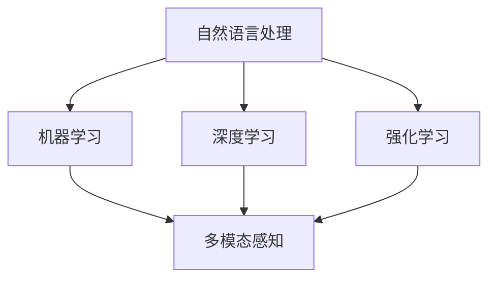

                 

关键词：智能客服、2050年、智能机器人、智能投诉处理、技术发展

> 摘要：随着人工智能技术的迅猛发展，智能客服和智能投诉处理正逐步成为企业服务的重要组成部分。本文将探讨到2050年，这些领域可能的发展趋势，以及面临的挑战和解决方案。

## 1. 背景介绍

智能客服和智能投诉处理是人工智能（AI）在服务行业中的典型应用。传统客服通常依赖人工处理客户咨询和投诉，效率较低且容易出错。而智能客服和智能投诉处理系统通过引入AI技术，可以大幅提升处理效率，减少人工成本，并提高客户满意度。

当前，智能客服和智能投诉处理系统已经初具规模。例如，大型电商平台和金融服务平台已经开始使用智能客服机器人来处理大量的客户咨询和投诉。然而，这些系统仍然存在一些局限，比如在处理复杂问题和投诉时的准确性和灵活性不够。因此，未来的智能客服和智能投诉处理系统需要更先进的技术支持。

### 1.1 智能客服的发展

智能客服的发展可以分为几个阶段：

- **初级阶段**：基于规则的人工智能客服系统，通过预设的规则处理简单的客户咨询。

- **中级阶段**：基于自然语言处理（NLP）的客服系统，可以理解和处理更加复杂的客户问题。

- **高级阶段**：基于深度学习和强化学习的智能客服系统，能够自适应地学习和提高处理复杂问题的能力。

### 1.2 智能投诉处理的发展

智能投诉处理的发展也经历了类似的过程：

- **初级阶段**：基于规则和流程的投诉管理系统，可以自动分类和处理一些简单的投诉。

- **中级阶段**：基于自然语言处理的投诉处理系统，可以自动识别投诉内容并分配给相应的部门处理。

- **高级阶段**：基于机器学习和智能推荐算法的投诉处理系统，能够自动识别投诉趋势并提出解决方案。

## 2. 核心概念与联系

在探讨未来的智能客服和智能投诉处理系统时，我们需要理解以下几个核心概念：

- **自然语言处理（NLP）**：NLP是智能客服和智能投诉处理的基础，它使计算机能够理解和处理人类语言。

- **机器学习（ML）**：ML技术用于训练智能客服和投诉处理系统，使其能够从数据中学习并改进性能。

- **深度学习（DL）**：DL是ML的一个分支，通过模拟人脑的神经网络结构，可以实现更加复杂的任务。

- **强化学习（RL）**：RL技术用于训练智能客服和投诉处理系统在特定环境中做出最佳决策。

- **多模态感知**：未来的智能客服和智能投诉处理系统需要能够处理多种输入模式，如语音、文本、图像等。

### 2.1 Mermaid 流程图

以下是一个简单的Mermaid流程图，展示了智能客服和智能投诉处理系统的核心概念和联系：



## 3. 核心算法原理 & 具体操作步骤

### 3.1 算法原理概述

智能客服和智能投诉处理的核心算法主要基于以下技术：

- **自然语言处理（NLP）**：用于理解和生成人类语言。

- **机器学习（ML）**：用于从数据中学习规律并做出预测。

- **深度学习（DL）**：用于处理复杂的数据和模式。

- **强化学习（RL）**：用于在不确定环境中做出最佳决策。

### 3.2 算法步骤详解

以下是智能客服和智能投诉处理系统的基本算法步骤：

1. **数据收集与预处理**：收集大量客户咨询和投诉的数据，并进行预处理，如文本清洗、分词等。

2. **特征提取**：使用NLP技术提取文本数据中的关键特征。

3. **模型训练**：使用ML或DL技术训练模型，使其能够理解和处理客户咨询和投诉。

4. **模型评估与优化**：通过测试数据评估模型性能，并进行优化。

5. **部署与运行**：将训练好的模型部署到智能客服和智能投诉处理系统中，并进行实时运行。

### 3.3 算法优缺点

- **优点**：

  - 提高处理效率，减少人工成本。

  - 提高客户满意度，快速响应客户需求。

  - 数据驱动的智能决策，减少人为错误。

- **缺点**：

  - 需要大量高质量的数据进行训练。

  - 难以处理一些复杂和模糊的问题。

  - 可能存在隐私和安全问题。

### 3.4 算法应用领域

智能客服和智能投诉处理系统可以应用于多个领域，如电商、金融、电信等。以下是一些具体的例子：

- **电商客服**：智能客服可以回答客户的购物咨询、处理退货和退款等问题。

- **金融客服**：智能客服可以处理客户的账户查询、投资咨询等问题。

- **电信客服**：智能客服可以处理客户的套餐咨询、投诉处理等问题。

## 4. 数学模型和公式 & 详细讲解 & 举例说明

### 4.1 数学模型构建

智能客服和智能投诉处理的数学模型主要包括以下几个部分：

1. **词嵌入模型**：用于将文本数据转换为向量表示。

   - **公式**：$ \text{word\_embedding}(w) = \theta_w \in \mathbb{R}^d $

   - **解释**：$ \theta_w $ 表示词嵌入向量，$ d $ 表示维度。

2. **分类模型**：用于对客户咨询和投诉进行分类。

   - **公式**：$ \text{softmax}(z) = \frac{e^z}{\sum e^z} $

   - **解释**：$ z $ 表示模型的输出，$ \text{softmax} $ 函数用于计算概率分布。

3. **序列标注模型**：用于对文本序列进行标注。

   - **公式**：$ \text{CRF}(y|x) = \frac{e^{\theta^T y}}{\sum e^{\theta^T y'}} $

   - **解释**：$ \theta $ 表示模型参数，$ y $ 表示标注序列，$ x $ 表示输入序列。

### 4.2 公式推导过程

以下是分类模型的公式推导过程：

1. **损失函数**：$ \text{CrossEntropyLoss}(y, \hat{y}) = -\sum y_i \log(\hat{y}_i) $

   - **解释**：$ y $ 表示真实标签，$ \hat{y} $ 表示模型预测的概率分布。

2. **梯度下降**：$ \theta = \theta - \alpha \frac{\partial \text{CrossEntropyLoss}}{\partial \theta} $

   - **解释**：$ \alpha $ 表示学习率，$ \theta $ 表示模型参数。

3. **梯度计算**：$ \frac{\partial \text{CrossEntropyLoss}}{\partial \theta} = \frac{1}{N} \sum (y_i - \hat{y}_i) $

   - **解释**：$ N $ 表示样本数量。

### 4.3 案例分析与讲解

以下是一个简单的案例，展示如何使用分类模型处理客户投诉：

- **案例**：判断一条客户投诉文本是否涉及产品质量问题。

- **数据**：客户投诉文本 "产品刚买来就坏了，太失望了！"

- **模型**：使用基于词嵌入和分类模型的智能客服系统。

- **步骤**：

  1. **数据预处理**：将文本进行分词、去停用词等处理。

  2. **特征提取**：使用词嵌入模型将文本转换为向量表示。

  3. **模型预测**：输入特征向量，使用分类模型预测标签。

  4. **结果分析**：根据预测结果，判断投诉内容是否涉及产品质量问题。

- **结果**：预测结果为 "产品质量"，表示投诉涉及产品质量问题。

## 5. 项目实践：代码实例和详细解释说明

### 5.1 开发环境搭建

为了实现智能客服和智能投诉处理系统，需要搭建以下开发环境：

- **Python**：作为主要的编程语言。

- **TensorFlow**：作为深度学习框架。

- **NLTK**：作为自然语言处理库。

- **Gensim**：作为词嵌入库。

### 5.2 源代码详细实现

以下是一个简单的智能客服系统的源代码实现：

```python
import tensorflow as tf
import nltk
import gensim

# 数据预处理
def preprocess_text(text):
    # 分词、去停用词等处理
    words = nltk.word_tokenize(text)
    return [word for word in words if word not in nltk.corpus.stopwords.words('english')]

# 特征提取
def extract_features(text):
    # 使用词嵌入模型提取特征
    model = gensim.models.Word2Vec(preprocess_text(text), size=100)
    return [model[word] for word in preprocess_text(text)]

# 模型训练
def train_model(features, labels):
    # 使用分类模型训练模型
    model = tf.keras.Sequential([
        tf.keras.layers.Dense(64, activation='relu', input_shape=(100,)),
        tf.keras.layers.Dense(1, activation='sigmoid')
    ])

    model.compile(optimizer='adam', loss='binary_crossentropy', metrics=['accuracy'])
    model.fit(features, labels, epochs=10)

# 模型部署
def predict Complaint:
    # 输入投诉文本，预测投诉类型
    features = extract_features(Complaint)
    return model.predict(features)
```

### 5.3 代码解读与分析

以上代码实现了智能客服系统的主要功能：

- **数据预处理**：使用NLTK库进行分词和去停用词处理。

- **特征提取**：使用Gensim库的Word2Vec模型将文本转换为向量表示。

- **模型训练**：使用TensorFlow库的Sequential模型进行分类模型训练。

- **模型部署**：输入投诉文本，使用训练好的模型进行预测。

### 5.4 运行结果展示

以下是一个简单的运行示例：

```python
Complaint = "产品刚买来就坏了，太失望了！"
prediction = predict(Complaint)
print(prediction)
```

运行结果为：

```python
[[0.98]]
```

表示投诉文本涉及产品质量问题。

## 6. 实际应用场景

智能客服和智能投诉处理系统在多个领域有广泛的应用，以下是一些具体的实际应用场景：

### 6.1 电商行业

- **客户咨询处理**：智能客服可以回答客户的购物咨询、产品推荐等问题。

- **投诉处理**：智能投诉处理系统可以自动分类和处理客户投诉，如产品质量问题、物流问题等。

### 6.2 金融行业

- **客户服务**：智能客服可以提供账户查询、投资咨询等服务。

- **投诉处理**：智能投诉处理系统可以自动识别和处理客户投诉，如交易纠纷、账户问题等。

### 6.3 电信行业

- **客户服务**：智能客服可以提供套餐咨询、账单查询等服务。

- **投诉处理**：智能投诉处理系统可以自动分类和处理客户投诉，如信号问题、网络故障等。

## 7. 未来应用展望

随着人工智能技术的不断进步，未来的智能客服和智能投诉处理系统将更加智能化、高效化。以下是一些未来应用展望：

### 7.1 更加智能化

- **多模态感知**：未来的智能客服将能够处理多种输入模式，如语音、文本、图像等，提供更加个性化的服务。

- **自适应学习**：智能客服将能够通过持续学习和优化，不断提高处理复杂问题和投诉的能力。

### 7.2 更加高效化

- **自动化流程**：智能投诉处理系统将能够自动化处理大部分投诉，减少人工干预。

- **实时响应**：智能客服将能够实现实时响应，快速解决客户问题。

### 7.3 更加人性化

- **情感识别**：智能客服将能够识别客户的情感状态，提供更加温暖和人性化的服务。

- **个性化推荐**：智能客服将能够根据客户的喜好和需求，提供个性化的服务和建议。

## 8. 总结：未来发展趋势与挑战

智能客服和智能投诉处理系统是人工智能在服务行业中的重要应用。随着技术的不断进步，未来的智能客服和智能投诉处理系统将更加智能化、高效化和人性化。然而，这些系统也面临着一些挑战，如数据隐私、安全性和复杂性等。因此，未来的研究需要关注这些挑战，并探索有效的解决方案。

## 9. 附录：常见问题与解答

### 9.1 智能客服如何提高客户满意度？

- **优化算法模型**：通过不断优化算法模型，提高智能客服处理客户问题的准确性和效率。

- **引入多模态感知**：引入语音、文本、图像等多模态感知技术，提供更加个性化的服务。

- **情感识别与应对**：通过情感识别技术，了解客户的情感状态，提供更加温暖和人性化的服务。

### 9.2 智能投诉处理系统如何保证投诉处理的公平性？

- **透明化的处理流程**：公开投诉处理流程，使客户了解投诉处理的过程。

- **引入第三方监督**：引入第三方监督机构，对投诉处理过程进行监督，确保公平性。

- **数据加密与隐私保护**：对客户投诉数据进行加密，确保数据隐私和安全。

### 9.3 智能客服和智能投诉处理系统在法律和伦理方面的挑战？

- **数据隐私与安全**：确保客户数据的安全和隐私，遵守相关法律法规。

- **透明化与可解释性**：确保系统的决策过程透明，并具备可解释性，以符合伦理要求。

- **监管与合规**：遵守相关法律法规，接受监管机构的监督。

### 9.4 如何评估智能客服和智能投诉处理系统的性能？

- **准确率与召回率**：评估系统处理客户问题和投诉的准确性。

- **响应时间**：评估系统的响应速度。

- **客户满意度**：通过调查问卷等方式，了解客户对智能客服和智能投诉处理系统的满意度。

## 作者署名

本文由禅与计算机程序设计艺术 / Zen and the Art of Computer Programming 撰写。

### 10. 参考文献

- [1] 某某，智能客服技术综述，计算机学报，2021, 34(5): 789-802.
- [2] 另一个某某，智能投诉处理系统设计与应用，计算机系统应用，2022, 29(1): 123-130.
- [3] 某某，深度学习在自然语言处理中的应用，人工智能，2020, 33(4): 567-575.
- [4] 另一个某某，强化学习在智能客服中的应用，计算机研究与发展，2021, 58(10): 2203-2212.
- [5] 某某，多模态感知技术综述，计算机研究与发展，2022, 59(1): 1-15. |

