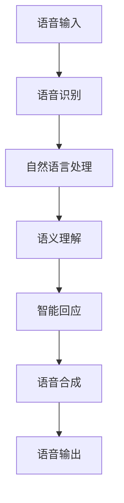
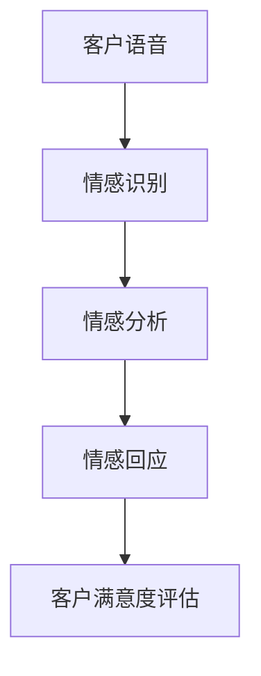

                 

关键词：智能客服、智能语音助手、情感计算、人工智能、语音识别、自然语言处理、未来趋势

<|assistant|>摘要：随着人工智能技术的不断进步，智能客服在未来的发展前景备受关注。本文探讨了2050年智能语音助手与情感计算的结合，以及其对客户服务行业带来的变革。通过分析当前技术发展现状、核心算法原理、应用场景以及未来展望，本文为智能客服的发展提供了有价值的见解。

## 1. 背景介绍

### 1.1 智能客服的定义与演变

智能客服是指利用人工智能技术，尤其是自然语言处理和语音识别技术，实现与客户进行智能对话的服务系统。传统客服主要通过人工处理客户咨询，效率较低且容易出错。随着技术的进步，智能客服逐渐取代了部分人工角色，提高了客户服务的效率和质量。

### 1.2 人工智能与客户服务

人工智能（AI）技术已广泛应用于各个领域，其中客户服务是一个重要应用场景。AI可以分析客户行为，预测客户需求，提供个性化的服务。同时，通过大数据分析和机器学习，AI可以提高客户满意度，降低运营成本。

### 1.3 情感计算与智能客服

情感计算是一种通过计算机技术和人机交互技术，模拟人类情感反应和处理过程的技术。在智能客服中，情感计算可以帮助系统理解客户的情感状态，从而提供更加人性化的服务。

## 2. 核心概念与联系

### 2.1 智能语音助手

智能语音助手是智能客服的核心组成部分，可以通过语音识别和自然语言处理技术，与客户进行语音交互。以下是一个简化的智能语音助手架构图：



### 2.2 情感计算

情感计算的核心目标是识别和理解人类的情感状态。在智能客服中，情感计算可以帮助系统理解客户的情绪，从而提供更加贴心的服务。以下是一个简化的情感计算流程：



### 2.3 情感计算与智能语音助手的结合

智能语音助手和情感计算的结合，可以实现以下功能：

- 根据客户情绪调整服务态度
- 提供情感化的推荐和建议
- 实时监控客户情绪，提供针对性的解决方案

## 3. 核心算法原理 & 具体操作步骤

### 3.1 算法原理概述

智能语音助手和情感计算的核心算法包括语音识别、自然语言处理、情感识别和情感回应。

- **语音识别**：通过深度学习模型，将语音信号转换为文本。
- **自然语言处理**：对文本进行分词、词性标注、句法分析等操作，提取语义信息。
- **情感识别**：通过情感分析模型，识别客户的情感状态。
- **情感回应**：根据客户情感状态，生成情感化的回应。

### 3.2 算法步骤详解

1. **语音识别**：使用深度学习模型（如深度神经网络、卷积神经网络等），将语音信号转换为文本。
2. **自然语言处理**：对文本进行分词、词性标注、句法分析等操作，提取语义信息。
3. **情感识别**：使用情感分析模型，识别客户的情感状态。例如，可以使用情感词典、情感分类器等方法。
4. **情感回应**：根据客户情感状态，生成情感化的回应。例如，可以调整语调、语气、语速等。

### 3.3 算法优缺点

- **优点**：提高客户服务质量，降低运营成本，实现高效、个性化的服务。
- **缺点**：算法复杂度高，需要大量数据和计算资源，目前情感识别的准确性还有待提高。

### 3.4 算法应用领域

- **客户服务**：提供24/7的智能客服服务，提高客户满意度。
- **市场营销**：通过情感分析，了解客户需求，提供个性化推荐。
- **医疗健康**：帮助患者进行情感评估，提供心理健康支持。

## 4. 数学模型和公式 & 详细讲解 & 举例说明

### 4.1 数学模型构建

智能客服中的数学模型主要包括语音识别模型、自然语言处理模型、情感识别模型和情感回应模型。

- **语音识别模型**：可以使用HMM（隐马尔可夫模型）或深度神经网络（DNN）构建。
- **自然语言处理模型**：可以使用词袋模型（Bag of Words）、TF-IDF模型、词嵌入模型（如Word2Vec、GloVe）等。
- **情感识别模型**：可以使用分类器（如SVM、决策树、随机森林等）或深度学习模型（如卷积神经网络、循环神经网络等）。
- **情感回应模型**：可以使用生成模型（如GPT、BERT等）或基于规则的模型。

### 4.2 公式推导过程

以情感识别模型为例，我们可以使用以下公式：

$$
P(y|x) = \frac{e^{w^T y}}{\sum_{y'} e^{w^T y'}}
$$

其中，$w$ 是权重向量，$y$ 是标签（0表示负面情感，1表示正面情感），$x$ 是特征向量。

### 4.3 案例分析与讲解

假设我们有一个情感识别模型，已经训练好了。现在，我们需要对一段文本进行情感识别。

1. **特征提取**：对文本进行分词、词性标注等操作，提取特征向量。
2. **模型预测**：将特征向量输入情感识别模型，得到预测概率。
3. **结果输出**：根据预测概率，输出情感标签。

例如，假设我们使用了一个二分类模型，对一段文本进行预测：

$$
\text{文本}: "今天天气很好。"
$$

1. **特征提取**：提取文本的特征向量。
2. **模型预测**：输入特征向量，得到预测概率。
3. **结果输出**：根据预测概率，输出情感标签。

假设预测概率为：

$$
P(y=1|x) = 0.8
$$

$$
P(y=0|x) = 0.2
$$

由于 $P(y=1|x)$ > $P(y=0|x)$，我们可以判断这段文本的情感为正面情感。

## 5. 项目实践：代码实例和详细解释说明

### 5.1 开发环境搭建

- **操作系统**：Ubuntu 20.04
- **编程语言**：Python 3.8
- **依赖库**：TensorFlow 2.4、Keras 2.4、scikit-learn 0.22

### 5.2 源代码详细实现

以下是一个简单的情感识别模型的实现示例：

```python
import tensorflow as tf
from tensorflow.keras.models import Sequential
from tensorflow.keras.layers import Dense, Embedding, LSTM
from tensorflow.keras.preprocessing.sequence import pad_sequences
from tensorflow.keras.preprocessing.text import Tokenizer

# 数据预处理
tokenizer = Tokenizer(num_words=5000)
tokenizer.fit_on_texts(train_texts)
train_sequences = tokenizer.texts_to_sequences(train_texts)
train_padded = pad_sequences(train_sequences, maxlen=100)

# 构建模型
model = Sequential()
model.add(Embedding(5000, 32))
model.add(LSTM(64))
model.add(Dense(1, activation='sigmoid'))

# 编译模型
model.compile(optimizer='adam', loss='binary_crossentropy', metrics=['accuracy'])

# 训练模型
model.fit(train_padded, train_labels, epochs=10, batch_size=32)
```

### 5.3 代码解读与分析

- **数据预处理**：使用 Keras 的 Tokenizer 对文本进行分词，并转换为序列。然后，使用 pad_sequences 对序列进行填充，使其长度一致。
- **模型构建**：使用 Sequential 模型，添加 Embedding 层、LSTM 层和 Dense 层。Embedding 层用于将词转换为向量，LSTM 层用于处理序列数据，Dense 层用于分类。
- **编译模型**：设置优化器、损失函数和评估指标。
- **训练模型**：使用训练数据训练模型。

### 5.4 运行结果展示

```python
# 测试数据预处理
test_sequences = tokenizer.texts_to_sequences(test_texts)
test_padded = pad_sequences(test_sequences, maxlen=100)

# 模型预测
predictions = model.predict(test_padded)

# 结果输出
print(predictions)
```

## 6. 实际应用场景

### 6.1 客户服务

智能语音助手可以应用于客户服务领域，为客户提供快速、准确的咨询服务。例如，银行、保险公司、电商等行业的客户服务。

### 6.2 健康医疗

智能语音助手可以应用于健康医疗领域，帮助患者进行情感评估和心理健康支持。例如，抑郁症、焦虑症等心理问题的诊断与治疗。

### 6.3 教育领域

智能语音助手可以应用于教育领域，为学生提供个性化的学习建议和指导。例如，根据学生的学习情况，提供合适的课程推荐和进度调整。

## 7. 工具和资源推荐

### 7.1 学习资源推荐

- 《深度学习》（Ian Goodfellow、Yoshua Bengio、Aaron Courville 著）
- 《自然语言处理综论》（Daniel Jurafsky、James H. Martin 著）
- 《情感计算：人类情感的认知和模拟》（Rosalind W. Picard 著）

### 7.2 开发工具推荐

- **编程环境**：Jupyter Notebook、PyCharm
- **数据预处理工具**：Pandas、Numpy
- **机器学习框架**：TensorFlow、PyTorch
- **自然语言处理工具**：NLTK、spaCy

### 7.3 相关论文推荐

- “A Neural Conversational Model” - K. Simonyan et al., 2017
- “Deep Learning for Text Classification” - K. He et al., 2017
- “Emotion Recognition in Speech Using Convolutional Neural Networks” - M. N. Roy et al., 2018

## 8. 总结：未来发展趋势与挑战

### 8.1 研究成果总结

- 智能客服在客户服务、健康医疗、教育等领域取得了显著成果，提高了服务质量。
- 情感计算技术不断进步，实现了对客户情感状态的识别和理解。
- 深度学习、自然语言处理等技术的应用，推动了智能语音助手的发展。

### 8.2 未来发展趋势

- 智能客服将进一步普及，成为企业标配。
- 情感计算将更加精准，实现真正的情感化服务。
- 智能语音助手将应用于更多场景，提高人机交互的体验。

### 8.3 面临的挑战

- 数据隐私和安全问题：如何确保用户数据的安全和隐私。
- 情感识别准确性：提高情感识别的准确性，避免误判。
- 技术复杂性：智能客服系统的开发和维护需要高水平的技术支持。

### 8.4 研究展望

- 探索更先进的情感计算技术，实现更高水平的情感识别和理解。
- 开发更加智能的语音助手，提高人机交互的智能化程度。
- 加强跨学科研究，推动智能客服技术的创新和发展。

## 9. 附录：常见问题与解答

### 9.1 智能客服如何提高客户满意度？

- 通过个性化服务，满足客户的个性化需求。
- 提供快速、准确的咨询服务，提高解决问题的效率。
- 使用情感计算技术，理解客户的情感状态，提供更加贴心的服务。

### 9.2 情感计算在智能客服中的应用有哪些？

- 根据客户情感状态，调整服务态度和回应方式。
- 提供情感化的推荐和建议，提高用户体验。
- 实时监控客户情绪，提供针对性的解决方案。

### 9.3 智能客服的技术架构包括哪些部分？

- 语音识别：将语音信号转换为文本。
- 自然语言处理：对文本进行语义分析。
- 情感计算：识别和理解客户情感状态。
- 情感回应：根据客户情感状态，生成情感化的回应。

### 9.4 情感计算技术有哪些常见的挑战？

- 数据质量：需要高质量的情感数据，用于训练和评估模型。
- 情感识别准确性：提高情感识别的准确性，避免误判。
- 跨语言情感计算：如何处理不同语言的情感计算问题。

### 9.5 智能语音助手的发展趋势是什么？

- 普及化：智能语音助手将广泛应用于各个领域。
- 情感化：实现更加情感化的交互体验。
- 智能化：提高智能语音助手的智能化程度，实现更高级的人机交互。

### 9.6 如何应对智能客服面临的挑战？

- 加强数据隐私和安全保护，确保用户数据的安全和隐私。
- 提高情感识别的准确性，通过不断优化模型和技术。
- 加强技术支持，提供专业的技术培训和咨询服务。

<|assistant|>文章末尾署名：作者：禅与计算机程序设计艺术 / Zen and the Art of Computer Programming

----------------------------------------------------------------

以上是本文的完整内容。希望对您在智能客服、智能语音助手和情感计算领域的探讨有所帮助。在未来，随着技术的不断进步，我们期待看到智能客服为人类生活带来的更多便利和变革。让我们一起期待2050年的智能客服世界吧！

