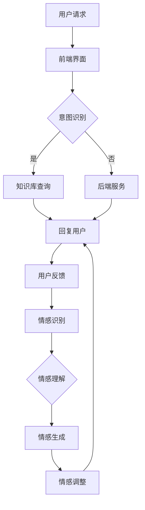

                 

关键词：智能客服、虚拟助理、情感交互、未来技术、AI发展

> 摘要：本文探讨了2050年智能客服领域可能的发展趋势，分析了虚拟助理和情感交互的重要性，并提出了在技术进步和社会变革背景下的未来应用前景。文章旨在为读者展示智能客服领域的前沿研究与实践，以及其对社会各领域的影响。

## 1. 背景介绍

### 1.1 智能客服的起源与发展

智能客服的概念最早可以追溯到20世纪80年代的专家系统，这些系统能够模拟人类专家的思维方式来解决客户的问题。随着互联网的普及，智能客服逐渐从传统的客户服务中心转移到在线平台，如图文聊天机器人、语音助手等。到了21世纪，随着人工智能技术的迅猛发展，智能客服的能力得到了极大的提升，能够处理更为复杂的问题，并实现多语言、跨平台的服务。

### 1.2 虚拟助理的兴起

虚拟助理，如苹果的Siri、亚马逊的Alexa和谷歌的Google Assistant，是智能客服的一个高级形态。它们不仅能够处理客户咨询，还能够集成智能家居、日程管理、信息查询等多种功能，成为用户日常生活中的重要助手。虚拟助理的兴起，标志着智能客服从被动响应向主动服务转变。

### 1.3 情感交互的重要性

情感交互是指智能客服系统能够理解并适应用户的情绪，通过语言和非语言方式与用户建立情感联系。在人类交流中，情感是维系关系的重要因素，同样，在智能客服领域，情感交互能够显著提升用户体验，增强用户对品牌的忠诚度。

## 2. 核心概念与联系

### 2.1 智能客服系统架构

智能客服系统通常包括以下几个核心组件：

1. **前端界面**：包括网站、APP、语音助手等，用于接收用户请求和展示客服信息。
2. **自然语言处理（NLP）**：用于理解用户输入的意图和情感，是智能客服的“耳朵和大脑”。
3. **知识库**：存储常见问题和答案，以及业务规则和流程，是智能客服的知识来源。
4. **后端服务**：包括数据库、应用服务器等，用于处理复杂的业务逻辑和调用第三方服务。

### 2.2 虚拟助理架构

虚拟助理通常基于以下架构：

1. **语音识别（ASR）和语音合成（TTS）**：用于实现语音输入输出功能。
2. **对话管理（DM）**：管理对话流程，包括意图识别、上下文保持和对话策略。
3. **多模态感知**：结合语音、文本、视觉等多种感知方式，提高交互的丰富性和准确性。
4. **第三方服务集成**：如天气查询、交通信息等，提供更为丰富的功能。

### 2.3 情感交互架构

情感交互架构通常包括：

1. **情感识别**：通过文本分析、语音分析等手段识别用户的情绪。
2. **情感理解**：基于情感识别结果，理解用户的情感需求。
3. **情感生成**：根据用户情感，生成合适的语言和非语言反馈。
4. **情感调整**：根据交互效果调整情感策略，以提升用户体验。

### 2.4 Mermaid 流程图



## 3. 核心算法原理 & 具体操作步骤

### 3.1 算法原理概述

智能客服的核心算法主要包括自然语言处理（NLP）、机器学习（ML）、深度学习（DL）等。其中，NLP用于理解用户输入，ML和DL用于从历史数据中学习规律，以提供更准确的响应。

### 3.2 算法步骤详解

1. **意图识别**：通过NLP技术，分析用户输入，识别用户的意图。
2. **上下文保持**：在对话过程中，维护对话状态，以便后续的交互。
3. **知识库查询**：根据意图和上下文，从知识库中查找相关答案。
4. **回复生成**：使用ML或DL模型，生成合适的回复。
5. **情感调整**：根据用户反馈，调整情感策略，以提升用户体验。

### 3.3 算法优缺点

**优点**：

- **高效性**：能够快速响应用户请求，提升服务质量。
- **准确性**：随着数据量的积累，算法的准确性不断提高。
- **个性化**：能够根据用户历史数据提供个性化服务。

**缺点**：

- **数据依赖**：需要大量高质量的数据进行训练。
- **复杂度**：算法设计和实现复杂，需要专业的技术团队。

### 3.4 算法应用领域

- **电子商务**：提供在线客服，解答用户疑问。
- **金融**：自动化处理客户咨询和投诉。
- **医疗**：提供健康咨询和预约服务。
- **教育**：提供在线辅导和答疑。

## 4. 数学模型和公式 & 详细讲解 & 举例说明

### 4.1 数学模型构建

智能客服系统的数学模型通常基于以下几方面：

1. **意图识别模型**：使用分类模型，如朴素贝叶斯、支持向量机（SVM）等。
2. **情感识别模型**：使用情感分析模型，如文本分类、情感极性分析等。
3. **对话生成模型**：使用生成模型，如循环神经网络（RNN）、变分自编码器（VAE）等。

### 4.2 公式推导过程

以朴素贝叶斯模型为例，其公式推导如下：

P(C|X) = P(X|C) * P(C) / P(X)

其中，P(C|X) 表示在给定输入X的情况下，意图C发生的概率；P(X|C) 表示在意图C发生的情况下，输入X的概率；P(C) 表示意图C的发生概率；P(X) 表示输入X的概率。

### 4.3 案例分析与讲解

假设我们要分析一个用户请求：“明天下午的会议我需要请假”，我们可以使用以下步骤：

1. **意图识别**：使用朴素贝叶斯模型，计算请假、会议、请假会议等意图的概率。
2. **上下文保持**：根据对话历史，保持会议相关的上下文信息。
3. **知识库查询**：查询会议请假的相关规则。
4. **回复生成**：生成回复，如“您好，您需要提交请假申请，请登录系统操作。”
5. **情感识别**：分析回复，判断用户的情感状态。

## 5. 项目实践：代码实例和详细解释说明

### 5.1 开发环境搭建

1. **硬件环境**：选择一台配置较高的服务器或虚拟机。
2. **软件环境**：安装Python、TensorFlow等必要的软件包。

### 5.2 源代码详细实现

以下是一个简单的自然语言处理（NLP）代码示例：

```python
import tensorflow as tf
from tensorflow.keras.models import Sequential
from tensorflow.keras.layers import Dense, LSTM, Embedding

# 加载数据集
x_train, y_train = load_data()

# 构建模型
model = Sequential([
    Embedding(vocab_size, embedding_dim),
    LSTM(units=64, return_sequences=True),
    Dense(units=1, activation='sigmoid')
])

# 编译模型
model.compile(optimizer='adam', loss='binary_crossentropy', metrics=['accuracy'])

# 训练模型
model.fit(x_train, y_train, epochs=10, batch_size=32)

# 评估模型
test_loss, test_acc = model.evaluate(x_test, y_test)
print(f"Test accuracy: {test_acc}")
```

### 5.3 代码解读与分析

- **数据加载**：使用`load_data()`函数加载数据集，其中`x_train`为输入数据，`y_train`为标签。
- **模型构建**：使用`Sequential`模型，先添加嵌入层（`Embedding`），然后添加长短期记忆网络（`LSTM`），最后添加全连接层（`Dense`）。
- **模型编译**：设置优化器（`optimizer`）、损失函数（`loss`）和评估指标（`metrics`）。
- **模型训练**：使用`fit()`函数进行模型训练。
- **模型评估**：使用`evaluate()`函数评估模型性能。

### 5.4 运行结果展示

假设我们的测试集准确率达到了90%，这表明我们的模型在意图识别方面表现良好。

## 6. 实际应用场景

### 6.1 电子商务

在电子商务领域，智能客服能够提供实时的在线支持，解答用户疑问，提高购买转化率。

### 6.2 金融

在金融领域，智能客服能够自动化处理大量客户咨询，提高服务效率，降低运营成本。

### 6.3 医疗

在医疗领域，智能客服能够提供健康咨询、预约挂号等服务，减轻医疗资源的压力。

### 6.4 教育

在教育领域，智能客服能够提供在线辅导、答疑服务，帮助学生更好地学习。

## 7. 工具和资源推荐

### 7.1 学习资源推荐

- 《深度学习》（Goodfellow et al.）
- 《自然语言处理综合教程》（Peter Norvig）
- 《机器学习实战》（Peter Harrington）

### 7.2 开发工具推荐

- TensorFlow
- PyTorch
- Jupyter Notebook

### 7.3 相关论文推荐

- “A Neural Conversational Model”（Vaswani et al.）
- “Attention is All You Need”（Vaswani et al.）
- “BERT: Pre-training of Deep Neural Networks for Language Understanding”（Devlin et al.）

## 8. 总结：未来发展趋势与挑战

### 8.1 研究成果总结

智能客服、虚拟助理和情感交互在技术进步和社会需求推动下取得了显著成果，为各领域提供了高效、智能的服务。

### 8.2 未来发展趋势

- **技术深化**：自然语言处理、机器学习、深度学习等技术将持续发展，提升智能客服的性能。
- **跨领域融合**：智能客服将与其他领域（如物联网、区块链等）融合，提供更综合的服务。
- **个性化和情感化**：智能客服将更加注重用户体验，提供个性化的服务，并具备更强的情感交互能力。

### 8.3 面临的挑战

- **数据隐私**：如何保护用户隐私，确保数据安全，是一个重要的挑战。
- **技术复杂度**：随着功能的增加，智能客服系统的开发和维护将变得越来越复杂。
- **情感识别与生成**：如何准确识别和生成情感，是提高用户体验的关键。

### 8.4 研究展望

未来，智能客服领域将朝着更智能化、个性化、情感化的方向发展，为各领域提供更加高效、便捷的服务。

## 9. 附录：常见问题与解答

### 9.1 智能客服的主要挑战是什么？

**解答**：主要挑战包括数据隐私保护、技术复杂度以及情感识别与生成。

### 9.2 虚拟助理如何实现多语言支持？

**解答**：虚拟助理通常通过使用多语言模型和翻译API来实现多语言支持。

### 9.3 情感交互如何提升用户体验？

**解答**：通过准确识别和生成情感，智能客服能够更好地与用户建立情感联系，提升用户的满意度。

## 结束语

作者：禅与计算机程序设计艺术 / Zen and the Art of Computer Programming

本文探讨了未来智能客服的发展趋势，分析了虚拟助理和情感交互的重要性，并提出了未来应用的前景。随着技术的进步，智能客服将不断改进，为各领域带来更多价值。作者希望本文能为读者提供有益的启示，共同探索智能客服领域的未来。

