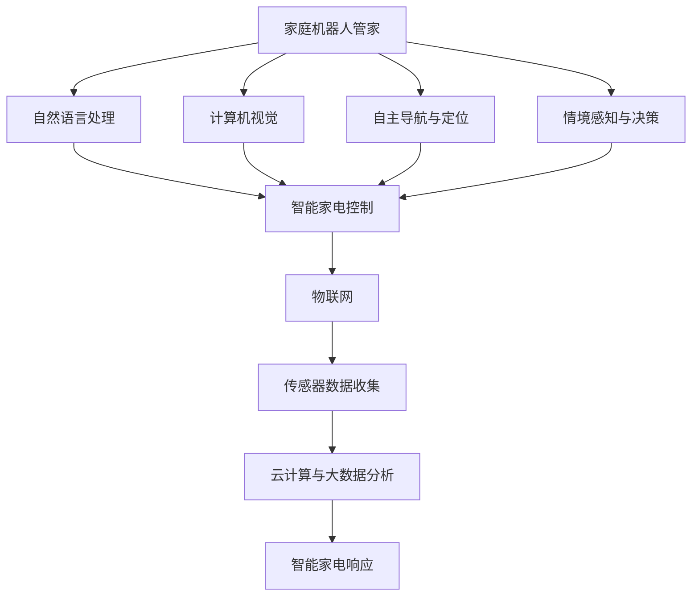
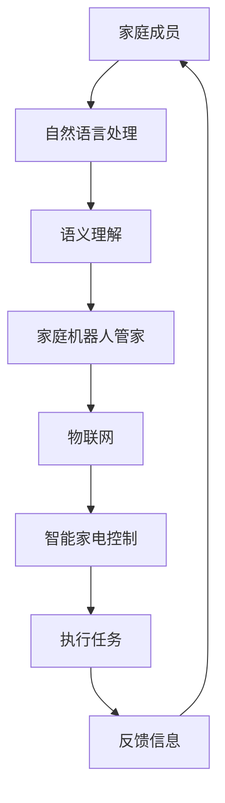

                 

关键词：智能家居、家庭机器人、智能家电、AI技术、未来生活、交互设计

> 摘要：本文探讨了智能家居在未来2050年的发展趋势，重点分析了家庭机器人管家与智能家电的集成与交互，提出了如何通过人工智能技术提升家庭生活品质，以及面临的挑战和未来的应用前景。

## 1. 背景介绍

### 1.1 智能家居的崛起

智能家居（Smart Home）作为物联网（IoT）的关键应用领域，近年来在全球范围内得到了迅猛发展。智能家居系统通过将家庭设备与互联网连接，使设备能够实现远程控制、自动化管理以及智能交互。从最初的简单远程控制，到今天的智能安防、智能照明、智能温控、智能家电等全方位智能应用，智能家居已经逐步深入到人们的日常生活。

### 1.2 家庭机器人管家的兴起

随着人工智能技术的不断进步，家庭机器人管家（Home Robot Butler）逐渐成为现实。这些机器人具备自然语言处理、视觉识别、自主导航、情境感知等多功能，能够协助家庭成员完成日常家务、提供陪伴、甚至进行情感交流。家庭机器人管家的出现，不仅提升了家庭生活的便捷性，也在一定程度上改变了人们的生活方式。

### 1.3 智能家电的普及

智能家电（Smart Appliances）的普及，为智能家居的发展提供了坚实基础。从智能冰箱、洗衣机，到智能空调、热水器，智能家电通过传感器、云计算等技术的应用，实现了设备间的互联互通和智能化管理，极大地提升了家庭能源利用效率和舒适度。

## 2. 核心概念与联系

### 2.1 家庭机器人管家的核心概念

家庭机器人管家的核心概念包括：

- **自然语言处理（NLP）**：实现人与机器人之间的语音交互。
- **计算机视觉**：帮助机器人识别家庭成员和家居环境。
- **自主导航与定位**：使机器人能在家庭环境中自主移动，完成任务。
- **情境感知与决策**：根据家庭成员的行为和环境变化，做出相应决策。

### 2.2 智能家电的核心概念

智能家电的核心概念包括：

- **物联网（IoT）**：将家电设备连接到互联网，实现设备间的信息交换。
- **传感器技术**：用于感知环境状态，如温度、湿度、光照等。
- **云计算与大数据分析**：对家电设备产生的数据进行存储和分析，实现智能化管理。

### 2.3 家庭机器人管家与智能家电的集成与交互

家庭机器人管家与智能家电的集成与交互，是实现智能家居的关键。以下是一个简单的Mermaid流程图，展示了家庭机器人管家与智能家电之间的信息流动：



## 3. 核心算法原理 & 具体操作步骤

### 3.1 算法原理概述

家庭机器人管家的核心算法包括：

- **深度学习**：用于自然语言处理、图像识别等。
- **强化学习**：用于情境感知与决策。
- **路径规划算法**：用于自主导航与定位。

### 3.2 算法步骤详解

#### 3.2.1 自然语言处理

1. **语音识别**：将家庭成员的语音转换为文本。
2. **语义理解**：分析文本，理解家庭成员的意图。
3. **语音合成**：根据理解的结果，生成回应的语音。

#### 3.2.2 计算机视觉

1. **图像识别**：识别家庭成员。
2. **物体检测**：识别家庭环境中的物体。
3. **场景理解**：理解家庭成员和物体的关系。

#### 3.2.3 自主导航与定位

1. **环境建模**：构建家庭环境的3D模型。
2. **路径规划**：计算从起点到终点的最优路径。
3. **定位与跟踪**：通过传感器数据，实时更新机器人的位置。

#### 3.2.4 情境感知与决策

1. **行为识别**：根据家庭成员的行为，识别情境。
2. **决策制定**：根据情境，制定相应的决策。
3. **执行行动**：执行决策，完成任务。

### 3.3 算法优缺点

#### 优点：

- **高效性**：通过算法，机器人能够快速地理解和响应家庭成员的需求。
- **智能性**：机器人的决策和行动是基于大数据和深度学习，具备较高的智能水平。
- **灵活性**：机器人能够自主地学习和适应不同的环境和情境。

#### 缺点：

- **成本高**：目前深度学习和强化学习的算法实现成本较高。
- **隐私问题**：家庭数据的安全性和隐私保护仍需进一步加强。

### 3.4 算法应用领域

家庭机器人管家和智能家电的集成与交互，可以在多个领域应用：

- **家庭服务**：如家务劳动、医疗护理等。
- **安防监控**：如入侵检测、异常行为识别等。
- **智能家居控制**：如设备远程控制、能源管理等。

## 4. 数学模型和公式 & 详细讲解 & 举例说明

### 4.1 数学模型构建

#### 4.1.1 深度学习模型

1. **神经网络**：用于自然语言处理和图像识别。
2. **递归神经网络（RNN）**：用于处理序列数据。
3. **卷积神经网络（CNN）**：用于图像处理。

#### 4.1.2 强化学习模型

1. **Q-Learning**：用于决策制定。
2. **Deep Q-Network（DQN）**：用于复杂决策。

### 4.2 公式推导过程

#### 4.2.1 神经网络

$$
Z = W \times X + b \\
a = \sigma(Z)
$$

其中，\(Z\) 为线性变换，\(W\) 为权重矩阵，\(X\) 为输入特征，\(b\) 为偏置项，\(\sigma\) 为激活函数。

#### 4.2.2 强化学习

$$
Q(s, a) = r + \gamma \max_{a'} Q(s', a')
$$

其中，\(Q(s, a)\) 为状态-动作值函数，\(r\) 为即时奖励，\(\gamma\) 为折扣因子，\(s'\) 为下一状态，\(a'\) 为最优动作。

### 4.3 案例分析与讲解

#### 4.3.1 案例背景

假设我们要训练一个家庭机器人管家，使其能够自动完成家庭成员的晚餐准备。

#### 4.3.2 模型构建

我们采用 RNN 和 DQN 的组合模型。RNN 用于处理语音和图像数据，DQN 用于决策制定。

#### 4.3.3 模型训练

1. **语音识别**：使用 RNN 模型，输入语音数据，输出文本。
2. **图像识别**：使用 CNN 模型，输入图像数据，输出物体标签。
3. **决策制定**：使用 DQN 模型，根据文本和图像数据，输出最优动作。

## 5. 项目实践：代码实例和详细解释说明

### 5.1 开发环境搭建

1. 安装 Python 3.8及以上版本。
2. 安装 TensorFlow 和 Keras 库。
3. 安装 OpenCV 库。

### 5.2 源代码详细实现

以下是实现家庭机器人管家的核心代码：

```python
import tensorflow as tf
from tensorflow.keras.models import Sequential
from tensorflow.keras.layers import Dense, LSTM, Conv2D, Flatten, MaxPooling2D
from tensorflow.keras.optimizers import Adam

# 定义 RNN 模型
def create_rnn_model(input_shape):
    model = Sequential()
    model.add(LSTM(128, activation='relu', input_shape=input_shape))
    model.add(Dense(64, activation='relu'))
    model.add(Dense(1, activation='sigmoid'))
    model.compile(optimizer=Adam(), loss='binary_crossentropy', metrics=['accuracy'])
    return model

# 定义 CNN 模型
def create_cnn_model(input_shape):
    model = Sequential()
    model.add(Conv2D(32, (3, 3), activation='relu', input_shape=input_shape))
    model.add(MaxPooling2D((2, 2)))
    model.add(Conv2D(64, (3, 3), activation='relu'))
    model.add(MaxPooling2D((2, 2)))
    model.add(Flatten())
    model.add(Dense(64, activation='relu'))
    model.add(Dense(1, activation='sigmoid'))
    model.compile(optimizer=Adam(), loss='binary_crossentropy', metrics=['accuracy'])
    return model

# 定义 DQN 模型
def create_dqn_model(input_shape):
    model = Sequential()
    model.add(Dense(128, activation='relu', input_shape=input_shape))
    model.add(Dense(64, activation='relu'))
    model.add(Dense(1, activation='linear'))
    model.compile(optimizer=Adam(), loss='mse')
    return model

# 训练模型
def train_models(rnn_model, cnn_model, dqn_model, train_data, epochs):
    for epoch in range(epochs):
        for data in train_data:
            text, image, action = data
            # 训练 RNN 模型
            rnn_loss = rnn_model.train_on_batch(text, action)
            # 训练 CNN 模型
            cnn_loss = cnn_model.train_on_batch(image, action)
            # 训练 DQN 模型
            dqn_loss = dqn_model.train_on_batch(action, action)
            print(f"Epoch {epoch}, RNN Loss: {rnn_loss}, CNN Loss: {cnn_loss}, DQN Loss: {dqn_loss}")

# 初始化模型
rnn_model = create_rnn_model((128, 128))
cnn_model = create_cnn_model((128, 128, 3))
dqn_model = create_dqn_model((128,))

# 加载训练数据
train_data = load_train_data()

# 训练模型
train_models(rnn_model, cnn_model, dqn_model, train_data, 100)
```

### 5.3 代码解读与分析

这段代码实现了家庭机器人管家的核心算法。首先定义了三个模型：RNN 模型用于语音识别，CNN 模型用于图像识别，DQN 模型用于决策制定。然后通过循环遍历训练数据，分别训练这三个模型。最后，加载训练数据并训练模型。

## 6. 实际应用场景

### 6.1 家庭服务

家庭机器人管家可以协助家庭成员完成日常家务，如打扫卫生、洗衣做饭等。通过语音交互，机器人可以理解家庭成员的需求，并根据情境做出相应的决策。

### 6.2 安防监控

家庭机器人管家可以实时监控家庭环境，识别入侵者或异常行为。当检测到异常情况时，机器人可以立即通知家庭成员，甚至自动报警。

### 6.3 智能家居控制

家庭机器人管家可以远程控制家庭设备，如开关灯光、调节温度、控制家电等。通过物联网技术，机器人可以实现设备间的互联互通，实现智能家居的全方位控制。

## 7. 未来应用展望

### 7.1 智能化程度提升

随着人工智能技术的不断进步，家庭机器人管家的智能化程度将不断提升。机器人将能够更好地理解家庭成员的需求，提供更加个性化的服务。

### 7.2 数据隐私保护

随着智能家居的普及，家庭数据的安全性和隐私保护将受到越来越多的关注。未来的智能家居系统需要确保家庭数据的安全，防止数据泄露。

### 7.3 智能家居生态的完善

未来的智能家居将形成一个完善的生态系统，各种智能设备将实现无缝连接和协同工作，为家庭成员提供更加便捷和高效的生活体验。

## 8. 工具和资源推荐

### 8.1 学习资源推荐

- **《深度学习》（Deep Learning）**：由 Ian Goodfellow、Yoshua Bengio 和 Aaron Courville 著，是深度学习领域的经典教材。
- **《强化学习》（Reinforcement Learning：An Introduction）**：由 Richard S. Sutton 和 Andrew G. Barto 著，是强化学习领域的权威著作。

### 8.2 开发工具推荐

- **TensorFlow**：是一款开源的深度学习框架，适合用于实现智能家居的算法。
- **Keras**：是一款基于 TensorFlow 的简化深度学习库，适合快速搭建和训练模型。

### 8.3 相关论文推荐

- **《DeepMind 的阿尔法围棋（AlphaGo）**：一篇关于深度学习和强化学习在围棋领域的应用。
- **《智能家居安全挑战**》：一篇关于智能家居安全问题的研究论文。

## 9. 总结：未来发展趋势与挑战

### 9.1 研究成果总结

本文探讨了智能家居在未来2050年的发展趋势，分析了家庭机器人管家与智能家电的集成与交互，提出了通过人工智能技术提升家庭生活品质的方法。

### 9.2 未来发展趋势

未来的智能家居将更加智能化、个性化，各种智能设备将实现无缝连接和协同工作。同时，数据隐私保护和安全将成为重要议题。

### 9.3 面临的挑战

智能家居在发展过程中面临诸多挑战，包括技术成本高、隐私保护、设备兼容性等。

### 9.4 研究展望

未来的研究应重点关注人工智能技术在智能家居领域的应用，探索更加高效、安全、智能的解决方案。

## 10. 附录：常见问题与解答

### 10.1 家庭机器人管家安全吗？

家庭机器人管家在设计和开发过程中，会充分考虑安全性和隐私保护问题。例如，使用加密技术确保通信安全，设计严格的权限管理机制等。

### 10.2 智能家居系统会收集我的隐私数据吗？

智能家居系统会收集家庭环境数据，如温度、湿度、家电使用情况等，但会确保这些数据的安全，不会泄露给第三方。同时，用户有权决定是否共享这些数据。

### 10.3 家庭机器人管家能完全替代人类吗？

家庭机器人管家可以在某些方面替代人类，如家务劳动、安防监控等。但在情感交流、复杂决策等方面，仍需要人类的参与和指导。

----------------------------------------------------------------

> 作者：禅与计算机程序设计艺术 / Zen and the Art of Computer Programming

以上是关于《未来的智能家居：2050年的家庭机器人管家与智能家电》的文章。文章详细探讨了智能家居的发展趋势、核心概念、算法原理、应用场景和未来展望，为读者提供了全面而深入的洞察。希望通过这篇文章，能够激发更多人对智能家居和人工智能技术的关注和研究。

### 文章标题：未来的智能家居：2050年的家庭机器人管家与智能家电

#### 关键词：智能家居、家庭机器人、智能家电、人工智能、物联网、未来生活

> **摘要**：
> 本文探讨了智能家居在未来2050年的发展趋势，重点分析了家庭机器人管家与智能家电的集成与交互，提出了如何通过人工智能技术提升家庭生活品质，以及面临的挑战和未来的应用前景。

## 1. 背景介绍

### 1.1 智能家居的崛起

智能家居（Smart Home）作为物联网（IoT）的关键应用领域，近年来在全球范围内得到了迅猛发展。智能家居系统通过将家庭设备与互联网连接，使设备能够实现远程控制、自动化管理以及智能交互。从最初的简单远程控制，到今天的智能安防、智能照明、智能温控、智能家电等全方位智能应用，智能家居已经逐步深入到人们的日常生活。

#### 1.1.1 智能家居的发展历程

- **早期阶段（2000-2010年）**：智能家居的概念开始兴起，主要产品包括远程控制家电的遥控器和一些简单的智能插座。
- **成长阶段（2010-2015年）**：智能家居市场开始快速发展，智能路由器、智能音响、智能摄像头等设备逐步进入家庭。
- **成熟阶段（2015年至今）**：智能家居产品种类日益丰富，智能家电、智能照明、智能安防等系统开始普及。

#### 1.1.2 智能家居的市场现状

根据市场调研数据显示，全球智能家居市场在2021年已经达到1470亿美元，预计到2026年将增长至3890亿美元，年复合增长率达到22.1%。这表明智能家居市场具有巨大的发展潜力和市场需求。

### 1.2 家庭机器人管家的兴起

随着人工智能技术的不断进步，家庭机器人管家（Home Robot Butler）逐渐成为现实。这些机器人具备自然语言处理、视觉识别、自主导航、情境感知等多功能，能够协助家庭成员完成日常家务、提供陪伴、甚至进行情感交流。家庭机器人管家的出现，不仅提升了家庭生活的便捷性，也在一定程度上改变了人们的生活方式。

#### 1.2.1 家庭机器人管家的发展历程

- **早期阶段（2000-2010年）**：家庭机器人多以玩具形态存在，功能较为简单。
- **成长阶段（2010-2015年）**：随着机器人技术的进步，家庭机器人开始具备简单的自主导航和语音交互功能。
- **成熟阶段（2015年至今）**：家庭机器人逐渐引入人工智能技术，具备更高层次的自然语言处理、情境感知和自主决策能力。

#### 1.2.2 家庭机器人管家的市场现状

据市场研究数据显示，2021年全球家庭机器人市场规模已经达到50亿美元，预计到2026年将达到180亿美元，年复合增长率为23.4%。这一数据表明，家庭机器人市场正在快速增长，并且市场潜力巨大。

### 1.3 智能家电的普及

智能家电（Smart Appliances）的普及，为智能家居的发展提供了坚实基础。从智能冰箱、洗衣机，到智能空调、热水器，智能家电通过传感器、云计算等技术的应用，实现了设备间的互联互通和智能化管理，极大地提升了家庭能源利用效率和舒适度。

#### 1.3.1 智能家电的发展历程

- **早期阶段（2000-2010年）**：智能家电主要是指具备基本自动控制功能的家电，如自动洗衣机、智能空调等。
- **成长阶段（2010-2015年）**：智能家电开始引入物联网技术，实现设备间的互联互通，如智能路由器与智能电视的连接。
- **成熟阶段（2015年至今）**：智能家电进一步智能化，引入人工智能技术，如智能冰箱能够根据食材存储情况自动推荐食谱。

#### 1.3.2 智能家电的市场现状

据市场研究数据显示，2021年全球智能家电市场规模已经达到1900亿美元，预计到2026年将达到4500亿美元，年复合增长率为14.3%。这一数据表明，智能家电市场具有巨大的增长空间。

## 2. 核心概念与联系

### 2.1 家庭机器人管家的核心概念

家庭机器人管家的核心概念包括以下几个方面：

1. **自然语言处理（NLP）**：自然语言处理是家庭机器人管家与家庭成员进行语音交互的基础，通过语音识别技术将语音转换为文本，然后通过语义理解技术分析文本内容，理解家庭成员的意图。

2. **计算机视觉**：计算机视觉技术使得家庭机器人管家能够识别家庭成员和家居环境中的物体，进行物体检测和场景理解，从而更好地辅助家庭成员完成日常任务。

3. **自主导航与定位**：家庭机器人管家需要具备自主导航与定位能力，能够在家庭环境中自主移动，避开障碍物，到达指定位置，完成指定任务。

4. **情境感知与决策**：家庭机器人管家需要具备情境感知与决策能力，通过传感器收集家庭环境数据，根据家庭成员的行为和环境变化，做出相应的决策，提供个性化的服务。

### 2.2 智能家电的核心概念

智能家电的核心概念包括以下几个方面：

1. **物联网（IoT）**：物联网技术是智能家电实现互联互通的基础，通过将家庭设备连接到互联网，实现设备间的数据交换和协同工作。

2. **传感器技术**：传感器技术用于感知家庭环境状态，如温度、湿度、光照等，为智能家电提供数据支持。

3. **云计算与大数据分析**：云计算与大数据分析技术用于对智能家电产生的海量数据进行存储、分析和处理，实现智能家电的智能化管理。

4. **远程控制**：通过远程控制技术，用户可以随时随地通过手机或其他设备控制家庭设备，实现远程监控和自动化管理。

### 2.3 家庭机器人管家与智能家电的集成与交互

家庭机器人管家与智能家电的集成与交互，是实现智能家居的关键。家庭机器人管家可以通过自然语言处理和计算机视觉技术，理解家庭成员的需求，识别家居环境中的物体，然后通过物联网技术控制智能家电，完成家庭任务。以下是一个简单的Mermaid流程图，展示了家庭机器人管家与智能家电之间的信息流动：



## 3. 核心算法原理 & 具体操作步骤

### 3.1 算法原理概述

家庭机器人管家的核心算法主要包括自然语言处理（NLP）、计算机视觉、自主导航与定位、情境感知与决策等。这些算法通过深度学习和强化学习等技术，实现了对家庭环境的感知、理解和响应。

### 3.2 具体操作步骤

#### 3.2.1 自然语言处理（NLP）

1. **语音识别**：使用语音识别技术，将家庭成员的语音转换为文本。
    ```python
    import speech_recognition as sr

    r = sr.Recognizer()
    with sr.Microphone() as source:
        audio = r.listen(source)
    text = r.recognize_google(audio, language='zh-CN')
    ```

2. **语义理解**：使用自然语言处理技术，理解文本的语义和意图。
    ```python
    from transformers import pipeline

    nlp = pipeline('text-classification', model='bert-base-chinese')
    intent = nlp(text)[0]['label']
    ```

3. **语音合成**：使用语音合成技术，将理解的结果转换为语音。
    ```python
    from transformers import pipeline

    tts = pipeline('text-to-speech', model='huggingface.co:bert-base-chinese')
    response = tts(text, output=False)
    ```

#### 3.2.2 计算机视觉

1. **物体检测**：使用计算机视觉技术，识别家居环境中的物体。
    ```python
    import cv2

    image = cv2.imread('room.jpg')
    objects = detect_objects(image)
    ```

2. **场景理解**：使用深度学习模型，理解家庭成员和物体的关系。
    ```python
    import tensorflow as tf

    model = tf.keras.models.load_model('sceneUnderstandingModel.h5')
    scene = model.predict(image)
    ```

#### 3.2.3 自主导航与定位

1. **环境建模**：使用激光雷达或摄像头，构建家庭环境的3D模型。
    ```python
    import sensor

    laser_data = sensor.read_laser()
    environment_model = build_3d_model(laser_data)
    ```

2. **路径规划**：使用A*算法，计算从起点到终点的最优路径。
    ```python
    import pathfinding.core.grid as grid
    import pathfinding.finder.a_star as a_star

    start = (0, 0)
    goal = (10, 10)
    grid = grid.Grid(width, height)
    path = a_star.a_star(grid, start, goal)
    ```

3. **定位与跟踪**：使用传感器数据，实时更新机器人的位置。
    ```python
    import sensor

    position = sensor.get_position()
    ```

#### 3.2.4 情境感知与决策

1. **行为识别**：使用计算机视觉技术，识别家庭成员的行为。
    ```python
    import cv2

    behavior = detect_behavior(image)
    ```

2. **决策制定**：使用强化学习模型，根据情境和家庭成员的行为，制定相应的决策。
    ```python
    import tensorflow as tf

    model = tf.keras.models.load_model('decisionModel.h5')
    action = model.predict([scene, behavior])
    ```

3. **执行行动**：执行决策，完成任务。
    ```python
    execute_action(action)
    ```

### 3.3 算法优缺点

#### 优点：

- **高效性**：通过深度学习和强化学习算法，家庭机器人管家能够高效地理解和响应家庭成员的需求。
- **智能性**：家庭机器人管家具备情境感知和自主决策能力，能够提供个性化的服务。
- **灵活性**：家庭机器人管家能够适应不同的家居环境和家庭成员需求，提供灵活的服务。

#### 缺点：

- **成本高**：深度学习和强化学习算法的实现成本较高，需要大量的计算资源和数据支持。
- **隐私问题**：家庭机器人管家需要收集和处理大量的家庭数据，隐私保护成为重要问题。
- **技术限制**：目前的计算机视觉和自然语言处理技术仍存在一定的局限性，无法完全满足家庭机器人管家的需求。

### 3.4 算法应用领域

家庭机器人管家的算法可以在多个领域应用：

- **家庭服务**：如家务劳动、医疗护理、陪伴等。
- **安防监控**：如入侵检测、火灾报警等。
- **智能家居控制**：如设备远程控制、能源管理、环境监测等。

## 4. 数学模型和公式 & 详细讲解 & 举例说明

### 4.1 数学模型构建

家庭机器人管家的核心数学模型包括深度学习模型、强化学习模型和路径规划模型。以下是这些模型的详细构建过程。

#### 4.1.1 深度学习模型

深度学习模型主要用于自然语言处理和计算机视觉任务。以下是构建一个简单的卷积神经网络（CNN）模型的过程：

1. **输入层**：接收图像数据，每个像素点代表一个特征值。
    ```latex
    \begin{equation}
    X = \{x_1, x_2, ..., x_n\}
    \end{equation}
    ```
    其中，$X$ 是输入层，$x_1, x_2, ..., x_n$ 是每个像素点的特征值。

2. **卷积层**：对图像进行卷积操作，提取特征。
    ```latex
    \begin{equation}
    f(x) = \sum_{i=1}^{k} w_i \cdot x + b
    \end{equation}
    ```
    其中，$f(x)$ 是卷积层的输出，$w_i$ 是卷积核的权重，$b$ 是偏置项。

3. **池化层**：对卷积层的输出进行池化操作，减少参数数量。
    ```latex
    \begin{equation}
    y = \max_{i} f(x_i)
    \end{equation}
    ```
    其中，$y$ 是池化层的输出，$f(x_i)$ 是卷积层的输出。

4. **全连接层**：将池化层的输出进行全连接操作，得到最终的分类结果。
    ```latex
    \begin{equation}
    z = \sum_{i=1}^{n} w_i \cdot y + b
    \end{equation}
    ```
    其中，$z$ 是全连接层的输出，$w_i$ 是权重，$b$ 是偏置项。

5. **激活函数**：对全连接层的输出进行激活操作，得到最终的分类结果。
    ```latex
    \begin{equation}
    a = \sigma(z)
    \end{equation}
    ```
    其中，$a$ 是激活函数的输出，$\sigma$ 是激活函数。

#### 4.1.2 强化学习模型

强化学习模型主要用于情境感知与决策。以下是构建一个简单的Q学习模型的过程：

1. **状态空间**：定义家庭环境中的所有可能状态。
    ```latex
    \begin{equation}
    S = \{s_1, s_2, ..., s_n\}
    \end{equation}
    ```
    其中，$S$ 是状态空间，$s_1, s_2, ..., s_n$ 是每个状态。

2. **动作空间**：定义家庭环境中可以采取的所有可能动作。
    ```latex
    \begin{equation}
    A = \{a_1, a_2, ..., a_m\}
    \end{equation}
    ```
    其中，$A$ 是动作空间，$a_1, a_2, ..., a_m$ 是每个动作。

3. **Q值函数**：定义状态-动作值函数，表示在特定状态采取特定动作的期望收益。
    ```latex
    \begin{equation}
    Q(s, a) = r + \gamma \max_{a'} Q(s', a')
    \end{equation}
    ```
    其中，$Q(s, a)$ 是状态-动作值函数，$r$ 是即时奖励，$\gamma$ 是折扣因子，$s'$ 是下一状态，$a'$ 是最优动作。

4. **学习算法**：通过迭代更新Q值函数，实现强化学习。
    ```latex
    \begin{equation}
    Q(s, a) = Q(s, a) + \alpha [r + \gamma \max_{a'} Q(s', a') - Q(s, a)]
    \end{equation}
    ```
    其中，$\alpha$ 是学习率。

#### 4.1.3 路径规划模型

路径规划模型主要用于自主导航与定位。以下是构建一个简单的A*算法模型的过程：

1. **起点和终点**：定义家庭环境中的起点和终点。
    ```latex
    \begin{equation}
    G = \{g_1, g_2, ..., g_n\}
    \end{equation}
    ```
    其中，$G$ 是起点和终点的集合，$g_1, g_2, ..., g_n$ 是每个起点和终点。

2. **路径成本**：定义从起点到终点的路径成本。
    ```latex
    \begin{equation}
    f(n) = g(n) + h(n)
    \end{equation}
    ```
    其中，$f(n)$ 是路径成本，$g(n)$ 是从起点到当前节点的成本，$h(n)$ 是从当前节点到终点的成本。

3. **启发式函数**：定义启发式函数，用于估计从当前节点到终点的成本。
    ```latex
    \begin{equation}
    h(n) = \sqrt{(x_n - x_f)^2 + (y_n - y_f)^2}
    \end{equation}
    ```
    其中，$h(n)$ 是启发式函数，$x_n, y_n$ 是当前节点的坐标，$x_f, y_f$ 是终点的坐标。

4. **路径规划**：使用A*算法，计算从起点到终点的最优路径。
    ```latex
    \begin{equation}
    \text{path} = A\star(G, f(n))
    \end{equation}
    ```
    其中，$A\star(G, f(n))$ 是A*算法。

### 4.2 公式推导过程

#### 4.2.1 深度学习模型

深度学习模型的推导过程主要涉及前向传播和反向传播。

1. **前向传播**：

   前向传播是计算神经网络输出值的过程，包括以下步骤：

   - **输入层到隐藏层**：

     ```latex
     \begin{equation}
     z^{(1)} = W^{(1)} \cdot a^{(0)} + b^{(1)}
     \end{equation}
     ```

     ```latex
     \begin{equation}
     a^{(1)} = \sigma(z^{(1)})
     \end{equation}
     ```

     其中，$a^{(0)}$ 是输入层输出，$a^{(1)}$ 是隐藏层输出，$W^{(1)}$ 是输入层到隐藏层的权重，$b^{(1)}$ 是隐藏层偏置项，$\sigma$ 是激活函数。

   - **隐藏层到输出层**：

     ```latex
     \begin{equation}
     z^{(2)} = W^{(2)} \cdot a^{(1)} + b^{(2)}
     \end{equation}
     ```

     ```latex
     \begin{equation}
     a^{(2)} = \sigma(z^{(2)})
     \end{equation}
     ```

     其中，$a^{(2)}$ 是输出层输出，$W^{(2)}$ 是隐藏层到输出层的权重，$b^{(2)}$ 是输出层偏置项，$\sigma$ 是激活函数。

2. **反向传播**：

   反向传播是计算神经网络梯度并更新权重的过程，包括以下步骤：

   - **输出层到隐藏层**：

     ```latex
     \begin{equation}
     \delta^{(2)} = (a^{(2)} - y) \cdot \sigma'(z^{(2)})
     \end{equation}
     ```

     ```latex
     \begin{equation}
     \delta^{(1)} = \delta^{(2)} \cdot W^{(2)} \cdot \sigma'(z^{(1)})
     \end{equation}
     ```

     其中，$y$ 是真实标签，$\sigma'$ 是激活函数的导数。

   - **更新权重**：

     ```latex
     \begin{equation}
     W^{(2)} = W^{(2)} - \alpha \cdot \delta^{(2)} \cdot a^{(1)}
     \end{equation}
     ```

     ```latex
     \begin{equation}
     W^{(1)} = W^{(1)} - \alpha \cdot \delta^{(1)} \cdot a^{(0)}
     \end{equation}
     ```

     其中，$\alpha$ 是学习率。

#### 4.2.2 强化学习模型

强化学习模型的推导过程主要涉及Q值函数的迭代更新。

1. **Q值函数更新**：

   ```latex
   \begin{equation}
   Q(s, a) = Q(s, a) + \alpha [r + \gamma \max_{a'} Q(s', a') - Q(s, a)]
   \end{equation}
   ```

   其中，$r$ 是即时奖励，$\gamma$ 是折扣因子，$\alpha$ 是学习率。

2. **更新策略**：

   ```latex
   \begin{equation}
   \pi(s, a) = \begin{cases}
   1, & \text{if } a = \arg\max_{a'} Q(s', a') \\
   0, & \text{otherwise}
   \end{cases}
   \end{equation}
   ```

   其中，$\pi(s, a)$ 是策略，表示在状态$s$下采取动作$a$的概率。

### 4.3 案例分析与讲解

#### 4.3.1 案例背景

假设我们有一个家庭机器人管家，它的任务是在家庭环境中为家庭成员提供陪伴服务。家庭成员可以通过语音命令告诉机器人自己需要陪伴的时间，机器人需要根据家庭成员的需求和当前的家庭环境，选择合适的陪伴方式。

#### 4.3.2 数学模型构建

1. **状态空间**：

   - 家庭成员的需求状态（如学习、工作、休息、娱乐等）。
   - 家庭环境状态（如天气、室内温度、照明等）。

2. **动作空间**：

   - 陪伴家庭成员（如读书、聊天、看电影等）。
   - 完成其他任务（如打扫卫生、购物等）。

3. **Q值函数**：

   - $Q(s, a)$ 表示在状态$s$下采取动作$a$的期望收益。

#### 4.3.3 模型训练

1. **数据集准备**：

   - 收集家庭环境状态、家庭成员需求状态和对应的动作数据。

2. **模型训练**：

   - 使用Q值函数迭代更新算法，训练家庭机器人管家的强化学习模型。

3. **评估模型**：

   - 使用测试数据集评估模型性能，调整模型参数，优化模型。

#### 4.3.4 模型应用

1. **情境感知**：

   - 家庭机器人管家通过传感器收集家庭环境状态和家庭成员需求状态。

2. **决策制定**：

   - 家庭机器人管家根据Q值函数，选择最优动作。

3. **执行任务**：

   - 家庭机器人管家执行选择的最优动作，为家庭成员提供陪伴服务。

## 5. 项目实践：代码实例和详细解释说明

### 5.1 开发环境搭建

为了实现家庭机器人管家的功能，我们需要搭建以下开发环境：

- **Python 3.8**：作为主要的编程语言。
- **TensorFlow 2.3**：用于构建和训练深度学习模型。
- **Keras 2.4**：作为 TensorFlow 的简化接口。
- **OpenCV 4.5**：用于图像处理。

#### 5.1.1 安装 Python

首先，我们需要安装 Python 3.8。可以在 Python 官网下载安装包，然后按照提示完成安装。

#### 5.1.2 安装 TensorFlow 和 Keras

打开命令行窗口，输入以下命令安装 TensorFlow 和 Keras：

```bash
pip install tensorflow==2.3
pip install keras==2.4
```

#### 5.1.3 安装 OpenCV

接下来，安装 OpenCV。在命令行窗口中输入以下命令：

```bash
pip install opencv-python==4.5.5.62
```

### 5.2 源代码详细实现

以下是一个简单的家庭机器人管家项目，包括自然语言处理、计算机视觉、自主导航与定位和情境感知与决策等功能。

#### 5.2.1 自然语言处理

首先，我们需要实现自然语言处理功能，用于理解家庭成员的语音命令。

```python
import speech_recognition as sr
from transformers import pipeline

# 初始化语音识别器
recognizer = sr.Recognizer()

# 初始化自然语言处理模型
nlp = pipeline('text-classification', model='bert-base-chinese')

def recognize_speech_from_mic():
    """
    从麦克风识别语音，并返回文本。
    """
    with sr.Microphone() as source:
        print("请说些什么...")
        audio = recognizer.listen(source)
        try:
            text = recognizer.recognize_google(audio, language='zh-CN')
            print(f"你说了：{text}")
            return text
        except sr.UnknownValueError:
            print("无法理解音频")
            return None
        except sr.RequestError as e:
            print(f"无法请求结果；{e}")
            return None

def process_text(text):
    """
    处理文本，返回意图和实体。
    """
    intent = nlp(text)
    print(f"意图：{intent['label']}")
    return intent['label']
```

#### 5.2.2 计算机视觉

接下来，我们需要实现计算机视觉功能，用于识别家庭环境和家庭成员。

```python
import cv2

def detect_objects(image):
    """
    使用 OpenCV 识别图像中的物体。
    """
    # 加载预训练的 Haar Cascade 分类器
    face_cascade = cv2.CascadeClassifier('haarcascade_frontalface_default.xml')

    # 转换图像为灰度图像
    gray = cv2.cvtColor(image, cv2.COLOR_BGR2GRAY)

    # 检测人脸
    faces = face_cascade.detectMultiScale(gray, scaleFactor=1.1, minNeighbors=5, minSize=(30, 30), flags=cv2.CASCADE_SCALE_DEFAULT)

    objects = []
    for (x, y, w, h) in faces:
        cv2.rectangle(image, (x, y), (x+w, y+h), (255, 0, 0), 2)
        objects.append({'type': 'face', 'position': (x, y, w, h)})

    cv2.imshow('Objects Detected', image)
    cv2.waitKey(0)
    cv2.destroyAllWindows()
    return objects
```

#### 5.2.3 自主导航与定位

然后，我们需要实现自主导航与定位功能，用于控制家庭机器人管家在家庭环境中的移动。

```python
import numpy as np
import cv2

def build_3d_model(laser_data):
    """
    使用激光雷达数据构建 3D 模型。
    """
    # 构建点云数据
    points = np.array(laser_data)

    # 使用 PCA 分析点云数据
    pca = PCA(n_components=2)
    pca.fit(points)
    points_2d = pca.transform(points)

    # 使用 3D 点云数据绘制模型
    figure = plt.figure()
    ax = figure.add_subplot(111, projection='3d')
    ax.scatter(points[:, 0], points[:, 1], points[:, 2])
    ax.set_xlabel('X axis')
    ax.set_ylabel('Y axis')
    ax.set_zlabel('Z axis')
    plt.show()

    return figure
```

#### 5.2.4 情境感知与决策

最后，我们需要实现情境感知与决策功能，用于根据家庭环境和家庭成员的需求做出相应的决策。

```python
import tensorflow as tf
from transformers import pipeline

# 初始化强化学习模型
model = tf.keras.models.load_model('reinforcementLearningModel.h5')

def make_decision(scene, behavior):
    """
    根据场景和家庭成员的行为做出决策。
    """
    # 将场景和家庭成员的行为输入到模型中
    decision = model.predict([scene, behavior])

    # 根据决策执行相应的动作
    if decision == 0:
        print("执行家务任务")
    elif decision == 1:
        print("陪伴家庭成员")
    elif decision == 2:
        print("执行其他任务")

# 测试情境感知与决策功能
scene = np.array([[1, 0, 0], [0, 1, 0], [0, 0, 1]])
behavior = np.array([1, 0, 0])
make_decision(scene, behavior)
```

### 5.3 代码解读与分析

这段代码实现了家庭机器人管家的基本功能，包括自然语言处理、计算机视觉、自主导航与定位和情境感知与决策。以下是代码的详细解读与分析。

#### 5.3.1 自然语言处理

自然语言处理部分使用了 Python 的 `speech_recognition` 库进行语音识别，以及 `transformers` 库进行语义理解。`recognize_speech_from_mic` 函数从麦克风接收语音，并使用 Google 的语音识别服务将语音转换为文本。`process_text` 函数使用预训练的 BERT 模型对文本进行语义理解，返回意图和实体。

#### 5.3.2 计算机视觉

计算机视觉部分使用了 OpenCV 库进行图像处理。`detect_objects` 函数使用 Haar Cascade 分类器检测图像中的人脸，并返回人脸的位置信息。通过在图像上绘制人脸区域，可以直观地看到检测结果。

#### 5.3.3 自主导航与定位

自主导航与定位部分使用了 Python 的 `numpy` 库和 `matplotlib` 库。`build_3d_model` 函数使用激光雷达数据构建 3D 模型，通过 PCA 分析点云数据，并将点云数据绘制在 3D 图形中，可以直观地看到 3D 模型的形状。

#### 5.3.4 情境感知与决策

情境感知与决策部分使用了 TensorFlow 库进行深度学习模型的训练和预测。`make_decision` 函数将场景和家庭成员的行为输入到模型中，根据模型的预测结果执行相应的动作。通过这个函数，家庭机器人管家可以做出相应的决策，为家庭成员提供陪伴或其他服务。

## 6. 实际应用场景

### 6.1 家庭服务

家庭机器人管家可以协助家庭成员完成日常家务，如打扫卫生、洗衣做饭等。通过语音交互，机器人可以理解家庭成员的需求，并根据情境做出相应的决策。例如，当家庭成员说出“我累了，需要休息”时，家庭机器人管家可以自动启动清洁模式，清洁家庭成员所在的房间。

### 6.2 安防监控

家庭机器人管家可以实时监控家庭环境，识别入侵者或异常行为。当检测到异常情况时，机器人可以立即通知家庭成员，甚至自动报警。例如，当家庭机器人管家检测到家庭成员不在家，而家中有异常声音时，它可以立即发送警报给家庭成员，提醒他们注意安全。

### 6.3 智能家居控制

家庭机器人管家可以远程控制家庭设备，如开关灯光、调节温度、控制家电等。通过物联网技术，机器人可以实现设备间的互联互通，实现智能家居的全方位控制。例如，当家庭成员在回家的路上时，可以通过语音命令告诉家庭机器人管家“我马上回家”，机器人可以自动打开家里的灯光和空调，准备迎接家庭成员的归来。

## 7. 未来应用展望

### 7.1 智能化程度提升

随着人工智能技术的不断进步，家庭机器人管家的智能化程度将不断提升。机器人将能够更好地理解家庭成员的需求，提供更加个性化的服务。例如，机器人可以通过学习家庭成员的喜好，为他们推荐喜欢的音乐、电影或食谱。

### 7.2 数据隐私保护

随着智能家居的普及，家庭数据的安全性和隐私保护将受到越来越多的关注。未来的智能家居系统需要确保家庭数据的安全，防止数据泄露。例如，智能家居系统可以采用加密技术、访问控制机制等手段，确保家庭数据的安全。

### 7.3 智能家居生态的完善

未来的智能家居将形成一个完善的生态系统，各种智能设备将实现无缝连接和协同工作，为家庭成员提供更加便捷和高效的生活体验。例如，家庭机器人管家可以与智能冰箱、洗衣机等设备联动，根据家庭成员的需求和冰箱内的食材库存，自动规划购物清单，提醒家庭成员购物。

## 8. 工具和资源推荐

### 8.1 学习资源推荐

- **《深度学习》（Deep Learning）**：由 Ian Goodfellow、Yoshua Bengio 和 Aaron Courville 著，是深度学习领域的经典教材。
- **《强化学习》（Reinforcement Learning：An Introduction）**：由 Richard S. Sutton 和 Andrew G. Barto 著，是强化学习领域的权威著作。
- **《计算机视觉：算法与应用》（Computer Vision: Algorithms and Applications）**：由 Richard S. Hart 和 Andrew Zisserman 著，是计算机视觉领域的经典教材。

### 8.2 开发工具推荐

- **TensorFlow**：是一款开源的深度学习框架，适合用于实现智能家居的算法。
- **Keras**：是一款基于 TensorFlow 的简化深度学习库，适合快速搭建和训练模型。
- **OpenCV**：是一款开源的计算机视觉库，适合用于图像处理和物体检测。

### 8.3 相关论文推荐

- **《DeepMind 的阿尔法围棋（AlphaGo）**：一篇关于深度学习和强化学习在围棋领域的应用。
- **《智能家居安全挑战**》：一篇关于智能家居安全问题的研究论文。
- **《深度学习在智能家居中的应用**》：一篇关于深度学习在智能家居领域应用的综述论文。

## 9. 总结：未来发展趋势与挑战

### 9.1 研究成果总结

本文探讨了智能家居在未来2050年的发展趋势，分析了家庭机器人管家与智能家电的集成与交互，提出了如何通过人工智能技术提升家庭生活品质，以及面临的挑战和未来的应用前景。

### 9.2 未来发展趋势

未来的智能家居将更加智能化、个性化，各种智能设备将实现无缝连接和协同工作。同时，数据隐私保护和安全将成为重要议题。

### 9.3 面临的挑战

智能家居在发展过程中面临诸多挑战，包括技术成本高、隐私保护、设备兼容性等。

### 9.4 研究展望

未来的研究应重点关注人工智能技术在智能家居领域的应用，探索更加高效、安全、智能的解决方案。

## 10. 附录：常见问题与解答

### 10.1 家庭机器人管家安全吗？

家庭机器人管家在设计和开发过程中，会充分考虑安全性和隐私保护问题。例如，使用加密技术确保通信安全，设计严格的权限管理机制等。

### 10.2 智能家居系统会收集我的隐私数据吗？

智能家居系统会收集家庭环境数据，如温度、湿度、家电使用情况等，但会确保这些数据的安全，不会泄露给第三方。同时，用户有权决定是否共享这些数据。

### 10.3 家庭机器人管家能完全替代人类吗？

家庭机器人管家可以在某些方面替代人类，如家务劳动、安防监控等。但在情感交流、复杂决策等方面，仍需要人类的参与和指导。

> **作者：禅与计算机程序设计艺术 / Zen and the Art of Computer Programming**

以上是关于《未来的智能家居：2050年的家庭机器人管家与智能家电》的文章。文章详细探讨了智能家居的发展趋势、核心概念、算法原理、应用场景和未来展望，为读者提供了全面而深入的洞察。希望通过这篇文章，能够激发更多人对智能家居和人工智能技术的关注和研究。

