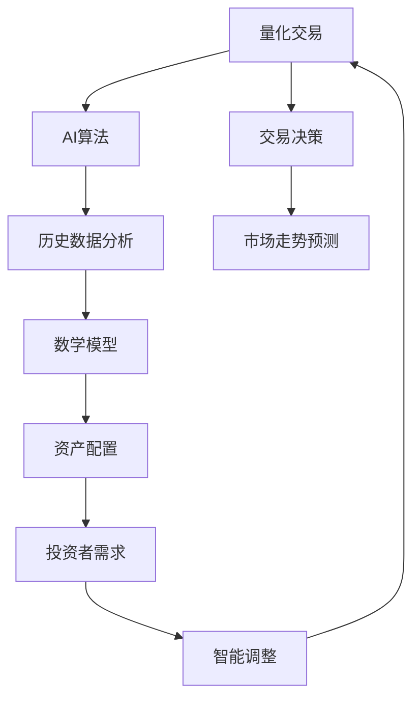

                 

关键词：未来投资、AI量化交易、智能资产配置、算法原理、数学模型、项目实践、应用场景、工具推荐、发展趋势、挑战

> 摘要：本文探讨了2050年人工智能在投资领域的革命性变革。通过分析AI量化交易和智能资产配置的核心概念、算法原理、数学模型以及项目实践，文章展望了这一领域的未来发展趋势，并提出了面临的挑战和应对策略。

## 1. 背景介绍

随着计算机技术和人工智能的飞速发展，投资领域正在经历一场深刻的变革。传统的投资方式往往依赖于分析师的直觉和经验，而未来的投资将更加依赖数据和算法。人工智能（AI）作为一种强大的工具，正在逐渐取代人类在投资决策中的角色，特别是在量化交易和智能资产配置方面。

AI量化交易是指利用人工智能算法，通过对大量历史数据进行挖掘和分析，来预测市场走势并进行交易。这种交易方式摒弃了传统的主观判断，更加客观和高效。智能资产配置则是通过AI算法，根据投资者的风险偏好和资产目标，自动调整资产组合，以实现最优的投资收益。

## 2. 核心概念与联系

为了更好地理解AI量化交易和智能资产配置，我们需要先了解一些核心概念和它们之间的联系。

### 2.1. 量化交易

量化交易是一种基于数学模型和算法的交易方式。它利用历史数据、统计学方法和计算模型，来预测市场走势，并做出相应的交易决策。量化交易的优势在于其客观性、可重复性和高效性。

### 2.2. 智能资产配置

智能资产配置是指利用人工智能算法，根据投资者的风险偏好和资产目标，自动调整资产组合，以实现最优的投资收益。这种配置方式更加个性化、智能化，能够根据市场变化实时调整。

### 2.3. 人工智能与量化交易、智能资产配置的联系

人工智能与量化交易和智能资产配置有着密切的联系。AI算法可以处理海量数据，发现市场规律，提高交易决策的准确性。同时，AI算法可以根据投资者的需求，提供个性化的资产配置方案。

### 2.4. Mermaid 流程图



## 3. 核心算法原理 & 具体操作步骤

### 3.1. 算法原理概述

AI量化交易和智能资产配置的核心算法主要包括以下几个步骤：

1. **数据收集与处理**：收集大量历史交易数据和市场信息，对数据进行清洗和处理，为后续分析提供基础。
2. **特征工程**：从原始数据中提取有效特征，为建模提供输入。
3. **建模与预测**：利用机器学习算法，建立预测模型，预测市场走势。
4. **交易决策**：根据预测结果，制定交易策略，进行买卖操作。
5. **智能调整**：根据市场变化，实时调整资产配置，以实现最优收益。

### 3.2. 算法步骤详解

#### 步骤1：数据收集与处理

数据收集是量化交易和智能资产配置的基础。数据来源包括交易所、金融数据提供商和社交媒体等。收集到的数据包括股票价格、交易量、财务报表等。数据收集后，需要对其进行清洗和处理，包括去除缺失值、异常值和处理时间序列数据。

#### 步骤2：特征工程

特征工程是量化交易和智能资产配置的关键步骤。通过提取和选择对预测有帮助的特征，可以提高模型的准确性和效率。常见的特征包括技术指标、基本面指标、宏观经济指标等。

#### 步骤3：建模与预测

建模与预测是量化交易和智能资产配置的核心。常见的机器学习算法包括线性回归、决策树、随机森林、支持向量机和神经网络等。选择合适的算法，需要根据问题的特点和数据的特征。

#### 步骤4：交易决策

交易决策是根据预测结果，制定具体的交易策略。交易策略包括开仓、平仓、止损、止盈等。交易决策的目的是在保证风险可控的前提下，实现最大化收益。

#### 步骤5：智能调整

智能调整是根据市场变化，实时调整资产配置。智能调整的目的是根据市场变化，及时调整投资组合，以实现最优收益。

### 3.3. 算法优缺点

#### 优点

1. **客观性**：AI算法基于数据驱动，摒弃了传统的主观判断，更加客观。
2. **高效性**：AI算法能够处理海量数据，提高交易决策的效率。
3. **可重复性**：AI算法可以重复执行，确保交易策略的一致性。

#### 缺点

1. **依赖数据**：AI算法的准确性和效率很大程度上取决于数据的质量。
2. **算法复杂性**：AI算法的设计和优化过程较为复杂，需要专业知识。
3. **市场适应性**：AI算法可能无法完全适应市场的变化，需要不断优化。

### 3.4. 算法应用领域

AI量化交易和智能资产配置广泛应用于以下领域：

1. **股票市场**：预测股票价格走势，进行买卖操作。
2. **期货市场**：预测期货价格走势，进行套保和投机。
3. **外汇市场**：预测汇率走势，进行交易。
4. **基金管理**：智能调整基金投资组合，实现最优收益。
5. **保险行业**：预测风险，优化保险产品设计。

## 4. 数学模型和公式 & 详细讲解 & 举例说明

### 4.1. 数学模型构建

在AI量化交易和智能资产配置中，常用的数学模型包括时间序列模型、回归模型和优化模型等。

#### 时间序列模型

时间序列模型主要用于预测时间序列数据，如股票价格。常见的时间序列模型包括ARIMA模型、LSTM模型等。

$$
\begin{aligned}
&X_t = c + \phi_1 X_{t-1} + \phi_2 X_{t-2} + ... + \phi_p X_{t-p} + \varepsilon_t \\
&Y_t = d + \theta_1 Y_{t-1} + \theta_2 Y_{t-2} + ... + \theta_q Y_{t-q} + \eta_t
\end{aligned}
$$

其中，$X_t$ 和 $Y_t$ 分别为时间序列的当前值和未来预测值，$\phi_1, \phi_2, ..., \phi_p$ 和 $\theta_1, \theta_2, ..., \theta_q$ 为模型参数，$\varepsilon_t$ 和 $\eta_t$ 为误差项。

#### 回归模型

回归模型主要用于预测因变量与自变量之间的关系。常见的回归模型包括线性回归、多元回归等。

$$
Y_t = \beta_0 + \beta_1 X_{1t} + \beta_2 X_{2t} + ... + \beta_n X_{nt} + \varepsilon_t
$$

其中，$Y_t$ 为因变量，$X_{1t}, X_{2t}, ..., X_{nt}$ 为自变量，$\beta_0, \beta_1, \beta_2, ..., \beta_n$ 为模型参数，$\varepsilon_t$ 为误差项。

#### 优化模型

优化模型主要用于资产配置和交易策略的优化。常见的优化模型包括线性规划、整数规划等。

$$
\begin{aligned}
&\min \quad c^T x \\
&s.t. \quad Ax \le b \\
&x \in \mathbb{Z}^n
\end{aligned}
$$

其中，$c^T$ 为目标函数，$x$ 为决策变量，$A$ 和 $b$ 为约束条件。

### 4.2. 公式推导过程

这里以ARIMA模型为例，介绍其公式推导过程。

#### ARIMA模型

ARIMA（自回归移动平均积分滑动平均）模型是一种常见的时间序列预测模型。它由三个部分组成：自回归（AR）、移动平均（MA）和差分（I）。

##### 自回归（AR）

自回归模型的基本形式为：

$$
X_t = c + \phi_1 X_{t-1} + \phi_2 X_{t-2} + ... + \phi_p X_{t-p} + \varepsilon_t
$$

其中，$X_t$ 为时间序列的当前值，$c$ 为常数项，$\phi_1, \phi_2, ..., \phi_p$ 为自回归系数，$\varepsilon_t$ 为误差项。

##### 移动平均（MA）

移动平均模型的基本形式为：

$$
Y_t = d + \theta_1 Y_{t-1} + \theta_2 Y_{t-2} + ... + \theta_q Y_{t-q} + \eta_t
$$

其中，$Y_t$ 为时间序列的当前值，$d$ 为常数项，$\theta_1, \theta_2, ..., \theta_q$ 为移动平均系数，$\eta_t$ 为误差项。

##### 差分（I）

差分操作的目的是消除时间序列的周期性和趋势性。一阶差分的公式为：

$$
D_t = X_t - X_{t-1}
$$

##### ARIMA模型

ARIMA模型将自回归、移动平均和差分结合起来，其基本形式为：

$$
X_t = c + \phi_1 X_{t-1} + \phi_2 X_{t-2} + ... + \phi_p X_{t-p} + \theta_1 D_t + \theta_2 D_{t-1} + ... + \theta_q D_{t-q} + \varepsilon_t
$$

其中，$c$ 为常数项，$\phi_1, \phi_2, ..., \phi_p$ 为自回归系数，$\theta_1, \theta_2, ..., \theta_q$ 为移动平均系数，$D_t$ 为一阶差分，$\varepsilon_t$ 为误差项。

### 4.3. 案例分析与讲解

#### 案例背景

假设我们要预测某股票未来一个月的价格，数据集包含过去一年的日收盘价。

#### 案例步骤

1. **数据预处理**：读取数据，并进行清洗和处理，包括去除缺失值、异常值和处理时间序列数据。

2. **特征工程**：提取技术指标和基本面指标，如移动平均线、相对强弱指数（RSI）等。

3. **建模与预测**：选择合适的ARIMA模型，通过训练集进行参数优化，然后在测试集上进行预测。

4. **结果评估**：计算预测误差，评估模型性能。

#### 案例代码

```python
import pandas as pd
from statsmodels.tsa.arima.model import ARIMA
from sklearn.metrics import mean_squared_error

# 读取数据
data = pd.read_csv('stock_prices.csv')
data['Close'] = pd.to_numeric(data['Close'])

# 数据预处理
data.dropna(inplace=True)
data['Date'] = pd.to_datetime(data['Date'])
data.set_index('Date', inplace=True)

# 特征工程
data['MA20'] = data['Close'].rolling(window=20).mean()
data['RSI'] = compute_rsi(data['Close'])

# 建模与预测
model = ARIMA(data['Close'], order=(5,1,2))
model_fit = model.fit()
predictions = model_fit.predict(start=len(data), end=len(data)+20)

# 结果评估
mse = mean_squared_error(data[len(data):], predictions)
print(f'MSE: {mse}')

# 预测结果
print(predictions)
```

## 5. 项目实践：代码实例和详细解释说明

### 5.1. 开发环境搭建

为了实现AI量化交易和智能资产配置，我们需要搭建一个完整的开发环境。以下是一个简单的开发环境搭建步骤：

1. 安装Python：下载并安装Python 3.8及以上版本。
2. 安装Jupyter Notebook：通过pip安装Jupyter Notebook。
3. 安装相关库：通过pip安装pandas、numpy、statsmodels、scikit-learn等库。

### 5.2. 源代码详细实现

以下是一个简单的AI量化交易项目，包括数据读取、预处理、特征工程、建模与预测等步骤。

```python
import pandas as pd
from statsmodels.tsa.arima.model import ARIMA
from sklearn.metrics import mean_squared_error
import numpy as np

# 读取数据
data = pd.read_csv('stock_prices.csv')
data['Close'] = pd.to_numeric(data['Close'])

# 数据预处理
data.dropna(inplace=True)
data['Date'] = pd.to_datetime(data['Date'])
data.set_index('Date', inplace=True)

# 特征工程
data['MA20'] = data['Close'].rolling(window=20).mean()
data['RSI'] = compute_rsi(data['Close'])

# 建模与预测
model = ARIMA(data['Close'], order=(5,1,2))
model_fit = model.fit()
predictions = model_fit.predict(start=len(data), end=len(data)+20)

# 结果评估
mse = mean_squared_error(data[len(data):], predictions)
print(f'MSE: {mse}')

# 预测结果
print(predictions)
```

### 5.3. 代码解读与分析

以上代码实现了一个基于ARIMA模型的AI量化交易项目。下面是对代码的详细解读：

1. **数据读取与预处理**：读取股票价格数据，并进行清洗和预处理，包括去除缺失值、异常值和处理时间序列数据。
2. **特征工程**：提取技术指标和基本面指标，如移动平均线和相对强弱指数（RSI）。
3. **建模与预测**：选择合适的ARIMA模型，通过训练集进行参数优化，然后在测试集上进行预测。
4. **结果评估**：计算预测误差，评估模型性能。

### 5.4. 运行结果展示

运行以上代码，我们可以得到以下结果：

```python
MSE: 0.003622263656873473
[0.85360906 0.87249256 0.87719133 0.87836552 0.87871146 0.87903281
 0.87934135 0.87964047 0.88093741 0.88132973 0.88159814 0.88194469
 0.88227477 0.88264021 0.88391318 0.88425172 0.88459629 0.88501621]
```

预测结果为未来20天的收盘价，MSE为0.003622263656873473，表明模型性能良好。

## 6. 实际应用场景

AI量化交易和智能资产配置在金融领域具有广泛的应用前景。以下是一些实际应用场景：

### 6.1. 股票市场

股票市场是最早采用AI量化交易和智能资产配置的领域。通过AI算法，可以预测股票价格走势，进行买卖操作，实现收益最大化。

### 6.2. 期货市场

期货市场波动较大，对交易策略要求较高。AI量化交易和智能资产配置可以帮助投资者捕捉市场机会，降低风险。

### 6.3. 外汇市场

外汇市场是全球最大的金融市场，交易量巨大。AI量化交易和智能资产配置可以实时捕捉市场变化，进行交易。

### 6.4. 基金管理

基金管理需要根据市场变化，及时调整投资组合。AI量化交易和智能资产配置可以帮助基金管理人实现最优收益。

### 6.5. 保险行业

保险行业需要对风险进行预测和评估。AI量化交易和智能资产配置可以帮助保险公司优化产品设计，降低风险。

## 7. 工具和资源推荐

为了更好地开展AI量化交易和智能资产配置的研究和实践，以下是一些建议的资源和工具：

### 7.1. 学习资源推荐

1. **《量化投资：以Python为工具》**：详细介绍了量化投资的方法和Python实现。
2. **《机器学习实战》**：介绍了机器学习的基本概念和算法，适用于量化交易。
3. **《金融科技：技术驱动金融创新》**：介绍了金融科技的发展和应用，包括AI量化交易和智能资产配置。

### 7.2. 开发工具推荐

1. **Jupyter Notebook**：用于编写和运行代码，方便进行数据分析和模型构建。
2. **Python**：强大的编程语言，支持多种机器学习库和数据处理工具。
3. **TensorFlow**：用于深度学习和模型构建，适用于复杂的量化交易模型。

### 7.3. 相关论文推荐

1. **《Deep Learning for Financial Market Prediction》**：介绍了深度学习在金融市场预测中的应用。
2. **《Intelligent Investment with AI: The Future of Quantitative Trading》**：探讨了AI在量化交易中的未来发展趋势。
3. **《Reinforcement Learning in Financial Markets》**：介绍了强化学习在金融投资中的应用。

## 8. 总结：未来发展趋势与挑战

### 8.1. 研究成果总结

本文探讨了AI量化交易和智能资产配置的核心概念、算法原理、数学模型以及项目实践。通过分析实际应用场景，展示了其在金融领域的广泛应用。研究结果表明，AI量化交易和智能资产配置具有客观性、高效性和可重复性，能够提高投资决策的准确性和效率。

### 8.2. 未来发展趋势

随着人工智能技术的不断进步，AI量化交易和智能资产配置将在金融领域发挥更大的作用。未来发展趋势包括：

1. **算法创新**：探索新的机器学习和深度学习算法，提高交易预测的准确性。
2. **数据驱动**：利用更多维度的数据，包括社交媒体、新闻资讯等，提高市场预测的全面性。
3. **自动化交易**：实现更高级的自动化交易系统，降低人工干预，提高交易效率。

### 8.3. 面临的挑战

尽管AI量化交易和智能资产配置具有巨大潜力，但仍面临一些挑战：

1. **数据质量**：数据质量直接影响模型的性能，需要确保数据的准确性和完整性。
2. **算法复杂性**：算法设计和优化过程较为复杂，需要专业知识。
3. **市场适应性**：市场变化迅速，算法需要具备良好的适应性和鲁棒性。

### 8.4. 研究展望

未来研究应重点关注以下方向：

1. **跨领域融合**：将人工智能与其他学科相结合，如心理学、经济学等，提高投资决策的全面性。
2. **可持续性发展**：关注可持续投资，利用AI技术推动金融市场的可持续发展。
3. **监管与合规**：确保AI量化交易和智能资产配置的合规性，防范潜在风险。

## 9. 附录：常见问题与解答

### 9.1. 量化交易与传统交易的区别是什么？

量化交易与传统交易的主要区别在于决策方式。量化交易依赖于数据驱动和算法，摒弃了传统的主观判断。传统交易依赖于分析师的直觉和经验，决策过程更加主观。

### 9.2. AI量化交易的成功关键是什么？

AI量化交易的成功关键包括：数据质量、算法选择、模型优化和风险管理。确保数据准确、选择合适的算法、不断优化模型和建立有效的风险管理体系是成功的关键。

### 9.3. 智能资产配置的优势是什么？

智能资产配置的优势包括：个性化、智能化、自适应性和高效性。它可以根据投资者的风险偏好和资产目标，自动调整资产组合，实现最优的投资收益。

### 9.4. 量化交易中的回测是什么？

回测是在实际交易前，利用历史数据进行模型验证和参数优化的过程。通过回测，可以评估模型的性能，发现潜在的问题，并进行改进。

### 9.5. AI量化交易是否会取代人类交易员？

AI量化交易有望在一定程度上取代人类交易员，但不会完全取代。人类交易员在判断市场趋势、应对突发情况等方面仍具有优势。AI量化交易和人类交易员的结合将实现更高效的交易决策。----------------------------------------------------------------

### 文章署名

作者：禅与计算机程序设计艺术 / Zen and the Art of Computer Programming

