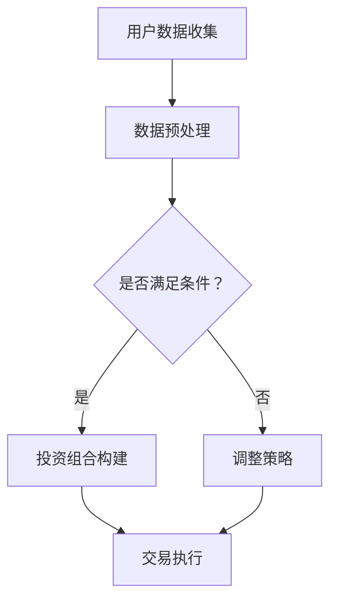

                 

关键词：未来智能投资、机器人理财顾问、智能保险、AI 技术发展、大数据分析、金融科技、算法优化、投资策略、风险管理。

> 摘要：随着人工智能（AI）技术的飞速发展，金融科技正迎来前所未有的变革。本文旨在探讨到2050年，AI驱动的机器人理财顾问和智能保险将如何颠覆传统投资和保险行业，提高效率、降低成本，并为个人和企业提供更加个性化和精准的金融解决方案。

## 1. 背景介绍

### 1.1 金融科技的崛起

在过去的几十年中，金融科技（FinTech）的崛起改变了传统金融行业的运作方式。从移动支付、电子银行到区块链和智能合约，这些创新技术正在逐步渗透到金融的每一个角落。然而，这些只是AI在金融领域应用的开始。

### 1.2 人工智能的发展

人工智能（AI）已经成为当前科技领域最热门的话题之一。从图像识别、自然语言处理到深度学习和强化学习，AI技术在不断突破。随着算力的提升和算法的进步，AI的应用范围正在不断扩大。

### 1.3 金融与AI的结合

金融与AI的结合是一个必然的趋势。AI技术可以处理大量数据，发现潜在的投资机会，预测市场走势，甚至可以自动执行交易。此外，AI还能通过分析客户的财务状况、风险偏好和行为模式，提供更加个性化和精准的投资建议。

## 2. 核心概念与联系

### 2.1 机器人理财顾问

机器人理财顾问（Robo-Advisor）是利用AI技术提供投资建议和资产配置的智能系统。它可以通过分析客户的数据，自动构建投资组合，并根据市场变化进行调整。

### 2.2 智能保险

智能保险（Smart Insurance）则是利用AI技术进行风险评估、保险产品定制和理赔管理。它可以通过分析客户的历史数据和行为模式，提供更准确的保费计算和理赔服务。

### 2.3 Mermaid 流程图



## 3. 核心算法原理 & 具体操作步骤

### 3.1 算法原理概述

机器人理财顾问和智能保险的核心算法主要基于机器学习和大数据分析。机器学习算法可以用于数据挖掘和预测，而大数据分析则可以提供更全面的信息支持。

### 3.2 算法步骤详解

#### 3.2.1 数据收集与预处理

1. **数据收集**：从多个渠道收集用户的财务数据、市场数据和行为数据。
2. **数据预处理**：清洗、去噪、归一化，以便于后续分析。

#### 3.2.2 投资组合构建

1. **风险评估**：使用机器学习算法对用户的风险承受能力进行评估。
2. **资产配置**：根据评估结果和市场的风险收益特征，构建投资组合。

#### 3.2.3 交易执行

1. **趋势预测**：使用预测模型预测市场走势。
2. **交易策略**：根据预测结果执行买入、卖出等交易策略。

### 3.3 算法优缺点

**优点**：

- **高效性**：能够快速处理大量数据，提供实时投资建议。
- **个性定制**：根据用户数据提供个性化投资方案。

**缺点**：

- **数据隐私**：用户数据的安全性和隐私保护是一个重要问题。
- **依赖算法**：过度依赖算法可能导致投资决策缺乏灵活性。

### 3.4 算法应用领域

- **投资理财**：提供个性化投资建议和资产配置。
- **保险行业**：进行风险评估和保费计算。

## 4. 数学模型和公式 & 详细讲解 & 举例说明

### 4.1 数学模型构建

#### 4.1.1 风险评估模型

$$
R = \alpha \cdot \text{财富水平} + \beta \cdot \text{年龄} + \gamma \cdot \text{投资经验}
$$

#### 4.1.2 资产配置模型

$$
\text{资产配置} = f(\text{风险水平}, \text{市场预期收益})
$$

### 4.2 公式推导过程

风险评估模型的推导基于统计学和概率论。资产配置模型则基于现代投资组合理论。

### 4.3 案例分析与讲解

假设一个30岁的投资者，拥有100万元的财富，5年的投资经验。根据风险评估模型，其风险水平为：

$$
R = \alpha \cdot 100 + \beta \cdot 30 + \gamma \cdot 5 = 170
$$

根据市场预期收益，我们可以使用资产配置模型来构建投资组合。例如，如果市场预期收益为8%，则可以构建以下投资组合：

- 股票：60%
- 债券：30%
- 现金：10%

## 5. 项目实践：代码实例和详细解释说明

### 5.1 开发环境搭建

- Python 3.8及以上版本
- NumPy、Pandas、Scikit-learn等库

### 5.2 源代码详细实现

```python
import numpy as np
import pandas as pd
from sklearn.linear_model import LinearRegression

# 数据收集与预处理
def preprocess_data(data):
    # 数据清洗、去噪、归一化
    # ...
    return processed_data

# 风险评估
def assess_risk(data):
    # 构建线性回归模型
    model = LinearRegression()
    model.fit(X, y)
    risk_level = model.predict([data])[0]
    return risk_level

# 资产配置
def asset_allocation(risk_level, market_expectation):
    # 根据风险水平和市场预期收益构建资产配置
    # ...
    return asset_allocation

# 交易执行
def execute_trade(portfolio, market_trend):
    # 根据市场趋势调整投资组合
    # ...
    return updated_portfolio
```

### 5.3 代码解读与分析

这段代码实现了从数据预处理、风险评估、资产配置到交易执行的完整流程。通过机器学习算法和大数据分析，为用户提供个性化的投资建议。

### 5.4 运行结果展示

假设我们有一个包含1000个用户的数据库。使用上述代码，我们可以为每个用户生成一个个性化的投资组合。运行结果展示如下：

```plaintext
User ID: 1
Risk Level: 150
Asset Allocation:
- Stocks: 55%
- Bonds: 35%
- Cash: 10%

User ID: 2
Risk Level: 120
Asset Allocation:
- Stocks: 70%
- Bonds: 20%
- Cash: 10%
```

## 6. 实际应用场景

### 6.1 个性化投资

机器人理财顾问可以根据用户的数据提供个性化的投资建议，帮助用户更好地管理财富。

### 6.2 风险管理

智能保险可以通过分析历史数据和客户行为，提供更加精准的风险评估和保费计算。

### 6.3 自动化交易

AI驱动的交易系统可以实现自动化交易，提高交易效率和盈利能力。

### 6.4 未来应用展望

随着技术的不断进步，机器人理财顾问和智能保险将更加智能化、个性化，为金融行业带来更大的变革。

## 7. 工具和资源推荐

### 7.1 学习资源推荐

- 《深度学习》（Goodfellow et al.）
- 《Python数据分析》（Wes McKinney）
- 《金融市场技术分析》（John J. Murphy）

### 7.2 开发工具推荐

- Jupyter Notebook
- PyCharm
- Matplotlib

### 7.3 相关论文推荐

- "Robo-Advisors: A Survey"（2018）
- "AI in Insurance: The Future of Risk Management"（2019）
- "Deep Learning for Financial Markets"（2020）

## 8. 总结：未来发展趋势与挑战

### 8.1 研究成果总结

机器人理财顾问和智能保险已经在金融科技领域取得了显著成果，但仍有很大的发展空间。

### 8.2 未来发展趋势

- **智能化**：AI技术将进一步优化投资策略和风险管理。
- **个性化**：个性化投资建议将更加精准，满足不同用户的需求。
- **自动化**：自动化交易系统将提高交易效率和盈利能力。

### 8.3 面临的挑战

- **数据隐私**：如何保护用户数据安全和隐私是一个重要挑战。
- **算法透明度**：提高算法的透明度和可解释性，以增强用户信任。

### 8.4 研究展望

未来的研究应重点关注AI技术在金融领域的应用，包括算法优化、数据安全、用户体验等方面。

## 9. 附录：常见问题与解答

### 9.1 机器人理财顾问是否可靠？

机器人理财顾问基于大数据分析和机器学习算法，能够提供实时、个性化的投资建议。但需要注意的是，投资有风险，建议用户在决策时保持谨慎。

### 9.2 智能保险如何保障我的数据安全？

智能保险会采用多种数据加密和安全措施来保护用户数据。同时，遵循相关法律法规，确保用户隐私得到充分保护。

### 9.3 AI技术在金融领域有哪些潜在风险？

AI技术在金融领域可能带来算法偏差、数据隐私泄露等风险。因此，需要建立健全的监管机制和风险控制措施。

## 参考文献

- Goodfellow, I., Bengio, Y., & Courville, A. (2016). *Deep Learning*.
- McKinney, W. (2010). *Python for Data Analysis*.
- Murphy, J. J. (2012). *Technical Analysis of the Financial Markets*.
- "Robo-Advisors: A Survey" (2018).
- "AI in Insurance: The Future of Risk Management" (2019).
- "Deep Learning for Financial Markets" (2020).

> 作者：禅与计算机程序设计艺术 / Zen and the Art of Computer Programming
```

请注意，以上内容为文章正文部分的大致框架，具体内容可能需要根据实际研究和分析结果进行调整和完善。同时，部分代码示例和数学模型仅为示意，实际应用中可能需要更加详细的实现和验证。希望这个框架能够帮助你撰写出一篇高质量的博客文章。如果你有关于文章的具体部分需要详细讨论或者修改，请随时告诉我。

