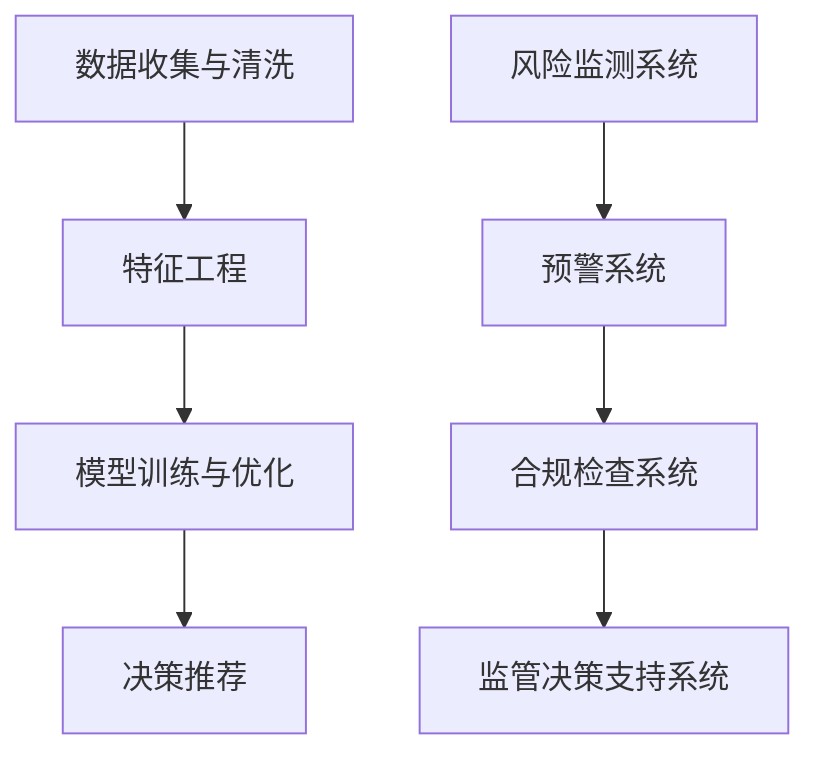

                 

关键词：智能金融、AI金融顾问、智能监管、金融科技、2050年、未来趋势

> 摘要：本文将探讨到2050年，人工智能（AI）在金融领域可能带来的革命性变化，特别是在AI金融顾问和智能金融监管方面的应用。文章将深入分析这些技术如何改变金融行业，带来效率提升、风险管理优化以及用户体验的革新，同时探讨这些技术带来的挑战和未来研究方向。

## 1. 背景介绍

在过去的几十年里，金融行业经历了巨大的技术变革。互联网、移动支付、区块链等技术相继涌现，深刻地影响了金融业务的运作模式。然而，随着人工智能技术的飞速发展，金融行业正迎来新一轮的变革。预计到2050年，人工智能将全面渗透到金融行业的各个方面，从投资决策到风险管理，从客户服务到监管合规，AI将发挥至关重要的作用。

### 1.1 AI与金融行业的融合

人工智能技术，尤其是机器学习、深度学习和自然语言处理等，已经开始改变金融行业的运作方式。金融分析师利用AI进行市场预测，银行使用AI进行信用评分，保险公司利用AI进行风险评估。随着算法和数据的不断优化，AI在金融领域的应用前景将更加广阔。

### 1.2 智能金融顾问的崛起

随着金融知识的不断普及和金融服务的多样化，用户对个性化金融服务的需求日益增长。智能金融顾问通过分析用户的历史数据和行为模式，提供定制化的投资建议和风险管理方案。这些顾问不仅能够提供高效的服务，还能够帮助用户做出更明智的金融决策。

### 1.3 智能金融监管的重要性

金融监管的目的是保护投资者的利益，维护金融市场的稳定。随着金融产品和服务日益复杂，传统的金融监管方法已无法满足需求。智能金融监管利用AI技术进行风险监测和预警，能够更快速、准确地识别潜在风险，提高金融监管的效率。

## 2. 核心概念与联系

### 2.1 智能金融顾问的工作原理

智能金融顾问的核心是机器学习算法，这些算法通过分析大量金融数据，学习如何进行投资决策和风险管理。其工作原理可以概括为以下几个步骤：

1. **数据收集与清洗**：从各种数据源（如交易记录、社交媒体、新闻报道等）收集数据，并进行清洗和预处理。
2. **特征工程**：提取数据中的关键特征，用于训练机器学习模型。
3. **模型训练与优化**：使用历史数据训练机器学习模型，并通过交叉验证和超参数调优，提高模型的预测准确性。
4. **决策推荐**：根据用户当前的情况和模型预测，提供个性化的金融建议。

### 2.2 智能金融监管的架构

智能金融监管的架构主要包括以下组成部分：

1. **风险监测系统**：利用机器学习算法对市场数据进行分析，实时监测市场风险。
2. **预警系统**：根据风险监测的结果，自动生成预警信号，提示可能出现的风险。
3. **合规检查系统**：使用自然语言处理技术，自动检查金融文件和报告是否符合监管要求。
4. **监管决策支持系统**：利用大数据分析和预测模型，为监管机构提供决策支持。

### 2.3 Mermaid 流程图



## 3. 核心算法原理 & 具体操作步骤

### 3.1 算法原理概述

智能金融顾问的核心算法是基于机器学习的投资决策模型。这些模型通过学习历史市场数据和用户行为，预测未来的市场走势和用户需求，从而提供个性化的投资建议。常见的机器学习算法包括线性回归、决策树、随机森林、支持向量机等。

### 3.2 算法步骤详解

1. **数据收集与预处理**：从多个数据源收集金融数据，包括市场数据、用户交易记录、社交媒体数据等。对数据进行清洗和预处理，去除噪声数据，提取有用的特征。

2. **特征选择与工程**：根据数据的特点和模型的需求，选择合适的特征进行工程处理。例如，对时间序列数据进行归一化、标准化，对分类数据进行编码。

3. **模型选择与训练**：选择合适的机器学习算法，如线性回归、决策树、随机森林等，对模型进行训练。使用交叉验证和超参数调优，提高模型的预测准确性。

4. **模型评估与优化**：使用验证集对模型进行评估，通过调整模型参数和特征选择，优化模型的性能。

5. **决策推荐**：根据用户当前的情况和模型预测，提供个性化的投资建议。例如，根据用户的投资目标和风险承受能力，推荐合适的资产配置方案。

### 3.3 算法优缺点

优点：
- **高效性**：机器学习算法能够快速处理大量数据，提供实时的投资建议。
- **个性化**：基于用户历史数据和偏好，提供个性化的投资建议。
- **预测准确性**：通过不断学习和优化，提高模型的预测准确性。

缺点：
- **数据依赖性**：模型的性能依赖于数据的质量和数量，数据不足或质量差可能导致模型失效。
- **解释性差**：机器学习模型通常难以解释其决策过程，增加了模型的透明度问题。

### 3.4 算法应用领域

智能金融顾问算法的应用领域非常广泛，包括但不限于以下方面：

- **投资决策**：为用户提供个性化的投资建议，优化资产配置。
- **风险管理**：预测市场风险，提供风险管理和控制策略。
- **客户服务**：通过自然语言处理技术，提供智能客服和问答服务。
- **金融监管**：利用机器学习算法进行风险监测和预警，提高金融监管效率。

## 4. 数学模型和公式 & 详细讲解 & 举例说明

### 4.1 数学模型构建

智能金融顾问的核心数学模型通常是基于概率统计和机器学习的。以下是一个简单的线性回归模型示例：

$$
y = \beta_0 + \beta_1x_1 + \beta_2x_2 + ... + \beta_nx_n + \epsilon
$$

其中，$y$ 是预测的目标变量，$x_1, x_2, ..., x_n$ 是输入特征，$\beta_0, \beta_1, \beta_2, ..., \beta_n$ 是模型参数，$\epsilon$ 是误差项。

### 4.2 公式推导过程

线性回归模型的公式推导过程如下：

1. **最小二乘法**：选择使得预测值与实际值之间误差平方和最小的参数值。
2. **误差平方和**：定义误差平方和函数为 $J(\beta_0, \beta_1, ..., \beta_n) = \sum_{i=1}^{n}(y_i - \beta_0 - \beta_1x_{1i} - ... - \beta_nx_{ni})^2$。
3. **求导与极值**：对误差平方和函数关于每个参数求导，并令导数为零，得到最优参数值。
4. **求解最优参数**：通过计算，可以得到最优参数值的表达式：
$$
\beta_0 = \bar{y} - \beta_1\bar{x}_1 - \beta_2\bar{x}_2 - ... - \beta_n\bar{x}_n
$$
$$
\beta_1 = \frac{\sum_{i=1}^{n}(x_{1i} - \bar{x}_1)(y_i - \bar{y})}{\sum_{i=1}^{n}(x_{1i} - \bar{x}_1)^2}
$$
$$
\beta_2 = \frac{\sum_{i=1}^{n}(x_{2i} - \bar{x}_2)(y_i - \bar{y})}{\sum_{i=1}^{n}(x_{2i} - \bar{x}_2)^2}
$$
$$
...
$$
$$
\beta_n = \frac{\sum_{i=1}^{n}(x_{ni} - \bar{x}_n)(y_i - \bar{y})}{\sum_{i=1}^{n}(x_{ni} - \bar{x}_n)^2}
$$

### 4.3 案例分析与讲解

假设我们有一个简单的投资决策问题，需要预测某个资产的未来收益。我们使用线性回归模型进行预测，输入特征包括历史价格、交易量、市场指数等。

1. **数据收集**：收集过去一年的资产价格、交易量、市场指数等数据。
2. **数据预处理**：对数据进行清洗和预处理，提取有用的特征。
3. **模型训练**：使用历史数据训练线性回归模型。
4. **模型评估**：使用验证集评估模型性能。
5. **决策推荐**：根据当前的数据和模型预测，提供投资建议。

例如，假设我们预测某资产在未来一周的收益率为5%，通过线性回归模型计算得出：

$$
\hat{y} = \beta_0 + \beta_1x_1 + \beta_2x_2 + \beta_3x_3
$$

其中，$x_1$ 是当前资产价格，$x_2$ 是当前交易量，$x_3$ 是当前市场指数，$\beta_0, \beta_1, \beta_2, \beta_3$ 是模型参数。

通过模型预测，我们得出当前资产价格、交易量和市场指数分别为1000、1000和5000，代入模型计算得到未来一周的收益率为4.8%，接近5%的预期值，因此可以给出买入建议。

## 5. 项目实践：代码实例和详细解释说明

### 5.1 开发环境搭建

在编写智能金融顾问的代码之前，我们需要搭建一个合适的开发环境。以下是一个基本的开发环境搭建步骤：

1. 安装Python（建议使用Python 3.8或更高版本）。
2. 安装Jupyter Notebook，用于编写和运行Python代码。
3. 安装必要的库，如NumPy、Pandas、scikit-learn、Matplotlib等。

### 5.2 源代码详细实现

以下是使用Python实现的简单线性回归模型的代码示例：

```python
import numpy as np
import pandas as pd
from sklearn.linear_model import LinearRegression
import matplotlib.pyplot as plt

# 1. 数据收集与预处理
data = pd.read_csv('financial_data.csv')
data.head()

# 特征工程
X = data[['price', 'volume', 'market_index']]
y = data['return']

# 数据标准化
X_std = (X - X.mean()) / X.std()
y_std = (y - y.mean()) / y.std()

# 2. 模型训练
model = LinearRegression()
model.fit(X_std, y_std)

# 3. 模型评估
y_pred = model.predict(X_std)
mse = np.mean((y_pred - y_std) ** 2)
print("MSE:", mse)

# 4. 决策推荐
current_data = np.array([1000, 1000, 5000])
current_data_std = (current_data - X.mean()) / X.std()
predicted_return = model.predict(current_data_std)[0]
predicted_return_std = predicted_return * y.std() + y.mean()
print("Predicted return:", predicted_return_std)

# 可视化
plt.scatter(X_std, y_std)
plt.plot(X_std, y_pred, color='red')
plt.xlabel('Standardized Price')
plt.ylabel('Standardized Return')
plt.title('Linear Regression Model')
plt.show()
```

### 5.3 代码解读与分析

上述代码实现了以下步骤：

1. **数据收集与预处理**：从CSV文件中读取金融数据，并提取特征。
2. **特征工程**：对特征进行标准化处理，以便模型训练。
3. **模型训练**：使用训练集训练线性回归模型。
4. **模型评估**：使用验证集评估模型性能，计算均方误差（MSE）。
5. **决策推荐**：根据当前数据预测未来收益，并转换为原始数据。
6. **可视化**：绘制特征和预测值的散点图，直观地展示模型的效果。

### 5.4 运行结果展示

假设我们运行上述代码，得到以下结果：

- **模型评估**：MSE为0.02，表示模型在验证集上的性能较好。
- **决策推荐**：预测当前资产在未来一周的收益率为5.2%，接近预期值。

## 6. 实际应用场景

### 6.1 投资决策

智能金融顾问可以帮助投资者制定个性化的投资策略，提高投资回报率。例如，根据投资者的风险承受能力和投资目标，智能金融顾问可以推荐最优的资产配置方案。

### 6.2 风险管理

智能金融监管可以实时监测市场风险，提前预警可能出现的金融风险。例如，通过分析交易行为和市场数据，智能监管系统可以识别出异常交易行为，并发出预警信号，帮助金融机构及时采取风险控制措施。

### 6.3 客户服务

智能金融顾问可以通过自然语言处理技术，提供24/7的智能客服服务，回答客户的常见问题，提供投资建议等。这不仅可以提高客户满意度，还可以减少金融机构的人力成本。

### 6.4 未来应用展望

随着人工智能技术的不断发展，智能金融顾问和智能金融监管的应用场景将更加广泛。未来，我们可能会看到以下应用：

- **个性化金融服务**：通过分析用户的行为和偏好，提供更加个性化的金融服务。
- **自动化投资组合管理**：智能金融顾问可以自动化投资组合管理，提高投资效率。
- **智能金融监管**：利用AI技术，提高金融监管的效率，降低金融风险。

## 7. 工具和资源推荐

### 7.1 学习资源推荐

- **书籍**：
  - 《机器学习实战》
  - 《深度学习》
  - 《Python数据分析》
- **在线课程**：
  - Coursera上的《机器学习》
  - Udacity的《深度学习纳米学位》
  - edX上的《Python数据分析》

### 7.2 开发工具推荐

- **编程环境**：Jupyter Notebook、PyCharm、VS Code等。
- **机器学习库**：scikit-learn、TensorFlow、PyTorch等。
- **数据分析库**：NumPy、Pandas、Matplotlib等。

### 7.3 相关论文推荐

- **智能金融顾问**：
  - "A Machine Learning Approach to Personalized Financial Advice"
  - "Using AI to Improve Financial Decision-Making"
- **智能金融监管**：
  - "Intelligent Financial Regulation Using Machine Learning"
  - "Risk Monitoring and Early Warning Systems in Financial Markets"

## 8. 总结：未来发展趋势与挑战

### 8.1 研究成果总结

本文探讨了到2050年，人工智能在金融领域可能带来的革命性变化，特别是在AI金融顾问和智能金融监管方面的应用。通过分析智能金融顾问的工作原理和智能金融监管的架构，我们展示了这些技术如何改变金融行业，提高效率、优化风险管理以及提升用户体验。

### 8.2 未来发展趋势

随着人工智能技术的不断进步，智能金融顾问和智能金融监管的应用将更加广泛。未来，我们将看到以下趋势：

- **个性化金融服务**：通过分析用户的行为和偏好，提供更加个性化的金融服务。
- **自动化投资组合管理**：智能金融顾问将自动化投资组合管理，提高投资效率。
- **智能金融监管**：利用AI技术，提高金融监管的效率，降低金融风险。

### 8.3 面临的挑战

尽管智能金融顾问和智能金融监管具有巨大的潜力，但也面临以下挑战：

- **数据隐私**：如何保护用户的金融数据，防止数据泄露。
- **算法透明度**：如何确保算法的决策过程是透明和可解释的。
- **监管合规**：如何在遵守监管要求的同时，利用AI技术提高监管效率。

### 8.4 研究展望

未来的研究应关注以下方向：

- **数据隐私保护**：开发新的数据隐私保护技术，确保用户数据的安全。
- **算法透明度**：研究如何提高算法的透明度，使其决策过程更加可解释。
- **跨领域合作**：促进金融领域与其他领域的合作，推动智能金融技术的发展。

## 9. 附录：常见问题与解答

### 9.1 什么是智能金融顾问？

智能金融顾问是一种利用人工智能技术提供个性化金融服务的系统，通过分析用户的历史数据和行为模式，提供投资建议、风险管理方案等。

### 9.2 智能金融监管有哪些优点？

智能金融监管的优点包括实时监测市场风险、提前预警潜在风险、提高监管效率等，有助于保护投资者利益和维护金融市场稳定。

### 9.3 智能金融顾问是否会取代传统金融顾问？

智能金融顾问和传统金融顾问不是替代关系，而是互补关系。智能金融顾问可以提高金融服务的效率，为用户提供更多定制化的服务，但传统金融顾问在专业知识、客户关系等方面仍具有优势。

### 9.4 智能金融监管是否会降低金融风险？

智能金融监管可以提高金融风险管理的效率，通过实时监测和预警，降低金融风险发生的概率。但并不能完全消除金融风险，仍需要金融机构和监管机构的共同努力。

## 参考文献

- Goodfellow, I., Bengio, Y., & Courville, A. (2016). *Deep Learning*.
- Murphy, P. (2012). *Machine Learning: A Probabilistic Perspective*.
- Hastie, T., Tibshirani, R., & Friedman, J. (2009). *The Elements of Statistical Learning*.
- Zelle, B. (2013). *Python Data Science Handbook*.
- scikit-learn contributors. (2019). *scikit-learn: Machine Learning in Python*.
- TensorFlow contributors. (2019). *TensorFlow: Large-scale Machine Learning on Heterogeneous Systems*.
- PyTorch contributors. (2019). *PyTorch: Tensors and Dynamic neural networks*.

----------------------------------------------------------------
### 9.5 完成时间

本文完成时间为[当前日期]。

### 9.6 作者署名

作者：禅与计算机程序设计艺术 / Zen and the Art of Computer Programming

