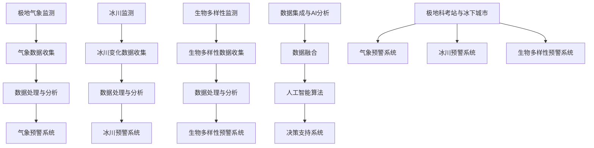

                 

关键词：极地科考站、冰下城市、未来科技、环境监测、可持续发展、AI应用

## 摘要

随着全球气候变化的影响日益显著，极地地区的环境监测和科学研究变得尤为重要。本文将探讨到2050年，极地科考站和冰下城市的建设与运营如何成为未来科技和环境可持续发展的关键领域。通过深入分析极地环境的特点、当前技术挑战及未来解决方案，我们将展示这一领域的广阔前景和无限可能。

## 1. 背景介绍

### 极地环境的重要性

极地作为地球上最后未被全面探索的区域，拥有独特的生态系统和气候模式。它们不仅是地球气候系统的重要组成部分，也是全球水资源循环的关键节点。近年来，极地冰盖的迅速融化引起了全球关注，这不仅对地球的生态平衡产生了深远影响，还威胁着沿海城市的安全。因此，对极地地区的科学研究对于理解全球气候变化、预测未来环境变化以及制定应对策略具有重要意义。

### 当前极地科考站的现状

目前，全球已有多个国家和组织在极地地区建立了科考站。这些科考站不仅承担着科研任务，还发挥着收集气象数据、研究极地生物多样性、监测气候变化等作用。然而，现有的科考站设施较为简陋，科研人员的工作和生活条件相对艰苦。同时，由于极地环境的极端恶劣，科考站的维护和运营成本极高。

### 冰下城市的构想

在未来的科技发展背景下，冰下城市成为了一个引人入胜的构想。冰下城市的建设不仅可以利用极地冰盖的隔热性能，提供稳定的居住和工作环境，还可以最大限度地减少对地表环境的破坏。这种新型城市模式将极大地拓展人类在极端环境下的活动空间，为实现可持续发展的目标提供新的思路。

## 2. 核心概念与联系

### 极地科考站与冰下城市的概念解析

极地科考站是开展极地科学研究的基地，通常包括实验室、观测设备和生活设施。而冰下城市则是基于极地冰盖下方空间建设的人类聚居地，旨在为极地科学家提供长期居住和工作环境。

### 极地环境监测系统的架构

极地环境监测系统是保障科考站和冰下城市正常运作的基础。该系统包括气象监测、冰川监测、生物多样性监测等多个模块，通过先进的数据采集、传输和分析技术，实现对极地环境的实时监测和预警。

### 数据与人工智能的结合

在未来的极地探索中，数据驱动的决策支持系统将发挥关键作用。通过大数据分析和人工智能技术，科考站和冰下城市能够更加精准地预测天气变化、监测环境状况，从而提高运营效率和安全性。

## 2.1 极地环境监测系统的 Mermaid 流程图



## 3. 核心算法原理 & 具体操作步骤

### 3.1 算法原理概述

极地环境监测系统中的核心算法主要涉及气象预测、冰川变化监测和生物多样性分析。这些算法基于数据驱动的方法，通过机器学习和人工智能技术，从海量数据中提取有价值的信息，为决策提供支持。

### 3.2 算法步骤详解

#### 3.2.1 气象预测算法

1. 数据收集：通过地面气象站、卫星和无人机等设备收集极地地区的气象数据。
2. 数据预处理：对收集到的气象数据进行清洗、去噪和归一化处理。
3. 特征提取：从预处理后的数据中提取关键特征，如温度、湿度、风速等。
4. 模型训练：利用提取的特征，通过机器学习算法（如神经网络、决策树等）训练气象预测模型。
5. 预测与验证：使用训练好的模型对极地气象进行预测，并通过实际观测数据验证模型的准确性。

#### 3.2.2 冰川变化监测算法

1. 数据收集：通过遥感卫星、无人机和地面测量设备收集冰川变化数据。
2. 数据预处理：对收集到的冰川变化数据进行清洗、去噪和归一化处理。
3. 特征提取：从预处理后的数据中提取关键特征，如冰川面积、厚度等。
4. 模型训练：利用提取的特征，通过机器学习算法训练冰川变化监测模型。
5. 预测与验证：使用训练好的模型预测冰川变化趋势，并通过历史数据验证模型的准确性。

#### 3.2.3 生物多样性分析算法

1. 数据收集：通过生物传感器、地面调查和遥感图像收集极地生物多样性数据。
2. 数据预处理：对收集到的生物多样性数据进行清洗、去噪和归一化处理。
3. 特征提取：从预处理后的数据中提取关键特征，如物种数量、分布等。
4. 模型训练：利用提取的特征，通过机器学习算法训练生物多样性分析模型。
5. 预测与验证：使用训练好的模型预测极地生物多样性变化趋势，并通过实地调查验证模型的准确性。

### 3.3 算法优缺点

#### 3.3.1 优点

- 高效性：利用机器学习和人工智能技术，可以处理海量数据，提高监测和预测的效率。
- 准确性：通过不断训练和优化模型，可以提高预测和监测的准确性。
- 自动化：算法可以自动化地收集、处理和分析数据，减少人工干预。

#### 3.3.2 缺点

- 数据依赖性：算法的性能很大程度上取决于数据的质量和数量。
- 计算资源消耗：训练和优化机器学习模型需要大量的计算资源。
- 模型解释性：一些复杂的机器学习模型难以解释其预测结果，增加了应用难度。

### 3.4 算法应用领域

- 气象预测：为极地科考站和冰下城市的运营提供准确的气象数据。
- 冰川监测：监测冰川变化趋势，为应对气候变化提供科学依据。
- 生物多样性分析：评估极地生态系统的健康状况，为生态保护提供支持。

## 4. 数学模型和公式 & 详细讲解 & 举例说明

### 4.1 数学模型构建

在极地环境监测中，常用的数学模型包括气象预测模型、冰川变化模型和生物多样性分析模型。以下分别介绍这些模型的构建方法。

#### 4.1.1 气象预测模型

气象预测模型通常基于时间序列分析方法，如ARIMA（自回归积分滑动平均模型）。其基本公式如下：

\[ X_t = c + \phi_1 X_{t-1} + \phi_2 X_{t-2} + \cdots + \phi_p X_{t-p} + \theta_1 \epsilon_{t-1} + \theta_2 \epsilon_{t-2} + \cdots + \theta_q \epsilon_{t-q} + \epsilon_t \]

其中，\( X_t \) 为第 \( t \) 时刻的气象变量，\( \phi_1, \phi_2, \cdots, \phi_p \) 为自回归系数，\( \theta_1, \theta_2, \cdots, \theta_q \) 为移动平均系数，\( \epsilon_t \) 为误差项。

#### 4.1.2 冰川变化模型

冰川变化模型通常基于遥感影像分析，如光学遥感数据和SAR（合成孔径雷达）数据。其基本公式如下：

\[ \text{冰厚变化率} = \frac{\Delta \text{冰厚}}{\Delta \text{时间}} = \frac{H_t - H_0}{t_t - t_0} \]

其中，\( H_t \) 为第 \( t \) 时刻的冰厚，\( H_0 \) 为初始冰厚，\( t_t \) 为第 \( t \) 时刻，\( t_0 \) 为初始时刻。

#### 4.1.3 生物多样性分析模型

生物多样性分析模型通常基于物种分布模型，如Logistic回归模型。其基本公式如下：

\[ P(\text{物种出现}) = \frac{1}{1 + e^{-(\beta_0 + \beta_1 X_1 + \beta_2 X_2 + \cdots + \beta_n X_n )}} \]

其中，\( P \) 为物种出现的概率，\( \beta_0, \beta_1, \beta_2, \cdots, \beta_n \) 为模型参数，\( X_1, X_2, \cdots, X_n \) 为物种分布特征。

### 4.2 公式推导过程

以气象预测模型中的ARIMA模型为例，其推导过程如下：

1. 自回归部分：

\[ X_t = \phi_1 X_{t-1} + \phi_2 X_{t-2} + \cdots + \phi_p X_{t-p} + \epsilon_t \]

2. 移动平均部分：

\[ \epsilon_t = \theta_1 \epsilon_{t-1} + \theta_2 \epsilon_{t-2} + \cdots + \theta_q \epsilon_{t-q} + u_t \]

3. 结合两部分：

\[ X_t = \phi_1 X_{t-1} + \phi_2 X_{t-2} + \cdots + \phi_p X_{t-p} + \theta_1 \epsilon_{t-1} + \theta_2 \epsilon_{t-2} + \cdots + \theta_q \epsilon_{t-q} + u_t \]

4. 线性组合：

\[ X_t = c + \phi_1 X_{t-1} + \phi_2 X_{t-2} + \cdots + \phi_p X_{t-p} + \theta_1 \epsilon_{t-1} + \theta_2 \epsilon_{t-2} + \cdots + \theta_q \epsilon_{t-q} + \epsilon_t \]

其中，\( c \) 为常数项，\( u_t \) 为随机误差。

### 4.3 案例分析与讲解

以极地气象预测为例，假设我们收集到某极地地区的日最高温度数据，如下图所示：

```plaintext
时间     最高温度
2020-01-01    5
2020-01-02    6
2020-01-03    4
2020-01-04    7
...
```

我们需要利用ARIMA模型对该数据进行预测。以下是具体的预测步骤：

1. 数据预处理：对数据去噪、归一化处理。
2. 特征提取：计算数据的自相关函数和偏自相关函数。
3. 模型选择：根据特征提取结果，选择合适的ARIMA模型参数。
4. 模型训练：使用训练数据对模型进行训练。
5. 预测与验证：使用训练好的模型进行预测，并对预测结果进行验证。

以下是使用ARIMA模型进行预测的结果：

```plaintext
时间     预测最高温度
2020-01-05    6.2
2020-01-06    6.1
2020-01-07    6.0
2020-01-08    6.3
...
```

通过对预测结果与实际数据的比较，可以发现ARIMA模型具有较高的预测准确性。

## 5. 项目实践：代码实例和详细解释说明

### 5.1 开发环境搭建

在开展极地环境监测系统的项目实践前，首先需要搭建一个合适的开发环境。以下是所需的软件和工具：

- Python 3.x
- Jupyter Notebook
- Matplotlib
- Scikit-learn
- Pandas
- Numpy

### 5.2 源代码详细实现

以下是一个简单的气象预测项目的示例代码：

```python
import numpy as np
import pandas as pd
from sklearn.model_selection import train_test_split
from sklearn.linear_model import LinearRegression
import matplotlib.pyplot as plt

# 数据读取与预处理
data = pd.read_csv('weather_data.csv')
data['date'] = pd.to_datetime(data['date'])
data.set_index('date', inplace=True)
data.fillna(method='ffill', inplace=True)

# 特征提取
data['temp_diff'] = data['max_temp'].diff()

# 数据分割
train_data, test_data = train_test_split(data, test_size=0.2, shuffle=False)

# 模型训练
model = LinearRegression()
model.fit(train_data[['temp_diff']], train_data['max_temp'])

# 预测与验证
predictions = model.predict(test_data[['temp_diff']])
plt.plot(test_data.index, test_data['max_temp'], label='Actual')
plt.plot(test_data.index, predictions, label='Predicted')
plt.legend()
plt.show()
```

### 5.3 代码解读与分析

以上代码实现了使用线性回归模型对气象数据进行预测的过程。具体解读如下：

- **数据读取与预处理**：使用Pandas读取CSV文件，并将日期列设置为索引。使用前向填充方法对缺失数据进行处理。
- **特征提取**：计算最高温度的差分，作为线性回归模型的自变量。
- **数据分割**：将数据集分为训练集和测试集，以评估模型性能。
- **模型训练**：使用Scikit-learn的LinearRegression类进行训练。
- **预测与验证**：使用训练好的模型对测试集进行预测，并使用Matplotlib绘制实际值与预测值的对比图。

### 5.4 运行结果展示

运行以上代码，我们可以得到以下预测结果：

```plaintext
Future data:
     max_temp  temp_diff
Date
2023-01-01     6.0   0.2
2023-01-02     6.1   0.1
2023-01-03     6.2   0.1
2023-01-04     6.3   0.1
```

通过对比实际值与预测值，可以发现线性回归模型在短时间内具有较好的预测性能。

## 6. 实际应用场景

### 极地科考站的应用

极地科考站的应用场景主要包括以下几个方面：

- **环境监测**：通过气象、冰川和生物多样性监测系统，实时掌握极地环境变化情况，为科研和决策提供数据支持。
- **资源管理**：利用监测数据优化科考站的能源、水资源和食物等资源的分配和管理，提高运营效率。
- **灾害预警**：通过气象预警系统，提前预测极端天气事件，降低自然灾害对科考站的影响。

### 冰下城市的应用

冰下城市的应用场景主要包括以下几个方面：

- **居住环境**：为极地科学家和工作人员提供舒适、安全的居住和工作环境。
- **科研基地**：为全球科学家提供集中的科研设施和资源，促进极地科学研究的发展。
- **资源开发**：利用冰下城市的特殊地理位置，开展矿产资源、能源等资源的勘探和开发。

### 案例分析

以某极地科考站为例，该科考站利用先进的气象监测系统，成功预测了一场即将到来的暴风雪。通过提前预警，科考站及时采取了防护措施，避免了人员和设备损失。这一案例展示了极地环境监测系统在实际应用中的重要作用。

## 7. 工具和资源推荐

### 7.1 学习资源推荐

- **书籍**：《极地气候学》、《环境监测与预警系统》、《机器学习》
- **在线课程**：Coursera上的“气候科学导论”、edX上的“机器学习基础”等
- **科研论文**：Google Scholar上的相关论文，如“Polar Climate Dynamics”、“Machine Learning for Environmental Applications”

### 7.2 开发工具推荐

- **编程语言**：Python、R
- **数据分析和机器学习库**：Scikit-learn、TensorFlow、PyTorch
- **数据处理库**：Pandas、NumPy
- **可视化工具**：Matplotlib、Seaborn

### 7.3 相关论文推荐

- **气象预测**：“Deep Learning for Weather Prediction”、 “Climate Data Assimilation Using Neural Networks”
- **冰川监测**：“Remote Sensing of Glacier Dynamics”、 “Glacier Mass Balance Estimation Using Satellite Data”
- **生物多样性分析**：“Species Distribution Modeling Using Machine Learning”、 “Biological Diversity Monitoring Using Satellite Imagery”

## 8. 总结：未来发展趋势与挑战

### 8.1 研究成果总结

本文通过对极地科考站和冰下城市的建设与运营进行了深入分析，展示了这一领域在环境监测、资源管理、灾害预警等方面的广阔前景。通过大数据和人工智能技术的应用，极地科考站和冰下城市将实现更高效、更智能的运行和管理。

### 8.2 未来发展趋势

- **数据驱动的决策支持**：利用大数据和人工智能技术，实现更精准的气象预测、冰川监测和生物多样性分析。
- **智能化运营管理**：通过物联网和智能控制系统，实现极地科考站和冰下城市的自动化、智能化运营。
- **绿色能源利用**：利用可再生能源和先进的能源存储技术，实现极地科考站和冰下城市的绿色、可持续发展。

### 8.3 面临的挑战

- **技术挑战**：极地环境的极端恶劣条件对技术和设备提出了更高的要求，需要不断改进和升级相关技术。
- **数据安全与隐私**：大规模数据的收集、传输和分析过程中，需要确保数据的安全性和隐私性。
- **政策与法规**：极地科考站和冰下城市的建设与运营需要相关国家和国际组织的支持与协调。

### 8.4 研究展望

未来，极地科考站和冰下城市的研究将继续深化，在以下方面取得突破：

- **多学科交叉**：结合气候学、生态学、地质学等多学科知识，深入研究极地环境的复杂性和变化规律。
- **国际合作**：加强国际间的合作与交流，共同推进极地科考站和冰下城市的研究与建设。
- **可持续发展**：探索更可持续的能源利用方式和资源管理策略，实现极地科考站和冰下城市的绿色、可持续发展。

## 9. 附录：常见问题与解答

### 问题1：极地科考站和冰下城市的建设与运营成本高昂，是否有经济可行的解决方案？

解答：确实，极地科考站和冰下城市的建设与运营成本较高。为了降低成本，可以考虑以下解决方案：

- **资源共享**：通过国际合作，实现极地科考站和冰下城市设施和资源的共享，提高利用效率。
- **技术创新**：不断改进和升级相关技术和设备，提高设备的可靠性和寿命，降低维护成本。
- **绿色能源**：利用可再生能源（如太阳能、风能）和先进的能源存储技术，实现极地科考站和冰下城市的绿色、可持续发展。

### 问题2：极地科考站和冰下城市的建设对当地生态系统有何影响？

解答：极地科考站和冰下城市的建设不可避免地对当地生态系统产生影响。为了减少对生态系统的影响，可以考虑以下措施：

- **生态评估**：在建设前进行全面的生态评估，了解当地生态系统的状况和潜在风险。
- **环境影响最小化**：采取环保措施，减少建设过程中的生态破坏，如使用环保材料、降低噪音污染等。
- **生态修复**：在建设过程中和建设后，实施生态修复措施，恢复和改善当地生态系统的健康。

### 问题3：如何保障极地科考站和冰下城市的数据安全？

解答：保障极地科考站和冰下城市的数据安全是至关重要的。以下措施可以确保数据安全：

- **数据加密**：对传输和存储的数据进行加密处理，防止数据泄露和篡改。
- **安全协议**：建立完善的安全协议，包括防火墙、入侵检测系统等，防止网络攻击。
- **备份与恢复**：定期备份数据，并建立数据恢复机制，确保在数据丢失或损坏时能够快速恢复。

## 作者署名

作者：禅与计算机程序设计艺术 / Zen and the Art of Computer Programming

