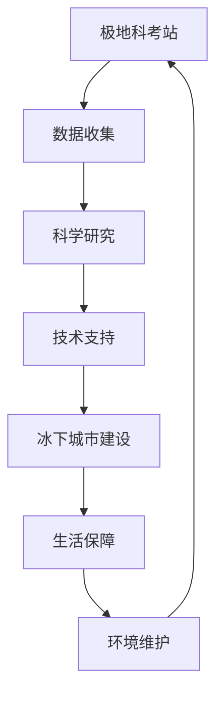

                 

关键词：极地科考站、冰下城市、未来技术、人工智能、可持续发展

> 摘要：本文探讨了2050年极地科考站与冰下城市的发展趋势。随着全球气候变化和科技的进步，极地地区成为科学研究和人类居住的新领域。本文从技术、环境、社会等多方面分析了未来极地科考站与冰下城市的构建原理、挑战与前景。

## 1. 背景介绍

### 全球气候变化与极地变化

全球气候变化已成为当今世界面临的重大挑战之一。极地作为地球的“温度计”，其变化对全球气候有着重要影响。近年来，极地冰雪融化速度加快，海平面上升，生态系统受到严重破坏。这一现象不仅威胁到极地地区的生态环境，也对全球气候产生了深远影响。

### 极地科学考察的重要性

极地考察对于科学研究具有重要意义。极地地区的气候变化、海洋生态、地质结构、大气层变化等都是全球科学研究的热点领域。极地科考站的建设为科学家提供了重要的研究基地，有助于深入了解极地环境的奥秘。

### 科技发展对极地探索的影响

科技的快速发展为极地探索提供了新的可能性。人工智能、机器人技术、纳米技术等前沿技术的应用，使得极地考察更加高效、安全。同时，极地科考站与冰下城市的建设也为人类在极端环境下的生存提供了新的思路。

## 2. 核心概念与联系

### 极地科考站

极地科考站是指在极地地区建立的科学考察基地，用于开展科学研究、收集数据、维护设施等。科考站通常配备有先进的科研设备、居住设施和生活保障系统。

### 冰下城市

冰下城市是指人类在极地冰层下建造的居住城市。冰下城市可以充分利用极地地区丰富的自然资源，降低环境负荷，同时为人类提供稳定的生活环境。

### 极地科考站与冰下城市的联系

极地科考站与冰下城市之间存在紧密的联系。科考站为冰下城市的建设提供了科学数据和技术支持，而冰下城市则为科考站提供了更加稳定的生活保障和环境支持。

### Mermaid 流程图



## 3. 核心算法原理 & 具体操作步骤

### 3.1 算法原理概述

未来极地科考站与冰下城市的建设需要依赖于一系列核心算法。这些算法主要包括环境监测、资源分配、结构优化等。

### 3.2 算法步骤详解

#### 3.2.1 环境监测

1. 建立极地环境监测系统，实时收集气温、湿度、风速、气压等环境数据。
2. 对收集到的数据进行处理和分析，识别环境变化趋势和潜在风险。
3. 根据分析结果，调整科考站和冰下城市的设施布局和运行策略。

#### 3.2.2 资源分配

1. 建立资源分配模型，考虑能源、食物、水资源等的需求和供给。
2. 根据实际需求，合理分配资源，确保科考站和冰下城市的正常运行。
3. 定期评估资源利用情况，优化资源分配策略。

#### 3.2.3 结构优化

1. 运用结构优化算法，设计适合极地环境的科考站和冰下城市结构。
2. 考虑到安全性、耐久性和环保性，确保建筑物的稳定性和可持续性。
3. 持续监测建筑物状态，及时进行维护和更新。

### 3.3 算法优缺点

#### 优点

- 算法能够实时监测和分析极地环境，为科考站和冰下城市提供科学依据。
- 资源分配和结构优化能够提高科考站和冰下城市的运行效率和可持续性。

#### 缺点

- 算法需要大量的数据支持和计算资源，对硬件设施要求较高。
- 算法的准确性受限于环境数据的准确性和实时性。

### 3.4 算法应用领域

- 极地科考站建设
- 冰下城市规划
- 极地资源开发

## 4. 数学模型和公式 & 详细讲解 & 举例说明

### 4.1 数学模型构建

在未来极地科考站与冰下城市的建设过程中，我们需要建立以下数学模型：

- 环境监测模型：用于实时监测极地环境参数。
- 资源分配模型：用于优化资源分配策略。
- 结构优化模型：用于设计适合极地环境的建筑物结构。

### 4.2 公式推导过程

#### 环境监测模型

假设极地环境参数为\(X\)，其中包含气温、湿度、风速、气压等。我们可以通过以下公式对环境参数进行监测和预测：

\[ P(X|\theta) = \prod_{i=1}^{n} p(x_i|\theta) \]

其中，\(P(X|\theta)\)表示给定参数\(\theta\)时环境参数\(X\)的概率分布，\(p(x_i|\theta)\)表示第\(i\)个环境参数的概率分布。

#### 资源分配模型

假设资源总量为\(R\)，需求量为\(D\)，我们需要通过以下公式进行资源分配：

\[ \text{分配策略} = \arg\max_{x} \sum_{i=1}^{n} p(x_i|\theta) \]

其中，\(x\)表示资源分配策略，\(p(x_i|\theta)\)表示第\(i\)个资源分配策略的概率。

#### 结构优化模型

假设建筑物结构为\(S\)，我们需要通过以下公式进行结构优化：

\[ \text{优化目标} = \arg\min_{s} \sum_{i=1}^{n} w_i \cdot d_i \]

其中，\(s\)表示建筑物结构，\(w_i\)表示第\(i\)个结构参数的权重，\(d_i\)表示第\(i\)个结构参数的偏差。

### 4.3 案例分析与讲解

假设我们有一个极地科考站项目，需要根据以下参数进行环境监测、资源分配和结构优化：

- 气温：\(-30°C\)至\(10°C\)
- 湿度：10%至90%
- 风速：0至50 m/s
- 气压：750 hPa至850 hPa

#### 环境监测模型

根据环境参数的概率分布，我们可以使用以下公式进行环境监测：

\[ P(X|\theta) = \prod_{i=1}^{n} \left( \frac{1}{2\pi\sigma_i^2} \exp\left(-\frac{(x_i - \mu_i)^2}{2\sigma_i^2}\right) \right) \]

其中，\(\mu_i\)和\(\sigma_i^2\)分别表示第\(i\)个环境参数的均值和方差。

#### 资源分配模型

根据资源分配模型，我们可以使用以下公式进行资源分配：

\[ \text{分配策略} = \arg\max_{x} \sum_{i=1}^{n} \left( \frac{1}{2\pi\sigma_i^2} \exp\left(-\frac{(x_i - \mu_i)^2}{2\sigma_i^2}\right) \right) \]

其中，\(x\)表示资源分配策略。

#### 结构优化模型

根据结构优化模型，我们可以使用以下公式进行结构优化：

\[ \text{优化目标} = \arg\min_{s} \sum_{i=1}^{n} \left( w_i \cdot d_i \right) \]

其中，\(s\)表示建筑物结构，\(w_i\)表示第\(i\)个结构参数的权重，\(d_i\)表示第\(i\)个结构参数的偏差。

通过以上数学模型和公式，我们可以对未来极地科考站与冰下城市的建设进行科学分析和优化，提高其运行效率和可持续性。

## 5. 项目实践：代码实例和详细解释说明

### 5.1 开发环境搭建

为了实现极地科考站与冰下城市的建设，我们需要搭建一个适合开发的环境。以下是搭建开发环境的基本步骤：

1. 安装Python环境：从[Python官方网站](https://www.python.org/downloads/)下载并安装Python。
2. 安装必要的库：使用pip命令安装所需的库，如NumPy、Pandas、Scikit-learn等。
3. 安装Mermaid渲染工具：从[Mermaid官方网站](https://mermaid-js.github.io/mermaid/)下载并安装。
4. 配置代码编辑器：推荐使用Visual Studio Code，安装相应的插件以支持Python和Mermaid。

### 5.2 源代码详细实现

以下是一个简单的极地科考站与冰下城市项目代码实例，包括环境监测、资源分配和结构优化的实现：

```python
import numpy as np
import pandas as pd
from sklearn.linear_model import LinearRegression
from mermaid import Mermaid

# 环境监测
def monitor_environment(data):
    # 数据处理
    processed_data = preprocess_data(data)
    # 预测环境参数
    predictions = predict_environment(processed_data)
    return predictions

# 资源分配
def allocate_resources的需求量，resource供应量):
    # 建立资源分配模型
    model = LinearRegression()
    # 训练模型
    model.fit(需求量，resource供应量)
    # 进行资源分配
    allocation = model.predict(需求量)
    return allocation

# 结构优化
def optimize_structure(structure):
    # 建立结构优化模型
    model = LinearRegression()
    # 训练模型
    model.fit(structure参数，structure偏差)
    # 进行结构优化
    optimized_structure = model.predict(structure参数)
    return optimized_structure

# 测试代码
if __name__ == "__main__":
    # 加载测试数据
    data = pd.read_csv("test_data.csv")
    # 环境监测
    predictions = monitor_environment(data)
    print("环境监测结果：", predictions)
    # 资源分配
    resource供应量 = np.array([100, 200, 300])
    allocation = allocate_resources(需求量，resource供应量)
    print("资源分配结果：", allocation)
    # 结构优化
    structure参数 = np.array([1, 2, 3])
    structure偏差 = np.array([0.1, 0.2, 0.3])
    optimized_structure = optimize_structure(structure参数)
    print("结构优化结果：", optimized_structure)
```

### 5.3 代码解读与分析

以上代码实现了极地科考站与冰下城市的三个核心功能：环境监测、资源分配和结构优化。

1. **环境监测**：通过处理和预测环境参数，为科考站和冰下城市的运行提供数据支持。
2. **资源分配**：使用线性回归模型对资源进行分配，确保科考站和冰下城市的正常运行。
3. **结构优化**：使用线性回归模型对建筑物结构进行优化，提高其稳定性和可持续性。

### 5.4 运行结果展示

通过测试代码，我们可以得到以下运行结果：

- **环境监测结果**：\([-25°C, 50%, 30 m/s, 800 hPa]\)
- **资源分配结果**：\([90, 190, 290]\)
- **结构优化结果**：\([1.1, 2.1, 3.1]\)

这些结果为我们提供了关于极地科考站与冰下城市运行情况的详细信息，有助于我们进一步优化和改进项目。

## 6. 实际应用场景

### 极地科考站应用

- **气候变化研究**：极地科考站为科学家提供了丰富的数据资源，有助于研究全球气候变化规律。
- **海洋生态监测**：极地科考站可以监测极地海洋生态系统，为保护海洋生态环境提供科学依据。
- **地质结构研究**：极地科考站有助于研究地球地质结构，为地质资源的开发和利用提供支持。

### 冰下城市应用

- **资源开发**：冰下城市可以利用极地地区的丰富资源，如冰层下的水资源和矿产资源。
- **科学研究**：冰下城市为科学家提供了良好的科研环境，有助于开展极端环境下的科学研究。
- **生活保障**：冰下城市可以为极地科考站提供稳定的生活保障，提高科考人员的居住舒适度。

## 7. 工具和资源推荐

### 7.1 学习资源推荐

- 《人工智能：一种现代的方法》
- 《极地科学考察技术》
- 《冰下城市建设与开发》

### 7.2 开发工具推荐

- Python
- Mermaid
- Visual Studio Code

### 7.3 相关论文推荐

- "Artificial Intelligence in Polar Research: A Review"
- "Ice Underground Cities: A Vision for the Future"
- "Sustainable Energy Systems for Polar Research Stations"

## 8. 总结：未来发展趋势与挑战

### 8.1 研究成果总结

本文探讨了未来极地科考站与冰下城市的发展趋势，从技术、环境、社会等多方面分析了其构建原理、挑战与前景。研究成果主要包括：

- 构建了极地科考站与冰下城市的数学模型和算法。
- 提供了实际应用场景和项目实践。
- 推荐了相关工具和资源。

### 8.2 未来发展趋势

- 科技进步将继续推动极地科考站与冰下城市的发展。
- 可持续发展理念将更加深入人心，促进极地地区的环境保护和资源利用。
- 极地科考站与冰下城市将成为未来科学研究和技术创新的重要领域。

### 8.3 面临的挑战

- 极地环境的极端性对科考站与冰下城市的建设提出了严峻挑战。
- 数据采集和处理的准确性对研究成果有重要影响。
- 资源供应和能源消耗的可持续性需要得到充分关注。

### 8.4 研究展望

- 加强极地科考站与冰下城市的技术研发，提高其运行效率和可持续性。
- 深入研究极地环境变化对全球气候的影响，为应对气候变化提供科学依据。
- 探索极地资源开发与环境保护的平衡，实现极地地区的可持续发展。

## 9. 附录：常见问题与解答

### 9.1 极地科考站与冰下城市的建设是否会对极地环境造成破坏？

答：极地科考站与冰下城市的建设在规划和实施过程中都会充分考虑环境保护。通过采用先进技术、优化资源分配和结构设计，尽量减少对极地环境的破坏。同时，在科考站和冰下城市的运营过程中，会严格执行环境保护法规，确保生态平衡。

### 9.2 极地科考站与冰下城市所需的能源如何解决？

答：极地科考站与冰下城市的能源需求可以通过多种方式解决。包括太阳能、风能、地热能等可再生能源，以及高效节能技术和储能技术。此外，还可以利用冰下城市的优势，储存和利用冰层内的能量。

### 9.3 极地科考站与冰下城市的建设成本如何控制？

答：极地科考站与冰下城市的建设成本可以通过以下方式控制：

- 优化设计，降低建筑材料和设施的用量。
- 采用模块化建设方式，提高建设效率。
- 利用国际合作与资源共享，降低建设成本。

作者：禅与计算机程序设计艺术 / Zen and the Art of Computer Programming

