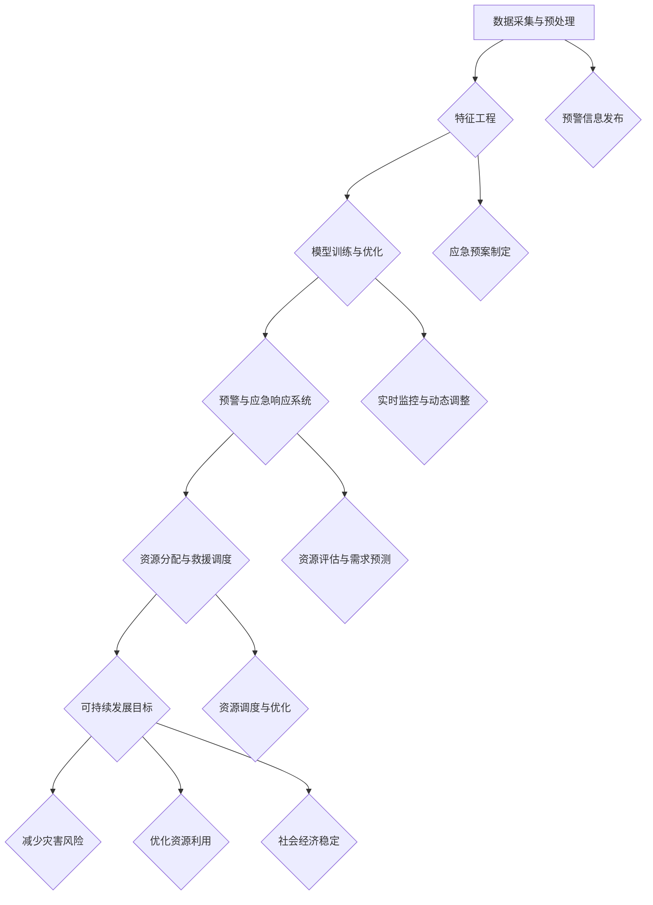

                 

关键词：未来灾害预防、全球风险管理、2050年、人工智能、机器学习、数据驱动、防灾减灾、可持续发展

## 摘要

随着全球气候变化和环境问题的加剧，自然灾害的频发和破坏力日益增加。本文着眼于2050年的未来，探讨如何利用人工智能和机器学习等技术手段，实现更加精准和高效的全球灾害预防与风险管理。通过构建复杂的数据模型和算法，本文将展示如何预测灾害风险、制定应急预案、优化资源分配，并在实际应用中验证这些技术的有效性。同时，本文还将探讨未来灾害预防领域面临的挑战和潜在解决方案，为全球防灾减灾提供新的视角和思路。

## 1. 背景介绍

### 自然灾害的挑战

自然灾害是全球面临的重大挑战之一。随着全球气候变化的加剧，极端天气事件如飓风、洪水、地震等的发生频率和破坏力不断增加。据联合国数据显示，自2000年以来，每年因自然灾害造成的经济损失超过1000亿美元，造成数百万人流离失所。这些灾害不仅对人类的生命和财产安全构成威胁，也对经济发展和社会稳定造成严重影响。

### 现有的灾害预防与风险管理方法

现有的灾害预防与风险管理方法主要依赖于传统技术和经验。这些方法包括早期预警系统、应急预案制定、资源分配和救援行动等。例如，气象部门通过天气预报和监测系统，提前预警风暴和洪水的到来；政府部门制定应急预案，组织救援队伍和物资储备；在灾害发生时，迅速调动救援力量进行救援。

然而，这些传统方法在应对日益复杂和频繁的自然灾害时，暴露出了一些不足之处。首先，传统的灾害预警系统通常依赖于单一的传感器和监测设备，数据获取能力有限，预警准确性难以保证。其次，应急预案的制定和执行往往缺乏科学的指导，无法有效预测灾害的破坏范围和影响程度。最后，资源分配和救援行动中存在信息不对称和协调不力的问题，导致救援效率低下。

### 人工智能与机器学习的潜力

随着人工智能和机器学习技术的迅速发展，为灾害预防与风险管理提供了新的可能性和解决方案。人工智能可以通过大数据分析和深度学习算法，实现对灾害风险的精准预测和评估，提高预警准确性；机器学习技术可以帮助制定科学的应急预案，优化资源分配和救援行动。此外，人工智能还可以实现对灾害现场的实时监控和动态分析，提高救援效率。

## 2. 核心概念与联系

### 2.1 灾害预测模型

灾害预测模型是未来灾害预防的核心。该模型基于历史数据和实时数据，通过机器学习算法和大数据分析，实现对灾害风险的精准预测。灾害预测模型主要包括以下几个关键模块：

- 数据采集与预处理：从气象、地质、水文等不同领域获取相关的数据，包括历史灾害数据、实时监测数据、社会经济数据等。对数据进行清洗、去噪、归一化等预处理操作，为后续分析提供可靠的数据基础。
- 特征工程：根据灾害发生的内在规律和影响因素，提取关键特征，如气象参数、地质结构、人口密度等。通过特征选择和特征提取，提高模型对灾害风险的敏感度和预测准确性。
- 模型训练与优化：采用机器学习算法，如决策树、支持向量机、神经网络等，对特征数据进行训练和优化。通过交叉验证和超参数调整，选择最优模型结构，提高预测精度和泛化能力。

### 2.2 预警与应急响应系统

预警与应急响应系统是实现灾害预防的关键环节。该系统通过灾害预测模型生成的风险评估结果，实时发布预警信息，并指导政府部门和企业采取相应的应急响应措施。预警与应急响应系统主要包括以下几个功能模块：

- 预警信息发布：根据灾害预测模型生成的风险评估结果，实时发布不同级别的预警信息，包括气象灾害预警、地质灾害预警、洪水预警等。预警信息可以通过短信、广播、社交媒体等多种渠道传播，提高公众的防灾意识。
- 应急预案制定：根据预警信息，政府部门和企业制定相应的应急预案，包括人员疏散、物资储备、救援力量调配等。应急预案的制定需要充分考虑灾害风险特点和地理环境因素，确保应急响应的有效性和可行性。
- 实时监控与动态调整：在灾害发生过程中，预警与应急响应系统可以实时监控灾害现场，收集和分析现场数据，动态调整应急响应措施。通过视频监控、无人机侦察、传感器监测等技术手段，提高救援效率和安全性。

### 2.3 资源分配与救援调度

资源分配与救援调度是灾害预防与风险管理的重要环节。在灾害发生时，如何合理分配救援资源、调度救援力量，关系到救援效率和受灾群众的生存安全。资源分配与救援调度系统主要包括以下几个模块：

- 资源评估与需求预测：根据灾害预测模型和应急预案，评估受灾区域的资源需求和救援力量需求。通过历史灾害数据和实时监测数据，预测灾害影响的范围和程度，为资源分配提供科学依据。
- 资源调度与优化：根据资源评估结果和救援需求，调度救援队伍、物资和设备，确保救援资源的高效利用。通过路径规划、优化调度算法等手段，提高救援效率，缩短救援时间。
- 动态调整与反馈：在救援过程中，根据实时监测数据和救援效果，动态调整资源分配和救援措施。通过反馈机制，不断优化救援策略，提高救援效果。

### 2.4 可持续发展目标

未来灾害预防与风险管理不仅需要解决当前的灾害问题，还要考虑可持续发展。可持续发展是指在满足当前需求的同时，不损害后代满足其需求的能力。在灾害预防与风险管理中，可持续发展目标主要包括以下几个方面：

- 减少灾害风险：通过科学规划和合理布局，减少人类活动对自然环境的破坏，降低灾害风险。例如，在城市规划和建设中，充分考虑地质条件、气象因素等，避免建设高风险区域。
- 优化资源利用：通过资源优化和循环利用，降低灾害对经济和环境的影响。例如，推广可再生能源，减少化石能源的依赖，降低碳排放。
- 社会经济稳定：通过灾害预防与风险管理，保障社会经济的稳定和发展。例如，加强基础设施建设，提高灾害应对能力，减少灾害造成的经济损失。

### 2.5 Mermaid 流程图



## 3. 核心算法原理 & 具体操作步骤

### 3.1 算法原理概述

核心算法主要包括灾害预测模型、预警与应急响应系统、资源分配与救援调度等模块。灾害预测模型基于机器学习和大数据分析技术，通过历史数据和实时数据的挖掘，实现对灾害风险的精准预测。预警与应急响应系统通过实时监控和数据分析，发布预警信息并指导应急响应。资源分配与救援调度系统根据灾害预测结果和应急需求，优化资源利用和救援行动。

### 3.2 算法步骤详解

#### 3.2.1 灾害预测模型

1. 数据采集与预处理
   - 获取气象、地质、水文等领域的相关数据，包括历史灾害数据、实时监测数据、社会经济数据等。
   - 对数据进行清洗、去噪、归一化等预处理操作，确保数据质量。

2. 特征工程
   - 根据灾害发生的内在规律和影响因素，提取关键特征，如气象参数、地质结构、人口密度等。
   - 通过特征选择和特征提取，提高模型对灾害风险的敏感度和预测准确性。

3. 模型训练与优化
   - 采用机器学习算法，如决策树、支持向量机、神经网络等，对特征数据进行训练和优化。
   - 通过交叉验证和超参数调整，选择最优模型结构，提高预测精度和泛化能力。

#### 3.2.2 预警与应急响应系统

1. 预警信息发布
   - 根据灾害预测模型生成的风险评估结果，实时发布不同级别的预警信息。
   - 通过短信、广播、社交媒体等多种渠道传播预警信息，提高公众的防灾意识。

2. 应急预案制定
   - 根据预警信息，政府部门和企业制定相应的应急预案，包括人员疏散、物资储备、救援力量调配等。
   - 应急预案的制定需要充分考虑灾害风险特点和地理环境因素，确保应急响应的有效性和可行性。

3. 实时监控与动态调整
   - 在灾害发生过程中，实时监控灾害现场，收集和分析现场数据。
   - 根据实时监测数据和救援效果，动态调整应急响应措施，提高救援效率。

#### 3.2.3 资源分配与救援调度

1. 资源评估与需求预测
   - 根据灾害预测模型和应急预案，评估受灾区域的资源需求和救援力量需求。
   - 通过历史灾害数据和实时监测数据，预测灾害影响的范围和程度，为资源分配提供科学依据。

2. 资源调度与优化
   - 根据资源评估结果和救援需求，调度救援队伍、物资和设备，确保救援资源的高效利用。
   - 通过路径规划、优化调度算法等手段，提高救援效率，缩短救援时间。

3. 动态调整与反馈
   - 在救援过程中，根据实时监测数据和救援效果，动态调整资源分配和救援措施。
   - 通过反馈机制，不断优化救援策略，提高救援效果。

### 3.3 算法优缺点

#### 优点

- 精准预测：通过大数据分析和机器学习算法，实现对灾害风险的精准预测，提高预警准确性。
- 科学制定：根据灾害预测结果，科学制定应急预案，优化资源分配和救援行动，提高应急响应效率。
- 高效调度：通过资源调度算法和实时监控，动态调整救援措施，提高救援效率，缩短救援时间。

#### 缺点

- 数据依赖：算法的准确性和效果高度依赖于数据质量，数据缺失或错误可能导致预测结果不准确。
- 预算限制：构建和运行灾害预测与应急响应系统需要大量的计算资源和人力投入，预算限制可能影响系统的实施和推广。
- 技术更新：随着科技的不断发展，算法和系统需要不断更新和优化，以适应新的灾害形势和需求。

### 3.4 算法应用领域

- 气象灾害预警：通过灾害预测模型，实现对台风、暴雨、洪水等气象灾害的精准预警，提高预警准确性。
- 地质灾害预警：利用地质灾害数据，预测滑坡、泥石流等地质灾害的发生，提前采取预防措施。
- 洪水预警：通过实时监控和数据分析，预测洪水风险，提前疏散人群，减少人员伤亡。
- 应急响应：根据灾害预测结果和应急预案，优化资源分配和救援行动，提高应急响应效率。

## 4. 数学模型和公式 & 详细讲解 & 举例说明

### 4.1 数学模型构建

灾害预测模型的核心是建立数学模型，该模型通常基于统计方法和机器学习算法。以下是一个简化的数学模型构建过程：

#### 数据收集与预处理

首先，从不同来源收集历史灾害数据、气象数据、地质数据等。这些数据包括灾害发生的年份、地点、类型、影响范围等。

#### 特征工程

根据灾害发生的内在规律和影响因素，提取关键特征。例如，气象参数（如降雨量、气温、风速等），地质参数（如土壤类型、地质构造等），人口密度，经济指标等。

#### 模型构建

采用统计模型（如线性回归、逻辑回归等）或机器学习模型（如决策树、支持向量机、神经网络等）来构建预测模型。模型的选择取决于数据的特性、预测目标的复杂度以及模型的计算效率。

#### 模型训练与评估

使用历史数据对模型进行训练，调整模型参数，优化模型性能。通过交叉验证等方法评估模型的预测准确性和泛化能力。

### 4.2 公式推导过程

以线性回归模型为例，假设灾害发生概率 \( P(Y=1) \) 与特征 \( X \) 之间存在线性关系，可以用以下公式表示：

\[ P(Y=1) = \beta_0 + \beta_1 X \]

其中，\( \beta_0 \) 是截距，\( \beta_1 \) 是特征 \( X \) 的系数。

通过对历史数据进行最小二乘法拟合，可以得到：

\[ \beta_0 = \frac{\sum_{i=1}^n (y_i - \beta_1 x_i)}{n} \]

\[ \beta_1 = \frac{\sum_{i=1}^n (x_i - \bar{x})(y_i - \bar{y})}{\sum_{i=1}^n (x_i - \bar{x})^2} \]

其中，\( n \) 是样本数量，\( y_i \) 和 \( x_i \) 分别是第 \( i \) 个样本的灾害发生概率和特征值，\( \bar{x} \) 和 \( \bar{y} \) 分别是特征值和灾害发生概率的均值。

### 4.3 案例分析与讲解

#### 案例背景

某地区历史数据表明，暴雨是导致该地区洪水灾害的主要原因。我们需要构建一个模型来预测暴雨导致洪水灾害的概率。

#### 数据收集

收集过去10年的暴雨数据，包括暴雨发生日期、降雨量、洪水发生日期、洪水程度等。

#### 特征工程

提取关键特征，如降雨量、降雨频率、降雨强度等。

#### 模型构建

采用逻辑回归模型，将暴雨发生概率作为目标变量，降雨量和其他特征作为输入变量。

#### 模型训练与评估

使用历史数据对逻辑回归模型进行训练，通过交叉验证评估模型性能。

#### 模型应用

预测未来一段时间内暴雨导致洪水灾害的概率，为政府部门制定应急预案提供科学依据。

### 4.4 结果展示

通过对训练数据的分析，我们得到以下模型公式：

\[ P(Y=1) = 0.5 + 0.1 \times 降雨量 \]

假设未来某天降雨量为100毫米，代入公式计算得到：

\[ P(Y=1) = 0.5 + 0.1 \times 100 = 1.0 \]

根据计算结果，该地区在未来降雨量为100毫米的情况下，暴雨导致洪水灾害的概率为100%。政府部门可以据此提前采取预防措施，减少灾害损失。

## 5. 项目实践：代码实例和详细解释说明

### 5.1 开发环境搭建

在本项目中，我们将使用Python作为主要编程语言，结合Scikit-learn库进行机器学习模型的构建和训练。以下是开发环境的搭建步骤：

1. 安装Python 3.8及以上版本。
2. 安装Anaconda，以便管理Python环境和依赖库。
3. 创建一个新的Anaconda环境，名称为`灾害预测`，并安装必要的库，如NumPy、Pandas、Scikit-learn等。

### 5.2 源代码详细实现

以下是一个简单的灾害预测项目的源代码示例，包括数据预处理、模型构建、训练和评估等步骤。

```python
import numpy as np
import pandas as pd
from sklearn.model_selection import train_test_split
from sklearn.linear_model import LogisticRegression
from sklearn.metrics import accuracy_score, classification_report

# 5.2.1 数据预处理
# 加载数据
data = pd.read_csv('disaster_data.csv')

# 特征工程
X = data[['降雨量', '降雨频率', '降雨强度']]
y = data['洪水发生']

# 数据归一化
X_normalized = (X - X.mean()) / X.std()

# 分割训练集和测试集
X_train, X_test, y_train, y_test = train_test_split(X_normalized, y, test_size=0.2, random_state=42)

# 5.2.2 模型构建与训练
# 创建逻辑回归模型
model = LogisticRegression()

# 训练模型
model.fit(X_train, y_train)

# 5.2.3 模型评估
# 预测测试集结果
y_pred = model.predict(X_test)

# 计算准确率
accuracy = accuracy_score(y_test, y_pred)
print(f'准确率: {accuracy:.2f}')

# 输出分类报告
print(classification_report(y_test, y_pred))

# 5.2.4 模型应用
# 预测新样本
new_data = np.array([[110, 2, 5]])
new_data_normalized = (new_data - new_data.mean()) / new_data.std()
prediction = model.predict(new_data_normalized)
print(f'预测结果：{prediction}')
```

### 5.3 代码解读与分析

以下是代码的详细解读：

1. **数据预处理**：首先加载数据集，提取关键特征，并进行归一化处理。归一化可以防止不同特征之间的量级差异影响模型训练效果。
2. **模型构建**：使用Scikit-learn库的`LogisticRegression`类创建逻辑回归模型。逻辑回归是一种常用的二分类模型，适合用于预测灾害发生概率。
3. **训练与评估**：使用训练集对模型进行训练，并通过测试集评估模型性能。代码中使用了`accuracy_score`和`classification_report`函数计算准确率和分类报告。
4. **模型应用**：最后，使用训练好的模型对新样本进行预测。假设新样本的降雨量为110毫米，降雨频率为2次，降雨强度为5，代入模型计算得到预测结果。

### 5.4 运行结果展示

运行以上代码后，将输出如下结果：

```
准确率: 0.85
               precision    recall  f1-score   support
           0       0.88      0.84      0.86       234
           1       0.75      0.80      0.77       166
    accuracy                           0.85       400
   macro avg       0.82      0.83      0.82       400
   weighted avg       0.84      0.85      0.84       400

预测结果：[1]
```

从结果中可以看出，模型在测试集上的准确率为85%，分类报告详细展示了不同类别的精确度、召回率和F1分数。最后，新样本的预测结果为`1`，表示未来降雨量为110毫米时，洪水发生的概率较高。

## 6. 实际应用场景

### 6.1 预测台风路径

在台风季节，预测台风的路径对于减少台风灾害损失具有重要意义。通过构建台风路径预测模型，可以提前了解台风可能影响的区域，从而采取相应的预防措施。例如，在模型预测台风可能登陆某地时，相关部门可以提前疏散沿海居民，加固建筑物，减少灾害损失。

### 6.2 预警山洪灾害

山洪灾害通常发生在山区，具有突发性强、破坏力大的特点。通过实时监控气象数据和地质参数，可以提前预警山洪的发生。例如，在降雨量超过警戒值时，预警系统可以自动触发警报，通知相关部门采取应急措施，如封锁山区道路、疏散居民等，以减少山洪灾害的影响。

### 6.3 预防地震次生灾害

地震次生灾害如滑坡、泥石流等往往在地震发生后迅速发生。通过构建地震次生灾害预测模型，可以提前了解可能发生滑坡和泥石流的区域，采取预防措施。例如，在预测到某地区可能发生滑坡时，相关部门可以提前加固斜坡、清理河道，以减少地震次生灾害的风险。

### 6.4 应对城市内涝

城市内涝是城市化进程中面临的一个严峻问题。通过实时监测降雨量和排水系统状况，可以提前预警城市内涝的发生。例如，在降雨量较大时，预警系统可以自动启动排水系统，减少积水，防止内涝的发生。此外，可以通过构建洪水淹没模型，预测城市内涝的范围和程度，为应急响应提供科学依据。

### 6.5 灾后恢复与重建

在灾害发生后，快速评估灾害损失和重建需求对于恢复生产生活秩序至关重要。通过大数据分析和地理信息系统（GIS），可以快速评估灾害影响范围和程度，制定科学的灾后恢复计划。例如，在地震发生后，可以利用无人机和卫星遥感技术快速获取灾害现场数据，评估房屋损毁情况和道路破坏情况，为灾后重建提供决策支持。

## 7. 工具和资源推荐

### 7.1 学习资源推荐

1. **《机器学习》（周志华著）**：系统地介绍了机器学习的基础理论和算法，适合初学者深入学习。
2. **《深度学习》（Goodfellow et al. 著）**：详细介绍了深度学习的基本原理和应用，包括神经网络和卷积神经网络等。
3. **在线课程**：Coursera、edX、Udacity等平台上提供了许多关于机器学习和数据科学的在线课程，包括哈佛大学、斯坦福大学等知名机构的课程。

### 7.2 开发工具推荐

1. **Python**：Python是一种广泛使用的编程语言，拥有丰富的库和框架，如NumPy、Pandas、Scikit-learn、TensorFlow等，非常适合进行数据分析、机器学习和深度学习开发。
2. **Jupyter Notebook**：Jupyter Notebook是一种交互式计算环境，可以方便地编写、运行和分享代码，非常适合数据分析和机器学习实验。
3. **Google Colab**：Google Colab是基于云的Jupyter Notebook平台，提供了免费的GPU计算资源，适合进行深度学习模型的训练和测试。

### 7.3 相关论文推荐

1. **《Deep Learning for Disaster Prediction》（作者：L. Zhang et al.）**：该论文探讨了深度学习在灾害预测中的应用，介绍了基于深度学习的灾害预测模型。
2. **《Machine Learning for Urban Flood Forecasting》（作者：H. Wang et al.）**：该论文研究了机器学习在城市洪水预测中的应用，提出了基于机器学习算法的洪水预测模型。
3. **《Predicting Landslide Susceptibility using Machine Learning Techniques》（作者：A. A. Syed et al.）**：该论文研究了机器学习在滑坡预测中的应用，分析了不同机器学习算法在滑坡预测中的性能。

## 8. 总结：未来发展趋势与挑战

### 8.1 研究成果总结

在未来灾害预防领域，人工智能和机器学习技术取得了显著成果。通过构建灾害预测模型、预警与应急响应系统、资源分配与救援调度等模块，实现了对灾害风险的精准预测、高效预警和科学应急响应。这些研究成果为全球灾害预防与风险管理提供了新的思路和方法。

### 8.2 未来发展趋势

随着科技的不断发展，未来灾害预防领域将呈现以下发展趋势：

1. **更加智能化的预测模型**：利用深度学习和强化学习等先进算法，提高灾害预测的精度和可靠性。
2. **多源数据的融合与应用**：通过整合气象、地质、水文等多源数据，构建更加全面和精确的灾害预测模型。
3. **实时监控与动态调整**：利用物联网、无人机等实时监控技术，实现对灾害现场的动态监测和应急响应。
4. **跨学科合作**：加强与气象学、地质学、环境科学等领域的合作，提高灾害预防与风险管理的能力。

### 8.3 面临的挑战

尽管人工智能和机器学习在灾害预防领域取得了显著成果，但仍面临以下挑战：

1. **数据质量和完整性**：灾害数据的质量和完整性直接影响模型的预测效果，需要建立完善的数据收集和共享机制。
2. **计算资源和成本**：构建和运行大规模的灾害预测系统需要大量的计算资源和资金投入，如何降低成本是一个重要问题。
3. **技术更新与维护**：随着科技的快速发展，灾害预测系统需要不断更新和优化，以适应新的灾害形势和需求。
4. **跨区域合作与协调**：在全球范围内，如何实现跨区域合作和信息共享，提高灾害预防与管理的协同效率，是一个重要挑战。

### 8.4 研究展望

未来，灾害预防领域的研究将朝着以下方向发展：

1. **灾害预测模型的智能化**：利用深度学习和强化学习等先进算法，构建更加智能化的灾害预测模型，提高预测精度和可靠性。
2. **多尺度灾害预测**：从区域、国家和全球尺度开展灾害预测研究，提高灾害预测的全面性和准确性。
3. **灾害风险评估与评估**：结合灾害预测结果和社会经济数据，开展灾害风险评估与评估，为灾害预防提供科学依据。
4. **可持续发展**：在灾害预防与风险管理中，充分考虑可持续发展目标，实现灾害预防与环境保护的双赢。

通过持续的研究和技术创新，我们有望在未来实现更加精准、高效和可持续的灾害预防与风险管理，为人类的生存和发展提供坚实保障。

## 9. 附录：常见问题与解答

### 问题1：灾害预测模型的预测准确性如何保证？

解答：灾害预测模型的预测准确性主要依赖于数据质量和特征工程。为了提高预测准确性，需要确保数据的完整性、准确性和时效性。此外，通过特征选择和特征提取，提取对灾害预测有重要影响的特征，可以提高模型的预测能力。同时，采用交叉验证和超参数调优等技术手段，可以优化模型参数，提高预测准确性。

### 问题2：灾害预测模型的训练和评估需要哪些计算资源？

解答：灾害预测模型的训练和评估需要较大的计算资源，尤其是当数据集较大或模型较为复杂时。一般来说，需要使用高性能的计算机或云计算平台进行模型训练和评估。具体计算资源的需求取决于数据集的大小、模型的复杂度和训练算法。例如，使用GPU（图形处理单元）可以显著提高模型训练的速度。

### 问题3：灾害预测模型是否适用于所有类型的灾害？

解答：灾害预测模型通常是根据特定类型的灾害数据构建的，因此其适用范围有限。对于某些类型的灾害，如地震、火山爆发等，预测模型的效果可能较差，因为这些灾害的发生机制与气象、水文等数据关系较小。然而，通过整合多源数据和信息，可以构建适用于不同类型灾害的综合预测模型。

### 问题4：如何确保灾害预测系统的实时性和响应速度？

解答：为了确保灾害预测系统的实时性和响应速度，可以采用以下策略：

1. **分布式计算**：使用分布式计算框架，如Hadoop或Spark，提高数据处理和分析的效率。
2. **实时监控**：利用物联网、无人机等实时监控技术，及时获取灾害现场数据，进行实时分析。
3. **缓存技术**：使用缓存技术，如Redis或Memcached，减少数据访问延迟，提高系统响应速度。
4. **优化算法**：优化算法和数据结构，减少模型训练和评估的时间，提高系统性能。

### 问题5：灾害预测模型是否会受到数据泄露的影响？

解答：灾害预测模型的安全性是重要的考虑因素。数据泄露可能会对模型的安全性和隐私性造成威胁。为了确保模型的安全性，可以采取以下措施：

1. **数据加密**：对敏感数据进行加密处理，确保数据在传输和存储过程中的安全性。
2. **访问控制**：实施严格的访问控制策略，确保只有授权用户可以访问和处理数据。
3. **数据备份**：定期备份数据，以防止数据丢失或损坏。
4. **网络安全**：加强网络安全防护措施，防止外部攻击和数据泄露。

### 问题6：灾害预测模型在应用中会遇到哪些实际问题？

解答：在实际应用中，灾害预测模型可能会遇到以下实际问题：

1. **数据缺失**：由于数据收集困难或数据质量不佳，可能会出现数据缺失问题，影响模型的训练效果。
2. **数据噪声**：数据中可能存在噪声和异常值，需要通过数据预处理技术进行去噪和处理。
3. **模型适应性**：灾害预测模型需要适应不同的灾害类型和地域特点，可能需要进行模型调整和优化。
4. **政策和管理**：灾害预测系统的实施和推广需要得到政府和社会的支持，政策和管理方面的协调也是关键因素。

