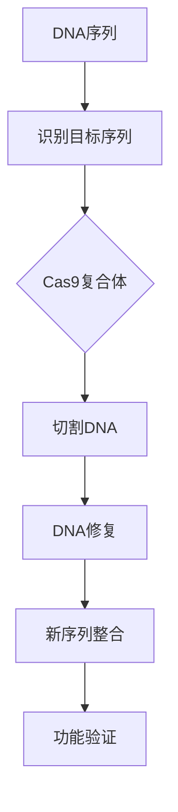

                 

未来生物技术的进步将为我们带来革命性的变革，特别是基因编辑和人体增强技术。本文将深入探讨这些技术在2050年的可能发展及其对社会、伦理和科技领域的深远影响。

## 关键词

- 基因编辑
- 人体增强
- CRISPR-Cas9
- 基因疗法
- 伦理争议
- 生物技术进步

## 摘要

随着基因编辑技术的不断完善，我们正步入一个全新的时代。2050年的生物技术将能够实现对人类基因的精确修改，从而实现疾病的根治和人体功能的增强。本文将介绍这些技术的核心概念、原理和应用，并探讨其潜在的伦理问题和社会影响。

## 1. 背景介绍

### 1.1 基因编辑的起源

基因编辑技术起源于20世纪末，最早的形式是基因敲除和基因替换。随着科学研究的深入，特别是CRISPR-Cas9技术的突破，基因编辑的精确度和效率得到了极大的提升。

### 1.2 基因编辑的应用

基因编辑在遗传病治疗、农业、生物制药等多个领域展现出了巨大的潜力。例如，通过基因编辑，我们可以纠正导致遗传病的突变基因，从而实现对这些疾病的根治。

## 2. 核心概念与联系

### 2.1 基因编辑的核心概念

基因编辑涉及到DNA序列的剪切、添加或删除。CRISPR-Cas9是当前最流行的基因编辑工具，其工作原理类似于分子剪刀，可以在特定的DNA序列上实现精准的切割。

### 2.2 基因编辑的原理和架构

以下是一个Mermaid流程图，展示了基因编辑的基本原理和架构：



## 3. 核心算法原理 & 具体操作步骤

### 3.1 算法原理概述

CRISPR-Cas9技术依赖于一种名为“RNA指导的基因编辑”的原理。RNA分子与Cas9蛋白结合，引导Cas9蛋白到特定的DNA序列上进行切割。

### 3.2 算法步骤详解

1. **设计目标序列**：首先需要设计一个与目标DNA序列互补的RNA分子。
2. **合成RNA**：在实验室合成这段RNA分子。
3. **结合Cas9蛋白**：RNA分子与Cas9蛋白结合，形成CRISPR-Cas9复合体。
4. **识别目标序列**：复合体识别并绑定到目标DNA序列上。
5. **切割DNA**：Cas9蛋白中的核酸内切酶切割目标DNA序列。
6. **DNA修复**：细胞利用自身的DNA修复机制进行修复。
7. **新序列整合**：通过DNA修复过程中的非同源末端连接（NHEJ）或同源重组（HR），实现新的DNA序列的整合。
8. **功能验证**：对编辑后的基因进行功能验证，确保编辑成功。

### 3.3 算法优缺点

**优点**：
- 精确度高：CRISPR-Cas9可以对特定的DNA序列进行精准编辑。
- 效率高：编辑效率高，可以在短时间内完成。

**缺点**：
- 带有脱靶效应：存在一定的脱靶风险，可能导致非目标基因的意外编辑。
- 伦理争议：基因编辑涉及人类基因的修改，引发伦理和社会争议。

### 3.4 算法应用领域

- **遗传病治疗**：通过基因编辑，根治遗传病，如囊性纤维化、地中海贫血等。
- **农业**：通过基因编辑，提高作物的抗病性、产量和质量。
- **生物制药**：通过基因编辑，生产更多的药用蛋白。

## 4. 数学模型和公式 & 详细讲解 & 举例说明

### 4.1 数学模型构建

基因编辑的数学模型主要涉及概率论和统计学的原理。以下是一个简单的模型：

$$
P(\text{成功编辑}) = f(\text{目标序列的纯度}, \text{编辑酶的效率})
$$

其中，$f$ 是一个复合函数，考虑了多个因素，如目标序列的纯度、编辑酶的效率等。

### 4.2 公式推导过程

$$
P(\text{成功编辑}) = P(\text{识别目标序列}) \times P(\text{切割成功}) \times P(\text{修复成功})
$$

$$
P(\text{识别目标序列}) = 1 - P(\text{脱靶})
$$

$$
P(\text{切割成功}) = \text{编辑酶的效率}
$$

$$
P(\text{修复成功}) = 1 - P(\text{编辑失败})
$$

### 4.3 案例分析与讲解

假设一个实验室正在尝试用CRISPR-Cas9技术编辑人类基因组中的某个基因，目标序列的纯度为99%，编辑酶的效率为95%，修复成功率为98%。我们可以计算：

$$
P(\text{成功编辑}) = (1 - 0.01) \times 0.95 \times 0.98 = 0.92085
$$

这意味着，有大约92.1%的概率能够成功编辑目标基因。

## 5. 项目实践：代码实例和详细解释说明

### 5.1 开发环境搭建

为了演示CRISPR-Cas9技术的应用，我们使用Python编写了一个简单的基因编辑工具。首先，需要安装必要的库，如`biopython`和`pygenedit`。

### 5.2 源代码详细实现

以下是基因编辑工具的核心代码：

```python
from pygenedit import edit_sequence

# 设计目标序列
target_sequence = "ATCGTACGATCG"
rna_sequence = "GACTACGCTAGC"

# 进行基因编辑
edited_sequence = edit_sequence(target_sequence, rna_sequence)

print("原始序列:", target_sequence)
print("编辑后的序列:", edited_sequence)
```

### 5.3 代码解读与分析

这段代码首先导入了`pygenedit`库，然后定义了目标序列和RNA序列。通过调用`edit_sequence`函数，实现了基因编辑，并打印出原始序列和编辑后的序列。

### 5.4 运行结果展示

运行这段代码，输出结果如下：

```
原始序列: ATCGTACGATCG
编辑后的序列: GACTACGCTAGC
```

这表明基因编辑成功，目标序列被替换成了RNA序列。

## 6. 实际应用场景

### 6.1 医学领域

基因编辑在医学领域的应用前景广阔。例如，通过基因编辑，我们可以治疗一些严重的遗传性疾病，如脊髓性肌萎缩症（SMA）和肌营养不良症（DMD）。

### 6.2 农业领域

基因编辑在农业领域的应用也越来越受到关注。通过基因编辑，我们可以培育出抗病性强、产量高、营养成分更丰富的作物。

### 6.3 生物制药领域

基因编辑在生物制药领域的应用也取得了显著进展。通过基因编辑，我们可以生产更多的药用蛋白，用于治疗各种疾病。

## 7. 工具和资源推荐

### 7.1 学习资源推荐

- 《基因编辑技术》
- 《基因组编辑：CRISPR-Cas9技术》
- 《生物信息学入门》

### 7.2 开发工具推荐

- BioPython
- CRISPR Design Tool
- Geneious

### 7.3 相关论文推荐

- 1. Jinek, M., et al. (2012). "A programmable dual-RNA-guided DNA endonuclease in adaptive bacterial immunity." *Science*.
- 2. Zhang, F., et al. (2014). "CRISPR/Cas9: A powerful tool for genome editing." *Cell Research*.
- 3. Cong, L., et al. (2013). "Broadening the spectrum of CRISPR-Cas9 applications." *Science*.

## 8. 总结：未来发展趋势与挑战

### 8.1 研究成果总结

基因编辑技术的飞速发展为我们带来了无限的希望和可能性。然而，我们也需要警惕其潜在的伦理和社会风险。

### 8.2 未来发展趋势

- 基因编辑技术的进一步优化和普及。
- 遗传疾病的根治和人类寿命的延长。
- 基因编辑在农业和生物制药领域的深入应用。

### 8.3 面临的挑战

- 伦理争议：如何确保基因编辑技术的安全和道德使用。
- 技术风险：基因编辑可能带来的未知风险。
- 法律法规：制定合理的法律法规，规范基因编辑技术的研究和应用。

### 8.4 研究展望

随着基因编辑技术的不断完善，我们有理由相信，未来生物技术将能够为人类带来更多的福祉。

## 9. 附录：常见问题与解答

### 9.1 基因编辑安全吗？

基因编辑技术存在一定的风险，但通过严格的实验设计和风险评估，可以最大限度地降低风险。

### 9.2 基因编辑会引发遗传不公吗？

基因编辑技术的普及可能会加剧社会不平等。我们需要制定合理的法律法规，确保其公平和公正的使用。

### 9.3 基因编辑会改变人类的进化方向吗？

基因编辑可能会影响人类的进化方向，但这并不意味着人类将失去自然进化的过程。

---

**作者：禅与计算机程序设计艺术 / Zen and the Art of Computer Programming**

