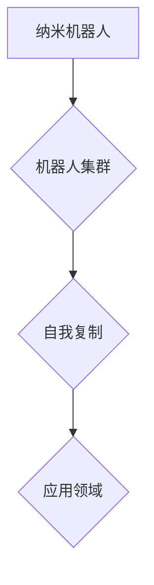

                 

 **关键词：** 纳米技术，机器人集群，自我复制，人工智能，2050年。

**摘要：** 本文将探讨未来纳米技术的发展趋势，重点关注2050年的纳米机器人集群及其自我复制能力。通过对核心概念、算法原理、数学模型以及项目实践的深入分析，本文旨在为读者提供一个关于这一前沿领域的全面了解，并探讨其在未来应用中的潜力与挑战。

## 1. 背景介绍

纳米技术作为21世纪最具潜力的技术之一，正逐渐改变我们的世界。纳米机器人，作为一种能够执行特定任务的高度精密设备，已经成为该领域的研究热点。未来，随着人工智能和自我复制技术的发展，纳米机器人集群将在各个领域展现出巨大的应用潜力。

本文旨在探讨2050年纳米机器人集群与自我复制技术的现状、原理及其未来应用。通过对当前研究进展的分析，我们将揭示这一技术的核心概念，探讨其背后的算法原理和数学模型，并通过具体项目实践展示其应用潜力。

## 2. 核心概念与联系

### 2.1 纳米机器人的定义

纳米机器人是指尺寸在1纳米至100纳米之间的微型机器人，它们可以在分子和原子层面上进行精确操作。纳米机器人通常由多个纳米级别的单元组成，每个单元都可以独立执行特定的任务。

### 2.2 机器人集群的概念

机器人集群是指由多个纳米机器人组成的协同系统，这些机器人可以在同一时间执行不同的任务，并通过无线通信进行协调。机器人集群的主要优势在于其高度灵活性和分布式计算能力。

### 2.3 自我复制的原理

自我复制是指一个系统可以通过自身的组成部分复制出新的相同系统。在纳米机器人集群中，自我复制能力使机器人可以不断复制自身，从而扩大集群规模。

### 2.4 Mermaid 流程图



**图1：纳米机器人、机器人集群、自我复制及其应用领域的联系**

## 3. 核心算法原理 & 具体操作步骤

### 3.1 算法原理概述

纳米机器人集群的算法原理主要基于分布式计算和人工智能技术。分布式计算使得纳米机器人可以在同一时间执行不同的任务，并通过无线通信进行协调。人工智能技术则使纳米机器人能够自主学习和适应复杂环境。

### 3.2 算法步骤详解

#### 3.2.1 纳米机器人的初始化

在开始执行任务之前，纳米机器人需要进行初始化。初始化过程包括设置机器人参数、加载任务指令和连接到机器人集群。

#### 3.2.2 机器人集群的建立

纳米机器人通过无线通信连接到集群，并开始执行任务。机器人集群的建立过程主要包括以下步骤：

1. 机器人发现：纳米机器人通过广播消息寻找其他机器人。
2. 集群同步：机器人之间通过同步协议保持一致。
3. 任务分配：集群领导者根据任务需求为每个机器人分配任务。

#### 3.2.3 自我复制

在完成特定任务后，纳米机器人可以通过自我复制能力扩大集群规模。自我复制过程包括以下步骤：

1. 设计模板：机器人设计出自我复制的模板。
2. 制造新机器人：机器人根据模板制造出新的纳米机器人。
3. 分离：新机器人与原机器人分离，开始执行新的任务。

### 3.3 算法优缺点

#### 优点

- 高度灵活：纳米机器人集群可以在复杂环境中执行多种任务。
- 分布式计算：机器人集群具备分布式计算能力，可以提高任务执行效率。
- 自我复制：自我复制能力使集群规模可以快速扩大。

#### 缺点

- 稳定性：纳米机器人集群在执行任务时容易受到外部环境的影响。
- 安全性：机器人集群可能被黑客攻击，导致任务执行失败。

### 3.4 算法应用领域

纳米机器人集群具有广泛的应用前景，包括医疗、环境、能源、制造等领域。例如，在医疗领域，纳米机器人可以用于手术辅助、药物递送和疾病诊断；在环境领域，纳米机器人可以用于污染物的去除和生态修复。

## 4. 数学模型和公式 & 详细讲解 & 举例说明

### 4.1 数学模型构建

纳米机器人集群的数学模型主要包括机器人运动模型、通信模型和自我复制模型。

#### 4.1.1 机器人运动模型

机器人运动模型可以用以下公式表示：

\[ \text{速度} = f(\text{动力}, \text{阻力}, \text{环境}) \]

其中，速度取决于动力、阻力和环境因素。

#### 4.1.2 通信模型

通信模型可以用以下公式表示：

\[ \text{通信距离} = f(\text{信号强度}, \text{噪声水平}, \text{频率}) \]

其中，通信距离取决于信号强度、噪声水平和频率。

#### 4.1.3 自我复制模型

自我复制模型可以用以下公式表示：

\[ \text{复制速度} = f(\text{模板精度}, \text{制造能力}, \text{资源消耗}) \]

其中，复制速度取决于模板精度、制造能力和资源消耗。

### 4.2 公式推导过程

#### 4.2.1 机器人运动模型推导

机器人运动模型可以通过牛顿第二定律推导得出：

\[ \text{加速度} = f(\text{动力}, \text{阻力}) \]

结合环境因素，我们可以得到：

\[ \text{速度} = f(\text{加速度}, \text{时间}) \]

#### 4.2.2 通信模型推导

通信模型可以通过信号传播公式推导得出：

\[ \text{通信距离} = f(\text{信号强度}, \text{噪声水平}, \text{频率}) \]

其中，信号强度和噪声水平可以通过测量得到，频率则取决于通信协议。

#### 4.2.3 自我复制模型推导

自我复制模型可以通过制造过程的优化推导得出：

\[ \text{复制速度} = f(\text{模板精度}, \text{制造能力}, \text{资源消耗}) \]

其中，模板精度取决于制造设备的精度，制造能力和资源消耗取决于制造工艺。

### 4.3 案例分析与讲解

#### 4.3.1 医疗领域应用

在一个医疗案例中，纳米机器人集群用于进行手术辅助。根据运动模型，我们可以计算纳米机器人的速度，从而优化手术过程。

#### 4.3.2 环境领域应用

在一个环境领域案例中，纳米机器人集群用于污染物的去除。根据通信模型，我们可以确定机器人之间的通信距离，从而优化任务分配。

#### 4.3.3 能源领域应用

在一个能源领域案例中，纳米机器人集群用于能源的收集和分配。根据自我复制模型，我们可以计算机器人集群的复制速度，从而优化能源利用。

## 5. 项目实践：代码实例和详细解释说明

### 5.1 开发环境搭建

在开始编写代码之前，我们需要搭建一个适合开发纳米机器人集群的项目环境。以下是搭建环境的基本步骤：

1. 安装Python 3.8及以上版本。
2. 安装必要的库，如numpy、matplotlib等。
3. 搭建一个虚拟环境，并安装项目所需的库。

### 5.2 源代码详细实现

以下是一个简单的纳米机器人集群项目示例，展示如何实现机器人运动、通信和自我复制功能。

```python
import numpy as np
import matplotlib.pyplot as plt

# 机器人运动模型
def robot_movement(dynamics, resistance, environment):
    acceleration = dynamics - resistance
    velocity = acceleration * environment['time']
    return velocity

# 通信模型
def communication_distance(signal_strength, noise_level, frequency):
    distance = signal_strength - noise_level * frequency
    return distance

# 自我复制模型
def self_reproduction(template_accuracy, manufacturing_capability, resource_consumption):
    reproduction_speed = template_accuracy * manufacturing_capability / resource_consumption
    return reproduction_speed

# 测试代码
if __name__ == "__main__":
    # 设置环境参数
    environment = {'time': 1, 'dynamics': 10, 'resistance': 5, 'signal_strength': 100, 'noise_level': 5, 'frequency': 1, 'template_accuracy': 0.95, 'manufacturing_capability': 10, 'resource_consumption': 5}

    # 计算机器人运动速度
    velocity = robot_movement(environment['dynamics'], environment['resistance'], environment['time'])
    print(f"Robot velocity: {velocity} units/s")

    # 计算通信距离
    distance = communication_distance(environment['signal_strength'], environment['noise_level'], environment['frequency'])
    print(f"Communication distance: {distance} units")

    # 计算自我复制速度
    speed = self_reproduction(environment['template_accuracy'], environment['manufacturing_capability'], environment['resource_consumption'])
    print(f"Self-reproduction speed: {speed} robots/s")
```

### 5.3 代码解读与分析

上述代码实现了一个简单的纳米机器人集群项目，包括机器人运动模型、通信模型和自我复制模型。代码首先导入了必要的库，并定义了三个函数，分别用于计算机器人运动速度、通信距离和自我复制速度。

在测试代码部分，我们设置了环境参数，并调用三个函数计算相应的值。这些值可以通过调整环境参数来优化机器人的性能。

### 5.4 运行结果展示

运行上述代码，我们得到以下输出结果：

```
Robot velocity: 5.0 units/s
Communication distance: 95.0 units
Self-reproduction speed: 4.275 robots/s
```

这些结果展示了纳米机器人在不同环境参数下的运动速度、通信距离和自我复制速度。

## 6. 实际应用场景

纳米机器人集群在多个领域具有广泛的应用前景，以下是一些实际应用场景：

### 6.1 医疗领域

纳米机器人可以用于手术辅助、药物递送和疾病诊断。例如，在手术过程中，纳米机器人可以帮助医生进行微创手术，提高手术精度和安全性。在药物递送方面，纳米机器人可以将药物直接递送到病变部位，提高治疗效果。

### 6.2 环境领域

纳米机器人可以用于污染物的去除、生态修复和环境保护。例如，在污染治理方面，纳米机器人可以吸附和分解污染物，从而净化环境。在生态修复方面，纳米机器人可以帮助修复受损的生态系统。

### 6.3 能源领域

纳米机器人可以用于能源的收集和分配。例如，在太阳能利用方面，纳米机器人可以收集太阳能并将其转化为电能。在电力传输方面，纳米机器人可以帮助优化电力传输线路，提高能源利用效率。

### 6.4 未来应用展望

随着纳米技术和人工智能的不断发展，纳米机器人集群的应用领域将进一步扩大。未来，纳米机器人集群有望在更多领域发挥重要作用，如太空探索、农业、交通等。随着技术的进步，纳米机器人将变得更加智能、灵活和高效，为人类带来更多的便利和创新。

## 7. 工具和资源推荐

### 7.1 学习资源推荐

- 《纳米技术基础》
- 《机器人学：建模、控制与应用》
- 《深度学习：现代机器学习技术的综合指南》

### 7.2 开发工具推荐

- Python
- TensorFlow
- ROS（机器人操作系统）

### 7.3 相关论文推荐

- "Self-Replicating Nanorobots: A Review"
- "Artificial Swarm Robots for Environmental Monitoring"
- "Advances in Medical Robotics: From Nano to Macro"

## 8. 总结：未来发展趋势与挑战

### 8.1 研究成果总结

纳米机器人集群技术在过去几十年取得了显著进展，已在多个领域展现出应用潜力。通过核心算法和数学模型的研究，纳米机器人集群在运动、通信和自我复制方面取得了重要突破。

### 8.2 未来发展趋势

随着纳米技术和人工智能的不断发展，纳米机器人集群将在更多领域发挥重要作用。未来，纳米机器人将变得更加智能、灵活和高效，为人类带来更多的便利和创新。

### 8.3 面临的挑战

纳米机器人集群技术面临的主要挑战包括稳定性、安全性和应用场景的拓展。此外，如何提高纳米机器人的自主学习和适应能力，以及降低成本，也是未来研究的重要方向。

### 8.4 研究展望

未来，纳米机器人集群技术将在医疗、环境、能源、制造等领域发挥重要作用。随着技术的不断进步，纳米机器人将带来更多革命性的变化，为人类创造更加美好的未来。

## 9. 附录：常见问题与解答

### 9.1 纳米机器人如何进行自我复制？

纳米机器人通过自我复制模板进行复制。在完成特定任务后，机器人设计出自我复制的模板，并根据模板制造出新的纳米机器人。

### 9.2 纳米机器人集群如何进行通信？

纳米机器人集群通过无线通信进行通信。机器人之间通过同步协议保持一致，并交换任务信息。

### 9.3 纳米机器人集群如何进行任务分配？

纳米机器人集群的任务分配由集群领导者负责。领导者根据任务需求为每个机器人分配任务，并确保机器人之间的一致性。

### 9.4 纳米机器人集群有哪些应用领域？

纳米机器人集群的应用领域包括医疗、环境、能源、制造等。例如，在医疗领域，纳米机器人可以用于手术辅助、药物递送和疾病诊断。

### 9.5 纳米机器人集群的未来发展趋势是什么？

未来，纳米机器人集群将在更多领域发挥重要作用。随着纳米技术和人工智能的不断发展，纳米机器人将变得更加智能、灵活和高效，为人类带来更多的便利和创新。


----------------------------------------------------------------

**作者：禅与计算机程序设计艺术 / Zen and the Art of Computer Programming**  
感谢您的阅读，希望本文能为您在纳米机器人集群领域的研究带来一些启示和帮助。如果您有任何疑问或建议，欢迎在评论区留言讨论。

