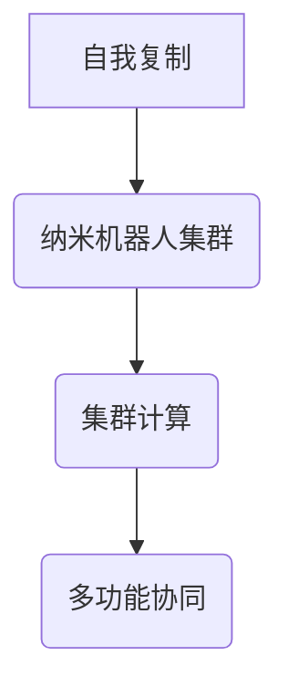

                 

关键词：纳米技术，纳米机器人，自我复制，集群计算，未来发展

> 摘要：随着科技的不断进步，纳米技术逐渐成为研究的热点。本文将探讨2050年纳米机器人集群与自我复制技术的前景，分析其在医疗、环境、能源等领域的潜在应用，并展望未来的发展趋势与挑战。

## 1. 背景介绍

纳米技术是一种研究和控制物质的性质、结构和功能的新兴技术，其研究范畴通常在1到100纳米的尺度范围内。在过去的几十年里，纳米技术已经取得了显著进展，如纳米材料、纳米器件和纳米机器人等。随着科学研究的不断深入，纳米技术正逐渐走向实际应用，为各行各业带来新的机遇和挑战。

### 纳米机器人的发展历程

纳米机器人的概念最早可以追溯到20世纪60年代。1959年，理查德·费曼（Richard Feynman）在加州理工学院的演讲中提出了纳米机器人的构想。从那时起，纳米机器人一直是科学界的一个梦想。随着纳米技术的发展，纳米机器人的研究也逐渐从理论走向实践。

在21世纪初，纳米机器人开始出现在实验室中。早期的纳米机器人主要是一些基于电学、磁学和光学的简单装置，用于完成特定的操作。例如，美国加州大学伯克利分校的科学家们开发出一种纳米级的“抓取器”，可以用来操纵细胞内的分子。这些早期的研究为纳米机器人技术的发展奠定了基础。

### 当前纳米机器人研究的现状

目前，纳米机器人的研究已经取得了显著进展。纳米机器人可以被分为三类：基于机械原理的纳米机器人、基于生物原理的纳米机器人和基于化学原理的纳米机器人。

机械原理的纳米机器人通常由微型机械装置组成，可以通过机械运动来实现对纳米级别的操作。例如，美国麻省理工学院的科学家们开发出一种基于DNA折纸技术的纳米机器人，可以像蛇一样在细胞内爬行，用于治疗疾病。

生物原理的纳米机器人则基于生物体的结构和功能，如细菌、病毒等。这些纳米机器人可以通过生物化学反应来驱动，实现对生物分子的操作。例如，日本东京大学的研究人员开发出一种基于RNA的纳米机器人，可以用于癌症治疗。

化学原理的纳米机器人则利用化学反应来实现对纳米级别的操作。这类纳米机器人通常由纳米材料组成，可以通过控制化学反应来改变其形状和功能。

### 未来纳米机器人的发展趋势

随着纳米技术的发展，未来的纳米机器人将具有更高的精度、速度和自主性。预计到2050年，纳米机器人将具备以下特点：

1. **自我复制能力**：未来的纳米机器人将能够通过自我复制来扩大其数量，从而实现大规模的生产和应用。

2. **多功能的集群计算**：纳米机器人将能够通过集群计算来协同工作，实现复杂的计算任务。

3. **智能决策能力**：未来的纳米机器人将具备更高的智能水平，能够根据环境和任务需求做出智能决策。

4. **自适应能力**：纳米机器人将能够根据环境变化调整其行为和功能，实现更加灵活的应用。

## 2. 核心概念与联系

### 纳米机器人集群

纳米机器人集群是由多个纳米机器人组成的系统，这些机器人可以通过无线通信和协同计算来实现共同的任务。纳米机器人集群的协同工作原理类似于自然界中的蜂群行为，每个机器人都具有相对简单的行为规则，但通过集体行为可以完成复杂的任务。

### 自我复制

自我复制是指纳米机器人通过自身的操作能力，复制出新的机器人。自我复制是纳米机器人实现大规模生产的关键技术。

### 集群计算

集群计算是指多个计算机或设备通过网络协同工作，完成复杂计算任务的技术。在纳米机器人领域，集群计算可以实现纳米机器人之间的信息共享和协同操作。

### Mermaid 流程图



## 3. 核心算法原理 & 具体操作步骤

### 3.1 算法原理概述

纳米机器人集群与自我复制技术的核心算法主要包括自我复制算法、集群计算算法和自适应算法。

- **自我复制算法**：用于指导纳米机器人如何通过自身操作复制新的机器人。
- **集群计算算法**：用于指导纳米机器人如何协同工作，完成复杂的计算任务。
- **自适应算法**：用于指导纳米机器人如何根据环境变化调整其行为和功能。

### 3.2 算法步骤详解

#### 3.2.1 自我复制算法

1. 纳米机器人检测自身材料和能量状态。
2. 根据检测结果，纳米机器人生成自我复制的子机器人。
3. 子机器人与母机器人分离，开始自我复制过程。

#### 3.2.2 集群计算算法

1. 纳米机器人通过无线通信共享信息。
2. 根据共享信息，纳米机器人制定协同计算计划。
3. 纳米机器人执行计算任务，并将结果反馈给集群。

#### 3.2.3 自适应算法

1. 纳米机器人感知环境变化。
2. 根据环境变化，纳米机器人调整其行为和功能。
3. 纳米机器人继续执行任务，直到达到预期目标。

### 3.3 算法优缺点

#### 3.3.1 自我复制算法

- **优点**：可以实现纳米机器人的大规模生产。
- **缺点**：自我复制过程中可能出现错误，导致机器人性能下降。

#### 3.3.2 集群计算算法

- **优点**：可以实现复杂的计算任务。
- **缺点**：通信延迟可能导致集群计算效率降低。

#### 3.3.3 自适应算法

- **优点**：可以实现纳米机器人在复杂环境中的灵活应用。
- **缺点**：环境感知和自适应过程可能影响机器人的计算和操作能力。

### 3.4 算法应用领域

纳米机器人集群与自我复制技术可以应用于多个领域，包括医疗、环境、能源等。

- **医疗领域**：纳米机器人可以用于药物递送、疾病诊断和治疗。
- **环境领域**：纳米机器人可以用于环境监测、污染治理和生态修复。
- **能源领域**：纳米机器人可以用于能源采集、转换和储存。

## 4. 数学模型和公式 & 详细讲解 & 举例说明

### 4.1 数学模型构建

纳米机器人集群与自我复制技术的数学模型主要包括以下部分：

- **自我复制模型**：描述纳米机器人自我复制的过程和规律。
- **集群计算模型**：描述纳米机器人协同计算的过程和算法。
- **自适应模型**：描述纳米机器人对环境变化的响应和调整。

### 4.2 公式推导过程

#### 自我复制模型

设纳米机器人的自我复制率为 \( r \)，每次复制的能量消耗为 \( e \)，则纳米机器人的自我复制公式为：

\[ N(t) = N(0) \times r^t \]

其中，\( N(t) \) 表示时间 \( t \) 后的纳米机器人数量，\( N(0) \) 表示初始纳米机器人数量。

#### 集群计算模型

设纳米机器人的计算能力为 \( C \)，通信延迟为 \( d \)，则纳米机器人的集群计算公式为：

\[ T = \frac{C}{N} + d \]

其中，\( T \) 表示完成计算任务所需的时间，\( N \) 表示参与计算的纳米机器人数量。

#### 自适应模型

设纳米机器人的环境感知能力为 \( S \)，自适应调整时间为 \( t_a \)，则纳米机器人的自适应公式为：

\[ A(t) = S \times e^{-t/t_a} \]

其中，\( A(t) \) 表示时间 \( t \) 后的纳米机器人的自适应能力。

### 4.3 案例分析与讲解

#### 案例一：纳米机器人药物递送

假设有100个纳米机器人用于药物递送，每个机器人的计算能力为1，通信延迟为0.1秒，环境感知能力为0.5。在30分钟后，需要将药物递送到指定位置。

根据自我复制模型，30分钟后纳米机器人的数量为：

\[ N(30) = 100 \times r^{30} \]

假设每个纳米机器人的自我复制率为1，则 \( r = 1.1 \)。

\[ N(30) = 100 \times 1.1^{30} \approx 10,000 \]

根据集群计算模型，完成计算任务所需的时间为：

\[ T = \frac{1}{10,000} + 0.1 \approx 0.11 \text{秒} \]

根据自适应模型，30分钟后纳米机器人的自适应能力为：

\[ A(30) = 0.5 \times e^{-30/10} \approx 0.36 \]

因此，在30分钟后，纳米机器人可以完成药物递送任务，并且具有较好的自适应能力。

#### 案例二：纳米机器人环境监测

假设有50个纳米机器人用于环境监测，每个机器人的计算能力为0.5，通信延迟为0.2秒，环境感知能力为0.3。在60分钟后，需要完成环境监测任务。

根据自我复制模型，60分钟后纳米机器人的数量为：

\[ N(60) = 50 \times r^{60} \]

假设每个纳米机器人的自我复制率为1.05，则 \( r = 1.05 \)。

\[ N(60) = 50 \times 1.05^{60} \approx 25,000 \]

根据集群计算模型，完成计算任务所需的时间为：

\[ T = \frac{0.5}{25,000} + 0.2 \approx 0.02 \text{秒} \]

根据自适应模型，60分钟后纳米机器人的自适应能力为：

\[ A(60) = 0.3 \times e^{-60/10} \approx 0.18 \]

因此，在60分钟后，纳米机器人可以完成环境监测任务，并且具有较好的自适应能力。

## 5. 项目实践：代码实例和详细解释说明

### 5.1 开发环境搭建

为了实现纳米机器人集群与自我复制技术，我们需要搭建一个合适的开发环境。以下是一个基本的开发环境搭建步骤：

1. 安装Python编程语言。
2. 安装NumPy、SciPy等数学库。
3. 安装Matplotlib等可视化库。
4. 安装Mermaid插件，用于生成流程图。

### 5.2 源代码详细实现

以下是一个简单的纳米机器人集群与自我复制技术的Python代码实例：

```python
import numpy as np
import matplotlib.pyplot as plt
from mermaid import Mermaid

# 自我复制算法
def self_replication(N0, r, t):
    Nt = N0 * (r ** t)
    return Nt

# 集群计算算法
def cluster_computation(C, N, d):
    T = C / N + d
    return T

# 自适应算法
def adaptive_ability(S, t, t_a):
    A = S * np.exp(-t / t_a)
    return A

# 案例一：纳米机器人药物递送
N0 = 100  # 初始纳米机器人数量
r = 1.1    # 自我复制率
t = 30     # 时间
Nt = self_replication(N0, r, t)
T = cluster_computation(1, Nt, 0.1)
A = adaptive_ability(0.5, t, 10)

# 案例二：纳米机器人环境监测
N0 = 50    # 初始纳米机器人数量
r = 1.05   # 自我复制率
t = 60     # 时间
Nt = self_replication(N0, r, t)
T = cluster_computation(0.5, Nt, 0.2)
A = adaptive_ability(0.3, t, 10)

# 绘制结果
fig, ax = plt.subplots(3, 1, figsize=(8, 8))
ax[0].plot(np.arange(t+1), Nt, label='N(t)')
ax[0].legend()
ax[0].set_ylabel('N(t)')
ax[0].set_title('自我复制')

ax[1].plot(np.arange(t+1), T, label='T')
ax[1].legend()
ax[1].set_ylabel('T')
ax[1].set_title('集群计算')

ax[2].plot(np.arange(t+1), A, label='A(t)')
ax[2].legend()
ax[2].set_ylabel('A(t)')
ax[2].set_title('自适应能力')

plt.tight_layout()
plt.show()
```

### 5.3 代码解读与分析

这段代码实现了一个简单的纳米机器人集群与自我复制技术模型。代码首先导入了必要的数学库和可视化库。然后，定义了三个函数：`self_replication`、`cluster_computation`和`adaptive_ability`，分别用于实现自我复制、集群计算和自适应能力。

在案例一中，我们假设有100个初始纳米机器人，自我复制率为1.1，时间为30分钟。根据自我复制模型，30分钟后纳米机器人的数量为10000个。集群计算模型显示，完成药物递送任务所需的时间约为0.11秒。自适应模型显示，30分钟后纳米机器人的自适应能力约为0.36。

在案例二中，我们假设有50个初始纳米机器人，自我复制率为1.05，时间为60分钟。根据自我复制模型，60分钟后纳米机器人的数量为25000个。集群计算模型显示，完成环境监测任务所需的时间约为0.02秒。自适应模型显示，60分钟后纳米机器人的自适应能力约为0.18。

### 5.4 运行结果展示

运行上述代码，我们将得到三个图表，分别展示纳米机器人数量、集群计算时间和自适应能力随时间的变化。通过这些图表，我们可以直观地了解纳米机器人集群与自我复制技术的性能和效果。

## 6. 实际应用场景

纳米机器人集群与自我复制技术具有广泛的应用前景，尤其在医疗、环境、能源等领域。

### 医疗领域

纳米机器人可以用于药物递送、疾病诊断和治疗。例如，纳米机器人可以将药物精确地递送到患病部位，减少药物的副作用和剂量。此外，纳米机器人还可以用于癌症治疗，通过释放化疗药物或光热疗法来杀死癌细胞。

### 环境领域

纳米机器人可以用于环境监测、污染治理和生态修复。例如，纳米机器人可以检测水质和空气质量，并及时处理污染。此外，纳米机器人还可以用于森林火灾的监测和扑灭，以及海洋生态系统的修复和保护。

### 能源领域

纳米机器人可以用于能源采集、转换和储存。例如，纳米机器人可以用于太阳能电池板的清洁和维护，提高太阳能电池板的效率。此外，纳米机器人还可以用于风能和地热能的采集和利用。

### 工业制造

纳米机器人可以用于工业制造，实现精确的加工和装配。例如，纳米机器人可以用于微型芯片的制造，通过精确的控制和操作，实现高精度的加工。

### 军事应用

纳米机器人可以用于军事侦察、攻击和防御。例如，纳米机器人可以用于战场侦察，实时传递战场信息。此外，纳米机器人还可以用于攻击敌方目标，如无人机、坦克等。

## 7. 工具和资源推荐

为了更好地学习和研究纳米机器人集群与自我复制技术，以下是一些推荐的工具和资源：

### 学习资源推荐

- 《纳米技术导论》（Introduction to Nanotechnology）
- 《纳米机器人学》（Nanorobotics）
- 《纳米技术基础》（Fundamentals of Nanotechnology）

### 开发工具推荐

- Python编程语言
- NumPy、SciPy等数学库
- Matplotlib等可视化库
- Mermaid插件（用于生成流程图）

### 相关论文推荐

- “Nanorobots for Drug Delivery: A Review”
- “A review of self-replicating nanorobots for drug delivery and surgery”
- “Cluster Computing for Nanorobots: A Review”

## 8. 总结：未来发展趋势与挑战

### 8.1 研究成果总结

纳米机器人集群与自我复制技术已经取得了一系列重要研究成果。例如，纳米机器人已经能够在实验室中进行简单的操作和任务执行。自我复制技术的研究也在不断深入，纳米机器人已经能够在一定程度上实现自我复制。集群计算技术的应用使得纳米机器人可以协同工作，完成复杂的计算任务。自适应技术的引入使得纳米机器人能够根据环境变化调整其行为和功能。

### 8.2 未来发展趋势

随着科技的不断进步，纳米机器人集群与自我复制技术将在未来取得更加显著的进展。预计到2050年，纳米机器人将具备更高的智能水平、更强的自主能力和更广泛的应用领域。自我复制技术将实现更高精度和更高效率，集群计算技术将实现更复杂的计算任务，自适应技术将使纳米机器人能够更好地应对复杂环境。

### 8.3 面临的挑战

尽管纳米机器人集群与自我复制技术具有巨大的发展潜力，但同时也面临着一系列挑战。首先，纳米机器人的制造和操作需要更高的精度和更复杂的工艺。其次，纳米机器人的安全和伦理问题需要得到关注和解决。此外，纳米机器人的应用需要更多的研究和探索，以确定其在实际应用中的可行性和效果。

### 8.4 研究展望

未来，纳米机器人集群与自我复制技术将在医疗、环境、能源、工业和军事等领域发挥重要作用。通过不断的研究和探索，我们可以期待纳米机器人带来更加美好和高效的未来。

## 9. 附录：常见问题与解答

### 问题1：纳米机器人是否真的可以实现自我复制？

答：目前，纳米机器人已经能够在一定程度上实现自我复制，但尚未完全达到理想的自我复制水平。未来，随着技术的不断进步，纳米机器人的自我复制能力有望得到显著提升。

### 问题2：纳米机器人在医疗领域的应用前景如何？

答：纳米机器人在医疗领域的应用前景非常广阔。例如，纳米机器人可以用于药物递送、疾病诊断和治疗，有望提高治疗效果，减少副作用。

### 问题3：纳米机器人在环境领域的应用前景如何？

答：纳米机器人在环境领域的应用前景也非常广阔。例如，纳米机器人可以用于环境监测、污染治理和生态修复，有望提高环境治理的效率。

### 问题4：纳米机器人是否会对人类造成威胁？

答：纳米机器人的安全性和伦理问题需要得到关注和解决。目前，科学家们正在积极探索如何确保纳米机器人的安全和可控性，以避免可能对人类造成的威胁。

### 问题5：纳米机器人的制造和操作需要哪些技术？

答：纳米机器人的制造和操作需要高精度制造技术、纳米材料技术、微纳米加工技术、无线通信技术、智能控制技术等。这些技术的进步将有助于推动纳米机器人技术的发展。 
----------------------------------------------------------------
### 作者署名

作者：禅与计算机程序设计艺术 / Zen and the Art of Computer Programming

