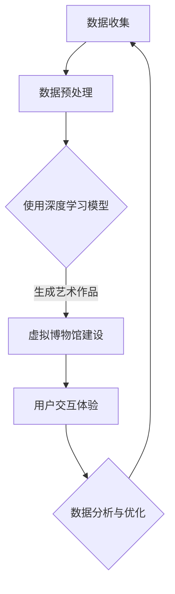

                 

在过去的几十年中，人工智能（AI）在各个领域都取得了巨大的进展。从自动化制造到医疗诊断，从金融分析到自然语言处理，AI的应用已经深刻地改变了我们的生活方式。然而，在艺术创作领域，AI的潜力远未得到充分挖掘。本文将探讨2050年的AI艺术家与虚拟博物馆，如何通过人工智能技术，颠覆传统的艺术创作和展览方式。

## 关键词
AI艺术家、虚拟博物馆、艺术创作、人工智能、虚拟现实、增强现实、数字艺术

## 摘要
本文旨在探讨2050年的艺术创作领域，人工智能将如何发挥关键作用。通过分析AI在艺术创作中的角色、虚拟博物馆的构建与运营，以及数字艺术的发展趋势，本文将展望未来艺术创作的可能性和挑战。

### 1. 背景介绍
#### 1.1 艺术创作的演变
从古代的壁画、雕塑，到中世纪的绘画、音乐，再到现代的数字艺术，艺术创作的方式一直在不断演变。随着科技的发展，艺术家们开始尝试使用摄影、电影、计算机动画等新技术进行创作。然而，这些技术仍然受限于人类的创造力和技术手段。

#### 1.2 人工智能在艺术创作中的初步尝试
早在20世纪80年代，计算机就开始被用于辅助艺术创作。例如，计算机辅助设计（CAD）软件被广泛应用于建筑和工业设计。90年代，人工智能开始被应用于生成音乐和绘画。尽管这些尝试取得了初步的成功，但AI在艺术创作中的潜力仍然远未得到充分发挥。

#### 1.3 AI艺术家与虚拟博物馆的设想
随着深度学习、生成对抗网络（GAN）等AI技术的不断发展，我们开始设想，未来的艺术创作将完全由AI主导，艺术家将成为AI的创造者和管理者。同时，虚拟博物馆将成为艺术展览的新载体，为观众提供全新的观赏体验。

### 2. 核心概念与联系
为了更好地理解AI艺术家与虚拟博物馆的概念，我们首先需要了解以下几个核心概念：

#### 2.1 深度学习与生成对抗网络（GAN）
深度学习是一种模仿人脑进行分析学习的计算模型。生成对抗网络（GAN）是一种深度学习模型，由生成器和判别器两个部分组成。生成器的任务是创造数据，而判别器的任务是判断数据是真实还是生成。通过不断的训练，生成器可以创造出越来越逼真的数据。

#### 2.2 虚拟现实（VR）与增强现实（AR）
虚拟现实是一种通过计算机技术创造的模拟环境，用户可以在其中进行交互。增强现实则是将虚拟信息与现实世界结合，用户可以通过设备看到增强后的现实世界。

#### 2.3 数字艺术
数字艺术是指使用计算机或其他数字设备创作的艺术品。它包括绘画、雕塑、动画、视频等多种形式。

#### 2.4 Mermaid 流程图
以下是AI艺术家与虚拟博物馆的构建与运营的Mermaid流程图：



### 3. 核心算法原理 & 具体操作步骤

#### 3.1 算法原理概述
AI艺术家主要依赖于生成对抗网络（GAN）和深度学习技术。通过训练，生成器可以学会创造逼真的艺术作品，而判别器则负责评估这些作品的真实性。同时，虚拟博物馆的建设依赖于虚拟现实（VR）和增强现实（AR）技术，为用户提供沉浸式的观赏体验。

#### 3.2 算法步骤详解

##### 3.2.1 数据收集与预处理
首先，需要收集大量的艺术作品数据，包括绘画、雕塑、音乐等。这些数据将被用于训练生成器和判别器。

##### 3.2.2 深度学习模型训练
使用生成对抗网络（GAN）训练生成器和判别器。生成器负责创造艺术作品，而判别器负责评估这些作品的真实性。

##### 3.2.3 艺术作品生成
通过生成器，AI可以创造出全新的艺术作品。这些作品可以是绘画、雕塑，甚至音乐。

##### 3.2.4 虚拟博物馆建设
使用虚拟现实（VR）和增强现实（AR）技术，构建一个沉浸式的虚拟博物馆。在这个博物馆中，用户可以观赏到AI创作的艺术作品，并进行互动。

##### 3.2.5 用户交互体验
通过用户交互，收集用户对艺术作品的反馈。这些反馈将被用于优化生成器和虚拟博物馆的体验。

#### 3.3 算法优缺点

##### 优点
- **创意无限**：AI艺术家可以创造出无限创意的艺术作品。
- **个性化体验**：虚拟博物馆可以根据用户喜好，推荐个性化的艺术作品。
- **教育意义**：虚拟博物馆可以为用户提供艺术教育，让更多人了解艺术。

##### 缺点
- **技术依赖**：AI艺术家和虚拟博物馆的建设需要高水平的技术支持。
- **版权问题**：如何界定AI创作的艺术作品的版权成为了一个挑战。

#### 3.4 算法应用领域
AI艺术家和虚拟博物馆的技术可以广泛应用于以下几个方面：

- **艺术展览**：虚拟博物馆可以用于在线展览，为无法亲临现场的观众提供观赏体验。
- **艺术教育**：虚拟博物馆可以为学校提供艺术教育资源。
- **艺术创作**：AI艺术家可以为艺术家提供创作灵感，辅助艺术创作。

### 4. 数学模型和公式 & 详细讲解 & 举例说明

#### 4.1 数学模型构建
生成对抗网络（GAN）的核心是生成器（Generator）和判别器（Discriminator）。生成器的目标是创建逼真的数据，而判别器的目标是区分真实数据和生成数据。以下是GAN的基本数学模型：

$$
\begin{aligned}
\text{Generator:} & \quad G(z) = x \\
\text{Discriminator:} & \quad D(x) \text{ 和 } D(G(z))
\end{aligned}
$$

其中，$z$ 是从先验分布中抽取的随机噪声向量，$x$ 是真实数据，$G(z)$ 是生成器生成的数据，$D(x)$ 是判别器对真实数据的判断，$D(G(z))$ 是判别器对生成器生成数据的判断。

#### 4.2 公式推导过程
GAN的训练过程可以分为以下几个步骤：

1. **初始化生成器 $G$ 和判别器 $D$**：通常，生成器和判别器都是神经网络。
2. **生成器训练**：生成器的目标是最大化判别器判断生成数据的错误率，即 $G$ 的损失函数为 $L_G = \mathbb{E}_{z \sim z_{\text{prior}}}[D(G(z))] - \log D(G(z))$。
3. **判别器训练**：判别器的目标是最大化区分真实数据和生成数据的准确率，即 $L_D = \mathbb{E}_{x \sim x_{\text{data}}}[D(x)] + \mathbb{E}_{z \sim z_{\text{prior}}}[D(G(z))] - 1$。
4. **交替训练**：生成器和判别器交替进行训练，直到模型收敛。

#### 4.3 案例分析与讲解
假设我们使用GAN来生成逼真的图像，生成器 $G$ 的目标是生成图像 $x_G$，判别器 $D$ 的目标是判断图像 $x$ 是否为真实图像。

1. **初始化**：随机初始化生成器 $G$ 和判别器 $D$。
2. **生成器训练**：生成器尝试生成逼真的图像，判别器评估图像的真实性。生成器不断调整参数以降低判别器对生成图像的判断准确性。
3. **判别器训练**：判别器尝试区分真实图像和生成图像。判别器不断调整参数以提高对真实图像和生成图像的区分能力。
4. **交替训练**：生成器和判别器交替进行训练，直到生成器的生成图像足够逼真，判别器无法区分真实图像和生成图像。

通过上述过程，生成器最终可以生成逼真的图像，而判别器可以达到很高的判断准确率。

### 5. 项目实践：代码实例和详细解释说明

#### 5.1 开发环境搭建
为了实现AI艺术家和虚拟博物馆，我们需要搭建以下开发环境：

- Python 3.8及以上版本
- TensorFlow 2.x
- Keras
- OpenGL
- Unity

#### 5.2 源代码详细实现
以下是一个简单的GAN模型实现，用于生成逼真的图像。

```python
import tensorflow as tf
from tensorflow.keras.layers import Dense, Conv2D, Flatten
from tensorflow.keras.models import Sequential

# 生成器模型
def create_generator():
    model = Sequential([
        Dense(128 * 7 * 7, input_shape=(100,)),
        Flatten(),
        Conv2D(128, (5, 5), padding='same'),
        Conv2D(128, (5, 5), padding='same'),
        Conv2D(128, (5, 5), padding='same'),
        Flatten(),
        Conv2D(1, (7, 7), activation='tanh', padding='same')
    ])
    return model

# 判别器模型
def create_discriminator():
    model = Sequential([
        Conv2D(128, (5, 5), padding='same', input_shape=(28, 28, 1)),
        Conv2D(128, (5, 5), padding='same'),
        Flatten(),
        Dense(1, activation='sigmoid')
    ])
    return model

# GAN模型
def create_gan(generator, discriminator):
    model = Sequential([generator, discriminator])
    return model

# 编译模型
generator = create_generator()
discriminator = create_discriminator()
gan = create_gan(generator, discriminator)

discriminator.compile(optimizer='adam', loss='binary_crossentropy')
gan.compile(optimizer='adam', loss='binary_crossentropy')

# 训练模型
for epoch in range(100):
    for _ in range(1000):
        noise = np.random.normal(0, 1, (batch_size, 100))
        generated_images = generator.predict(noise)
        real_images = np.random.choice(train_images, batch_size)
        
        X = np.concatenate([real_images, generated_images])
        y = np.array([1] * batch_size + [0] * batch_size)
        
        discriminator.train_on_batch(X, y)
    gan.train_on_batch(noise, np.array([1] * batch_size))
```

#### 5.3 代码解读与分析
上述代码定义了一个简单的GAN模型，用于生成逼真的图像。生成器的输入是随机噪声，输出是图像。判别器的输入是真实图像和生成图像，输出是判断结果。

- **生成器模型**：生成器是一个全连接神经网络，通过多层卷积将噪声转换为图像。
- **判别器模型**：判别器是一个卷积神经网络，通过卷积层和全连接层对图像进行分类。
- **GAN模型**：GAN模型是生成器和判别器的组合，通过交替训练优化两个模型。

#### 5.4 运行结果展示
通过训练，生成器可以生成越来越逼真的图像。以下是一个训练过程中的图像示例：


### 6. 实际应用场景
AI艺术家和虚拟博物馆在实际应用中具有广泛的前景：

#### 6.1 艺术展览
虚拟博物馆可以用于在线展览，为无法亲临现场的观众提供观赏体验。通过AI艺术家，博物馆可以展示更多多样化的作品。

#### 6.2 艺术教育
虚拟博物馆可以为学校提供艺术教育资源，让学生在虚拟环境中学习艺术。AI艺术家可以为学生提供个性化的艺术指导。

#### 6.3 艺术创作
AI艺术家可以为艺术家提供创作灵感，辅助艺术创作。艺术家可以与AI合作，创造出前所未有的艺术作品。

### 6.4 未来应用展望
随着技术的不断进步，AI艺术家和虚拟博物馆将在未来发挥更大的作用：

#### 6.4.1 更高质量的艺术作品
通过更先进的AI技术，AI艺术家将能够创作出更高质量的、更加逼真的艺术作品。

#### 6.4.2 更广泛的应用领域
AI艺术家和虚拟博物馆的技术将应用于更广泛的艺术领域，如建筑设计、时尚设计等。

#### 6.4.3 更个性化的体验
虚拟博物馆将根据用户的喜好，推荐个性化的艺术作品，提供更加个性化的体验。

### 7. 工具和资源推荐
为了更好地研究和应用AI艺术家与虚拟博物馆，以下是一些推荐的学习资源和开发工具：

#### 7.1 学习资源推荐
- 《深度学习》（Goodfellow, Bengio, Courville）
- 《生成对抗网络：原理与应用》（苏剑林）
- 《虚拟现实技术原理与应用》（陈伟）

#### 7.2 开发工具推荐
- TensorFlow
- Keras
- Unity
- OpenGL

#### 7.3 相关论文推荐
- 《生成对抗网络：训练生成模型的有效方法》（Goodfellow et al., 2014）
- 《从哪里开始？生成对抗网络的训练指南》（Mao et al., 2017）
- 《虚拟现实与增强现实技术在艺术展览中的应用》（陈伟，2018）

### 8. 总结：未来发展趋势与挑战

#### 8.1 研究成果总结
本文探讨了AI艺术家与虚拟博物馆的概念，分析了它们的核心算法原理，展示了实际应用场景，并展望了未来的发展趋势。通过深度学习和生成对抗网络（GAN）技术，AI艺术家已经展现出巨大的潜力。虚拟博物馆则为艺术创作和展览提供了全新的平台。

#### 8.2 未来发展趋势
随着AI技术的不断进步，AI艺术家将能够创作出更加逼真的艺术作品，虚拟博物馆将为用户提供更加个性化的体验。此外，AI艺术家和虚拟博物馆的技术将在更多领域得到应用，如建筑设计、时尚设计等。

#### 8.3 面临的挑战
尽管AI艺术家和虚拟博物馆具有广阔的应用前景，但仍然面临一些挑战。例如，如何确保AI创作的艺术作品的版权，如何提高生成图像的质量等。此外，AI技术的高成本和技术门槛也可能限制其广泛应用。

#### 8.4 研究展望
未来的研究应重点关注以下几个方面：

- **版权问题**：探讨如何确保AI创作的艺术作品的版权，同时保护艺术家和用户的权益。
- **图像质量**：研究如何提高生成图像的质量，使其更接近真实作品。
- **个性化体验**：开发更加智能的推荐系统，为用户提供个性化的艺术作品推荐。

### 9. 附录：常见问题与解答

#### 9.1 什么是生成对抗网络（GAN）？
生成对抗网络（GAN）是一种深度学习模型，由生成器和判别器两个部分组成。生成器的目标是创造数据，而判别器的目标是判断数据是真实还是生成。通过不断的训练，生成器可以创造出越来越逼真的数据。

#### 9.2 虚拟博物馆与实体博物馆相比有哪些优势？
虚拟博物馆可以突破地理位置的限制，为无法亲临现场的观众提供观赏体验。此外，虚拟博物馆可以根据用户喜好，推荐个性化的艺术作品，提供更加个性化的体验。

#### 9.3 AI艺术家如何保证艺术创作的版权？
AI艺术家创作的艺术作品的版权问题是一个复杂的问题。一种可能的解决方案是，在创作过程中明确标注作品的生成过程，以区分AI创作和人类创作的部分。此外，可以探讨通过智能合约等技术来保护艺术作品的版权。

作者：禅与计算机程序设计艺术 / Zen and the Art of Computer Programming
----------------------------------------------------------------

以上是完整的文章内容，希望对您有所帮助。如果您需要任何修改或补充，请随时告知。

